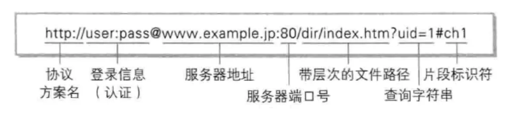
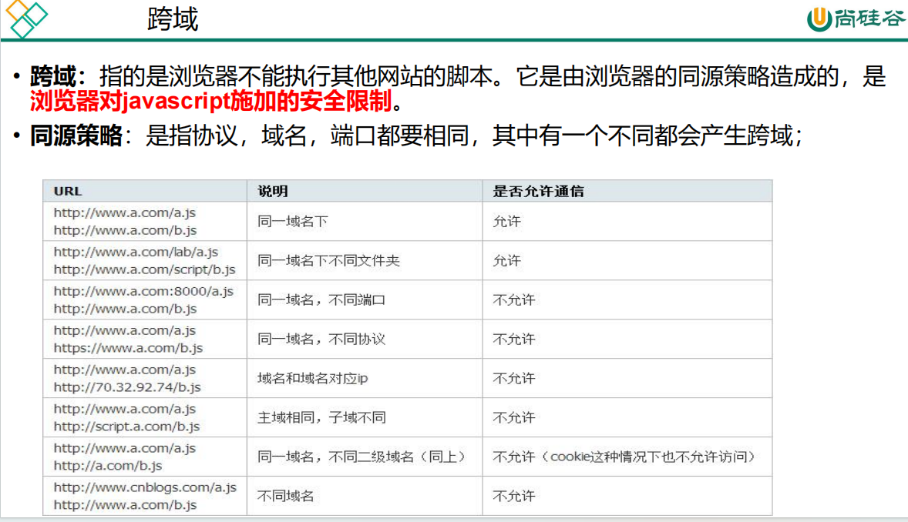
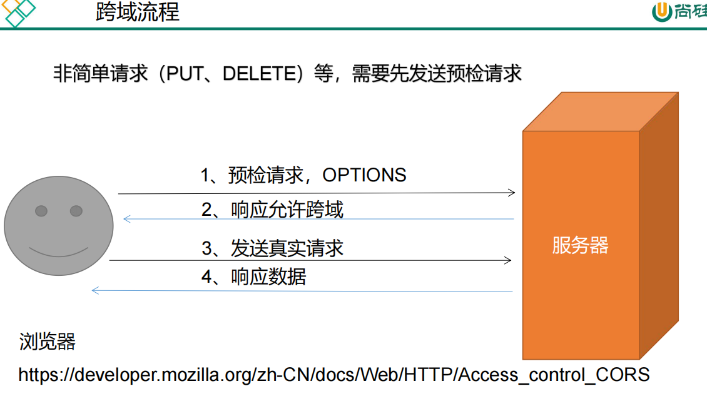
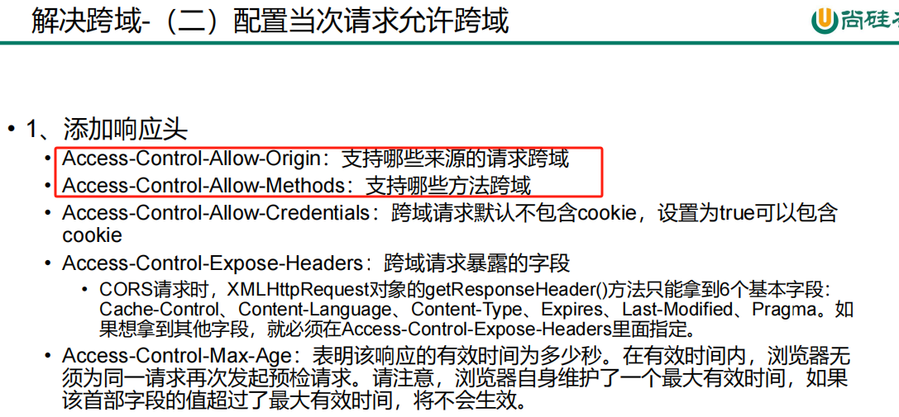
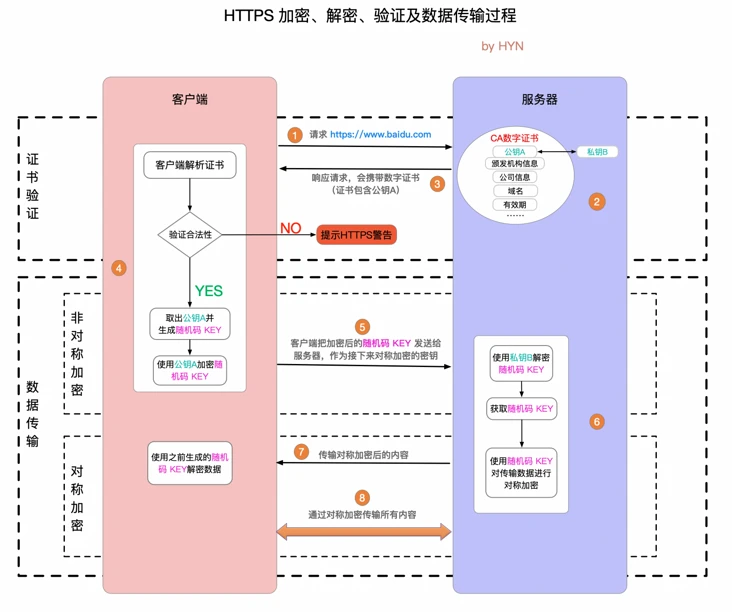

# 应用层

应用层主要讲解 HTTP 协议。

## 名词解释

- HTTP： HyperText Transfer Protocol， 超文本传输协议，表示可以传输多种数据格式，如文本信息、图片、音频、视频等；早期互联网只能传输文本信息，但是随着计算机技术的发展，需要展示图片、音频、视频的业务场景越来越多，所以叫超文本传输协议。
- **URI**：(Uniform Resource Identifier) 是**统⼀资源标志符**，由某个协议方法表示的资源的定位标识符，可以唯⼀标识⼀个资源，相当于要访问资源的“身份证号”。
- **URL**：(Uniform Resource Location) 是**统⼀资源定位符**，可以提供该资源的路径，相当于要访问资源的“家庭住址”。

## 常见的应用层软件

- 浏览器，如 Chrome（谷歌浏览器）、Safari、IE；
- 邮件客户端
- 各类开发工具客户端，如 navicat、RedisDesktop、postman、
- 命令行工具： curl

我们以在浏览器中访问某一个链接来从上至下来说明各个阶段的概念。

## URL 的组成

各类常见的应用层软件中都有一个 URL 的东西，其形式为： `[http|https]://[域名]:[port]/[文档路径]` 。



总的来说 URL 主要分为三个部分：

- `请求协议`，常见的有 http、 https、 smtp、 ftp、telnet 等；
- `主机位置`，包括主机名称和端口号；
- `资源位置`，即要访问的资源在服务器上的文件路径；

如： **http://www.server.com/dir1/files.html**：

- http ： 表示请求双方所采用的协议为 http 协议；
- www.server.com ： 为域名，会通过 DNS 协议转化成具体主机的 IP，使用域名是为了让人们更好的理解，作用是标识网络中的某台主机，本质上是电子设备的电子定位；隐含了默认的端口 80（默认 http 使用 80 端口，https 使用 443 端口）；
- /dir1/files.html ： 表示资源是在服务器上的 dir1 文件夹下的 file1.html 文件；

## 报文格式


总结：

```
// 请求报文与响应报文的格式相同
generic-message = start-line
                  *(message-header CRLF)     消息头
                  CRLF
                  [ message-body ]
start-line      = Request-Line | Status-Line

// **请求报文**中的 **消息头** 分为三个部分： 通用头 + 请求头 + 实体头
Request = Request-Line ; Section 5.1
*(( general-header ; Section 4.5            通用头
| request-header ; Section 5.3              请求头
| entity-header ) CRLF) ; Section 7.1       实体头
CRLF
[ message-body ] ; Section 4.3

// **响应报文**中的 **消息头** 分为三部分： 通用头 + 响应头 + 实体头
Response = Status-Line ; Section 6.1
*(( general-header ; Section 4.5            通用头
| response-header ; Section 6.2             响应头
| entity-header ) CRLF) ; Section 7.1       实体头
CRLF
[ message-body ] ; Section 7.2
```

- HTTP 协议报文有两类，一类是请求报文，一类是响应报文；这两类报文的格式都是： 开始行 + 消息头 + 消息体 的格式；
- **请求报文**
  - 开始行（start-line=Request-Line，此时也称为请求行），格式为： 请求方法 + 空格 + URI + 空格 + HTTP 版本；
  - 消息头（message-header， 此时也称为请求头），格式为 key: value 的形式，注意： 冒号后面有一个空格；并且请求头可以有多个；常见的有 Content-Type 等；
  - 消息体（message-body）的具体格式由 消息头 中的 Content-Type 限制；
- **响应报文**
  - 开始行（start-line=Status-Line，此时也称为状态行），格式为： HTTP 版本 + 空格 + 状态码 + 空格 + 状态原语；
  - 消息头（message-header）与请求报文中的消息头格式一致，只不过部分键值对有所区别；
  - 消息体（message-body）也与请求报文中的消息体格式一致；

参考[这里](http://files.blogjava.net/sunchaojin/http1.3.pdf) 。

## 消息头（message-header）

常见的 消息头 有：

| 消息头            | 描述                                                                                                                                                                                |
| :---------------- | ----------------------------------------------------------------------------------------------------------------------------------------------------------------------------------- |
| Cache-Control     |                                                                                                                                                                                     |
| Date              |                                                                                                                                                                                     |
| Transfer-Encoding |                                                                                                                                                                                     |
| Accept-Charset    | 能够接受的字符集                                                                                                                                                                    |
| Accept-Encoding   | 能够接受的编码方式列表                                                                                                                                                              |
| Accept-Language   | 能够接受的回应内容的自然语言列表。                                                                                                                                                  |
| User-Agent        | 浏览器的浏览器身份标识字符串                                                                                                                                                        |
| Host              | 服务器的域名(用于虚拟主机 )，以及服务器所监听的传输控制协议端口号。如果所请求的端口是对应的服务的标准端口，则端口号可被省略。自超文件传输协议版本 1.1（HTTP/1.1）开始便是必需字段。 |
| Range             | 仅请求某个实体的一部分。字节偏移以 0 开始。                                                                                                                                         |
| Accept-Ranges     | 这个服务器支持哪些种类的部分内容范围                                                                                                                                                |
| Age               | 这个对象在代理缓存中存在的时间，以秒为单位                                                                                                                                          |
| Location          | 用来 进行重定向，或者在创建了某个新资源时使用。                                                                                                                                     |
| Server            | 服务器的名字                                                                                                                                                                        |
| Set-Cookie        | 设置 cookie                                                                                                                                                                         |
| Content-Encoding  | 在数据上使用的编码类型。参考 超文本传输协议压缩 。                                                                                                                                  |
| Content-Language  | 内容所使用的语言                                                                                                                                                                    |
| Content-Type      | 当前内容的 MIME 类型                                                                                                                                                                |
| Expires           | 指定一个日期/时间，超过该时间则认为此回应已经过期                                                                                                                                   |

可参考这里-[HTTP 头字段](https://zh.wikipedia.org/wiki/HTTP%E5%A4%B4%E5%AD%97%E6%AE%B5)。

## 请求方法

```
Method = "OPTIONS" ; Section 9.2
| "GET" ; Section 9.3
| "HEAD" ; Section 9.4
| "POST" ; Section 9.5
| "PUT" ; Section 9.6
| "DELETE" ; Section 9.7
| "TRACE" ; Section 9.8
| "CONNECT" ; Section 9.9
| extension-method
extension-method = token
```

| 方法        | 描述                                                                 |
| :---------- | -------------------------------------------------------------------- |
| GET         | 向特定资源发送请求，查询数据，并返回实体                             |
| POST        | 向指定资源提交数据进行处理请求，可能会导致新的资源建立、已有资源修改 |
| PUT         | 向服务器上传新的内容                                                 |
| DELETE      | 请求服务器删除指定标识的资源                                         |
| HEAD        | 类似 GET 请求，返回的响应中没有具体的内容，用于获取报头              |
| **OPTIONS** | 可以用来向服务器发送请求来测试服务器的功能性                         |
| TRACE       | 回显服务器收到的请求，用于测试或诊断                                 |
| CONNECT     | HTTP/1.1 协议中预留给能够将连接改为管道方式的代理服务器              |

**get 和 Post 区别**：

|          | GET                                                             | POST                                                    |
| -------- | --------------------------------------------------------------- | ------------------------------------------------------- |
| 可见性   | 数据在 URL 中，所有人可见                                       | 数据不会显示在 URL 中                                   |
| 安全性   | 与 post 相比，get 的安全性较差，因为所发送的数据是 URL 的一部分 | 安全，因为参数不会被保存在浏览器历史或 web 服务器日志中 |
| 数据长度 | 受限制，最长 2kb                                                | 无限制                                                  |
| 编码类型 | `Content-type: application/x-www-form-urlencoded`               | `Content-type: multipart/form-data`                     |
| 缓存     | 能被缓存                                                        | 不能被缓存                                              |

::: tip OPTIONS 预请求 与 跨域







:::

## 响应状态

```
1xx: Informational - Request received, continuing process
2xx: Success - The action was successfully received, understood, and accepted
3xx: Redirection - Further action must be taken in order to complete the request
4xx: Client Error - The request contains bad syntax or cannot be fulfilled
5xx: Server Error - The server failed to fulfill an apparently valid request
```

常见状态码及其描述：

| 状态码                     | 描述                                                                   |
| :------------------------- | ---------------------------------------------------------------------- |
| 100：Continue              | 继续。客户端应继续其请求。                                             |
| 200：OK                    | 请求成功。一般用于 GET 与 POST 请求。                                  |
| 301：Moved Permanently     | 永久重定向。                                                           |
| 302：Found                 | 暂时重定向。                                                           |
| 400：Bad Request           | 客户端请求的语法错误，服务器无法理解。                                 |
| 403：Forbideen             | 服务器理解请求客户端的请求，但是拒绝执行此请求。                       |
| 404：Not Found             | 服务器无法根据客户端的请求找到资源（网页）。                           |
| 500：Internal Server Error | 服务器内部错误，无法完成请求。                                         |
| 502：Bad Gateway           | 作为网关或者代理服务器尝试执行请求时，从远程服务器接收到了无效的响应。 |

## 长链接、短链接

在 HTTP 早期版本中，客户端与服务器每进行一次通信，就会建立一个新的`连接`，`连接`在通信结束后随即销毁。这种 HTTP 的连接方式被称为 `短链接` 的方式。

`短链接` 事实上是通过传输层的 TCP 协议控制的，也就是说，客户端与服务器的每一次通信，都要经过 `三次握手` 和 `四次挥手` 。

可以看出： `短链接` 是有问题的。比如，一次通信过程中要请求一个 html 页面，这个 html 页面上有多个图片，那么`短链接`的方式就会创建多个`连接`，这就会产生频繁的创建和销毁的问题，频繁的创建和销毁，会对网络带宽等稀缺的服务器资源损耗很大，进而影响服务器的整体性能。

于是，从「 HTTP/1.1 」起，HTTP 的消息头信息中加入了 **Connection: keep-alive** 字段，解决了这个问题，让 HTTP 可以复用已经创建的连接资源。

::: tip
事实上， HTTP 协议的长连接和短连接，就是 TCP 协议的长连接和短连接。
:::

## 有状态、无状态、Cookie 与 Session

> 所谓 有状态 和 无状态 是指，在整个通信过程中，服务器能否记住客户端的状态。
>
> 有状态： 就是服务器端能够知道请求 A 是来自于客户端 a，不是来自于客户端 b；
> 无状态： 就是服务器端并不知道哪个请求来自于哪个客户端；

服务端往往接受来自 n 个客户端的请求，为减少各项资源的开销，HTTP 协议被设计成无状态协议。也就是说服务端并不知道哪个请求属于哪个客户端，因此要额外的技术手段来保证客户端的会话信息。

起先解决会话的问题的方式是，让每一个客户端的每一次请求都携带上自己的相关信息，但是这种方式会造成额外的性能损耗。

因此，后来又出现了 Cookie 的技术和 Session 的技术。

HTTP 协议属于无状态协议的，这种设计还是为了减轻性能损耗。但是这种方式也有弊端。那就是客户端必须每次都要携带能够标识自己身份的信息给到服务器端，这又造成了额外的性能损耗。

于是就产生了 Cookie 和 Session 的解决方案。

::: tip 举例说明

比如，某一个 OA 系统，每个员工都要登录系统进行打卡。业务逻辑是，先登录系统，然后再点击打卡按钮，并且要想打卡成功，就必须要先登录系统。

但是由于 HTTP 是无状态的，因此服务器端并不知道员工是否登录。

有了 Cookie 和 Session 后，在登录后的响应请求中，服务器就会对员工的用户的相关信息保存到服务器本地的 Session 列表中，然后再返回客户端一个 cookie 的 id，客户端把接收到的 cookie 的 id 存放到本地，后面员工执行打卡请求，就携带这个 cookie-id 给到服务器，服务器拿到整个 cookie-id 去保存的 session 列表中查询，就可以判断用户已经完成登录了。
:::

Cookie 和 Session 都是用来跟踪浏览器用户身份的会话方式，但两者有所区别：

- **作用范围不同**，Cookie 保存在客户端（浏览器），Session 保存在服务器端。
- **存取方式的不同**，Cookie 只能保存 ASCII，Session 可以存任意数据类型，一般情况下我们可以在 Session 中保持一些常用变量信息，比如说 UserId 等。
- **有效期不同**，Cookie 可设置为长时间保持，比如我们经常使用的默认登录功能，Session 一般失效时间较短，客户端关闭或者 Session 超时都会失效。
- **隐私策略不同**，Cookie 存储在客户端，比较容易遭到不法获取，早期有人将用户的登录名和密码存储在 Cookie 中导致信息被窃取；Session 存储在服务端，安全性相对 Cookie 要好一些。
- **存储大小不同**， 单个 Cookie 保存的数据不能超过 4K，Session 可存储数据远高于 Cookie。

分布式 Session 的问题： 在互联网公司为了可以支撑更大的流量，后端往往需要多台服务器共同来支撑前端用户请求，那如果用户在 A 服务器登录了，第二次请求跑到服务 B 就会出现登录失效问题。

分布式 Session 一般会有以下几种解决方案：

- **客户端存储**：直接将信息存储在 cookie 中，cookie 是存储在客户端上的一小段数据，客户端通过 http 协议和服务器进行 cookie 交互，通常用来存储一些不敏感信息
- **Nginx ip_hash 策略**：服务端使用 Nginx 代理，每个请求按访问 IP 的 hash 分配，这样来自同一 IP 固定访问一个后台服务器，避免了在服务器 A 创建 Session，第二次分发到服务器 B 的现象。
- **Session 复制**：任何一个服务器上的 Session 发生改变（增删改），该节点会把这个 Session 的所有内容序列化，然后广播给所有其它节点。
- **共享 Session**：服务端无状态话，将用户的 Session 等信息使用缓存中间件（如 Redis）来统一管理，保障分发到每一个服务器的响应结果都一致。
- 生产实践： 建议采用共享 Session 的方案。

## 重定向和转发

**重定向（Redirect）** 和 **转发（Forward）** 是 Web 开发中常见的两种请求处理方式，它们用于控制客户端请求的跳转和响应方式。虽然它们都能实现页面跳转，但其背后的机制和适用场景有所不同。

| 比较点        | 重定向（Redirect）                                   | 转发（Forward）                            |
| ------------- | ---------------------------------------------------- | ------------------------------------------ |
| HTTP 请求次数 | 两次（客户端发起两次请求）                           | 一次（服务器内部转发）                     |
| URL 变化      | 客户端 URL 会改变                                    | URL 保持不变                               |
| 是否跨域      | 可以跨域                                             | 不能跨域，必须在同一个应用内部             |
| 数据传递      | 不能通过请求对象传递数据，必须使用参数或 Session     | 可以通过请求对象传递数据（Request 对象）   |
| 性能开销      | 由于发起了新的请求，性能开销较大                     | 没有额外的请求，性能较好                   |
| 适用场景      | 跳转到其他网站或其他应用，防止表单重复提交，跨域跳转 | 在同一个应用内，多个组件协同处理同一个请求 |

- **重定向**：适用于需要通知客户端（浏览器）跳转，并且可能跳转到不同域名或服务器的情况，适合跨域或跨应用的跳转。
- **转发**：适用于服务器内部的跳转，在同一请求的上下文中进行，不会改变浏览器地址栏，适合同一个 Web 应用内的页面协作。

## HTTP 版本迭代

|              |        HTTP         | HTTPS                                        |
| :----------: | :-----------------: | -------------------------------------------- |
|     端口     |         80          | 443                                          |
|    安全性    | 无加密，安全性较差  | 有加密机制，安全性较高                       |
|   资源消耗   |        较少         | 由于加密处理，资源消耗更多                   |
| 是否需要证书 |       不需要        | 需要                                         |
|     协议     | 运行在 TCP 协议之上 | 运行在 SSL 协议之上，SSL 运行在 TCP 协议之上 |

1. 版本迭代

   - **HTTP1.0**：服务器处理完成后立即断开 TCP 连接（**无连接**），服务器不跟踪每个客户端也不记录过去的请求（**无状态**）
   - **HTTP1.1**：KeepAlived**长连接**避免了连接建立和释放的开销；通过 Content-Length 来判断当前请求数据是否已经全部接受（**有状态**）
   - **HTTP2.0**：引入二进制数据帧和流的概念，其中帧对数据进行顺序标识；因为有了序列，服务器可以**并行**的传输数据。

2. **http1.0 和 http1.1 的主要区别如下**

   - 缓存处理：1.1 添加更多的缓存控制策略（如：Entity tag，If-Match）
   - 网络连接的优化：1.1 支持断点续传
   - 错误状态码的增多：1.1 新增了 24 个错误状态响应码，丰富的错误码更加明确各个状态
   - Host 头处理：支持 Host 头域，不在以 IP 为请求方标志
   - 长连接：减少了建立和关闭连接的消耗和延迟。

3. **http1.1 和 http2.0 的主要区别**

   - 新的传输格式：2.0 使用二进制格式，1.0 依然使用基于文本格式
   - 多路复用：连接共享，不同的 request 可以使用同一个连接传输（最后根据每个 request 上的 id 号组合成正常的请求）
   - header 压缩：由于 1.X 中 header 带有大量的信息，并且得重复传输，2.0 使用 encoder 来减少需要传输的 hearder 大小
   - 服务端推送：同 google 的 SPDUY（1.0 的一种升级）一样

## HTTPS 的原理及过程



加密流程按图中的序号分为：

1. 客户端请求 HTTPS 网址，然后连接到 server 的 443 端口 (HTTPS 默认端口，类似于 HTTP 的 80 端口)。
2. 采用 HTTPS 协议的服务器必须要有一套数字 CA (Certification Authority)证书。颁发证书的同时会产生一个私钥和公钥。私钥由服务端自己保存，不可泄漏。公钥则是附带在证书的信息中，可以公开的。证书本身也附带一个证书电子签名，这个签名用来验证证书的完整性和真实性，可以防止证书被篡改。
3. 服务器响应客户端请求，将证书传递给客户端，证书包含公钥和大量其他信息，比如证书颁发机构信息，公司信息和证书有效期等。
4. 客户端解析证书并对其进行验证。如果证书不是可信机构颁布，或者证书中的域名与实际域名不一致，或者证书已经过期，就会向访问者显示一个警告，由其选择是否还要继续通信。如果证书没有问题，客户端就会从服务器证书中取出服务器的公钥 A。然后客户端还会生成一个随机码 KEY，并使用公钥 A 将其加密。
5. 客户端把加密后的随机码 KEY 发送给服务器，作为后面对称加密的密钥。
6. 服务器在收到随机码 KEY 之后会使用私钥 B 将其解密。经过以上这些步骤，客户端和服务器终于建立了安全连接，完美解决了对称加密的密钥泄露问题，接下来就可以用对称加密愉快地进行通信了。
7. 服务器使用密钥 (随机码 KEY)对数据进行对称加密并发送给客户端，客户端使用相同的密钥 (随机码 KEY)解密数据。
8. 双方使用对称加密愉快地传输所有数据。

## 应用层其它协议

> 应用层其它协议简单介绍

- DNS
- SMTP
- MQTT

1. DNS

有 dns 的地方，就有缓存。浏览器、操作系统、Local DNS、根域名服务器，它们都会对 DNS 结果做一定程度的缓存。本文总结一些常见的浏览器和操作系统的 DNS 缓存时间

浏览器先查询自己的缓存，查不到，则调用域名解析函数库对域名进行解析，以得到此域名对应的 IP 地址

DNS 查询顺序：浏览器缓存 → 系统缓存 → 路由器缓存 →ISP DNS 缓存 → 递归搜索

## CURL 查看报文格式的实验

<!-- @include: ./network/snippet/experiment.snippet.md -->
