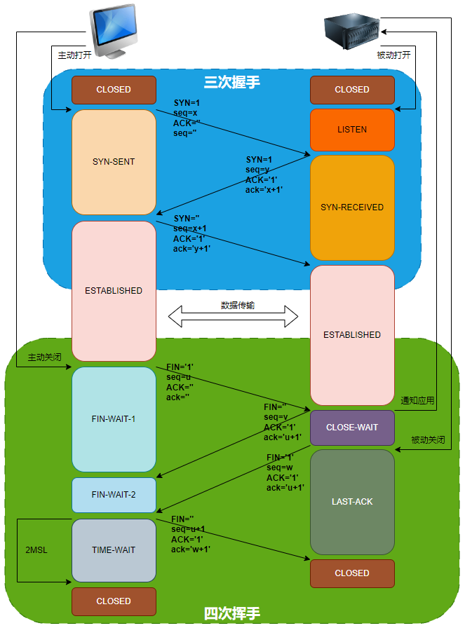
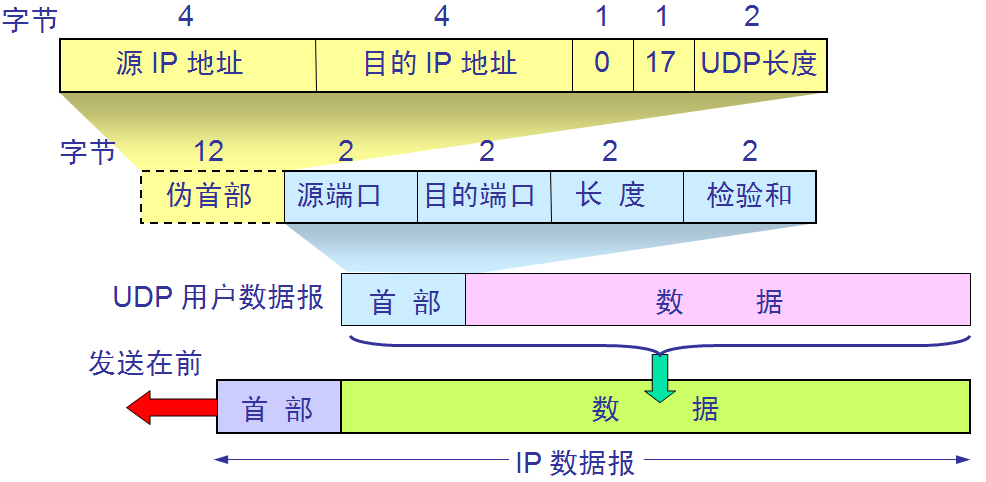

# 四层协议之传输层

::: tip 传输层-导学指引

> 这里的概念性的内容比较多，我们通过自己实现传输层的方式，把散乱的知识点串起来，并结合 Linux 网络编程的方式来深入了解这些概念。

假如让我们实现一个 TCP 协议的通信过程，我们应该如何设计？我们可以结合这个问题的解决过程来学习 TCP 协议的相关内容。

1. 应用层属于用户层面的功能，HTTP 构建了相应的报文后，就要往下传递了；`这个传递过程是借助操作系统层面提供的传输层的操作接口来实现的`；换言之，传输层的实现在现代计算机组成上，是操作系统的职责【注意不绝对哈，Linux 网络编程就例外】；
2. 根据 TCP 协议的职责可以，要有两个角色： `客户端` 和 `服务端`；
3. 客户端与服务器端的通信过程就可以抽象成下面三个步骤：
   1. `请求建立通道`：客户端请求服务器端给自己分配一个通信通道；
   2. `传输数据`：客户端与服务器端进行通信；
   3. `请求销毁通道`：通信完成后，销毁通信通道；
4. 在 `请求建立通道`过程中，要考虑几个问题：
   1. 服务器端并不知道客户端何时与自己通信：因此服务器端就打开一些连接，等着客户端来跟自己通信，于是有了服务器端的`被动打开（passive open）`的概念；
   2. 通信过程往往是多个客户端与同一个服务器端进行通信，客户端的每一个建立连接的请求信息都要求服务器端有所回应，这就会产生如何让客户端的请求和服务器端的响应进行对应的问题： TCP 通过对通信的数据格式进行规定来解决这个问题，使用多个字段来解决这个问题，如 seq 字段给请求和响应进行编号等；
   3. 客户端发送建立通道的请求时，可能会因为网络的问题设置重发，所以服务器端可能会有开启多个通道的情况，这就造成了资源浪费： TCP 采用三次握手的方式解决这个问题；
5. 在 `传输数据`的过程，要考虑以下几个问题
   1. 消息可能很大，需要多次发送，怎么办？对消息进行 `分组`。分组后如何确定完整性和顺序性？消息体中加字段：`消息编号+校验和+确认字段`；
   2. 消息丢失问题？那就要求每个消息都要有所响应，怎么实现？消息体中添加字段：`确认字段`；但是由于电气特性依然可能丢失，怎么办？`超时重试`！
   3. 网络电气特性等，可能出现的拥堵问题？`拥塞控制`！具体有四个手段：`慢开始 (slow-start)`、`拥塞避免 (congestion avoidance)`、`快速重传 (fast retransmit)`、`快速恢复 (fast recovery)`。
   4. 根据现代计算机组成原理，通信双方发送和接收的信息都是暂存到缓冲区的，也就是说一方不能一下子发送很多数据，因为缓冲区有限制，怎么办？`滑动窗口`！让一方发送数据时，有个时间窗口，在这个时间窗口内不要超出限制即可。【滑动窗口的技术手段可以保证缓冲区一边接收数据分组，一边消费数据分组】
   5. 加了滑动窗口之后，解决了一方无法一下子处理过多数据的问题，但是有网络带宽可能并没有压榨完，也就是说滑动窗口可能是动态的，那怎么办？`流量控制`，让双方协商，主动告诉对方能够处理的缓冲区的大小，让另一方酌情发送！
6. 在 `请求销毁通道`的过程中，也会出现一些问题：
   1. 客户端通信完成之后，服务器端能否主动关闭通道？不能。那怎么办？只能让客户端发送`请求销毁通道`的信息给服务器端。同理，服务器端通信完成之后，能不能让客户端主动关闭？也不能，也只能通过服务器端通知客户端关闭的方式关闭通道。
   2. 由于信息是分组发送的，就可能会出现客户端请求销毁通道的消息早于一些分组信息到达服务器端，如何解决？ 服务器端接到请求销毁通道的消息后不立刻关闭通道，而是等待一会儿；同理，客户端也是一样，也不能立刻关闭通道；那具体何时关闭呢？服务器端接收到请求销毁通道的消息后，等待所有的消息接受完毕，并且校验通过后，才发送出去关闭客户端的请求销毁通道的消息，并且还要等到客户端的响应之后才最终关闭；客户端接收到服务器端发送过来的请求销毁通道的消息后会立即响应，但是也要等待所有的服务器端的消息分组接收完毕，并且校验通过之后，才关闭通道；客户端和服务器端都关闭后，通道才算完成关闭；这就是四次挥手的过程！
7. 根据上述内容总结一下：
   1. `请求建立通道`过程： `三次握手`过程；
   2. `传输数据`的过程： 保证`可靠性的手段`（报文字段+超时控制+滑动窗口+流量控制+拥塞控制），并由此得出`TCP报文`的格式；
   3. `请求销毁通道`的过程： `四次挥手`；
   4. 在整个过程中，我们发现通信双方具有多个状态，因此还要了解通信双方状态的变化；
8. TCP 的一些实验：查看 TCP 报文、查看通信过程；
9. 学习完 TCP 之后，还要了解同一层的 UDP 协议的相关内容；
10. Java 网络关编程、Linux 网络编程；这个过程可能要了解 epoll 的相知识；

:::

#### 3.2.2. TCP 报文

TCP 报文包括两部分内容： TCP 头部 + 数据部分。

```log
 0                   1                   2                   3
 0 1 2 3 4 5 6 7 8 9 0 1 2 3 4 5 6 7 8 9 0 1 2 3 4 5 6 7 8 9 0 1
 0 1 2 3 4 5 6 7 8|0 1 2 3 4 5 6 7 8|0 1 2 3 4 5 6 7 8|0 1 2 3 4
+-+-+-+-+-+-+-+-+-+-+-+-+-+-+-+-+-+-+-+-+-+-+-+-+-+-+-+-+-+-+-+-+
|          Source Port          |       Destination Port        |
+-+-+-+-+-+-+-+-+-+-+-+-+-+-+-+-+-+-+-+-+-+-+-+-+-+-+-+-+-+-+-+-+
|                        Sequence Number                        |
+-+-+-+-+-+-+-+-+-+-+-+-+-+-+-+-+-+-+-+-+-+-+-+-+-+-+-+-+-+-+-+-+
|                    Acknowledgment Number                      |
+-+-+-+-+-+-+-+-+-+-+-+-+-+-+-+-+-+-+-+-+-+-+-+-+-+-+-+-+-+-+-+-+
|  Data |           |U|A|P|R|S|F|                               |
| Offset| Reserved  |R|C|S|S|Y|I|            Window             |
|       |           |G|K|H|T|N|N|                               |
+-+-+-+-+-+-+-+-+-+-+-+-+-+-+-+-+-+-+-+-+-+-+-+-+-+-+-+-+-+-+-+-+
|           Checksum            |         Urgent Pointer        |
+-+-+-+-+-+-+-+-+-+-+-+-+-+-+-+-+-+-+-+-+-+-+-+-+-+-+-+-+-+-+-+-+
|                    Options                    |    Padding    |
+-+-+-+-+-+-+-+-+-+-+-+-+-+-+-+-+-+-+-+-+-+-+-+-+-+-+-+-+-+-+-+-+
|                             data                              |
+-+-+-+-+-+-+-+-+-+-+-+-+-+-+-+-+-+-+-+-+-+-+-+-+-+-+-+-+-+-+-+-+

Note that: one tick mark represents one bit position.
```

- `源端口号` 和 `目的端口号` 可以理解为：应用程序在操作系统上的编号，服务端操作系统接收到客户端传过来的消息后，就是通过目的端口找到服务器上的具体的应用程序的；
- `序列编号` ： 单次传输的信息较大时，就会拆分成多个分组，每一个分组都有一个序列编号，它的存在是为了防止消息分组的错乱；
- `确认编号`： 期望收到的数据的开始序列号，也即已经收到的数据的字节长度加 1； 如客户端收到服务器端的确认消息，那么这个位置就为服务器端确认已经收到的 序列编号 + 1；
- `资料偏移`（4 bit）—以 4 字节为单位计算出的数据段开始地址的偏移值。
- `保留`（3 bit）—须置 0
- `标志符`（6 bit）
  - NS—ECN-nonce。ECN 显式拥塞通知（Explicit Congestion Notification）是对 TCP 的扩展，定义于 RFC 3540 （2003）。ECN 允许拥塞控制的端对端通知而避免丢包。ECN 为一项可选功能，如果底层网络设施支持，则可能被启用 ECN 的两个端点使用。在 ECN 成功协商的情况下，ECN 感知路由器可以在 IP 头中设置一个标记来代替丢弃数据包，以标明阻塞即将发生。数据包的接收端回应发送端的表示，降低其传输速率，就如同在往常中检测到包丢失那样。
  - CWR—Congestion Window Reduced，定义于 RFC 3168（2001）。
  - ECE—ECN-Echo 有两种意思，取决于 SYN 标志的值，定义于 RFC 3168（2001）。
  - URG—为 1 表示高优先级数据包，紧急指针字段有效。
  - ACK—为 1 表示确认号字段有效
  - PSH—为 1 表示是带有 PUSH 标志的数据，指示接收方应该尽快将这个报文段交给应用层而不用等待缓冲区装满。
  - RST—为 1 表示出现严重差错。可能需要重新建立 TCP 连接。还可以用于拒绝非法的报文段和拒绝连接请求。
  - SYN—为 1 表示这是连接请求或是连接接受请求，用于建立连接和使顺序号同步
  - FIN—为 1 表示发送方没有数据要传输了，要求释放连接。
- `窗口`（WIN，16 位长）—表示从确认号开始，本报文的发送方可以接收的字节数，即接收窗口大小。用于流量控制。
- `校验和`（Checksum，16 位长）—对整个的 TCP 报文段，包括 TCP 头部和 TCP 数据，以 16 位字进行计算所得。这是一个强制性的字段。
- `紧急指针`（16 位长）—本报文段中的紧急数据的最后一个字节的序号。

#### 3.2.3. 通道状态

客户端与服务器端通道的建立是基于状态机实现的，因此在建立通道的过程中，客户端程序和服务器端程序会有多个不同的状态，每一个状态都对应着不同的行为特征。下面列表代表着“一次通信过程中”客户端和服务器端的不同状态，这些状态中，有些只在客户端出现，有些只在服务器端出现，有些会同时出现。以 S 指代服务器，C 指代客户端，S&C 表示两者，S/C 表示两者之一：

- **LISTEN S** ：服务器等待从任意远程 TCP 端口的连接请求。
- **SYN-SENT C** ： 客户在发送连接请求后等待匹配的连接请求。通过 connect()函数向服务器发出一个同步（SYNC）信号后进入此状态。
- **SYN-RECEIVED S** ： 服务器已经收到并发送同步（SYNC）信号之后等待确认（ACK）请求。
- **ESTABLISHED S&C** ： 服务器与客户的连接已经打开，收到的数据可以发送给用户。数据传输步骤的正常情况。此时连接两端是平等的。这称作全连接。
- **FIN-WAIT-1 S&C** ： （服务器或客户）主动关闭端调用 close（）函数发出 FIN 请求包，表示本方的数据发送全部结束，等待 TCP 连接另一端的 ACK 确认包或 FIN&ACK 请求包。
- **FIN-WAIT-2 S&C** ： 主动关闭端在 FIN-WAIT-1 状态下收到 ACK 确认包，进入等待远程 TCP 的连接终止请求的半关闭状态。这时可以接收数据，但不再发送数据。
- **CLOSE-WAIT S&C** ： 被动关闭端接到 FIN 后，就发出 ACK 以回应 FIN 请求，并进入等待本地用户的连接终止请求的半关闭状态。这时可以发送数据，但不再接收数据。
- **CLOSING S&C** ： 在发出 FIN 后，又收到对方发来的 FIN 后，进入等待对方对己方的连接终止（FIN）的确认（ACK）的状态。少见。
- **LAST-ACK S&C** ： 被动关闭端全部数据发送完成之后，向主动关闭端发送 FIN，进入等待确认包的状态。
- **TIME-WAIT S/C** ： 主动关闭端接收到 FIN 后，就发送 ACK 包，等待足够时间以确保被动关闭端收到了终止请求的确认包。（按照 RFC 793，一个连接可以在 TIME-WAIT 保证最大四分钟，即最大分段寿命（maximum segment lifetime）的 2 倍）
- **CLOSED S&C** ： 完全没有连接。

需要注意的是：

1. 客户端可以主动发起关闭通道的请求，服务器端也有可能会主动发起关闭通道的请求。
2. 主动发起关闭通道的一方的状态变化一定是： FIN-WAIT-1 、 FIN-WAIT-2 、 TIME-WAIT 、 CLOSED ；而另一方的状态变化一定是： CLOSE-WAIT 、 LAST-ACK 、 CLOSED 。 也就是说四次挥手的状态是成对出现的。
3. 要特别注意的是建立通道后，通道属于全连接通道，也可以成为全工通道。主动发起关闭通道的请求的意思是：自己发送完成了，要主动关闭自己一端的发送功能了；而被动关闭也是指自己发送完了，也要关闭自己一端的发送功能了。
4. 一方发起关闭通道请求后，并不影响接收另一方消息的功能。也就是说客户端在 ESTABLISHED 状态发送的数据分组，可能到服务器端的 LAST-ACK

> 全工： 通道既可以发送消息，又可以接收消息。 半工： 只能接收或者只能发送。

#### 3.2.4. 请求建立通道

请求建立通道的过程，本质上是客户端请求服务器端给自己创建一个服务通道的过程。所采用的方式是： 三次握手方式，具体如下图。


如上图中三次握手部分，过程简述：

1. 客户端 给 服务端 发送同步消息，请求 服务端 开启一个通道；
2. 服务端 收到 同步消息 后，回复一个确认消息，表示通道已经开启，并在确认消息中添加同步信息，要求客户端再次回复；
3. 客户端 收到 确认消息后，再回复一个确认消息的确认消息，表示收到确认消息，握手结束，之后开始发送信息；

> - 问： 什么是被动开启？
> - 答： 客户端与服务器端无法同时开启通道，只能是服务器端资源就绪后进行监听来自客户端的建立通道的请求。
>
> - 问： 为什么不是两次握手？
> - 答： 防止客户端不按常理出牌——多次请求创建链接，却不发送数据，也有可能是因为服务器端发给客户端的 syn+ack 有些延迟，客户端发送了多次 syn；同样造成创建多次 sockfd。
>
> 问： 为什么不是四次握手？
> 答： 浪费了一次。
>
> 问： 什么是宏泛滥攻击？如何避免？
> 答：客户端利用多个虚拟的服务器给服务器发送 syn 的请求，导致服务器端 syn 队列耗尽的情况就是宏泛滥攻击， 可以通过防火墙、路由器等网关过滤；给 syn 队列设置大小，超过范围自动放弃；使用 syn cookie 技术等技术手段避免。
>
> 问： 三次握手后最后一步的 ACK 发送失败，会出现什么问题？
> 答： 三次握手第二步服务器端发送出去同步信息的 ACK 后，第三步服务器端没有接收到 ACK 信息。
> 服务器端会根据重试机制接着发送第二步的 ACK + SYN 的信息，多次后，客户端总能收到一个，于是客户端回复 ACK， 通道建立。
> 客户端发送出去 ACK 后，会默认为服务器端已经准备好 socketfd 等资源信息了，于是客户端直接发送数据分组了，当服务器端接收到数据分组后，发现并没有收到客户端的第三步的 ACK 信息，于是就发挥 RST 包（Reset，标示复位，用于异常的关闭连接）响应，告诉客户端重新发送 ACK 之后再发送数据分组。

#### 3.2.5. 传输数据

通道建立之后，就是数据的传输过程，这个过程中遇到的主要问题有两方面： 兼顾性能与链路拥堵的平衡 和 保证数据的正确性和完整性。因此在这个阶段的主要关注点就是解决这两个方面的问题，以保证消息的可靠性。

- 兼顾性能和链路拥堵的平衡
  - 问题描述： 链路传输过程中，上面的数据越饱和，则说明整个传输通道的性能越强，但是同时，也说明整个链路也会越拥堵；也就是说性能和链路是一对“鱼和熊掌”的关系。因此传输层就需要在这一对关系上进行取舍。
  - 超时重试： 如果一定时间内没有收到对方的响应信息，就会重新发送请求。
  - 滑动窗口： 根据现代计算机组成原理，通信双方发送和接收的信息都是暂存到缓冲区的，也就是说一方不能一下子发送很多数据，因为缓冲区有限制，怎么办？`滑动窗口`！让一方发送数据时，有个时间窗口，在这个时间窗口内不要超出限制。
  - 流量控制： 加了滑动窗口之后，解决了一方无法一下子处理过多数据的问题，但是有网络带宽可能并没有压榨完，也就是说滑动窗口可能是动态的，那怎么办？`流量控制`，让双方协商，主动告诉对方能够处理的缓冲区的大小，让另一方酌情发送！
  - 拥塞控制
    - 慢开始 (slow-start)： 不要一开始就发送大量的数据，由小到大逐渐增加拥塞窗口的大小。
    - 拥塞避免 (congestion avoidance)： 拥塞避免算法让拥塞窗口缓慢增长，即每经过一个往返时间 RTT 就把发送方的拥塞窗口 cwnd 加 1 而不是加倍。这样拥塞窗口按线性规律缓慢增长。
    - 快速重传 (fast retransmit)： 我们可以剔除一些不必要的拥塞报文，提高网络吞吐量。比如接收方在收到一个失序的报文段后就立即发出重复确认，而不要等到自己发送数据时捎带确认。快重传规定：发送方只要一连收到三个重复确认就应当立即重传对方尚未收到的报文段，而不必继续等待设置的重传计时器时间到期。
    - 快速恢复 (fast recovery)： 主要是配合快重传。当发送方连续收到三个重复确认时，就执行“乘法减小”算法，把 ssthresh 门限减半（为了预防网络发生拥塞），但接下来并不执行慢开始算法，因为如果网络出现拥塞的话就不会收到好几个重复的确认，收到三个重复确认说明网络状况还可以。
- 保证数据的正确性和完整性；
  - 序号和确认应答
  - 校验和
  - 超时重试
- 其它问题
  - TCP 粘包
    - 问题： 由于传输层传输的数据是分组的，并且由现代计算机组成原理决定，消息的发送和接收都是先存放到缓冲区的，因此就会遇到“多个分组被当成一个分组发送出去”和“多个分组到达后被当作一个分组进行处理”的问题。TCP 粘包的本质问题是数据分组的界限不明显。
    - 解决方案： 解决本质问题，也就是解决数据分组界限不明显的问题即可。具体解决办法有： 规定分组长度、使用转义字符表示分组结束、分组携带自身长度。

#### 3.2.6. 请求销毁通道

销毁通道的主要方式是四次挥手。客户端和服务器端都可以主动发起关闭通道的请求。下面是图示：



> MSL(Maximum Segment Lifetime)，报文最大生存时间，表示任何报文在网络上存在的最长时间，超过这个时间报文将被丢弃。

如上图四次挥手部分，过程简述：（以上图中客户端主动发起关闭通道的请求为例）

1. 客户端 发送 FIN 消息 给服务端，进入 FIN-WAITE-1 阶段，这个阶段不会再发送数据分组了；【好，我发完了哈】
2. 服务器端 收到 FIN 消息后，返回 FIN 的确认信息，并进入 CLOSE-WAITE 阶段，这个阶段依然可以接受客户端发送过来的数据分组；【中，我知道了，等我收完】
3. 客户端接收到 服务端发送回来的 确认消息 后，进入 FIN-WAITE-2 阶段，这个阶段依然可以接收服务端发送回来的数据分组；
4. 服务器端接收完客户端发送回来的数据分组后，给客户端发送 FIN 消息，并进入 LAST-ACK 阶段，这个阶段只收不发了；【好，我收完了，并且我也发完了】
5. 客户端收到 FIN 消息后进入 TIME-WAIT 阶段，这个阶段只接收服务端的数据分组，不再发送了；【中，我知道了，等我收完】
6. 客户端在 2MSL 后进入 CLOSED 阶段，整个通道关闭；

> 问： 为什么是四次挥手？
> 答： 主要有两个原因。一是通道是双工通道，每一端的通道都是一个资源，都需要进行关闭；二是一段接收到请求关闭通道的消息后不能立刻关闭，要等到对方的数据分组发送完毕才能进入下一步。
>
> 问： TIME-WAIT 状态的连接过多，怎么办？
> 答： 参见[网络面试题](../网络面试题.md)

#### 3.2.7. 总结

TCP 的一次完整的通信过程，大概图示如下图。


需要注意的是，上图只显示了客户端主动发起关闭通道的请求，事实上服务端也可以主动发起关闭通道的请求。

> 问： TCP 是如何保证可靠传输的？
> 答： 【提示： 从 （1. 保证链路可靠性）、（2. 保证数据的正确性和完整性） 与 （3. 兼顾性能和链路拥堵的平衡） 三方面答】
>
> 1. 保证链路可靠性： 采用了三次握手和四次挥手的方式处理通道开启和关闭的问题，保证了连接通道的可靠性；
> 2. 保证数据的正确性和完整性 方面采取了： 在报文头里面添加了 序号、 确认应答、 校验和 等字段，这些字段可以保证数据的正确性和完整性。
> 3. 兼顾性能和链路拥堵的平衡 方面采取了： 超时重试、滑动窗口、拥塞控制、控制流量等手段。

#### 3.2.8. TCP 实验

- [ ] TODO
- [ ] Windows 上 TCP 协议的使用 ： https://www.cnblogs.com/suv789/p/18035982
- Windows 下查看某一端口占用 https://blog.csdn.net/Oraclesand/article/details/77847255
- 查看报文
  - https://help.aliyun.com/zh/ecs/how-to-install-and-use-wireshark-in-windows
  - https://blog.csdn.net/a82514921/article/details/104609924
- 查看连接过程
- 终端命令行语法：
  - http://docopt.org/
  - https://hwame.top/20210112/command-line-description.html
  - https://blog.csdn.net/wq6ylg08/article/details/88919530
  - https://blog.csdn.net/weixin_42683556/article/details/115725069?spm=1001.2014.3001.5501

#### 3.2.9. TCP 与 UDP 区别

| 类型 |            特点            |          性能          |    应用过场景    | 首部字节 |     |
| ---- | :------------------------: | :--------------------: | :--------------: | :------: | --- |
| TCP  |   面向连接、可靠、字节流   | 传输效率慢、所需资源多 |  文件、邮件传输  |  20-60   |     |
| UDP  | 无连接、不可靠、数据报文段 | 传输效率快、所需资源少 | 语音、视频、直播 | 8 个字节 |     |



#### 3.2.10. 网络编程

- [ ] TODO Java 网络编程
