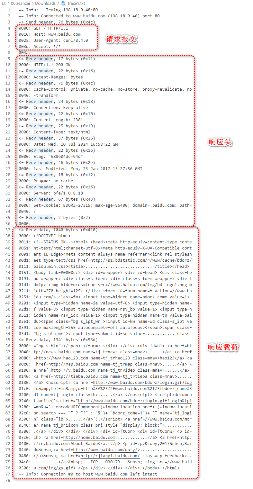

# 实验

## curl 简介

我们知道 HTTP 协议属于应用层协议，所以要想查看报文格式，就需要借助应用层的软件，Windows 平台上常见的能够发送 http 协议的应用层软件有两类：

- 可视化操作软件，如浏览器、抓包工具
- 命令行操作软件，如 curl、Telnet；

我们这里使用 curl 来查看一下 http 报文的相关内容，之所以不用 chrome 等浏览器，是因为这些浏览器做了一些技术手段的优化，不利于查看报文。

::: tabs

@tab cmd 查看 curl 版本

C:\Users\zeanzai>curl -V
curl 7.55.1 (Windows) libcurl/7.55.1 WinSSL
Release-Date: 2017-11-14, security patched: 2019-11-05
Protocols: dict file ftp ftps http https imap imaps pop3 pop3s smtp smtps telnet tftp
Features: AsynchDNS IPv6 Largefile SSPI Kerberos SPNEGO NTLM SSL

@tab git 查看 curl 版本

zeanzai@DESKTOP-BTBMQTM MINGW64 /d/00.zeanzai/Downloads
$ curl -V
curl 8.4.0 (x86_64-w64-mingw32) libcurl/8.4.0 Schannel zlib/1.3 brotli/1.1.0 zstd/1.5.5 libidn2/2.3.4 libpsl/0.21.2 (+libidn2/2.3.3) libssh2/1.11.0
Release-Date: 2023-10-11
Protocols: dict file ftp ftps gopher gophers http https imap imaps ldap ldaps mqtt pop3 pop3s rtsp scp sftp smb smbs smtp smtps telnet tftp
Features: alt-svc AsynchDNS brotli HSTS HTTPS-proxy IDN IPv6 Kerberos Largefile libz NTLM PSL SPNEGO SSL SSPI threadsafe UnixSockets zstd

:::

命令提示：

1. 参考[curl tutorial](https://curl.se/docs/tutorial.html)；
2. 直接在命令行中输入： `curl --help`；

## 实验一

```txt
zeanzai@DESKTOP-BTBMQTM MINGW64 /d/00.zeanzai/Downloads
$ curl -v www.baidu.com
  % Total    % Received % Xferd  Average Speed   Time    Time     Time  Current
                                 Dload  Upload   Total   Spent    Left  Speed
  0     0    0     0    0     0      0      0 --:--:-- --:--:-- --:--:--     0*   Trying 198.18.0.48:80...
* Connected to www.baidu.com (198.18.0.48) port 80
> GET / HTTP/1.1
> Host: www.baidu.com
> User-Agent: curl/8.4.0
> Accept: */*
>
  0     0    0     0    0     0      0      0 --:--:-- --:--:-- --:--:--     0
< HTTP/1.1 200 OK
< Accept-Ranges: bytes
< Cache-Control: private, no-cache, no-store, proxy-revalidate, no-transform
< Connection: keep-alive
< Content-Length: 2381
< Content-Type: text/html
< Date: Wed, 10 Jul 2024 17:11:19 GMT
< Etag: "588604dc-94d"
< Last-Modified: Mon, 23 Jan 2017 13:27:56 GMT
< Pragma: no-cache
< Server: bfe/1.0.8.18
< Set-Cookie: BDORZ=27315; max-age=86400; domain=.baidu.com; path=/
<
{ [1040 bytes data]
100  2381  100  2381    0     0  91626      0 --:--:-- --:--:-- --:--:-- 95240<!DOCTYPE html>
<!--STATUS OK--><html> <head><meta http-equiv=content-type content=text/html;charset=utf-8><meta http-equiv=X-UA-Compatible content=IE=Edge><meta content=always name=referrer><link rel=stylesheet type=text/css href=http://s1.bdstatic.com/r/www/cache/bdorz/baidu.min.css><title>百度一下，你就知道</title></head> <body link=#0000cc> <div id=wrapper> <div id=head> <div class=head_wrapper> <div class=s_form> <div class=s_form_wrapper> <div id=lg>  </div> <form id=form name=f action=//www.baidu.com/s class=fm> <input type=hidden name=bdorz_come value=1> <input type=hidden name=ie value=utf-8> <input type=hidden name=f value=8> <input type=hidden name=rsv_bp value=1> <input type=hidden name=rsv_idx value=1> <input type=hidden name=tn value=baidu><span class="bg s_ipt_wr"><input id=kw name=wd class=s_ipt value maxlength=255 autocomplete=off autofocus></span><span class="bg s_btn_wr"><input type=submit id=su value=百度一下 class="bg s_btn"></span> </form> </div> </div> <div id=u1> <a href=http://news.baidu.com name=tj_trnews class=mnav>新闻</a> <a href=http://www.hao123.com name=tj_trhao123 class=mnav>hao123</a> <a href=http://map.baidu.com name=tj_trmap class=mnav>地图</a> <a href=http://v.baidu.com name=tj_trvideo class=mnav>视频</a> <a href=http://tieba.baidu.com name=tj_trtieba class=mnav>贴吧</a> <noscript> <a href=http://www.baidu.com/bdorz/login.gif?login&tpl=mn&u=http%3A%2F%2Fwww.baidu.com%2f%3fbdorz_come%3d1 name=tj_login class=lb>登录</a> </noscript> <script>document.write('<a href="http://www.baidu.com/bdorz/login.gif?login&tpl=mn&u='+ encodeURIComponent(window.location.href+ (window.location.search === "" ? "?" : "&")+ "bdorz_come=1")+ '" name="tj_login" class="lb">登录</a>');</script> <a href=//www.baidu.com/more/ name=tj_briicon class=bri style="display: block;">更多产品</a> </div> </div> </div> <div id=ftCon> <div id=ftConw> <p id=lh> <a href=http://home.baidu.com>关于百度</a> <a href=http://ir.baidu.com>About Baidu</a> </p> <p id=cp>©2017 Baidu <a href=http://www.baidu.com/duty/>使用百度前必读</a>  <a href=http://jianyi.baidu.com/ class=cp-feedback>意见反馈</a> 京ICP证030173号   </p> </div> </div> </div> </body> </html>

* Connection #0 to host www.baidu.com left intact

```

1. -v, --verbose Make the operation more talkative（ /ˈtɑː.kə.t̬ɪv/ ，爱说话的，健谈的;多嘴的，详细的）
2. 输出结果


## 实验二

实验一报文格式并不明显，请看实验二。

我们输入 `curl --trace-ascii trace1.txt www.baidu.com` ：

```
zeanzai@DESKTOP-BTBMQTM MINGW64 /d/00.zeanzai/Downloads
$ curl --trace-ascii trace1.txt www.baidu.com
  % Total    % Received % Xferd  Average Speed   Time    Time     Time  Current
                                 Dload  Upload   Total   Spent    Left  Speed
100  2381  100  2381    0     0  91937      0 --:--:-- --:--:-- --:--:-- 99208<!DOCTYPE html>
<!--STATUS OK--><html> <head><meta http-equiv=content-type content=text/html;charset=utf-8><meta http-equiv=X-UA-Compatible content=IE=Edge><meta content=always name=referrer><link rel=stylesheet type=text/css href=http://s1.bdstatic.com/r/www/cache/bdorz/baidu.min.css><title>百度一下，你就知道</title></head> <body link=#0000cc> <div id=wrapper> <div id=head> <div class=head_wrapper> <div class=s_form> <div class=s_form_wrapper> <div id=lg>  </div> <form id=form name=f action=//www.baidu.com/s class=fm> <input type=hidden name=bdorz_come value=1> <input type=hidden name=ie value=utf-8> <input type=hidden name=f value=8> <input type=hidden name=rsv_bp value=1> <input type=hidden name=rsv_idx value=1> <input type=hidden name=tn value=baidu><span class="bg s_ipt_wr"><input id=kw name=wd class=s_ipt value maxlength=255 autocomplete=off autofocus></span><span class="bg s_btn_wr"><input type=submit id=su value=百度一下 class="bg s_btn"></span> </form> </div> </div> <div id=u1> <a href=http://news.baidu.com name=tj_trnews class=mnav>新闻</a> <a href=http://www.hao123.com name=tj_trhao123 class=mnav>hao123</a> <a href=http://map.baidu.com name=tj_trmap class=mnav>地图</a> <a href=http://v.baidu.com name=tj_trvideo class=mnav>视频</a> <a href=http://tieba.baidu.com name=tj_trtieba class=mnav>贴吧</a> <noscript> <a href=http://www.baidu.com/bdorz/login.gif?login&tpl=mn&u=http%3A%2F%2Fwww.baidu.com%2f%3fbdorz_come%3d1 name=tj_login class=lb>登录</a> </noscript> <script>document.write('<a href="http://www.baidu.com/bdorz/login.gif?login&tpl=mn&u='+ encodeURIComponent(window.location.href+ (window.location.search === "" ? "?" : "&")+ "bdorz_come=1")+ '" name="tj_login" class="lb">登录</a>');</script> <a href=//www.baidu.com/more/ name=tj_briicon class=bri style="display: block;">更多产品</a> </div> </div> </div> <div id=ftCon> <div id=ftConw> <p id=lh> <a href=http://home.baidu.com>关于百度</a> <a href=http://ir.baidu.com>About Baidu</a> </p> <p id=cp>©2017 Baidu <a href=http://www.baidu.com/duty/>使用百度前必读</a>  <a href=http://jianyi.baidu.com/ class=cp-feedback>意见反馈</a> 京ICP证030173号   </p> </div> </div> </div> </body> </html>

```

控制台输出响应时间信息和响应结果外，还在 /d/00.zeanzai/Downloads 下生成一个文件 trace1.txt ，我们打开这个文件：

::: details trace1.txt

```
== Info:   Trying 198.18.0.48:80...
== Info: Connected to www.baidu.com (198.18.0.48) port 80
=> Send header, 76 bytes (0x4c)
0000: GET / HTTP/1.1
0010: Host: www.baidu.com
0025: User-Agent: curl/8.4.0
003d: Accept: */*
004a: 
<= Recv header, 17 bytes (0x11)
0000: HTTP/1.1 200 OK
<= Recv header, 22 bytes (0x16)
0000: Accept-Ranges: bytes
<= Recv header, 76 bytes (0x4c)
0000: Cache-Control: private, no-cache, no-store, proxy-revalidate, no
0040: -transform
<= Recv header, 24 bytes (0x18)
0000: Connection: keep-alive
<= Recv header, 22 bytes (0x16)
0000: Content-Length: 2381
<= Recv header, 25 bytes (0x19)
0000: Content-Type: text/html
<= Recv header, 37 bytes (0x25)
0000: Date: Wed, 10 Jul 2024 16:58:22 GMT
<= Recv header, 22 bytes (0x16)
0000: Etag: "588604dc-94d"
<= Recv header, 46 bytes (0x2e)
0000: Last-Modified: Mon, 23 Jan 2017 13:27:56 GMT
<= Recv header, 18 bytes (0x12)
0000: Pragma: no-cache
<= Recv header, 22 bytes (0x16)
0000: Server: bfe/1.0.8.18
<= Recv header, 67 bytes (0x43)
0000: Set-Cookie: BDORZ=27315; max-age=86400; domain=.baidu.com; path=
0040: /
<= Recv header, 2 bytes (0x2)
0000: 
<= Recv data, 1040 bytes (0x410)
    0000: <!DOCTYPE html>
    0011: <!--STATUS OK--><html> <head><meta http-equiv=content-type conte
    0051: nt=text/html;charset=utf-8><meta http-equiv=X-UA-Compatible cont
    0091: ent=IE=Edge><meta content=always name=referrer><link rel=stylesh
    00d1: eet type=text/css href=http://s1.bdstatic.com/r/www/cache/bdorz/
    0111: baidu.min.css><title>...........................</title></head> 
    0151: <body link=#0000cc> <div id=wrapper> <div id=head> <div class=he
    0191: ad_wrapper> <div class=s_form> <div class=s_form_wrapper> <div i
    01d1: d=lg>  </div> <form id=form name=f action=//www.ba
    0251: idu.com/s class=fm> <input type=hidden name=bdorz_come value=1> 
    0291: <input type=hidden name=ie value=utf-8> <input type=hidden name=
    02d1: f value=8> <input type=hidden name=rsv_bp value=1> <input type=h
    0311: idden name=rsv_idx value=1> <input type=hidden name=tn value=bai
    0351: du><span class="bg s_ipt_wr"><input id=kw name=wd class=s_ipt va
    0391: lue maxlength=255 autocomplete=off autofocus></span><span class=
    03d1: "bg s_btn_wr"><input type=submit id=su value=............ class
<= Recv data, 1341 bytes (0x53d)
    0000: ="bg s_btn"></span> </form> </div> </div> <div id=u1> <a href=ht
    0040: tp://news.baidu.com name=tj_trnews class=mnav>......</a> <a href
    0080: =http://www.hao123.com name=tj_trhao123 class=mnav>hao123</a> <a
    00c0:  href=http://map.baidu.com name=tj_trmap class=mnav>......</a> <
    0100: a href=http://v.baidu.com name=tj_trvideo class=mnav>......</a> 
    0140: <a href=http://tieba.baidu.com name=tj_trtieba class=mnav>......
    0180: </a> <noscript> <a href=http://www.baidu.com/bdorz/login.gif?log
    01c0: in&amp;tpl=mn&amp;u=http%3A%2F%2Fwww.baidu.com%2f%3fbdorz_come%3
    0200: d1 name=tj_login class=lb>......</a> </noscript> <script>documen
    0240: t.write('<a href="http://www.baidu.com/bdorz/login.gif?login&tpl
    0280: =mn&u='+ encodeURIComponent(window.location.href+ (window.locati
    02c0: on.search === "" ? "?" : "&")+ "bdorz_come=1")+ '" name="tj_logi
    0300: n" class="lb">......</a>');</script> <a href=//www.baidu.com/mor
    0340: e/ name=tj_briicon class=bri style="display: block;">...........
    0380: .</a> </div> </div> </div> <div id=ftCon> <div id=ftConw> <p id=
    03c0: lh> <a href=http://home.baidu.com>............</a> <a href=http:
    0400: //ir.baidu.com>About Baidu</a> </p> <p id=cp>&copy;2017&nbsp;Bai
    0440: du&nbsp;<a href=http://www.baidu.com/duty/>.....................
    0480: </a>&nbsp; <a href=http://jianyi.baidu.com/ class=cp-feedback>..
    04c0: ..........</a>&nbsp;...ICP...030173...&nbsp;  </p> </div> </div> </div> </body> </html>
== Info: Connection #0 to host www.baidu.com left intact

```

:::

在 trace1.txt 中我们可以清楚的看到请求和响应的报文：



## 实验三

我们输入 `curl --trace-ascii trace2.txt -X POST https://reqbin.com/echo/post/form -d "username=exampleuser" -d "password=examplepass"` ，同样会生成一个 trace2.txt 文件，

::: details trace2.txt

```
== Info:   Trying 198.18.0.173:443...
== Info: Connected to reqbin.com (198.18.0.173) port 443
== Info: schannel: disabled automatic use of client certificate
== Info: using HTTP/1.x
=> Send header, 157 bytes (0x9d)
0000: POST /echo/post/form HTTP/1.1
001f: Host: reqbin.com
0031: User-Agent: curl/8.4.0
0049: Accept: */*
0056: Content-Length: 41
006a: Content-Type: application/x-www-form-urlencoded
009b: 
=> Send data, 41 bytes (0x29)
0000: username=exampleuser&password=examplepass
<= Recv header, 24 bytes (0x18)
0000: HTTP/1.1 403 Forbidden
<= Recv header, 37 bytes (0x25)
0000: Date: Wed, 10 Jul 2024 18:24:00 GMT
<= Recv header, 40 bytes (0x28)
0000: Content-Type: text/html; charset=UTF-8
<= Recv header, 23 bytes (0x17)
0000: Content-Length: 15312
<= Recv header, 19 bytes (0x13)
0000: Connection: close
<= Recv header, 290 bytes (0x122)
0000: Accept-CH: Sec-CH-UA-Bitness, Sec-CH-UA-Arch, Sec-CH-UA-Full-Ver
0040: sion, Sec-CH-UA-Mobile, Sec-CH-UA-Model, Sec-CH-UA-Platform-Vers
0080: ion, Sec-CH-UA-Full-Version-List, Sec-CH-UA-Platform, Sec-CH-UA,
00c0:  UA-Bitness, UA-Arch, UA-Full-Version, UA-Mobile, UA-Model, UA-P
0100: latform-Version, UA-Platform, UA
<= Recv header, 292 bytes (0x124)
0000: Critical-CH: Sec-CH-UA-Bitness, Sec-CH-UA-Arch, Sec-CH-UA-Full-V
0040: ersion, Sec-CH-UA-Mobile, Sec-CH-UA-Model, Sec-CH-UA-Platform-Ve
0080: rsion, Sec-CH-UA-Full-Version-List, Sec-CH-UA-Platform, Sec-CH-U
00c0: A, UA-Bitness, UA-Arch, UA-Full-Version, UA-Mobile, UA-Model, UA
0100: -Platform-Version, UA-Platform, UA
<= Recv header, 44 bytes (0x2c)
0000: Cross-Origin-Embedder-Policy: require-corp
<= Recv header, 41 bytes (0x29)
0000: Cross-Origin-Opener-Policy: same-origin
<= Recv header, 43 bytes (0x2b)
0000: Cross-Origin-Resource-Policy: same-origin
<= Recv header, 26 bytes (0x1a)
0000: Origin-Agent-Cluster: ?1
<= Recv header, 289 bytes (0x121)
0000: Permissions-Policy: accelerometer=(),autoplay=(),browsing-topics
0040: =(),camera=(),clipboard-read=(),clipboard-write=(),geolocation=(
0080: ),gyroscope=(),hid=(),interest-cohort=(),magnetometer=(),microph
00c0: one=(),payment=(),publickey-credentials-get=(),screen-wake-lock=
0100: (),serial=(),sync-xhr=(),usb=()
<= Recv header, 28 bytes (0x1c)
0000: X-Content-Options: nosniff
<= Recv header, 25 bytes (0x19)
0000: cf-mitigated: challenge
<= Recv header, 191 bytes (0xbf)
0000: cf-chl-out: xnKlljF1qOQI89GP/KGJV/tta9rXakpDVv3fr/gHY+zr7mN9hk6G
0040: HW7MSQ3+P4fkiI88Bt2RRG/gOrvS0ew4jT+lhtPBfoDwScp9TP385eOJ10xhUIKF
0080: AktBRiWNjbOfzxsJHU8h2u5t/hFtUwO8Hg==$/kfSwf25vXzT6O/PdS/IOg==
<= Recv header, 99 bytes (0x63)
0000: Cache-Control: private, max-age=0, no-store, no-cache, must-reva
0040: lidate, post-check=0, pre-check=0
<= Recv header, 40 bytes (0x28)
0000: Expires: Thu, 01 Jan 1970 00:00:01 GMT
<= Recv header, 258 bytes (0x102)
0000: Report-To: {"endpoints":[{"url":"https:\/\/a.nel.cloudflare.com\
0040: /report\/v4?s=TPTtFAapeF%2FBxRO0oFjG%2BSZ2co6yDVo5zjOjlK7EC6c9LF
0080: CbQ%2BDUcL3aocut3%2Fb2uFZutOFHGq4o%2BzjsS%2Bcc%2Fu0gMOuGBgmWLEqo
00c0: OpQL5uQTzaj0Z4ATSOKPhH0%3D"}],"group":"cf-nel","max_age":604800}
<= Recv header, 67 bytes (0x43)
0000: NEL: {"success_fraction":0,"report_to":"cf-nel","max_age":604800
0040: }
<= Recv header, 30 bytes (0x1e)
0000: referrer-policy: same-origin
<= Recv header, 33 bytes (0x21)
0000: x-content-type-options: nosniff
<= Recv header, 29 bytes (0x1d)
0000: x-frame-options: SAMEORIGIN
<= Recv header, 33 bytes (0x21)
0000: x-xss-protection: 1; mode=block
<= Recv header, 49 bytes (0x31)
0000: Access-Control-Allow-Origin: https://reqbin.com
<= Recv header, 20 bytes (0x14)
0000: Server: cloudflare
<= Recv header, 30 bytes (0x1e)
0000: CF-RAY: 8a1296959962dff9-NRT
<= Recv header, 30 bytes (0x1e)
0000: alt-svc: h3=":443"; ma=86400
<= Recv header, 2 bytes (0x2)
0000: 
<= Recv data, 606 bytes (0x25e)
    0000: <!DOCTYPE html><html lang="en-US"><head><title>Just a moment...<
    0040: /title><meta http-equiv="Content-Type" content="text/html; chars
    0080: et=UTF-8"><meta http-equiv="X-UA-Compatible" content="IE=Edge"><
    00c0: meta name="robots" content="noindex,nofollow"><meta name="viewpo
    0100: rt" content="width=device-width,initial-scale=1"><style>*{box-si
    0140: zing:border-box;margin:0;padding:0}html{line-height:1.15;-webkit
    0180: -text-size-adjust:100%;color:#313131}button,html{font-family:sys
    01c0: tem-ui,-apple-system,BlinkMacSystemFont,Segoe UI,Roboto,Helvetic
    0200: a Neue,Arial,Noto Sans,sans-serif,Apple Color Emoji,Segoe UI Emo
    0240: ji,Segoe UI Symbol,Noto Color 
<= Recv data, 2738 bytes (0xab2)
    0000: Emoji}@media (prefers-color-scheme:dark){body{background-color:#
    0040: 222;color:#d9d9d9}body a{color:#fff}body a:hover{color:#ee730a;t
    0080: ext-decoration:underline}body .lds-ring div{border-color:#999 tr
    00c0: ansparent transparent}body .font-red{color:#b20f03}body .pow-but
    0100: ton{background-color:#4693ff;color:#1d1d1d}body #challenge-succe
    0140: ss-text{background-image:url(data:image/svg+xml;base64,PHN2ZyB4b
    0180: Wxucz0iaHR0cDovL3d3dy53My5vcmcvMjAwMC9zdmciIHdpZHRoPSIzMiIgaGVpZ
    01c0: 2h0PSIzMiIgZmlsbD0ibm9uZSIgdmlld0JveD0iMCAwIDI2IDI2Ij48cGF0aCBma
    0200: WxsPSIjZDlkOWQ5IiBkPSJNMTMgMGExMyAxMyAwIDEgMCAwIDI2IDEzIDEzIDAgM
    0240: CAwIDAtMjZtMCAyNGExMSAxMSAwIDEgMSAwLTIyIDExIDExIDAgMCAxIDAgMjIiL
    0280: z48cGF0aCBmaWxsPSIjZDlkOWQ5IiBkPSJtMTAuOTU1IDE2LjA1NS0zLjk1LTQuM
    02c0: TI1LTEuNDQ1IDEuMzg1IDUuMzcgNS42MSA5LjQ5NS05LjYtMS40Mi0xLjQwNXoiL
    0300: z48L3N2Zz4=)}body #challenge-error-text{background-image:url(dat
    0340: a:image/svg+xml;base64,PHN2ZyB4bWxucz0iaHR0cDovL3d3dy53My5vcmcvM
    0380: jAwMC9zdmciIHdpZHRoPSIzMiIgaGVpZ2h0PSIzMiIgZmlsbD0ibm9uZSI+PHBhd
    03c0: GggZmlsbD0iI0IyMEYwMyIgZD0iTTE2IDNhMTMgMTMgMCAxIDAgMTMgMTNBMTMuM
    0400: DE1IDEzLjAxNSAwIDAgMCAxNiAzbTAgMjRhMTEgMTEgMCAxIDEgMTEtMTEgMTEuM
    0440: DEgMTEuMDEgMCAwIDEtMTEgMTEiLz48cGF0aCBmaWxsPSIjQjIwRjAzIiBkPSJNM
    0480: TcuMDM4IDE4LjYxNUgxNC44N0wxNC41NjMgOS41aDIuNzgzem0tMS4wODQgMS40M
    04c0: jdxLjY2IDAgMS4wNTcuMzg4LjQwNy4zODkuNDA3Ljk5NCAwIC41OTYtLjQwNy45O
    0500: DQtLjM5Ny4zOS0xLjA1Ny4zODktLjY1IDAtMS4wNTYtLjM4OS0uMzk4LS4zODktL
    0540: jM5OC0uOTg0IDAtLjU5Ny4zOTgtLjk4NS40MDYtLjM5NyAxLjA1Ni0uMzk3Ii8+P
    0580: C9zdmc+)}}body{display:flex;flex-direction:column;min-height:100
    05c0: vh}body.no-js .loading-spinner{visibility:hidden}body.no-js .cha
    0600: llenge-running{display:none}body.dark{background-color:#222;colo
    0640: r:#d9d9d9}body.dark a{color:#fff}body.dark a:hover{color:#ee730a
    0680: ;text-decoration:underline}body.dark .lds-ring div{border-color:
    06c0: #999 transparent transparent}body.dark .font-red{color:#b20f03}b
    0700: ody.dark .pow-button{background-color:#4693ff;color:#1d1d1d}body
    0740: .dark #challenge-success-text{background-image:url(data:image/sv
    0780: g+xml;base64,PHN2ZyB4bWxucz0iaHR0cDovL3d3dy53My5vcmcvMjAwMC9zdmc
    07c0: iIHdpZHRoPSIzMiIgaGVpZ2h0PSIzMiIgZmlsbD0ibm9uZSIgdmlld0JveD0iMCA
    0800: wIDI2IDI2Ij48cGF0aCBmaWxsPSIjZDlkOWQ5IiBkPSJNMTMgMGExMyAxMyAwIDE
    0840: gMCAwIDI2IDEzIDEzIDAgMCAwIDAtMjZtMCAyNGExMSAxMSAwIDEgMSAwLTIyIDE
    0880: xIDExIDAgMCAxIDAgMjIiLz48cGF0aCBmaWxsPSIjZDlkOWQ5IiBkPSJtMTAuOTU
    08c0: 1IDE2LjA1NS0zLjk1LTQuMTI1LTEuNDQ1IDEuMzg1IDUuMzcgNS42MSA5LjQ5NS0
    0900: 5LjYtMS40Mi0xLjQwNXoiLz48L3N2Zz4=)}body.dark #challenge-error-te
    0940: xt{background-image:url(data:image/svg+xml;base64,PHN2ZyB4bWxucz
    0980: 0iaHR0cDovL3d3dy53My5vcmcvMjAwMC9zdmciIHdpZHRoPSIzMiIgaGVpZ2h0PS
    09c0: IzMiIgZmlsbD0ibm9uZSI+PHBhdGggZmlsbD0iI0IyMEYwMyIgZD0iTTE2IDNhMT
    0a00: MgMTMgMCAxIDAgMTMgMTNBMTMuMDE1IDEzLjAxNSAwIDAgMCAxNiAzbTAgMjRhMT
    0a40: EgMTEgMCAxIDEgMTEtMTEgMTEuMDEgMTEuMDEgMCAwIDEtMTEgMTEiLz48cGF0aC
    0a80: BmaWxsPSIjQjIwRjAzIiBkPSJNMTcuMDM4IDE4LjYxNUgxNC44
<= Recv data, 2738 bytes (0xab2)
    0000: N0wxNC41NjMgOS41aDIuNzgzem0tMS4wODQgMS40MjdxLjY2IDAgMS4wNTcuMzg4
    0040: LjQwNy4zODkuNDA3Ljk5NCAwIC41OTYtLjQwNy45ODQtLjM5Ny4zOS0xLjA1Ny4z
    0080: ODktLjY1IDAtMS4wNTYtLjM4OS0uMzk4LS4zODktLjM5OC0uOTg0IDAtLjU5Ny4z
    00c0: OTgtLjk4NS40MDYtLjM5NyAxLjA1Ni0uMzk3Ii8+PC9zdmc+)}body.light{bac
    0100: kground-color:transparent;color:#313131}body.light a{color:#0051
    0140: c3}body.light a:hover{color:#ee730a;text-decoration:underline}bo
    0180: dy.light .lds-ring div{border-color:#595959 transparent transpar
    01c0: ent}body.light .font-red{color:#fc574a}body.light .pow-button{ba
    0200: ckground-color:#003681;border-color:#003681;color:#fff}body.ligh
    0240: t #challenge-success-text{background-image:url(data:image/svg+xm
    0280: l;base64,PHN2ZyB4bWxucz0iaHR0cDovL3d3dy53My5vcmcvMjAwMC9zdmciIHd
    02c0: pZHRoPSIzMiIgaGVpZ2h0PSIzMiIgZmlsbD0ibm9uZSIgdmlld0JveD0iMCAwIDI
    0300: 2IDI2Ij48cGF0aCBmaWxsPSIjMzEzMTMxIiBkPSJNMTMgMGExMyAxMyAwIDEgMCA
    0340: wIDI2IDEzIDEzIDAgMCAwIDAtMjZtMCAyNGExMSAxMSAwIDEgMSAwLTIyIDExIDE
    0380: xIDAgMCAxIDAgMjIiLz48cGF0aCBmaWxsPSIjMzEzMTMxIiBkPSJtMTAuOTU1IDE
    03c0: 2LjA1NS0zLjk1LTQuMTI1LTEuNDQ1IDEuMzg1IDUuMzcgNS42MSA5LjQ5NS05LjY
    0400: tMS40Mi0xLjQwNXoiLz48L3N2Zz4=)}body.light #challenge-error-text{
    0440: background-image:url(data:image/svg+xml;base64,PHN2ZyB4bWxucz0ia
    0480: HR0cDovL3d3dy53My5vcmcvMjAwMC9zdmciIHdpZHRoPSIzMiIgaGVpZ2h0PSIzM
    04c0: iIgZmlsbD0ibm9uZSI+PHBhdGggZmlsbD0iI2ZjNTc0YSIgZD0iTTE2IDNhMTMgM
    0500: TMgMCAxIDAgMTMgMTNBMTMuMDE1IDEzLjAxNSAwIDAgMCAxNiAzbTAgMjRhMTEgM
    0540: TEgMCAxIDEgMTEtMTEgMTEuMDEgMTEuMDEgMCAwIDEtMTEgMTEiLz48cGF0aCBma
    0580: WxsPSIjZmM1NzRhIiBkPSJNMTcuMDM4IDE4LjYxNUgxNC44N0wxNC41NjMgOS41a
    05c0: DIuNzgzem0tMS4wODQgMS40MjdxLjY2IDAgMS4wNTcuMzg4LjQwNy4zODkuNDA3L
    0600: jk5NCAwIC41OTYtLjQwNy45ODQtLjM5Ny4zOS0xLjA1Ny4zODktLjY1IDAtMS4wN
    0640: TYtLjM4OS0uMzk4LS4zODktLjM5OC0uOTg0IDAtLjU5Ny4zOTgtLjk4NS40MDYtL
    0680: jM5NyAxLjA1Ni0uMzk3Ii8+PC9zdmc+)}a{background-color:transparent;
    06c0: color:#0051c3;text-decoration:none;transition:color .15s ease}a:
    0700: hover{color:#ee730a;text-decoration:underline}.main-content{marg
    0740: in:8rem auto;max-width:60rem;width:100%}.heading-favicon{height:
    0780: 2rem;margin-right:.5rem;width:2rem}@media (width <= 720px){.main
    07c0: -content{margin-top:4rem}.heading-favicon{height:1.5rem;width:1.
    0800: 5rem}}.footer,.main-content{padding-left:1.5rem;padding-right:1.
    0840: 5rem}.main-wrapper{align-items:center;display:flex;flex:1;flex-d
    0880: irection:column}.font-red{color:#b20f03}.spacer{margin:2rem 0}.h
    08c0: 1{font-size:2.5rem;font-weight:500;line-height:3.75rem}.h2{font-
    0900: weight:500}.core-msg,.h2{font-size:1.5rem;line-height:2.25rem}.b
    0940: ody-text,.core-msg{font-weight:400}.body-text{font-size:1rem;lin
    0980: e-height:1.25rem}@media (width <= 720px){.h1{font-size:1.5rem;li
    09c0: ne-height:1.75rem}.h2{font-size:1.25rem}.core-msg,.h2{line-heigh
    0a00: t:1.5rem}.core-msg{font-size:1rem}}#challenge-error-text{backgro
    0a40: und-image:url(data:image/svg+xml;base64,PHN2ZyB4bWxucz0iaHR0cDov
    0a80: L3d3dy53My5vcmcvMjAwMC9zdmciIHdpZHRoPSIzMiIgaGVpZ2
<= Recv data, 2738 bytes (0xab2)
    0000: h0PSIzMiIgZmlsbD0ibm9uZSI+PHBhdGggZmlsbD0iI2ZjNTc0YSIgZD0iTTE2ID
    0040: NhMTMgMTMgMCAxIDAgMTMgMTNBMTMuMDE1IDEzLjAxNSAwIDAgMCAxNiAzbTAgMj
    0080: RhMTEgMTEgMCAxIDEgMTEtMTEgMTEuMDEgMTEuMDEgMCAwIDEtMTEgMTEiLz48cG
    00c0: F0aCBmaWxsPSIjZmM1NzRhIiBkPSJNMTcuMDM4IDE4LjYxNUgxNC44N0wxNC41Nj
    0100: MgOS41aDIuNzgzem0tMS4wODQgMS40MjdxLjY2IDAgMS4wNTcuMzg4LjQwNy4zOD
    0140: kuNDA3Ljk5NCAwIC41OTYtLjQwNy45ODQtLjM5Ny4zOS0xLjA1Ny4zODktLjY1ID
    0180: AtMS4wNTYtLjM4OS0uMzk4LS4zODktLjM5OC0uOTg0IDAtLjU5Ny4zOTgtLjk4NS
    01c0: 40MDYtLjM5NyAxLjA1Ni0uMzk3Ii8+PC9zdmc+);padding-left:34px}#chall
    0200: enge-error-text,#challenge-success-text{background-repeat:no-rep
    0240: eat;background-size:contain}#challenge-success-text{background-i
    0280: mage:url(data:image/svg+xml;base64,PHN2ZyB4bWxucz0iaHR0cDovL3d3d
    02c0: y53My5vcmcvMjAwMC9zdmciIHdpZHRoPSIzMiIgaGVpZ2h0PSIzMiIgZmlsbD0ib
    0300: m9uZSIgdmlld0JveD0iMCAwIDI2IDI2Ij48cGF0aCBmaWxsPSIjMzEzMTMxIiBkP
    0340: SJNMTMgMGExMyAxMyAwIDEgMCAwIDI2IDEzIDEzIDAgMCAwIDAtMjZtMCAyNGExM
    0380: SAxMSAwIDEgMSAwLTIyIDExIDExIDAgMCAxIDAgMjIiLz48cGF0aCBmaWxsPSIjM
    03c0: zEzMTMxIiBkPSJtMTAuOTU1IDE2LjA1NS0zLjk1LTQuMTI1LTEuNDQ1IDEuMzg1I
    0400: DUuMzcgNS42MSA5LjQ5NS05LjYtMS40Mi0xLjQwNXoiLz48L3N2Zz4=);padding
    0440: -left:42px}.text-center{text-align:center}.pow-button{background
    0480: -color:#0051c3;border:.063rem solid #0051c3;border-radius:.313re
    04c0: m;color:#fff;font-size:.875rem;line-height:1.313rem;margin:2rem 
    0500: 0;padding:.375rem 1rem;transition-duration:.2s;transition-proper
    0540: ty:background-color,border-color,color;transition-timing-functio
    0580: n:ease}.pow-button:hover{background-color:#003681;border-color:#
    05c0: 003681;color:#fff;cursor:pointer}.footer{font-size:.75rem;line-h
    0600: eight:1.125rem;margin:0 auto;max-width:60rem;width:100%}.footer-
    0640: inner{border-top:1px solid #d9d9d9;padding-bottom:1rem;padding-t
    0680: op:1rem}.clearfix:after{clear:both;content:"";display:table}.cle
    06c0: arfix .column{float:left;padding-right:1.5rem;width:50%}.diagnos
    0700: tic-wrapper{margin-bottom:.5rem}.footer .ray-id{text-align:cente
    0740: r}.footer .ray-id code{font-family:monaco,courier,monospace}.cor
    0780: e-msg,.zone-name-title{overflow-wrap:break-word}@media (width <=
    07c0:  720px){.diagnostic-wrapper{display:flex;flex-wrap:wrap;justify-
    0800: content:center}.clearfix:after{clear:none;content:none;display:i
    0840: nitial;text-align:center}.column{padding-bottom:2rem}.clearfix .
    0880: column{float:none;padding:0;width:auto;word-break:keep-all}.zone
    08c0: -name-title{margin-bottom:1rem}}.loading-spinner{height:76.391px
    0900: }.lds-ring{display:inline-block;position:relative}.lds-ring,.lds
    0940: -ring div{height:1.875rem;width:1.875rem}.lds-ring div{animation
    0980: :lds-ring 1.2s cubic-bezier(.5,0,.5,1) infinite;border:.3rem sol
    09c0: id transparent;border-radius:50%;border-top-color:#313131;box-si
    0a00: zing:border-box;display:block;position:absolute}.lds-ring div:fi
    0a40: rst-child{animation-delay:-.45s}.lds-ring div:nth-child(2){anima
    0a80: tion-delay:-.3s}.lds-ring div:nth-child(3){animati
<= Recv data, 2738 bytes (0xab2)
    0000: on-delay:-.15s}@keyframes lds-ring{0%{transform:rotate(0)}to{tra
    0040: nsform:rotate(1turn)}}@media screen and (-ms-high-contrast:activ
    0080: e),screen and (-ms-high-contrast:none){.main-wrapper,body{displa
    00c0: y:block}}.rtl .heading-favicon{margin-left:.5rem;margin-right:0}
    0100: .rtl #challenge-success-text{background-position:100%;padding-le
    0140: ft:0;padding-right:42px}.rtl #challenge-error-text{background-po
    0180: sition:100%;padding-left:0;padding-right:34px}</style><meta http
    01c0: -equiv="refresh" content="390"></head><body class="no-js"><div c
    0200: lass="main-wrapper" role="main"><div class="main-content"><noscr
    0240: ipt><div id="challenge-error-title"><div class="h2"><span id="ch
    0280: allenge-error-text">Enable JavaScript and cookies to continue</s
    02c0: pan></div></div></noscript></div></div><script>(function(){windo
    0300: w._cf_chl_opt={cvId: '3',cZone: "reqbin.com",cType: 'managed',cN
    0340: ounce: '12717',cRay: '8a1296959962dff9',cHash: 'cde43275f375505'
    0380: ,cUPMDTk: "\/echo\/post\/form?__cf_chl_tk=q14EmuDf2bUmdo2alwntuO
    03c0: DGuMmZIGBIT5qdmxiBdqo-1720635840-0.0.1.1-3433",cFPWv: 'b',cTTime
    0400: Ms: '1000',cMTimeMs: '390000',cTplV: 5,cTplB: 'cf',cK: "",fa: "\
    0440: /echo\/post\/form?__cf_chl_f_tk=q14EmuDf2bUmdo2alwntuODGuMmZIGBI
    0480: T5qdmxiBdqo-1720635840-0.0.1.1-3433",md: "DWEOQTXlwKUdwPm0T.YRaF
    04c0: FTxxP3NOm_wR6iMazsIT0-1720635840-1.1.1.1-J6VVsyicgGOfTXuv27rBXfR
    0500: YQfkmHAJ_o46qjAr6tNDfrNmEztfh9XHU1koqFQL5KefmWFeh.1GDrXsYBakyiJf
    0540: N9g8YKgL2AxqlDDYbJ1OgF0NbI.FDOWSOShMgayMA95BhMOyXj_DknDhGF1gW2LB
    0580: RFAgB73LM1OkVPS.gy._qS08kHXyYEOFhdUgkm6b.yl9UxlRyq19LbTQ80VsPw0y
    05c0: 1Y4s6foAFBEQGN8ACeWu2kJg_9V0_wQaJs9lNRQeX.8TsnC8EKwXAgfXgLZtRCLO
    0600: fshkB9PRsBI5EWSPpILb.bvoL69PTR8OSnQGx1BIri86FqUNJdXiwcaJlipWuQfm
    0640: 5bIIPD1wtlgPCDGSex0TH0RMnYF4TGeVuw_ZPf6zOStUryyoTjZxZ6_79Hbb33zu
    0680: wrnQ503yhSzCsvARKciP_.T2JGm7Ox1Gngw9sHBUGgtnWSWeERoaH7jfEaaiCihw
    06c0: mmGc3uqLs_ltMdoOZW3LmAcpHwIhRN6ErLnJt73FFuxEIb4hHVl8h2hKiaIbGgLq
    0700: cr4jqXWPt9L2W08XmnJLriVjyJyknpZfLwaO0mwWeoL2pA_RPF5cyrMOGdcxVDtK
    0740: gX7PGRd8z5i.neTE2bVihjxf4KBJzcHn7eap1JubspNGbtxoqU2KJsEqo0yGuFUe
    0780: jErqA15sRrywaGO8lKTdVf7QA8H.7c1ka_GWJWzzAdM1.sCloqBDfHgge.1YV0g6
    07c0: a2u6DC80Ebmvjz_yd.gQfHM.l0uzNBWDIel7ltzklr.U0a5Hb7dTiw5LbcmJ5hHe
    0800: 3qat5ysZSeU5o7gk6UJ4tU2smJF6BZfa4guhYRusuka2ajfM2gU1UT71flEuCiYP
    0840: GFMvObgTR_WngckE08Vej.DK2QdN8wPho0RFH1GzJGx860TJbCOsP00VjDFoSrLN
    0880: EgKdGIG2jMED8bDwPekATuxVFMP2QYxhfxec2e7434QW4xqfEFKuZyvbHKIwjuCI
    08c0: idvysNK4Pj4SPKr5scqVhAJ94_4Qt_ER_4jE3HEiEz1b4JT5U1n1EFwbXEIjCed9
    0900: NSXEctPX4MhwBCMmjbTeVgDmTY8IgcrSZRLiQ9w3jFH8HDyzi80MehcxjaKZRgqR
    0940: dHmO.sZcOyQIKcMMeO50fD1AA5dUo__mHpvHEPBDZgsdO18rwIB1aaL5nPsU4iuo
    0980: SiAm5qId8St3QR4nXR.QM5OBeJaWmPltfwZubGz_Od9EP4Yg6dZXE85TINvam3g5
    09c0: pe5PmxqdiBPRRhWTHAIZeLoINPsj63.awcaClDo63..IjayZnazArFML76Ult_cX
    0a00: AucF7dIrBqPZmw3JIFwhOFTDdH8VPufG9GJD5KIwV.uDeYtfu2CoZvDWtpFDuMVr
    0a40: DQaDVLPgNgyK619TCSkIPzvuY4hmpYhLJM70c7QPZqQWd7_DarytXs6UDdC8gxxx
    0a80: wrT1ZfrDww456R8JfCjjHCKKAhms1rTfKRMaar5sS",mdrd: "
<= Recv data, 3754 bytes (0xeaa)
    0000: Gt7I4BFwAFzlqfnryeimRT7.AqyuKgXfOrkIOXFIctw-1720635840-1.1.1.1-t
    0040: dvu2Yp3v8SsLXl8XphpqZxarjCAEXLiSe.eFClhIPH1EnMPYLuBMFCQIFzBI8m7N
    0080: VW2Oy7N4A2Knz4wwjdeLOQQhOEozz5EgFsdc4RojlnSRINkxjFr216L09NsUizsH
    00c0: vvWTIravLlxQ9ImKrVoQFMvLj4yDBMlAczyvAL8XZ9UkOOYrMOMKcbQceBBAlGo9
    0100: bdGhUX_t92g2tNyjZeoAu7VGlHvWa08dYUdzSyGn6Ur.D93yhmTR0C9hGmrl0Pe4
    0140: hyUiD.pRBOp7NWG633Cc7fGDUEDI4hfuDYf2hOTHIIxPK2AT7oYtJFu7yZp5xTaQ
    0180: fOzVb0ohv0VeHxH7FPsg_nS.XBThEIuCE5AD0pvunoF3lvwmuRQnGHn7XVDBvTtV
    01c0: iJu5cBLaLapTFCrRCgP8sqIGqdjNvMrDvyvTL.nfAZWBqNvP8tybshLXQEz88lQR
    0200: aupngpBUAWPxH2hyjkDmUXQrCR9BjE25xOxvCFVElBIsJ_jIDxvKGyPNPMEpb3Qj
    0240: UJqVXPHLObI4jHn34rOdWQTV6S5F3h0w1vSE203O4zfsJRKAVCm6ZX7I2WGdV225
    0280: 9hKH_NhvHcNIccVoayFVggefP2dsi5GD5M0l6QD_VFrNebXMBjUzkyuSRNTUdc9h
    02c0: 8E9UQf7fu2q._Oyp5J5bCHhyZc2osT1n5a_I2TTZHB1CDyMPiTqpQeZUMKlETbkd
    0300: HlxuajR2GIiEISqvhmWG10o0SeYmvyvgZFuhvOVtWL0c9.jAU7p5TU1zmAQwk9fF
    0340: HFMLdw0M.nXhQy1OVKulZOsFMWC.qzJ_f_TLgr.LtcTAZqeukTwbHcRFlmboCsRj
    0380: .0uMiKJS84XMxOPgto0kD1LEdFEhU57Huvk_x1u6twm3tr9vUraF8Nk_5X2dX9aR
    03c0: AHqEEytWr13zxKMuxi.CSsedFYrEwFEamLYpZduABafvGBjT2PgwlSd9cI726XwL
    0400: 0QKUGXpBFRb.tz1FdlL2qfmn5tc6idHACfiXe9x_RYphk0.l9CYMFkiBSogRxDhO
    0440: FnR20WFs1M4nzaplSYlWaN6NgcDt_5hV6N85FTxn1iwrnrQKUFiFOEfB9U1wjD3n
    0480: 5Dqkeb4wUh5XG4HmHIAJMVnURQo5Hn1Iy25UYbQEJ3MlguGnu68C.XB1p9Z3fQqk
    04c0: tusH1Bb9zTbCXAF.OYWasP4whFKFsnIT6omSfu4sdORLUSXZKor2Z._yYMvAVvZO
    0500: J6Css.NuAUf6QkWL3GLm5iDxTxt9yfe.9UG1VSS1MxHKQINCJMMYQMkOyLUtQOgB
    0540: mYC_e6p73M5DCD5QXg_aaw3OlaiVPnpjEOjeCahFgjfmHFOpbpmfSACDKx2Hl9Dv
    0580: 2toxvS1l9AD2njsJhEXDMVfjw2k4dOe8O30fRvrZ16KkllRs9ZJVPTGkOiSCtEqy
    05c0: 6fWFANbMbVj5YuRuEco2gPI9RxVqnFl83jFR.0MawZRc.yeTXEVMbG0jEVQ2OjJB
    0600: sz9F6SIB5jJOM5.7KzF6MSPzq2Au2m2Unk9MDdsBaNhU2QVG6JDbtWtlfct7LGfe
    0640: mWimnKvfpZisgzVXTa7Qkpzwll1mVVlnj_nwBHxfAKX7IoeSWsQ0SlY9Nkm6iszX
    0680: WwNiE_yN99QbvCu6UrvpmPomYW.SwVPmUQHc03_gy.YZb9Hmb_2RvtxRUhy6MrAg
    06c0: rWkeN4svP6jZFYgS_r6iBQjavUGaP7F6axeTB07g9LAy8S7EYa23Y5d_rTfe8Q8p
    0700: ytbQvnp2Vd8qbdOzeDfBwqyyH63iLA1S6gGRpYMgvkkc04aqo3oZqRVfQJ6Q0WKA
    0740: lDk2.05.oPxgwWIeErWGlCZGpNOhA9WjuUPFFz3wU4",cRq: {ru: 'aHR0cHM6L
    0780: y9yZXFiaW4uY29tL2VjaG8vcG9zdC9mb3Jt',ra: 'Y3VybC84LjQuMA==',rm: 
    07c0: 'UE9TVA==',d: 'ERaHdqgER18GKAda9T1DvNmKL7TXhzpqLIya12hR0ZO25Vvh6
    0800: JXs059HSOmwlDON5+jDofkT0rjI6Aztnd5V+zPsmrUpOi61I9h+Enrmc1rZypdzw
    0840: 3RsCi8cg5BiB/JBFrxt+UPaeu3piVIIpalxm/DkBif+4fstAs/Q9g8nYVAWUxEtB
    0880: A7572whQsmlGhKmTj+pp7m7wEwj6VY6eIcKroZ0WuOAbYJFoQlZp3F2h+J5/urkm
    08c0: LB2A2kroVKJ1poZOKmwRH1PBTaK2fsbx1RkDywAQSFasRxxU9wAtfbhOWf4RGgFz
    0900: wl8yCVvJgRfqJ4xp5AoM4W0xRCQOcEUCXtwRvw0R6RwA7Qn22LQnHirBnBluKcej
    0940: 5qmiYP/xA/nfB6lxbUPoI92kuLjWmENX4IQjLigRjvfi3Zbi5vvFxTBuL8ZA7s0P
    0980: LBQu9P9THTfEalpg1Sb4R8I5G9W8/mHXc2+i9RQSlPrEVGJFKFngb0W48PQFuQgS
    09c0: QujsN6CoeL4YSxdLFpAF8exZ7aCRoCabPy0RQ==',t: 'MTcyMDYzNTg0MC4wMDA
    0a00: wMDA=',cT: Math.floor(Date.now() / 1000),m: 'QQYppfUBLDO2gjzV4uA
    0a40: 5M6OkFF1b16NUo69nzmU5rks=',i1: 'dF/mWl5NseC2CKkWt/oGBw==',i2: 'y
    0a80: 7EEAFG7Az2/3heE2UVM5A==',zh: 'LCW3AZH/FGYMtoptFGg2LyVk23ScKwRlpK
    0ac0: wnq4Z30Ks=',uh: 'F20Tx4X4PHV+2Q7oGaTcNODjxGvofpZg/mO+RSS8M+E=',h
    0b00: h: 'vrpRu8Ley44OIG8+ikOYvBHgHkkGD06acbUIcsoF9q0=',}};var cpo = d
    0b40: ocument.createElement('script');cpo.src = '/cdn-cgi/challenge-pl
    0b80: atform/h/b/orchestrate/chl_page/v1?ray=8a1296959962dff9';window.
    0bc0: _cf_chl_opt.cOgUHash = location.hash === '' && location.href.ind
    0c00: exOf('#') !== -1 ? '#' : location.hash;window._cf_chl_opt.cOgUQu
    0c40: ery = location.search === '' && location.href.slice(0, location.
    0c80: href.length - window._cf_chl_opt.cOgUHash.length).indexOf('?') !
    0cc0: == -1 ? '?' : location.search;if (window.history && window.histo
    0d00: ry.replaceState) {var ogU = location.pathname + window._cf_chl_o
    0d40: pt.cOgUQuery + window._cf_chl_opt.cOgUHash;history.replaceState(
    0d80: null, null, "\/echo\/post\/form?__cf_chl_rt_tk=q14EmuDf2bUmdo2al
    0dc0: wntuODGuMmZIGBIT5qdmxiBdqo-1720635840-0.0.1.1-3433" + window._cf
    0e00: _chl_opt.cOgUHash);cpo.onload = function() {history.replaceState
    0e40: (null, null, ogU);}}document.getElementsByTagName('head')[0].app
    0e80: endChild(cpo);}());</script></body></html>
== Info: Closing connection
== Info: schannel: shutting down SSL/TLS connection with reqbin.com port 443

```

:::

同样的，我们也可以看到 请求报文 和 响应报文：


## 实验四

我们输入 `curl --trace-ascii trace3.txt -X POST https://postman-echo.com/post -d "name=JohnDoe" -d "email=johndoe@example.com" -i` ，同样会生成一个 trace3.txt 文件，

::: details trace3.txt

```
== Info:   Trying 198.18.0.177:443...
== Info: Connected to postman-echo.com (198.18.0.177) port 443
== Info: schannel: disabled automatic use of client certificate
== Info: using HTTP/1.x
=> Send header, 153 bytes (0x99)
0000: POST /post HTTP/1.1
0015: Host: postman-echo.com
002d: User-Agent: curl/8.4.0
0045: Accept: */*
0052: Content-Length: 38
0066: Content-Type: application/x-www-form-urlencoded
0097: 
=> Send data, 38 bytes (0x26)
0000: name=JohnDoe&email=johndoe@example.com
<= Recv header, 17 bytes (0x11)
0000: HTTP/1.1 200 OK
<= Recv header, 37 bytes (0x25)
0000: Date: Wed, 10 Jul 2024 20:31:45 GMT
<= Recv header, 47 bytes (0x2f)
0000: Content-Type: application/json; charset=utf-8
<= Recv header, 21 bytes (0x15)
0000: Content-Length: 601
<= Recv header, 24 bytes (0x18)
0000: Connection: keep-alive
<= Recv header, 22 bytes (0x16)
0000: Server: nginx/1.25.3
<= Recv header, 43 bytes (0x2b)
0000: ETag: W/"259-EBimwo87KXSp4mfcmb/q/eoIBZ4"
<= Recv header, 124 bytes (0x7c)
0000: set-cookie: sails.sid=s%3ApvMx8cr7sdZd5sB7Rk3V3918Q-arRI_z.fxF9D
0040: WIG7%2FtUdwXVn9t7BI6kLH3PzfV1PgxQu41kY4Q; Path=/; HttpOnly
<= Recv header, 2 bytes (0x2)
0000: 
<= Recv data, 601 bytes (0x259)
0000: {.  "args": {},.  "data": "",.  "files": {},.  "form": {.    "na
0040: me": "JohnDoe",.    "email": "johndoe@example.com".  },.  "heade
0080: rs": {.    "host": "postman-echo.com",.    "x-request-start": "t
00c0: =1720643505.940",.    "content-length": "38",.    "x-forwarded-p
0100: roto": "https",.    "x-forwarded-port": "443",.    "x-amzn-trace
0140: -id": "Root=1-668eefb1-464cd4653fece34f5034368f",.    "user-agen
0180: t": "curl/8.4.0",.    "accept": "*/*",.    "content-type": "appl
01c0: ication/x-www-form-urlencoded".  },.  "json": {.    "name": "Joh
0200: nDoe",.    "email": "johndoe@example.com".  },.  "url": "https:/
0240: /postman-echo.com/post".}
== Info: Connection #0 to host postman-echo.com left intact
```

:::

同样的，我们也可以看到 请求报文 和 响应报文：


## 实验四

- 查看某一个应用所占用的端口
- 查看某一个端口对应的应用
- 查看链路

## 参考连接

- [curl 网站开发指南](https://www.ruanyifeng.com/blog/2011/09/curl.html)
- [curl tutorial](https://curl.se/docs/tutorial.html)
- [everything curl](https://everything.curl.dev/)
