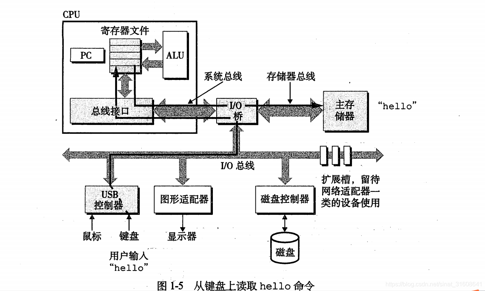

# 计算机网络


## 1. 大纲

- 七层协议及每层的作用、五层协议、TCP/IP协议，它们之间的迭代过程
- TCP/IP协议
  - 应用层
    - URI VS URL
    - HTTP（超文本传输协议）
      - HTTP报文格式、
      - 请求方法及其作用
      - 响应码
      - HTTP迭代过程（1.0 -> 1.1 -> 2.0 -> HTTPS）
      - HTTPS过程
      - 长链接与短链接
      - 跨域及其解决方案
      - 如何理解HTTP有状态和无状态？
      - 既然已经有了HTTP，为什么还会有RPC？
      - 既然有了HTTP，为什么还会有WebSocket？
    - DNS（地址解析协议）过程
    - Cookie 与 Session ，分布式会话
  - 传输层
    - TCP报文格式
    - 可靠性保证手段
    - 粘包问题及解决方案、拆包问题及解决方案
    - TCP洪泛滥问题及解决方案
    - 三次握手
      - 过程
      - 为什么不能是两次或四次？
      - 洪泛滥问题及其解决方案
    - 四次挥手
      - 过程
      - 为什么需要四次？
        - 单向通道问题
        - 服务端可能还有部分数据未接收完毕
    - TCP 和 UDP区别
  - 网络层
    - IP报文格式
      - 网络号、主机号、IP地址、子网掩码、网关
    - 超网划分
    - 多网卡选择过程
    - IP协议转发流程（MAC-端口映射表、路由表）
    - IPv4 VS IPv6
  - 网络接口层
    - 集线器
      - 作用：
    - 交换机
      - 作用：
    - 路由器
      - 作用：
    - 为什么有IP了还需要MAC？
- 一次网络请求的过程
  - TCP/IP四层协议上的一次网络请求过程
  - Linux一次请求的过程
- CDN原理
- 安全
  - 安全问题类型解决方案
    - HTTPS过程
    - TCP洪泛滥攻击
    - DDos攻击、跨域请求攻击、XSS攻击、SQL注入攻击
- 补充
  - 什么是 RESTful API 架构以及如何理解这种架构？
  - 未出现 RESTful API 架构之前的应用层通信方式是怎么样的？
  - **RESTful API** vs **SOAP** vs **XML-RPC**

## 2. 前言

::: tip 导学指引

首先要明白一个基本问题：计算机网络到底解决了什么问题。那么我们就先从现实社会中的从一个请求从开始到结束的整个过程来说。

主要包括两方面的内容：

1. 数据包的封装和解析；
2. 数据包在整个链路上的传输过程；

上面两个过程完成之后，一个请求就算是基本完成了。但是在这个过程中还有许多问题需要解决，然后我们就可以根据出现了什么问题，具体的解决方案是什么的顺序进行展开。

因此我们的逻辑树应该是这样的：

1. 一个请求从开始到结束的整个过程是怎样的？
2. 之后才进入理论部分：
   1. 什么是 OSI 七层模型、五层模型、TCP/IP 四层模型分别是什么，他们之间的发展过程是怎样的。
   2. 之后是按照 TCP/IP 四层模型分别展开。

:::

### 2.1. 学习方法

1. 学习计算机网络，事实上就是学习各种各样的协议，以及最后使用各种协议了解整个网络请求到响应的过程。
2. 直接阅读 RFC 原版英文文档，其实很简单；配合 Wiki 一块；
3. 使用 相关工具 进行实验；

### 2.2. 为什么要分层

1. 分层的意义在于： 让每一层都有自己的具体实现，又让每一层都有统一的实现标准。
2. Java 程序员的核心工作也是基于操作系统上层，写一些应用程序，这些应用程序在 OSI 模型中属于应用层的概念，本质上是对计算机资源的组合使用。比如，tomcat，就是组合使用了操作系统中的网络资源、CPU 资源、内存资源等。而操作系统是已经完成了对一些资源的操作的统一的对外的接口。比如说 Tomcat 要想在 Linux 平台上使用网络资源，本质上就是 tomcat 调用了操作系统对外提供的一系列的 api 接口。
3. 应用层多使用 HTTP 协议，所以应用层就要实现单独属于自己的 HTTP 协议的实现。协议的实现与协议本身的区别： 我在淘宝上买东西，我只需要完成挑选商品和付款操作即可，不需要关注淘宝到底使用什么快递给我运送货物；挑选商品和付款操作就是我与淘宝之间的协议，最后淘宝选择了顺丰帮我运送货物，那顺丰快递就是我和淘宝之间协议的具体实现。同样的，类比到应用层的实现上也是一样，协议的最终效果就是完成双方的通信，具体的实现方式就是由通信双方自行协商。

### 2.3. 计算机网络的发展历程


- 所谓 `通信`，就涉及到信息的发送方和信息的接收方，因此，对于发送方发送出去的消息是如何进行控制的（如加密、压缩、分组等控制手段），只要能够让接收方接收到的信息进行反向操作（解密、解压缩、合并分组等反向控制手段），那么就可以达到信息的“可靠”传递。至于接收方接收到信息后如何处理，则需要通信双方事先规定好信息的控制手段，这些信息的控制手段就被称为 `协议`。
- 计算机网络，就是解决信息在互联网上进行传递的一门学问，核心就是各种各样的协议。
- `协议`： 说白了，就是一组规则，代表着某个物体或要解决某个问题所遵循的标准；通信协议的制定只遵循一个标准，那就是“通信双方都认可”，这就意味着“是个人就可以制定协议”，但实际上前人制定的TCP/IP已经非常完善，我们在学习过程中只需要“站在巨人的肩膀”上即可。
- `OSI（Open System Interconnection， 开放系统互连参考模型）`是国际标准化组织（ISO）制定的一个用于计算机或通信系统间互联的标准体系。可以理解为一个“形而上”的标准，`中看不中用`。它严格规定了每一层所承担的任务，由上至下：
  - 应用层： 管理各种应用程序使用网络的规则，包括HTTP、FTP、SMTP、POP3、DNS等；
  - 表现层： 管理信息的语法语义以及它们之间的联系；
  - 会话层： 建立并管理会话；
  - 传输层： 控制数据分组及应用程序端口，协议内容有： TCP、UDP等协议；
  - 网络层： 控制数据在网络上的传输过程，协议内容包括： IP、ARP、RARP等协议；
  - 数据链路层： 规定0/1的编码、解码方式等；
  - 物理层： 规定各类网络设备的电气特性；
- 人们在实践过程中，发现上面三层（应用层、表现层、会话层）都可以由应用程序自行控制，因此就发展出了 `五层协议`，即把OSI中的应用层、表现层和会话层三层合并成一层——应用层。
- 随着硬件设备的发展，人们又发现在实际的使用过程中并不需要过多的关注OSI中数据链路层和物理层，再加上传输层（TCP和UDP协议）以及网络层（IP、ARP、RARP等协议）的发展，于是人们再次把OSI的数据链路层和物理层进行简化，就形成了现在的“事实标准”——`TCP/IP四层模型`，这个模型也是我们研究的 `重点`。
- 为便于理解，笔者把TCP/IP四层模型在现实中的实现过程对应到计算机各个组件上，如上图中的物理模型。

### 2.4. TCP / IP 协议族

| 分层 | 常见协议    | 解决的问题   |
| :---------- | --------------- | ---------------- |
| 4	应用层 application layer   | HTTP、FTP、DNS （如BGP和RIP这样的路由协议，尽管由于各种各样的原因它们分别运行在TCP和UDP上，仍然可以将它们看作网络层的一部分）    | 解决的是应用程序层面的数据格式问题   |
| 3	传输层 transport layer | TCP、UDP、RTP、SCTP （如OSPF这样的路由协议，尽管运行在IP上也可以看作是网络层的一部分）   | 解决的是应用程序怎么使用操作系统资源的问题 |
| 2	网络互连层 internet layer  | 对于TCP/IP来说这是因特网协议（IP）（如ICMP和IGMP这样的必须协议尽管运行在IP上，也仍然可以看作是网络互连层的一部分；ARP不运行在IP上） | 解决的是这些数据在网络中如何传输的问题     |
| 1	网络访问（链接）层 Network Access (link) layer | 例如以太网、Wi-Fi、MPLS等。 | 解决的是设备与设备之间的通信的问题  |

过程:

1. HTTP解决使用何种协议、何种方法、包含什么数据内容等与应用程序相关的内容；并不关心连接的情况；
2. TCP解决的是客户端主机上哪个应用程序与服务端主机哪个应用程序通信的问题；需要关心连接的情况；
3. IP解决的是网络与网络之间的互相通信的问题；
4. MAC解决的是设备与设备之间的相互通信问题；

## 3. TCP/IP四层模型

主要包括应用层、传输层、网络层和网络接口层。其中的协议包括： HTTP 、 TCP和UDP、 IP协议。

- 应用层： 主要负责数据格式处理、会话控制等问题；例如，每个应用程序应该使用什么样的数据格式传输数据、在传输数据过程中需要保持哪些会话信息等；
- 传输层： 主要负责处理操作系统与多个应用程序之间的问题；例如，多个应用程序的端口分配问题、多个应用程序在数据传输过程中的数据分组问题、单个应用程序大数据量的数据分组问题、可靠性传输问题；
- 网络层： 主要负责通信双发与网络的问题；例如，传输层封装好的数据应该传送到哪个网络分区等；
- 网络接口层： 主要负责协调处理硬件之间不同端口的数据传输；例如，数据传到哪个路由器后，应该把数据发给哪个端口等；

### 3.1. 应用层

应用层主要讲解 HTTP 协议。

#### 3.1.1. 名词解释

- HTTP： HyperText Transfer Protocol， 超文本传输协议，表示可以传输多种数据格式，如文本信息、图片、音频、视频等；早期互联网只能传输文本信息，但是随着计算机技术的发展，需要展示图片、音频、视频的业务场景越来越多，所以叫超文本传输协议。
- **URI**：(Uniform Resource Identifier) 是**统⼀资源标志符**，由某个协议方法表示的资源的定位标识符，可以唯⼀标识⼀个资源，相当于要访问资源的“身份证号”。
- **URL**：(Uniform Resource Location) 是**统⼀资源定位符**，可以提供该资源的路径，相当于要访问资源的“家庭住址”。

#### 3.1.2. 常见的应用层软件

- 浏览器，如Chrome（谷歌浏览器）、Safari、IE；
- 邮件客户端
- 各类开发工具客户端，如navicat、RedisDesktop、postman、
- 命令行工具： curl

我们以在浏览器中访问某一个链接来从上至下来说明各个阶段的概念。

#### 3.1.3. URL的组成

各类常见的应用层软件中都有一个URL的东西，其形式为： `[http|https]://[域名]:[port]/[文档路径]` 。


总的来说URL主要分为三个部分：

- `请求协议`，常见的有 http、 https、 smtp、 ftp、telnet等；
- `主机位置`，包括主机名称和端口号；
- `资源位置`，即要访问的资源在服务器上的文件路径；

如： **http://www.server.com/dir1/files.html**：

- http ： 表示请求双方所采用的协议为 http 协议；
- www.server.com ： 为域名，会通过DNS协议转化成具体主机的IP，使用域名是为了让人们更好的理解，作用是标识网络中的某台主机，本质上是电子设备的电子定位；隐含了默认的端口80（默认http使用80端口，https使用443端口）；
- /dir1/files.html ： 表示资源是在服务器上的dir1文件夹下的file1.html文件；

#### 3.1.4. 报文格式


总结：

```
generic-message = start-line
                  *(message-header CRLF)
                  CRLF
                  [ message-body ]
start-line      = Request-Line | Status-Line
```

- HTTP协议报文有两类，一类是请求报文，一类是响应报文；这两类报文的格式都是： 开始行 + 消息头 + 消息体 的格式；
- **请求报文**
  - 开始行（此时也称为请求行），格式为： 请求方法 + 空格 + URI + 空格 + HTTP版本；
  - 消息头（此时也称为请求头），格式为 key: value 的形式，注意： 冒号后面有一个空格；并且请求头可以有多个；常见的有 Content-Type 等；
  - 消息体的具体格式由 消息头 中的 Content-Type 限制；
- **响应报文**
  - 开始行（此时也称为状态行），格式为： HTTP版本 + 空格 + 状态码 + 空格 + 状态原语；
  - 消息头格式与请求报文中的消息头格式一致，只不过部分键值对有所区别；
  - 消息体也与请求报文中的消息体格式一致；

参考[这里](http://files.blogjava.net/sunchaojin/http1.3.pdf) 。

#### 3.1.5. 消息头

消息头在 RFC 文档中被划分为三个部分：

```
// 请求报文中的 消息头 分为三个部分： 通用头 + 请求头 + 实体头
Request = Request-Line ; Section 5.1
*(( general-header ; Section 4.5
| request-header ; Section 5.3
| entity-header ) CRLF) ; Section 7.1
CRLF
[ message-body ] ; Section 4.3

// 响应报文中的 消息头 分为三部分： 通用头 + 响应头 + 实体头
Response = Status-Line ; Section 6.1
*(( general-header ; Section 4.5
| response-header ; Section 6.2
| entity-header ) CRLF) ; Section 7.1
CRLF
[ message-body ] ; Section 7.2
```

常见的 消息头 有：

| 消息头 | 描述   |
| :---------------- | ------- |
| Cache-Control     |  |
| Date              |   |
| Transfer-Encoding |  |
| Accept-Charset    | 能够接受的字符集 |
| Accept-Encoding   | 能够接受的编码方式列表 |
| Accept-Language   | 能够接受的回应内容的自然语言列表。 |
| User-Agent        | 浏览器的浏览器身份标识字符串 |
| Host              | 服务器的域名(用于虚拟主机 )，以及服务器所监听的传输控制协议端口号。如果所请求的端口是对应的服务的标准端口，则端口号可被省略。自超文件传输协议版本1.1（HTTP/1.1）开始便是必需字段。 |
| Range             | 仅请求某个实体的一部分。字节偏移以0开始。 |
| Accept-Ranges     | 这个服务器支持哪些种类的部分内容范围 |
| Age               | 这个对象在代理缓存中存在的时间，以秒为单位|
| Location          | 用来 进行重定向，或者在创建了某个新资源时使用。 |
| Server            | 服务器的名字 |
| Set-Cookie        | 设置 cookie  |
| Content-Encoding  | 在数据上使用的编码类型。参考 超文本传输协议压缩 。    |
| Content-Language  | 内容所使用的语言  |
| Content-Type      | 当前内容的MIME类型 |
| Expires           | 指定一个日期/时间，超过该时间则认为此回应已经过期  |

可参考这里-[HTTP头字段](https://zh.wikipedia.org/wiki/HTTP%E5%A4%B4%E5%AD%97%E6%AE%B5)。

#### 3.1.6. 请求方法

```
Method = "OPTIONS" ; Section 9.2
| "GET" ; Section 9.3
| "HEAD" ; Section 9.4
| "POST" ; Section 9.5
| "PUT" ; Section 9.6
| "DELETE" ; Section 9.7
| "TRACE" ; Section 9.8
| "CONNECT" ; Section 9.9
| extension-method
extension-method = token
```

| 方法    | 描述                                                                 |
| :------ | -------------------------------------------------------------------- |
| GET     | 向特定资源发送请求，查询数据，并返回实体                             |
| POST    | 向指定资源提交数据进行处理请求，可能会导致新的资源建立、已有资源修改 |
| PUT     | 向服务器上传新的内容                                                 |
| DELETE  | 请求服务器删除指定标识的资源                                         |
| HEAD    | 类似GET请求，返回的响应中没有具体的内容，用于获取报头                |
| OPTIONS | 可以用来向服务器发送请求来测试服务器的功能性 |
| TRACE   | 回显服务器收到的请求，用于测试或诊断  |
| CONNECT | HTTP/1.1协议中预留给能够将连接改为管道方式的代理服务器 |

**get和Post区别**

|          | GET                                                          | POST                                                    |
| -------- | ------------------------------------------------------------ | ------------------------------------------------------- |
| 可见性   | 数据在URL中对所有人可见                                      | 数据不会显示在URL中                                     |
| 安全性   | 与post相比，get的安全性较差，因为所``发送的数据是URL的一部分 | 安全，因为参数不会被保存在浏览器``历史或web服务器日志中 |
| 数据长度 | 受限制，最长2kb                                              | 无限制                                                  |
| 编码类型 | application/x-www-form-urlencoded                            | multipart/form-data                                     |
| 缓存     | 能被缓存                                                     | 不能被缓存                                              |

::: tip OPTIONS 预请求 与 跨域


:::

#### 3.1.7. 响应状态

```
1xx: Informational - Request received, continuing process
2xx: Success - The action was successfully received, understood, and accepted
3xx: Redirection - Further action must be taken in order to complete the request
4xx: Client Error - The request contains bad syntax or cannot be fulfilled
5xx: Server Error - The server failed to fulfill an apparently valid request
```

常见状态码及其描述：

| 状态码                     | 描述                                                                   |
| :------------------------- | ---------------------------------------------------------------------- |
| 100：Continue              | 继续。客户端应继续其请求。                                             |
| 200：OK                    | 请求成功。一般用于GET与POST请求。                                      |
| 301：Moved Permanently     | 永久重定向。                                                           |
| 302：Found                 | 暂时重定向。                                                           |
| 400：Bad Request           | 客户端请求的语法错误，服务器无法理解。                                 |
| 403：Forbideen             | 服务器理解请求客户端的请求，但是拒绝执行此请求。                       |
| 404：Not Found             | 服务器无法根据客户端的请求找到资源（网页）。                           |
| 500：Internal Server Error | 服务器内部错误，无法完成请求。                                         |
| 502：Bad Gateway           | 作为网关或者代理服务器尝试执行请求时，从远程服务器接收到了无效的响应。 |

#### 3.1.8. 长链接、短链接

在HTTP早期版本中，客户端与服务器每进行一次通信，就会建立一个新的`连接`，`连接`在通信结束后随即销毁。这种 HTTP 的连接方式被称为 `短链接` 的方式。

`短链接` 事实上是通过传输层的TCP协议控制的，也就是说，客户端与服务器的每一次通信，都要经过 `三次握手` 和 `四次挥手` 。

可以看出： `短链接` 是有问题的。比如，一次通信过程中要请求一个html页面，这个html页面上有多个图片，那么`短链接`的方式就会创建多个`连接`，这就会产生频繁的创建和销毁的问题，频繁的创建和销毁，会对网络带宽等稀缺的服务器资源损耗很大，进而影响服务器的整体性能。

于是，从「 HTTP/1.1 」起，HTTP 的消息头信息中加入了 **Connection: keep-alive** 字段，解决了这个问题，让HTTP可以复用已经创建的连接资源。

::: tip 
事实上， HTTP 协议的长连接和短连接，就是 TCP 协议的长连接和短连接。
:::


#### 3.1.9. 有状态、无状态

> 所谓 有状态 和 无状态 是指，在整个通信过程中，服务器能否记住客户端的状态。
>
> 有状态： 就是服务器端能够知道请求A是来自于客户端a，不是来自于客户端b；
> 无状态： 就是服务器端并不知道哪个请求来自于哪个客户端；

服务端往往接受来自n个客户端的请求，为减少各项资源的开销，HTTP协议被设计成无状态协议。也就是说服务端并不知道哪个请求属于哪个客户端，因此要额外的技术手段来保证客户端的会话信息。

起先解决会话的问题的方式是，让每一个客户端的每一次请求都携带上自己的相关信息，但是这种方式会造成额外的性能损耗。

因此，后来又出现了Cookie的技术和Session的技术。

HTTP协议属于无状态协议的，这种设计还是为了减轻性能损耗。但是这种方式也有弊端。那就是客户端必须每次都要携带能够标识自己身份的信息给到服务器端，这又造成了额外的性能损耗。

于是就产生了 Cookie 和 Session 的解决方案。

- 举例说明

  比如，某一个OA系统，每个员工都要登录系统进行打卡。业务逻辑是，先登录系统，然后再点击打卡按钮，并且要想打卡成功，就必须要先登录系统。

  但是由于HTTP是无状态的，因此服务器端并不知道员工是否登录。
  
  有了 Cookie 和 Session 后，在登录后的响应请求中，服务器就会对员工的用户的相关信息保存到服务器本地的 Session 列表中，然后再返回客户端一个 cookie 的id，客户端把接收到的 cookie 的id存放到本地，后面员工执行打卡请求，就携带这个 cookie-id 给到服务器，服务器拿到整个 cookie-id 去保存的 session 列表中查询，就可以判断用户已经完成登录了。

  Cookie 和 Session都是用来跟踪浏览器用户身份的会话方式，但两者有所区别：

  - **作用范围不同**，Cookie 保存在客户端（浏览器），Session 保存在服务器端。
  - **存取方式的不同**，Cookie 只能保存 ASCII，Session 可以存任意数据类型，一般情况下我们可以在 Session 中保持一些常用变量信息，比如说 UserId 等。
  - **有效期不同**，Cookie 可设置为长时间保持，比如我们经常使用的默认登录功能，Session 一般失效时间较短，客户端关闭或者 Session 超时都会失效。
  - **隐私策略不同**，Cookie 存储在客户端，比较容易遭到不法获取，早期有人将用户的登录名和密码存储在 Cookie 中导致信息被窃取；Session 存储在服务端，安全性相对 Cookie 要好一些。
  - **存储大小不同**， 单个 Cookie 保存的数据不能超过 4K，Session 可存储数据远高于 Cookie。

- 分布式Session的问题

  在互联网公司为了可以支撑更大的流量，后端往往需要多台服务器共同来支撑前端用户请求，那如果用户在 A 服务器登录了，第二次请求跑到服务 B 就会出现登录失效问题。

  分布式 Session 一般会有以下几种解决方案：

  - **客户端存储**：直接将信息存储在cookie中，cookie是存储在客户端上的一小段数据，客户端通过http协议和服务器进行cookie交互，通常用来存储一些不敏感信息
  - **Nginx ip_hash 策略**：服务端使用 Nginx 代理，每个请求按访问 IP 的 hash 分配，这样来自同一 IP 固定访问一个后台服务器，避免了在服务器 A 创建 Session，第二次分发到服务器 B 的现象。
  - **Session 复制**：任何一个服务器上的 Session 发生改变（增删改），该节点会把这个 Session 的所有内容序列化，然后广播给所有其它节点。
  - **共享 Session**：服务端无状态话，将用户的 Session 等信息使用缓存中间件（如Redis）来统一管理，保障分发到每一个服务器的响应结果都一致。
  建议采用共享 Session的方案。

#### 3.1.10. 重定向和转发

**重定向（Redirect）** 和 **转发（Forward）** 是Web开发中常见的两种请求处理方式，它们用于控制客户端请求的跳转和响应方式。虽然它们都能实现页面跳转，但其背后的机制和适用场景有所不同。


| 比较点        | 重定向（Redirect）                                      | 转发（Forward）                                        |
| ------------- | ------------------------------------------------------- | ----------------------------------------------------- |
| HTTP请求次数  | 两次（客户端发起两次请求）                               | 一次（服务器内部转发）                                 |
| URL变化       | 客户端URL会改变                                          | URL保持不变                                           |
| 是否跨域      | 可以跨域                                                 | 不能跨域，必须在同一个应用内部                         |
| 数据传递      | 不能通过请求对象传递数据，必须使用参数或Session          | 可以通过请求对象传递数据（Request对象）                |
| 性能开销      | 由于发起了新的请求，性能开销较大                         | 没有额外的请求，性能较好                               |
| 适用场景      | 跳转到其他网站或其他应用，防止表单重复提交，跨域跳转     | 在同一个应用内，多个组件协同处理同一个请求             |

- **重定向**：适用于需要通知客户端（浏览器）跳转，并且可能跳转到不同域名或服务器的情况，适合跨域或跨应用的跳转。
- **转发**：适用于服务器内部的跳转，在同一请求的上下文中进行，不会改变浏览器地址栏，适合同一个Web应用内的页面协作。

#### 3.1.11. HTTP版本迭代

|              |        HTTP        | HTTPS                                   |
| :----------: | :----------------: | --------------------------------------- |
|     端口     |         80         | 443                                     |
|    安全性    | 无加密，安全性较差 | 有加密机制，安全性较高                  |
|   资源消耗   |        较少        | 由于加密处理，资源消耗更多              |
| 是否需要证书 |       不需要       | 需要                                    |
|     协议     | 运行在TCP协议之上 | 运行在SSL协议之上，SSL运行在TCP协议之上 |

1. 版本迭代

   - **HTTP1.0**：服务器处理完成后立即断开TCP连接（**无连接**），服务器不跟踪每个客户端也不记录过去的请求（**无状态**）
   - **HTTP1.1**：KeepAlived**长连接**避免了连接建立和释放的开销；通过Content-Length来判断当前请求数据是否已经全部接受（**有状态**）
   - **HTTP2.0**：引入二进制数据帧和流的概念，其中帧对数据进行顺序标识；因为有了序列，服务器可以**并行**的传输数据。

2. **http1.0和http1.1的主要区别如下**

   - 缓存处理：1.1添加更多的缓存控制策略（如：Entity tag，If-Match）
   - 网络连接的优化：1.1支持断点续传
   - 错误状态码的增多：1.1新增了24个错误状态响应码，丰富的错误码更加明确各个状态
   - Host头处理：支持Host头域，不在以IP为请求方标志
   - 长连接：减少了建立和关闭连接的消耗和延迟。

3. **http1.1和http2.0的主要区别**

   - 新的传输格式：2.0使用二进制格式，1.0依然使用基于文本格式
   - 多路复用：连接共享，不同的request可以使用同一个连接传输（最后根据每个request上的id号组合成正常的请求）
   - header压缩：由于1.X中header带有大量的信息，并且得重复传输，2.0使用encoder来减少需要传输的hearder大小
   - 服务端推送：同google的SPDUY（1.0的一种升级）一样

#### 3.1.12. HTTPS的原理及过程


加密流程按图中的序号分为：

1. 客户端请求 HTTPS 网址，然后连接到 server 的 443 端口 (HTTPS 默认端口，类似于 HTTP 的80端口)。
2. 采用 HTTPS 协议的服务器必须要有一套数字 CA (Certification Authority)证书。颁发证书的同时会产生一个私钥和公钥。私钥由服务端自己保存，不可泄漏。公钥则是附带在证书的信息中，可以公开的。证书本身也附带一个证书电子签名，这个签名用来验证证书的完整性和真实性，可以防止证书被篡改。
3. 服务器响应客户端请求，将证书传递给客户端，证书包含公钥和大量其他信息，比如证书颁发机构信息，公司信息和证书有效期等。
4. 客户端解析证书并对其进行验证。如果证书不是可信机构颁布，或者证书中的域名与实际域名不一致，或者证书已经过期，就会向访问者显示一个警告，由其选择是否还要继续通信。如果证书没有问题，客户端就会从服务器证书中取出服务器的公钥A。然后客户端还会生成一个随机码 KEY，并使用公钥A将其加密。
5. 客户端把加密后的随机码 KEY 发送给服务器，作为后面对称加密的密钥。
6. 服务器在收到随机码 KEY 之后会使用私钥B将其解密。经过以上这些步骤，客户端和服务器终于建立了安全连接，完美解决了对称加密的密钥泄露问题，接下来就可以用对称加密愉快地进行通信了。
7. 服务器使用密钥 (随机码 KEY)对数据进行对称加密并发送给客户端，客户端使用相同的密钥 (随机码 KEY)解密数据。
8. 双方使用对称加密愉快地传输所有数据。

#### 3.1.14. 应用层其它协议

> 应用层其它协议简单介绍

- DNS
- SMTP
- MQTT


1. DNS

  有dns的地方，就有缓存。浏览器、操作系统、Local DNS、根域名服务器，它们都会对DNS结果做一定程度的缓存。本文总结一些常见的浏览器和操作系统的DNS缓存时间

  浏览器先查询自己的缓存，查不到，则调用域名解析函数库对域名进行解析，以得到此域名对应的IP地址

  DNS查询顺序：浏览器缓存→系统缓存→路由器缓存→ISP DNS 缓存→递归搜索

#### 3.1.15. CURL查看报文格式的实验

<!-- @include: ./network/snippet/experiment.snippet.md -->

### 3.2. 传输层

::: tip 传输层-导学指引

> 这里的概念性的内容比较多，我们通过自己实现传输层的方式，把散乱的知识点串起来，并结合Linux网络编程的方式来深入了解这些概念。

假如让我们实现一个TCP协议的通信过程，我们应该如何设计？我们可以结合这个问题的解决过程来学习TCP协议的相关内容。

1. 应用层属于用户层面的功能，HTTP构建了相应的报文后，就要往下传递了；`这个传递过程是借助操作系统层面提供的传输层的操作接口来实现的`；换言之，传输层的实现在现代计算机组成上，是操作系统的职责【注意不绝对哈，Linux网络编程就例外】；
2. 根据TCP协议的职责可以，要有两个角色： `客户端` 和 `服务端`；
3. 客户端与服务器端的通信过程就可以抽象成下面三个步骤：
   1. `请求建立通道`：客户端请求服务器端给自己分配一个通信通道；
   2. `传输数据`：客户端与服务器端进行通信；
   3. `请求销毁通道`：通信完成后，销毁通信通道；
4. 在 `请求建立通道`过程中，要考虑几个问题：
   1. 服务器端并不知道客户端何时与自己通信：因此服务器端就打开一些连接，等着客户端来跟自己通信，于是有了服务器端的`被动打开（passive open）`的概念；
   2. 通信过程往往是多个客户端与同一个服务器端进行通信，客户端的每一个建立连接的请求信息都要求服务器端有所回应，这就会产生如何让客户端的请求和服务器端的响应进行对应的问题： TCP通过对通信的数据格式进行规定来解决这个问题，使用多个字段来解决这个问题，如seq字段给请求和响应进行编号等；
   3. 客户端发送建立通道的请求时，可能会因为网络的问题设置重发，所以服务器端可能会有开启多个通道的情况，这就造成了资源浪费： TCP采用三次握手的方式解决这个问题；
5. 在 `传输数据`的过程，要考虑以下几个问题
   1. 消息可能很大，需要多次发送，怎么办？对消息进行 `分组`。分组后如何确定完整性和顺序性？消息体中加字段：`消息编号+校验和+确认字段`；
   2. 消息丢失问题？那就要求每个消息都要有所响应，怎么实现？消息体中添加字段：`确认字段`；但是由于电气特性依然可能丢失，怎么办？`超时重试`！
   3. 网络电气特性等，可能出现的拥堵问题？`拥塞控制`！具体有四个手段：`慢开始 (slow-start)`、`拥塞避免 (congestion avoidance)`、`快速重传 (fast retransmit)`、`快速恢复 (fast recovery)`。
   4. 根据现代计算机组成原理，通信双方发送和接收的信息都是暂存到缓冲区的，也就是说一方不能一下子发送很多数据，因为缓冲区有限制，怎么办？`滑动窗口`！让一方发送数据时，有个时间窗口，在这个时间窗口内不要超出限制即可。【滑动窗口的技术手段可以保证缓冲区一边接收数据分组，一边消费数据分组】
   5. 加了滑动窗口之后，解决了一方无法一下子处理过多数据的问题，但是有网络带宽可能并没有压榨完，也就是说滑动窗口可能是动态的，那怎么办？`流量控制`，让双方协商，主动告诉对方能够处理的缓冲区的大小，让另一方酌情发送！
6. 在 `请求销毁通道`的过程中，也会出现一些问题：
   1. 客户端通信完成之后，服务器端能否主动关闭通道？不能。那怎么办？只能让客户端发送`请求销毁通道`的信息给服务器端。同理，服务器端通信完成之后，能不能让客户端主动关闭？也不能，也只能通过服务器端通知客户端关闭的方式关闭通道。
   2. 由于信息是分组发送的，就可能会出现客户端请求销毁通道的消息早于一些分组信息到达服务器端，如何解决？ 服务器端接到请求销毁通道的消息后不立刻关闭通道，而是等待一会儿；同理，客户端也是一样，也不能立刻关闭通道；那具体何时关闭呢？服务器端接收到请求销毁通道的消息后，等待所有的消息接受完毕，并且校验通过后，才发送出去关闭客户端的请求销毁通道的消息，并且还要等到客户端的响应之后才最终关闭；客户端接收到服务器端发送过来的请求销毁通道的消息后会立即响应，但是也要等待所有的服务器端的消息分组接收完毕，并且校验通过之后，才关闭通道；客户端和服务器端都关闭后，通道才算完成关闭；这就是四次挥手的过程！
7. 根据上述内容总结一下：
   1. `请求建立通道`过程： `三次握手`过程；
   2. `传输数据`的过程： 保证`可靠性的手段`（报文字段+超时控制+滑动窗口+流量控制+拥塞控制），并由此得出`TCP报文`的格式；
   3. `请求销毁通道`的过程： `四次挥手`；
   4. 在整个过程中，我们发现通信双方具有多个状态，因此还要了解通信双方状态的变化；
8. TCP的一些实验：查看TCP报文、查看通信过程；
9. 学习完TCP之后，还要了解同一层的UDP协议的相关内容；
10. Java网络关编程、Linux网络编程；这个过程可能要了解epoll的相知识；

:::

#### 3.2.2. TCP报文

TCP报文包括两部分内容： TCP 头部 + 数据部分。

```log
 0                   1                   2                   3
 0 1 2 3 4 5 6 7 8 9 0 1 2 3 4 5 6 7 8 9 0 1 2 3 4 5 6 7 8 9 0 1
 0 1 2 3 4 5 6 7 8|0 1 2 3 4 5 6 7 8|0 1 2 3 4 5 6 7 8|0 1 2 3 4 
+-+-+-+-+-+-+-+-+-+-+-+-+-+-+-+-+-+-+-+-+-+-+-+-+-+-+-+-+-+-+-+-+
|          Source Port          |       Destination Port        |
+-+-+-+-+-+-+-+-+-+-+-+-+-+-+-+-+-+-+-+-+-+-+-+-+-+-+-+-+-+-+-+-+
|                        Sequence Number                        |
+-+-+-+-+-+-+-+-+-+-+-+-+-+-+-+-+-+-+-+-+-+-+-+-+-+-+-+-+-+-+-+-+
|                    Acknowledgment Number                      |
+-+-+-+-+-+-+-+-+-+-+-+-+-+-+-+-+-+-+-+-+-+-+-+-+-+-+-+-+-+-+-+-+
|  Data |           |U|A|P|R|S|F|                               |
| Offset| Reserved  |R|C|S|S|Y|I|            Window             |
|       |           |G|K|H|T|N|N|                               |
+-+-+-+-+-+-+-+-+-+-+-+-+-+-+-+-+-+-+-+-+-+-+-+-+-+-+-+-+-+-+-+-+
|           Checksum            |         Urgent Pointer        |
+-+-+-+-+-+-+-+-+-+-+-+-+-+-+-+-+-+-+-+-+-+-+-+-+-+-+-+-+-+-+-+-+
|                    Options                    |    Padding    |
+-+-+-+-+-+-+-+-+-+-+-+-+-+-+-+-+-+-+-+-+-+-+-+-+-+-+-+-+-+-+-+-+
|                             data                              |
+-+-+-+-+-+-+-+-+-+-+-+-+-+-+-+-+-+-+-+-+-+-+-+-+-+-+-+-+-+-+-+-+

Note that: one tick mark represents one bit position.
```

- `源端口号` 和 `目的端口号` 可以理解为：应用程序在操作系统上的编号，服务端操作系统接收到客户端传过来的消息后，就是通过目的端口找到服务器上的具体的应用程序的；
- `序列编号` ： 单次传输的信息较大时，就会拆分成多个分组，每一个分组都有一个序列编号，它的存在是为了防止消息分组的错乱；
- `确认编号`： 期望收到的数据的开始序列号，也即已经收到的数据的字节长度加1； 如客户端收到服务器端的确认消息，那么这个位置就为服务器端确认已经收到的 序列编号 + 1；
- `资料偏移`（4 bit）—以4字节为单位计算出的数据段开始地址的偏移值。
- `保留`（3 bit）—须置0
- `标志符`（6 bit）
  - NS—ECN-nonce。ECN显式拥塞通知（Explicit Congestion Notification）是对TCP的扩展，定义于 RFC 3540 （2003）。ECN允许拥塞控制的端对端通知而避免丢包。ECN为一项可选功能，如果底层网络设施支持，则可能被启用ECN的两个端点使用。在ECN成功协商的情况下，ECN感知路由器可以在IP头中设置一个标记来代替丢弃数据包，以标明阻塞即将发生。数据包的接收端回应发送端的表示，降低其传输速率，就如同在往常中检测到包丢失那样。
  - CWR—Congestion Window Reduced，定义于 RFC 3168（2001）。
  - ECE—ECN-Echo有两种意思，取决于SYN标志的值，定义于 RFC 3168（2001）。
  - URG—为1表示高优先级数据包，紧急指针字段有效。
  - ACK—为1表示确认号字段有效
  - PSH—为1表示是带有PUSH标志的数据，指示接收方应该尽快将这个报文段交给应用层而不用等待缓冲区装满。
  - RST—为1表示出现严重差错。可能需要重新建立TCP连接。还可以用于拒绝非法的报文段和拒绝连接请求。
  - SYN—为1表示这是连接请求或是连接接受请求，用于建立连接和使顺序号同步
  - FIN—为1表示发送方没有数据要传输了，要求释放连接。
- `窗口`（WIN，16位长）—表示从确认号开始，本报文的发送方可以接收的字节数，即接收窗口大小。用于流量控制。
- `校验和`（Checksum，16位长）—对整个的TCP报文段，包括TCP头部和TCP数据，以16位字进行计算所得。这是一个强制性的字段。
- `紧急指针`（16位长）—本报文段中的紧急数据的最后一个字节的序号。

#### 3.2.3. 通道状态

客户端与服务器端通道的建立是基于状态机实现的，因此在建立通道的过程中，客户端程序和服务器端程序会有多个不同的状态，每一个状态都对应着不同的行为特征。下面列表代表着“一次通信过程中”客户端和服务器端的不同状态，这些状态中，有些只在客户端出现，有些只在服务器端出现，有些会同时出现。以S指代服务器，C指代客户端，S&C表示两者，S/C表示两者之一：

- **LISTEN S** ：服务器等待从任意远程TCP端口的连接请求。
- **SYN-SENT C** ： 客户在发送连接请求后等待匹配的连接请求。通过connect()函数向服务器发出一个同步（SYNC）信号后进入此状态。
- **SYN-RECEIVED S** ： 服务器已经收到并发送同步（SYNC）信号之后等待确认（ACK）请求。
- **ESTABLISHED S&C** ： 服务器与客户的连接已经打开，收到的数据可以发送给用户。数据传输步骤的正常情况。此时连接两端是平等的。这称作全连接。
- **FIN-WAIT-1 S&C** ： （服务器或客户）主动关闭端调用close（）函数发出FIN请求包，表示本方的数据发送全部结束，等待TCP连接另一端的ACK确认包或FIN&ACK请求包。
- **FIN-WAIT-2 S&C** ： 主动关闭端在FIN-WAIT-1状态下收到ACK确认包，进入等待远程TCP的连接终止请求的半关闭状态。这时可以接收数据，但不再发送数据。
- **CLOSE-WAIT S&C** ： 被动关闭端接到FIN后，就发出ACK以回应FIN请求，并进入等待本地用户的连接终止请求的半关闭状态。这时可以发送数据，但不再接收数据。
- **CLOSING S&C** ： 在发出FIN后，又收到对方发来的FIN后，进入等待对方对己方的连接终止（FIN）的确认（ACK）的状态。少见。
- **LAST-ACK S&C** ： 被动关闭端全部数据发送完成之后，向主动关闭端发送FIN，进入等待确认包的状态。
- **TIME-WAIT S/C** ： 主动关闭端接收到FIN后，就发送ACK包，等待足够时间以确保被动关闭端收到了终止请求的确认包。（按照RFC 793，一个连接可以在TIME-WAIT保证最大四分钟，即最大分段寿命（maximum segment lifetime）的2倍）
- **CLOSED S&C** ： 完全没有连接。

需要注意的是：

1. 客户端可以主动发起关闭通道的请求，服务器端也有可能会主动发起关闭通道的请求。
2. 主动发起关闭通道的一方的状态变化一定是： FIN-WAIT-1 、 FIN-WAIT-2 、 TIME-WAIT 、 CLOSED ；而另一方的状态变化一定是： CLOSE-WAIT 、 LAST-ACK 、 CLOSED 。 也就是说四次挥手的状态是成对出现的。
3. 要特别注意的是建立通道后，通道属于全连接通道，也可以成为全工通道。主动发起关闭通道的请求的意思是：自己发送完成了，要主动关闭自己一端的发送功能了；而被动关闭也是指自己发送完了，也要关闭自己一端的发送功能了。
4. 一方发起关闭通道请求后，并不影响接收另一方消息的功能。也就是说客户端在 ESTABLISHED 状态发送的数据分组，可能到服务器端的LAST-ACK

> 全工： 通道既可以发送消息，又可以接收消息。 半工： 只能接收或者只能发送。

#### 3.2.4. 请求建立通道

请求建立通道的过程，本质上是客户端请求服务器端给自己创建一个服务通道的过程。所采用的方式是： 三次握手方式，具体如下图。


如上图中三次握手部分，过程简述：

1. 客户端 给 服务端 发送同步消息，请求 服务端 开启一个通道；
2. 服务端 收到 同步消息 后，回复一个确认消息，表示通道已经开启，并在确认消息中添加同步信息，要求客户端再次回复；
3. 客户端 收到 确认消息后，再回复一个确认消息的确认消息，表示收到确认消息，握手结束，之后开始发送信息；

> 
> - 问： 什么是被动开启？
> - 答： 客户端与服务器端无法同时开启通道，只能是服务器端资源就绪后进行监听来自客户端的建立通道的请求。
>
> 
> - 问： 为什么不是两次握手？
> - 答： 防止客户端不按常理出牌——多次请求创建链接，却不发送数据，也有可能是因为服务器端发给客户端的syn+ack有些延迟，客户端发送了多次syn；同样造成创建多次sockfd。
>
> 
> 问： 为什么不是四次握手？
> 答： 浪费了一次。
>
> 
> 问： 什么是宏泛滥攻击？如何避免？
> 答：客户端利用多个虚拟的服务器给服务器发送syn的请求，导致服务器端syn队列耗尽的情况就是宏泛滥攻击， 可以通过防火墙、路由器等网关过滤；给syn队列设置大小，超过范围自动放弃；使用syn cookie技术等技术手段避免。
>
> 
> 问： 三次握手后最后一步的ACK发送失败，会出现什么问题？
> 答： 三次握手第二步服务器端发送出去同步信息的ACK后，第三步服务器端没有接收到ACK信息。
> 服务器端会根据重试机制接着发送第二步的 ACK + SYN 的信息，多次后，客户端总能收到一个，于是客户端回复 ACK， 通道建立。
> 客户端发送出去ACK后，会默认为服务器端已经准备好socketfd等资源信息了，于是客户端直接发送数据分组了，当服务器端接收到数据分组后，发现并没有收到客户端的第三步的ACK信息，于是就发挥RST包（Reset，标示复位，用于异常的关闭连接）响应，告诉客户端重新发送ACK之后再发送数据分组。
> 

#### 3.2.5. 传输数据

通道建立之后，就是数据的传输过程，这个过程中遇到的主要问题有两方面： 兼顾性能与链路拥堵的平衡 和 保证数据的正确性和完整性。因此在这个阶段的主要关注点就是解决这两个方面的问题，以保证消息的可靠性。

- 兼顾性能和链路拥堵的平衡
  - 问题描述： 链路传输过程中，上面的数据越饱和，则说明整个传输通道的性能越强，但是同时，也说明整个链路也会越拥堵；也就是说性能和链路是一对“鱼和熊掌”的关系。因此传输层就需要在这一对关系上进行取舍。
  - 超时重试： 如果一定时间内没有收到对方的响应信息，就会重新发送请求。
  - 滑动窗口： 根据现代计算机组成原理，通信双方发送和接收的信息都是暂存到缓冲区的，也就是说一方不能一下子发送很多数据，因为缓冲区有限制，怎么办？`滑动窗口`！让一方发送数据时，有个时间窗口，在这个时间窗口内不要超出限制。
  - 流量控制： 加了滑动窗口之后，解决了一方无法一下子处理过多数据的问题，但是有网络带宽可能并没有压榨完，也就是说滑动窗口可能是动态的，那怎么办？`流量控制`，让双方协商，主动告诉对方能够处理的缓冲区的大小，让另一方酌情发送！
  - 拥塞控制
    - 慢开始 (slow-start)： 不要一开始就发送大量的数据，由小到大逐渐增加拥塞窗口的大小。
    - 拥塞避免 (congestion avoidance)： 拥塞避免算法让拥塞窗口缓慢增长，即每经过一个往返时间RTT就把发送方的拥塞窗口cwnd加1而不是加倍。这样拥塞窗口按线性规律缓慢增长。
    - 快速重传 (fast retransmit)： 我们可以剔除一些不必要的拥塞报文，提高网络吞吐量。比如接收方在收到一个失序的报文段后就立即发出重复确认，而不要等到自己发送数据时捎带确认。快重传规定：发送方只要一连收到三个重复确认就应当立即重传对方尚未收到的报文段，而不必继续等待设置的重传计时器时间到期。
    - 快速恢复 (fast recovery)： 主要是配合快重传。当发送方连续收到三个重复确认时，就执行“乘法减小”算法，把ssthresh门限减半（为了预防网络发生拥塞），但接下来并不执行慢开始算法，因为如果网络出现拥塞的话就不会收到好几个重复的确认，收到三个重复确认说明网络状况还可以。
- 保证数据的正确性和完整性；
  - 序号和确认应答
  - 校验和
  - 超时重试
- 其它问题
  - TCP粘包
    - 问题： 由于传输层传输的数据是分组的，并且由现代计算机组成原理决定，消息的发送和接收都是先存放到缓冲区的，因此就会遇到“多个分组被当成一个分组发送出去”和“多个分组到达后被当作一个分组进行处理”的问题。TCP粘包的本质问题是数据分组的界限不明显。
    - 解决方案： 解决本质问题，也就是解决数据分组界限不明显的问题即可。具体解决办法有： 规定分组长度、使用转义字符表示分组结束、分组携带自身长度。

#### 3.2.6. 请求销毁通道

销毁通道的主要方式是四次挥手。客户端和服务器端都可以主动发起关闭通道的请求。下面是图示：


> MSL(Maximum Segment Lifetime)，报文最大生存时间，表示任何报文在网络上存在的最长时间，超过这个时间报文将被丢弃。

如上图四次挥手部分，过程简述：（以上图中客户端主动发起关闭通道的请求为例）

1. 客户端 发送 FIN消息 给服务端，进入 FIN-WAITE-1 阶段，这个阶段不会再发送数据分组了；【好，我发完了哈】
2. 服务器端 收到 FIN 消息后，返回FIN的确认信息，并进入 CLOSE-WAITE 阶段，这个阶段依然可以接受客户端发送过来的数据分组；【中，我知道了，等我收完】
3. 客户端接收到 服务端发送回来的 确认消息 后，进入 FIN-WAITE-2 阶段，这个阶段依然可以接收服务端发送回来的数据分组；
4. 服务器端接收完客户端发送回来的数据分组后，给客户端发送FIN消息，并进入 LAST-ACK 阶段，这个阶段只收不发了；【好，我收完了，并且我也发完了】
5. 客户端收到FIN消息后进入 TIME-WAIT 阶段，这个阶段只接收服务端的数据分组，不再发送了；【中，我知道了，等我收完】
6. 客户端在 2MSL 后进入 CLOSED 阶段，整个通道关闭；

> 
> 问： 为什么是四次挥手？
> 答： 主要有两个原因。一是通道是双工通道，每一端的通道都是一个资源，都需要进行关闭；二是一段接收到请求关闭通道的消息后不能立刻关闭，要等到对方的数据分组发送完毕才能进入下一步。
>
> 
> 问： TIME-WAIT状态的连接过多，怎么办？
> 答： 参见[网络面试题](./网络面试题.md)
> 

#### 3.2.7. 总结

TCP的一次完整的通信过程，大概图示如下图。


需要注意的是，上图只显示了客户端主动发起关闭通道的请求，事实上服务端也可以主动发起关闭通道的请求。

> 问： TCP是如何保证可靠传输的？
> 答： 【提示： 从 （1. 保证链路可靠性）、（2. 保证数据的正确性和完整性） 与 （3. 兼顾性能和链路拥堵的平衡） 三方面答】
>
> 1. 保证链路可靠性： 采用了三次握手和四次挥手的方式处理通道开启和关闭的问题，保证了连接通道的可靠性；
> 2. 保证数据的正确性和完整性 方面采取了： 在报文头里面添加了 序号、 确认应答、 校验和 等字段，这些字段可以保证数据的正确性和完整性。
> 3. 兼顾性能和链路拥堵的平衡 方面采取了： 超时重试、滑动窗口、拥塞控制、控制流量等手段。

#### 3.2.8. TCP 实验

- [ ] TODO
- [ ] Windows上TCP协议的使用 ： https://www.cnblogs.com/suv789/p/18035982
- Windows下查看某一端口占用 https://blog.csdn.net/Oraclesand/article/details/77847255
- 查看报文
  - https://help.aliyun.com/zh/ecs/how-to-install-and-use-wireshark-in-windows  
  - https://blog.csdn.net/a82514921/article/details/104609924
- 查看连接过程
- 终端命令行语法： 
  - http://docopt.org/    
  - https://hwame.top/20210112/command-line-description.html
  - https://blog.csdn.net/wq6ylg08/article/details/88919530
  - https://blog.csdn.net/weixin_42683556/article/details/115725069?spm=1001.2014.3001.5501


#### 3.2.9. TCP与UDP区别

| 类型 |            特点            |          性能          |    应用过场景    | 首部字节 |  |
| ---- | :------------------------: | :--------------------: | :--------------: | :------: | - |
| TCP  |   面向连接、可靠、字节流   | 传输效率慢、所需资源多 |  文件、邮件传输  |  20-60  |  |
| UDP  | 无连接、不可靠、数据报文段 | 传输效率快、所需资源少 | 语音、视频、直播 | 8个字节 |  |


#### 3.2.10. 网络编程

- [ ] TODO Java网络编程 

### 3.3. 网络层

- 网络层
  - IP报文格式
    - 网络号、主机号、IP地址、子网掩码、网关

网络地址，即IP地址，是指一台主机在网络上的逻辑地址，是由两个部分组成： 网络号 + 主机号。网络号可以理解为主机所属的网络编号，主机号可以理解为主机在这个网络中的编号。

只有一个IP地址，是无法展示出网络号的，所以还需要有一个子网掩码，这个子网掩码的作用就是：通过与IP进行按位与运算，就可以得出网络号。例如：

192.168.1.103 子网掩码为： 255.255.255.0， 那么 192.168.1.103 表示的网络地址就是： （网络号=192.168.1.0， 主机号=103）

- 超网划分
- 多网卡选择过程
- IP协议转发流程（MAC-端口映射表、路由表）
- IPv4 VS IPv6

### 3.4. 网络接口层


- 为什么有IP了还需要MAC？

## 4. 一个请求的详细过程

chrome地址栏中输入 www.baidu.com 的整个详细过程：

1. chrome新开一个标签页，Windows平台就会自动创建一个线程，并且分配好一个端口号，准备好一些系统资源；我们假设这个端口号为： chromePort ；
2. 浏览器输入 www.baidu.com  ，按下回车，浏览器会依次查找： 浏览器的dns缓存 -> 操作系统DNS缓存 -> 路由器缓存 -> 网络服务商DNS缓存（ISP DNS），直到找到 对应的IP（183.2.172.185） 和 端口号（443）；于是报文有了：


但此时还没有找到 源IP

3. 于是操作系统就去查本地路由表，发现 百度IP 只对应到路由表中的第一行，于是找到出口，也就是找到了源IP，此时报文变成：


但此时还没有找到 源MAC

4. 于是ARP协议去找IP与MAC的对应关系，找到为： 40-8d-5c-ff-a3-47 ，于是报文变成了：
5. 然后就有了 chrome会自动拼接上一些方法和协议版本等信息，于是产生HTTP层面的报文
6. 即相当于在Windows平台上申请了一个端口号，假设这个端口号为  chromePort ，这就有了传输层的“源端口号”，又因为请求的是https，默认的服务器端的端口号是“443”，这就有了；
7. 


浏览器缓存→系统缓存→路由器缓存→ISP DNS 缓存→递归搜索

### todo 


提纲

1. 实际的物理链路图，这里是说硬件之间的通信链路，先不深究内部原理。目的在于直观地展示网络请求过程。
2. 之后要对计算机有个基本了解，要知道一个应用程序在计算机上运行起来的基本原理是怎样的。
3. 之后以一个实际需求为例，以实现需求中遇到的问题为驱动，逐步展开进行说明。


#### 物理链路图


> 简单说明一下。


#### 前置知识

> 应用程序在计算机上运行的大概原理。


#### 一个完整的请求过程



1. 以我在浏览器里面输入百度官网地址为例。首先要说的是，计算机中的很多内容都是从现实生活中提炼总结出来的，这个过程我们称为抽象，即计算机网络模型就是从现实生活中抽象出来的，那这个现实生活中的案例是什么呢？人们很容易想到，就是寄信的案例。寄信的第一步，那肯定是要写信吧，对应计算机中也是一样，那我要发送一条信息
2. 我的 PC 上有多个应用程序，如 chrome 浏览器、微信客户端、语雀客户端等等。

一台计算机上运行着很多应用程序，怎么区分每一个应用程序呢，端口出现。

浏览器使用 HTTP 报文格式生成了一个请求报文，报文里面表明了这个消息使用的是什么格式。

有了请求报文之后，浏览器就会调用 Linux 的 socket 接口，然后由 socket 封装 端口，这个报文包括应用程序的端口，以及服务器上应用程序的端口。【应用程序的端口是怎么获得的——应用程序自己向操作系统申请的】

之后，由网络接口层分装 IP 报文，IP 报文中包括几个问题：

1. 域名与 IP 之间的相互转化；DNS 协议；
2. 自己的 IP 是如何获取的；DHCP 协议；
3. 公网 IP 与局域网 IP 的相互转化；NAT 协议；
4. 如何获取 MAC 地址；ARP 协议；把请求 mac 地址的数据包广播给本网络中的所有主机，我的 ip 是 192.168.10.23，mac 是 a，我要找 192.168.10.96 的 mac；然后对应的主机以单播的方式相应对应的 mac 给到我。【这里有个问题，那就是如果我请求的 IP 地址不在本网络中，那么会怎么处理】
   1. 事实上，可以理解为，在获取 mac 地址的时候，内核会先查询自己本地缓存的映射表，然后根据本机 IP 和子网掩码，找到路由器所在的 ip，让 路由器进行广播，如果有应答就获取 mac，如果没有应答，那最终协议的 mac 地址就是路由器的地址。
   2. 下一步骤是路由器把报文中的目标 mac 置空，然后根据路由表再次找 mac；

到此为止，数据包算是差不多完了。

下面是传输过程；

应用程序到内核是通过调用操作系统接口完成的；
内核到网卡是通过调用硬件驱动完成的；


## 5. 参考连接汇总

- [用大白话解释什么是Socket](https://zhuanlan.zhihu.com/p/260139078)
- [javaDesign](https://github.com/idaSmilence/javaDesign)
- 《Java面试小抄V1.0.pdf》
- 《Java面试小抄V2.0.pdf》
- 《字节大佬总结的面试资料.pdf》
- [经典面试题：在浏览器地址栏输入一个 URL 后回车，背后发生了什么](https://cloud.tencent.com/developer/article/1793846)
- [25 张图，一万字，拆解 Linux 网络包发送过程](https://mp.weixin.qq.com/s/TpLuyYoLp3x5ODCTI7HQ4w)
- [HTTPS 详解一：附带最精美详尽的 HTTPS 原理图](https://segmentfault.com/a/1190000021494676?u_atoken=d6711e9e-dc2d-43f0-a819-4ab7836a9c2b&u_asession=015lll-xAhJhWi-_IJYFkWxdU4vFG9aCefjVuKte0BeMtJXoSG3DAFvbu70sMtfjp3X0KNBwm7Lovlpxjd_P_q4JsKWYrT3W_NKPr8w6oU7K9eow9p5QJkIGLilVG6S6oRkGMSrTOhD_XUpDR5CwHm22BkFo3NEHBv0PZUm6pbxQU&u_asig=05YU5dtK69lipJR4PlqM8ouSkUbdFOwfw--lli_thxngX4HLEN8GLe_rcYMYyiU7yxIZDugEmudCOb2Lu3dDX2faqb4QtpVf0wOhu8JLoI7FS2cGKbY0lvE7fflYhexLiCgLNPgl43Jb6jbn0v4g5KAXh4ixyOHD93GskhI9Hh9Yj9JS7q8ZD7Xtz2Ly-b0kmuyAKRFSVJkkdwVUnyHAIJzdxeBiXBBmd5cV0MDDXwULsqyMc_RM4SztNjunBdu-2XhQ3oUrcZv4kkkaTSIPALCO3h9VXwMyh6PgyDIVSG1W827G8fbWbXGj0TzqyuL0LS32TG907D-0gWFGobKr9p4upJq0IyO3xPyjU7aTwH-HcZ_tlfIran0r43ozchadDUmWspDxyAEEo4kbsryBKb9Q&u_aref=0334X4bWzSwmxDUJZibalNVn3sA%3D)
- [键入网址到网页显示，期间发生了什么？](https://xiaolincoding.com/network/1_base/what_happen_url.html#%E5%AD%A4%E5%8D%95%E5%B0%8F%E5%BC%9F-http)
- [硬核图解！30张图带你搞懂！路由器，集线器，交换机，网桥，光猫有啥区别？](https://mp.weixin.qq.com/s/6eQ00Wzss61XUTO8xeL3iA)
- [RFC 2616](https://datatracker.ietf.org/doc/html/rfc2616)
- [rfc2616中文翻译](http://files.blogjava.net/sunchaojin/http1.3.pdf)
- [rfc793](https://www.rfc-editor.org/rfc/rfc793.html)
- [RFC793中文版](https://blog.csdn.net/m0_46500807/article/details/113899976)
- [传输控制协议](https://zh.wikipedia.org/wiki/%E4%BC%A0%E8%BE%93%E6%8E%A7%E5%88%B6%E5%8D%8F%E8%AE%AE)
- [面试小炒](https://www.javalearn.cn/#/doc/%E8%AE%A1%E7%AE%97%E6%9C%BA%E7%BD%91%E7%BB%9C/%E9%9D%A2%E8%AF%95%E9%A2%98)
- [图解网络](https://xiaolincoding.com/network/)