# 2. 集合

::: tip 学习导引

1. 一种应用广泛的计算机编程语言，尤其是高级语言，它一定实现了一些常见的数据结构，并为这些数据结构提供了可靠的通用的操作方法。Collection 就是 Java 语言提供给开发者的一个重要的实现。
2. 计算机中的数据结构与算法不可分割，我们用 DSA 来表示这门学问，那这门学问要研究的内容就只有两方面：
   1. 用来存储数据或信息的计算机内部的存储结构；分为逻辑存储结构和物理存储结构；
   2. 操作这种结构的指令集；
3. Java 语言中实现面向对象编程的思想的重要原则就是：
   1. 类中的属性来表示数据结构中的结构；
   2. 类中的方法来表示操作这种结构的指令集；
   3. 为了表达通用、继承等思想，又把指令集抽象出 Java 中的接口；
4. 主要的学习材料就是 Java 的官方文档，位置[在这](https://docs.oracle.com/javase/8/docs/technotes/guides/collections/reference.html)；
5. 根据官方文档的描述来看，Java 中的集合框架主要内容有：
   1. 重要的接口；【存储结构的表达延后至实现这些接口的具体实现类上】
   2. 接口的实现类；
   3. 工具包；【Collections 实现类、Arrays 实现类】；
   4. 集合框架的高阶应用： 应付多线程的业务场景；

:::

本文的主要内容有：

1. 接口及其实现；
2. 工具包；
3. 集合框架中的同步实现；

## 接口及其实现

Java 中的集合框架，按照存储数据分成单列集合和双列集合，分别对应两个顶级接口： `Collection` 和 `Map` 。

](./ch02-collection/image/1739783884028.png)

Java 的集合框架位于 rt.jar 下面的 java.util 包下面。主要的内容包括：

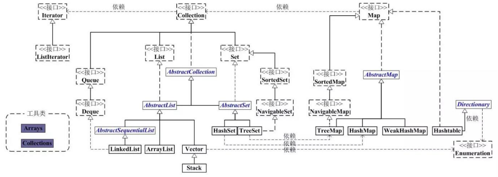

- 单列集合的根接口是： `Collection` ，它有四个重要接口
  - `Set` ： 表示一个不包含重复元素的集合，只允许保存一个 Null，并且是无序的（存入顺序与实际存储顺序不一致），通用的实现有 `HashSet` 、 `LinkedHashset` 、 `TreeSet` ；
    - `SortedSet` ： 一种维护其元素按升序排列的 Set 。还提供了几个额外的操作来利用排序。有序集合用于自然排序的集合，例如单词列表和成员名单。
  - `List` ： 表示一个有序（存入顺序与实际存储顺序一致）的集合，可以包含重复的元素，允许保存多个 Null 元素，通用的实现有 `ArrayList` 、 `LinkedList` 、 `~~Vector（官方已经不推荐使用）~~` 、 `~~Stack（官方已经不推荐使用）~~`；
  - `Queue` ： 表示一种先进先出的集合，常用于处理排队的数据， 定义了队列的基本操作，如插入、删除、查看头元素； 通用的实现有`PriorityQueue` 、 `LinkedList` ；
  - `Deque` ： 表示一个支持从两端插入和删除元素的队列，常用于需要从队列两端添加或删除元素的场景；可以同时用作 FIFO（先进先出）和 LIFO（后进先出）； 通用的实现有`ArrayDeque` 、 `LinkedList` ；
- 双列集合的根接口是： `Map` ，通用的实现有 `HashMap` 、 `TreeMap` 、 `LinkedHashMap` 、`~~Hashtable（官方已经不推荐使用）~~` ；
  - `SortedMap` ： 一种维护其映射按升序键顺序的 Map 。这是 Map 的 SortedSet 类比。排序映射用于自然排序的键/值对集合，例如字典和电话簿

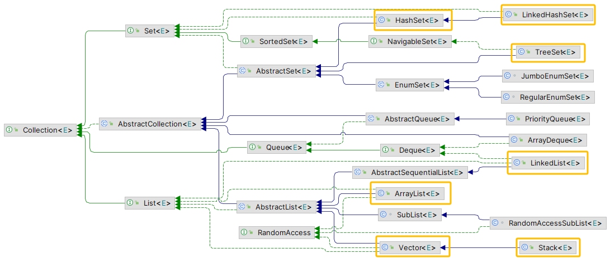

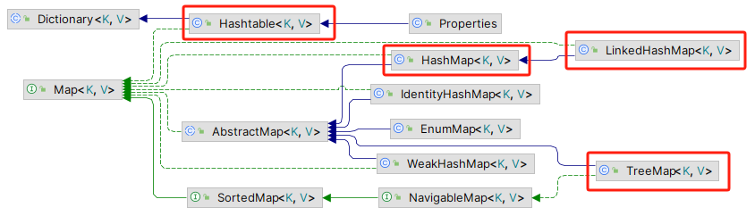

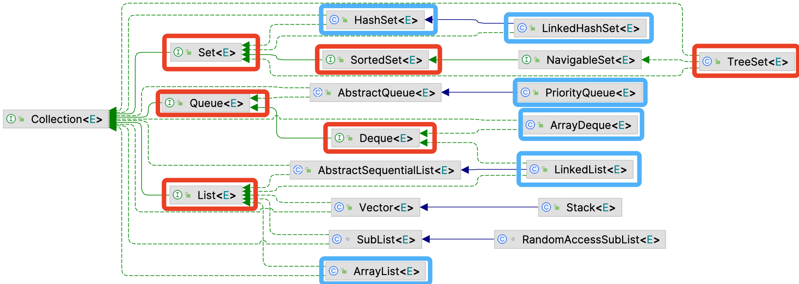

还有两个遍历器。

### Set

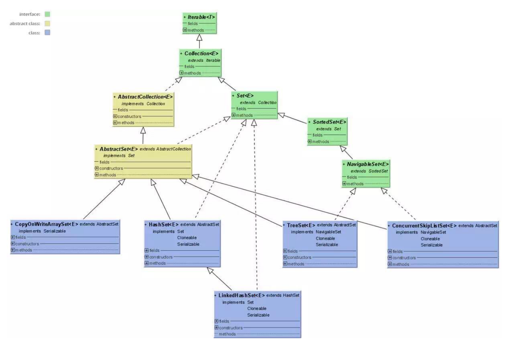

`Set`表示一个不包含重复元素的集合，只允许保存一个 Null，并且是无序的（存入顺序与实际存储顺序不一致），只允许插入一个 null 元素。

Java 平台包含三个通用目的的 Set 实现： `HashSet` 、 `TreeSet` 和 `LinkedHashSet` 。

- `HashSet` ，它将元素存储在哈希表中，是性能最好的实现；然而，它不保证迭代顺序。
- `TreeSet` ，它将元素存储在红黑树中，根据元素的值对其元素进行排序；它比 HashSet 慢得多。
- `LinkedHashSet` ，它作为通过哈希表运行的链表的实现，根据元素插入集合的顺序对其元素进行排序（插入顺序）。 LinkedHashSet 以略高的代价，使客户免受 HashSet 提供的未指定、通常混乱的排序。

#### HashSet

1. `底层实现`： 基于 HashMap 实现， 值放到 HashMap 的 key 上面， HashMap 的值同一为 present； 实现较为简单，基本上都是调用底层 HashMap 的相关方法完成的；不允许存放重复元素；每个 Set 的底层实现其实就是对应的 Map：数值放在 map 中的 key 上，value 上放了个 PRESENT，是一个静态的 Object，相当于 place holder，每个 key 都指向这个 object。
2. 保存的内容为不重复的内容；本质上是数组+链表的方式进行存储的；
3. 在添加元素时，会先计算元素的 hashcode 值，然后去数组上找到 hash 桶的位置，之后再使用元素的值一一比对同一个 hash 桶上的其他元素，如果相等就不做任何操作，如果没有相等的，就顺延插入；添加的顺序与实际保存到内存中的顺序并不一致
4. 由于添加元素的操作的限制，因此 HashSet 的泛型参数要进行相等判断，即需要实现自定义的判断对象相等的 hashcode 方法和 equals 方法；
5. 判断重复性： 先判断 hashcode 是否相等，如果相等就判断值是否相等，如果两个都相等，那就是重复了

#### TreeSet

- `底层原理`：红黑树实现；查找的时间复杂度为 O(logN)；每次新增一个元素时，都会进行排序；
- `其它特点`：保存的内容为有序的内容，因此自定义的泛型参数需要实现 Comparable 接口，并覆写 compareTo()方法，并且要返回负数、零或正整数；Integer 和 String 对象使用默认的排序规则；

#### LinkedHashSet

- `底层实现`：继承于 HashSet ，基于 LinkedHashMap 实现，底层使用 LinkedHashMap 保存所有元素，类似于 HashSet 使用 HashMap 保存元素一样，同样可以可以直接调用 HashSet 的方法；
- 可以直接调用 HashSet 的方法，具有 HashSet 的查找效率，内部使用双向链表维护元素的插入顺序；

### List

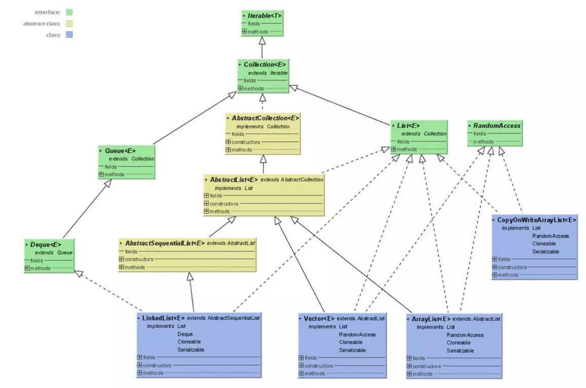

`List`表示一个有序（存入顺序与实际存储顺序一致）的集合，可以包含重复的元素，允许保存多个 Null 元素，通用的实现有 `ArrayList` 、 `LinkedList` 、 `Vector（官方已经不推荐使用）` ；

#### ArrayList

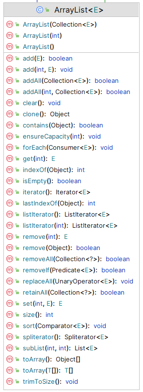

- `底层数据结构`：
  - 对应的数据结构： 动态数组 ；
  - 源码： `transient Object[] elementData;`
  - `elementData` 是引用数据类型，它指向 jvm 的堆内存中的存放数组元素的开始位置；
  - `transient` 关键字表示 elementData 不会被默认序列化（需要自定义序列化方式）
- `默认容量` ：初始化容量为 0， 首次添加元素时申请内存的最小容量是 10，默认最大容量是 `MAX_ARRAY_SIZE = Integer.MAX_VALUE - 8` （实际是： `Integer.MAX_VALUE = 2^31 - 1` ， 防止超出 JVM 数组限制， `Integer.MAX_VALUE - 8`）；
- `初始化原理` 【见上图构造方法】：
  - 无参构造 ： 如果使用无参构造方法进行实例化时，数组容量为 0，在首次插入元素后，触发扩容机制，首次扩容为 Object[10] ； `private static final int DEFAULT_CAPACITY = 10;`
  - 指定容量构造 ： 如果初始化时一开始指定了容量，则容量为指定的大小，如 bList = new ArrayList<>(25)， 则 bList 的大小为 25
  - 使用集合构造 ： 如果通过集合初始化，则容量为集合的大小，如 bList = new ArrayList<>(aList)，其中 aList 的大小为 16，则 bList 的大小为 16
- `扩容原理` 【源码中 grow 方法】：
  - 计算新容量 ： `newCapacity = oldCapacity + (oldCapacity >> 1)`， 即不出意外扩容 1.5 倍【是指新分配 1.5 倍的存储空间，并不是在原来基础上增加，而是用新的存储空间进行替换】；
  - 检查是否足够 ： 如果增加 1.5 倍容量，还是不够，就扩容为期望的容量；比如现有 30 个元素，本来扩容 1.5 倍后容量为 45，但是实际上是要增加 20 个元素【也就是期望扩容后容量为 50】，那么扩容后容量就为 50；
  - 检查是否超过最大限制 ： 如果 `newCapacity > MAX_ARRAY_SIZE`，则使用 `hugeCapacity()` 计算最终容量（防止超出 JVM 数组限制， `Integer.MAX_VALUE - 8`）；理论上，Java 数组的最大长度是 `Integer.MAX_VALUE = 2^31 - 1`，但在实际情况中，JVM 会预留部分内存，所以 ArrayList 不能扩容到 `Integer.MAX_VALUE`，而是受限于 `Integer.MAX_VALUE - 8`（具体数值可能因 JVM 实现不同）；如果超过这个值，会抛出 `OutOfMemoryError` ；
  - 复制： 最后通过数组的复制 Arrays.copyOf() 将原数组内容复制到新的扩容数组；
- `扩容效率`： 还是很高的，但是性能很差，因为每次都要进行数组元素的复制；
- `缩容原理`：
  - 使用 System.copyArrays() 方法
- `增`：
  - add(E)： 添加一个元素
  - add(int, E)： 在 int 位置添加一个元素
  - addAll(Collection<?>)： 往 list 中插入集合
  - addAll(int, Collection<?>)： 在 int 位置插入一个集合
- `删`：
  - clear()： 删除全部， 底层是把使用 for 遍历数组，把每一个元素都置为空
  - remove(int)： 删除某下标元素
  - remove(Object)： 删除某元素
  - removeRange(int, int)： 删除连续的一组元素
  - removeAll(Collection<?>)： 传入一个 List 中包含的集合，删除它
- `改`：
  - set(int, E)： 把 int 位置上的元素设置为 E
- `查`：
  - get(int)： 根据下标获取元素
- `遍历`：
  - for 循环遍历，基于计数器。在集合外部维护一个计数器，然后依次读取每一个位置的元素，当读取到最后一个元素后停止。
  - Iterator 迭代器遍历。 Iterator 是面向对象的一个设计模式，目的是屏蔽不同数据集合的特点，统一遍历集合的接口。Java 在 Collections 中支持了 Iterator 模式。
  - foreach 循环遍历。foreach 内部也是采用了 Iterator 的方式实现，使用时不需要显式声明 Iterator 或计数器。优点是代码简洁，不易出错；缺点是只能做简单的遍历，不能在遍历过程中操作数据集合，例如删除、替换。
  - ListIterator 遍历。 list 和 set 都实现了 Iterator 接口，但是 list 又实现了 ListIterator 接口。
- `由源码得出的其它特点`
  - `内存特点`： 内存规整
  - `操作方法特点`： 增删需要数组拷贝，效率低；修改和查询较快，效率高；
  - `同步特点`： 不支持线程同步，即属于非线程安全的类。但是可以使用 Collections.synchronizedList(aList) 把 ArrayList 变成线程安全类，或者直接使用 CopyOnWriteArrayList 进行线程同步
  - `Fail-Fast机制`：使用 modNum 来来控制，假设存在两个线程（线程 1、线程 2），线程 1 通过 Iterator 在遍历集合 A 中的元素，在某个时候线程 2 修改了集合 A 的结构（是结构上面的修改，而不是简单的修改集合元素的内容），那么这个时候程序就会抛出 ConcurrentModificationException 异常，从而产生 fail-fast 机制；这种机制是早期为了平衡集合性能和线程同步而引入的，目的就是为了弥补集合中不支持线程同步的问题
- `最佳实践`：
  - 特点是： 适合随机查询或遍历，插入和删除较慢；
  - 如果知道集合元素个数，建议使用带参构造方法【ArrayList(int)】进行初始化，这样避免多次扩容缩容影响性能；
  - 如果数据量较大且增删较多，考虑使用 LinkedList 避免数组复制的成本；
  - 不支持线程同步，在多线程的业务场景下，建议使用 Collections.synchronizedList(aList) 把 ArrayList 变成线程安全类，或者直接使用 CopyOnWriteArrayList 进行线程同步；
  - 因为实现了 RandomAccess 接口，所以建议优先使用 for 遍历元素， 时间复杂度为 O(1)

::: tip 快速随机查询 VS 线性查询

1. 快速随机查询，主要特点就是可以支持按照索引查询，即给定一个索引就可以定位到元素的位置，不用每次都从头开始遍历。
2. 线性查询，主要特点就是对集合中的元素进行逐一检查，直到找到想要的那一个元素，需要每次都要从头开始遍历。

:::

#### LinkedList

这里通过类比来学习， LinkedList 与 ArrayList 的区别：

- `存储结构`：
  - ArrayList 是对象的动态数组，内存也是规整的；而 LinkedList 是双向链表， 内存也不要求规整；
  - 存储同样元素下， LinkedList 空间占用比 ArrayList 多，因为 LinkedList 还要保存两个指针元素（向前指针指向前一个元素，向后指针指向后一个元素）；
- `同步特性`： 二者都不支持线程同步，即非线程安全的；
- `缩扩容机制` ： ArrayList 具有缩扩容机制， LinkedList 没有所谓的缩扩容机制；
- `插入和删除是否受存储位置影响`
  - ArrayList 受存储位置影响
    - 以 O(1) 的时间复杂度在列表末尾追加（或删除）元素
    - 以 O(n-i) 的时间复杂度在列表第 i 个位置插入（或删除）数据，因为需要移动 i 之后的所有数据
  - LinkedList 不受存储位置的影响
    - 以 O(1) 的时间复杂度在列表末尾追加（或删除）元素
    - 以 O(n) 的时间复杂度在列表第 i 个位置插入（或删除）数据，因为要遍历到第 i 个位置，然后执行操作
- `是否支持快速随机访问`： ArrayList 支持 快速随机访问， LinkedList 仅支持 线性查询「也就是每次遍历要么从最头开始，要么从尾开始，无法按照索引进行查询」；
- 最佳实践 ：
  - 主要特点是： 插入和删除操作的性能要优于 ArrayList ，因为不需要移动元素，只需要修改指针指向位置即可；
  - 适合频繁插入和删除的业务场景；

#### ~~Vector~~

> 官方已不建议使用。

还是通过类比的方式来学习， Vector 与 ArrayList 的区别：

- `存储结构` ： 二者都是对象的动态数组
- `同步机制` ：
  - ArrayList 不支持同步， Vector 支持同步
  - Vector 是 Java 的古早类，所有方法几乎全部被 synchronized 修饰，多线程环境下性能很差，官方已经不建议使用；
  - 现代应用中不再推荐使用 Vector，通常会选择 **`Collections.synchronizedList(aList)`** 把 ArrayList 变成线程安全类，或者直接使用 **`CopyOnWriteArrayList`** 进行线程同步；
- `扩容机制` ： ArrayList 扩容为原来的 1.5 倍， Vector 扩容为原来的 2 倍；
- `迭代器不同` ： ArrayList 是 Iterator ， Vector 是 Enumerator；
- 有一个重要继承类 `Stack` ，可以作为 `栈` 来使用；
  - 特点： 先进后出； 同样具有同步机制；
  - push 方法： 往栈顶加一个元素；
  - pop 方法： 从栈顶删除一个元素；
  - peek 方法： 查询栈顶元素，只查询不删除；
  - 可以通过重写 pop()和 peek()的方式，改成从栈底删除或查询一个元素，来实现 `堆` 的功能；

### Queue

Queue 是 Collection 的子接口，用于表示一种先进先出的集合，常用于处理排队的数据。定义了队列的基本操作，如插入、删除、查看头元素等。通用实现有：

- LinkedList ： 实现了 Queue 接口，提供队列操作（offer、poll、peek）； 可以用来实现双向队列，可以先进先出；
- PriorityQueue ： 基于优先级堆实现的队列，按照元素的优先级顺序进行排序； 可以用它来实现优先队列；

### Deque

Deque（双端队列）是 Queue 的一个子接口，表示一个支持从两端插入和删除元素的队列。它通常用于需要从队列两端添加或删除元素的场景。

- ArrayDeque ： 基于动态数组实现 ，提供高效的双端队列操作；
- LinkedList ： 也实现了 Deque 接口，提供双端队列操作； 用来实现双向队列，可以先进先出；

### Map

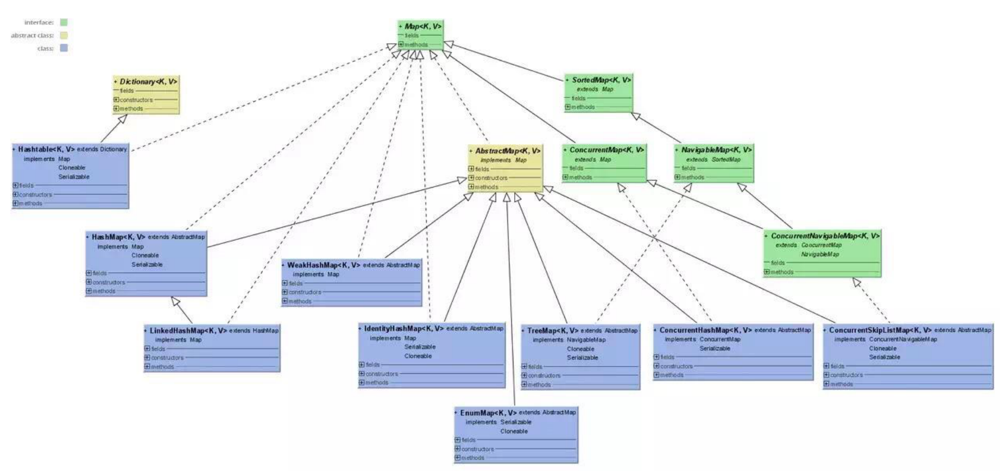

Map 表示键值对的映射，用来存储双列集合数据。通用实现包括 `HashMap` 、 `~~Hashtable~~` 、 `TreeMap` 、 `LinkedHashMap` 、 `WeakHashMap` 等。键均不可重复，但是值可以重复。

#### HashMap

1. 三点变化

- 数据结构发生变化，原来的数组+链表，变成数组+链表或红黑树；
- entry 变成 node，头插法变成尾插法，解决并发写时的循环链表问题；
- put 方法发生变化，多了一个判断链表长度的条件，链表长度>8，就转化为红黑树，node 个数<6 就退化为链表；

2. 构造方法中的三个参数：初始化容量（默认 16），负载因子（默认 0.75），扩容阈值（初始化容量\*负载因子，默认 12）
3. put 方法： 先判断是否需要执行扩容，如果不需要就计算 key 的 hashcode，然后找到 hash 桶的坐标，也就是数组的索引，之后再把元素插到链表或者红黑树的节点上；
4. get 方法： 先计算 hash 桶坐标，之后再遍历链表或红黑树来判断值是否相等；
5. 扩容机制： 扩容为原来的两倍；
6. 同步机制： 不支持同步，但是可以使用 Collections.synchronizedMap(hashMap)进行同步；

- Java7 实现
  - `基本数据结构`是： Entry 的数组，而 Entry 中又有一个 next 引用，指向下一个 Entry，整体看起来是一个 数组 + 链表 的数据结构，其实本质上是一个数组；
    - 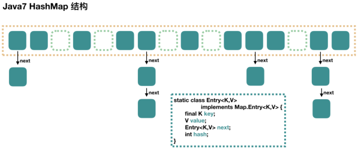
  - `相关属性及默认值`
    - 初始化容量 DEFAULT_INITIAL_CAPACITY ： 16
    - 装载因子 DEFAULT_LOAD_FACTOR ： 0.75
    - 扩容的阈值 threshold ： capacity \* loadFactor
  - `构造方法`： 有四个初始化构造方法，主要都是给 loadFactor 和 initialCapacity 两个属性的赋值，而底层的数据结构的初始化则是在 put 值时才进行「言外之意，就是声明时只是创建了一个对象的引用，真正分配内存空间发生在首次执行 put 方法之后」；
  - `数据结构`： 数组 + 单向链表
  - `put(pKey, pValue)原理`： 先对 key 进行 hashcode 操作，找到对应的数组位置，将该 key 对应的 Entry（链表节点的数据结构为 Entry）放进去数组，具有相同 hashcode 值得 Entry 为同一个位置，不同的值以单向链表的方式存放，以头插法「就是把元素插入到数组与链表连接的那个元素的中间」存放，多线程条件下，有可能会出现循环链表的情况（我们知道只要 put，就有可能扩容，只要扩容，就有大概率需要重新 hash，重新 hash 时，假设线程 A 在 rehash 时算出来有一个 EntryA 指向了 EntryB，而线程 B 在 rehash 时算出来 EntryB 指向 EntryA，这就导致了一个循环链表），这种情况会导致多线程并发读时出现死锁的情况
  - `get原理`： 先比对 hashcode 是否相同，相同后使用 equals 方法判断值是否相同，相同的话就可以获取指定元素，查找的时间复杂度为 O(n)
  - `扩容机制`： 扩容为原来的 2 倍，扩容后会重新计算 hashcode 的值。
  - `同步特性`： 不支持线程同步，即非线程安全
- Java8 实现
  - transient Node<K,V>[] table;
  - `相关属性及默认值`
    - 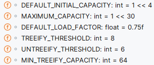
    - 树化最小值 ： 默认为 64， 表示数组在转化成红黑树的过程中，如果数组中长度小于 64，会先扩容数组；
    - 树退化成链表的最小值 ： 6 ， 在进行缩容时，红黑树会退化成链表，退化成链表时的元素个数；
  - `hash函数发生变化`：相比在 1.7 中的 4 次位运算，5 次异或运算（9 次扰动），在 1.8 中，只进行了 1 次位运算和 1 次异或运算（2 次扰动），分布更加均匀，性能更好
    - 在 1.8 中，是调用了 key 的父类 Object 的 hashcode 方法获取 hashcode，然后用 hashcode 进行 1 次位运算和 1 次异或运算
    - 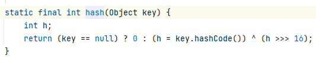
  - `put方法发生变化`： 1.8 会多了链表长度的判断，如果链表长度超过 8，就会自动转化为红黑树； 如果 hash 槽的元素个数小于 6 时，会退化为链表；
    - 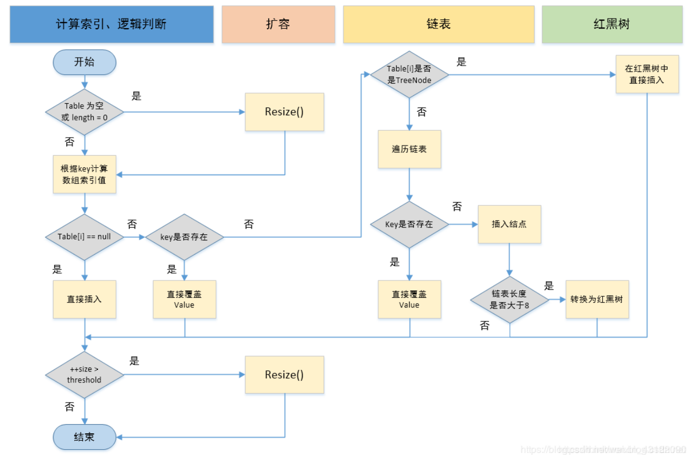
  - `数据结构发生变化`：
    - 数组中的元素由 1.7 的 entry 变成了 1.8 的 node
    - 头插法变成尾插法：解决了循环链表的问题
    - 1.7 时数组+单向链表，变成了 1.8 中的数组 + 单向链表 + 红黑树，优化了 hash 冲突后的查询效率，单向链表的查询效率是 O(n)，而 1.8 链表长度超过 8，就会自动转化为红黑树，红黑树是一种二叉查找树，查询效率为 O(logn)，查询效率更高
    - 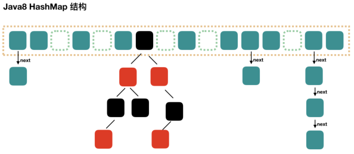
  - `遍历方法`： 都是调用底层的 Itrator 迭代器
  - `同步特性`： 同样不支持线程同步，同样支持 fast-fail 机制
- 实际应用
  - `初始化可以指定初始化容量，也可以指定负载因子`
    - 指定初始化容量： 如果知道业务的数据量，最好是使用带一个参数的构造函数来初始化 hashmap，即制定初始化 hashmap 的容量，并且这个容量最好是 2 的幂次方；如果自定义容量不是 2 的幂次方，程序会通过 tableSizeFor(int cap) 方法初始化容量为 2 的幂次方（如，初始化容量为 7，不是 2 的幂次方，tableSizeFor(7)方法会找到大于这个初始化容量值最小的 2 的幂次方 8；再如，初始化容量为 15，不是 2 的幂次方，tableSizeFor(15)就会找到大于这个初始化容量值最小的 2 的幂次方 16，再如：tableSizeFor(30)=tableSizeFor(31)=tableSizeFor(32)=32）
      - 指定负载因子： 两个参数的构造函数，除了指定初始化容量外，还指定了负载因子，但是实际中，负载因子默认即可，如果真的有必要，我们可以通过调节负载因子的大小来影响 hashmap 的行为：
        - 当我们调低负载因子时，HashMap 所能容纳的键值对数量变少。扩容时，重新将键值对存储新的桶数组里，键与键之间产生的碰撞会下降，链表长度变短。此时，HashMap 的增删改查等操作的效率将会变高，这里是典型的拿空间换时间
        - 相反，如果增加负载因子（负载因子可以大于 1），HashMap 所能容纳的键值对数量变多，空间利用率高，但碰撞率也高。这意味着链表长度变长，效率也随之降低，这种情况是拿时间换空间
  - `使用任何对象作为key` ： 是可以使用任何对象作为 key 的，但是前提是这些对象要实现重写 object 的 hashcode()方法和 equals()方法
- 面试题
  - 为什么初始化容量为 16？
    - 这应该是一个经验值，可以是 8，也可以是 32，如果是 16 且负载因子为 0.75 的话，根据泊松分布，7 是分界岭，小于 7（即小于等于 6）应该使用链表；大于 7（即大于等于 8）应该变成红黑树；
  - HashMap 中几个关键属性为什么都用 transient 关键字修饰？
    - 这是为了在序列化时，为了节省空间，只需要把不为空的 Node 元素序列化即可。
  - 能否使用任何类作为 HashMap 的 key？应该注意什么？
    - 可以，但是这些类要重写 hashcode()方法和 equals()方法
  - 1.8 中为什么 HashMap 中数组长度要是 2 的幂次方？
    - 因为 put 操作时，是用 hashcode 和 （数组长度-1） 做 “与” 运算的出数组下标的，而实际上在计算数组下标位置时，只需要用 hashcode 对数组长度做除留余数法就可以得到数组下标，而当数组长度为 2 的幂次方时，用 hashcode 对数组长度做除留余数法就等价于 hashcode 和 （数组长度-1） 做 “与” 运算，并且“与”运算的性能更好，因此数组长度为 2 的幂次方。

::: tip 散列表数据结构

1. 散列算法： 把一串数据变成固定长度的一种算法
2. 负载因子： 数组中实际的元素个数 / 数组所能容纳的元素个数 ， 负载因子大于 0，负载因子越大代表数组元素越多，冲突也就越多，put 和 get 的性能也就越差，但是节省存储空间；负载因子越小代表数组中元素越少，冲突也就越少，put 和 get 的性能也就越好，但是浪费存储空间

:::

#### ~~Hashtable~~

> 官方已不建议使用。

这里类比 HashMap 来学习，二者的区别主要有：

- 默认值不一样： Hashtable 默认初始化容量为 11， 扩容为 2n+1； HashMap 默认初始化容量为 16， 扩容为 2n；
- 对 Null 的支持不一样： Hashtable 既不允许 null 的 key，也不允许 null 的 value； HashMap 只允许一个 null 的 key，允许多个 null 的 value；
- 同步特性不一样： Hashtable 支持线程同步，即线程安全，但是效率很低； HashMap 不支持线程同步，效率略高
- 基类不同： Hashtable 继承至 Dictionary 类， HashMap 继承至 AbstractMap 类，
- 迭代器不同： Hashtable 的迭代器是 Enumerator ，它不是 fail-fast 的； HashMap 的迭代器是 Iterator ，支持 fail-fast 机制；

1. 存储上，既不支持 null-key，又不支持 null-value；扩容时，扩容为 2n+1；
2. 迭代器是 Enumerator，不支持 fast-failed 机制；
3. 继承自 Dictionary 类；
4. 是线程安全的，但是同步效率很低，同步时多用 ConcurrentHashMap，而不是 Hashtable

#### TreeMap

- 保存内容： 有序的 K-V 键值对集合，通过红黑树实现
- 实现： 实现了 SortedMap 接口和 NavigableMap 接口
  - 实现 SortedMap 接口让 TreeMap 具有了根据键排序的能力，默认根据 key 的升序顺序进行排序，也可以根据构造时传入的 Comparator 进行排序； 使用 Iterator 遍历时，得到的记录是排过序的；
  - 实现 NavigableMap 接口让 TreeMap 具有了对集合内元素搜索的能力
- 同步特性： 不支持线程同步，即线程不安全的；

#### LinkedHashMap

- 保存了记录的插入顺序，新得到的肯定是先插入的，继承自 HashMap，因此具有和 HashMap 一样的查询效率。
- 内部维护了一个双向链表，用来维护插入顺序
- 也可以在构造时传入参数，使其按照访问次数排序；

#### WeakHashMap

- WeakHashMap 的 Entry 继承自 WeakReference（弱引用类，会在下一次垃圾回收时被回收），主要用来实现缓存。
- Tomcat 中的 ConcurrentCache 使用了 WeakHashMap 来实现缓存；

## 工具类

### java.util.Collections

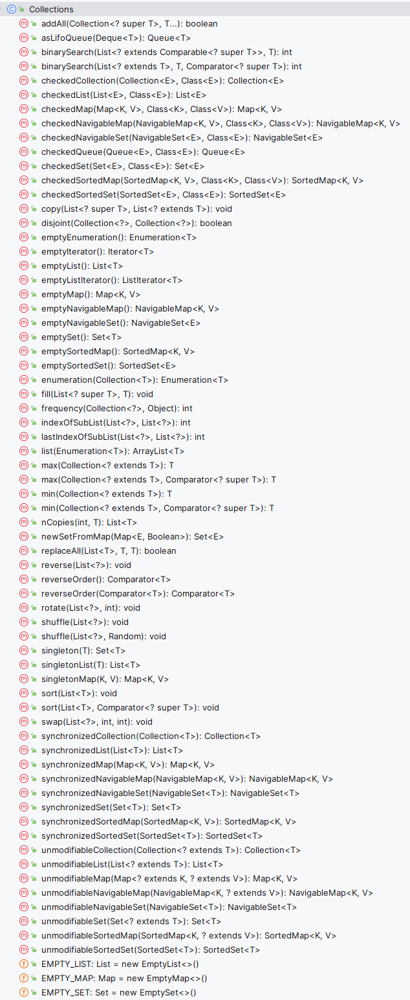

1. 算法 - Collections 类包含这些有用的静态方法。

| 方法名称                                            | 方法解释                                                                                                                                                                                                                                                                                                                                                                                                                                                              |
| --------------------------------------------------- | --------------------------------------------------------------------------------------------------------------------------------------------------------------------------------------------------------------------------------------------------------------------------------------------------------------------------------------------------------------------------------------------------------------------------------------------------------------------- |
| sort(List)                                          | Sorts a list using a merge sort algorithm, which provides average case performance comparable to a high quality quicksort, guaranteed O(n*log n) performance (unlike quicksort), and stability (unlike quicksort). A stable sort is one that does not reorder equal elements. 使用归并排序算法对列表进行排序，其平均性能与高质量的快速排序相当，保证 O(n*log n)的性能（与快速排序不同），并且具有稳定性（与快速排序不同）。稳定的排序是指不会重新排列相等元素的排序。 |
| binarySearch(List, Object)                          | Searches for an element in an ordered list using the binary search algorithm. 使用二分查找算法在有序列表中搜索元素。                                                                                                                                                                                                                                                                                                                                                  |
| reverse(List)                                       | Reverses the order of the elements in a list. 反转列表中元素顺序。                                                                                                                                                                                                                                                                                                                                                                                                    |
| shuffle(List)                                       | Randomly changes the order of the elements in a list. 随机改变列表中元素顺序。                                                                                                                                                                                                                                                                                                                                                                                        |
| fill(List, Object)                                  | Overwrites every element in a list with the specified value. 用指定的值覆盖列表中的每个元素。                                                                                                                                                                                                                                                                                                                                                                         |
| copy(List dest, List src)                           | Copies the source list into the destination list. 将源列表复制到目标列表中。                                                                                                                                                                                                                                                                                                                                                                                          |
| min(Collection)                                     | Returns the minimum element in a collection. 返回集合中的最小元素。                                                                                                                                                                                                                                                                                                                                                                                                   |
| max(Collection)                                     | Returns the maximum element in a collection. 返回集合中的最大元素。                                                                                                                                                                                                                                                                                                                                                                                                   |
| rotate(List list, int distance)                     | Rotates all of the elements in the list by the specified distance. 将列表中的所有元素按指定距离旋转。                                                                                                                                                                                                                                                                                                                                                                 |
| replaceAll(List list, Object oldVal, Object newVal) | Replaces all occurrences of one specified value with another. 将所有指定值替换为另一个值。                                                                                                                                                                                                                                                                                                                                                                            |
| indexOfSubList(List source, List target)            | Returns the index of the first sublist of source that is equal to target. 返回 source 中第一个与 target 相等的子列表的索引。                                                                                                                                                                                                                                                                                                                                          |
| lastIndexOfSubList(List source, List target)        | Returns the index of the last sublist of source that is equal to target. 返回 source 中等于 target 的最后一个子列表的索引。                                                                                                                                                                                                                                                                                                                                           |
| swap(List, int, int)                                | Swaps the elements at the specified positions in the specified list. 交换指定列表中指定位置的元素。                                                                                                                                                                                                                                                                                                                                                                   |
| frequency(Collection, Object)                       | Counts the number of times the specified element occurs in the specified collection. 计算指定元素在指定集合中出现的次数。                                                                                                                                                                                                                                                                                                                                             |
| disjoint(Collection, Collection)                    | Determines whether two collections are disjoint, in other words, whether they contain no elements in common. 判断两个集合是否互斥，换句话说，它们是否不包含任何共同元素。                                                                                                                                                                                                                                                                                             |
| addAll(Collection<? super T>, T...)                 | Adds all of the elements in the specified array to the specified collection. 将指定数组中的所有元素添加到指定的集合中。                                                                                                                                                                                                                                                                                                                                               |

2. 包装实现 - 用于与其他实现一起使用的功能增强实现。仅可通过静态工厂方法访问。

| 方法名称                     | 方法解释                                                                                                                                                                                                                                                                                                                                                                                                                                                                                                                                               |
| ---------------------------- | ------------------------------------------------------------------------------------------------------------------------------------------------------------------------------------------------------------------------------------------------------------------------------------------------------------------------------------------------------------------------------------------------------------------------------------------------------------------------------------------------------------------------------------------------------ |
| Collections.unmodifiableXXXX | Returns an unmodifiable view of a specified collection that throws an UnsupportedOperationException if the user attempts to modify it. 返回一个不可修改的指定集合视图，如果用户尝试修改它，则抛出 UnsupportedOperationException 异常。                                                                                                                                                                                                                                                                                                                 |
| Collections.synchronizedXXXX | Returns a synchronized collection that is backed by the specified (typically unsynchronized) collection. As long as all accesses to the backing collection are through the returned collection, thread safety is guaranteed.返回一个由指定（通常是未同步的）集合支持的同步集合。只要所有对支持集合的访问都通过返回的集合进行，就可以保证线程安全。                                                                                                                                                                                                     |
| Collections.checkedXXXX      | Returns a dynamically type-safe view of the specified collection, which throws a ClassCastException if a client attempts to add an element of the wrong type. The generics mechanism in the language provides compile-time (static) type checking, but it is possible to bypass this mechanism. Dynamically type-safe views eliminate this possibility. 返回指定集合的动态类型安全视图，如果客户端尝试添加错误类型的元素，则抛出 ClassCastException 。语言中的泛型机制提供编译时（静态）类型检查，但可以绕过此机制。动态类型安全视图消除了这种可能性。 |

3. 适配器实现 - 将一个集合接口适配到另一个接口的实现

| 方法名称           | 方法解释                                                                                                                   |
| ------------------ | -------------------------------------------------------------------------------------------------------------------------- |
| newSetFromMap(Map) | Creates a general-purpose Set implementation from a general-purpose Map implementation. 从通用 Map 实现创建通用 Set 实现。 |
| asLifoQueue(Deque) | Returns a view of a Deque as a Last In First Out (LIFO) Queue. 返回一个 Deque 作为后进先出( Queue )的视图。                |

## 同步实现

这些实现是 java.util.concurrent 的一部分。

- ConcurrentLinkedQueue - An unbounded first in, first out (FIFO) queue based on linked nodes. 并发链表队列 - 基于链表的无限大小先进先出（FIFO）队列。
- LinkedBlockingQueue - An optionally bounded FIFO blocking queue backed by linked nodes. LinkedBlockingQueue - 一个可选有界 FIFO 阻塞队列，由链表节点支持。
- ArrayBlockingQueue - A bounded FIFO blocking queue backed by an array. ArrayBlockingQueue - 基于数组的有限 FIFO 阻塞队列。
- PriorityBlockingQueue - An unbounded blocking priority queue backed by a priority heap. 优先级阻塞队列 - 由优先级堆支持的无限阻塞优先级队列。
- DelayQueue - A time-based scheduling queue backed by a priority heap. 延迟队列 - 基于优先级堆的时间调度队列。
- SynchronousQueue - A simple rendezvous mechanism that uses the BlockingQueue interface. 同步队列 - 一种使用 BlockingQueue 接口的简单 rendezvous 机制。
- LinkedBlockingDeque - An optionally bounded FIFO blocking deque backed by linked nodes. LinkedBlockingDeque - 一个可选有界 FIFO 阻塞双端队列，由链表节点支持。
- LinkedTransferQueue - An unbounded TransferQueue backed by linked nodes. LinkedTransferQueue - 一个由链表节点支持的未限定大小的队列。
- ConcurrentHashMap - A highly concurrent, high-performance ConcurrentMap implementation based on a hash table. This implementation never blocks when performing retrievals and enables the client to select the concurrency level for updates. It is intended as a drop-in replacement for Hashtable. In addition to implementing ConcurrentMap, it supports all of the legacy methods of Hashtable. 并发 HashMap - 基于哈希表的高度并发、高性能实现。此实现在进行检索时永远不会阻塞，并允许客户端选择更新的并发级别。它旨在作为 Hashtable 的即插即用替代品。除了实现 ConcurrentMap 之外，它还支持 Hashtable 的所有旧方法。
- ConcurrentSkipListSet - Skips list implementation of the NavigableSet interface. 并发跳表集合 - 实现了 NavigableSet 接口的跳表列表。
- ConcurrentSkipListMap - Skips list implementation of the ConcurrentNavigableMap interface. 并发跳表映射 - 实现 ConcurrentNavigableMap 接口的跳表列表。

todo：

- Lists 工具类： 主要是针对 List 接口实现的类而提供的工具类。常用的有： Lists.asLists()
- Collections 工具类： 主要提供一些通用的方法；
  - Collections.unmodifiableCollection()
  - Collections.synchronizedList()
- Iterator 迭代器： 迭代器

## 参考

- [官方文档](https://docs.oracle.com/javase/8/docs/technotes/guides/collections/reference.html)
- [浅谈 ArrayList 动态扩容](https://blog.csdn.net/zymx14/article/details/78324464)
- 字节大神的 Java 笔记.pdf
- Java 集合框架常见面试题.pdf
- Java 集合面试题 52 道.pdf
- [《吊打面试官》系列-HashMap](https://mp.weixin.qq.com/s/0Gf2DzuzgEx0i3mHVvhKNQ)
- [Java 集合框架看这一篇就够了](https://mp.weixin.qq.com/s/bVOSat47L0Hskfx9akAN6Q)
- [原创 | 万万没想到，HashMap 默认容量的选择，竟然背后有这么多思考！？](https://mp.weixin.qq.com/s/ktre8-C-cP_2HZxVW5fomQ)
- [我就知道面试官接下来要问我 ConcurrentHashMap 底层原理了](https://mp.weixin.qq.com/s/My4P_BBXDnAGX1gh630ZKw)
- [JavaFamily](https://github.com/AobingJava/JavaFamily)
