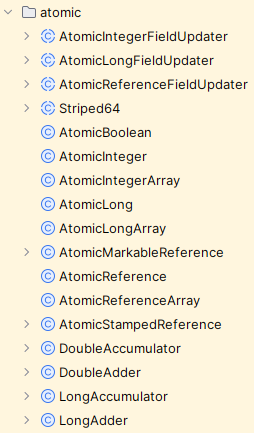
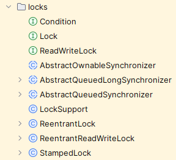
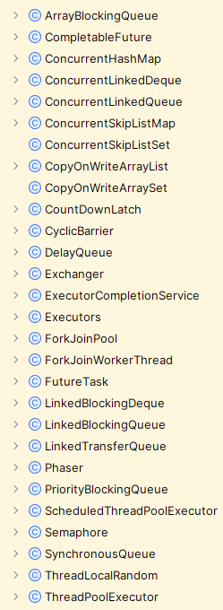

---
dir:
  link: true
---

# JUC

| **日期** | **迭代内容** |
| --- | --- |
| 23-11-24 | 1. 导学指引。确定一种学习和记忆 JVM 相关知识点的逻辑树。 |
| 23-11-26 | 1. 调整整个文档结构，并加以完善。 |

::: tip 导学指引

1. 根据计算机硬件架构的基础可知，CPU 的运算速度要远远高于内存的速度，为了充分利用 CPU，人们采取了很多优化手段，这些优化手段主要包括下面三个：
   1. 使用缓存。即在 CPU 和内存中间添加速度高于内存的缓存，目的是缩小 CPU 与内存之间的速度差距。
   2. 使用指令优化。即对操作 CPU 进行运算的指令进行优化，使指令更加合理，常见手段有对指令进行合并、增减、重排序等。重排序是重点。
   3. 使用分时复用技术。即对 CPU 的运算时间进行切片，让指令占用 CPU 的运算时间不能太短也不能太长。太长有可能会产生等待，太短又可能会引起这个指令还没有运算完就要布置下一个指令的运算现场了，会导致频繁的上下文切换，这是一笔巨量的开销。
2. 虽然三个优化手段提高了 CPU 的运算能力，但是这三个优化手段却同样产生了一些问题：
   1. 缓存技术产生了可见性问题；
   2. 指令优化技术产生了顺序性问题；在 Java 中，指令优化技术是由执行引擎决定的，关键技术有热点代码、同步消除、无同步等方案。
   3. 分时复用技术产生了原子性问题；
3. 我们发现，如果把上面那三个问题全部都解决掉，就发现多线程的运行结果就跟我们的预期是一致的了。由此引出线程安全的概念： **多线程在并发场景下运行多次的结果都是与我们的预期结果是一致的，那么我们就说这种场景是并发安全的**，并由此得出并发编程三要素的概念——要想保证线程是安全的，就需要满足三个条件，且这三个条件缺一不可，由此我们才说线程是安全的。
4. 任何基于操作系统实现的高级编程语言，要想实现支持并发编程的目标，就必须要直面并发编程三要素，也就是说，一种高级编程语言，如果声称支持并发编程，那么它要么提供一种能够解决三要素问题的方案，要么使用它的程序员能够自行解决三要素问题，否则它就不能算是支持并发编程。
5. 在并发编程中，要处理两个关键问题：线程之间如何通信以及线程之间如何同步。处理这两个关键问题，有两种通用的方案： 共享内存 和 消息传递 。
   1. 通信是指线程之间如何交换信息。
      1. 共享内存： 线程之间共享程序的公共状态，线程之间通过写 - 读内存中的公共状态来隐式进行通信。
      2. 消息传递： 线程之间没有公共状态，线程之间必须通过明确的发送消息来显式进行通信。
   2. 同步是指如何控制线程之间指令执行步骤的相对顺序。
      1. 共享内存： 程序员必须显式地控制线程对共享内存的互斥访问； 【有点类似于“编程优于约定”的编程范式，Spring中是“约定优于配置”的编程范式】
      2. 消息传递： 消息的发送发生于消息接收之前，同步是隐式的； 【有点类似于“约定优于编程”的编程范式】
6. Java是一种高级编程语言，针对并发编程三要素，提供了一整套基于Java内存模型的解决方案，在这套方案的基础之上，再配合Java编程规范的要求，使得Java语言能够完美支持并发编程。
7. 但实际情况下，并不一定需要同时满足这三个条件也可以达到我们预期的效果，并由此衍生出各式各样的并发编程的方法。
8. 不过在了解这些并发编程的方法前，需要先了解一下并发编程中单个线程的相关知识：
   1. Java 中的线程实现方法，有哪些方法，这些方法用途是什么？为什么要用这些方法？
   2. 这些方法底层的原理是什么？
9.  由单线程的相关知识，引出多线程的内容。
:::

## 发展过程 

1. 现实中例子的抽象：银行服务窗口。早期，银行服务窗口只有一个，随着客户数量的增加，人们发现，只有一个窗口的办事效率太低了。于是本能的想到增加窗口能够提高办事效率。但是一段时间后，人们发现这样还不能够满足客户的需求，并且窗口数量不可能一直增加，于是人们就研究客户办理的银行业务的特点。人们就发现客户办理业务时，有时候需要客户去填写一些资料，所以业务员并不是一直工作着的，甚至到后期，人们发现业务员有 80% 的时间都是等待状态，于是人们又开始把银行业务进行切分，把客户填表的窗口占用时间让出来，让业务员服务其它客户。
2. 事实上，线程的发展就是由银行业务员服务客户——这一现实例子抽象出来的，只不过是线程的发展相比于这一现实例子更加复杂而已。
3. 人们在冯诺依曼体系的基础上，研究发现下面这些技术可以提高任务的运行效率。但这些技术发展的同时也产生了其它问题。【我们一边利用这些优化技术来提高线程的工作效率，而另一方面这些优化技术又让线程的工作结果存在着问题，我们可以对优化手段和产生的问题之间的关系来定义线程安全级别，事实上很多地方都有这种冲突，如 MySQL 中的隔离级别】
   1. 缓存技术：可见性问题。
   2. 分时复用技术：原子性问题。
   3. 指令优化技术：有序性问题。
4. 这三种技术是最底层的基础技术，可以认为，这三种技术是基于物理结构和操作系统层面实现的。而高级语言的“线程”等相关的概念，则是对这些技术的再次应用后的一种抽象概念，这样做的好处在于让程序员不用过度关注底层的原理，使得学习曲线不用那么陡峭。
   1. Java 虚拟机规范角度： Java 设计人员先是从直接复用操作系统操作线程的相关指令方面，提供一些关键字和一些编译原则，让早期的 Java 版本具有线程相关的基础特性。这些关键字和编译原则主要有：【synchronized、volatile、final、static、Happens-Before 原则、AS-If 原则、热点代码分析、同步消除、栈上分配、指令优化、线程本地缓存、锁升级过程】等。
   2. Java 语言规范角度：再之后，Java 设计人员从开发操作系统本地接口的方式，使得 Java 语言直接操控操作系统层面的线程成为可能。这种开放操作系统本地接口的方式就是 JNI 技术。 Java 中的线程的概念，就是 JNI 基础上发展而来的。并且为了更好的理解 Java 中的线程，Java 设计人员还根据冯诺依曼体系体系发展出 JMM 模型，以便于 Java 程序员更好的理解 Java 中的线程模型的运行原理。【Java 线程与操作系统线程的映射关系、Java 内存模型、Java 线程的生命周期】
   3. Java 语言规范的高级应用角度： JNI 技术的核心在于 Unsafe 工具包，Thread 的相关映射就是对 Unsafe 工具的抽象应用。后来随着高级一些的应用场景的出现，在 Unsafe 工具包的基础上又发展出来 LockSupport、Condition 等技术。而 线程池、CompleteFuture 、AQS、Fork/Join 等则是在 Thread、LockSupport、Condition 等基础上封装的一些高级工具。【线程池使用方式及其原理、线程通信、AQS 使用及其原理以及常见的 AQS 衍生类、CompleteFuture 的使用及其原理、Fork/Join 框架的使用及其原理】

## 大纲

- 冯诺依曼体系【不同缓存的访问速度的差异】、三种优化手段以及各自所产生的问题、线程安全级别
- Java 虚拟机规范层面
   - 理论依据： Java 内存模型的内容、与操作系统线程的映射关系；
   - 字节码的执行过程： Happens-Before 原则、AS-IF 原则、锁升级；
   - 源代码编译成字节码的编译过程：锁升级、指令优化【同步消除、栈上分配、热点代码统计】、锁分类
- Java 语言规范层面
   - 理论基础： JNI、上述的 Java 虚拟机规范；
   - 简单应用
      - 关键字： synchronized、volatile、final、static；
      - 包装类：ThreadLocal；
      - Unsafe 工具类中的方法、原理、作用、扩展等；
      - 线程的使用方式、生命周期、状态转化、字节码；
   - 高级应用
      - 重要应用框架的使用过程以及原理： 线程池、AQS、FutureTask、Fork/Join 框架
      - 工具类：原子类、集合类、锁类、其它并发工具

- 线程安全的分类
- 线程安全的实现方法
- 线程基础知识
   - 线程的创建方式及分类
- Java 中的所有锁
- sychronized、volatile、final 关键字的相关原理
- Unsafe 类及其相关实现
- LockSupport 类及其相关实现
- AQS 原理【与线程池的区别】
   - ReentrantLock
   - ReentrantReadWriteLock
   - ThreadLocalHoldCounter
   - HoldCounter
- 线程池
   - ThreadPoolExecutor
   - FutureTask
   - Fork/Join框架
- 并发工具类
   - 原子类
   - 集合类
   - 锁类
   - 其他并发工具

Q： 

1. 基础概念：线程【协程】和进程、串行和并行、同步和异步、并发和并行、线程安全【任务大小与并发效率之间的关系->线程安全程度】、Java 中的锁。
2. JNI 技术的使用样例。
3. register 的原理+unsafe 与 Thread 的映射关系。
4. 一个线程运行的基本原理

## 知识体系

- 1010-线程的产生背景

- 2010-关键字

- 3010-Java 中的锁
- [ ] 线程池内容与 AQS 的顺序问题

- 4010-线程及线程池

- 5010-Unsafe 类

- 6010-LockSupport 类及其相关实现
> 1. 

- 7010-AQS

JUC 包结构

## 参考

1. [面渣逆袭：Java并发六十问，图文详解，快来看看你会多少道！](https://mp.weixin.qq.com/s?__biz=MzkwODE5ODM0Ng==&mid=2247489245&idx=1&sn=bc52281ebc85372e19513d663beb2d2d&chksm=c0ccfe78f7bb776e2c6396fe26aca84d0cd96f407e6fe0bf6eb068aed638ba9491bce8fc5b4c&scene=178&cur_album_id=2041709347461709827#rd)
2. [♥Java并发知识体系详解♥](https://pdai.tech/md/java/thread/java-thread-x-overview.html)
3. [https://www.wolai.com/niwx3ZkfJnPXGa2J7sH5Xp](https://www.wolai.com/niwx3ZkfJnPXGa2J7sH5Xp)
4. [CompletableFuture原理与实践-外卖商家端API的异步化 - 美团技术团队](https://tech.meituan.com/2022/05/12/principles-and-practices-of-completablefuture.html)
5. [聊聊并发编程的12种业务场景](https://mp.weixin.qq.com/s/-2goNthdpK8KXLV5FrkCzg)
6. [2. CompletableFuture](https://www.yuque.com/gongxi-wssld/csm31d/ip2ueru5itmgsgly)

## 另外一个大纲

1. 前置知识点
   1. 进程与线程 - 研究的背景
   2. 堆管存储、栈管运行 - 线程运行的基本原理
   3. JMM - Java 中的并发编程要基于 JVM 来实现；
   4. JNI - 为 Java 提供直接运行操作系统指令的方法；
2. 基础
   1. Unsafe 方法解析
   2. JVM 做的努力【关键字+happens-before 原则】
   3. 一个线程运行的基本原理

### 面试题

1. 解释单发和并发、同步和异步、串行和并行、线程和进程、线程安全；
2. JMM 和并发三要素、Happens-Before 原则；
3. Java 中线程的生命周期及转化过程；
4. 线程的创建方式有哪些？它们的区别？
5. 

