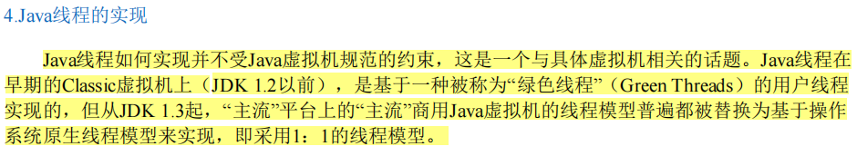
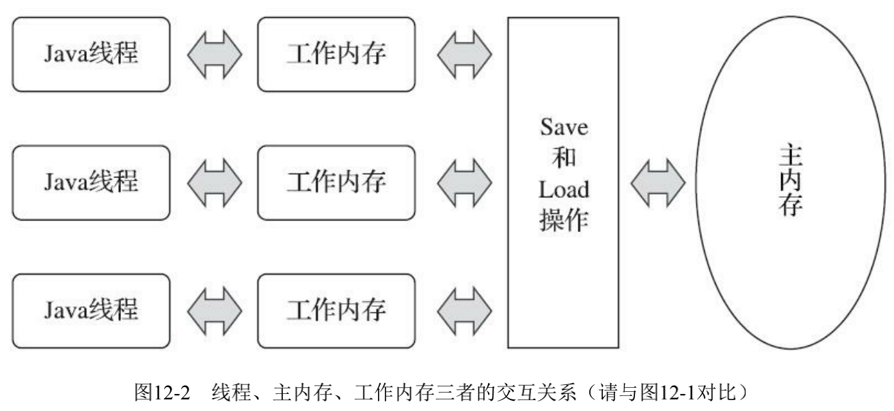
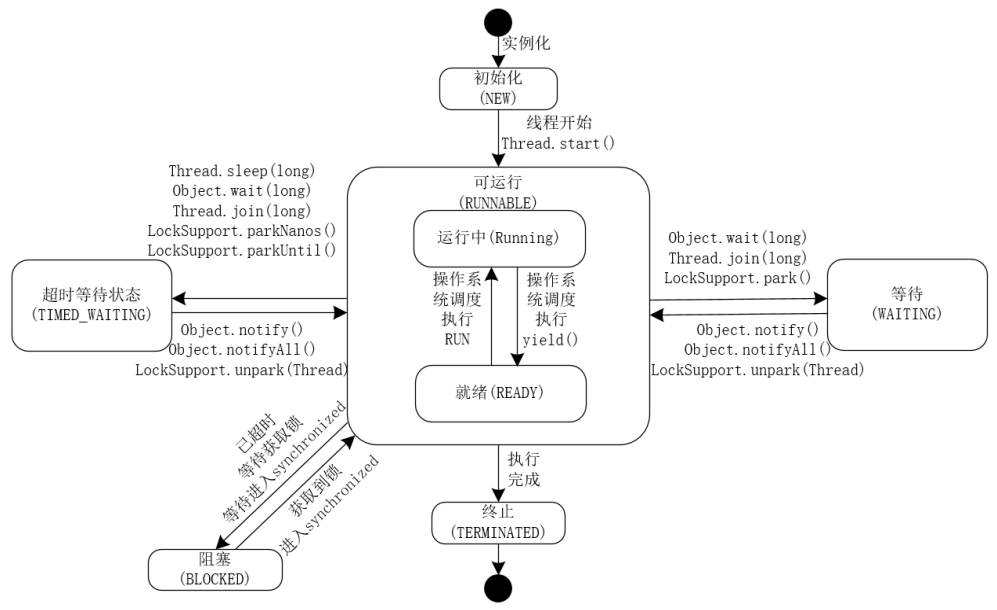
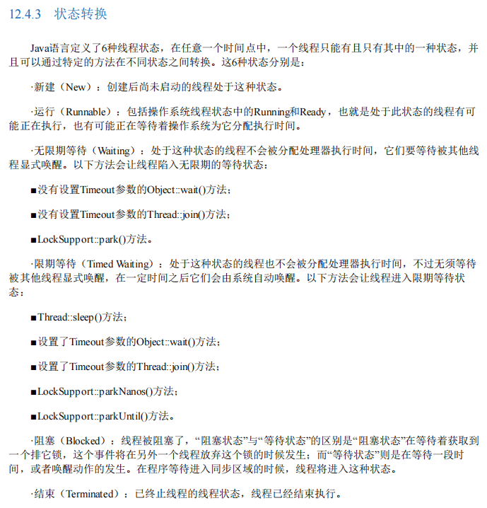

# 1. 线程产生的背景

> 1. 冯诺依曼体系【不同缓存之间的访问的速度差异】
> 2. 线程的优化手段及其产生的问题
> 3. 并发安全级别及同步手段
> 4. Java 内存模型、Happens-Before 原则、As-If 原则
> 5. 指令优化手段、线程同步优化、编译器优化等

## 单线程的创建方式

java 中创建单线程有三种方式：

::: tabs

@tab 1. 继承 Thread 类

```java
// 创建
class MyThread extends Thread{
    @Override
    public void run(){
      // do something
    }
}

// 使用
MyThread m = new MyThread();
m.start();

```

@tab 2. 实现 Runnable 接口

```java

// 实现runnable
// 创建一个任务对象
MyRunnable r = new MyRunnable();
// 创建一个线程并给他一个任务
Thread t = new Thread(r);
// 启动线程
t.start();

```

@tab 3. 实现 Callable 接口

```java
class Mycallable implements Callable<T> {
    @Override
    public <T> call() throws Exception {
      return T;
    }
}

Callable<Integer> callable= new MyCallable();
FutureTask<Integer> future = new FutureTask<>(callable);
new Thread(future).start();
Integer j=task.get();
System.out.println("return"+j);

```

:::

- 三种方式的异同
  - 实现 Runnable 接口方式与继承 Thread 类的方式的区别
    - 通过创建任务，然后给线程分配任务的方式实现多线程，更适合多个线程同时执行任务的情况
    - 可以避免单继承所带来的局限性
    - 任务与线程是分离的，提高了程序的健壮性
    - 后期学习的线程池技术，接受 Runnable 类型的任务，不接受 Thread 类型的线程
  - 实现 Callable 接口方式，相当于又在实现 Runnable 接口方式上添加了返回值的过程

## API

- `currentThread` 线程名称的设置与获取
- `start` 的执行顺序与线程的执行顺序不一致
- `currentThread` 方法用来获取当前执行线程的名称
- `isAlive` 用来判断线程是否还在存活状态，活动状态就是线程已经启动且运行没有结束。线程处于正在运行或准备开始运行的状态，就认为线程是『存活』的状态
- `sleep` 让当前线程睡眠，让出 CPU，使线程从执行状态变成限时阻塞状态。等待时间结束后，线程不一定会立即执行，线程状态会变成可执行状态。作用是在指定的毫秒数内让当前『正在执行的线程』暂停执行。
- `getId` 方法，作用是获取当前线程的唯一标识
- 停止线程
  - `stop` 方法强制结束线程。stop 方法已经被作废，如果强制让线程停止有可能使一些清理性的工作得不到完成。另外一个原因是对锁定的对象进行『解锁』，导致数据得不同同步的处理，出现数据不一致性的问题。
  - 也可以使用退出标志，使线程正常退出，也就是当 run 方法完成后线程终止。
- `interrupt` 让当前线程进入阻塞状态。调用 interrupt 方法不会真正的结束线程，在当前线程中打上一个停止的标记。Thread 类提供了 interrupted 方法测试当前线程是否中断，isInterrupted 方法测试线程是否已经中断。如果程中有 sleep 代码，不管是否进入到 sleep 的状态，如果调用了 interrupt 方法都会产生异常信息。
- 暂停线程使用 `suspend` ，重启暂停线程使用 resume 方法，suspend 如果独占公共的同步对象，使其它线程无法访问公共同步对象，suspend 会造成共享对象数据不同步
- `join` 多个线程进行合并，本质是：线程 a 需要在合并点进行等待，一直等到 b 线程执行完，或者等待超时时，才继续执行。
- `yeild` 此方法相当于让当前线程让出 cpu 执行权限，让 cpu 执行其他线程，但是此方法虽然会让当前线程暂停，但是不会行阻塞当前线程，只是让线程转入就绪状态，可能当前线程暂停了一下，又立即获得了 cpu 的执行权限，又开始执了。
- 线程的优先级
  - 在操作系统中，线程可以划分优先级，优先级较高的线程得到更多的 CPU 资源，也就 CPU 会优先执行优先级较高的线程对象中的任务。设置线程优先有助于帮助『线程调度器』确定在下一次选择哪个线程优先执行。
  - 设置线程的优先级使用 setPriority 方法，优级分为 1~10 个级别，如果设置优先级小于 1 或大于 10，JDK 抛出 IllegalArgumentException。JDK 默认设置 3 个优先级常量，MIN_PRIORITY=1(最小值)，NORM_PRIORITY=5(中间值，默认)，MAX_PRIORITY=10(最大值)。
  - 获取线程的优先级使用 getPriority 方法。
  - 线程的优先级具有继承性，比如线程 A 启动线程 B，线程 B 的优先级与线程 A 是一样的。
  - 高优先级的线程总是大部分先执行完，但不代表高优先级的线程全部执行完。当线程优先级的等级差距很大时，谁先执行完和代码的调用顺序无关。
  - 线程的优先还有『随机性』，也就是说优先级高的线不一定每一次都先执行完成。
- `daemon` 线程分为两类，守护线程和用户线程。守护线程指在用户线程执行过程中，在后台提供某些通用服务的线程。GC 线程就是守护线程。守护线程是一种特殊的线程，特殊指的是当进程中不存在用户线程时，守护线程会自动销毁。典型的守护线程的例子就是垃圾回收线程，当进程中没有用户线程，垃圾回收线程就没有存在的必要了，会自动销毁。设置守护线程必须要在调用 start 方法之前设置，否则 JDK 会产生 IllegalThreadStateException
- wait

## 前置知识点

### 线程产生的背景

1. 最初的计算机只能接受简单的少量指令，当用户在思考或输入时，计算机就在等待，这就使得计算机的工作效率极其低下；
2. 后来出现支持批处理系统的计算机，人们可以把计算机指令写成一个清单，然后统一交给计算机处理，例如纸带式的计算机，虽然效率有所提升，但是有些程序的运行中，依然有 CPU 等核心资源处于闲置状态，并且只能处理单个应用程序，也就是说这种计算机的性能依旧没有被压榨到极致；
3. 可以说，“计算机科学”的发展史就是围绕着“如何极限压榨计算机性能”——这一问题进行的。
4. 人们针对这一核心问题，提出了一整套的解决方案。
5. 这里面包含的内容极多，有计算机硬件、操作系统、数据结构与算法、编译器优化等等，很多学科的内容，比如，
   1. 硬件体系中添加了多级缓存以求解决缩短「读取指令」和「运算指令」的速度差异；
   2. 操作系统层面使用「分时复用」+「任务调度」等技术来解决 CPU 执行时间划分、不同任务切换、多个指令划分、组合与合并等问题；
   3. 数据结构与算法层面解决同一任务不同算法、不同存储空间的最优解问题；
6. 并且这些内容也都是糅合在一起使用的；

### 应用程序、进程、线程

应用程序：用某种编程语言(java、python 等)编写，能够完成一定任务或者功能的代码集合,是指令和数据的有序集合，是一段静态代码。

进程：就是应用程序在内存中分配的空间，也就是正在运行的程序，各个进程之间互不干扰。同时进程保存着程序每一个时刻运行的状态。

比如，在 Windows 平台上，idea 的运行，idea 就是应用程序，我们打开任务管理器，可以在 idea 下面看到有多个进程：


也就是说，人们把应用程序从占用资源的角度，划分成多个不同的进程，当某一个进程运行时，它会占用 CPU、内存等资源，但是当它挂起时，CPU 等计算资源就可能会处于空闲状态，这就说明划分粒度还是不够小，于是人们又提出线程的概念。

狭义：进程是正在运行的程序的实例。
广义：进程是一个具有一定独立功能的程序，关于某个数据集合的一次运行活动。

进程是操作系统动态执行的基本单元，在传统的操作系统中，进程即是基本的分配单元，也是基本的执行单元。

线程是操作系统能够进行运算调试的最小单位。它被包含在进程中，是进程中的实际动作单位。一个线程指的是进程中的一个单一顺序的控制流，一个进程中可以并发多个线程，每个线程执行不同的任务。

## Java 中线程与操作系统的映射



这就说明 Java 中的线程与底层操作系统属于一一映射的关系，也就是说 Java 中线程的执行是由 JVM 提交给操作系统执行的，既然提交给底层操作系统，那么这些线程的调度也是由底层操作系统控制的，所以说 Java 的线程的执行具有一定的随机性。

这也是为什么说 Java 中线程的优先权的设置的执行结果并不一定准确的原因，也是为什么说 wait 之后可能在交出执行权之后又立马被调度的原因。

## JMM



### 线程的调度

在计算机操作系统中，是通过分配时间片来执行指令的，因此涉及到线程的调度。现代操作系统的调度方式有两种，一种是轮询调度方式，一种是抢占式调度方式。轮询调度方式就是把对排队中的线程分别分配一个时间片来执行，而抢占式调度方式，则是根据线程的优先级来确定的，优先级高的就优先分配时间片。java 中的线程调度是委托操作系统进行的，但 java 中可以针对线程的执行顺序设置优先级。

### 线程优先级

在 Thread 类中有一个属性专门标识了线程的优先级，默认是 5，最小值是 1，最大值是 10，数值越大，说明优先级越高。但需要注意的一点是，优先级高的线程不一定就比优先级低的线程执行的快，因为操作系统调度线程完全是随机的。具体调用哪个线程进行执行，只有天知道。

### 线程的生命周期

Thread 类中有一个内部枚举类 State， public static enum Thread.State extends Enum<Thread.State> 。标识了线程从新建到消亡的各个阶段的状态。State 的枚举值有：

- `NEW` ： 创建成功但还没有执行 Start()方法的线程都处于 NEW 状态；
- `RUNNABLE`
  - 操作系统中对此状态细分成两种状态，就绪状态和运行状态，这两种状态统称为 RUNNABLE 状态；
  - 在执行了 start() 方法后，线程进入就绪状态，就是上下文运行环境已经准备完毕，如果获得操作系统的运行时间片，就进入运行状态；
  - 时间片执行完，线程又进入就绪状态，等待被分配下一个时间片；
- `BLOCKED` ： 阻塞状态 A thread that is blocked waiting for a monitor lock is in this state.
- `WAITINT` ： 等待状态
- `TIMED_WAITING` ： 限时等待状态
- `TERMINATED` ： 线程执行结束，结束有两种可能，一种是正常结束，一种是遇到异常





- [ ] 阻塞状态和等待状态以及限时等待状态的区别

### 同步（Synchronous）和异步（Asynchronous）

在 Java 领域中，同步和异步通常用来描述方法的调用。如果说调用者必须要等待方法的返回才能进行下一步操作，那么就说这次调用是同步的；如果说调用者不必等待方法的返回结果，只是执行了一次方法的调用，就可以直接执行方法下面的操作，那么就说这个方法是异步调用的。

比如说，现在有这样一个业务场景，在代码中我们需要调用一个外围系统的接口取回一些数据，然后把数据进行处理一下，再返回给前端。如果在调用外围系统时，需要阻塞住，非要等到外围系统返回结果才往下执行其他内容，那么这种场景就是同步调用的场景；如果调用外围系统时，只是发起外围系统的接口调用过程，并没有非要等着外围系统返回结果才往下进行，那么这种场景就是异步的。

> 在日常交流中，我们说“同步一下某一个方案”，也会用到同步这个说法，这里的同步表示共享、使大家统一意见。

### 并发和并行

并发是指，在一段时间内，很多事件在执行；并行是指，在某一个时刻，很多事情都在执行。并行狭义上是指在同一时刻一起执行，广义上是指在某一个时间片段一起执行。

### 死锁

死锁就是两个或两个以上的线程因抢占锁而造成的互相等待的现象。

### 线程安全

所谓线程安全，就是多线程并发场景下，针对共享数据的访问问题，如果多线程访问共享数据时，共享数据的结果值与多线程访问完共享数据后的期望值一致，则表明共享数据是线程安全的。

在多线程场景下，共享变量的实际运行后的值总能与期望值保持一致，这样的共享变量就可以被成为是线程安全的。

线程安全程度：
