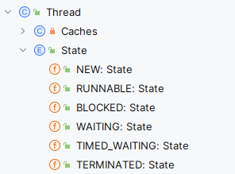
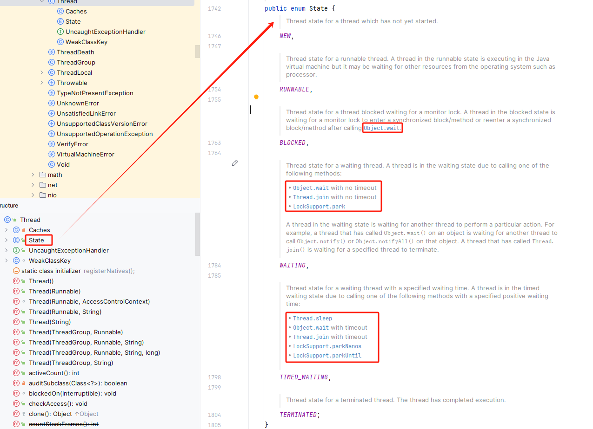
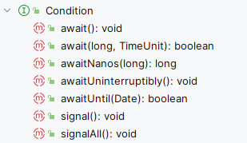
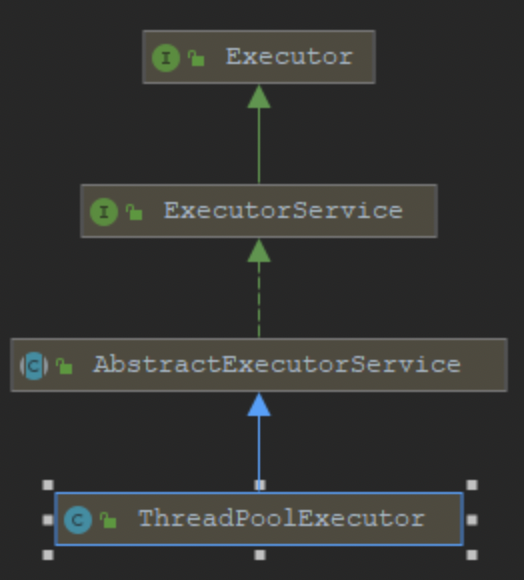

# 4. 线程及线程池

> 1. 线程与进程
> 2. Java 中创建线程的方法
> 3. 线程的状态转换【或生命周期】，Object 中的方法、Condition 类中的方法、LockSupport 的方法
> 4. 池化技术理论基础
> 5. Java 中的两种创建线程池的方法、线程池原理、线程池实践经验
> 6. Spring 框架中使用线程池

> 线程的创建方式
> 线程源码介绍
> 线程的生命周期及状态转化
> 线程的调度
> 线程间的互斥、同步、协作

1. 进程与线程；
2. Java 中线程的创建与使用；
3. 线程的 API；
4. 线程的状态转化；

::: details Thread 类的字节码
@[code](./include/Thread-bytecode.log)
:::

### 创建方式

```java

public  class MyThread extends Thread{
    @Override
    public void run(){
        System.out.println("当前线程："+Thread.currentThread().getId());
    }
}

// 使用
MyThread m = new MyThread();
m.start(); 	// 启动线程


说明：
1. 继承Thread类，重写run方法；
2. 使用时，直接构造一个实例对象，然后调用start方法进行启动；

```

```java

public class MyRunnable implements Runnable {
    @Override
    public void run() {
        System.out.println("当前线程："+Thread.currentThread().getId());
    }
}

// 使用
MyRunnable r = new MyRunnable();
Thread t = new Thread(r);
t.start(); //启动线程

说明：
1. 实现Runnable接口，并实现run方法；
2. 使用时，直接构造Thread对象，然后调用start方法进行启动；

```

```java
public class MyCallable implements Callable<Integer>{

    @Override
    public Integer call() throws Exception {
        System.out.println("当前线程："+Thread.currentThread().getId());
        int i = 10 / 2;
        System.out.println("运行结果："+i);
        return i;
    }
}

// 使用
FutureTask<Integer> future = new FutureTask<>(new MyCallable());
new Thread(future).start();
System.out.println("结果为： "+task.get());

说明：
1. 实现Callable接口中的call方法，并且Callable接口带有一个泛型参数，这个泛型参数表示：返回值的类型；
2. 使用时，先构造一个FutureTask对象来接收返回值，之后构造一个Thread对象，最后调用start方法进行启动；
3. 获取结果时，通过FutureTask对象的get方法进行获取，获取过程为阻塞获取；

```

```java
// 线程池构造方法
public ThreadPoolExecutor(
    @Range(from = 0, to = Integer.MAX_VALUE)  int corePoolSize,
    @Range(from = 1, to = Integer.MAX_VALUE)  int maximumPoolSize,
    @Range(from = 0, to = Long.MAX_VALUE)  long keepAliveTime,
    @NotNull  TimeUnit unit,
    @NotNull  BlockingQueue<Runnable> workQueue,
    @NotNull  ThreadFactory threadFactory,
    @NotNull  RejectedExecutionHandler handler )
Creates a new ThreadPoolExecutor with the given initial parameters.

/*
Params:
    corePoolSize – the number of threads to keep in the pool, even if they are idle, unless allowCoreThreadTimeOut is set
    maximumPoolSize – the maximum number of threads to allow in the pool
    keepAliveTime – when the number of threads is greater than the core, this is the maximum time that excess idle threads will wait for new tasks before terminating.
    unit – the time unit for the keepAliveTime argument
    workQueue – the queue to use for holding tasks before they are executed. This queue will hold only the Runnable tasks submitted by the execute method.
    threadFactory – the factory to use when the executor creates a new thread
    handler – the handler to use when execution is blocked because the thread bounds and queue capacities are reached

Throws:
    IllegalArgumentException – if one of the following holds:
        corePoolSize < 0
        keepAliveTime < 0
        maximumPoolSize <= 0
        maximumPoolSize < corePoolSize
    NullPointerException – if workQueue or threadFactory or handler is null
*/

// 示例


```

- 注意：
  - run 方法中执行的代码一般被成为“任务”；
  - **线程的使用都是通过构造 Thread 对象来完成的；**
- 比较异同：
  - 方式 1 和方式 2 都不能获取返回值；
  - Java 支持单继承和多实现，所以方式 2 可以避免单继承的局限性；
  - 方式 3 可以获取任务返回值，并且可以捕获任务执行过程中抛出的异常；
  - 方式 1、2、3 都不能控制资源，因为如果有多项任务，就要开多个线程，这就相当于“公司有一项任务就要专门招一个员工来干活儿”，而方式 4 可以控制资源，这种方式就相当于“公司固定几个员工，公司里的各项任务让这些员工依次完成”；实际开发中，方式 4 才是最常用的；

```java
import java.util.concurrent.*;

public class MyThreadTest {

    private static ThreadPoolExecutor executor = new ThreadPoolExecutor(5,
            200,
            10,
            TimeUnit.SECONDS,
            new LinkedBlockingDeque<>(100000),
            Executors.defaultThreadFactory(),
            new ThreadPoolExecutor.AbortPolicy());

    public static void main(String[] args) throws ExecutionException, InterruptedException {

        // test();
        // corePoolSize – the number of threads to keep in the pool, even if they are idle,
        // unless allowCoreThreadTimeOut is set
        executor.allowCoreThreadTimeOut(true);

        // 1. 使用 execute 执行 Thread 类型的任务；
        executor.execute(new Thread01());

        // 2. 使用 execute 执行 Runable 类型的任务；
        executor.execute(new Runable01());
        // 不能使用 execute 执行 Callable 类型的任务；
        // executor.execute(new Callable01());     // 报编译错误

        // 3. 使用 submit 提交 Runable 类型的任务
        executor.submit(new Thread01());

        // 4. 使用 submit 提交 Runable 类型的任务；
        executor.submit(new Runable01());

        // 5. 使用 submit 提交有 返回值的 Callable 类型的任务
        Future<Integer> submit = executor.submit(new Callable01());
        Integer result = submit.get(); // 获取结果
        System.out.println(result);
    }

    public static void test() throws ExecutionException, InterruptedException {
        /**
         * 1. 使用： public Thread(Runnable target) 构造函数；
         *  由于 Runnable 是一个 @FunctionalInterface 标注的接口，而这个注解的作用：
         *      标记Runnable接口是一个“函数式接口”。在Java中，“函数式接口”是有且仅有一个抽象方法的接口。
         *      反过来说，如果一个接口中包含两个或两个以上的抽象方法，就不能使用 @FunctionalInterface 注解，否则编译会报错。
         */
        new Thread(() -> {
            System.out.println("当前线程："+Thread.currentThread().getId());
            int i = 10 / 2;
            System.out.println("运行结果："+i);
        }).start();

        // 使用的是 public Thread(Runnable target) 构造函数
        new Thread(new Thread01()).start();

        // 使用的是 public Thread(Runnable target) 构造函数
        new Thread(new Runable01()).start();

        // 使用的是 public Thread(Runnable target) 构造函数
        FutureTask<Integer> result = new FutureTask<>(new Callable01());
        new Thread(result).start();
        System.out.println(result.get());   // 阻塞获取，可以获取正常结果，也可以捕获异常；
    }

    public static class Thread01 extends Thread{
        @Override
        public void run() {
            System.out.println("当前线程："+Thread.currentThread().getId());
            int i = 10 / 2;
            System.out.println("运行结果："+i);
        }
    }

    public static class Runable01 implements Runnable{

        @Override
        public void run() {
            System.out.println("当前线程："+Thread.currentThread().getId());
            int i = 10 / 2;
            System.out.println("运行结果："+i);
        }
    }

    public static class Callable01 implements Callable<Integer> {

        @Override
        public Integer call() throws Exception {
            System.out.println("当前线程："+Thread.currentThread().getId());
            int i = 10 / 2;
            System.out.println("运行结果："+i);
            return i;
        }
    }

}


```

### 线程状态

> 事实上，可以把线程看作是一个“任务”，为了把“大任务 ” 划分成“小任务”，于是就产生了“线程状态”的概念。
> 试想，有了这些线程状态的概念后，我们是不是就可以基于这些概念，开发出一套框架，在框架里面搞一套调度系统，再搞一套队列，这就是 ExecuteService 的核心思想。


Thread 的构造方法： 因此，在构造时，只能传入 Runnable 类型的对象实例


- 状态转化



### 线程的操作方法


Object 中的方法


Condition



---

### 为什么要使用线程池？

直接 new 一个线程真的不香，原因主要在于创建大量相同的线程会大量的消耗系统内存，甚至会导致系统内存耗尽；同时，大量的线程会竞争 CPU 的调度，导致 CPU 过度切换。在阿里巴巴 java 开发手册中也有提到过为什么不提倡使用单个线程的原因，就是在于上面这两个原因。

那么使用线程池的优点是什么呢？使用线程池有以下几方面的优点：

1. **减少系统开销**。减少在创建和销毁线程上所花费的时间和系统资源的开销
2. **提高响应速度**。当任务到达之后，任务可以不需要等到线程创建就能被立即执行
3. **提高线程的可管理性**。线程是稀缺资源，如果无限制的的创建，不仅会消耗系统资源，还会降低系统性能，使用线程池可以进行统一分配，调优和监控。

### java 中标准构造器创建线程池的方式

```java
public ThreadPoolExecutor(
   int corePoolSize,
   int maximumPoolSize,
   long keepAliveTime,
   TimeUnit unit,
   BlockingQueue<Runnable> workQueue,
   ThreadFactory threadFactory,
   RejectedExecutionHandler handler)

```

- 参数讲解及运行原理
  - `corePoolSize：` 核心线程数。除非设置了 **_allowCoreThreadTimeOut _**，否则一直线程一直存在。
  - `maximumPoolSize：` 最大线程数。
  - `keepAliveTime：` 空闲线程存活时间。
  - `unit：` 空闲线程存活时间单位。
  - `workQueue：` 阻塞队列。**_用来存储等待执行的任务，如果当前对线程的需求超过了 corePoolSize 大小，就会放在这里等待空闲线程执行_**
    - `LinkedBlockingQueue` ： 是一个基于链表实现的阻塞队列，按 FIFO 排序任务，可以设置容量（有界队列），不设置容量则默认使用 Integer.Max_VALUE 作为容量（无界队列）。该队列的吞吐量高于 ArrayBlockingQueue。 有两个快捷创建线程池的工厂方法 Executors.newSingleThreadExecutor 和 Executors.newFixedThreadPool 使用了这个队列，并且都没有设置容量（无界队列）。
    - `ArrayBlockingQueue` ： 是一个数组实现的有界阻塞队列（有界队列），队列中的元素按 FIFO 排序。ArrayBlockingQueue 在创建时必须设置大小。
    - `SynchronousQueue` ： （同步队列）是一个不存储元素的阻塞队列，每个插入操作必须等到另一个线程的调用移除操作，否则插入操作一直处于阻塞状态，其吞吐量通常高于 LinkedBlockingQueue 。快捷工 厂方法 Executors.newCachedThreadPool 所创建的线程池使用此队列。与前面的队列相比，这个队列比较特殊，它不会保存提交的任务，而是直接新建一个线程来执行新来的任务。
    - `PriorityBlockingQueue` ：是具有优先级的无界队列。
    - `DelayQueue` ：这是一个无界阻塞延迟队列，底层基于 PriorityBlockingQueue 实现，队列中每个元素都有过期时间，当从队列 获取元素（元素出队）时，只有已经过期的元素才会出队，队列头部的 元素是过期最快的元素。快捷工厂方法 Executors.newScheduledThreadPool 所创建的线程池使用此队列。
  - `threadFactory：` 创建线程的线程工厂。当线程池需要新的线程时，会用 threadFactory 来生成新的线程；
  - `handler：` 拒绝策略。
    - AbortPolicy ： 使用该策略时，如果线程池队列满了，新任务就会被拒绝，并且抛 出 RejectedExecutionException 异常。该策略是线程池默认的拒绝策略。
    - DiscardPolicy ： 该策略是 AbortPolicy 的 Silent（安静）版本，如果线程池队列满 了，新任务就会直接被丢掉，并且不会有任何异常抛出。
    - DiscardOldestPolicy ： 抛弃最老任务策略，也就是说如果队列满了，就会将最早进入队列的任务抛弃，从队列中腾出空间，再尝试加入队列。因为队列是队尾进队头出，队头元素是最老的，所以每次都是移除队头元素后再尝试入队。
    - CallerRunsPolicy ： 调用者执行策略。在新任务被添加到线程池时，如果添加失败，那 么提交任务线程会自己去执行该任务，不会使用线程池中的线程去执行 新任务。在以上 4 种内置策略中，线程池默认的拒绝策略为 AbortPolicy，如 果提交的任务被拒绝，线程池就会抛出 RejectedExecutionException 异 常，该异常是非受检异常（运行时异常），很容易忘记捕获。如果关心 任务被拒绝的事件，需要在提交任务时捕获 RejectedExecutionException 异常。
    - 自定义策略 ： 如果以上拒绝策略都不符合需求，那么可自定义一个拒绝策略，实 现 RejectedExecutionHandler 接口的 rejectedExecution 方法即可。
- 运行原理
  - 线程池初始化时并没有线程，当来临任务时，开始创建一个线程，如果任务还是不能被及时的完成，就接着创建，直到达到核心线程数。（一旦创建的达到核心线程数后，就会永驻内存，但是要注意并不是指创建线程初期的线程就是核心线程，超过核心线程数之后创建的线程也有可能成为核心线程，最开始创建的线程有可能被销毁）；
  - 如果创建了核心线程数大小的线程后依然有任务涌来，那就把这些任务放到阻塞队列中；
  - 如果阻塞队列满了，依然有任务涌来，那么就接着创建线程，直到达到最大线程数；
  - 如果达到最大线程数后，还有任务涌来，那么就执行拒绝策略；
  - 如果任务执行完成之后，线程池会根据空闲线程存活时间对创建的线程进行销毁，直到线程数量等于核心线程数为止；
- 线程池的操作方法
  - **提交任务 **
    - **execute() **
      - void execute(Runnable command);
    - **submit()**

```java
  <T> Future<T> submit(Callable<T> task);
  <T> Future<T> submit(Runnable task, T result);
  Future<?> submit(Runnable task);

```

      - 二者区别
         - 接受参数不同
         - submit()提交任务后会有返回值，而execute()没有
         - submit()方便Exception处理

- **钩子方法**

```java
//任务执行之前的钩子方法（前钩子）
protected void beforeExecute(Thread t, Runnable r) { }
//任务执行之后的钩子方法（后钩子）
protected void afterExecute(Runnable r, Throwable t) { }
//线程池终止时的钩子方法（停止钩子）
protected void terminated() { }

```

- 优雅关闭
  - **shutdown** ： 是 JUC 提供的一个有序关闭线程池的方法，此方法 会等待当前工作队列中的剩余任务全部执行完成之后，才会执行关闭， 但是此方法被调用之后线程池的状态转为 SHUTDOWN，线程池不会再 接收新的任务。
  - **shutdownNow** ： 是 JUC 提供的一个立即关闭线程池的方法，此 方法会打断正在执行的工作线程，并且会清空当前工作队列中的剩余任 务，返回的是尚未执行的任务。
  - **awaitTermination** ： 等待线程池完成关闭。在调用线程池的 shutdown()与 shutdownNow()方法时，当前线程会立即返回，不会一直等 待直到线程池完成关闭。如果需要等到线程池关闭完成，可以调用 awaitTermination()方法。

### java 中快捷工厂创建线程池方式

- 出现这种方式的背景： 正是由于线程池的标准创建模式参数较多，使用时需要对线程池原理了解较深才能熟练使用，因此 juc 包中又提供了一种快捷创建线程池的方式，这种方式就是快捷工厂创建线程池方式。
- 快捷创建方式
  - Executors.**newSingleThreadExecutor**()
  - Executors.**newFixedThreadPool**(int threads)
  - Executors.**newCachedThreadPool**()
  - Executors.**newScheduledThreadPool**(int corePoolSize)

### 两种方式优劣

快捷工厂创建线程池的方式是不建议使用的，因为有些方式使用的是无界队列，这会导致内存溢出。推荐使用原生方式。

### java 中线程池框架




> ThreadPoolExecutor 和 ScheduledThreadPoolExecutor 算是我们最常用的线程池类了，从上面我们可以看到这俩个最终都实现了 Executor 和 ExecutorService 这两个接口，实际上主要的接口定义都是在 ExecutorService 中。

### 线程池的线程数选取

- IO 密集型任务 ： 此类任务主要是执行 IO 操作。由于执行 IO 操作的时间较长，导致 CPU 的利用率不高，这类任务 CPU 常处于空闲状态。Netty 的 IO 读写操作 为此类任务的典型例子。
  - 通常需要开 CPU 核心数两倍的线程。
- CPU 密集型任务 ： 此类任务主要是执行计算任务。由于响应时间很快，CPU 一直在运 行，这种任务 CPU 的利用率很高。
  - 线程数等于 CPU 数就行
- 混合型任务 ： 此类任务既要执行逻辑计算，又要进行 IO 操作（如 RPC 调用、数据 库访问）。相对来说，由于执行 IO 操作的耗时较长（一次网络往返往往 在数百毫秒级别），这类任务的 CPU 利用率也不是太高。Web 服务器的 HTTP 请求处理操作为此类任务的典型例子。
  - 最佳线程数目 = (线程等待时间与线程占用 CPU 时间之比 + 1) * CPU 核数

### 线程池结合 SpringBoot 使用

- 方式一：通过@Async 注解调用
  - 在 Application 启动类上面加上[@EnableAsync ](/EnableAsync)
  - 在需要异步执行的方法上加上@Async 注解
- 方式二：使用自定义的线程池
  - 自定义 Configuration

### 线程池配置类

```
public class ThreadPoolUtil {
    private static int corePoolSize = 5;
    private static int maxPollSize = 5;
    private static long keepAliveTime = 10;
    private stativ TimeUnit unit = TimeUnit.MINUTES;

    private static class Pool{
        private static ThreadPoolExecutor executor = new ThreadPoolExecutor(
            corePoolSize,
            maxPollSize,
            keepAliveTime,
            unit,
            new LinkedBlockingQueue<>(),
            r -> new Thread(r, "async-thread"),
            new ThreadPoolExecutor.CallerRunsPolicy()
        );
    }
}

```

### 使用方法

```
ThreadPoolUtil.submitTask(
    ()->{
        // 你的任务方法；
    }
);

```

### 其他方法

[https://mp.weixin.qq.com/s/skBA9RwVBLnw8BYZhcUSrA](https://mp.weixin.qq.com/s/skBA9RwVBLnw8BYZhcUSrA)

---

### 任务编排-CompletableFuture

- [ ] todo

1.

2.

3. Future 与 FutureTask 出现的背景以及其产生的问题；
   1. get 方法是一个阻塞方法，不符合我们异步的业务需求；
   2. 虽然可以配合线程池的方式来异步执行多个任务，但是
4. CompletableFuture 出现的背景；
   1. 零元依赖
   2. 一元依赖；
   3. 二元依赖；
   4. 多元依赖；
5. 基本原理；
6. 最佳实践；
7. 如何学些此部分内容；
   1.

以 pdf 中的为例；

构造一个 CompletableFuture 对象，runAsync 没有返回值；supplyAsync 有返回值；

- `static CompletableFuture<Void> runAsync(Runnable runnable)`：异步执行指定的`Runnable`任务。
- `static CompletableFuture<Void> runAsync(Runnable runnable, Executor executor)`：在指定的`Executor`上异步执行`Runnable`任务。
- `static <U> CompletableFuture<U> supplyAsync(Supplier<U> supplier)`：异步执行指定的`Supplier`任务，并返回`CompletableFuture`对象，该对象在计算完成时将提供结果。
- `static <U> CompletableFuture<U> supplyAsync(Supplier<U> supplier, Executor executor)`：在指定的`Executor`上异步执行`Supplier`任务，并返回一个`CompletableFuture`对象，该对象在计算完成时将提供结果。

thenApply 方法：当一个线程依赖另一个线程时，获取上一个任务返回的结果，并返回当前 任务的返回值。
thenAccept 方法：消费处理结果。接收任务的处理结果，并消费处理，无返回结果。
thenRun 方法：只要上面的任务执行完成，就开始执行 thenRun，只是处理完任务后，执行 thenRun 的后续操作

- `CompletableFuture<T> thenApply(Function<? super T,? extends U> fn)`：当此 `CompletableFuture` 完成时，使用此 `CompletableFuture` 的结果作为参数应用给定的函数。
- `CompletableFuture<T> thenApplyAsync(Function<? super T,? extends U> fn)`：当此 `CompletableFuture` 完成时，异步地应用给定的函数。
- `CompletableFuture<T> thenApplyAsync(Function<? super T,? extends U> fn, Executor executor)`：当此 CompletableFuture 完成时，使用指定的 Executor 异步地应用给定的函数。

- `CompletableFuture<Void> thenAccept(Consumer<? super T> action)`：当此 `CompletableFuture` 完成时，对其结果执行给定的操作。
- `CompletableFuture<Void> thenAcceptAsync(Consumer<? super T> action)`：当此 `CompletableFuture` 完成时，异步地对其结果执行给定的操作。
- `CompletableFuture<Void> thenAcceptAsync(Consumer<? super T> action, Executor executor)`：当此 `CompletableFuture` 完成时，使用指定的 Executor 异步地对其结果执行给定的操作。
- `CompletableFuture<Void> thenRun(Runnable action)`：当此 `CompletableFuture` 完成时，执行给定的操作。
- `CompletableFuture<Void> thenRunAsync(Runnable action)`：当此 `CompletableFuture` 完成时，异步地执行给定的操作。
- `CompletableFuture<Void> thenRunAsync(Runnable action, Executor executor)`：当此 `CompletableFuture` 完成时，使用指定的 `Executor` 异步地执行给定的操作。

不可改变返回值

- `CompletableFuture<T> **whenComplete**(BiConsumer<? super T,? super Throwable> action)`：当此 `CompletableFuture` 完成时，对结果或异常执行给定的操作。
- `CompletableFuture<T> **whenCompleteAsync**(BiConsumer<? super T,? super Throwable> action)`：当此 `CompletableFuture` 完成时，异步地对结果或异常执行给定的操作。
- `CompletableFuture<T> **whenCompleteAsync**(BiConsumer<? super T,? super Throwable> action, Executor executor)`：当此 `CompletableFuture` 完成时，使用指定的 `Executor` 异步地对结果或异常执行给定的操作。

可以改变返回值

- `CompletableFuture<U> handle(BiFunction<? super T,Throwable,? extends U> fn)`：当此 `CompletableFuture` 完成时，执行给定的函数。
- `CompletableFuture<U> handleAsync(BiFunction<? super T,Throwable,? extends U> fn)`：当此 `CompletableFuture` 完成时，异步地执行给定的函数。
- `CompletableFuture<U> handleAsync(BiFunction<? super T,Throwable,? extends U> fn, Executor executor)`：当此 `CompletableFuture` 完成时，使用指定的 Executor 异步地执行给定的函数。
- `CompletableFuture<T> **exceptionally**(Function<Throwable,? extends T> fn)`：当 `CompletableFuture` 遇到异常时，执行给定的函数。

thenCompose：TODO
thenCombine：组合两个 future，获取两个 future 的返回结果，并返回当前任务的返回值
thenAcceptBoth：组合两个 future，获取两个 future 任务的返回结果，然后处理任务，没有返回值。
runAfterBoth：组合两个 future，不需要获取 future 的结果，只需两个 future 处理完任务后，处理该任务。

- `CompletableFuture<T> thenCompose(Function<? super T,? extends CompletionStage<U>> fn)`：当此 `CompletableFuture` 完成时，使用此 `CompletableFuture` 的结果作为参数应用给定的函数，并返回一个新的 `CompletableFuture`。
- `CompletableFuture<T> thenComposeAsync(Function<? super T,? extends CompletionStage<U>> fn)`：当此 `CompletableFuture` 完成时，异步地应用给定的函数。
- `CompletableFuture<T> thenComposeAsync(Function<? super T,? extends CompletionStage<U>> fn, Executor executor)`：当此 `CompletableFuture` 完成时，使用指定的 `Executor` 异步地应用给定的函数。
- `CompletableFuture<Void> thenCombine(CompletionStage<? extends U> other, BiConsumer<? super T,? super U> action)`：当此 `CompletableFuture` 和另一个 `CompletableFuture` 完成时，执行给定的操作。
- `CompletableFuture<Void> thenCombineAsync(CompletionStage<? extends U> other, BiConsumer<? super T,? super U> action)`：当此 `CompletableFuture` 和另一个 `CompletableFuture` 完成时，异步地执行给定的操作。
- `CompletableFuture<Void> thenCombineAsync(CompletionStage<? extends U> other, BiConsumer<? super T,? super U> action, Executor executor)`：当此 CompletableFuture 和另一个 `CompletableFuture` 完成时，使用指定的 `Executor` 异步地执行给定的操作。
- `CompletableFuture<Void> thenAcceptBoth(CompletionStage<? extends U> other, BiConsumer<? super T,? super U> action)`：当此 `CompletableFuture` 和另一个 `CompletableFuture` 都完成时，执行给定的操作。
- `CompletableFuture<Void> thenAcceptBothAsync(CompletionStage<? extends U> other, BiConsumer<? super T,? super U> action)`：当此 `CompletableFuture` 和另一个 `CompletableFuture` 都完成时，异步地执行给定的操作。
- `CompletableFuture<Void> thenAcceptBothAsync(CompletionStage<? extends U> other, BiConsumer<? super T,? super U> action, Executor executor)`：当此 `CompletableFuture` 和另一个 `CompletableFuture` 都完成时，使用指定的 `Executor` 异步地执行给定的操作。
- `CompletableFuture<Void> runAfterBoth(CompletionStage<?> other, Runnable action)`：当此 `CompletableFuture` 和另一个 `CompletableFuture` 都完成时，执行给定的操作。
- `CompletableFuture<Void> runAfterBothAsync(CompletionStage<?> other, Runnable action)`：当此 `CompletableFuture` 和另一个 `CompletableFuture` 都完成时，异步地执行给定的操作。
- `CompletableFuture<Void> runAfterBothAsync(CompletionStage<?> other, Runnable action, Executor executor)`：当此 `CompletableFuture` 和另一个 `CompletableFuture` 都完成时，使用指定的 `Executor` 异步地执行给定的操作。

acceptEither：两个任务有一个执行完成，获取它的返回值，处理任务，没有新的返回值。
applyToEither：两个任务有一个执行完成，获取它的返回值，处理任务并有新的返回值。  
runAfterEither：两个任务有一个执行完成，不需要获取 future 的结果，处理任务，也没有返回值。

- `CompletableFuture<Void> acceptEither(CompletionStage<? extends T> other, Consumer<? super T> action)`：当此 `CompletableFuture` 或另一个 `CompletableFuture` 完成时，执行给定的操作。
- `CompletableFuture<Void> acceptEitherAsync(CompletionStage<? extends T> other, Consumer<? super T> action)`：当此 `CompletableFuture` 或另一个 `CompletableFuture` 完成时，异步地执行给定的操作。
- `CompletableFuture<Void> acceptEitherAsync(CompletionStage<? extends T> other, Consumer<? super T> action, Executor executor)`：当此 `CompletableFuture` 或另一个 `CompletableFuture` 完成时，使用指定的 `Executor` 异步地执行给定的操作。
- `CompletableFuture<U> applyToEither(CompletionStage<? extends T> other, Function<? super T,U> fn)`：当此 `CompletableFuture` 或另一个 `CompletableFuture` 完成时，执行给定的函数。
- `CompletableFuture<U> applyToEitherAsync(CompletionStage<? extends T> other, Function<? super T,U> fn)`：当此 `CompletableFuture` 或另一个 `CompletableFuture` 完成时，异步地执行给定的函数。
- `CompletableFuture<U> applyToEitherAsync(CompletionStage<? extends T> other, Function<? super T,U> fn, Executor executor)`：当此 `CompletableFuture` 或另一个 `CompletableFuture` 完成时，使用指定的 `Executor` 异步地执行给定的函数。
- `CompletableFuture<Void> runAfterEither(CompletionStage<?> other, Runnable action)`：当此 `CompletableFuture` 或另一个 `CompletableFuture` 完成时，执行给定的操作。
- `CompletableFuture<Void> runAfterEitherAsync(CompletionStage<?> other, Runnable action)`：当此 `CompletableFuture` 或另一个 `CompletableFuture` 完成时，异步地执行给定的操作。
- `CompletableFuture<Void> runAfterEitherAsync(CompletionStage<?> other, Runnable action, Executor executor)`：当此 `CompletableFuture` 或另一个 `CompletableFuture` 完成时，使用指定的 `Executor` 异步地执行给定的操作。

allOf：等待所有任务完成
anyOf：只要有一个任务完成

- `static CompletableFuture<Void> allOf(CompletableFuture<?>... cfs)`：返回一个新的 `CompletableFuture`，当所有传入的 `CompletableFuture` 都完成时，它也会完成。
- `static CompletableFuture<Object> anyOf(CompletableFuture<?>... cfs)`：返回一个新的 `CompletableFuture`，当任意一个传入的 `CompletableFuture` 完成时，它也会完成，并返回完成的 `CompletableFuture` 的结果。
