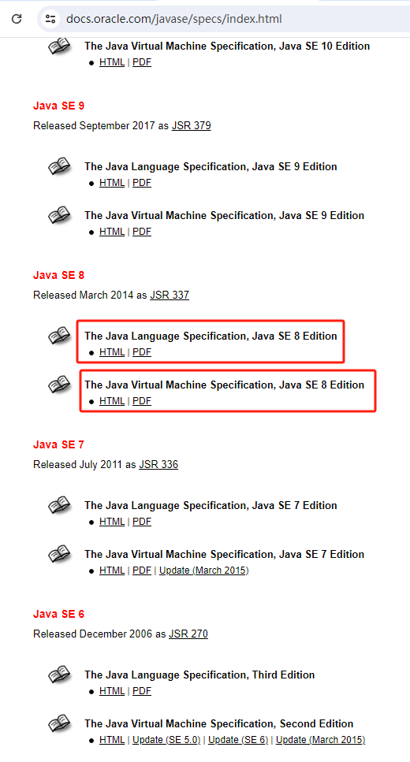
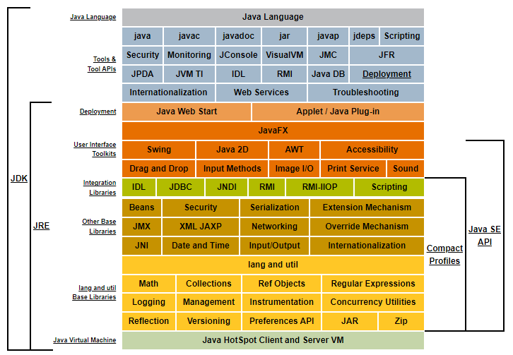

# 1. 概述

### 1. 区别

- [https://docs.oracle.com/javase/specs/index.html](https://docs.oracle.com/javase/specs/index.html)

Java 语言从一开始就是针对跨平台而实现的。为此，它把编程语言的规范与虚拟机的规范分隔开。目的就在于实现虚拟机的跨平台性。比如下面的例子：

> Java 语言规范应该包括 Java 源代码的编写规范以及 Javac 编译器的实现规范。

Java 语言规范与 Java 虚拟机规范可以这样去理解：

1. Java 语言规范规定了程序员如何使用 Java 语言写代码，这里的代码特质 Java 源代码；
2. 而 Java 虚拟机规范则规定了 JVM 如何理解 字节码 文件，并通过调用操作系统相关指令集来完成字节码文件中的相关指令。

字节码的执行可以看作是： jvm 读取到其中某一条指令后，然后把这条指令转化成操作系统能够理解的底层指令，最后操作硬件完成具体的功能。这里要注意的是：字节码中的指令，全部都是操控 jvm 的，而 jvm 是运行于操作系统之上的，因此 jvm 会把指令转化为操作系统能够理解的底层指令。

