# 4. 线程模型
### 1. 前置概念

> 为什么在说 jvm 时，要先讲一下 Java 的内存模型？
> 这个问题的关键在于，jvm 属于操作系统之上的应用，jvm 是通过调用操作系统对外提供的相关接口，来完成对计算机底层硬件计算资源的使用， 也就是说 jvm 使用计算机计算资源的方式是依赖于操作系统使用计算机计算资源的方式的。
> 因此要想了解 jvm 的整体架构，就必须要先了解计算机操作系统使用底层硬件计算资源的方式。
> 结合操作系统使用底层硬件计算资源的方式和计算机底层硬件系统架构，并结合“堆管存储，栈管运行”的特性，抽象总结出 JMM 的结构。
> 最后，基于 JMM 的内存结构，实现 JVM 运行时的基本架构，加上高级语言需要最终转化为机器语言的，最终才有了 JVM 的整体架构。
>

#### 1.1. 并发和并行

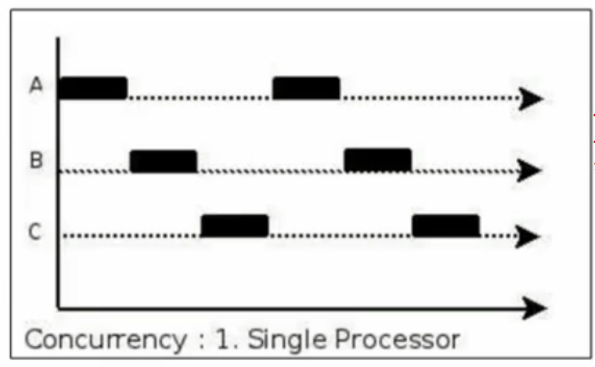
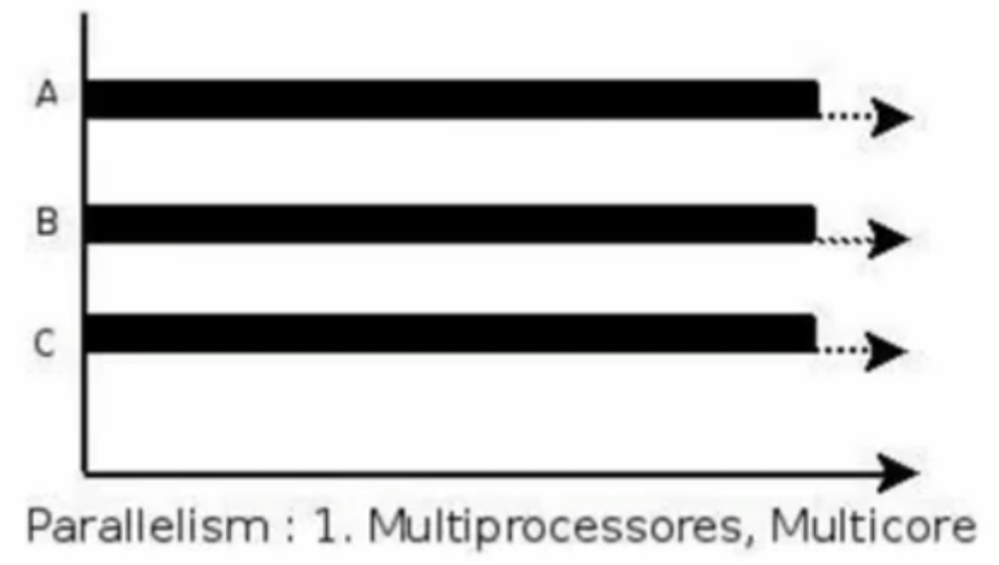
并发 ： 多个任务在单个处理器上运行，单个处理器通过划分时间片，让任务依次获取执行权限，看上去好像是多个任务同时发生一样，解决了不同任务执行过程中存在的阻塞问题，可以理解为任务阻塞时，就让出处理器的执行权限，目的是更大限度的压榨处理器的处理能力

并行： 同一./ch04-threadmode/image/1681524639011.png
./ch04-threadmode/image/1726197928105.png
#### 1.2. 并发编程的发展

传统的计算机应用使用计算机的计算资源的方式，并没有因为计算机硬件的快速发展而改变，这就造成了计算机硬件的性能并没有得到显著提升。

因此人们迫切希望改变传统计算机使用计算机计算资源的方式，于是便出现了：

1. 使用缓存。
2. 对指令进行重排序。
3. 分时复用计算资源。

基于上面的三个技术手段实现的编程过程，就可以成为并发编程，这也可以看做是并发编程的本质。

结果人们又发现使用这三项技术会导致并发编程的运算结果与我们实际预期的运算结果不一致。人们分析不一致的原因发现，实际上是因为，并发编程中有这样的需求：

1. 并发编程中的不同线程需要通信；
2. 并发编程中的不同线程的指令没有保证顺序；

这两个点是我们实现并发编程时一定会产生的两个需求，这是由计算机使用计算资源的方式决定的，不为人的意志转移而转移。

> 比如，我们要实现从 1 加到 1 亿的过程，传统的方式就是简单的从 1 加到 1 亿，而有了多个核心的计算机硬件时，我们就希望 core1 实现从 1 加到 1 万，core2 实现从 1 万加到 2 万……最后把多个核心运算的结果再合并起来。多个核心单独运算时并不需要保证核心之间的运算顺序，只需要保证单个核心内部的运算顺序的正确性即可（这个例子中，单个核心似乎也不需要保证运算顺序），这就说明并发编程中不同线程的指令的运算不需要保证顺序性。最后要把多个核心运算的结果合并起来时，就需要进行线程间的通信问题。
> 我们也可以认为，如果并发编程中不需要通信，也不需要同步时，并发编程的运算结果就与我们实际的运算结果是一致的。但这种场景在实际的生活中是很少见的，几乎不存在。

人们进一步追究，发现实际上是因为我们使用计算机计算资源的方式出了问题：

1. 使用缓存产生了**可见性**问题。由于不同缓存之间访问速度的差异导致存储在不同缓存上的同一个变量，在不同线程访问这个变量时会读出不同的值；
2. 对指令进行重排序产生了**顺序性**问题。编译器把高级语言编译成机器语言时，为了压榨计算机的性能，会对指令进行重新排序，重新排序后的指令会产生不同的运算结果，有些结果是我们所希望的，有些结果则不是，这就说明重排序后的指令在顺序上存在着对的顺序和错的顺序的问题。
3. 分时复用计算资源产生了**原子性**问题。由于程序以单位时间片的方式占用 CPU，且长的指令执行时间长，短的指令执行时间短，因此这就涉及到指令长短的问题，也就是指令划分的问题。

人们通过各种复杂的技术手段解决了上面的三个问题后，发现并发编程的运算结果好像和我们预期的结果就一致了。于是我们就称并发编程安全了。由此引出并发编程三要素的概念：

1. 原子性
2. 可见性
3. 顺序性

我们也说，**遵循了并发编程三要素的程序是线程安全**的。

在解决并发三要素问题过程中，人们根据并发编程需求的不同的实现思路，把并发编程模型分为两种：

1. 基于共享内存的并发编程模型；
2. 基于消息通信的并发编程模型；

#### 1.3. 操作系统指令集

不同的计算机硬件就意味着需要使用不同的指令进行操作，例如 CPU 有 CPU 的操作指令、内存有内存的操作指令、硬盘有硬盘的操作指令……这些指令组合起来之后就是计算机的指令集。针对不同的计算机架构，计算机的指令集也有所不同。但计算机架构确定下来之后，指令集也就确定下来了。
计算机指令的组合使用过程，又需要有一个协调过程，这个协调过程就可以看作是操作系统来完成的。而我们要想完成并发编程就只能基于操作系统来完成。也就是说，编程语言使用并发编程的计算机资源的方式只能是基于操作系统对外提供的接口来实现。注意，这里所说的并发编程是指高级语言的并发编程。这就说明，Java 语言中的并发编程也是基于操作系统来实现的。

事实上，JDK 通过屏蔽不同的操作系统的指令集的差异，来实现统一的并发编程过程【这也是 Java 语言的跨平台的原因】。也就是说，不同的厂商根据不同的操作系统实现不同的 JDK，然后程序员又基于不同的 JDK 【但都遵循 Java 语言规范】来实现并发编程。由于 JDK 都遵循 jdk 规范，程序员编写的 Java 代码又都遵循 Java 语言规范，因此对外的表现是同一个并发编程的 Java 代码，在不同的平台上的运算结果是一样的。

### 2. Java 并发编程

Java 程序员编写遵循 Java 语言规范的并发编程代码，放到实现了统一的 JDK 规范的不同的 jdk 上运行，其运算结果是一样的。

在这个过程中，我们把 jdk 看作是调用操作系统接口的一个上层应用，我们编写的 Java 语言就是调用 jdk 接口的更上层次的应用。这样理解起来会更好理解一些。

#### 2.1. JMM 模型

JMM 是基于上面一章中说的基于共享内存的并发编程模型而实现的。JMM 模型中要求，工作线程直接复用操作系统层面的线程。因此，我们可以认为 JMM 模型中没有对分时复用技术上的优化【也就是说分时复用技术上的优化是有操作系统负责的】

在整个并发编程模型中，除了有操作系统层面针对并发三要素问题的解决措施外，JDK 在调用操作系统的并发编程接口时也有不同的解决措施，但是无论怎样，都是基于 JMM 模型来完成的，加之 JMM 模型中要求工作线程直接复用操作系统层面的线程，因此解决措施也就可以分成两部分：

1. 限制缓存的使用；
2. 优化指令重排；

Java 中限制缓存的使用和优化指令重排都是由 JDK 帮我们完成了的，程序员只需要使用 Java 语言规范完成并发编程的代码，就能实现准确的并发编程。事实上 Java 中限制缓存的使用，以及优化指令重排的工作是极其复杂的，在这个过程中有编译器的参与，也有执行引擎的参与，甚至还有针对运行期内存结构的优化手段【如栈上分配、标量替换、同步消除等】的参与等，甚至为了便于程序员使用并发编程，还在这些复杂的实现过程之上又帮我们封装了一套易用的框架，这个框架就是 JUC。

### 3. 总结

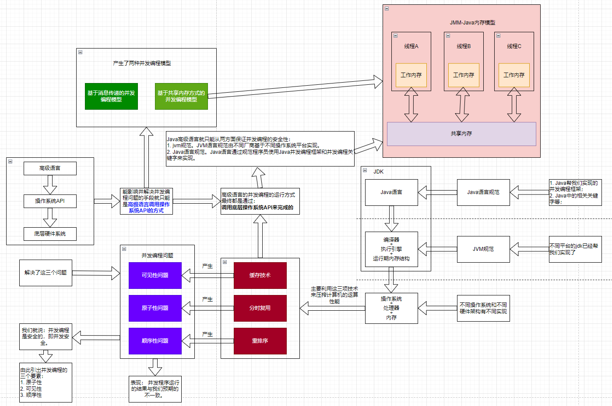

---

// TODO./ch04-threadmode/image/1700364612715.png

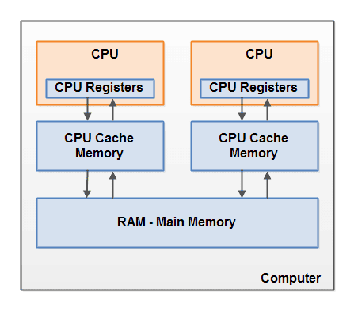

栈管运行，堆管存储。

实现线程./ch04-threadmode/image/1700109303392.png

- 内核线程 （1:1线程模型）
- 用户线程 （1:N 线程模型）
- 用户线程 + 轻量级进程 混合 （N:M 线程模型）

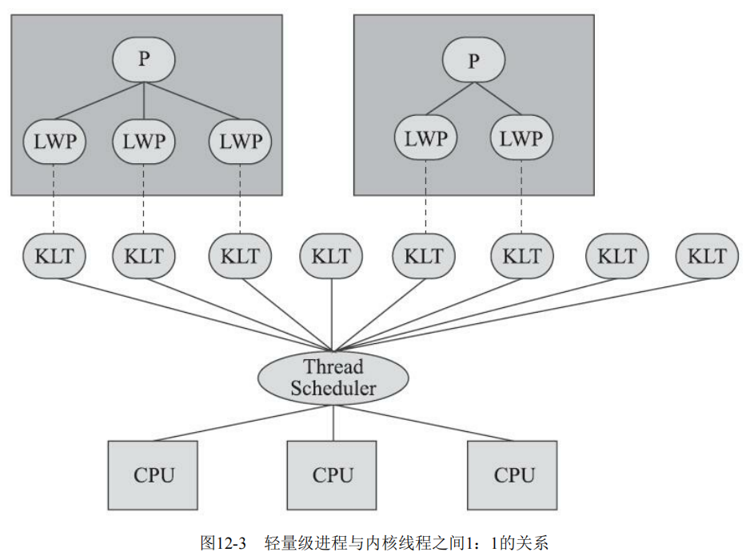

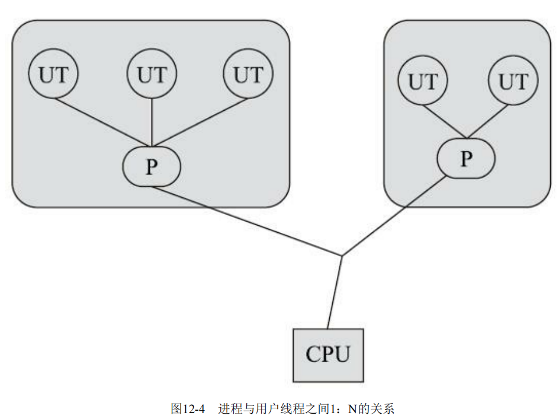

./ch04-threadmode/image/1700531705766.png

./ch04-threadmode/image/1700551190438.png
一段程序的运行需要经过编译器

并发编程./ch04-threadmode/image/1700110126796.png

1. 线程如何实现同步；【为什么会出现这个问题】
2. 线程如何实现通信；【为什么会出现这个问题】

|  | 共享内存 | 消息传递 |
| --- | --- | --- |
| 如何实现同步 | 程序员显式地指定线程之间的互斥行为 | 消息的发送必须在消息的接收之前 |
| 如何实现通信 | 线程之间通过读-写公共状态进行通信 | 线程之间通过明确的发送消息进行通信 |

Java 使用的是共享内存的编程模型。

1. 指令的原子性和顺序性；
2. 变量的可见性；

指令的顺序性指的是单条指令的顺序性还是多条指令的顺序？

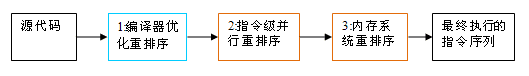

总结：

1. 并./ch04-threadmode/image/1700125821427.png
   1. 如何**实现线程之间通信**。所谓通信就是对于共享状态的变量、代码片段等进行线程间的相互传递；
   2. 如何**实现线程的同步**。所谓同步就是让线程的执行顺序以我们所期望的顺序进行执行；
   3. 总结：这两个问题在高级语言层面的体现就是并发编程过程中运算结果与我们期望的结果不一致，也就是说这两个问题在高级语言层面上的体现就是内存可见性问题。因此，并发编程的根本性问题也可以说是**内存一致性问题**。
2. 解决上面所说的两个问题，有两种实现思路，人们根据这两种实现思路分别抽象出两种并发编程模型：
   1. **共享内存并发编程模型**。通俗点说，就是把共享状态的变量或代码片段放到一个共享区域内，让线程共同操作这个共享区域。
   2. **消息传递并发编程模型**。通俗点讲，就是遇到共享状态的变量或代码片段时，就使用某种机制实现变更传递。
   3. 区别： 一个是让线程主动操作共享区域，另外一个是让共享状态通过某种机制实现主动通知。
   4. Java 中使用的是**共享内存并发编程模型**，Java 把这种并发编程模型抽象成 JMM，即 Java 内存模型。
3. 由于更好的压榨计算机的运算能力，于是出现了：
   1. 缓存技术。如寄存器、高速缓存等；
   2. 分时复用。对 CPU 运行时间进行分片，让程序以单位时间的方式占用 CPU ，从而达到对冲长指令阻塞等待的问题；
   3. 重排序。对指令进行重新排序，以最佳的顺序压榨运算能力。
4. 但这三种技术分别产生了三个问题：
   1. 缓存技术 产生了 **可见性** 问题。由于不同缓存之间访问速度的差异导致存储在不同缓存上的同一个变量，在不同线程访问这个变量时会读出不同的值；
   2. 分时复用 产生了 **原子性** 问题。由于程序以单位时间片的方式占用 CPU，且长的指令执行时间长，短的指令执行时间短，因此这就涉及到指令长短的问题，也就是指令划分的问题。
   3. 重排序 产生了 **顺序性** 问题。编译器把高级语言编译成机器语言时，为了压榨计算机的性能，会对指令进行重新排序，重新排序后的指令会产生不同的运算结果，有些结果是我们所希望的，有些结果则不是，这就说明重排序后的指令在顺序上存在着对的顺序和错的顺序的问题。
   4. 说明： JVM 底层是调用操作系统的 API 完成运行我们写的程序的运行的，实际上 JVM 中的线程是与操作系统层面上的线程是一一对应的，而操作系统层面，线程的调用是 JVM 无法决定的。因此 JVM 是没有办法通过影响分时复用技术来解决原子性问题的，也就是说 JVM 只能使用操作系统指令集，没有办法再对操作系统指令集中的指令进行再划分或者再组合，但是操作系统指令集中的内存栅栏指令允许多个指令序列组合成一个原子指令，因此 JVM 可以使用内存栅栏的方式实现 JVM 层面上符合指令的 原子性；。因此 JVM 是没有办法影响缓存技术产生的可见性问题的，但是由于
5. 如果解决了【可见性】问题、【原子性】问题、【顺序性】问题，我们就可以说我们的程序是线程安全的。换句话来说，要想**保证线程安全，需要我们运行的程序具有三要素——即保证可见性、原子性和顺序性**，因此，我们又把这三个特性成为“**并发三要素**”。
6. 要想解决这些问题，是需要编译器、执行器以及处理器共同完成，这是因为高级语言运行的环境中本身包含编译器、执行器和处理器的原因决定的。Java 语言运行时，核心在于调用操作系统 API 来完成运行过程的，因此 Java 语言只能从编译器和执行器的角度来保证并发三要素。而 Java 语言能做的事情却只有从对操作系统指令的应用的角度来解决这些问题，对操作系统指令的应用就只能是指令重排序的优化。这也是为什么 Java 语言中解决了重排序问题就解决了并发编程问题的原因。
7. JVM 中包含了编译器和执行引擎，因此 JVM 帮我们实现了一些技术，这些技术保证解决了【**可见性**】问题、【**原子性**】问题、【**顺序性**】问题中的某一部分，但是并没有完全解决，此时就需要我们在编写代码时遵循一些所谓的开发规范，最终达到线程同步的效果。事实上，Java 语言对并发编程安全性保证的措施可以分为两方面：
   1. 基于 JVM。这部分是由运行在不同操作系统之上的，不同厂商实现的 JVM 来实现的。
   2. 基于 Java 语言的再抽象。这部分是由遵循统一的 Java 语言规范的 Java 框架来实现的。
8. 类比于计算机实现多线程的原理，以及基于共享内存的并发编程模型， Java 提出了 JMM 模型，即 Java 内存模型。
9. 我们要遵循的开发规范就是 Java 语言的线程 同步 措施。这些同步措施基于 JMM 模型，整体被分为两部分：
   1. 禁用缓存。Java 中使用 volatile、 synchronized、 final 关键字来进行约束；
   2. 指令优化。Java 中的编译器使用 Happens-Before 原则进行约束；
10. 基于 JMM 模型，Java 把运行时内存结构划分为线程共享和线程私有两部分区域。

再总结：

1. 操作系统通过“分时复用”、“重排序”、“缓存技术”等技术手段，实现“尽可能压榨计算机性能”的目标。这三种技术手段可以看作是并发编程的底层实现，但这三个技术手段同样也带来了并发编程的三个问题：“原子性问题”、“顺序性问题”和“可见性问题”。如果保证了这三个问题，那么我们就说并发编程是安全的。
2. 高级语言对并发编程的实现，一定是调用操作系统 API 来实现的，又由于高级语言的运行过程基本上都有高级语言编译成机器语言的过程，因此，高级语言只能从编译层面来解决并发编程的三个问题。例如，Java 语言需要经过编译器的编译后运行在执行引擎上，之后才是执行引擎调用执行操作系统 API，而编译器和执行引擎是 jdk 已经帮我们实现了的，因此，我们就需要了解 Java 语言层面上的并发编程的实现过程。往深层次讲，我们还需要了解编译器和执行引擎在解决并发编程问题时所做的措施，即 Java 语言的并发编程的底层原理。
3.

4.

5. 并发编程性问题的表现是： 并发编程的运算结果与我们实际预期的并发编程问题不一致——这就是并发编程问题。

1. 这就相当于操作系统对外提供了一系列并发编程的原语指令，让操作系统的上层应用通过灵活的调用操作系统的并发编程原语，来实现自己的并发编程。比如说，操作系统的一个语义是对 i 进行加一操作，它的过程可能是这样的，先从内存中读取 i 的初始值，然后在线程中对 i 进行加 1 操作，那原语指令可能就是：先 loadi，然后 addi，最后是 storei。但是对于操作系统的上层应用，我们看到的可能就是简单的一句话： i=i+1。这就说明了操作系统的上层应用对操作系统上的并发编程原语进行了封装，这样做的目的是为了方便使用并发编程。
2. 但是对于 Java 语言来说，它的运行过程需要经过编译器+执行引擎+运行期内存结构，而这三部分是 jdk 根据不同的操作系统平台，已经帮我们实现了，这就说明 jdk 已经帮我们提供了调用操作系统并发编程原语的透明接口。这个透明的接口就是我们在实现并发编程时，遵循的 Java 语言规范。
3. 又因为 Java 语言规范实现并发编程时，太过复杂，不够易用，因此为了让我们更加便捷地使用并发编程，Java 语言的设计者又在 Java 语言规范上面封装了一个易用的框架，这个框架就是 JUC。
4. 说白了，JUC 就是 Java 语言规范为了方便程序员实现并发编程而封装的框架。因此，我们在学习时，不但要学习 Java 语言规范，还要学习其底层原理，底层原理就可以看作是 JVM 规范。
5. 事实上，JDK 为了让我们透明的调用操作系统的并发编程原语做了很多工作，但是不管怎样，JDK 都是利用了限制指令优化和禁止使用缓存这两个思想。这两个思想是基于 JMM 来讲的。

从 java 源代码到最终实际执行的指令序列，会分别经历下面三种重排序：

上述的 1 属于编译器重排序，2 和 3 属于处理器重排序。这些重排序都可能会导致多线程程序出现内存可见性问题。对于编译器，JMM 的编译器重排序规则会禁止特定类型的编译器重排序（不是所有的编译器重排序都要禁止）。对于处理器重排序，JMM 的处理器重排序规则会要求 java 编译器在生成指令序列时，插入特定类型的内存屏障（memory barriers，intel 称之为 memory fence）指令，通过内存屏障指令来禁止特定类型的处理器重排序（不是所有的处理器重排序都要禁止）

---./ch04-threadmode/image/1700138071524.png

著作权归@pdai所有 原文链接：<https://pdai.tech/md/java/thread/java-thread-x-theorty.html>

 Java内存模型只保证了基本读取和赋值是原子性操作，如果要实现更大范围操作的原子性，可以通过synchronized和Lock来实现。由于synchronized和Lock能够保证任一时刻只有一个线程执行该代码块，那么自然就不存在原子性问题了，从而保证了原子性。

---

著作权归@pdai所有 原文链接：<https://pdai.tech/md/java/thread/java-thread-x-theorty.html>

as-if-serial 语义使单线程程序员无需担心重排序会干扰他们，也无需担心内存可见性问题

编译上：在不改变程序执行结果的前提下，尽可能的开发并行度
执行上：具有执行顺序一致性

内存栅栏指令保证原子性

JMM 属于语言级的内存模型，它确保在不同的编译器和不同的处理器平台之上，通过禁止特定类型的编译器重排序和处理器重排序，为程序员提供一致的内存可见性保证

JMM 对正确同步的多线程程序的内存一致性做了如下保证：

- 如果程序是正确同步的，程序的执行将具有顺序一致性（sequentially consistent）-- 即程序的执行结果与该程序在顺序一致性内存模型中的执行结果相同（马上我们将会看到，这对于程序员来说是一个极强的保证）。这里的同步是指广义上的同步，包括对常用同步原语（lock，volatile 和 final）的正确使用

---

著作权归@pdai所有 原文链接：<https://pdai.tech/md/java/jvm/java-jvm-jmm.html>

### 4. Happens-Before 原则

- 线程原则：
  - 单一线程内，前面的操作先于后面的操作发生；
  - 单一线程内，start()开始于其他操作；
  - 结束行为发生

可以看作是 JVM 层面的，针对并发编程的“规范”。

---

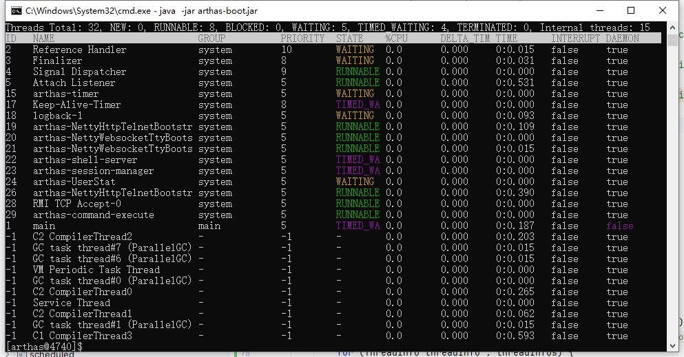

虚拟机线程
周期任务线程
GC线程./ch04-threadmode/image/1700535441065.png
编译线程
信号调度线程

程序运行方式是通过创建线程的方式进行运行的，而线程的运行过程包括两大过程：内存分配和任务调度，Jvm中的线程调度多是由操作系统的调度来实现的，因此了解线程的内存分配即可。

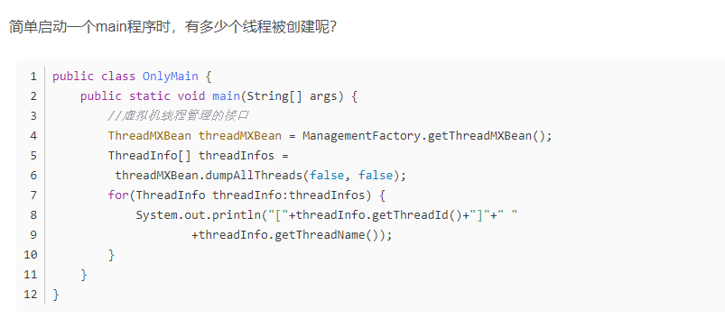

[6] Monitor Ctrl-Break
[5] Attach Listener
[4] Signal Di./ch04-threadmode/image/1699847556605.png
[3] Finalizer
[2] Reference Handler
[1] main

Attach Listener
Attach Listener线程是负责接收到外部的命令，而对该命令进行执行的并且吧结果返回给发送者。通常我们会用一些命令去要求jvm给我们一些反 馈信息，如：java -version、jmap、jstack等等。如果该线程在jvm启动的时候没有初始化，那么，则会在用户第一次执行jvm命令时，得到启动。

Signal Dispatcher
前面我们提到第一个Attach Listener线程的职责是接收外部jvm命令，当命令接收成功后，会交给signal dispather线程去进行分发到各个不同的模块处理命令，并且返回处理结果。signal dispather线程也是在第一次接收外部jvm命令时，进行初始化工作。

Finalizer
这个线程也是在main线程之后创建的，其优先级为10，主要用于在垃圾收集前，调用对象的finalize()方法；关于Finalizer线程的几点：

1. 只有当开始一轮垃圾收集时，才会开始调用finalize()方法；因此并不是所有对象的finalize()方法都会被执行；
2. 该线程也是daemon线程，因此如果虚拟机中没有其他非daemon线程，不管该线程有没有执行完finalize()方法，JVM也会退出；
3. JVM在垃圾收集时会将失去引用的对象包装成Finalizer对象（Reference的实现），并放入ReferenceQueue，由Finalizer线程来处理；最后将该Finalizer对象的引用置为null，由垃圾收集器来回收；
4. JVM为什么要单独用一个线程来执行finalize()方法呢？如果JVM的垃圾收集线程自己来做，很有可能由于在finalize()方法中误操作导致GC线程停止或不可控，这对GC线程来说是一种灾难；

Reference Handler
VM在创建main线程后就创建Reference Handler线程，其优先级最高，为10，它主要用于处理引用对象本身（软引用、弱引用、虚引用）的垃圾回收问题。

Monitor Ctrl-Break
这个线程我也不是很明白是干什么用的，oracle官网有详细信息，大家可以去看看

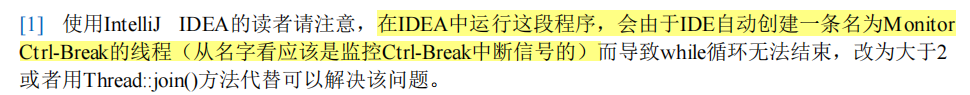

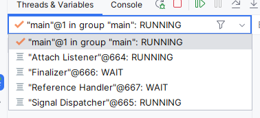

那问题来了，在linux下./ch04-threadmode/image/1700534369170.pngCtrl-Break，这就导致了，我们在等待所有子线程结束后的那句判断代码应该是>2而不是>1!!!

while (Thread.activeCoun./ch04-threadmode/image/1700533994216.png
System.out.println(Thread.activeCount());
 Thread.yield();
}
结论

windows下这个Monitor Ctrl-Break是不算在活动线程的，所以这样大于1是可以执行的，但是linux下应该是 大于2
————————————————
版权声明：本文为CSDN博主「chenxi004」的原创文章，遵循CC 4.0 BY-SA版权协议，转载请附上原文出处链接及本声明。
原文链接：[https://blog.csdn.net/chenxi004/article/details/104972979](https://blog.csdn.net/chenxi004/article/details/104972979)
