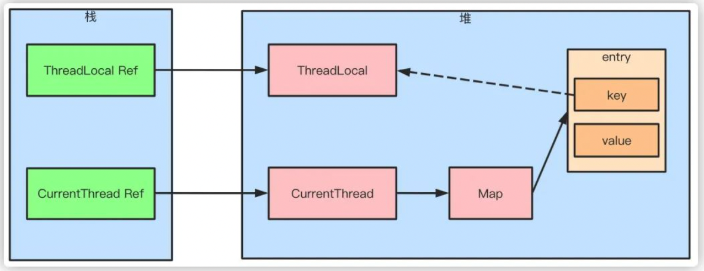
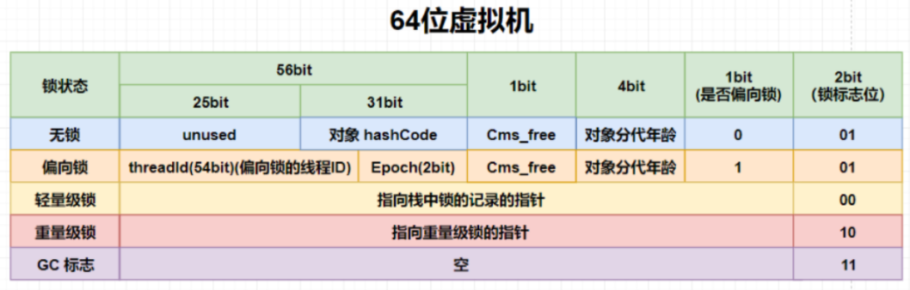

# 2. 关键字

> final
> volatile
> synchronized
> ThreadLocal 原理及内存泄漏；


1. 回顾对象的内存分布、对象的访问定位、栈帧的执行过程；
2. 详解对象的 markwords 对象头；
3. 使用一个多线程争夺锁的案例来讲解锁升级的过程；

1. volatile 关键字
2. final 关键字


### synchronized

> 虚拟机栈
> 方法的运行原理：当执行到一个方法时，虚拟机 Java 中的方法，就是 Java 虚拟机栈中的栈帧，栈帧


- synchronized关键字 
   - 1.6之前是重量级锁，1.6之后对synchronized进行了锁优化，采用了锁粗化、锁消除、偏向锁、轻量级锁等锁的优化手段
   - 不同使用场景下的不同作用 
      - 同步方法： 字节码生成的是 ACC_SYNCHRONIZED 
         - 同步普通方法，锁的是当前对象。
         - 同步静态方法，锁的是当前 Class 对象。
      - 同步块： 字节码生成的是 monitorenter 和 moniterexit 
         - 锁的是{}中的对象，这段区域被成为临界区。
   - 监视器锁机制 
      - 多线程执行的大概原理，从 JVM 的角度来讲，就是
      - 多线程对应的是Java堆中多个对象，而多线程操作的往往是Java堆中的另外一个对象，多线程运行机制本质上就变成了堆中的多个对象操作堆中的某一个对象，那问题来了，怎么实现这种机制呢？jdk中是给每一个Java对象都创建一个监视器对象（ ObjectMonitor ， 是由C++实现的）来实现这种机制，而且Java对象与 ObjectMonitor 是一一对应的；
      - ObjectMonitor 的数据结构 
         - cxq： 临时队列，存放临时的 ObjectWaiter （本质上就是线程）
         - waiteset： 等待队列，对象执行了 wait() 方法后，操作改对象的线程封装成ObjectWaiter进入此队列
         - entrylist： 阻塞队列，对象执行了 notify() 方法后，操作对象的线程被封装成ObjectWaiter进入此队列
         - count： 获得锁的次锁
         - owner ： 获得锁的线程ID
      - 加锁过程： 当一个线程获得锁之后，会把监视器对象的 owner 设置为这个线程的ThreadID，然后count加1；如果再有线程尝试获得锁，就进入EntryList等待；
      - 解锁过程： 当一个线程释放锁时，会把监视器对象的 owner 设置为null，然后count减1，然后再从waitset或entrylist中get一个线程，让这个线程尝试获取锁；
   - synchronized 锁在升级过程中用到了不同的锁机制
   - 
   - 从无锁状态到偏向锁阶段，再到轻量级锁阶段，使用的是Java堆中对象的内存分布中的对象头的不同值来完成同步的；
- 无锁状态 ：       hashcode +     分代年龄 + 偏向标识（为0） + 锁标志位（为01）
- 偏向锁状态 ： ThreadID + epoch + 分代年龄 + 偏向标识（为1） + 锁标志位（为01）
- 轻量级锁状态 ： 指向栈中锁记录（Lock Record）的指针 +        锁标志位（为00） 
   - 转化成重量级锁之后，使用的则是对象的监视器锁机制来完成同步的； 
      - 重量级锁状态： 指向Java监视器对象（Monitor对象）的指针 +      锁标志位（为00）
   - 锁的升级 
      - (1）当没有被当成锁时，这就是一个普通的对象，Mark Word记录对象的HashCode，锁标志位是01，是否偏向锁那一位是0;
      - (2）当对象被当做同步锁并有一个线程A抢到了锁时，锁标志位还是01，但是否偏向锁那一位改成1，前23bit记录抢到锁的线程id，表示进入偏向锁状态;
      - (3) 当线程A再次试图来获得锁时，JVM发现同步锁对象的标志位是01，是否偏向锁是1，也就是偏向状态，Mark Word中记录的线程id就是线程A自己的id，表示线程A已经获得了这个偏向锁，可以执行同步中的代码;【可重入的原理】
      - (4) 当线程B试图获得这个锁时，JVM发现同步锁处于偏向状态，但是Mark Word中的线程id记录的不是B，那么线程B会先用CAS操作试图获得锁，这里的获得锁操作是有可能成功的，因为线程A一般不会自动释放偏向锁。如果抢锁成功，就把Mark Word里的线程id改为线程B的id，代表线程B获得了这个偏向锁，可以执行同步代码。如果抢锁失败，则继续执行步骤5;
      - (5) 偏向锁状态抢锁失败，代表当前锁有一定的竞争，偏向锁将升级为轻量级锁。JVM会在当前线程的线程栈中开辟一块单独的空间，里面保存指向对象锁Mark Word的指针，同时在对象锁Mark Word中保存指向这片空间的指针。上述两个保存操作都是CAS操作，如果保存成功，代表线程抢到了同步锁，就把Mark Word中的锁标志位改成00，可以执行同步代码。如果保存失败，表示抢锁失败，竞争太激烈，继续执行步骤6;
      - (6) 轻量级锁抢锁失败，JVM会使用自旋锁，自旋锁不是一个锁状态，只是代表不断的重试，尝试抢锁。从JDK1.7开始，自旋锁默认启用，自旋次数由JVM决定。如果抢锁成功则执行同步代码，如果失败则继续执行步骤7;
      - (7) 自旋锁重试之后如果抢锁依然失败，同步锁会升级至重量级锁，锁标志位改为10。在这个状态下，未抢到锁的线程都会被阻塞。


- volatile关键字 
   - 使用案例

```java
class Singleton{
  private volatile static Singleton instance = null;
   
  private Singleton() {}
   
  public static Singleton getInstance() {
      if(instance==null) {
          synchronized (Singleton.class) {
              if(instance==null)
                  instance = new Singleton();
          }
      }
      return instance;
  }
}

```

   - 内部原理 
      - 分析字节码，可以看出volatile关键字转化为了lock指令，这相当于给变量添加了一道内存屏障，这道内存屏障的作用就是当这个变量发生改变时让其他处理器得到的变量变成无效的。
      - 保证可见性 
         - 某一线程对volatile变量的修改会同步到主存中，同时也会使已经读到该变量的其他线程的缓存中的值失效，当其他线程发现自己缓存中的值失效时，就会重新从主存中读取新值；
      - 禁止指令重排 
         - 编译器或执行器进行指令优化时，不能改变volatile变量在源代码的位置；
         - 当程序执行到volatile变量的读写操作时，其前面的操作的一定是已经全部完成的，且操作的结果一定是对后面的操作可见；其后面的操作肯定还没有进行；
      - 不保证指令的原子性
      - 也不保证共享变量的互斥访问
   - 所引起的问题 
      - **总线风暴**： volatile依赖总线嗅探机制不断刷新到主内存，而在多处理器架构上，所有的处理器是共用一条总线的，并且所有的处理器都是靠总线与住内存进行数据交互的，这种交互机制本质上是通过主线进行通信的，这种通信的流量就是缓存一致性流量，如果缓存一致性流量超过总线所能承受的最大带宽，就会造成总线风暴。（CAS算法和volatile都会造成总线风暴）
- 


锁升级过程总结：

1. 锁升级过程主要是把不同线程对锁的争夺来抽象成： 使用 cas 算法对 Java 堆中对象头的锁标志位的更新来完成的。

synchronized 与 ReentrantLock 的区别

-  1.6之前 synchronized 是重量级锁，性能要远远差于 ReentrantLock； 1.6之后jdk对 synchronized 进行锁优化后，二者性能相差无几； 
-  synchronized 为隐式锁，即不需要手动在代码中写加锁、解锁逻辑； ReentrantLock 为显式锁，需要显式地在代码中添加 加锁、解锁逻辑； 
-  ReentrantLock 还能实现 等待可中断、公平锁、绑定多个条件等功能； 
-  ThreadLocal 
   - ThreadLocal可以理解为线程本地变量，他会在每个线程都创建一个副本，那么在线程之间访问内部副本变量就行了，做到了线程之间互相隔离，相比于synchronized的做法是用空间来换时间。ThreadLocal有一个静态内部类ThreadLocalMap，ThreadLocalMap又包含了一个Entry数组，Entry本身是一个弱引用，他的key是指向ThreadLocal的弱引用，Entry具备了保存key value键值对的能力。弱引用的目的是为了防止内存泄露，如果是强引用那么ThreadLocal对象除非线程结束否则始终无法被回收，弱引用则会在下一次GC的时候被回收。但是这样还是会存在内存泄露的问题，假如key和ThreadLocal对象被回收之后，entry中就存在key为null，但是value有值的entry对象，但是永远没办法被访问到，同样除非线程结束运行。但是只要ThreadLocal使用恰当，在使用完之后调用remove方法删除Entry对象，实际上是不会出现这个问题的。







### 参考

[ 对java锁升级，你是否还停留在表面的理解？7000+字和图解带你深入理解锁升级的每个细节](https://bbs.huaweicloud.com/blogs/363553)
[synchronized锁升级过程](https://juejin.cn/post/7097910013636640776#heading-4)


