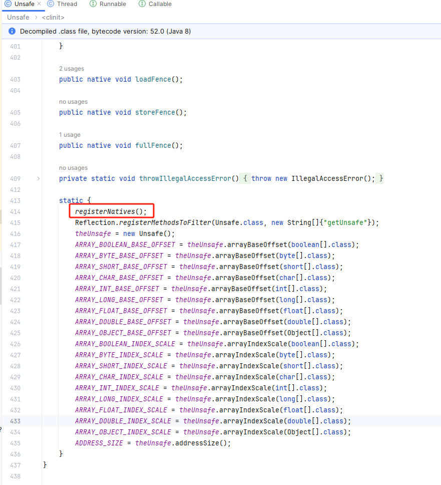
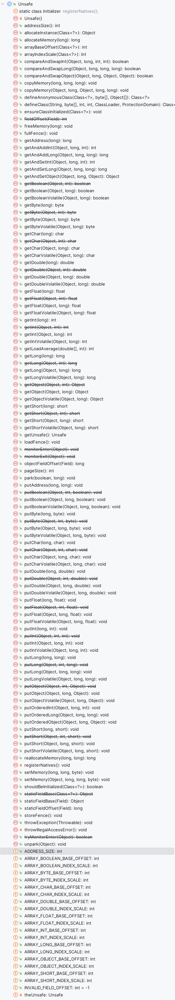
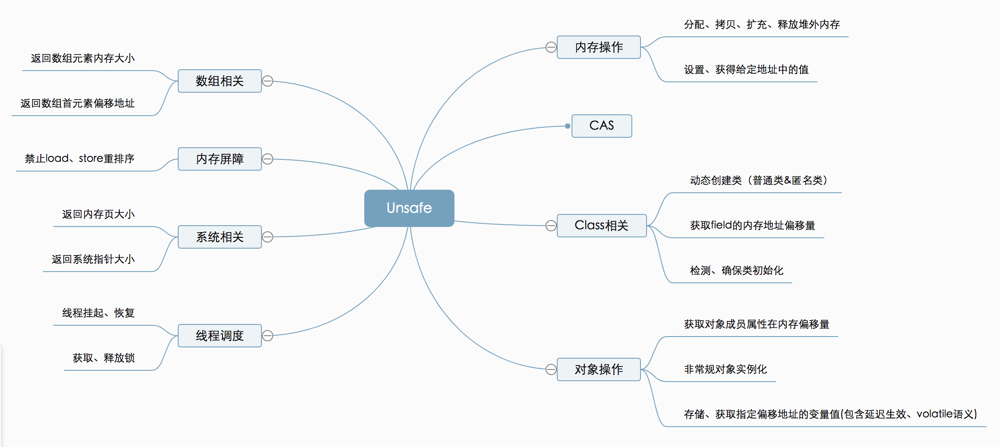

# 5. Unsafe 类

> 1. 原理
> 2. 提供的方法、原子类
> 3. 基于 Unsafe 类的一些实现
> 4. 


1. **Unsafe 类实际上是由 JNI 技术实现的，Java 可以利用这种技术把底层操作系统对外提供的本地方法的操作接口封装起来，形成 Java 能够理解和操作的方法。**
2. **封装起来的方法主要有**： 
   1. **内存操作。**
   2. **CAS 算法。**
   3. **Class 操作。**
   4. **对象操作。**
   5. **线程调度。**
   6. **系统相关信息的获取。**
   7. **内存屏障。**
   8. **数组操作。**
3. **这些方法让 Java 语言拥有了类似于 C 语言指针操作内存空间的能力，但这些方法同时也增加了程序发生指针问题的风险。**
4. **因此在使用时要慎重。Java 规定只有授信的代码才能使用 Unsafe 类。**
5. **Java 可以使用此工具类完成“二次开发”，**
   1. **比如原子类就是使用了 Unsafe 中的 CAS 算法。**
   2. **比如 LockSupport 也使用了 Unsafe 的相关接口。**
   3. **java.util.concurrent.locks.ReentrantLock.Sync#nonfairTryAcquire 中就是用了 compareAndSwapInt 方法；**
   4. **java.lang.invoke.DirectMethodHandle#allocateInstance。**


### JNI 加持



参考：

1. [https://www.cnblogs.com/niujifei/p/13946234.html](https://www.cnblogs.com/niujifei/p/13946234.html)
2. [https://juejin.cn/post/6844903985111908359](https://juejin.cn/post/6844903985111908359)


### Unsafe 方法







Unsafe提供的API大致可分为内存操作、CAS、Class相关、对象操作、线程调度、系统信息获取、内存屏障、数组操作等几类。


Unsafe 是位于sun.misc包下的一个类，使用 JNI 技术实现的，这种技术目的在于：封装把底层操作系统对外提供的本地方法的操作接口，把这些接口封装成 Java 语言可以调用和理解的 Java 方法。
，主要提供一些用于执行低级别、不安全操作的方法，如直接访问系统内存资源、自主管理内存资源等，这些方法在提升Java运行效率、增强Java语言底层资源操作能力方面起到了很大的作用。但由于Unsafe类使Java语言拥有了类似C语言指针一样操作内存空间的能力，这无疑也增加了程序发生相关指针问题的风险。在程序中过度、不正确使用Unsafe类会使得程序出错的概率变大，使得Java这种安全的语言变得不再“安全”，因此对Unsafe的使用一定要慎重。
这个类尽管里面的方法都是 public 的，但是并没有办法使用它们，JDK API 文档也没有提供任何关于这个类的方法的解释。总而言之，**对于 Unsafe 类的使用都是受限制的，只有授信的代码才能获得该类的实例，当然 JDK 库里面的类是可以随意使用的**。


### Unsafe 的应用

针对 Usafe 的应用场景：

1. CAS
2. LockSupport	中每一个方法都用到了 Unsafe 类中的方法。
3. 原子类


- LockSupport	中每一个方法都用到了 Unsafe 类中的方法：

```c

package java.util.concurrent.locks;
import sun.misc.Unsafe;


public class LockSupport {
    private LockSupport() {} // Cannot be instantiated.

    private static void setBlocker(Thread t, Object arg) {
        // Even though volatile, hotspot doesn't need a write barrier here.
        UNSAFE.putObject(t, parkBlockerOffset, arg);
    }

    
    public static void unpark(Thread thread) {
        if (thread != null)
            UNSAFE.unpark(thread);
    }

    
    public static void park(Object blocker) {
        Thread t = Thread.currentThread();
        setBlocker(t, blocker);
        UNSAFE.park(false, 0L);
        setBlocker(t, null);
    }

    
    public static void parkNanos(Object blocker, long nanos) {
        if (nanos > 0) {
            Thread t = Thread.currentThread();
            setBlocker(t, blocker);
            UNSAFE.park(false, nanos);
            setBlocker(t, null);
        }
    }

    
    public static void parkUntil(Object blocker, long deadline) {
        Thread t = Thread.currentThread();
        setBlocker(t, blocker);
        UNSAFE.park(true, deadline);
        setBlocker(t, null);
    }

    
    public static Object getBlocker(Thread t) {
        if (t == null)
            throw new NullPointerException();
        return UNSAFE.getObjectVolatile(t, parkBlockerOffset);
    }

    
    public static void park() {
        UNSAFE.park(false, 0L);
    }

    
    public static void parkNanos(long nanos) {
        if (nanos > 0)
            UNSAFE.park(false, nanos);
    }

    
    public static void parkUntil(long deadline) {
        UNSAFE.park(true, deadline);
    }

    
    static final int nextSecondarySeed() {
        int r;
        Thread t = Thread.currentThread();
        if ((r = UNSAFE.getInt(t, SECONDARY)) != 0) {
            r ^= r << 13;   // xorshift
            r ^= r >>> 17;
            r ^= r << 5;
        }
        else if ((r = java.util.concurrent.ThreadLocalRandom.current().nextInt()) == 0)
            r = 1; // avoid zero
        UNSAFE.putInt(t, SECONDARY, r);
        return r;
    }

    // Hotspot implementation via intrinsics API
    private static final sun.misc.Unsafe UNSAFE;
    private static final long parkBlockerOffset;
    private static final long SEED;
    private static final long PROBE;
    private static final long SECONDARY;
    static {
        try {
            UNSAFE = sun.misc.Unsafe.getUnsafe();
            Class<?> tk = Thread.class;
            parkBlockerOffset = UNSAFE.objectFieldOffset
                (tk.getDeclaredField("parkBlocker"));
            SEED = UNSAFE.objectFieldOffset
                (tk.getDeclaredField("threadLocalRandomSeed"));
            PROBE = UNSAFE.objectFieldOffset
                (tk.getDeclaredField("threadLocalRandomProbe"));
            SECONDARY = UNSAFE.objectFieldOffset
                (tk.getDeclaredField("threadLocalRandomSecondarySeed"));
        } catch (Exception ex) { throw new Error(ex); }
    }

}


```

- 其它用到 Unsafe 类的场景

```c
protected final boolean compareAndSetState(int expect, int update) {
    // See below for intrinsics setup to support this
    return unsafe.compareAndSwapInt(this, stateOffset, expect, update);
}

```

```c
/*non-public*/ 
static Object allocateInstance(Object mh) throws InstantiationException {
    Constructor dmh = (Constructor)mh;
    return UNSAFE.allocateInstance(dmh.instanceClass);		// @1-用到了unsafe
}

```

```java
DirectByteBuffer(int cap) {                   // package-private

    super(-1, 0, cap, cap);
    boolean pa = VM.isDirectMemoryPageAligned();
    int ps = Bits.pageSize();
    long size = Math.max(1L, (long)cap + (pa ? ps : 0));
    Bits.reserveMemory(size, cap);

    long base = 0;
    try {
        base = unsafe.allocateMemory(size);			// @1-用到了unsafe
    } catch (OutOfMemoryError x) {
        Bits.unreserveMemory(size, cap);
        throw x;
    }
    unsafe.setMemory(base, size, (byte) 0);			// @2-用到了unsafe
    if (pa && (base % ps != 0)) {
        // Round up to page boundary
        address = base + ps - (base & (ps - 1));
    } else {
        address = base;
    }
    cleaner = Cleaner.create(this, new Deallocator(base, size, cap));
    att = null;
}

```


