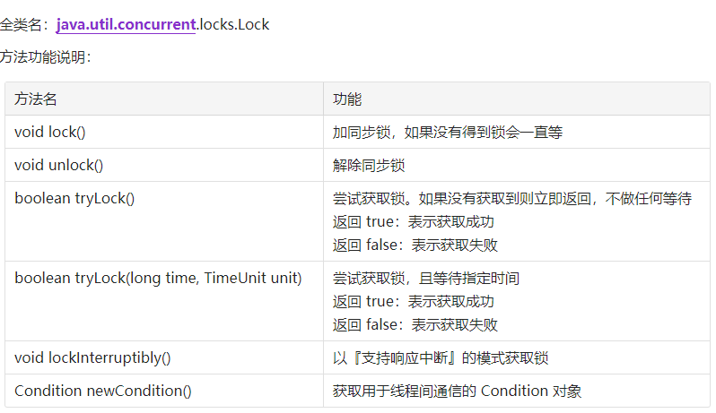

# 6. LockSupport 类及其相关实现

- 为什么LockSupport也是核心基础类? AQS框架借助于两个类：Unsafe(提供CAS操作)和LockSupport(提供park/unpark操作)
- 写出分别通过wait/notify和LockSupport的park/unpark实现同步?
- LockSupport.park()会释放锁资源吗? 那么Condition.await()呢?
- Thread.sleep()、Object.wait()、Condition.await()、LockSupport.park()的区别? 重点
- 如果在wait()之前执行了notify()会怎样?
- 如果在park()之前执行了unpark()会怎样

---

著作权归@pdai所有 原文链接：https://pdai.tech/md/java/thread/java-thread-x-lock-LockSupport.html

