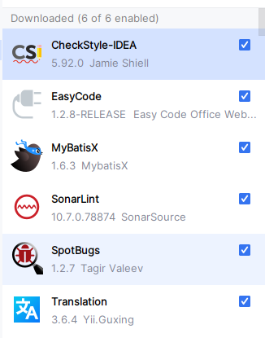
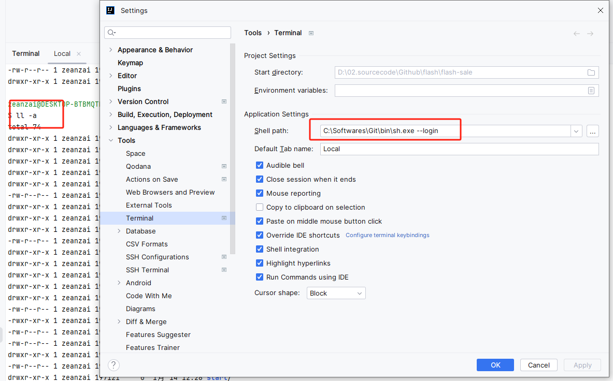
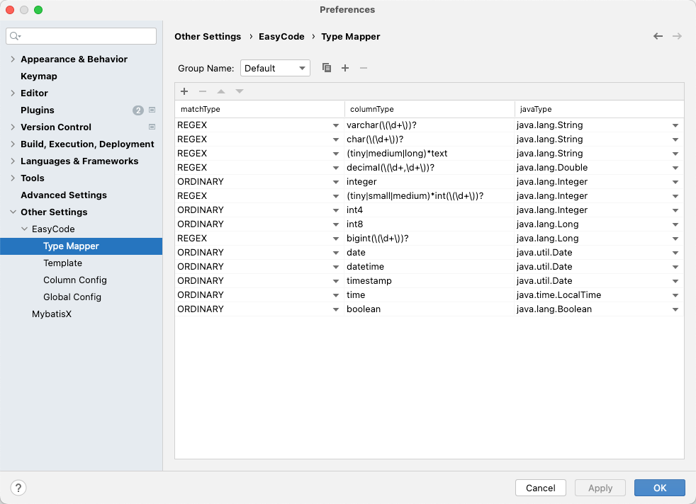
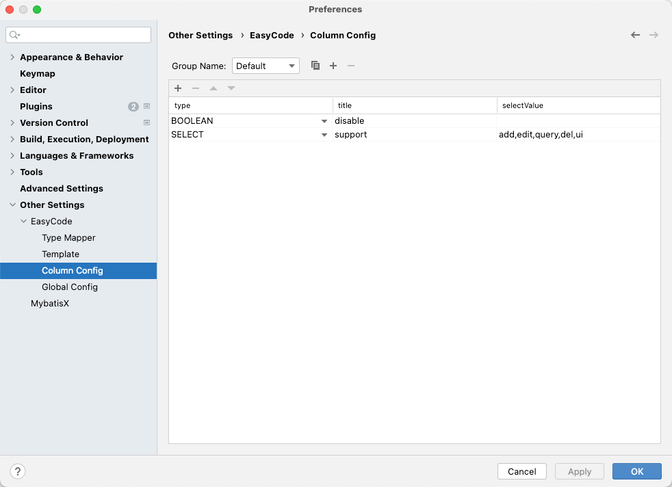
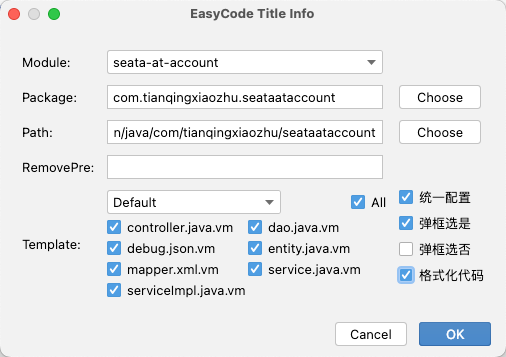

# idea

1. 参考readme中方式安装并破解；
2. 配置idea： 在未打开任何项目之前配置idea，并安装插件

    

    

3. 有些快捷键可能会失效

    

4. 配置终端为git中的bash

    

5. 其他

    

6. easycode插件的使用

    

    

    

    

7. 在idea中配置数据库链接
8. 生成代码

    

    