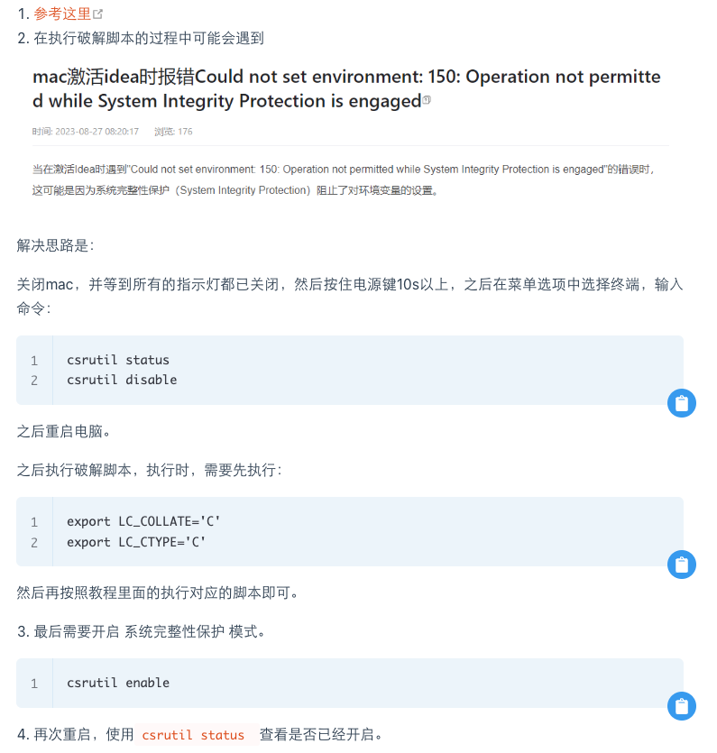

# Mac

- 不从 AppStore 里面下载和安装软件；
- 安装软件全部都去官网安装；

### 1. ClashX

```bash
export https_proxy=http://127.0.0.1:7897 http_proxy=http://127.0.0.1:7897 all_proxy=socks5://127.0.0.1:7897
```

### 2. Homebrew

::: details 安装日志
@[code](./mac/include/homebrew.log)
:::

| 词汇        | 含义                                                                                           |
| ----------- | ---------------------------------------------------------------------------------------------- |
| formula (e) | 安装包的描述文件，formulae 为复数                                                              |
| cellar      | 安装好后所在的目录                                                                             |
| keg         | 具体某个包所在的目录，keg 是 cellar 的子目录                                                   |
| bottle      | 预先编译好的包，不需要现场下载编译源码，速度会快很多；官方库中的包大多都是通过 bottle 方式安装 |
| tap         | 下载源，可以类比于 Linux 下的包管理器 repository                                               |
| cask        | 安装 macOS native 应用的扩展，你也可以理解为有图形化界面的应用。                               |
| bundle      | 描述 Homebrew 依赖的扩展                                                                       |

缓存目录： ~/Library/Caches/Homebrew

例如，安装 maven 时会有很多其他的附带软件，这些软件要先下载到本地才能使用， ~/Library/Caches/Homebrew 这个目录就是下载后的地址；清理的命令： brew cleanup --prune 0

[GitHub-wiki](https://github.com/ohmyzsh/ohmyzsh/wiki/Installing-ZSH)

### 3. 环境变量

**环境变量的配置统一放到： vi ~/.zshrc **

```bash
# 查看默认的shell是否是zsh
➜  ~ echo $SHELL
/bin/zsh
➜  ~ which zsh
/bin/zsh


# 添加 zsh 的代理
# 复制clash终端代理命令，直接编辑 vi ~/.zshrc ，在最后添加即可。

```

::: tip .bashrc .zshrc .profile .bash_profile 的区别

~~实践经验： 环境变量统一配置在 .bash_profile 文件中，但是为了让 zsh 也能使用到，因此在 .zshrc 中加了下面两行。~~

```bash
source /etc/profile
source ~/.bash_profile

```

一、bashrc 和 profile 的差异

1. bashrc 是在系统启动后就会自动运行。进行设置后，可运终端命令用 source bashrc 命令更新 bashrc
2. profile 是在用户登录后才会运行。进行设置后，可运终端命令用 source profile 命令更新 profile
   PS：通常我们修改 bashrc,有些 linux 的发行版本不一定有 profile 这个文件
3. **/etc/profile**中设定的变量(全局)的可以作用于任何用户，而~/.bashrc 等中设定的变量(局部)只能继承/etc/profile 中的变量，他们是"父子"关系。

二、.bash_profile

- ~/.bash_profile: 每个用户都可使用该文件输入专用于自己使用的 shell 信息，当用户登录时，该文件仅仅执行一次!默认情况下,他设置一些环境变量,执行用户的.bashrc 文件。
- ~/.bash_logout: 当每次退出系统(退出 bash shell)时，执行该文件。
- ~/.bash_profile: 是交互式、login 方式进入 bash 运行的。
- ~/.bashrc:是交互式 non-login 方式进入 bash 运行的，通常二者设置大致相同，所以通常前者会调用后者。

三、.zshrc

zsh 终端命令工具的全局变量设置，和 bashrc 区别是 默认很多 linux 系统是 bash，就配置在 bashrc 里
如里是使用 zsh 就配置在 zshrc 里

:::

### 4. Git

安装完成后，好像 Git 也已经安装了，因此只需要配置一下即可。

```bash
ssh-keygen -t ed25519 -C "zeanzai.me@gmail.com"
git config --global user.name "zeanzai"
git config --global user.email "zeanzai.me@gmail.com"

```

### 5. Iterm

```bash

shawnvong@ShawndeMacBook-Pro ~ % brew search iterm2
==> Formulae
term

==> Casks
iterm2

shawnvong@ShawndeMacBook-Pro ~ % brew install iterm2
==> Downloading https://iterm2.com/downloads/stable/iTerm2-3_4_23.zip
######################################################################### 100.0%
==> Installing Cask iterm2
==> Moving App 'iTerm.app' to '/Applications/iTerm.app'
🍺  iterm2 was successfully installed!

```

- [x] 默认终端
- [x] 修改主题：light background
- [x] 设置命令输出缓存区大小为 10MB
- [x] statusbar
- [x] 终端历史行数

[参考这里 iterm 的配置](https://zhuanlan.zhihu.com/p/550022490)

### 6. Oh-my-zsh

```bash
# zsh是基础，要先看看是否安装了zsh。mac默认安装了zsh
# 查看默认的shell是否是zsh
➜  ~ echo $SHELL
/bin/zsh
➜  ~ which zsh
/bin/zsh

# 查看zsh版本
➜  ~ $SHELL --version
zsh 5.9 (x86_64-apple-darwin23.0)

# 设置代理
shawnvong@ShawndeMacBook-Pro ~ % export https_proxy=http://127.0.0.1:7897 http_proxy=http://127.0.0.1:7897 all_proxy=socks5://127.0.0.1:7897

# 安装 omz
shawnvong@ShawndeMacBook-Pro ~ % sh -c "$(curl -fsSL https://raw.githubusercontent.com/ohmyzsh/ohmyzsh/master/tools/install.sh)"
Cloning Oh My Zsh...
remote: Enumerating objects: 1378, done.
remote: Counting objects: 100% (1378/1378), done.
remote: Compressing objects: 100% (1325/1325), done.
remote: Total 1378 (delta 30), reused 1135 (delta 27), pack-reused 0
Receiving objects: 100% (1378/1378), 3.19 MiB | 1.17 MiB/s, done.
Resolving deltas: 100% (30/30), done.
From https://github.com/ohmyzsh/ohmyzsh
 * [new branch]      master     -> origin/master
branch 'master' set up to track 'origin/master'.
Switched to a new branch 'master'
/Users/shawnvong

Looking for an existing zsh config...
Using the Oh My Zsh template file and adding it to /Users/shawnvong/.zshrc.

         __                                     __
  ____  / /_     ____ ___  __  __   ____  _____/ /_
 / __ \/ __ \   / __ `__ \/ / / /  /_  / / ___/ __ \
/ /_/ / / / /  / / / / / / /_/ /    / /_(__  ) / / /
\____/_/ /_/  /_/ /_/ /_/\__, /    /___/____/_/ /_/
                        /____/                       ....is now installed!


Before you scream Oh My Zsh! look over the `.zshrc` file to select plugins, themes, and options.

• Follow us on Twitter: @ohmyzsh
• Join our Discord community: Discord server
• Get stickers, t-shirts, coffee mugs and more: Planet Argon Shop
```

### 7. VSCode

```bash
➜  ~ brew install --cask visual-studio-code
==> Downloading https://formulae.brew.sh/api/cask.jws.json
################################################################################################################################## 100.0%
==> Downloading https://update.code.visualstudio.com/1.85.1/darwin-arm64/stable
==> Downloading from https://vscode.download.prss.microsoft.com/dbazure/download/stable/0ee08df0cf4527e40edc9aa28f4b5bd38bbff2b2/VSCode-d
################################################################################################################################## 100.0%
==> Installing Cask visual-studio-code
==> Moving App 'Visual Studio Code.app' to '/Applications/Visual Studio Code.app'
==> Linking Binary 'code' to '/opt/homebrew/bin/code'
🍺  visual-studio-code was successfully installed!

```

- [x] 修改默认的终端，修改为 iterm

### 8. Keka

```bash
brew install --cask keka

https://www.keka.io/en/

```

### 9. WPS

- [x] [https://www.wps.com](https://www.wps.com)

### 10. JDK

- [x] 安装 jdk8，注意版本的不同
- [x] 下载安装包： [https://www.oracle.com/java/technologies/downloads/#jepp](https://www.oracle.com/java/technologies/downloads/#jepp) 438123371@qq.com / !@#Ysyyrps1003
- [x] 安装教程 ： [https://docs.oracle.com/en/java/javase/21/install/installation-jdk-macos.html#GUID-C5F0BF25-3487-4F33-9275-7000C8E1C58C](https://docs.oracle.com/en/java/javase/21/install/installation-jdk-macos.html#GUID-C5F0BF25-3487-4F33-9275-7000C8E1C58C)
- [x] 其他文档： [https://docs.oracle.com/javase/8/](https://docs.oracle.com/javase/8/)
- [x] 更新： 不必卸载旧版本，可以直接下载新版本，直接安装即可。

### 11. Clean One Pro

官网下载后安装。

### 12. Maven

- [x] 安装

```bash
vi ~/.zshrc

export MAVEN_HOME=/Applications/devtools/apache-maven-3.9.6
export PATH=$PATH:$MAVEN_HOME/bin

source ~/.zshrc

```

### 13. 百度网盘

下载后安装

### 14. 微信

下载后安装

### 15. ~~Idea 社区版~~

- [ ] 配置

### 16. Idea 商业版

[参考](https://www.quanxiaoha.com/idea-pojie/idea-pojie-20232.html)



```bash
➜  ~ cd /Applications/devtools/jetbra/scripts
➜  scripts ll
total 48
-rwxr-xr-x@ 1 shawnvong  admin   2.4K  8  1  2022 install-all-users.vbs
-rwxr-xr-x@ 1 shawnvong  admin   1.8K  8  1  2022 install-current-user.vbs
-rwxr-xr-x@ 1 shawnvong  admin   3.4K  8  1  2022 install.sh
-rwxr-xr-x@ 1 shawnvong  admin   1.0K  8  1  2022 uninstall-all-users.vbs
-rwxr-xr-x@ 1 shawnvong  admin   749B  8  1  2022 uninstall-current-user.vbs
-rwxr-xr-x@ 1 shawnvong  admin   1.8K  8  1  2022 uninstall.sh
➜  scripts sudo bash install.sh
Password:
sed: RE error: illegal byte sequence
➜  scripts export LC_COLLATE='C'
➜  scripts export LC_CTYPE='C'
➜  scripts sudo bash install.sh
done. the "kill Dock" command can fix the crash issue.

```

```bash
export LC_COLLATE='C'
export LC_CTYPE='C'

```

最后一步填入激活码的时候，如果发现激活码失效，可以重启电脑之后再输入。

### 17. ~~MindManager~~

1. 全面卸载之前的老版本的残余文件
2. 百度网盘中的安装包
3. 安装
4. 阻止使用网络连接
5. 输入注册码，进行激活

### 18. 其他

- [ ] 设置 git
- [ ] Sequel Ace

### 19. 参考

1. [awesome-mac](https://github.com/jaywcjlove/)

### mac 上的两种使用技巧

1. 在录屏的时候显示小窗口；可以使用 quicktime，先 movie recording ，然后在 screen recording；
2. 设置中找到键盘选项，然后找到键盘，打开听写，就可以实现在任何输入框内进行听写了。
