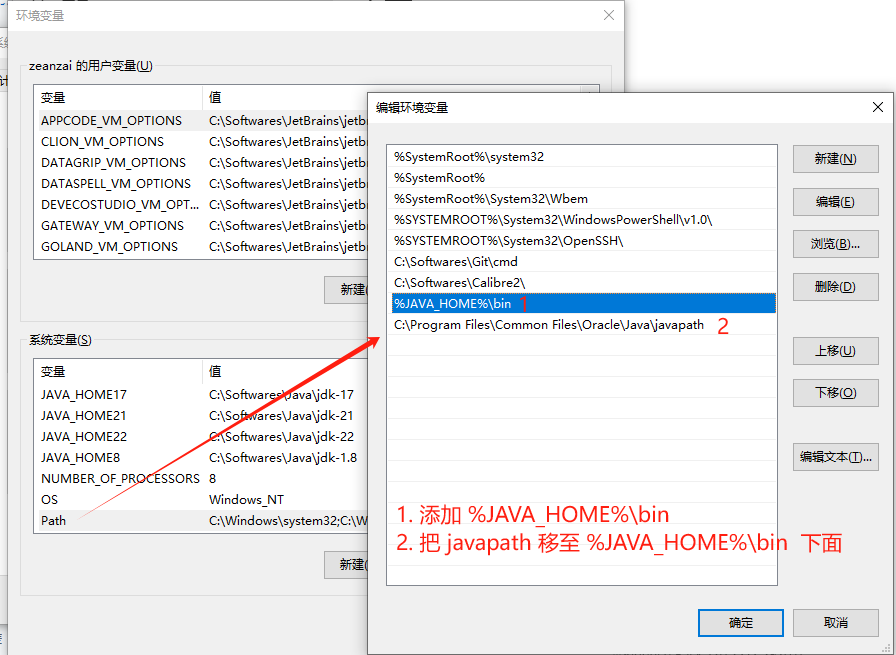
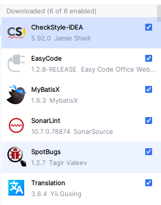
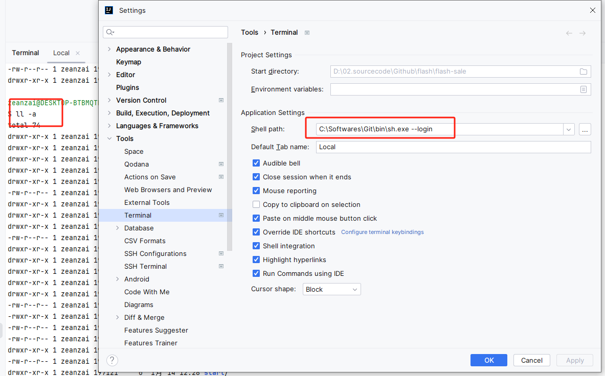
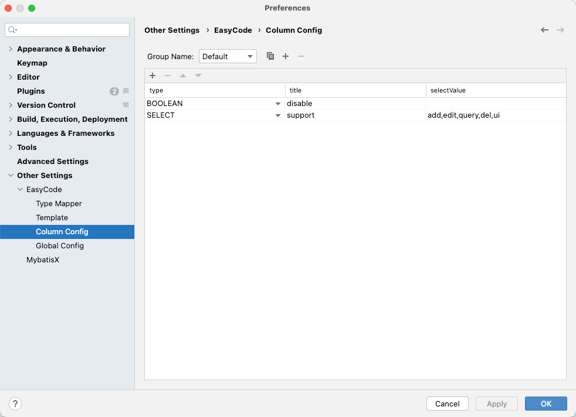

# Windows

## 系统激活

[Windows10企业版LTS激活](https://www.win7zhijia.cn/win10jc/win10_44800.html)

windows10企业版ltsc激活密钥2021?[Win10](https://www.win7zhijia.cn/win10/)企业版ltsc是一款功能非常强大的win10版本，很多小伙伴们都想在电脑上安装win10企业版ltsc，但是安装了win10企业版ltsc后还需要密钥进行激活，那么今天小编就为大家带来了windows10企业版ltsc激活密钥2021，一起来看看吧。

```js

**Win10 21h2企业版激活码(神key)**
VK7JG-NPHTM-C97JM-9MPGT-3V66T
NPPR9-FWDCX-D2C8J-H872K-2YT43
VK7JG-NPHTM-C97JM-9MPGT-3V66T
W269N-WFGWX-YVC9B-4J6C9-T83GX
MH37W-N47XK-V7XM9-C7227-GCQG9
NYW94-47Q7H-7X9TT-W7TXD-JTYPM
NJ4MX-VQQ7Q-FP3DB-VDGHX-7XM87
**Win10各个版别激活码大全**
企业版：XGVPP-NMH47-7TTHJ-W3FW7-8HV2C
专业版N：2B87N-8KFHP-DKV6R-Y2C8J-PKCKT3
教育版N：84NGF-MHBT6-FXBX8-QWJK7-DRR8H
企业版S：FWN7H-PF93Q-4GGP8-M8RF3-MDWWW
教育版：YNMGQ-8RYV3-4PGQ3-C8XTP-7CFBY
单语言版：BT79Q-G7N6G-PGBYW-4YWX6-6F4BT
企业版N：WGGHN-J84D6-QYCPR-T7PJ7-X766F
**Win10 21h2激活key**
神key：VMT3B-G4NYC-M27X9-PTJVV-PWF9G
神key：CJW7T-X9N76-X3QCM-P3QJ7-FJRC6
神key：TPYNC-4J6KF-4B4GP-2HD89-7XMP6
神key：NRTT2-86GJM-T969G-8BCBH-BDWXG
神key：NXRQM-CXV6P-PBGVJ-293T4-R3KTY
神key：DR9VN-GF3CR-RCWT2-H7TR8-82QGT
神key：NJ4MX-VQQ7Q-FP3DB-VDGHX-7XM87
神key：2B87N-8KFHP-DKV6R-Y2C8J-PKCKT[专业版N]
神key：NCXF8-K94KP-39F72-JK8D2-9QBP6

**windows10企业版ltsc激活密钥2021**
M7XTQ-FN8P6-TTKYV-9D4CC-J462D
MBQRK-FNDW8-B7GF4-V9PCW-6MV77

```


**激活过程**：

1. 首先使用“win+x”来打开“powershell管理员版本”;
2. 然后输入以下代码：

    ```js
    **slmgr -ipk M7XTQ-FN8P6-TTKYV-9D4CC-J462D**
    **slmgr -skms kms.03k.org**
    **slmgr -ato**
    **slmgr -dlv**
    ```

3. 然后就可以使用win10企业版ltsc了。
4. 查看激活信息

    


## QTTabBar

- 安装后打开软件方式


- 打开后启动自定义分组

有时候，我们打开文件浏览器时，我们希望打开一组文件夹，我们可以这样操作：


## jdk

1. 依次安装jdk1.8、jdk17、jdk21、jdk22，安装目录为： C:\Softwares\Java ， 如下图

    

2. 修改配置环境变量。

    

    

3. 切换版本只需要修改JAVA_HOME的值即可

    

## maven

1. 解压安装包到指定目录
2. 修改配置文件：

    ```xml
    // 1. 修改仓库地址
    <localRepository>D:\00-home\repository</localRepository>

    // 2. 新增核心仓库地址
    <mirror>
    <id>alimaven</id>
    <name>aliyun maven</name>
    <!-- https://maven.aliyun.com/repository/public/ -->
    <url>http://maven.aliyun.com/nexus/content/groups/public/</url>
    <mirrorOf>central</mirrorOf>
    </mirror>

    // 3. 新增全局profile
    <!-- 全局JDK1.8配置 -->
    <profile>
        <id>jdk1.8</id>
        <activation>
            <activeByDefault>true</activeByDefault>
            <jdk>1.8</jdk>
        </activation>
        <properties>
            <project.build.sourceEncoding>UTF-8</project.build.sourceEncoding>
            <maven.compiler.source>1.8</maven.compiler.source>
            <maven.compiler.target>1.8</maven.compiler.target>
            <maven.compiler.compilerVersion>1.8</maven.compiler.compilerVersion>
        </properties>
    </profile>

    <!-- 阿里云配置: 提高国内的jar包下载速度 -->
    <profile>
        <id>ali</id>
        <repositories>
            <repository>
                <id>alimaven</id>
                <name>aliyun maven</name>
                <url>http://maven.aliyun.com/nexus/content/groups/public/</url>
                <releases>
                    <enabled>true</enabled>
                </releases>
                <snapshots>
                    <enabled>true</enabled>
                </snapshots>
            </repository>
        </repositories>
        <pluginRepositories>
            <pluginRepository>
            <id>alimaven</id>
            <name>aliyun maven</name>
            <url>http://maven.aliyun.com/nexus/content/groups/public/</url>
            </pluginRepository>
        </pluginRepositories>
    </profile>

    // 4. 使全局profile生效
    <activeProfiles>
    <activeProfile>jdk1.8</activeProfile>
    <activeProfile>ali</activeProfile>
    </activeProfiles>

    ```

## idea

1. 参考readme中方式安装并破解；
2. 配置idea： 在未打开任何项目之前配置idea，并安装插件

    

    

3. 有些快捷键可能会失效

    

4. 配置终端为git中的bash

    

5. 其他

    

6. easycode插件的使用

    

    

    

    

7. 在idea中配置数据库链接
8. 生成代码

    

    

## vscode

1. 安装后登录账号会自动同步设置，账号为GitHub的账号。
2. 快捷键创建 以时间戳命名的markdown文件，用户快速记录一些内容：

    ```json
    {
        "label": "Create and Open Markdown File",
        "type": "shell",
        "command": "bash",	// 表明
        "args": [
            "-c",
            "FILENAME=$(date +'%Y%m%d_%H%M%S').md && FILEPATH=$(cygpath -u \"${workspaceFolder}\") && touch \"$FILEPATH/notes/temp/$FILENAME\" && code \"$FILEPATH/notes/temp/$FILENAME\""
        ],
        "group": {
            "kind": "build",    // Ctrl+Shift+B：此快捷键触发默认的 build 任务，你也可以自定义触发其他快捷键。
            "isDefault": true
        },
        "problemMatcher": []
    }


    // 注意： 
    command: 使用 bash 来执行命令。
    cygpath 是 Git Bash 环境下的命令，用于转换 Windows 和 Unix 路径格式。它确保在 Git Bash 中处理路径时，不会因为反斜杠的转义问题导致错误。
    ```

3. 参考： [vscode设置](https://type.cyhsu.xyz/2023/09/vscode-as-scratchpad/)

## git

```bash

# 生成key
ssh-keygen -t ed25519 -C "zeanzai.me@gmail.com"

# 为每一个仓库设置用户名和邮箱
#   只需要在仓库目录下执行即可
git config user.name "Your Name"
git config user.email "your.email@example.com"
#   之后在 .git/config 可以看到设置后的用户名和邮箱

# 全局配置
git config --global user.name zeanzai
git config --global user.email "zeanzai.me@gmail.com"
git config --global http.proxy 127.0.0.1:7890

# 注意：如果是需要身份验证的，就用这种格式：
git config --global http.proxy 用户名:密码@IP:端口
# 如果需要设置https，那么就需要把 http.proxy 改成 https.proxy
git config --global https.proxy 127.0.0.1:7890

# 查看一下配置
git config --global --list


# 测试
ssh -T git@github.com
ssh -T git@gitee.com

# ssh
ssh-copy-id -i ./id_ed25519.pub root@192.168.1.150

# 空仓库
mkdir test
cd test
git init 
touch README.md
git add README.md
git commit -m "first commit"
git remote add origin https://gitee.com/zeanzai/test.git
git push -u origin "master"

# 已有仓库
cd existing_git_repo
git remote add origin https://gitee.com/zeanzai/test.git
git push -u origin "master"

```

## 设备信息

::: details 设备信息  
@[code log](./windows/include/equipmentinfo.log) 
:::
