## idea 插件之 easycode


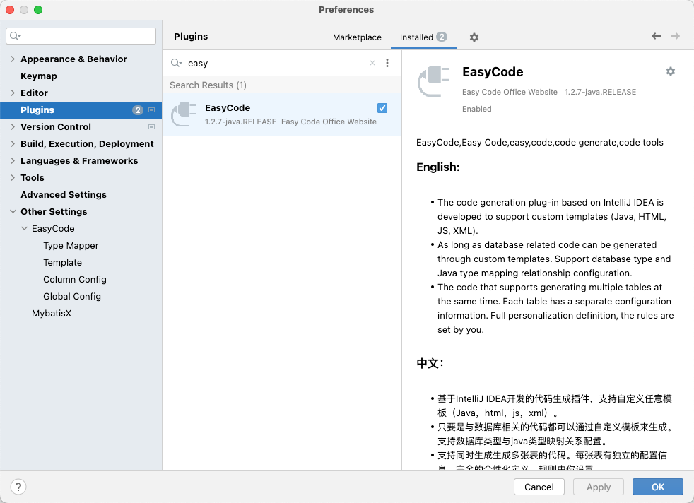


### 插件的配置


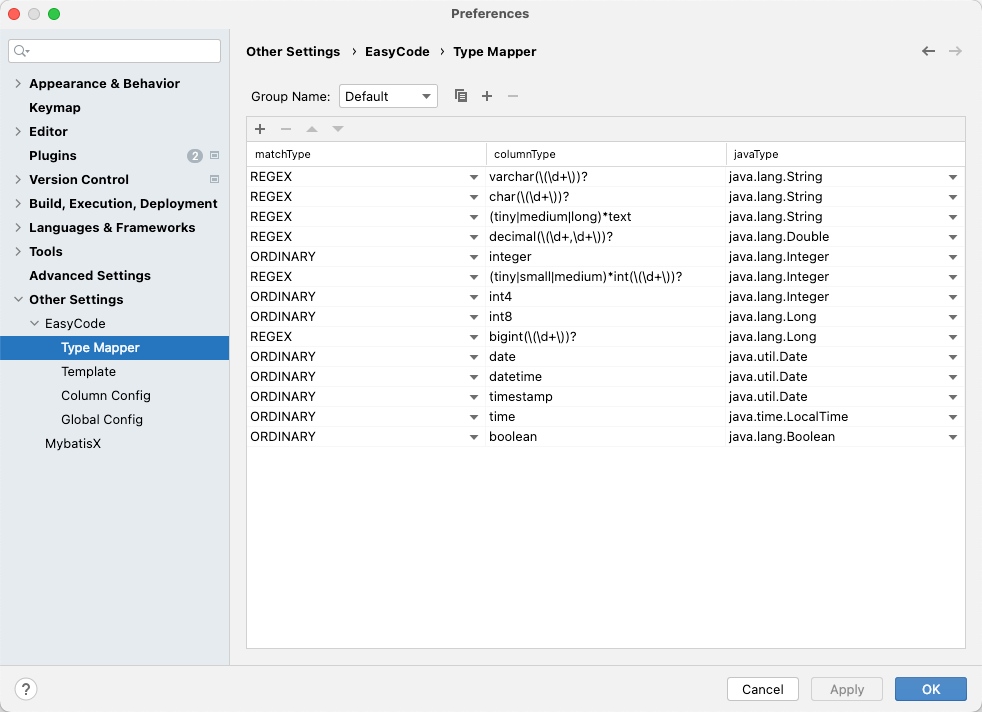


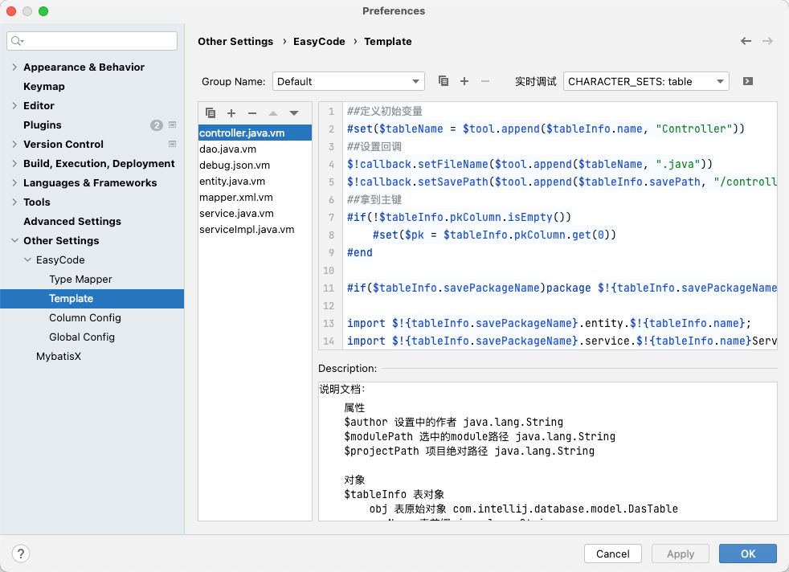


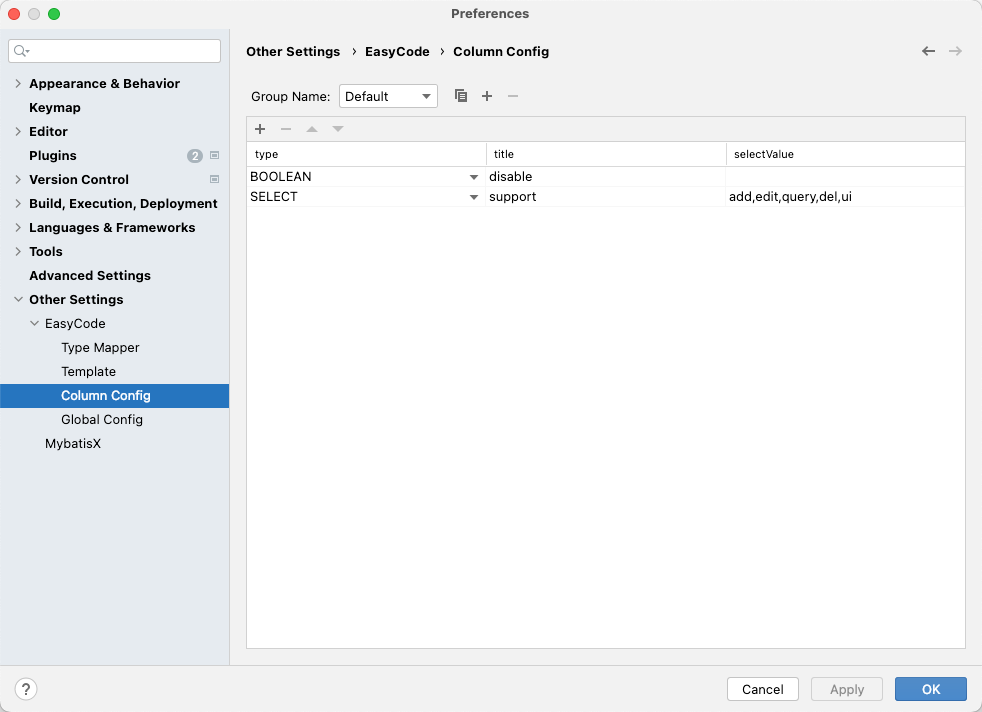


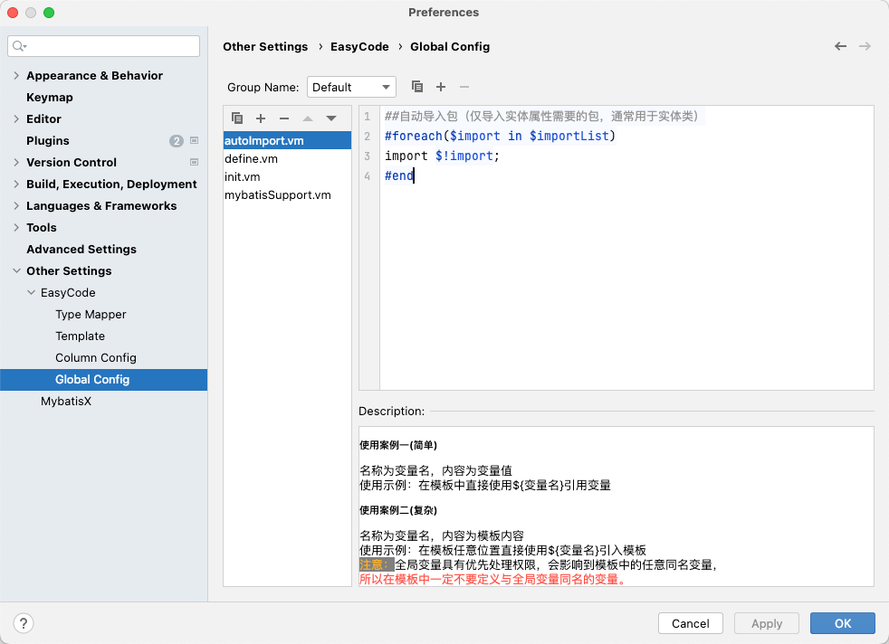


### 插件的使用

1.  在idea中配置数据库链接 
2.  生成代码

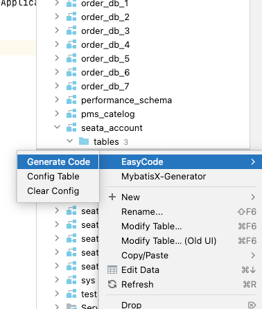 


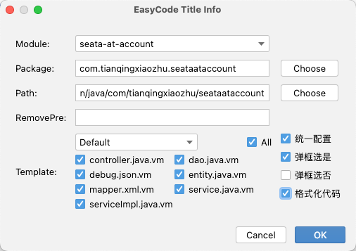


## 


## 应用服务指标


## 日志
在实际开发过程中，是离不开日志的记录的，SpringBoot 不但帮我们提供了默认的日志的实现，我们也可以引入第三方的日志组件。


### SpringBoot 默认日志

在开发过程中，有时我们需要开启远程调用的日志信息，以便我们进行排错，开启只需要在消费者中配置：


```yaml
logging:
  level:
    com.tianqingxiaozhu.nacos.consumer.service: debug

```

`com.tianqingxiaozhu.nacos.consumer.service` 是消费者接口所在的包路径。


### 使用lombok记录日志

在实际的项目开发过程中，我们有时候可能需要对业务代码添加一些日志，便于我们后续查找问题。添加日志的过程如下：

1. 在项目中导入依赖


```xml
<!--使用 @Slf4j 注解-->
<dependency>
    <groupId>org.projectlombok</groupId>
    <artifactId>lombok</artifactId>
</dependency>

```

2. 配置文件中配置日志的级别


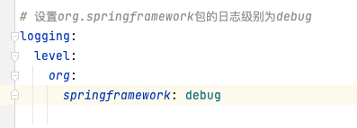

3. 使用注解标注日志统计器


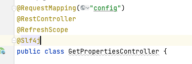

4. 记录日志信息


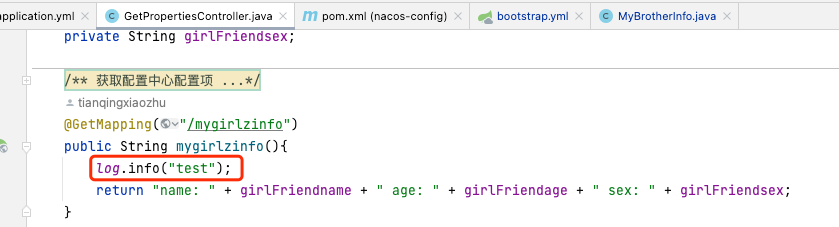

在ide控制台的输入日志中，我们还可以查看nacos客户端读取服务端配置文件的日志信息：


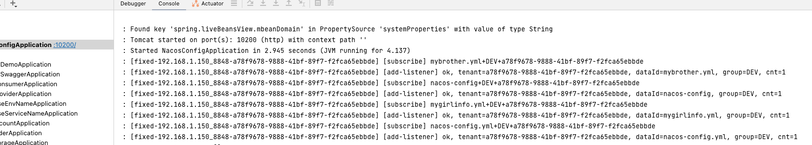


