> 容器中保存的内容就是Bean -》 那何为bean -》 如何描述Bean -》 Bean注册到容器的方式 -》 在Bean中使用另一个Bean -》 Bean的装配【何为装配、装配的分类】 -》 Bean的生命周期

```markdown
单个Bean的构造权，通过元信息提供给Spring容器，并由Spring容器进行构造。即Spring容器剥夺了Bean的构造权。

多个Bean之间组合使用，由此产生的依赖关系的装配权，可以由Spring来管理，也可以由开发人员来管理；

```

- 配置文件方式

```log
// 在bean.xml中进行描述
<?xml version="1.0" encoding="UTF-8"?>
<beans xmlns="http://www.springframework.org/schema/beans"
       xmlns:xsi="http://www.w3.org/2001/XMLSchema-instance"
       xsi:schemaLocation="http://www.springframework.org/schema/beans
    http://www.springframework.org/schema/beans/spring-beans-4.3.xsd">
    <import resource="其他配置文件的位置" />
    <bean id="bean名称" class="bean完整类名"/>
</beans>

// 使用
@Test
public void test1() {
    //1. bean配置文件位置
    String beanXml = "classpath:beans.xml";
    //2. 创建ClassPathXmlApplicationContext容器，给容器指定需要加载的bean配置文件
    ClassPathXmlApplicationContext context = new ClassPathXmlApplicationContext(beanXml);
    //3. getBeanDefinitionNames用于获取容器中所有bean的名称
    for (String beanName : context.getBeanDefinitionNames()) {
        //获取bean的别名
        String[] aliases = context.getAliases(beanName);
        System.out.println(String.format("beanName:%s,别名:[%s]", beanName, String.join(",", aliases)));
    }
}

```

```
// 配置文件beans.properties中进行配置
car.(class)=com.javacode2018.lesson002.demo1.Car
car.name=奥迪

car1.(class)=com.javacode2018.lesson002.demo1.Car
car1.name=保时捷

car2.(parent)=car1

user.(class)=com.javacode2018.lesson002.demo1.User
user.name=路人甲Java
user.car(ref)=car

// 使用
@Test
public void test2() {
    //定义一个spring容器，这个容器默认实现了BeanDefinitionRegistry，所以本身就是一个bean注册器
    DefaultListableBeanFactory factory = new DefaultListableBeanFactory();

    //定义一个properties的BeanDefinition读取器，需要传递一个BeanDefinitionRegistry（bean注册器）对象
    PropertiesBeanDefinitionReader propertiesBeanDefinitionReader = new PropertiesBeanDefinitionReader(factory);

    //指定bean xml配置文件的位置
    String location = "classpath:/com/javacode2018/lesson002/demo2/beans.properties";
    //通过PropertiesBeanDefinitionReader加载bean properties文件，然后将解析产生的BeanDefinition注册到容器容器中
    int countBean = propertiesBeanDefinitionReader.loadBeanDefinitions(location);
    System.out.println(String.format("共注册了 %s 个bean", countBean));

    //打印出注册的bean的配置信息
    for (String beanName : factory.getBeanDefinitionNames()) {
        //通过名称从容器中获取对应的BeanDefinition信息
        BeanDefinition beanDefinition = factory.getBeanDefinition(beanName);
        //获取BeanDefinition具体使用的是哪个类
        String beanDefinitionClassName = beanDefinition.getClass().getName();
        //通过名称获取bean对象
        Object bean = factory.getBean(beanName);
        //打印输出
        System.out.println(beanName + ":");
        System.out.println("    beanDefinitionClassName：" + beanDefinitionClassName);
        System.out.println("    beanDefinition：" + beanDefinition);
        System.out.println("    bean：" + bean);
    }
}

```

- Java直接编码方式之一： 基于注解（JSR+Spring注解）

```
<context:component-scan base-package="com.atguigu.spring6">
</context:component-scan>

或 

@Configuration
//@ComponentScan({"com.atguigu.spring6.controller", "com.atguigu.spring6.service","com.atguigu.spring6.dao"})
@ComponentScan("com.atguigu.spring6")
public class Spring6Config {
}

// 之后使用

```

- Java直接编码方式之二： 基于SpringAPI方式
- GroovyDSL方式
- 【待定】使用 Spring 官方提供的注解
  - 有哪些注解，这些注解的功能是什么

# 元信息

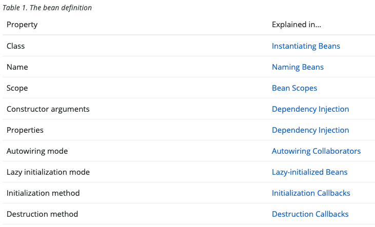

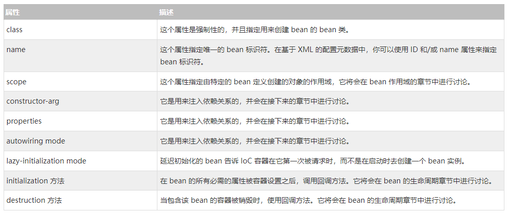

| 属性 | 描述 |
| --- | --- |
| class | 这个属性是强制性的，并且指定用来创建 bean 的 bean 类。 |
| name | 这个属性指定唯一的 bean 标识符。在基于 XML 的配置元数据中，你可以使用 ID 和/或 name 属性来指定 bean 标识符。 |
| scope | 这个属性指定由特定的 bean 定义创建的对象的作用域，它将会在 bean 作用域的章节中进行讨论。 |
| constructor-arg | 它是用来注入依赖关系的，并会在接下来的章节中进行讨论。 |
| properties | 它是用来注入依赖关系的，并会在接下来的章节中进行讨论。 |
| autowiring mode | 它是用来注入依赖关系的，并会在接下来的章节中进行讨论。 |
| lazy-initialization mode | 延迟初始化的 bean 告诉 IoC 容器在它第一次被请求时，而不是在启动时去创建一个 bean 实例。 |
| initialization 方法 | 在 bean 的所有必需的属性被容器设置之后，调用回调方法。它将会在 bean 的生命周期章节中进行讨论。 |
| destruction 方法 | 当包含该 bean 的容器被销毁时，使用回调方法。它将会在 bean 的生命周期章节中进行讨论。 |

- singleton
  - 描述：该作用域下的 Bean 在 IoC 容器中只存在一个实例：获取 Bean（即通过 applicationContext.getBean等方法获取）及装配 Bean（即通过 [@Autowired](/Autowired ) 注入）都是同一个对象；
  - 场景：通常无状态的 Bean 使用该作用域，无状态表示 Bean 对象的属性状态不需要更新；
  - 备注：Spring 默认选择该作用域，线程不安全，Spring使用ThreadLocal解决线程安全问题；
- prototype
  - 描述：每次对该作用域下的 Bean 的请求都会创建新的实例：获取 Bean（即通过 applicationContext.getBean 等方法获取）及装配 Bean（即通过 [@Autowired](/Autowired ) 注入）都是新的对象实例。
  - 场景：通常有状态的 Bean 使用该作用域。
- request
  - 描述：每次 Http 请求会创建新的 Bean 实例，且创建的Bean实例只对当前 Http 请求有效，Http 请求结束，改Bean实例也被销毁；类似于 prototype。
  - 场景：一次 Http 的请求和响应的共享 Bean。
  - 备注：限定 Spring MVC 框架中使用。
- session
  - 描述：在一个 Http Session 中，定义一个 Bean 实例，不同的 Session 中不共享Bean实例；
  - 场景：用户会话的共享 Bean, 比如：记录一个用户的登陆信息。
  - 备注：限定 Spring MVC 框架中使用。
- application
  - 描述：在一个 Http Servlet Context 中，定义一个 Bean 实例。
  - 场景：Web 应用的上下文信息，比如：记录一个应用的共享信息。
  - 备注：限定 Spring MVC 框架中使用。

设置Bean的Scope属性的方法：

```
<bean id="book02" class="com.spring.beans.Book" scope="singleton"></bean>
<bean id="book02" class="com.spring.beans.Book" scope="prototype"></bean>
<bean id="book02" class="com.spring.beans.Book" scope="request"></bean>
<bean id="book02" class="com.spring.beans.Book" scope="session"></bean>
<bean id="book02" class="com.spring.beans.Book" scope="application"></bean>

```

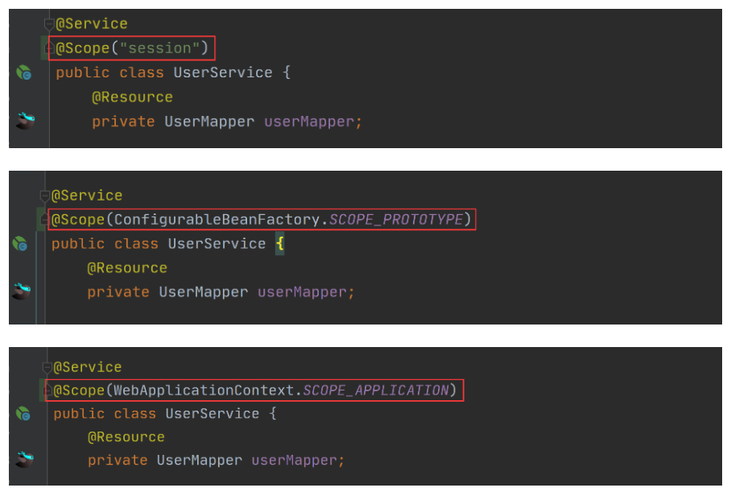

```markdown
bean的状态： 

无状态bean和有状态bean

有状态就是有数据存储功能。有状态对象(Stateful Bean)，就是有实例变量的对象，可以保存数据，是非线程安全的。在不同方法调用间不保留任何状态。
无状态就是一次操作，不能保存数据。无状态对象(Stateless Bean)，就是没有实例变量的对象 .不能保存数据，是不变类，是线程安全的。

```

参考[链接](https://www.cnblogs.com/vipstone/p/16641846.html)

## 作用域

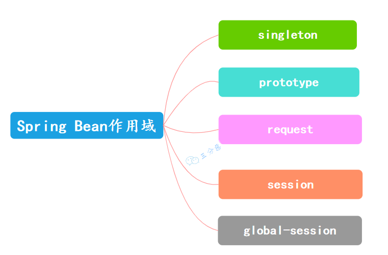

- **singleton** : 在Spring容器仅存在一个Bean实例，Bean以单实例的方式存在，是Bean默认的作用域。
- **prototype** : 每次从容器重调用Bean时，都会返回一个新的实例。

以下三个作用域于只在Web应用中适用：

- **request** : 每一次HTTP请求都会产生一个新的Bean，该Bean仅在当前HTTP Request内有效。
- **session** : 同一个HTTP Session共享一个Bean，不同的HTTP Session使用不同的Bean。
- **globalSession**：同一个全局Session共享一个Bean，只用于基于Protlet的Web应用，Spring5中已经不存在了。

# Bean 定义和配置依赖的方式

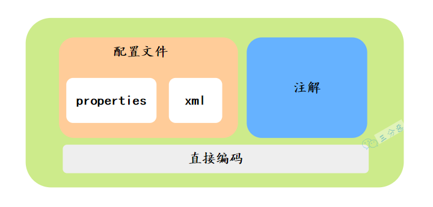

- 直接编码方式：我们一般接触不到直接编码的方式，但其实其它的方式最终都要通过直接编码来实现。

```
public class Car {
    private String name;
    public String getName() {
        return name;
    }
    public void setName(String name) {
        this.name = name;
    }
    @Override
    public String toString() {
        return "Car{" +
                "name='" + name + '\'' +
                '}';
    }
}

@Test
public void test2() {
    //指定class
    BeanDefinitionBuilder beanDefinitionBuilder = BeanDefinitionBuilder.rootBeanDefinition(Car.class.getName());
    //设置普通类型属性
    beanDefinitionBuilder.addPropertyValue("name", "奥迪"); //@1
    //获取BeanDefinition
    BeanDefinition carBeanDefinition = beanDefinitionBuilder.getBeanDefinition();
    System.out.println(carBeanDefinition);
    //创建spring容器
    DefaultListableBeanFactory factory = new DefaultListableBeanFactory(); //@2
    //调用registerBeanDefinition向容器中注册bean
    factory.registerBeanDefinition("car", carBeanDefinition); //@3
    Car bean = factory.getBean("car", Car.class); //@4
    System.out.println(bean);
}

```

- 配置文件方式：通过xml、propreties类型的配置文件，配置相应的依赖关系，Spring读取配置文件，完成依赖关系的注入。

```
// 在bean.xml中进行描述
<?xml version="1.0" encoding="UTF-8"?>
<beans xmlns="http://www.springframework.org/schema/beans"
       xmlns:xsi="http://www.w3.org/2001/XMLSchema-instance"
       xsi:schemaLocation="http://www.springframework.org/schema/beans
    http://www.springframework.org/schema/beans/spring-beans-4.3.xsd">
    <import resource="其他配置文件的位置" />
    <bean id="bean名称" class="bean完整类名"/>
</beans>

// 使用
@Test
public void test1() {
    //1. bean配置文件位置
    String beanXml = "classpath:beans.xml";
    //2. 创建ClassPathXmlApplicationContext容器，给容器指定需要加载的bean配置文件
    ClassPathXmlApplicationContext context = new ClassPathXmlApplicationContext(beanXml);
    //3. getBeanDefinitionNames用于获取容器中所有bean的名称
    for (String beanName : context.getBeanDefinitionNames()) {
        //获取bean的别名
        String[] aliases = context.getAliases(beanName);
        System.out.println(String.format("beanName:%s,别名:[%s]", beanName, String.join(",", aliases)));
    }
}

```

```
// 配置文件beans.properties中进行配置
car.(class)=com.javacode2018.lesson002.demo1.Car
car.name=奥迪

car1.(class)=com.javacode2018.lesson002.demo1.Car
car1.name=保时捷

car2.(parent)=car1

user.(class)=com.javacode2018.lesson002.demo1.User
user.name=路人甲Java
user.car(ref)=car

// 使用
@Test
public void test2() {
    //定义一个spring容器，这个容器默认实现了BeanDefinitionRegistry，所以本身就是一个bean注册器
    DefaultListableBeanFactory factory = new DefaultListableBeanFactory();

    //定义一个properties的BeanDefinition读取器，需要传递一个BeanDefinitionRegistry（bean注册器）对象
    PropertiesBeanDefinitionReader propertiesBeanDefinitionReader = new PropertiesBeanDefinitionReader(factory);

    //指定bean xml配置文件的位置
    String location = "classpath:/com/javacode2018/lesson002/demo2/beans.properties";
    //通过PropertiesBeanDefinitionReader加载bean properties文件，然后将解析产生的BeanDefinition注册到容器容器中
    int countBean = propertiesBeanDefinitionReader.loadBeanDefinitions(location);
    System.out.println(String.format("共注册了 %s 个bean", countBean));

    //打印出注册的bean的配置信息
    for (String beanName : factory.getBeanDefinitionNames()) {
        //通过名称从容器中获取对应的BeanDefinition信息
        BeanDefinition beanDefinition = factory.getBeanDefinition(beanName);
        //获取BeanDefinition具体使用的是哪个类
        String beanDefinitionClassName = beanDefinition.getClass().getName();
        //通过名称获取bean对象
        Object bean = factory.getBean(beanName);
        //打印输出
        System.out.println(beanName + ":");
        System.out.println("    beanDefinitionClassName：" + beanDefinitionClassName);
        System.out.println("    beanDefinition：" + beanDefinition);
        System.out.println("    bean：" + bean);
    }
}

```

- 注解方式：注解方式应该是我们用的最多的一种方式了，在相应的地方使用注解修饰，Spring会扫描注解，完成依赖关系的注入。

```
// 1. 开启注解扫描   start ---------
<context:component-scan base-package="com.atguigu.spring6">
</context:component-scan>

或 

@Configuration
//@ComponentScan({"com.atguigu.spring6.controller", "com.atguigu.spring6.service","com.atguigu.spring6.dao"})
@ComponentScan("com.atguigu.spring6")
public class Spring6Config {
}
// ---------- end

// 2. 之后使用
@Bean 、 @Controller 、 @Service ...

```

# 依赖注入的方式

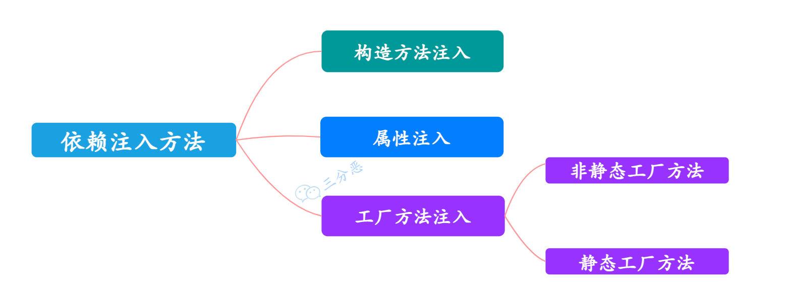

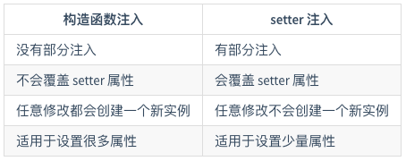

- **构造方法注入**通过调用类的构造方法，将接口实现类通过构造方法变量传入复制代码

```java
public CatDaoImpl(String message){
   this. message = message;
 }

<bean id="CatDaoImpl" class="com.CatDaoImpl"> 
  <constructor-arg value=" message "></constructor-arg>
</bean>

```

- **属性注入**通过Setter方法完成调用类所需依赖的注入复制代码

```java
public class Id {
    private int id;

    public int getId() { return id; }
 
    public void setId(int id) { this.id = id; }
}

<bean id="id" class="com.id "> 
  <property name="id" value="123"></property> 
</bean>

```

- **工厂方法注入**
  - **静态工厂注入**静态工厂顾名思义，就是通过调用静态工厂的方法来获取自己需要的对象，为了让 Spring 管理所有对象，我们不能直接通过"工程类.静态方法()"来获取对象，而是依然通过 Spring 注入的形式获取：复制代码
  - **非静态工厂注入**非静态工厂，也叫实例工厂，意思是工厂方法不是静态的，所以我们需要首先 new 一个工厂实例，再调用普通的实例方法。复制代码

```java
public class DaoFactory { //静态工厂
 
   public static final FactoryDao getStaticFactoryDaoImpl(){
      return new StaticFacotryDaoImpl();
   }
}
 
public class SpringAction {
 
 //注入对象
 private FactoryDao staticFactoryDao; 
 
 //注入对象的 set 方法
 public void setStaticFactoryDao(FactoryDao staticFactoryDao) {
     this.staticFactoryDao = staticFactoryDao;
 }
 
}

//factory-method="getStaticFactoryDaoImpl"指定调用哪个工厂方法
 <bean name="springAction" class=" SpringAction" >
   <!--使用静态工厂的方法注入对象,对应下面的配置文件-->
   <property name="staticFactoryDao" ref="staticFactoryDao"></property>
 </bean>
 
 <!--此处获取对象的方式是从工厂类中获取静态方法-->
<bean name="staticFactoryDao" class="DaoFactory"
  factory-method="getStaticFactoryDaoImpl"></bean>

```

```java
//非静态工厂 
public class DaoFactory { 
   public FactoryDao getFactoryDaoImpl(){
     return new FactoryDaoImpl();
   }
 }
 
public class SpringAction {
  //注入对象
  private FactoryDao factoryDao; 
  
  public void setFactoryDao(FactoryDao factoryDao) {
    this.factoryDao = factoryDao;
  }
}

<bean name="springAction" class="SpringAction">
   <!--使用非静态工厂的方法注入对象,对应下面的配置文件-->
   <property name="factoryDao" ref="factoryDao"></property>
 </bean>
 
 <!--此处获取对象的方式是从工厂类中获取实例方法-->
 <bean name="daoFactory" class="com.DaoFactory"></bean>
 
<bean name="factoryDao" factory-bean="daoFactory" factory-method="getFactoryDaoImpl"></bean>

```

- FactoryBean创建bean对象

```
public class UserFactoryBean implements FactoryBean<UserModel> {
    int count = 1;
    @Nullable
    @Override
    public UserModel getObject() throws Exception { //@1
        UserModel userModel = new UserModel();
        userModel.setName("我是通过FactoryBean创建的第"+count+++ "对象");//@4
        return userModel;
    }
    @Nullable
    @Override
    public Class<?> getObjectType() {
        return UserModel.class; //@2
    }
    @Override
    public boolean isSingleton() { 
        return true; //@3
    }
}

<!-- 通过FactoryBean 创建UserModel对象 -->
<bean id="createByFactoryBean" class="com.javacode2018.lesson001.demo3.UserFactoryBean"/>

//1.bean配置文件位置
String beanXml = "classpath:/com/javacode2018/lesson001/demo3/beans.xml";
//2.创建ClassPathXmlApplicationContext容器，给容器指定需要加载的bean配置文件
ClassPathXmlApplicationContext context = new ClassPathXmlApplicationContext(beanXml);
UserModel userModel = context.getBean("userModel",UserModel.class);
System.out.println("spring容器中所有bean如下：");
//getBeanDefinitionNames用于获取容器中所有bean的名称
for (String beanName : context.getBeanDefinitionNames()) {
    System.out.println(beanName + ":" + context.getBean(beanName));
}

```

### 依赖注入的实现方式

基于Spring的依赖注入的实现方式，意思就是说，现在有一个类A，需要使用别的功能模块中已经开发完成的类B，如何把类B注入到类A中，让类A进行使用。等同于： Bean的实例化 。

- 构造方法

```
public CatDaoImpl(String message){
  this. message = message;
}

<bean id="CatDaoImpl" class="com.CatDaoImpl"> 
  <constructor-arg value=" message "></constructor-arg>
</bean>

```

- setter

```
public class Id {
  private int id;

  public int getId() { return id; }

  public void setId(int id) { this.id = id; }
}

<bean id="id" class="com.id "> 
  <property name="id" value="123"></property> 
</bean>

```

- 实例工厂方式

```
//非静态工厂 
public class DaoFactory { 
   public FactoryDao getFactoryDaoImpl(){
     return new FactoryDaoImpl();
   }
 }
 
public class SpringAction {
  //注入对象
  private FactoryDao factoryDao; 
  
  public void setFactoryDao(FactoryDao factoryDao) {
    this.factoryDao = factoryDao;
  }
}

<bean name="springAction" class="SpringAction">
   <!--使用非静态工厂的方法注入对象,对应下面的配置文件-->
   <property name="factoryDao" ref="factoryDao"></property>
 </bean>
 
 <!--此处获取对象的方式是从工厂类中获取实例方法-->
 <bean name="daoFactory" class="com.DaoFactory"></bean>
 
<bean name="factoryDao" factory-bean="daoFactory" factory-method="getFactoryDaoImpl"></bean>

```

- 静态工厂方式

```
public class DaoFactory { //静态工厂
 
   public static final FactoryDao getStaticFactoryDaoImpl(){
      return new StaticFacotryDaoImpl();
   }
}
 
public class SpringAction {
 
 //注入对象
 private FactoryDao staticFactoryDao; 
 
 //注入对象的 set 方法
 public void setStaticFactoryDao(FactoryDao staticFactoryDao) {
     this.staticFactoryDao = staticFactoryDao;
 }
 
}

//factory-method="getStaticFactoryDaoImpl"指定调用哪个工厂方法
 <bean name="springAction" class=" SpringAction" >
   <!--使用静态工厂的方法注入对象,对应下面的配置文件-->
   <property name="staticFactoryDao" ref="staticFactoryDao"></property>
 </bean>
 
 <!--此处获取对象的方式是从工厂类中获取静态方法-->
<bean name="staticFactoryDao" class="DaoFactory"
  factory-method="getStaticFactoryDaoImpl"></bean>

```

- FactoryBean创建bean对象

```
public class UserFactoryBean implements FactoryBean<UserModel> {
    int count = 1;
    @Nullable
    @Override
    public UserModel getObject() throws Exception { //@1
        UserModel userModel = new UserModel();
        userModel.setName("我是通过FactoryBean创建的第"+count+++ "对象");//@4
        return userModel;
    }
    @Nullable
    @Override
    public Class<?> getObjectType() {
        return UserModel.class; //@2
    }
    @Override
    public boolean isSingleton() { 
        return true; //@3
    }
}

<!-- 通过FactoryBean 创建UserModel对象 -->
<bean id="createByFactoryBean" class="com.javacode2018.lesson001.demo3.UserFactoryBean"/>

//1.bean配置文件位置
String beanXml = "classpath:/com/javacode2018/lesson001/demo3/beans.xml";
//2.创建ClassPathXmlApplicationContext容器，给容器指定需要加载的bean配置文件
ClassPathXmlApplicationContext context = new ClassPathXmlApplicationContext(beanXml);
System.out.println("spring容器中所有bean如下：");
//getBeanDefinitionNames用于获取容器中所有bean的名称
for (String beanName : context.getBeanDefinitionNames()) {
    System.out.println(beanName + ":" + context.getBean(beanName));
}

```

# 装配

Spring容器在用到Bean的位置构造出Bean的过程就是装配，比如类A中有依赖了类B，那么Spring容器把类B的一个对象给到A的过程，就是装配。

Spring IOC容器知道所有Bean的配置信息，此外，通过Java反射机制还可以获知实现类的结构信息，如构造方法的结构、属性等信息。掌握所有Bean的这些信息后，Spring IOC容器就可以按照某种规则对容器中的Bean进行自动装配，而无须通过显式的方式进行依赖配置。
Spring提供的这种方式，可以按照某些规则进行Bean的自动装配，元素提供了一个指定自动装配类型的属性：autowire="<自动装配类型>"

当 bean 在 Spring 容器中组合在一起时，它被称为装配或 bean 装配。 Spring 容器需要知道需要什么 bean 以及容器应该如何使用依赖注入来将 bean 绑定在一起，同时装配 bean。
Spring 容器能够自动装配 bean。也就是说，可以通过检查 BeanFactory 的内容让 Spring 自动解析 bean 的协作者。

根据指定的策略，在IOC容器中匹配某一个bean，自动为指定的bean中所依赖的类类型或接口类型属性赋值

## 自动装配

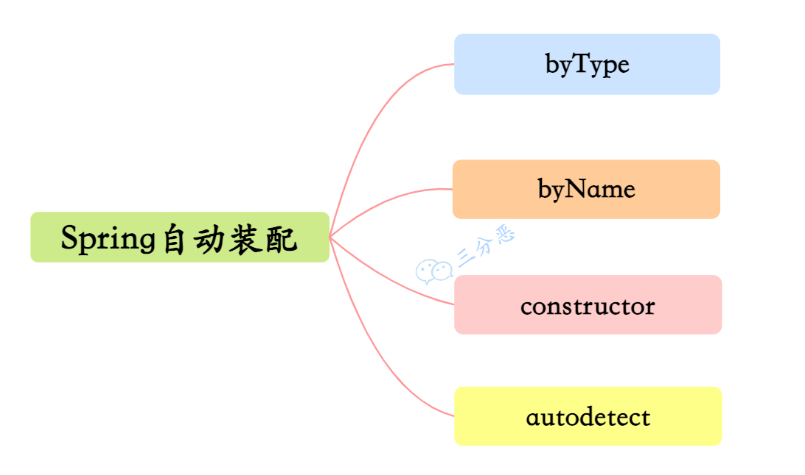

- **byName**：根据名称进行自动匹配，假设Boss又一个名为car的属性，如果容器中刚好有一个名为car的bean，Spring就会自动将其装配给Boss的car属性
- **byType**：根据类型进行自动匹配，假设Boss有一个Car类型的属性，如果容器中刚好有一个Car类型的Bean，Spring就会自动将其装配给Boss这个属性
- **constructor**：与 byType类似， 只不过它是针对构造函数注入而言的。如果Boss有一个构造函数，构造函数包含一个Car类型的入参，如果容器中有一个Car类型的Bean，则Spring将自动把这个Bean作为Boss构造函数的入参；如果容器中没有找到和构造函数入参匹配类型的Bean，则Spring将抛出异常。
- **autodetect**：根据Bean的自省机制决定采用byType还是constructor进行自动装配，如果Bean提供了默认的构造函数，则采用byType，否则采用constructor。

```markdown
no - 这是默认设置，表示没有自动装配。应使用显式 bean 引用进行装配。
byName - 它根据 bean 的名称注入对象依赖项。它匹配并装配其属性与 XML 文件中由相同名称定义的 bean。
byType - 它根据类型注入对象依赖项。如果属性的类型与 XML 文件中的一个 bean 名称匹配，则匹配并装配属性。
构造函数 - 它通过调用类的构造函数来注入依赖项。它有大量的参数。
autodetect - 首先容器尝试通过构造函数使用 autowire 装配，如果不能，则尝试通过 byType 自动装配。

```

自动装配的局限性：

- 覆盖的可能性 - 您始终可以使用 <constructor-arg> 和 <property> 设置指定依赖项，这将覆盖自动装配。
- 基本元数据类型 - 简单属性（如原数据类型，字符串和类）无法自动装配。
- 令人困惑的性质 - 总是喜欢使用明确的装配，因为自动装配不太精确。

## 手动装配

lazy-initialization

在bean定义的时候通过lazy-init属性来配置bean是否是延迟加载，true：延迟初始化，false：实时初始化

```
<bean lazy-init="是否是延迟初始化" />

@Lazy 注解

```

就是说如何把我们创建好的一个个Bean给到Spring容器，这里包括Bean的基本信息以及Bean与Bean之间关系的描述信息等。

- 直接编码方式：我们一般接触不到直接编码的方式，但其实其它的方式最终都要通过直接编码来实现。
- 配置文件方式：通过xml、propreties类型的配置文件，配置相应的依赖关系，Spring读取配置文件，完成依赖关系的注入。
- 注解方式：注解方式应该是我们用的最多的一种方式了，在相应的地方使用注解修饰，Spring会扫描注解，完成依赖关系的注入。

把元数据提供给 Spring 容器
有三种方式：

- 基于 XML 的配置文件
- 基于注解的配置
- 基于 Java 的配置

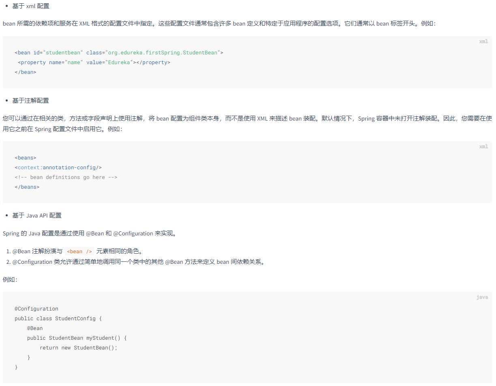

```
<bean id="book02" class="com.spring.beans.Book" scope="singleton"></bean>

```

## Bean 配置元信息的方式

- xml
- 注解方式
- SpringAPI方式
- properties方式

# 生命周期

# 注解

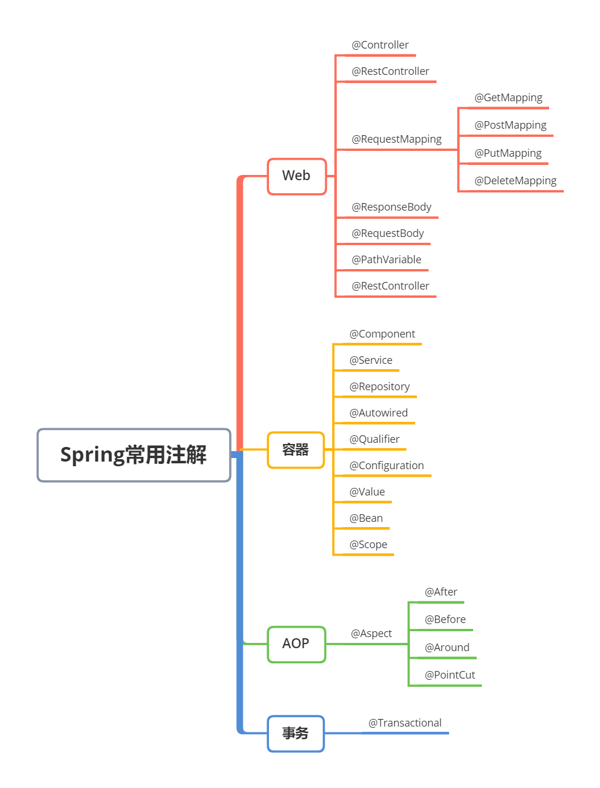

**Web**:

- @Controller：组合注解（组合了@Component注解），应用在MVC层（控制层）。
- @RestController：该注解为一个组合注解，相当于@Controller和@ResponseBody的组合，注解在类上，意味着，该Controller的所有方法都默认加上了@ResponseBody。
- @RequestMapping：用于映射Web请求，包括访问路径和参数。如果是Restful风格接口，还可以根据请求类型使用不同的注解：
  - @GetMapping
  - @PostMapping
  - @PutMapping
  - @DeleteMapping
- @ResponseBody：支持将返回值放在response内，而不是一个页面，通常用户返回json数据。
- @RequestBody：允许request的参数在request体中，而不是在直接连接在地址后面。
- @PathVariable：用于接收路径参数，比如@RequestMapping(“/hello/{name}”)申明的路径，将注解放在参数中前，即可获取该值，通常作为Restful的接口实现方法。
- @RestController：该注解为一个组合注解，相当于@Controller和@ResponseBody的组合，注解在类上，意味着，该Controller的所有方法都默认加上了@ResponseBody。

**容器**:

- @Component：表示一个带注释的类是一个“组件”，成为Spring管理的Bean。当使用基于注解的配置和类路径扫描时，这些类被视为自动检测的候选对象。同时@Component还是一个元注解。
- @Service：组合注解（组合了@Component注解），应用在service层（业务逻辑层）。
- @Repository：组合注解（组合了@Component注解），应用在dao层（数据访问层）。
- **@Autowired**： Spring提供的工具（由Spring的依赖注入工具（BeanPostProcessor、BeanFactoryPostProcessor）自动注入）。作用是自动装配。
  - 可以标注在哪里？
    - 构造方法上
    - 方法上
    - 形参上
    - 属性上
    - 注解上
  - **原理如下**：
    - 通过后置处理器来完成的。这个后置处理器就是AutowiredAnnotationBeanPostProcessor。
    - Spring在创建bean的过程中，最终会调用到doCreateBean()方法，在doCreateBean()方法中会调用populateBean()方法，在populateBean()方法中一共调用了两次后置处理器：
      - 第一次是为了判断是否需要属性填充，如果不需要进行属性填充，那么就会直接进行return，
      - 如果需要进行属性填充，那么方法就会继续向下执行，后面会进行第二次后置处理器的调用，这个时候，就会调用到AutowiredAnnotationBeanPostProcessor的postProcessPropertyValues()方法，在该方法中，会先调用findAutowiringMetadata()方法解析出bean中带有@Autowired注解、@Inject和@Value注解的属性和方法。然后调用metadata.inject()方法，进行属性填充。
- @Qualifier：该注解通常跟 @Autowired 一起使用，当想对注入的过程做更多的控制，@Qualifier 可帮助配置，比如两个以上相同类型的 Bean 时 Spring 无法抉择，用到此注解
- @Configuration：声明当前类是一个配置类（相当于一个Spring配置的xml文件）
- @Value：可用在字段，构造器参数跟方法参数，指定一个默认值，支持 #{} 跟 ${} 两个方式。一般将 SpringbBoot 中的 application.properties 配置的属性值赋值给变量。
- @Bean：注解在方法上，声明当前方法的返回值为一个Bean。返回的Bean对应的类中可以定义init()方法和destroy()方法，然后在@Bean(initMethod=”init”,destroyMethod=”destroy”)定义，在构造之后执行init，在销毁之前执行destroy。
- @Scope:定义我们采用什么模式去创建Bean（方法上，得有@Bean） 其设置类型包括：Singleton 、Prototype、Request 、 Session、GlobalSession。

**AOP**:

- @Aspect:声明一个切面（类上） 使用@After、@Before、@Around定义建言（advice），可直接将拦截规则（切点）作为参数。
  - @After ：在方法执行之后执行（方法上）。
  - @Before： 在方法执行之前执行（方法上）。
  - @Around： 在方法执行之前与之后执行（方法上）。
  - @PointCut： 声明切点 在java配置类中使用@EnableAspectJAutoProxy注解开启Spring对AspectJ代理的支持（类上）。

**事务**：

- @Transactional：在要开启事务的方法上使用@Transactional注解，即可声明式开启事务。

> autowiring vs resource
Configuration vs Component
> @ComponentScan、@ComponentScans详解

@Resource注解也可以完成属性注入。那它和@Autowired注解有什么区别？

- @Resource注解是JDK扩展包中的，也就是说属于JDK的一部分。所以该注解是标准注解，更加具有通用性。(JSR-250标准中制定的注解类型。JSR是Java规范提案。)
- @Autowired注解是Spring框架自己的。
- **@Resource注解默认根据名称装配byName，未指定name时，使用属性名作为name。通过name找不到的话会自动启动通过类型byType装配。**
- **@Autowired注解默认根据类型装配byType，如果想根据名称装配，需要配合@Qualifier注解一起用。**
- @Resource注解用在属性上、setter方法上。
- @Autowired注解用在属性上、setter方法上、构造方法上、构造方法参数上。

@Resource注解属于JDK扩展包，所以不在JDK当中，需要额外引入以下依赖：【**如果是JDK8的话不需要额外引入依赖。高于JDK11或低于JDK8需要引入以下依赖。**】

```
<dependency>
    <groupId>jakarta.annotation</groupId>
    <artifactId>jakarta.annotation-api</artifactId>
    <version>2.1.1</version>
</dependency>

```

# 问题

## 同名Bean的处理方式

- 同一个配置文件内同名的Bean，以最上面定义的为准
- 不同配置文件中存在同名Bean，后解析的配置文件会覆盖先解析的配置文件
- 同文件中ComponentScan和@Bean出现同名Bean。同文件下@Bean的会生效，@ComponentScan扫描进来不会生效。通过@ComponentScan扫描进来的优先级是最低的，原因就是它扫描进来的Bean定义是最先被注册的~

## 循环依赖

### 什么是循环依赖？

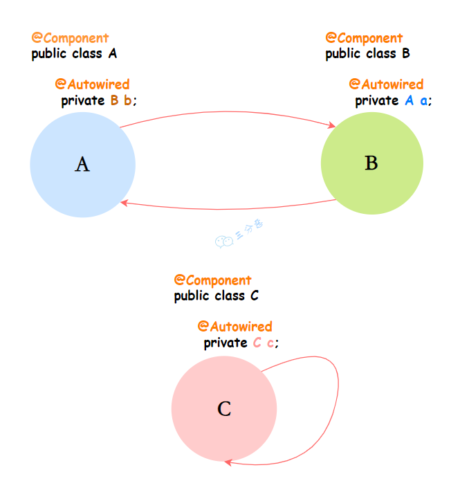
Spring 循环依赖：简单说就是自己依赖自己，或者和别的Bean相互依赖。

### Spring 可以解决哪些情况的循环依赖？

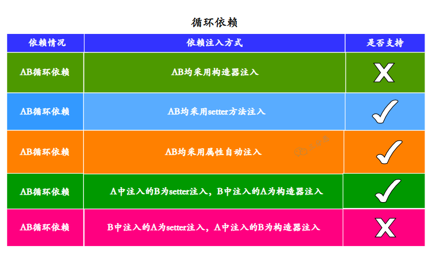
Spring不支持基于构造器注入的循环依赖，第四种可以而第五种不可以的原因是 Spring 在创建 Bean 时默认会根据自然排序进行创建，所以 A 会先于 B 进行创建。
所以简单总结，当循环依赖的实例都采用setter方法注入的时候，Spring可以支持，都采用构造器注入的时候，不支持，构造器注入和setter注入同时存在的时候，看天。

### Spring 如何解决循环依赖

我们都知道，单例Bean初始化完成，要经历三步：

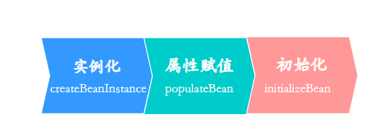
注入就发生在第二步，**属性赋值**，结合这个过程，Spring 通过**三级缓存**解决了循环依赖：

1. 一级缓存 : Map<String,Object> **singletonObjects**，单例池，用于保存实例化、属性赋值（注入）、初始化完成的 bean 实例
2. 二级缓存 : Map<String,Object> **earlySingletonObjects**，早期曝光对象，用于保存实例化完成的 bean 实例
3. 三级缓存 : Map<String,ObjectFactory<?>> **singletonFactories**，早期曝光对象工厂，用于保存 bean 创建工厂，以便于后面扩展有机会创建代理对象。

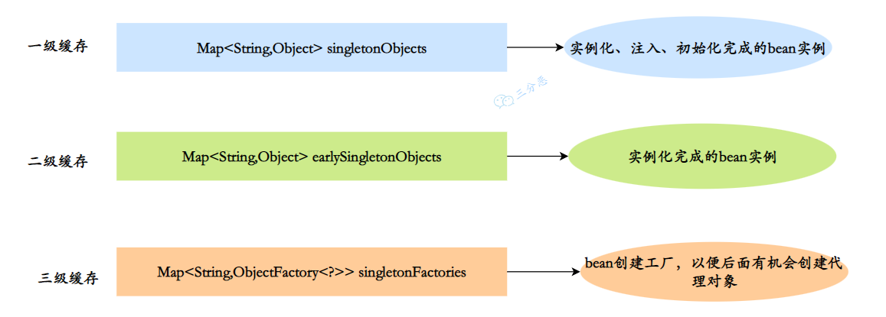
我们来看一下三级缓存解决循环依赖的过程：
当 A、B 两个类发生循环依赖时：

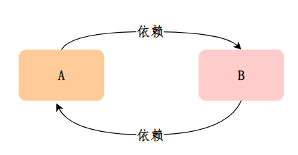
A实例的初始化过程：

1. 创建A实例，实例化的时候把A对象⼯⼚放⼊三级缓存，表示A开始实例化了，虽然我这个对象还不完整，但是先曝光出来让大家知道
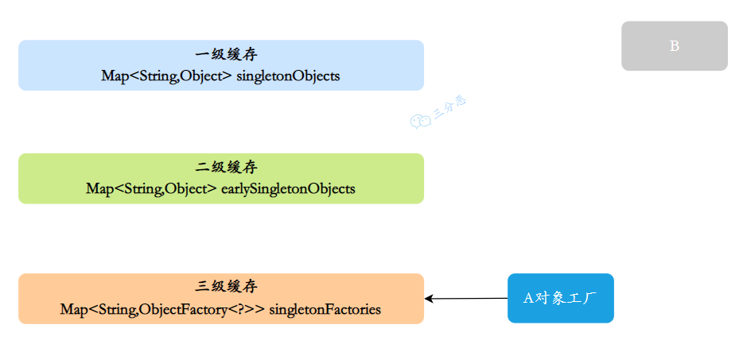
2. A注⼊属性时，发现依赖B，此时B还没有被创建出来，所以去实例化B
3. 同样，B注⼊属性时发现依赖A，它就会从缓存里找A对象。依次从⼀级到三级缓存查询A，从三级缓存通过对象⼯⼚拿到A，发现A虽然不太完善，但是存在，把A放⼊⼆级缓存，同时删除三级缓存中的A，此时，B已经实例化并且初始化完成，把B放入⼀级缓存。
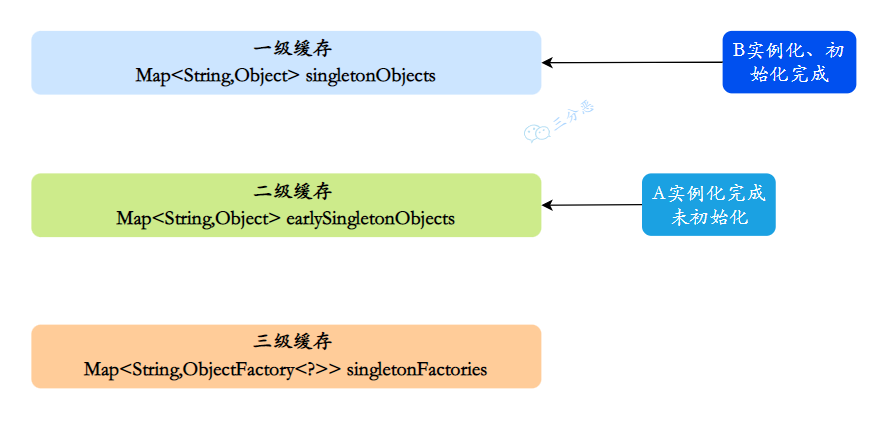
4. 接着A继续属性赋值，顺利从⼀级缓存拿到实例化且初始化完成的B对象，A对象创建也完成，删除⼆级缓存中的A，同时把A放⼊⼀级缓存
5. 最后，⼀级缓存中保存着实例化、初始化都完成的A、B对象

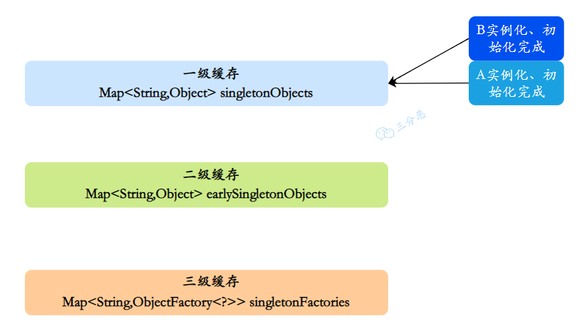
所以，我们就知道为什么Spring能解决setter注入的循环依赖了，因为实例化和属性赋值是分开的，所以里面有操作的空间。如果都是构造器注入的化，那么都得在实例化这一步完成注入，所以自然是无法支持了。

### 为什么要三级缓存？二级不行吗？

不行，主要是为了**⽣成代理对象**。如果是没有代理的情况下，使用二级缓存解决循环依赖也是OK的。但是如果存在代理，三级没有问题，二级就不行了。
因为三级缓存中放的是⽣成具体对象的匿名内部类，获取Object的时候，它可以⽣成代理对象，也可以返回普通对象。使⽤三级缓存主要是为了保证不管什么时候使⽤的都是⼀个对象。
假设只有⼆级缓存的情况，往⼆级缓存中放的显示⼀个普通的Bean对象，Bean初始化过程中，通过 BeanPostProcessor 去⽣成代理对象之后，覆盖掉⼆级缓存中的普通Bean对象，那么可能就导致取到的Bean对象不一致了。


## 单例Bean的线程同步问题

当多个用户同时请求一个服务时，容器会给每一个请求分配一个线程，这时多个线程会并发执行该请求对应的业务逻辑（成员方法），此时就要注意了，如果该处理逻辑中有对单例状态的修改（体现为该单例的成员属性），则必须考虑线程同步问题。 **线程安全问题都是由全局变量及静态变量引起的。** 若每个线程中对全局变量、静态变量只有读操作，而无写操作，一般来说，这个全局变量是线程安全的；若有多个线程同时执行写操作，一般都需要考虑线程同步，否则就可能影响线程安全.
**无状态bean和有状态bean**

- 有状态就是有数据存储功能。有状态对象(Stateful Bean)，就是有实例变量的对象，可以保存数据，是非线程安全的。在不同方法调用间不保留任何状态。
- 无状态就是一次操作，不能保存数据。无状态对象(Stateless Bean)，就是没有实例变量的对象 .不能保存数据，是不变类，是线程安全的。

在spring中无状态的Bean适合用不变模式，就是单例模式，这样可以共享实例提高性能。有状态的Bean在多线程环境下不安全，适合用Prototype原型模式。 Spring使用ThreadLocal解决线程安全问题。如果你的Bean有多种状态的话（比如 View Model 对象），就需要自行保证线程安全 。

首先结论在这：Spring中的单例Bean**不是线程安全的**。
因为单例Bean，是全局只有一个Bean，所有线程共享。如果说单例Bean，是一个无状态的，也就是线程中的操作不会对Bean中的成员变量执行**查询**以外的操作，那么这个单例Bean是线程安全的。比如Spring mvc 的 Controller、Service、Dao等，这些Bean大多是无状态的，只关注于方法本身。
假如这个Bean是有状态的，也就是会对Bean中的成员变量进行写操作，那么可能就存在线程安全的问题。

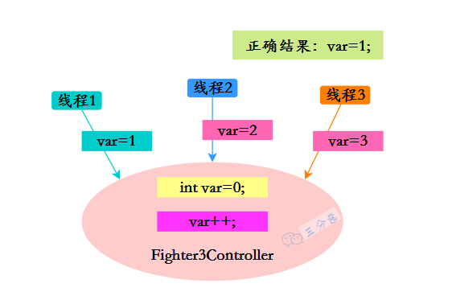
常见的有这么些解决办法：

1. 将Bean定义为多例这样每一个线程请求过来都会创建一个新的Bean，但是这样容器就不好管理Bean，不能这么办。
2. 在Bean对象中尽量避免定义可变的成员变量削足适履了属于是，也不能这么干。
3. 将Bean中的成员变量保存在ThreadLocal中⭐我们知道ThredLoca能保证多线程下变量的隔离，可以在类中定义一个ThreadLocal成员变量，将需要的可变成员变量保存在ThreadLocal里，这是推荐的一种方式。

> 疑问： Spring的依赖注入中的依赖与UML类图中的依赖关系在语义上是一致的吗？

- Spring提供容器，实现了依赖注入的过程，但对象的构造权和对象关系的维护权，依然可以由程序员自行实现。也就是说对象的创建依然可以由程序员自行维护，这就涉及到采用哪种实现方式为最优解的问题，这个问题换种说话就是：这两种实现方式各自有哪些适用场景，或者说，程序员在业务建模时应当遵守的设计原则有哪些。
- 由UML设计原则知，
- 创建对象的方式及创建对象的时机的选择
  - 构造方法：
  - set方法
  - 简单工厂方法
  - 静态工厂方法

参考： [Programming.log - a place to keep my thoughts on programming](https://www.cnblogs.com/weidagang2046/archive/2009/12/10/1620587.html)

---

### 粗略的

Spring IOC 中Bean的生命周期大致分为四个阶段**： 实例化**（Instantiation）、**属性赋值**（Populate）、**初始化**（Initialization）、**销毁**（Destruction）。

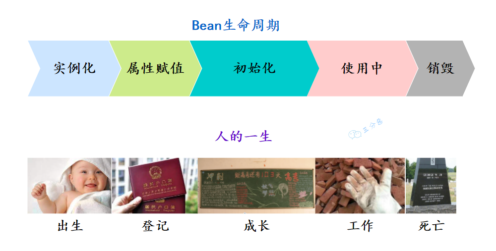

### 详细的

我们再来看一个稍微详细一些的过程：

- **实例化**：第 1 步，实例化一个 Bean 对象
- **属性赋值**：第 2 步，为 Bean 设置相关属性和依赖
- **初始化**：初始化的阶段的步骤比较多，5、6步是真正的初始化，第 3、4 步为在初始化前执行，第 7 步在初始化后执行，初始化完成之后，Bean就可以被使用了
- **销毁**：第 8~10步，第8步其实也可以算到销毁阶段，但不是真正意义上的销毁，而是先在使用前注册了销毁的相关调用接口，为了后面第9、10步真正销毁 Bean 时再执行相应的方法

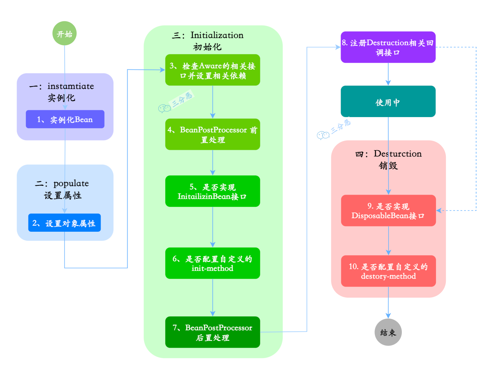

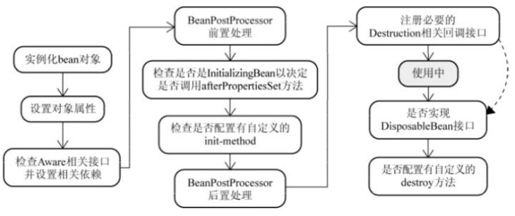

#### [创建过程：](https://www.javalearn.cn/#/doc/Spring/%E9%9D%A2%E8%AF%95%E9%A2%98?id=%e5%88%9b%e5%bb%ba%e8%bf%87%e7%a8%8b%ef%bc%9a)

1，实例化bean对象，以及设置bean属性； 2，如果通过Aware接口声明了依赖关系，则会注入Bean对容器基础设施层面的依赖，Aware接口是为了感知到自身的一些属性。容器管理的Bean一般不需要知道容器的状态和直接使用容器。但是在某些情况下是需要在Bean中对IOC容器进行操作的。这时候需要在bean中设置对容器的感知。SpringIOC容器也提供了该功能，它是通过特定的Aware接口来完成的。 比如BeanNameAware接口，可以知道自己在容器中的名字。 如果这个Bean已经实现了BeanFactoryAware接口，可以用这个方式来获取其它Bean。 （如果Bean实现了BeanNameAware接口，调用setBeanName()方法，传入Bean的名字。 如果Bean实现了BeanClassLoaderAware接口，调用setBeanClassLoader()方法，传入ClassLoader对象的实例。 如果Bean实现了BeanFactoryAware接口，调用setBeanFactory()方法，传入BeanFactory对象的实例。） 3，紧接着会调用BeanPostProcess的前置初始化方法postProcessBeforeInitialization，主要作用是在Spring完成实例化之后，初始化之前，对Spring容器实例化的Bean添加自定义的处理逻辑。有点类似于AOP。 4，如果实现了BeanFactoryPostProcessor接口的afterPropertiesSet方法，做一些属性被设定后的自定义的事情。 5，调用Bean自身定义的init方法，去做一些初始化相关的工作。 6，调用BeanPostProcess的后置初始化方法，postProcessAfterInitialization去做一些bean初始化之后的自定义工作。 7，完成以上创建之后就可以在应用里使用这个Bean了。

#### [销毁过程：](https://www.javalearn.cn/#/doc/Spring/%E9%9D%A2%E8%AF%95%E9%A2%98?id=%e9%94%80%e6%af%81%e8%bf%87%e7%a8%8b%ef%bc%9a)

当Bean不再用到，便要销毁 1，若实现了DisposableBean接口，则会调用destroy方法； 2，若配置了destry-method属性，则会调用其配置的销毁方法；

#### [总结](https://www.javalearn.cn/#/doc/Spring/%E9%9D%A2%E8%AF%95%E9%A2%98?id=%e6%80%bb%e7%bb%93)

主要把握创建过程和销毁过程这两个大的方面； 创建过程：首先实例化Bean，并设置Bean的属性，根据其实现的Aware接口（主要是BeanFactoryAware接口，BeanFactoryAware，ApplicationContextAware）设置依赖信息， 接下来调用BeanPostProcess的postProcessBeforeInitialization方法，完成initial前的自定义逻辑；afterPropertiesSet方法做一些属性被设定后的自定义的事情;调用Bean自身定义的init方法，去做一些初始化相关的工作;然后再调用postProcessAfterInitialization去做一些bean初始化之后的自定义工作。这四个方法的调用有点类似AOP。 此时，Bean初始化完成，可以使用这个Bean了。 销毁过程：如果实现了DisposableBean的destroy方法，则调用它，如果实现了自定义的销毁方法，则调用之。

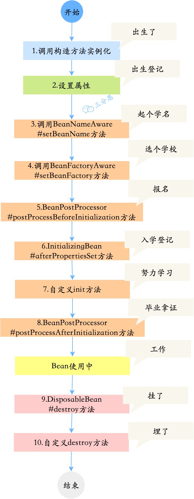

### 案例

- 定义一个PersonBean类，实现DisposableBean,InitializingBean, BeanFactoryAware, BeanNameAware这4个接口，同时还有自定义的init-method和destroy-method。

```java
public class PersonBean implements InitializingBean, BeanFactoryAware, BeanNameAware, DisposableBean {

    /**
     * 身份证号
     */
    private Integer no;

    /**
     * 姓名
     */
    private String name;

    public PersonBean() {
        System.out.println("1.调用构造方法：我出生了！");
    }

    public Integer getNo() {
        return no;
    }

    public void setNo(Integer no) {
        this.no = no;
    }

    public String getName() {
        return name;
    }

    public void setName(String name) {
        this.name = name;
        System.out.println("2.设置属性：我的名字叫"+name);
    }

    @Override
    public void setBeanName(String s) {
        System.out.println("3.调用BeanNameAware#setBeanName方法:我要上学了，起了个学名");
    }

    @Override
    public void setBeanFactory(BeanFactory beanFactory) throws BeansException {
        System.out.println("4.调用BeanFactoryAware#setBeanFactory方法：选好学校了");
    }

    @Override
    public void afterPropertiesSet() throws Exception {
        System.out.println("6.InitializingBean#afterPropertiesSet方法：入学登记");
    }

    public void init() {
        System.out.println("7.自定义init方法：努力上学ing");
    }

    @Override
    public void destroy() throws Exception {
        System.out.println("9.DisposableBean#destroy方法：平淡的一生落幕了");
    }

    public void destroyMethod() {
        System.out.println("10.自定义destroy方法:睡了，别想叫醒我");
    }

    public void work(){
        System.out.println("Bean使用中：工作，只有对社会没有用的人才放假。。");
    }

}

```

- 定义一个MyBeanPostProcessor实现BeanPostProcessor接口

```java
public class MyBeanPostProcessor implements BeanPostProcessor {

    @Override
    public Object postProcessBeforeInitialization(Object bean, String beanName) throws BeansException {
        System.out.println("5.BeanPostProcessor.postProcessBeforeInitialization方法：到学校报名啦");
        return bean;
    }

    @Override
    public Object postProcessAfterInitialization(Object bean, String beanName) throws BeansException {
        System.out.println("8.BeanPostProcessor#postProcessAfterInitialization方法：终于毕业，拿到毕业证啦！");
        return bean;
    }
}


```

- 配置文件，指定init-method和destroy-method属性

```xml
<?xml version="1.0" encoding="UTF-8"?>
<beans xmlns="http://www.springframework.org/schema/beans"
       xmlns:xsi="http://www.w3.org/2001/XMLSchema-instance"
       xsi:schemaLocation="http://www.springframework.org/schema/beans http://www.springframework.org/schema/beans/spring-beans.xsd">

    <bean name="myBeanPostProcessor" class="cn.fighter3.spring.life.MyBeanPostProcessor" />
    <bean name="personBean" class="cn.fighter3.spring.life.PersonBean"
          init-method="init" destroy-method="destroyMethod">
        <property name="idNo" value= "80669865"/>
        <property name="name" value="张铁钢" />
    </bean>

</beans>

```

- 测试

```java
public class Main {

    public static void main(String[] args) {
        ApplicationContext context = new ClassPathXmlApplicationContext("spring-config.xml");
        PersonBean personBean = (PersonBean) context.getBean("personBean");
        personBean.work();
        ((ClassPathXmlApplicationContext) context).destroy();
    }
}


```

- 结果

```log
1.调用构造方法：我出生了！
2.设置属性：我的名字叫张铁钢
3.调用BeanNameAware#setBeanName方法:我要上学了，起了个学名
4.调用BeanFactoryAware#setBeanFactory方法：选好学校了
5.BeanPostProcessor#postProcessBeforeInitialization方法：到学校报名啦
6.InitializingBean#afterPropertiesSet方法：入学登记
7.自定义init方法：努力上学ing
8.BeanPostProcessor#postProcessAfterInitialization方法：终于毕业，拿到毕业证啦！
Bean使用中：工作，只有对社会没有用的人才放假。。
9.DisposableBean#destroy方法：平淡的一生落幕了
10.自定义destroy方法:睡了，别想叫醒我

```

关于源码，Bean创建过程可以查看AbstractBeanFactory#doGetBean方法，在这个方法里可以看到Bean的实例化，赋值、初始化的过程，至于最终的销毁，可以看看ConfigurableApplicationContext#close()。

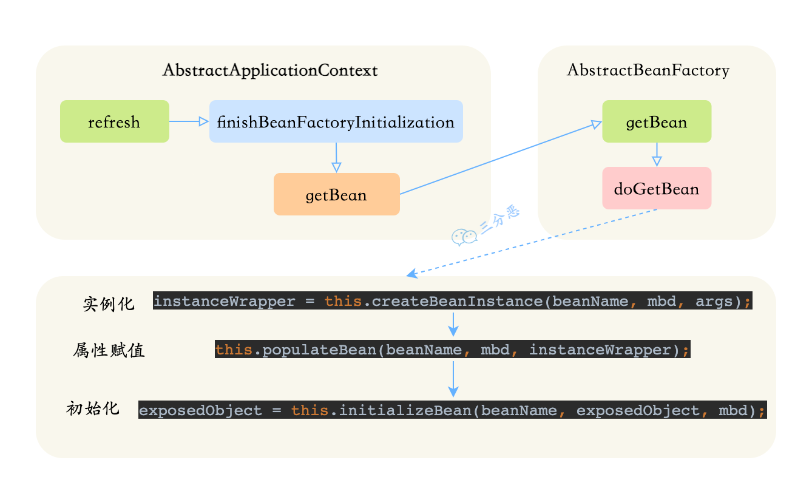

### 源码级

1. 阶段一：  Bean 元信息配置阶段

Bean 信息的定义阶段。
Bean 的元信息包括bean对应的class、scope、lazy信息、dependOn信息、autowireCandidate（是否是候选对象）、primary（是否是主要的候选者）等信息。

四种定义 Bean 信息的方式

- API的方式
- Xml文件方式
- properties文件的方式
- 注解的方式

其它三种方式最终都会转化成 API 的方式。

2. 阶段二： Bean 元信息解析阶段

就是将各种方式定义的bean配置信息解析为BeanDefinition对象。

有三种方式来解析 Bean 的元信息：

1. 使用 XmlBeanDefinitionReader 来解析 xml 文件中定义的 Bean；
2. 使用 PropertiesBeanDefinitionReader 来解析 properties 文件中定义的 Bean；
3. 使用 AnnotatedBeanDefinitionReader 来解析使用注解定义的 Bean；

5.2.6.RELEASE

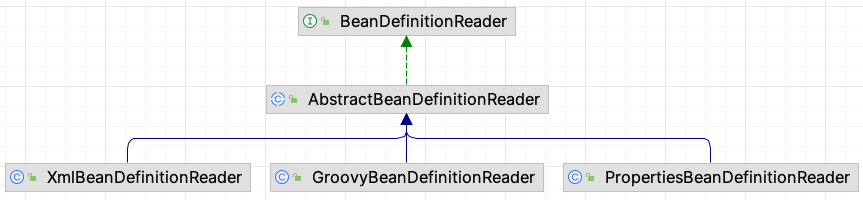

3. 阶段三： 把 Bean 注册到容器

BeanDefinitionRegistry

阶段四： BeanDefinition 合并阶段

可能我们定义bean的时候有父子bean关系，此时子BeanDefinition中的信息是不完整的，比如设置属性的时候配置在父BeanDefinition中，此时子BeanDefinition中是没有这些信息的，需要将子bean的BeanDefinition和父bean的BeanDefinition进行合并，得到最终的一个RootBeanDefinition，合并之后得到的RootBeanDefinition包含bean定义的所有信息，包含了从父bean中继继承过来的所有信息，后续bean的所有创建工作就是依靠合并之后BeanDefinition来进行的。

阶段五： Bean Class 加载阶段

**这个阶段就是将bean的class名称转换为Class类型的对象。**

阶段六： Bean 实例化阶段

阶段七：合并后的 BeanDefinition 处理

阶段八： 属性赋值阶段

阶段九： Bean 初始化阶段

阶段十： 所有单例 Bean 初始化完成后阶段

阶段十一： Bean 的使用阶段

阶段十二： Bean 的销毁前阶段

阶段十三： Bean 销毁阶段

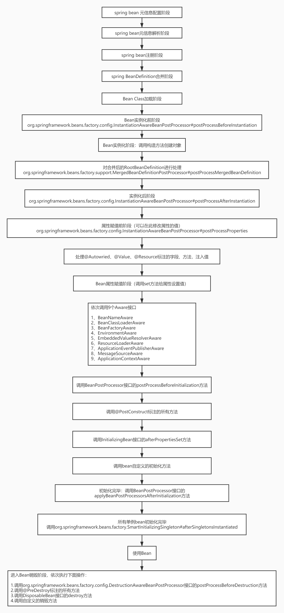
