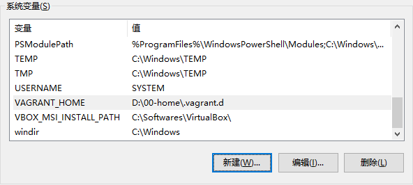
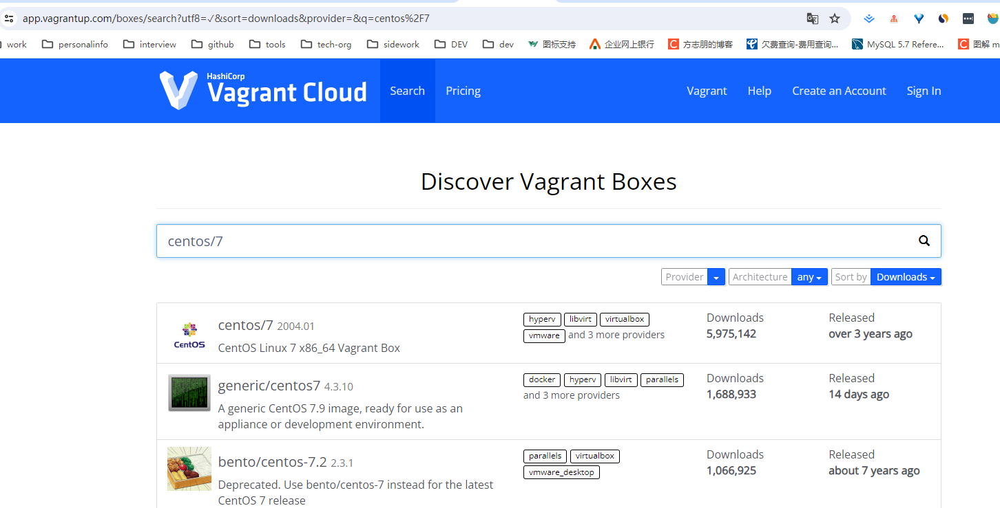
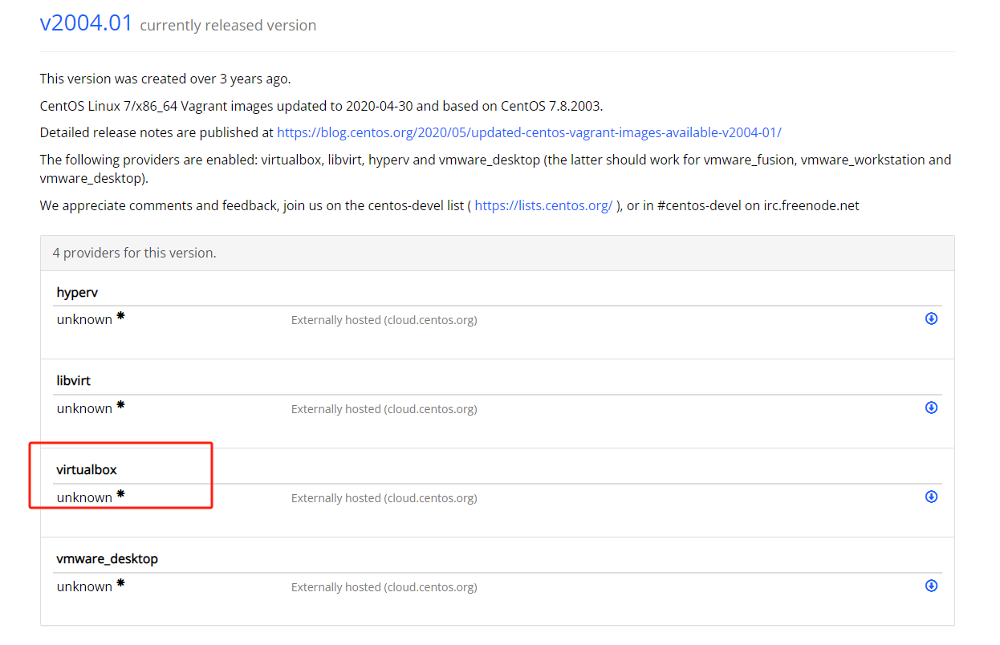

# vagrant

## 1. 为什么要使用这玩意儿

按理说在 Windows 平台上，直接使用 docker 似乎更高效和便捷，但是 dockerDeskTop 依赖于 WSL 功能，本质上还是先在 Windows 平台上下载一个 Linux 虚拟系统，跟使用 VMWare 和 VitrualBox 技术不同的是，WSL 功能相当于是 Windows 官方认证的，与 Windows 平台更贴合，操作都是交给 Windows 平台来管理的，不太需要自行维护。

但是上面说的这种方案，也有一个严重的弊端，那就是 WSL 的运行需要特定的 Windows 版本才支持，但是有些版本可能还需要相关的硬件支持，并且 DockerDeskTop 这种方案用到日常的开发过程中还算可以，但是实际上单位内的开发，多是把 Docker 部署到服务器上的，所以，基于上述两个原因，还是选择 VirtualBox+Vagrant 的方式替代 WSL 的方式。这样也有利于训练我们使用 Linux。

WSL 是 Windows 平台上提供的一种虚拟化的 Linux 服务，但是我们不使用 WSL，而是使用 VirtualBox+Vagrant ，原因主要有：

1. 环境配置的一致性要求：同一个项目组中，要求所有程序员开发环境的配置一致，同时也要求应用程序的不同的环境的配置一致。目的是为了减少环境差异对项目开发的影响；而 WSL 可能会：
   1. 程序员所使用的 Windows 系统版本可能不同，这会导致 WSL 的版本也就不同；
   2. WSL 的版本安装不同，其内部支持的 Linux 的版本可能就不同；
2. 对 Linux 的可操控性：所有的操作是交给 Windows 平台的，程序员要求更高的可控性；


- 为什么使用 VirtualBox+Vagrant 的方式

  |  | WSL | VirtualBox+Vagrant |
  | --- | --- | --- |
  | 基本原理 | 基于 Windows，与 Windows 平台贴合很好，所有的操作都是交给 Windows 平台来管理的，不太需要自行维护。 | 独立于操作系统平台。使用 vagrant 来管理工作流。 |
  | 项目环境的一致性保证 | 依赖于 Windows 的特定版本甚至特定的硬件支持，以及 WSL 的版本。 | 使用 vagrantfile 来保证。不同环境可以似乎用同一个 vagrantfile 来确保安装的环境的配置的一致性。 |
  | 对 Linux 的可操控性 | 较差。 | 较强。可以使用一些 ssh 客户端或者直接使用 git 工具连接。 |

## 2. 是个什么玩意儿？

Vagrant是一种在单个工作流程中构建和管理虚拟机环境的工具。通过易于使用的工作流程并专注于自动化，Vagrant降低了开发环境的设置时间，提高了生产一致性，并使“在我的机器上工作”成为过去的遗留物。

Vagrant通过虚拟机相关平台更加高级的一种管理形式，直接通过平台api进行管理，而你只需要准备好你的文件就可以了。

Vagrant将在一个一致的环境中隔离依赖关系及其配置，而不会牺牲您习惯使用的任何工具（编辑器，浏览器，调试器等）。一旦您或其他人创建了单个 Vagrant文件，您只需要vagrant up安装并配置所有内容即可使用。团队的其他成员使用相同的配置创建他们的开发环境，因此无论您是在Linux，Mac OS X还是Windows上工作，您的所有团队成员都在同一环境中运行代码，针对相同的依赖项，所有组件都配置相同办法。告别“在我的机器上工作”的错误。

几个重要概念：

- box： 类似于 docker 中镜像的概念；虚拟机可以基于 box 进行创建；
- vagrantfile： 是虚拟机启动时的配置文件，可以在这个文件中配置虚拟机的相关信息。如：网络类型、网络地址、同步文件、CPU 核心数、内存大小、前置运行脚本等；

## 3. 咋用呢？

1. 安装 VirtualBox，并完成 VirtualBox 的设置，例如：虚拟机保存目录；
2. 安装 Vagrant；命令行输入“vagrant version”可以查看是否安装成功；
3. 之后完成配置：新建系统环境变量，环境变量名为 VAGRANT_HOME，变量值为 d:\05.VM\.vagrant.d 。这个文件中保存后续添加的 box；【不需要添加到PATH】

  

## 4. 其他操作 

- 查找 box

  我们可以在[这里](https://app.vagrantup.com/boxes/search)查找我们要使用的 box；

  

  点进去，可以看到有不同类型的虚拟机支持的。我们使用的是 virtualbox 类型的。

  

- 添加 box 到本地
  - 方式 1： vagrant box add centos/7
  - 方式 2：去[这里](https://app.vagrantup.com/boxes/search)找到 centos/7 然后下载到本地；vagrant box add /e/迅雷下载/CentOS-7-x86_64-Vagrant-1902_01.VirtualBox.box --name centos/7
  - 添加完成之后可以通过命令查看： vagrant box list
- 初始化 Vagrantfile
  - 1. 创建一个目录，用来保存 vagrantfile；
  - 2. 进入这个目录中，执行 vagrant init centos/7，之后会在这个目录下面生成一个 vagrantfile 文件，在这个文件中可以配置虚拟机的相关信息，比如： CPU 核心个数、内存大小、网络等；
- 修改 Vagrantfile： 网络、内存大小、CPU 核心数、时区

  ```bash
  # 配置字符集
  # ENV["LC_ALL"] = "en_US.UTF-8"
  Vagrant.configure("2") do |config|
    config.vm.box = "centos/7"
    
    # config.vm.network "private_network", ip: "192.168.56.12"
    config.vm.network "public_network", bridge: "Realtek PCIe GbE Family Controller", ip: "192.168.1.105"
    
    # 设置内存和核心数
    config.vm.provider "virtualbox" do |vb|
      vb.memory = "12288"
      vb.cpus = 4
    end

    # 设置时区
    config.vm.provision "shell", inline: <<-SHELL
      ln -sf /usr/share/zoneinfo/Asia/Shanghai /etc/localtime
    SHELL
  end

  ```

- 启动： vagrant up
- 登录： vagrant ssh
  - vagrant / vagrant
  - root / vagrant
- 完成基本的配置
  - 修改配置文件【/etc/ssh/sshd_config】中的：
    - PubkeyAuthentication yes
    - PasswordAuthentication yes
  - 重启 ssh 服务： systemctl restart sshd
  - 生成 sshkey ：  ssh-keygen -t ed25519 -C "zeanzai.me@gmail.com" 。 目的是生成 .ssh 文件夹，因为 windows 分发的 key 是放到这个目录下的。
  - 把 Windows 的 key 分发到 centos 上：   ssh-copy-id -i /c/Users/zeanzai/.ssh/id_ed25519.pub root@192.168.56.12
- 其他操作
  - 关机： vagrant halt
  - 修改了 vagrantfile 后重启： vagrant reload
- 最佳实践
  - 同步文件夹：
    - 方式一：【不建议】修改 vagrantfile ，具体参考下面的参考链接；
    - 方式二：【建议】使用 scp -r 命令；

## 5. 参考

- [超详细的 Vagrant 上手指南](https://zhuanlan.zhihu.com/p/259833884)
- [开发环境管理利器Vagrant](https://www.cnblogs.com/evan-blog/p/10552997.html)
