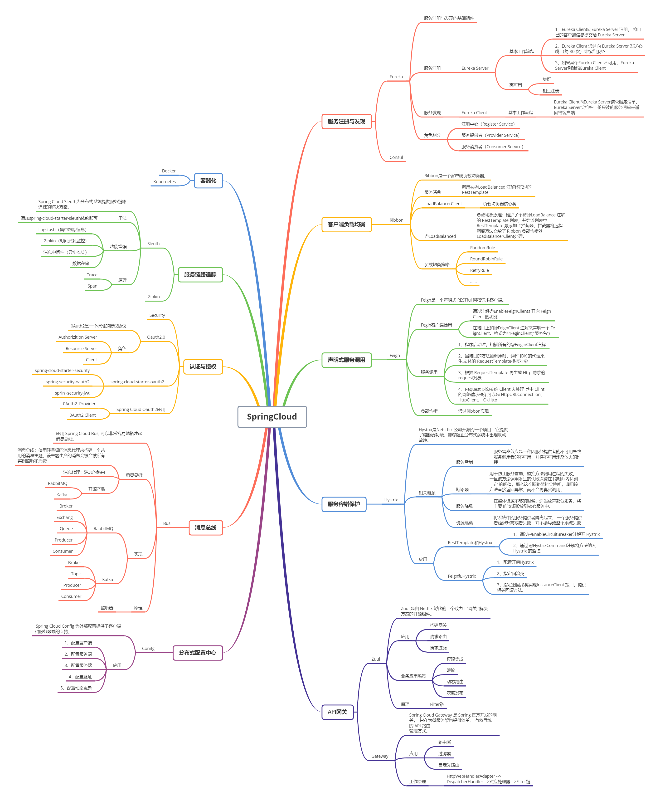

---
dir:
  link: true
---

# SpringCloud实战

学习的思路：一种新的技术的产生或一种新的架构思路的产生，一定是过去的旧事物无法满足现有问题的解决，或者是一定是原有的旧事物有些问题需要解决。因此，在学习新技术的时候，这种思想就可以作为一种指导思想。

## 1. 微服务

### 1.1. 什么是微服务

1. 2014 年 **Martin Fowler** 提出的一种新的架构形式。微服务架构是一种**架构模式**，提倡将单一应用程序划分成一组小的服务，服务之间相互协调，互相配合，为用户提供最终价值。每个服务运行在其独立的进程中，服务与服务之间采用轻量级的通信机制(如HTTP或Dubbo)互相协作，每个服务都围绕着具体的业务进行构建，并且能够被独立的部署到生产环境中，另外，应尽量避免统一的，集中式的服务管理机制，对具体的一个服务而言，应根据业务上下文，选择合适的语言、工具(如Maven)对其进行构建。
2. 微服务化的核心就是将传统的一站式应用，根据业务拆分成一个一个的服务，彻底地去耦合，每一个微服务提供单个业务功能的服务，一个服务做一件事情，从技术角度看就是一种小而独立的处理过程，类似进程的概念，能够自行单独启动或销毁，拥有自己独立的数据库。

### 1.2. 微服务解决了哪些问题？

1. 服务很多，客户端怎么访问，如何提供对外网关?
2. 这么多服务，服务之间如何通信? HTTP还是RPC?
3. 这么多服务，如何治理? 服务的注册和发现。
4. 服务挂了怎么办？熔断机制。

### 1.3. 主流的微服务框架

1. Spring Cloud Netflix
2. Spring Cloud Alibaba
3. SpringBoot + Dubbo + ZooKeeper

### 1.4. SpringCloud 有哪些核心组件？

三者关系

Spring 最初最核心的两大核心功能 Spring Ioc 和 Spring Aop 成就了 Spring，Spring 在这两大核心的功能上不断的发展，才有了 Spring 事务、Spring Mvc 等一系列伟大的产品，最终成就了 Spring 帝国，到了后期 Spring 几乎可以解决企业开发中的所有问题。
Spring Boot 是在强大的 Spring 帝国生态基础上面发展而来，发明 Spring Boot 不是为了取代 Spring ,是为了让人们更容易的使用 Spring 。
Spring Cloud 是一系列框架的有序集合。它利用 Spring Boot 的开发便利性巧妙地简化了分布式系统基础设施的开发，如服务发现注册、配置中心、消息总线、负载均衡、断路器、数据监控等，都可以用 Spring Boot 的开发风格做到一键启动和部署。
Spring Cloud 是为了解决微服务架构中服务治理而提供的一系列功能的开发框架，并且 Spring Cloud 是完全基于 Spring Boot 而开发，Spring Cloud 利用 Spring Boot 特性整合了开源行业中优秀的组件，整体对外提供了一套在微服务架构中服务治理的解决方案。

## 2. 说明

本系列教程，主要是基于SpringCloud-Alibaba相关组件的实战演练，属于HelloWord性质的工程内容。同时，在讲解各个组件的过程中会穿插一些分布式的基本原理，但是不会展开。如果读者有兴趣，可以自行查阅本网站的其他文章。

## 3. 微服务架构概述

架构主要分为三种架构类型，这三种架构类型分别是：应用架构、业务架构、技术架构，业务架构决定了应用架构，技术架构支撑了应用架构。架构的发展经历了三个阶段：单体应用到分布式架构、分布式架构到soa架构、soa架构到微服务架构。

早期的单体应用架构的缺点：

- 所有的功能都集中在一个应用中；如果业务复杂会造成，整个应用的代码量很大；
- 模块之间界限不明，导致模块与模块之间的耦合度很高；
- 出现某一个小错误，就会造成整个应用的不可启动；
- 团队成员之间的协作灵活性较差：模块a可能依赖模块b，a开发完成后，需要等待b的开发；
- 很可能要求开发人员前后端同时开发，这对开发人员的技术功力要求很大；
- 很容易造成前后端责任界限不够清晰，比如有可能会在前端进行业务处理；

分布式架构的特点：

- 按照业务进行垂直划分，简单来讲，就是把原来的单体应用划分成多个应用，每一个应用都是一个单体应用，通过api相互调用来实现整体的应用的功能；

SOA架构与微服务架构的区别：

- todo

微服务架构的一些常见功能：

- 服务注册与发现
- 负载均衡
- 熔断与容错
- 配置中心
- 网关与链路监控

## 4. SpringCloud与中间件

学习策略：本章节主要包括了SpringCloud中间件与其他中间件之间的关系，中间件解决了在企业级应用开发过程中遇到的哪些困难，中间件产生的背景、中间件的功能、以及Springcloud针对这些中间件的具体实现。

### 4.1. 中间件概述

以前的中间件与操作系统和数据库并列为传统基础软件的三家马车，是运行在操作系统之上、应用软件之下的“中间层”的软件。但是随着云计算的发展，软件大规模向互联网云服务进行演化，中间件在整个过程中也不断扩大和演进自己的边界。中间件开始向下屏蔽异构的硬件设备、软件和网络等计算资源，向上提供应用、运行、维护等全生命周期的统一计算环境与管理。常见的中间件有：服务治理中间件、配置中心、全链路监控、分布式事务、分布式定时任务、消息中间件、api网关、分布式缓存、数据库中间件等。

### 4.2. SpringCloud概述

`本质上是一个中间件、目前由spring官方维护，基于SpringBoot开发，实现了微服务架构思想的一套中间件产品。`它提供了一系列的组件功能，如服务注册与发现（eureka、consul）、配置中心（config、nacos）、全链路监控（sleuth）、api网关（zuul、gateway、）、熔断器（hystrix）等选型中立（不依赖于平台和技术）的开源组件。每个独立的组件都有各自的软件版本，所有的组件合并成一个SpringCloud的版本，版本号由伦敦地铁站字母序命名。

### 4.3. SpringCloud与服务治理中间件

服务治理中间件的基本功能包括以下内容。

- 服务治理
  - 服务注册与发现（Eureka、zk、consul）
  - 服务路由
    - 服务上下线
    - 在线测试
    - 机房就近选择
    - ab测试
    - 灰度发布
  - 负载均衡
    - 根据目标状态和目标权重进行负载均衡
  - 自我保护
    - 服务降级
    - 优雅降级
    - 流量控制
- 丰富的治理管理机制

### 4.4. SpringCloud与配置中心中间件

配置中心产生的原因：在单体应用中 ，我们一般会把属性配置和代码硬编码到一起，但在分布式系统中，由于会存在多个服务实例，因此就需要管理每一个具体服务工程中的配置，上线前也需要checklist并逐个检查每一个上线的服务是否配置正常，且如果系统一旦上线，需要修改某项配置，就需要重启服务。这样管理起来非常麻烦。因此配置中心应运而生。

要求配置中心具有的功能有： 面向全公司（要求支持不同语言的应用接入）、要求与公司运维体系进行集成、要求对权限进行管理、要求对已有的配置中心进行兼容。

具体的实现有SpringCloud config和携程开源的配置中心Apollo。

### 4.5. SpringCloud与网关中间件

出现在系统边界上的一个面向api、串行集中式的强管控服务，可以理解为企业级应用防火墙，主要起到隔离外部应用和内部应用的作用。

要求网关中间件具备的几个功能：

- 统一接入功能
  - 为各个无线应用提供统一的接入服务，提供一个高性能、高并发、高可靠的网关服务。还需要支持负载均衡、容灾切换、异地多活。
- 协议适配功能
  - 针对不同的后端提供的不同的服务协议进行适配。比如当一个http请求经过网关后，通过一系列不同的fitter进行处理完毕后，需要进行协议适配，然后判断协议转发调用的到底是rpc服务还是rest服务或者是php提供的服务。
- 流量管控功能
  - 网关作为所有请求流量的入口，当流量瞬间剧增，需要进行流量管控、流量调拨，服务不可用时，还需要网关进行熔断和降级。在异地多活场景下，还需要对流量进行切片，路由到不同的机房。
- 安全防护功能
  - 对所有的请求进行安全防护过滤，保护后端服务。还可以通过与安全风控部门进行合作，对ip黑名单、URL和名单封禁控制，做风控防护、防止恶意攻击等。

Springcloud中的网关

- zuul： qps很低，原理是针对每一个请求都分配一个线程来处理，qps最多一两千，高并发场景下，不推荐；
- gateway： 底层是基于netty的多线程reactor模型实现，使用boss线程和worker线程接受异步处理请求，具有很强的高并发处理能力；

### 4.6. SpringCloud与全链路监控中间件

一个通过浏览器或移动客户端的前端请求到后端应用，会经过很多应用系统，并留下足迹和相关日志信息。但是这些分散到每一个业务主机下的日志不利于问题排查和问题定位。此时全链路监控中间件就应运而生。全链路监控中间件主要功能应该包括：

- 定位慢调用
- 定位各种错误和异常
- 实现依赖和拓扑
- 追踪调用链
- 应用告警

springcloud中的全链路监控中间件： pinpoint、skywalking等。

## 5. SpringCloud增强生态

上述章节中介绍了微服务架构中遇到的一些问题以及微服务架构过程中所出现的一些技术，以及Springcloud基于这些问题所做的一些实现。
但是这些还不够。还有一些问题需要解决：

- 单体应用拆分后，进程间通信机制和故障处理措施变的更加复杂；
- 微服务化后，一个看似简单的功能，可能需要调用多个服务并操作多个数据库才能实现，这就使得分布式事务问题变得异常突出；
- 微服务数量众多，测试、部署和监控问题变得更加困难；

针对第一个问题，随着RPC框架的成熟，已经得到解决；Docker、Devops技术的发展以及各公有云Paas平台自动化运维工具的推出，第三个问题也变得很容易；唯独第二个问题还是一件具有挑战性的问题。

针对第一个问题，可以使用SpringCloud和gRPC进行集成，也可以使用SpringCloud与Dubbo生态的融合（如：spring-clod-dubbo项目，就是把dubbo融入SpringCloud生态，使微服务调用同时具备RESTful和Dubbo调用的能力，做到对业务代码无侵入、无感知，如果使用过程中引入jar包，就在服务调用间使用dubbo，如果去掉jar包，则使用默认的RESTful）。

归根结底，SpringCloud是技术上的一种架构，只是解决了架构层面的问题，但对于业务怎么开发、业务架构怎么治理、架构怎么防腐、如何解决应用架构间的复杂性问题，还需要方法论指导，此时，引入DDD面向领域设计模型的指导思想。

## 文章列表

- [eureka服务治理](./ch01-eureka.md)
- [使用Apollo作为配置中心](./ch02-apollo.md)
- [nacos服务注册](./ch03-nacos-register.md)
- [nacos服务配置](./ch04-nacos-config.md)
- [openfeign远程调用](./ch05-openfeign.md)
- [gateway分布式网关](./ch06-gateway.md)
- [sentinel分布式限流](./ch07-sentinel.md)
- [seata分布式事务](./ch08-seata.md)
- [统一响应体+Nacos可配置全局异常](./ch99-appendix01-globalresponseandnacosexception.md)
- [多租户SaaS实战](./ch99-appendix03-una_saas.md)
- [统一管理依赖](./ch99-appendix02-managedependence.md)

## 17. 如何设计一个安全可靠的API接口

[面试四连问：API 接口如何设计？安全如何保证？防重如何实现？签名如何实现？...](https://blog.csdn.net/zhipengfang/article/details/117455598)

## 18. 文章列表

- 『[你真的了解技术选型吗？](before_chaptera)』
- 『[如何在SpringCloud项目中统一管理依赖的版本？](before_chapterb)』
- 『[使用idea插件生成代码](before_easycode) 』
- 『[开发环境搭建手册](before_env)』
- 『[服务治理之Nacos](chapter01) 』
- [x] 传统调用方式
- [x] 使用openfeign方式进行调用
- [x] 注册到不同的命名空间以进行服务隔离
- 『[服务配置之Nacos](chapter02)』
- [x] 传统读取配置文件方式
- [x] 从配置中心中读取配置项
- [x] 从共享配置文件中读取配置项
- [x] 把共享配置文件中的配置项映射成JavaBean
- [x] 以服务名作为命名空间进行配置隔离
- [x] 以环境名作为命名空间进行配置隔离
- 『[服务调用之OpenFeign](chapter03)』
- [x] 多参数
- [x] URL中携带参数
- [x] 传递对象
- [x] 文件上传
- [x] 文件下载
- [x] 开启GZIP压缩
- [x] 开启日志
- [x] 超时控制
- [x] 替换客户端
- 『[服务网关之Gateway](chapter04)』
- [x] 结合配置中心进行请求转发
- [x] 重写路由
- [x] 路由规则可配置化
- [ ] https的使用[xxx] 现在微服务的部署架构大多情况下是SLB+Nginx类型的部署模型，而微服务大多都是在内网环境中，因此网关也很少使用https；
- [x] 集成swagger
- [ ] CROS方案
- [ ] 灰度发布 ：
- [ ] [https://blog.csdn.net/kingwinstar/article/details/105752725](https://blog.csdn.net/kingwinstar/article/details/105752725)
- [ ] [https://github.com/lyb-geek/gateway](https://github.com/lyb-geek/gateway)
- 分布式事务管理之Seata
  - 『[分布式事务概论](seata_distribute-transaction)』
  - 『[Seata服务端环境搭建](seata_install-seata)』
  - 『[AT模式](seata_seata-at)』
  - 『[TCC模式](seata_seata-tcc)』
- [ ] Saga 模式
- [ ] 两阶段提交事务
- [ ] Sentinel ： [https://mp.weixin.qq.com/s/Q7Xv8cypQFrrOQhbd9BOXw](https://mp.weixin.qq.com/s/Q7Xv8cypQFrrOQhbd9BOXw)
- [ ] 持久化配置
- [x] 基于网关的限流及自定义限流异常
- 『[分布式服务消息处理](chapter06)』
- 『[分布式服务流量控制](chapter07)』
- 『[分布式服务缓存](chapter08)』
- 『[分布式服务链路追踪](chapter09)』
- 『[分库分表](chapter10)』
- 『[分布式服务Job](chapter11)』
- [ ] 基于RabbitMQ使用消息中间件
- [ ] 创建交换机、binding 、 queue
- [ ] 发送消息
- [ ] 发送消息并确认
- [ ] 接受消息
- [ ] 接受消息并确认
- [ ] Cache
- [ ] 其他
- [ ] 分布式锁
- [ ] 分布式事务原理
- [ ] 分布式ID
- [ ] 分布式相关算法
  - [如何设计一个安全可靠的API接口](other_create-a-niubi-api)
  - [多租户SaaS实战](other_una-saas-toturial)
  - [统一响应体+Nacos可配置全局异常](other_global-exception)

