# 8. seata分布式事务

### 1. 搭建 Seata 服务端


#### 1.1. 前置知识

在了解Seata之前，请先熟悉一下分布式事务的相关知识——[分布式事务概述](../../docs/docs/spring/seata_distribute-transaction)。简单熟悉一下XA模式、两阶段提交、三阶段提交、TCC、Seaga等概念及原理。

关于Seata的相关知识，可以先去官网了解一下。简单介绍一下，seata支持多种分布式事务，如AT模式、TCC模式、Sega模式等。[官网在这](https://seata.io)

Seata的用法其实很简单，我们类比于在SpringBoot项目中使用Mysql的方式——先部署一个Mysql服务器实例，然后SpringBoot项目中引入依赖，之后在配置文件中配置好Mysql的相关连接信息，之后启动即可使用，在SpringBoot项目中使用Seata的方式也很简单：

1. 搭建一个Seata的服务器实例，这个服务器实例承担的角色是TC的角色，即事务管理器的角色；
2. 在SpringBoot项目中引入依赖；
3. 在配置文件中配置好Seata的相关信息；

我们结合XA理论可知，Seata服务器端实例承载着事务管理器的角色，它承担着统一管理各个『参与者』提交事务、回滚事务的职责；而参与分布式事务的各个『参与者』就是AP的角色，它们则是具体的业务实现，底层连接着数据库，而数据库就是资源管理器（CRM）的角色。

因此，要基于Seata完成分布式事务的实现，就必须先要搭建一个Seata服务端实例。

由于Seata也是JAVA项目，并且支持多种配置方式和持久化方式，这里我们选择基于Nacos和Mysql的方式。其他方式可以自行查看官网。

因此有一个前置条件，要先把Mysql和Nacos启动起来。此外，我们还需要用到源码文件夹下面的一些脚本。因此我们还需要下载相对应版本的源代码。

服务端版本及下载地址： [1.3.0](https://github.com/seata/seata/releases/download/v1.3.0/seata-server-1.3.0.tar.gz) 
源代码版本及下载地址： [1.3.0](https://github.com/seata/seata/tree/master/script)

总结一下：

1. 启动Mysql
2. 启动Nacos
3. 下载服务器端压缩包
4. 下载源代码中的脚本


#### 1.2. 搭建过程


##### 1.2.1. 解压

安装包下载完成之后，上传到服务器上，并完成解压。解压后的文件目录如下：


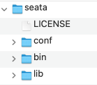


##### 1.2.2. 执行脚本

Seata本身也是一个项目，这个执行脚本的过程，本质上就是对Seata进行一个配置。执行脚本有两个步骤，一个是Seata在管理分布式事务时，需要依赖数据库保存一些关键信息；一个是需要导入Seata项目的一些配置信息。**此外，这两个脚本都是在源码项目下面的。**

步骤一，在下载下来的源代码目录下，找到/script/server/db/下面的mysql的脚本，并在mysql中进行执行。


```
-- -------------------------------- The script used when storeMode is 'db' --------------------------------
-- the table to store GlobalSession data
CREATE TABLE IF NOT EXISTS `global_table`
(
    `xid`                       VARCHAR(128) NOT NULL,
    `transaction_id`            BIGINT,
    `status`                    TINYINT      NOT NULL,
    `application_id`            VARCHAR(32),
    `transaction_service_group` VARCHAR(32),
    `transaction_name`          VARCHAR(128),
    `timeout`                   INT,
    `begin_time`                BIGINT,
    `application_data`          VARCHAR(2000),
    `gmt_create`                DATETIME,
    `gmt_modified`              DATETIME,
    PRIMARY KEY (`xid`),
    KEY `idx_gmt_modified_status` (`gmt_modified`, `status`),
    KEY `idx_transaction_id` (`transaction_id`)
) ENGINE = InnoDB
  DEFAULT CHARSET = utf8;

-- the table to store BranchSession data
CREATE TABLE IF NOT EXISTS `branch_table`
(
    `branch_id`         BIGINT       NOT NULL,
    `xid`               VARCHAR(128) NOT NULL,
    `transaction_id`    BIGINT,
    `resource_group_id` VARCHAR(32),
    `resource_id`       VARCHAR(256),
    `branch_type`       VARCHAR(8),
    `status`            TINYINT,
    `client_id`         VARCHAR(64),
    `application_data`  VARCHAR(2000),
    `gmt_create`        DATETIME(6),
    `gmt_modified`      DATETIME(6),
    PRIMARY KEY (`branch_id`),
    KEY `idx_xid` (`xid`)
) ENGINE = InnoDB
  DEFAULT CHARSET = utf8;

-- the table to store lock data
CREATE TABLE IF NOT EXISTS `lock_table`
(
    `row_key`        VARCHAR(128) NOT NULL,
    `xid`            VARCHAR(96),
    `transaction_id` BIGINT,
    `branch_id`      BIGINT       NOT NULL,
    `resource_id`    VARCHAR(256),
    `table_name`     VARCHAR(32),
    `pk`             VARCHAR(36),
    `gmt_create`     DATETIME,
    `gmt_modified`   DATETIME,
    PRIMARY KEY (`row_key`),
    KEY `idx_branch_id` (`branch_id`)
) ENGINE = InnoDB
  DEFAULT CHARSET = utf8;

```


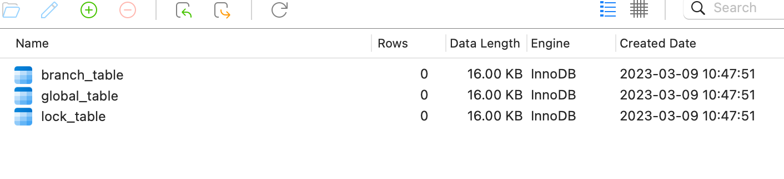

步骤二，导入Seata项目的一些配置信息到nacso上去，由于配置项比较多，官方提供了使用脚本进行导入的方式，这个过程可能需要具备一些Nacos的基本知识。

但是由于我们使用的配置方式是基于mysql和nacos的，因此，我们还需要先修改一下配置信息。我们打开 /script/config-center/ 下面的 config.txt 文件，之后修改下面的几项内容：


```

store.mode=db ## 采用db的存储形式 
store.db.datasource=druid ## druid数据源 
store.db.dbType=mysql ## mysql数据库 
store.db.driverClassName=com.mysql.jdbc.Driver ## mysql驱动 
store.db.url=jdbc:mysql://192.168.1.150:3306/seata_server?useUnicode=true ## TC的数据库url 
store.db.user=root ## 用户名 
store.db.password=root ## 密码

```

最后只需要在 /script/config-center/nacos/ 目录下执行下面命令即可。Windows平台下面，可以使用gitbash执行。


```
sh nacos-config.sh -h 192.168.1.150 -p 8848 -g SEATA_GROUP -t bb4ba084-9183-4406-bdf4-9254d372849e -u nacos -w nacos

```

执行后的效果如下：


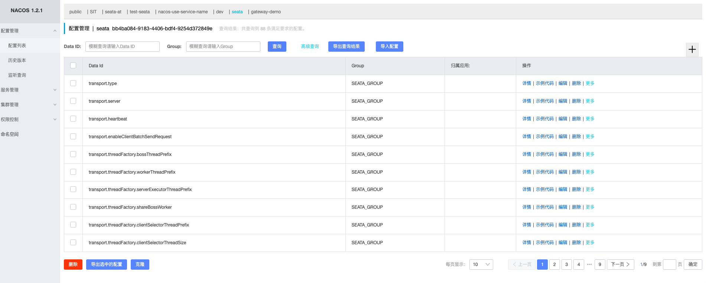


##### 1.2.3. 修改项目中的配置文件

完成上面的两个步骤之后，Seata的基础环境已经完成了，下面需要配置Seata项目的启动信息，主要是： 让Seata服务实例注册到nacos上 和 让Seata找到Nacos上的配置信息 ，也很简单，**只需要修改安装包下面的 conf/registry.conf 文件中的nacos部分即可**。修改后的结果如下：


```
## 【说明】文件有两部分，一个是registry，表示Seata服务端程序注册到哪里，这里我们把type配置成nacos，然后修改nacos的连接信息即可。
##      另一部分是config，表示Seata服务端程序的配置信息放在哪里，同样的，我们把type改成nacos，然后修改nacos的连接信息即可。

registry {
  # file 、nacos 、eureka、redis、zk、consul、etcd3、sofa
  type = "nacos"

  nacos {
    application = "seata-server"
    serverAddr = "192.168.1.150:8848"
    group = "SEATA_GROUP"
    namespace = "bb4ba084-9183-4406-bdf4-9254d372849e"
    cluster = "default"
    username = "nacos"
    password = "nacos"
  }
  eureka {
    serviceUrl = "http://localhost:8761/eureka"
    application = "default"
    weight = "1"
  }
  redis {
    serverAddr = "localhost:6379"
    db = 0
    password = ""
    cluster = "default"
    timeout = 0
  }
  zk {
    cluster = "default"
    serverAddr = "127.0.0.1:2181"
    sessionTimeout = 6000
    connectTimeout = 2000
    username = ""
    password = ""
  }
  consul {
    cluster = "default"
    serverAddr = "127.0.0.1:8500"
  }
  etcd3 {
    cluster = "default"
    serverAddr = "http://localhost:2379"
  }
  sofa {
    serverAddr = "127.0.0.1:9603"
    application = "default"
    region = "DEFAULT_ZONE"
    datacenter = "DefaultDataCenter"
    cluster = "default"
    group = "SEATA_GROUP"
    addressWaitTime = "3000"
  }
  file {
    name = "file.conf"
  }
}

config {
  # file、nacos 、apollo、zk、consul、etcd3
  type = "nacos"

  nacos {
    serverAddr = "192.168.1.150:8848"
    namespace = "bb4ba084-9183-4406-bdf4-9254d372849e"
    group = "SEATA_GROUP"
    username = "nacos"
    password = "nacos"
  }
  consul {
    serverAddr = "127.0.0.1:8500"
  }
  apollo {
    appId = "seata-server"
    apolloMeta = "http://192.168.1.204:8801"
    namespace = "application"
  }
  zk {
    serverAddr = "127.0.0.1:2181"
    sessionTimeout = 6000
    connectTimeout = 2000
    username = ""
    password = ""
  }
  etcd3 {
    serverAddr = "http://localhost:2379"
  }
  file {
    name = "file.conf"
  }
}

```


##### 1.2.4. 启动

进入安装包下面的bin目录，在命令行里面直接运行 seata-server.sh 即可。


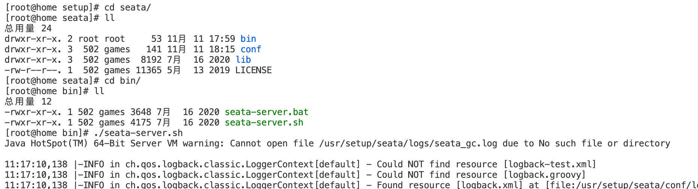

查看日志中，已经成功启动。


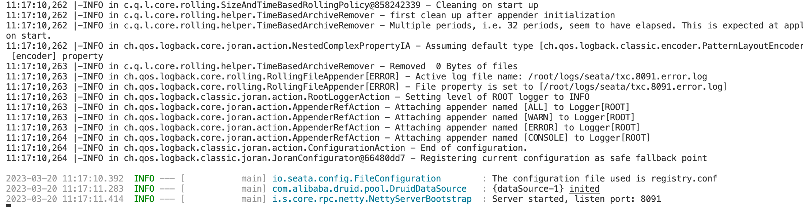

再去nacos上看看，服务实例已经启动，并注册到了Nacos上了。


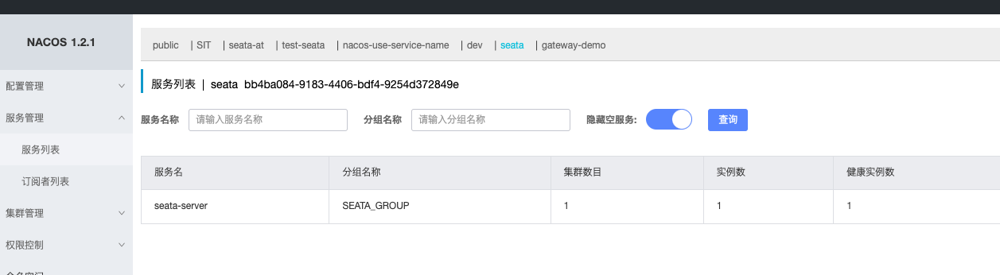


### 2. AT 模式实战


#### 2.1. 使用场景

举一个简单的应用场景：电商系统中，一个用户发起购买商品的动作，后端业务逻辑是

- 扣减库存
- 扣减个人账户上的余额
- 创建一个订单

只要上面有一个步骤没有执行成功，就回滚已经执行成功的其他步骤。为了模拟分布式事务的效果，我们采用创建三个微服务的方式实现。

1. seata-at-storage 库存服务
2. seata-at-account 账户服务
3. seata-at-order 订单服务

所以上面的业务逻辑就变成了，用户发起一个购买商品的服务，直接调用后端 订单服务 ，由订单服务分别调用 库存服务 完成扣减库存功能，然后再调用 账户服务 完成扣减账户金额功能，最后本地生成一个订单。

这里我们需要一个注册中心，把三个服务注册到上面，这样配合OpenFeign完成相互调用，此外我们还需要MySQL作为数据存储，最后我们需要Seata作为我们的事务管理器。


#### 2.2. 搭建seata-at-storage服务模块

1. 先创建数据库


```
-- 仓储
CREATE TABLE `storage` (
  `id` bigint(11) NOT NULL AUTO_INCREMENT,
  `name` varchar(100) DEFAULT NULL,
  `num` bigint(11) DEFAULT NULL COMMENT '数量',
  `create_time` timestamp NOT NULL DEFAULT CURRENT_TIMESTAMP COMMENT '创建时间',
  `price` bigint(10) DEFAULT NULL COMMENT '单价，单位分',
  PRIMARY KEY (`id`) USING BTREE
) ENGINE=InnoDB DEFAULT CHARSET=utf8mb4 ROW_FORMAT=COMPACT;

CREATE TABLE `undo_log` (
  `branch_id` bigint(20) NOT NULL COMMENT 'branch transaction id',
  `xid` varchar(100) NOT NULL COMMENT 'global transaction id',
  `context` varchar(128) NOT NULL COMMENT 'undo_log context,such as serialization',
  `rollback_info` longblob NOT NULL COMMENT 'rollback info',
  `log_status` int(11) NOT NULL COMMENT '0:normal status,1:defense status',
  `log_created` datetime(6) NOT NULL COMMENT 'create datetime',
  `log_modified` datetime(6) NOT NULL COMMENT 'modify datetime',
  UNIQUE KEY `ux_undo_log` (`xid`,`branch_id`) USING BTREE
) ENGINE=InnoDB DEFAULT CHARSET=utf8 ROW_FORMAT=COMPACT COMMENT='AT transaction mode undo table';

```

2.  使用idea工具中的initializer工具，生成模块的骨架，这里不再赘述。 
3.  修改pom文件，添加上 nacos注册中心、Mybatis、MySQL、Seata的相关依赖。 


```
<dependency>
    <groupId>com.alibaba.cloud</groupId>
    <artifactId>spring-cloud-starter-alibaba-nacos-discovery</artifactId>
  </dependency>

  <dependency>
    <groupId>com.baomidou</groupId>
    <artifactId>mybatis-plus-boot-starter</artifactId>
  </dependency>

  <!-- mysql -->
  <dependency>
    <groupId>mysql</groupId>
    <artifactId>mysql-connector-java</artifactId>
  </dependency>

  <!--seata-->
  <dependency>
    <groupId>com.alibaba.cloud</groupId>
    <artifactId>spring-cloud-starter-alibaba-seata</artifactId>
    <exclusions>
      <!-- 排除依赖 指定版本和服务器端一致 -->
      <exclusion>
        <groupId>io.seata</groupId>
        <artifactId>seata-all</artifactId>
      </exclusion>
      <exclusion>
        <groupId>io.seata</groupId>
        <artifactId>seata-spring-boot-starter</artifactId>
      </exclusion>
    </exclusions>
  </dependency>

  <dependency>
    <groupId>io.seata</groupId>
    <artifactId>seata-all</artifactId>
  </dependency>

  <dependency>
    <groupId>io.seata</groupId>
    <artifactId>seata-spring-boot-starter</artifactId>
  </dependency>

```

4. 修改项目的配置： application.yml


```
server:
  port: 10902

spring:
  application:
    name: seata-at-storage
  datasource:
    url: jdbc:mysql://192.168.1.150:3306/seata_storage?useUnicode=true&characterEncoding=UTF-8&serverTimezone=Asia/Shanghai
    username: root
    password: root
    driver-class-name: com.mysql.cj.jdbc.Driver
    hikari:
      auto-commit: true
      connection-test-query: SELECT 1
      connection-timeout: 30000
      idle-timeout: 180000
      max-lifetime: 0
      maximum-pool-size: 30
      minimum-idle: 10
      pool-name: hikari-pool
  cloud:
    nacos:
      discovery:
        server-addr: 192.168.1.150:8848
        namespace: 2cbceeeb-22f5-40d6-b65c-47f673e79f29


mybatis:
  mapper-locations: classpath:/mapper/*.xml

# 配置日志级别
logging:
  level:
    root: debug

```

5. 之后再使用idea中的easycode插件生成业务代码，关键方法是： `me.zeanzai.seataatstorage.service.impl.StorageServiceImpl#deduct`


```
@Transactional
@Override
public boolean deduct(Long id, Long num) {
    //todo 模拟扣减库存，具体业务逻辑自己完善
    Storage storage = this.storageDao.queryById(id);
    if (Objects.isNull(storage))
        throw new RuntimeException();

    storage.setNum(storage.getNum()-num);

    return this.storageDao.update(storage) > 0;
}

```


#### 2.3. 搭建seata-at-account和seata-at-order服务模块

搭建过程与上面的seata-at-storage服务模块的过程基本类似。

seata-at-account的表结构：


```sql

-- 账户余额
CREATE TABLE `account` (
	`id` BIGINT ( 11 ) NOT NULL AUTO_INCREMENT,
	`user_id` VARCHAR ( 32 ) CHARACTER SET utf8mb4 COLLATE utf8mb4_general_ci NULL DEFAULT NULL COMMENT '用 户userId',
	`money` BIGINT ( 11 ) NULL DEFAULT NULL COMMENT '余额，单位分',
  `create_time` timestamp NOT NULL DEFAULT CURRENT_TIMESTAMP COMMENT '创建时间',
	PRIMARY KEY ( `id` ) USING BTREE 
) ENGINE = INNODB CHARACTER SET = utf8mb4 COLLATE = utf8mb4_general_ci ROW_FORMAT = Compact;

CREATE TABLE `undo_log` (
  `branch_id` bigint(20) NOT NULL COMMENT 'branch transaction id',
  `xid` varchar(100) NOT NULL COMMENT 'global transaction id',
  `context` varchar(128) NOT NULL COMMENT 'undo_log context,such as serialization',
  `rollback_info` longblob NOT NULL COMMENT 'rollback info',
  `log_status` int(11) NOT NULL COMMENT '0:normal status,1:defense status',
  `log_created` datetime(6) NOT NULL COMMENT 'create datetime',
  `log_modified` datetime(6) NOT NULL COMMENT 'modify datetime',
  UNIQUE KEY `ux_undo_log` (`xid`,`branch_id`) USING BTREE
) ENGINE=InnoDB DEFAULT CHARSET=utf8 ROW_FORMAT=COMPACT COMMENT='AT transaction mode undo table';

```

seata-at-order服务模块的表结构：


```


-- 订单
CREATE TABLE `ordertb` (
  `id` bigint(11) NOT NULL AUTO_INCREMENT,
  `product_id` bigint(11) DEFAULT NULL COMMENT '商品Id',
  `num` bigint(11) DEFAULT NULL COMMENT '数量',
  `user_id` varchar(32) DEFAULT NULL COMMENT '用户唯一Id',
  `create_time` timestamp NOT NULL DEFAULT CURRENT_TIMESTAMP COMMENT '创建时间',
  `status` int(1) DEFAULT NULL COMMENT '订单状态 1 未付款 2 已付款 3 已完成',
  PRIMARY KEY (`id`) USING BTREE
) ENGINE=InnoDB CHARACTER SET = utf8mb4 COLLATE = utf8mb4_general_ci  ROW_FORMAT=COMPACT;

CREATE TABLE `undo_log` (
  `branch_id` bigint(20) NOT NULL COMMENT 'branch transaction id',
  `xid` varchar(100) NOT NULL COMMENT 'global transaction id',
  `context` varchar(128) NOT NULL COMMENT 'undo_log context,such as serialization',
  `rollback_info` longblob NOT NULL COMMENT 'rollback info',
  `log_status` int(11) NOT NULL COMMENT '0:normal status,1:defense status',
  `log_created` datetime(6) NOT NULL COMMENT 'create datetime',
  `log_modified` datetime(6) NOT NULL COMMENT 'modify datetime',
  UNIQUE KEY `ux_undo_log` (`xid`,`branch_id`) USING BTREE
) ENGINE=InnoDB DEFAULT CHARSET=utf8 ROW_FORMAT=COMPACT COMMENT='AT transaction mode undo table';

```

扣减金额的关键代码， `me.zeanzai.seataataccount.service.impl.AccountServiceImpl#deduct` ：


```
@Transactional
@Override
public boolean deduct(String userId, Long money) {
    Account account = this.accountDao.queryByUserId(userId);
    if (Objects.isNull(account)) {
        return false;

    }
    account.setMoney(account.getMoney()-money);
    return this.accountDao.update(account)>0;
}

```

由于 seata-at-order 服务模块中需要使用OpenFeign来调用仓储和账户服务，因此还需要创建两个接口：


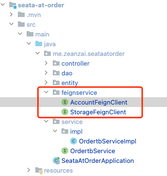


```
@FeignClient(value = "seata-at-account")
public interface AccountFeignClient {

    @PostMapping("/account/deduct")
    boolean deduct(@RequestParam("userId") String userId,
                   @RequestParam("money") Long money);

}

```


```
@FeignClient(value = "seata-at-storage")
public interface StorageFeignClient {

    @GetMapping("/storage/{id}")
    ResponseEntity<Storage> queryById(@PathVariable("id") Long id);

    @PostMapping("/storage/deduct")
    boolean deduct(@RequestParam("id") Long id,
                   @RequestParam("num") Long num);
}

```

之后就是生成订单的关键代码， `me.zeanzai.seataatorder.service.impl.OrdertbServiceImpl#createOrder` ：


```
@Transactional
@Override
public boolean createOrder(String userId, Long productId, Long num) {
    // 1. 扣减库存
    storageFeignClient.deduct(productId, num);

    // 2. 扣减余额
    ResponseEntity<Storage> storageResponseEntity = storageFeignClient.queryById(productId);
    Storage body = storageResponseEntity.getBody();
    accountFeignClient.deduct(userId, body.getPrice() * num);
    // 3. 创建订单
    Ordertb ordertb = new Ordertb();
    ordertb.setNum(num);
    ordertb.setUserId(userId);
    ordertb.setProductId(productId);
    ordertb.setStatus(2);
    return this.ordertbDao.insert(ordertb)>0;
}

```


#### 2.4. 启动并测试

分别启动 seata-at-storage 、 seata-at-account 、seata-at-order 模块，我们会发现已经注册到nacos上了。


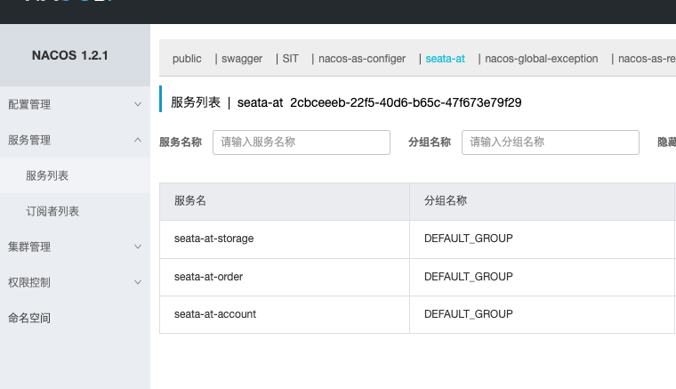

之后我们只需要调用订单模块中的createOrder接口就行了。

特别注意的点：三个服务模块中都只是使用`@Transactional`标注了本地事务，并没有开始分布式事务。


#### 2.5. 整合Seata

直到这一步，我们跟Seata没有任何关系，因为我们生成订单的方法中并没有定义事务，只是简单的本地事务，在生成订单的接口中，如果扣减库存的接口出现超时等异常错误信息，扣减金额和生成订单的逻辑并不会回滚。下面我们来说整合Seata的过程。安装和配置Seata这里就不再赘述。

1. 首先要先启动Seata


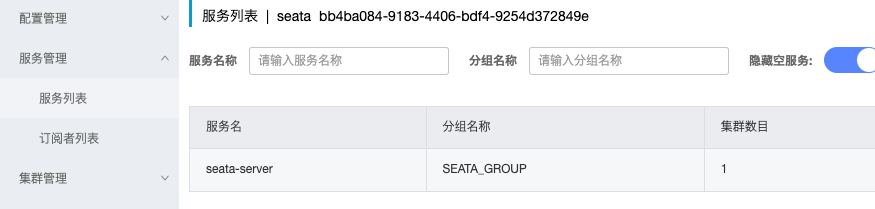

2. 在三个模块中分别添加Seata的配置


```
seata:
  enabled: true
  application-id: ${spring.application.name}
  tx-service-group: ${spring.application.name}-tx-group
  config:
    type: nacos
    nacos:
      namespace: bb4ba084-9183-4406-bdf4-9254d372849e
      server-addr: 192.168.1.150:8848
      group: SEATA_GROUP
      username: nacos
      password: nacos
  registry:
    type: nacos
    nacos:
      application: seata-server
      namespace: bb4ba084-9183-4406-bdf4-9254d372849e
      server-addr: 192.168.1.150:8848
      group: SEATA_GROUP
      username: nacos
      password: nacos

```

3. 创建Seata服务端配置，这里要特别注意：值均为default。


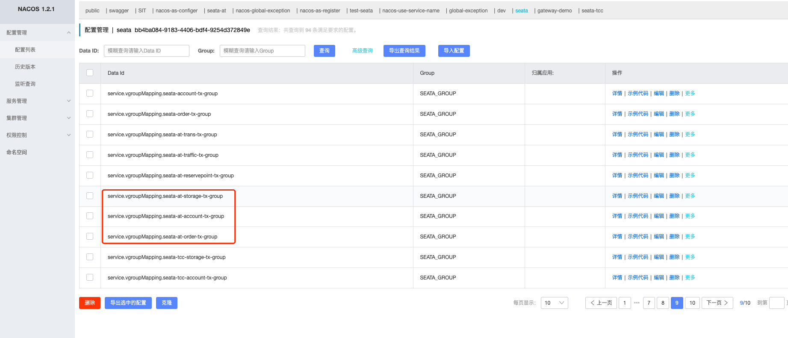


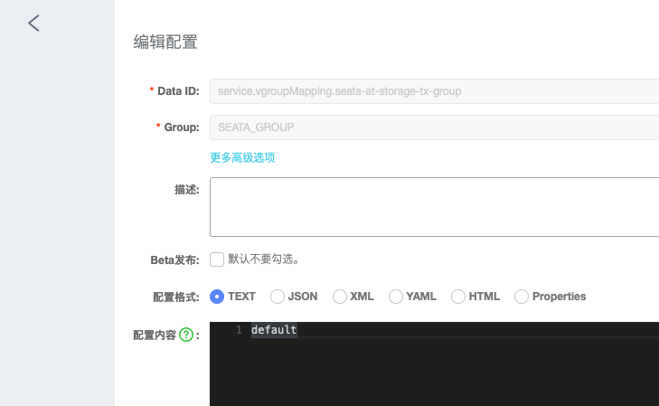


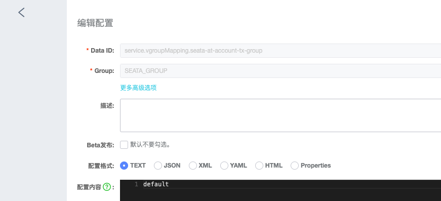


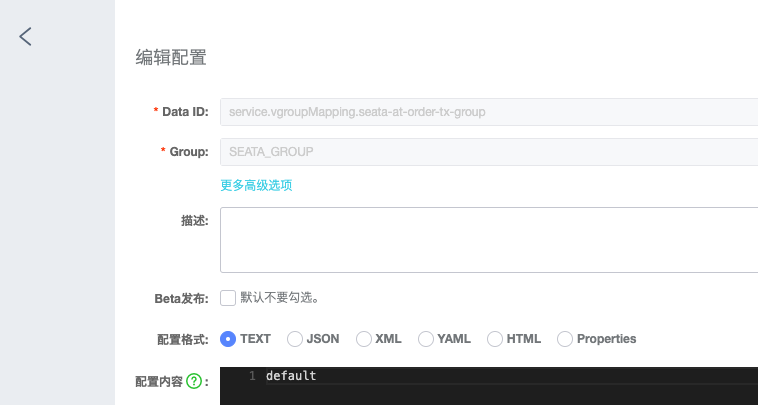

4. 修改业务代码，在订单模块中设置生成订单的方法为全局事务


```
@Override
@GlobalTransactional
public boolean createOrder(String userId, Long productId, Long num) {
    // 1. 扣减库存
    storageFeignClient.deduct(productId, num);

    // 2. 扣减余额
    ResponseEntity<Storage> storageResponseEntity = storageFeignClient.queryById(productId);
    Storage body = storageResponseEntity.getBody();
    accountFeignClient.deduct(userId, body.getPrice() * num);
    // 3. 创建订单
    Ordertb ordertb = new Ordertb();
    ordertb.setNum(num);
    ordertb.setUserId(userId);
    ordertb.setProductId(productId);
    ordertb.setStatus(2);
    return this.ordertbDao.insert(ordertb)>0;
}

```

5. 启动测试


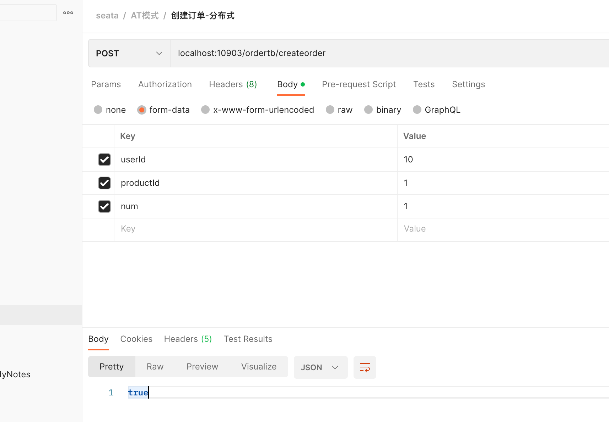


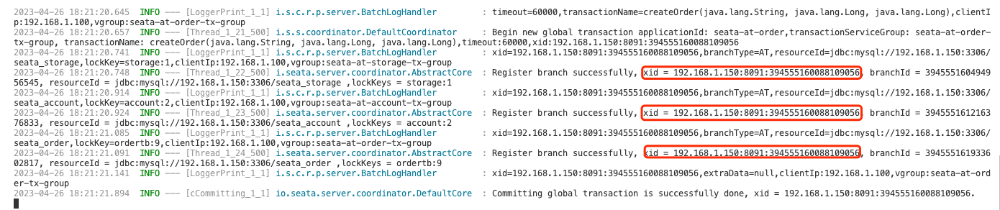


### 3. TCC 模式实战


1. 搭建公共模块，并搭建三个基本服务，完成三个模块的接口测试；
2. 保证三个异常

第一阶段： 搭建基础环境，只提供操作数据库的方法；
第二阶段： 完成order模块调用另外两个模块的rpc调用过程，需要集成nacos、openfeign等工具包；
第三阶段： 集成Seata；

starter模块用来统一管理各种依赖的版本；
common模块继承starter模块，并包含公共模块，但是不传递依赖，如Seata的依赖，如果只在业务包里面使用，那么Seata的依赖就应该放到业务模块里面；

遵循： 1. 用到才添加依赖，不传递；

storage、account、order都继承starter模块，并继承starter模块，依赖于common模块；

1. 需要解决空回滚
2. 悬挂
3. 幂等

// todo
// 1. 单测已经完成，但是压测没有通过，大批量请求进入时，并不能保证数据的一致性；
// 2. 码猿技术专栏教程中的项目代码，压测时，也不能保证数据的一致性；
// 3. 参考网上一篇文章，完成了异常编码集中化配置的使用方式，但是理想是把配置文件整到配置中心去；


```sql
CREATE TABLE `storage`  (
  `id` bigint(11) NOT NULL AUTO_INCREMENT,
  `product_id` bigint(11) NULL DEFAULT NULL,
  `name` varchar(100) CHARACTER SET utf8mb4 COLLATE utf8mb4_general_ci NULL DEFAULT NULL,
  `num` bigint(11) NULL DEFAULT NULL COMMENT '数量',
  `create_time` datetime(0) NULL DEFAULT NULL,
  `price` bigint(10) NULL DEFAULT NULL COMMENT '单价，单位分',
  `frozen` bigint(11) NULL DEFAULT NULL COMMENT '冻结的库存',
  PRIMARY KEY (`id`) USING BTREE
) ENGINE = InnoDB AUTO_INCREMENT = 2 CHARACTER SET = utf8mb4 COLLATE = utf8mb4_general_ci ROW_FORMAT = Compact;

CREATE TABLE `account` (
	`id` BIGINT ( 11 ) NOT NULL AUTO_INCREMENT,
	`user_id` VARCHAR ( 32 ) CHARACTER SET utf8mb4 COLLATE utf8mb4_general_ci NULL DEFAULT NULL COMMENT '用 户userId',
	`money` BIGINT ( 11 ) NULL DEFAULT NULL COMMENT '余额，单位分',
  `create_time` timestamp NOT NULL DEFAULT CURRENT_TIMESTAMP COMMENT '创建时间',

  `frozen` bigint(11) NULL DEFAULT NULL COMMENT '冻结的money',
	PRIMARY KEY ( `id` ) USING BTREE 
) ENGINE = INNODB CHARACTER SET = utf8mb4 COLLATE = utf8mb4_general_ci ROW_FORMAT = Compact;

CREATE TABLE `t_order`  (
  `id` bigint(11) NOT NULL AUTO_INCREMENT,
  `order_id` varchar(60) CHARACTER SET utf8mb4 COLLATE utf8mb4_general_ci NULL DEFAULT NULL COMMENT '订单Id',
  `product_id` bigint(11) NULL DEFAULT NULL COMMENT '商品Id',
  `num` bigint(11) NULL DEFAULT NULL COMMENT '数量',
  `user_id` varchar(32) CHARACTER SET utf8mb4 COLLATE utf8mb4_general_ci NULL DEFAULT NULL COMMENT '用户唯一Id',
  `create_time` datetime(0) NULL DEFAULT NULL,
  `status` int(1) NULL DEFAULT NULL COMMENT '订单状态 1 未付款 2 已付款 3 已完成 4 待确认 5 已删除',
  PRIMARY KEY (`id`) USING BTREE
) ENGINE = InnoDB AUTO_INCREMENT = 1 CHARACTER SET = utf8mb4 COLLATE = utf8mb4_general_ci ROW_FORMAT = Compact;

CREATE TABLE `ordertb` (
  `id` bigint(11) NOT NULL AUTO_INCREMENT,
  `order_id` varchar(60) CHARACTER SET utf8mb4 COLLATE utf8mb4_general_ci NULL DEFAULT NULL COMMENT '订单Id',
  `product_id` bigint(11) DEFAULT NULL COMMENT '商品Id',
  `num` bigint(11) DEFAULT NULL COMMENT '数量',
  `user_id` varchar(32) DEFAULT NULL COMMENT '用户唯一Id',
  `create_time` timestamp NOT NULL DEFAULT CURRENT_TIMESTAMP COMMENT '创建时间',
  `status` int(1) DEFAULT NULL COMMENT '订单状态 1 未付款 2 已付款 3 已完成 4 待确认 5 已删除',
  PRIMARY KEY (`id`) USING BTREE
) ENGINE=InnoDB CHARACTER SET = utf8mb4 COLLATE = utf8mb4_general_ci  ROW_FORMAT=COMPACT;

```

压力测试时用到的一些脚本

-- 初始化
delete from `seata_server`.`branch_table`;
delete from `seata_server`.`global_table`;
delete from `seata_server`.`lock_table`;
delete from `seata_tcc_account`.`account`;
delete from `seata_tcc_account`.`undo_log`;
delete from `seata_tcc_storage`.`storage`;
delete from `seata_tcc_storage`.`undo_log`;
delete from `seata_tcc_order`.`ordertb`;
delete from `seata_tcc_order`.`undo_log`;
delete from `seata_tcc_order`.`transactional_record`;
INSERT INTO `seata_tcc_account`.`account` (`id`, `user_id`, `money`, `create_time`, `frozen`) VALUES (1, '1', 20000, '2023-03-21 16:46:58', 0);
INSERT INTO `seata_tcc_storage`.`storage` (`id`, `product_id`, `name`, `num`, `create_time`, `price`, `frozen`) VALUES (1, 100, '码猿技术专栏', 1000, '2021-10-15 22:32:40', 20, 0);

select * from `seata_tcc_account`.`account`;
select * from `seata_tcc_storage`.`storage`;
select * from `seata_tcc_order`.`ordertb`;
select * from `seata_tcc_order`.`transactional_record`;
select * from `seata_tcc_storage`.`undo_log`;
select * from `seata_tcc_account`.`undo_log`;
select * from `seata_tcc_order`.`undo_log`;

-- 花的钱：
select (20000-money) as cost from `seata_tcc_account`.`account`;

-- 卖的产品个数：
select (1000-num) as productNum from `seata_tcc_storage`.`storage`;

-- 订单个数
select count(1) as orderNum, count(1)_2 as productNum, count(1)_40 as moneyCost from `seata_tcc_order`.`ordertb` where `status`=3;

select a.cost=o.moneyCost, s.productNum=o.productNum1
from (select (20000-money) as cost from `seata_tcc_account`.`account`) a,
(select (1000-num) as productNum from `seata_tcc_storage`.`storage`) s,
(select count(1)_2 as productNum1, count(1)_40 as moneyCost from `seata_tcc_order`.`ordertb` where `status`=3) o
;

-- 订单上的产品个数：
select sum(num) from `seata_tcc_order`.`ordertb` where `status`=3;
select count(*) from `seata_tcc_order`.`transactional_record`;


### 4. 实践过程

> 使用jpa作为ORM框架； 框架是一步一步进行迭代的。


1.  搭建项目脚手架 
2.  集成Openfeign 
3.  集成Seata 
4.  处理三个异常信息 
5.  处理幂等性问题 
   1. 查看GitHub上的samples，对服务调用也要进行幂等的问题？会不会可以处理压测时出现的问题


---

### 5. TCC模式


#### 5.1. 1.空回滚和悬挂问题的分析

这一节，我们来看下生单链路中，引入Seata TCC后可能会导致的一些问题，在TCC分布式事务中，最常见的问题莫过于空回滚和悬挂了，Seata TCC分布式事务也是如此。

我们先来结合着上节课的生单链路，了解下什么是空回滚和悬挂：


可以看到，当用户提交订单时，订单系统向Seata Server发送一个请求，开启一个分布式事务，并获取分布式事务对应的xid，然后订单系统通过dubbo，向库存系统发送一个rpc请求并传递相应的xid，请求锁定库存。

库存系统收到订单系统发送过来的xid，会在xid对应的分布式事务下，开启一个分支事务，然后调用系统中数据库缓存双写的逻辑。

在Seata TCC分布式事务中，会依次执行每个接口中的try方法，对一些资源进行预留，比如我们这里锁定库存，根据前面的约定，try方法中就是先扣减销售库存：

而第一个可能出现的问题，就是在调用try方法时，可能因为网络不通畅等原因，导致try方法调用时阻塞住，一直卡在半路当中，此时，销售库存的数据，当然也就没来得及扣减成功。


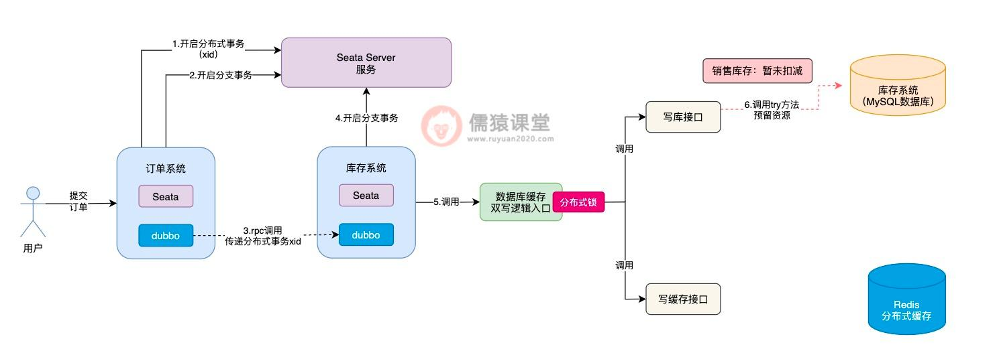

这个时候，Seata TCC可能还误以为写库接口中的try方法，已经执行成功了，这个时候，Seata TCC还没等到写库接口的try方法执行成功，就开始执行写缓存接口中的try方法：

可以看到，在执行写缓存接口中的try方法时，倘若是出现了任何异常的情况，根据我们前面分析的，此时，出现异常的方法，就会原地进行本地事务回滚，Seata TCC同时也会调用写库接口中的cancel方法进行回滚。


现在最大的问题在于，写库接口中的try方法，前面因为网络不通畅等问题，还没来得及执行成功，此时，Seata TCC就要调用写库接口的cancel方法进行回滚，对销售库存进行增加，这样就会导致销售库存，莫名其妙多出了一些库存数据，整体的库存数据就不一致了。

像这样由于网络不通畅等原因，导致在try方法都还没有执行成功的前提下，就直接执行cancel方法进行回滚的现象，我们称为空回滚，而try方法一直阻塞卡住而不能执行的现象，一般也被称为是悬挂，不管是空回滚还是悬挂，这个两个问题的出现，根据我们刚分析的，都存在一定的概率，导致库存数据的不一致。


#### 5.2. 2.Seata TCC中的幂等性问题分析

除了可能会导致空回滚和悬挂之外，Seata TCC的引入同样也会导致幂等性问题的发生：

可以看到，倘若各个接口的try方法，现在都执行成功了，接下来，Seata TCC就会依次调用各个接口中的confirm方法，完成核心的业务逻辑。


Seata TCC底层，一旦发现所有接口的try方法都执行成功，就会依次调用各个接口confirm方法，如果confirm方法执行失败，Seata TCC底层就会重复调用接口的confirm方法，务必确保每个接口的confirm方法，一定能执行成功。

这样的话，confirm方法就会存在一定的概率被重复调用，如图，一旦confirm方法被重复调用，锁定库存的数据就有可能被重复累加，进而导致库存数据的不一致性问题发生，所以，这算是Seata TCC分布式事务中，一个比较典型的幂等性问题了。

相应的，如果Seata TCC操作出现异常，也会导致幂等性问题的发生：

可以看到，如果写缓存接口的try方法执行失败了，写库接口这里，相应的会调用cancel方法进行回滚操作，而cancel方法的调用和confirm方法的规律是类似的，Seata TCC底层也有可能会出现重复调用，导致销售库存重复累加，进而导致库存数据的不一致性问题发生。

所以，我们可以看到，在Seata TCC分布式事务中，不论是调用confirm方法还是调用cancel方法，都存在一定的概率重复调用，也就是说confirm方法调用和cancel方法调用，都存在幂等性的问题。


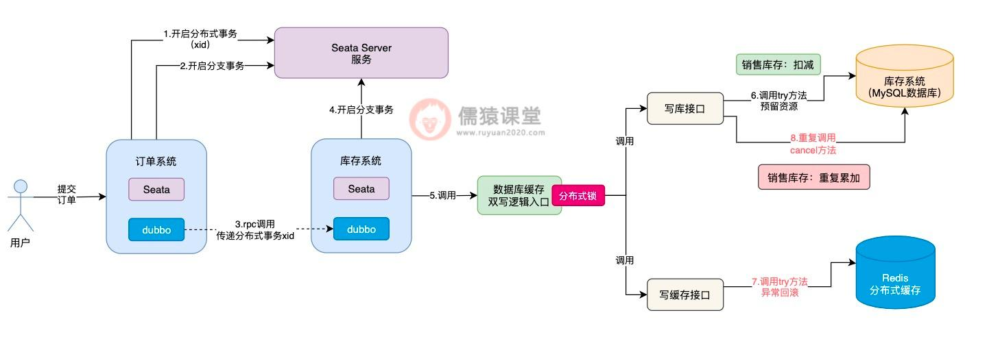


#### 5.3. 3.如何解决空回滚、悬挂以及幂等性问题呢？

我们先来分析下空回滚和悬挂的问题，看下有没有好的解决方案。
首先，空回滚和悬挂问题发生的主要原因，在于try方法都还没有执行成功，cancel方法就被调用了，导致平白无故就多补偿了一次，库存数据当然就会不一致性，所以，要是cancel方法在开始执行时，就能知道try方法是否执行成功了，问题不就好办多了吗。

基于这样的设想，我们可以在内存中设计一个缓存，比如，我们可以通过Map这样的数据结构来实现，Map中的key为接口名称、分布式事务的xid和以及商品的sku组成，表示当前是哪个接口类，在哪个Seata分布式事务中，对哪个商品sku进行锁定库存操作。

而Map中的value值，则可以用于存放具体的操作状态，比如try操作开始执行时，可以在缓存中设置“TRY_START”字符串，表示当前try方法开始执行了；而当try方法执行成功之后，可以将该value值设置为“TRY_SUCESS”字符串，表示当前try方法已经执行成功了。

接下来，我们结合着生单链路，来看下具体是如何结合缓存，来解决空回滚和悬挂问题的：

首先，在cancel方法刚开始执行时，首先到缓存中检查一下，通过接口名称+xid+sku拼接成一个key，到Map缓存中查询一下，先看下能够获取到try方法执行过的痕迹。

如果try方法都还没有执行，得到的value结果肯定就为null，此时，cancel方法中的逻辑就直接取消执行，避免空回滚逻辑的执行。


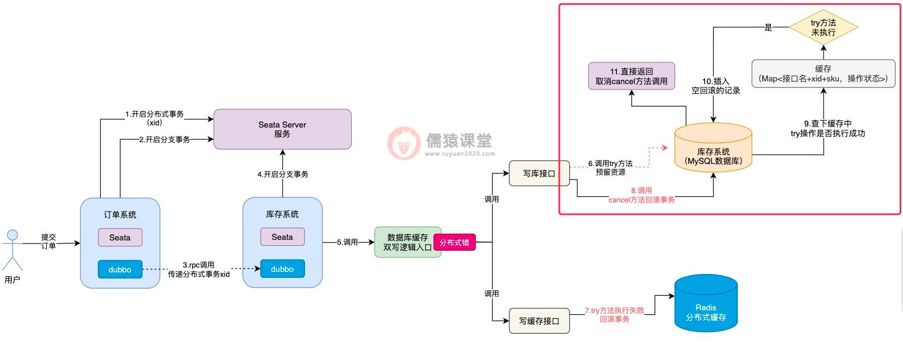

并且，因为当前try方法都还没有开始执行就调用cancel方法了，空回滚的问题就已经发生了，所以，我们可以事先在数据库中自定义一张表，专门用来存放空回滚的记录。

空回滚发生的同时，我们可以在数据库中，及时插入一条空回滚的记录，这样，接下来一旦try方法由于网络而恢复执行了，就可以利用数据库的空回滚记录，控制try方法的执行了，我们具体来看下：


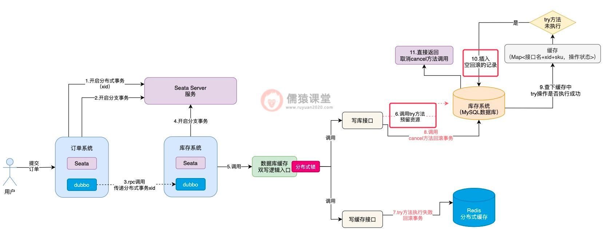

可以看到，try方法执行时，首先会到数据库中检查一下，如果发现当前已经出现空回滚了，try方法就算恢复网络也不会被允许实际的去执行了，直接就取消try方法的执行了，通过以上这套思路，空回滚和悬挂的问题也就解决了。

空回滚和悬挂的问题解决了之后，confirm方法和cancel方法的幂等性问题，自然也就简单多了，前面我们分析过，当try方法开始执行时，会在缓存中以接口名称+xid+sku拼接的字符串为key，以“TRY_START”为value，一旦try方法执行完毕，value值就会被更新为“TRY_SUCESS”。

如果出现多个请求，重复调用confirm方法或者是cancel方法，首先得要检查下缓存中的value，是否为“TRY_SUCESS”，只有当try方法被执行了，且try方法还执行成功了，才允许执行confirm或cancel方法，否则，直接取消当前的方法。

毕竟，try方法都还没有执行成功，贸然就执行confirm方法和cancel方法，肯定是会存在问题的，这也是前面幂等性问题的核心。

而当confirm方法或cancel方法都执行完毕之后，缓存中的try方法执行标识也会及时清理掉，下一次有重复的请求过来时，缓存中就找不到try方法执行的痕迹了，confirm或者cancel方法也就不会被重复执行了，幂等性问题同样也就得以解决了。


#### 5.4. 4.总结

这一节，我们分析了在引入Seata TCC分布式事务后的生单链路中，什么是空回滚和悬挂问题。
其实，空回滚主要是try方法由于网络问题，一直都还没有开始执行，阻塞在了半路上，也就是出现了悬挂；此时，其他的Seata TCC分支链路如果恰好又出现了故障，就会导致在try方法还没有执行的前提下，就执行cancel方法，进行空回滚补偿，所以，一般都是因为悬挂而导致了空回滚的发生。

另外，如果所有接口的try方法都执行成功了，Seata TCC可能存在重复调用confirm方法或cancel方法的象，当然，Seata TCC的初衷，还是为了保证在try方法都执行成功的前提下，confirm方法或者cancel方法务必得要执行成功，因为，也带来了幂等性问题的风险。

最后，我们通过引入一个Map数据结构的缓存，及时记录当前try方法的执行情况，并且，当空回滚发生时，及时在数据库表中，记录空回滚的记录，这样，一旦发生了空回滚的问题，try方法在执行时也能及时感知到，避免了错误执行下去。

并且，正是因为我们添加了缓存，来记录try方法的执行状态，所以，只有当try方法执行成功后，才允许执行confirm方法或cancel方法，一旦执行完confirm或cancel方法，就会及时在缓存中清除try方法执行的记录，所以，confirm方法或cancel方法，能够保证只允许执行一次，完美解决了confirm和cancel方法重复执行的幂等性问题。

接着，订单系统在锁定库存时，就会调用库存系统的接口，此时，订单系统底层会通过dubbo，向库存系统发送一个远程的rpc网络请求，并将分布式事务的xid也传递过去。


#### 5.5. 生单链路核心执行流程的回顾

首先，我们来回顾下引入Seata TCC分布式事务后，生单核心链路的执行流程，想必大家现在已经很熟悉了：

当用户提交订单时，订单系统会先向Seata Server服务，发起一个开启新的分布式事务的请求，并获取分布式事务对应的唯一标识xid，然后，订单系统本身也会开启一个本地数据库的分支事务。

库存系统接收到订单系统的rpc请求之后，也会在本地开启一个分支事务：

可以看到，库存系统在本地开启一个分支事务之后，紧接着，就会调用数据库缓存双写的入口逻辑，从这里开始，我们就进入到了Seata TCC分布式事务的运行范围之内了。


可以看到，首先会依次调用写库接口和写缓存接口的try方法了，当所有接口的try方法都执行成功之后，注意，此时并不是立即依次执行各个接口的confirm方法，而是顺着生单链路的执行流程，继续执行其他分支的事务。

和之前一样，订单系统获取本地锁执行落库生单操作，然后插入相应的回滚日志，最后获取全局锁提交分支事务，并释放本地锁。

比如，接下来该轮到订单系统的Seata分支事务执行了：


当生单链路中的所有分支事务都执行完成之后，接下来，就会提交整体的Seata分布式事务了：


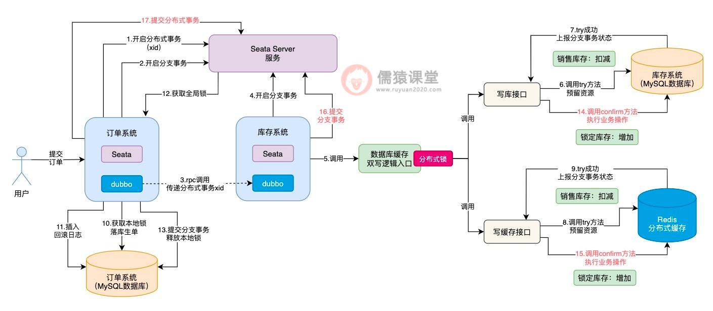

可以看到，Seata分布式事务提交时，才会依次的去调用库存系统对应的Seata TCC分布式事务的confirm方法，提交库存系统的分支事务，最后，完成整体分支事务的提交。

可以看到，当Seata TCC分布式事务开始执行时，首先会添加一把分布式锁，然后开始执行各个接口的try方法，当所有接口的try方法都执行成功之后，分布式锁也就释放了，然后继续执行其他Seata分支事务了。


#### 5.6. 6.Seata TCC异步提交导致数据不一致

我们结合生单链路来看一下：

分析到这里，想必大家已经看出一些端倪了，也就是说Seata TCC分布式事务在执行时，依次执行完各个接口的try方法之后，并不是一气呵成执行各个接口的confirm方法，而是得要等到整体的Seata分布式事务提交时，才会依次执行各个接口的confirm方法，相当于Seata TCC分布式事务的提交阶段，是异步执行的了。


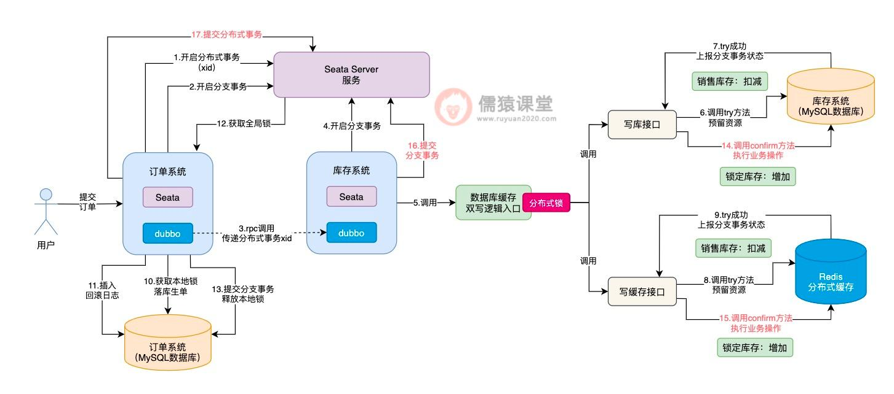

此时，如果当前正在执行的分布式事务，如果还没来得及执行confirm方法，此时，如果其他分布式事务过来执行锁定库存操作，大家觉得try方法的执行会出问题吗？答案是不会的。

如图，可以看到在调用数据库缓存双写逻辑前，首先得要获取一把分布式锁：


即使前一个分布式事务，已经将分布式锁释放了，但是，如果其他多个分布式事务过来执行各个接口的try方法，分布式锁还是能够保证多个分布式事务，顺序地执行各个接口的try方法的，所以，各个接口try方法的执行，还是可以保证并发安全性的。

问题就出在各个接口的confirm方法的执行，比如在当前数据库中，某个商品的库存数据的售库存为10，锁定库存为0：

可以看到，假如当前分布式事务1先执行写库接口的try方法后，销售库存扣减1从10变为9，然后，分布式事务1释放分布式锁后，继续去执行落库生单操作，库存的锁定操作，现在还差confirm方法累加锁定库存的操作。


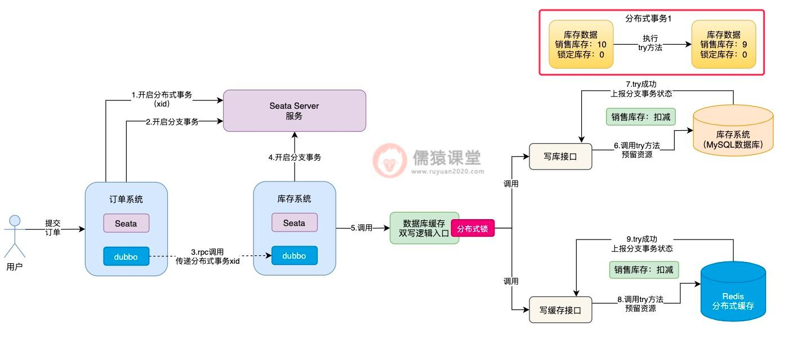

可以看到，假设此时分布式事务2，在分布式事务1初步锁定库存的基础上，获取相同的一件商品的库存数据，也就是销售库存为9，锁定库存为0，这个时候，分布式事务2获取到的库存数据中，锁定库存数据就出问题了。

这个时候，如果另一个分布式事务过来执行，就会出现问题了：

其他分布式事务过来，按理说正确获取到的库存数据，应该是上个分布式事务，已经锁定库存操作完毕的数据，而不是锁定库存逻辑执行一半的库存数据，所以，分布式事务2基于错误的数据，进行try方法以及后续的confirm方法的执行，就会出现数据不一致性的问题了。


为了让其他分布式事务执行try方法时，能获取到正确的库存数据，我们可以在confirm方法调用结束后，随即插入一条库存数据的操作日志：


#### 5.7. 7.引入库存操作日志来解决数据不一致问题

现在的问题，关键在于一个分布式事务还没有来的及执行confirm方法，还没有完整的将整个分布式事务提交，其他分布式事务可能就会获取到错误的库存数据，那这个问题到底该怎么解决呢？

可以看到，我们可以预先在数据库中，定义一张库存数据的操作日志表，当confirm方法执行完毕之后，插入一条操作日志。


然后当其他分布式事务来执行时：

可以看到，虽然分布式事务2在执行try方法时，获取到的库存数据中的销售库存数量是正确的，但是锁定库存的数量是错误的，正确的锁定库存数量应该为1。


此时，当分布式事务2在执行confirm方法时，就不能基于错误的锁定库存数据0，来进行库存的累加操作，而得要先从库存操作日志表中，获取最近最新插入的一条库存记录，查询最近提交的分布式事务修改后的最新锁定库存数据。

而分布式事务1执行confirm方法后，锁定库存的数量为1才是正确的，分布式事务2查询到这条数据后，基于正确的锁定库存数据进行confirm方法的执行，最终得到锁定库存数据结果2，才是正确的数据。

相应的，分布式事务2执行完confirm操作提交时，也会插入一条相应的库存操作日志，方便其他分布式事务执行时获取，这样的话，Seata TCC异步提交导致的数据不一致问题也就解决了。

为了解决Seata TCC异步提交而导致的数据不一致问题，我们引入了库存数据的操作日志来解决这个问题，也就是在每次执行confirm方法之后，都会往库存日志表中，插入一条库存数据变更的日志。


#### 5.8. 8.总结

这一节，我们首先回顾了一下之前基于Seata和Seata TCC的生单核心链路逻辑，然后，基于生单链路的执行流程，我们发现了一个问题，也就是Seata TCC的try方法和confirm方法的执行，其实是异步的，所以，库存数据这块，在多个分布式事务同时执行时，可能就会出现数据不一致的问题。

生单链路的一系列问题，包括涉及多个数据库的数据不一致问题、锁定库存时因为全局锁而导致的并发瓶颈问题、引入Seata TCC分布式事务后的空回滚，悬挂，confirm方法和cancel方法重复执行的幂等性问题以及Seata TCC异步提交而导致的数据不一致等一系列技术问题，我们都已经悉数解决了。

虽然其他的分布式事务在执行try方法时，拿到的锁定库存数据是有问题的，但是，在具体执行confirm方法时，可以从库存日志表中，查询最近最新的一条库存操作日志，从日志中获取最新的库存数据，这样的话，锁定库存数据不一致的问题也就得到解决了。

从下一节开始，我们顺着生单链路的执行流程，继续来看下生单链路之后的订单预支付和支付回调链路中，业务流程是怎样的，并且可能会遇到哪些技术问题。


[TCC简介及Seata中的问题](https://seata.io/zh-cn/blog/seata-tcc-fence.html)


