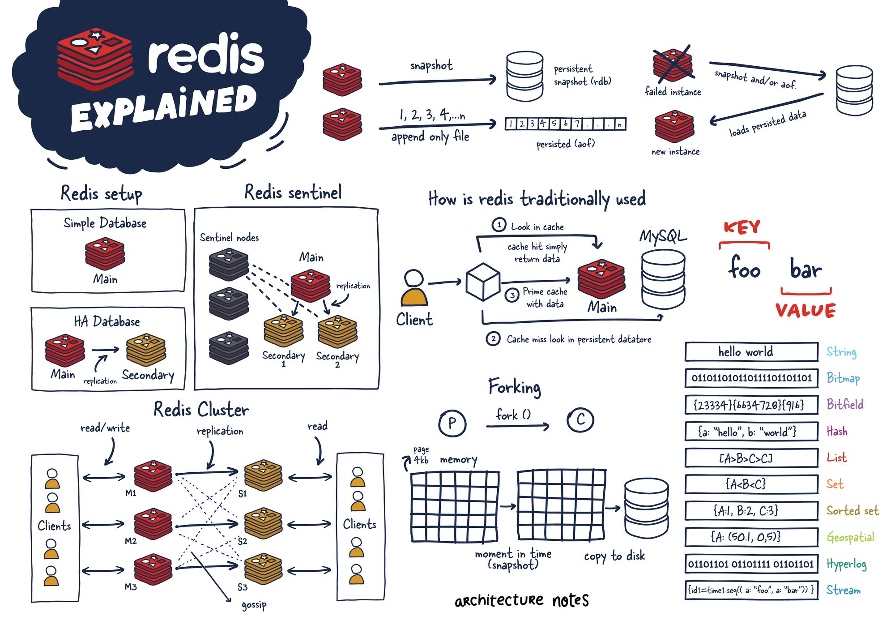
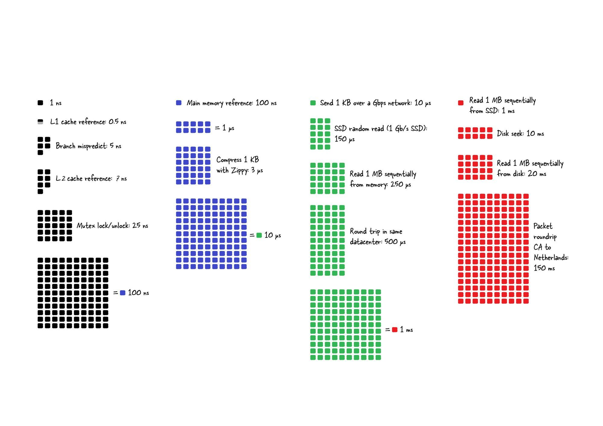

| **日期** | **迭代内容**                                                                            |
| ---------- | ----------------------------------------------------------------------------------------- |
| 23-11-24 | 1. 创建文档骨架，确定知识体系；2. 完成《概述》《对象系统》等篇；3. 完成《持久化》篇章； |

::: tip 导学指引

1. 首先要了解 Redis 有哪些功能特性，背景；
2. 其次再了解 Redis 的对象系统，支持哪些数据类型，又根据对象系统设计出了哪些底层数据结构，对象系统是如何支持命令多态的；
3. 之后要了解 Redis 的企业级的特性：持久化与高可用；
4. 再之后要了解 Redis 的高级的特性：常用客户端、事务、管道、迭代器、发布订阅、分布式问题解决方案；
5. 最后要了解 Redis 生产级的运维特性：基准测试、监控与告警、性能优化等；

:::

## 知识体系

- [**1010.简介**](https://www.yuque.com/zeanzai.me/nox53r/aoprriuexhb7r5wr)

> 1. 什么是 Redis
> 2. 版本迭代
> 3. 为什么使用缓存
> 4. 常见的使用到 Redis 的业务场景
> 5. 本地缓存与分布式缓存的区别
> 6. 本地缓存的实战过程

- [**20.对象系统——概述**](https://www.yuque.com/zeanzai.me/nox53r/ab23mmumc0znoivl)

> 1. 为什么设计对象系统
> 2. 如何实现命令的多态
> 3. 内建对象有哪些

- [**21.对象系统——支持的数据类型**](https://www.yuque.com/zeanzai.me/nox53r/fhzz7q63idveolq5)

> 1. 值对象支持哪些数据类型，分别有哪些常用命令和分别有哪些业务场景

- [**22.对象系统——底层数据结构**](https://www.yuque.com/zeanzai.me/nox53r/gxxmb58di3sfxgs2)

> 1. 值对象底层有哪些数据结构，转换条件是怎样的，如何高效利用这些转换条件

- [**30.持久化机制**](https://www.yuque.com/zeanzai.me/nox53r/ge8rwhsa0011756m)

> 1. RDB 基本原理，配置参数是怎样的，手动触发与自动触发，什么是增量复制，有哪些优缺点，如何保证备份时的数据一致性， 备份时服务崩溃应如何应对，生产环境下如何配置
> 2. AOF 基本原理，配置参数是怎样的，手动触发与自动触发，什么是重写，有哪些优缺点，全量复制和增量复制，如何保证备份时的数据一致性，备份时服务崩溃应如何应对，生产环境下如何配置
> 3. 混合方式配置参数，实现原理【恢复数据的过程】，相比单一持久化方式的优势，
> 4. 数据驱逐策略有哪些，如何使用，底层算法是怎样的

- [**40.高可用机制**](https://www.yuque.com/zeanzai.me/nox53r/zsf5og0or2godcan)

> 1. 主从模式
> 2. 哨兵模式
> 3. 集群模式

- [**50.高级特性——事务、管道、迭代器、发布与订阅、布隆过滤器**](https://www.yuque.com/zeanzai.me/nox53r/fyl7dtpz44ucvbp3)

> 1. 事务
> 2. 管道
> 3. 迭代器
> 4. 发布与订阅
> 5. 布隆过滤器

- [**51.高级特性——分布式的相关解决方案**](https://www.yuque.com/zeanzai.me/nox53r/sdt8ga914angv80u)

> 1. 分布式锁
> 2. 分布式 ID
> 3. 分布式限流

- [**60.生产运维——基准测试、慢查询、性能优化、监控与告警**](https://www.yuque.com/zeanzai.me/nox53r/efc8isa3ipdy4mf6)

> 1. 基准测试
> 2. 慢查询
> 3. 性能优化
> 4. 监控与告警

## 本地缓存VS分布式缓存

**本地缓存**和**分布式缓存**在架构和使用场景上存在显著区别：

|  | 本地缓存 | 分布式缓存 |
| --- | --- | --- |
| 含义 | 与应用程序在同一台主机节点上，多是进程间访问，与JVM生命周期一致，大多不会产生网络IO，因此访问速度更快 | 大多具备独立部署的主机节点，跨进程访问，会产生网络IO，访问速度较本地缓存更慢，支持的数据结构更多 |
| 持久性 | 大多不具备持久性，存在的生命周期与JVM的生命周期一致 | 根据分布式缓存的技术选型而定，如redis具有完善的持久化机制 |
| 存储空间 | 受JVM堆空间大小限制 | 受部署节点的物理主机的内存大小限制 |
| 技术选型 | 实现简单，在项目中集成相关的组件即可，如ehcache、guava等 | 实现也较为简单，如Redis、Memercached等 |
| 适用场景 | 适用于读多写少的，变更较少的业务场景，比如数据字典等 | 支持更多的业务场景 |
| 一致性 | - 多个应用实例之间无法共享数据，一致性较差；- 与数据库数据存在一致性问题，需在应用端进行保证； | - 可在多个应用实例之间共享数据，一致性较好；- 仍然存在与数据库数据不一致的情况，也需要在应用端进行保证； |

## 1. 对象系统

## 2. 数据类型

## 3. 高级特性

## 4. 内存管理

## 5. 持久化机制

## 6. 运行模式

## 7. 生产运维

## 8. 生产实践

## 99. 其它

## 资料

- [Redis 核心原理与实战](https://learn.lianglianglee.com/%E4%B8%93%E6%A0%8F/Redis%20%E6%A0%B8%E5%BF%83%E5%8E%9F%E7%90%86%E4%B8%8E%E5%AE%9E%E6%88%98)
- [Redis 核心技术与实战](https://learn.lianglianglee.com/%E4%B8%93%E6%A0%8F/Redis%20%E6%A0%B8%E5%BF%83%E6%8A%80%E6%9C%AF%E4%B8%8E%E5%AE%9E%E6%88%98)
- [Redis教程](https://pdai.tech/md/db/nosql-redis/db-redis-overview.html)
- [图解Redis](https://xiaolincoding.com/redis/)
- [Redis简介及常见问题处理（转） - 小雨淅淅o0 - 博客园](https://www.cnblogs.com/xiaoyuxixi/p/15483837.html)
- [图文并貌，最强Redis详解分析](https://mp.weixin.qq.com/s/OHNkUBSFy00jQwoqrmwSwg)
- [Redis分布式锁到底安全吗？](https://mp.weixin.qq.com/s/RnSokJxYxYDeenOP_JE3fQ)
- [Redis 10 大性能优化策略](https://mp.weixin.qq.com/s/GWHXjVIohkK8BgW3vIUT1Q)
- [https://mp.weixin.qq.com/s/OHNkUBSFy00jQwoqrmwSwg](https://mp.weixin.qq.com/s/OHNkUBSFy00jQwoqrmwSwg)
1. [https://mp.weixin.qq.com/s/mGUPW9PNFi6bRqsxGpxHbQ](https://mp.weixin.qq.com/s/mGUPW9PNFi6bRqsxGpxHbQ)
2. [https://mp.weixin.qq.com/s/jNVJHJOPUv6V9cRU8M75Hw](https://mp.weixin.qq.com/s/jNVJHJOPUv6V9cRU8M75Hw)
3. 
1. [https://learn.lianglianglee.com/%e4%b8%93%e6%a0%8f/Redis%20%e6%a0%b8%e5%bf%83%e5%8e%9f%e7%90%86%e4%b8%8e%e5%ae%9e%e6%88%98/16%20Redis%20%e4%ba%8b%e5%8a%a1%e6%b7%b1%e5%85%a5%e8%a7%a3%e6%9e%90.md](https://learn.lianglianglee.com/%e4%b8%93%e6%a0%8f/Redis%20%e6%a0%b8%e5%bf%83%e5%8e%9f%e7%90%86%e4%b8%8e%e5%ae%9e%e6%88%98/16%20Redis%20%e4%ba%8b%e5%8a%a1%e6%b7%b1%e5%85%a5%e8%a7%a3%e6%9e%90.md)
2. [https://mp.weixin.qq.com/s/6C0DtcJvDDd2qXvCbqi8UA](https://mp.weixin.qq.com/s/6C0DtcJvDDd2qXvCbqi8UA)
3. [https://blog.csdn.net/suprezheng/article/details/124560313?spm=1001.2014.3001.5501](https://blog.csdn.net/suprezheng/article/details/124560313?spm=1001.2014.3001.5501)
4. [https://www.yuque.com/zeanzai.me/nox53r/xh82alhmr8rii1cg](https://www.yuque.com/zeanzai.me/nox53r/xh82alhmr8rii1cg)  redis 简介及常见问题处理

## 面试题

1. 简述一下“什么是 redis ”；
2. 我们说 redis 存储数据类型时，是在说什么？什么是 RedisObject 系统？为什么要有这种系统？
3. 简述一下 6 种基本数据类型，【保存的内容、命令、特殊应用场景、特殊应用场景的命令】
4. 特殊的数据类型
5. 持久化机制
   1. RDB：
      1. 基本原理
      2. 配置项
      3. 触发机制
      4. 服务崩溃后的应对过程
   2. AOF
      1. 基本原理
      2. 配置项
      3. 重写的原理及过程中可能发生的问题
