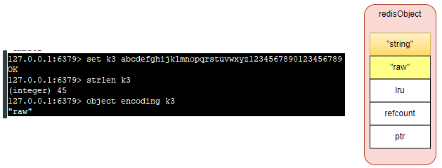
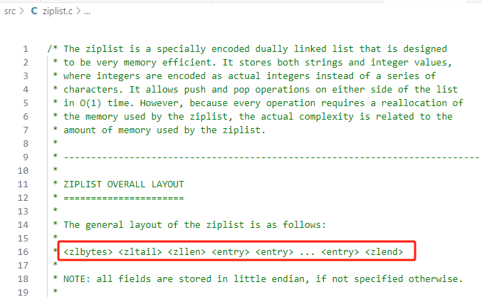
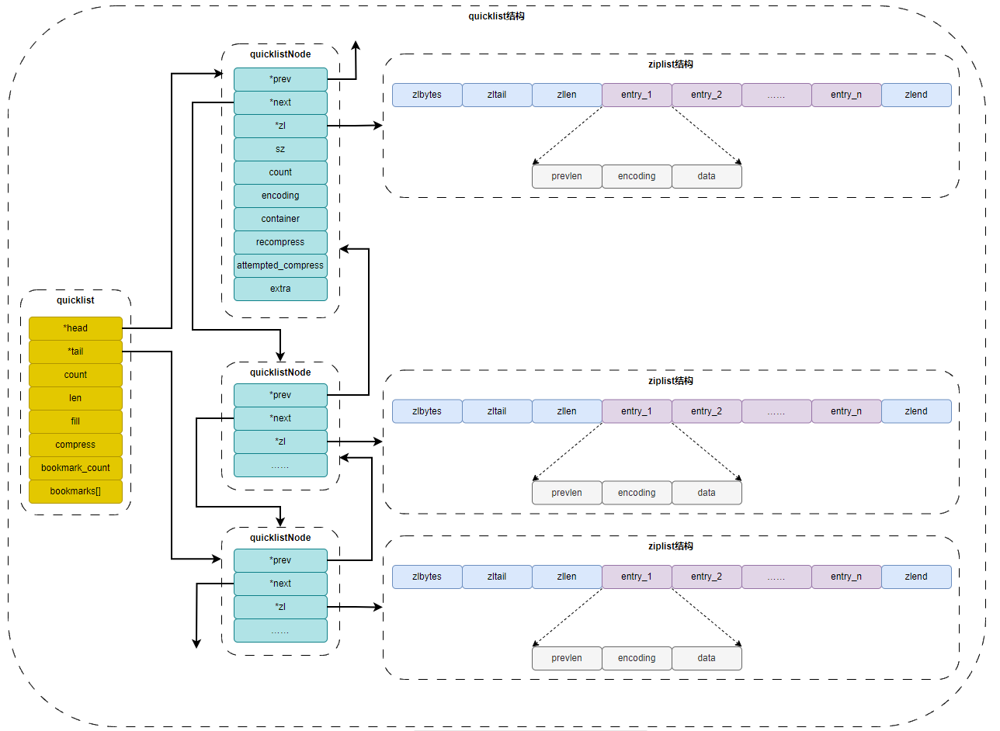
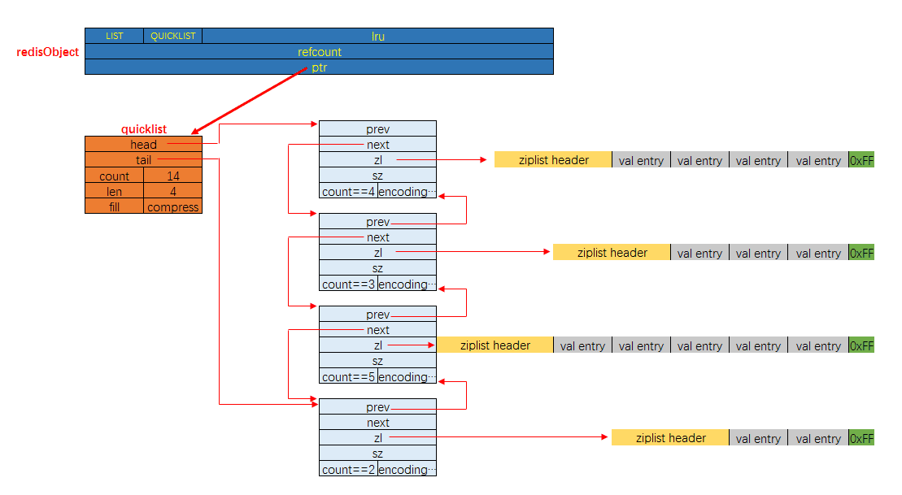
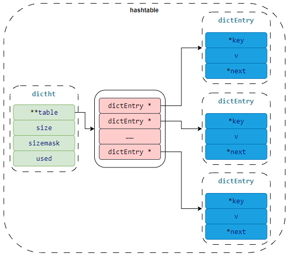
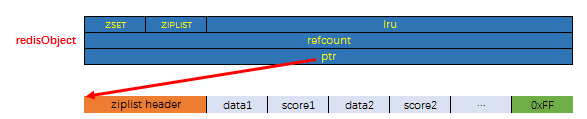
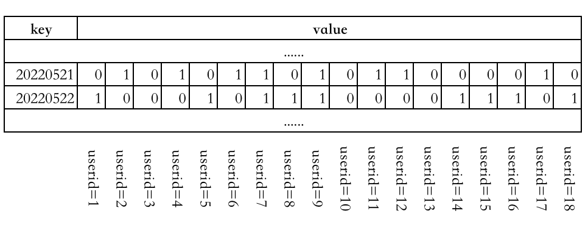

# 2. 数据类型

这里说的数据类型是指实际开发过程中，保存到 redis 的数据的类型，也就是 value 的类型，key 的类型是 string。

Redis使用对象来表示每一个键值对，在Redis中创建的每一个键值对，Redis都会为我们创建至少两个RedisObject对象，一个是键对象，即key，一个是值对象，即value。键对象的数据结构为字符串，而值对象因其保存的数据内容不一样，因而其使用的数据结构也不一样。`
`事实上，数据库中的每个键、值, 以及 Redis 本身处理的参数, 都表示为这种数据类型.


### 2.1. redis 中的数据结构

也可以说是 redis 的编码。

#### 2.1.1. SDS





#### 2.1.2. ziplist




#### 2.1.3. quicklist





#### 2.1.4. hashtable




#### 2.1.5. skiplist


#### 其他 




### 2.2. 基本数据类型

#### 2.2.1. 字符串 string

1. **应用场景**

   - 任何需要存储字符串的场景都可以
   - 特殊场景：会话信息的存储、token 的存储、

2. **命令**

   - 单键操作：get、getrange、getset、set、setrange、setnx、append、strlen
   - 多键操作：mset、msetnx、mget
   - 数字操作：incr、decr、incrby、decrby、incrbyfloat、decrbyfloat


   | 命令                                                 | 描述                                                                                             | 时间复杂度            |
   | ------------------------------------------------------ | -------------------------------------------------------------------------------------------------- | ----------------------- |
   | set key value [ex seconds] [px milliseconds] [nx xx] | 设置值                                                                                           | O(1)                  |
   | get key                                              | 获取值                                                                                           | O(1)                  |
   | del key [key ...]                                    | 删除key                                                                                          | O(N)(N是键的个数)     |
   | mset key [key value ...]                             | 批量设置值                                                                                       | O(N)(N是键的个数)     |
   | mget key [key ...]                                   | 批量获取值                                                                                       | O(N)(N是键的个数)     |
   | incr key                                             | 将 key 中储存的数字值增一                                                                        | O(1)                  |
   | decr key                                             | 将 key 中储存的数字值减一                                                                        | O(1)                  |
   | incrby key increment                                 | 将 key 所储存的值加上给定的增量值（increment）                                                   | O(1)                  |
   | decrby key increment key                             | 所储存的值减去给定的减量值（decrement）                                                          | O(1)                  |
   | incrbyfloat key increment                            | 将 key 所储存的值加上给定的浮点增量值（increment）                                               | O(1)                  |
   | append key value                                     | 如果 key 已经存在并且是一个字符串， APPEND 命令将指定的 value 追加到该 key 原来值（value）的末尾 | O(1)                  |
   | strlen key                                           | 返回 key 所储存的字符串值的长度。                                                                | O(1)                  |
   | setrange key offset value                            | 用 value 参数覆写给定 key 所储存的字符串值，从偏移量 offset 开始                                 | O(1)                  |
   | getrange key start end                               | 返回 key 中字符串值的子字符                                                                      | O(N)(N是字符串的长度) |

   ::: details string实战
   @[code](./include/string.log)
   :::

3. **存储结构**

  ```log
    // int
    127.0.0.1:6379> set k1 1
    OK
    127.0.0.1:6379> object encoding k1
    "int"
    127.0.0.1:6379> type k1
    string

    127.0.0.1:6379> set k2 abcdefghijklmnopqrstuvwxyz123456789012345678
    OK
    127.0.0.1:6379> strlen k2
    (integer) 44
    127.0.0.1:6379> object encoding k2
    "embstr"
    127.0.0.1:6379> type k2
    string

    127.0.0.1:6379> set k3 abcdefghijklmnopqrstuvwxyz1234567890123456789
    OK
    127.0.0.1:6379> strlen k3
    (integer) 45
    127.0.0.1:6379> object encoding k3
    "raw"
    127.0.0.1:6379> type k3
    string

  ```

  底层数据结构为SDS，但是根据保存的数据的类型以及数据长度，分为三种：

   - **int 编码**：保存的是可以用 long 类型表示的整数值。
   - **embstr 编码**：保存长度小于等于44字节的字符串（redis3.2版本之前是39字节，之后是44字节）。
   - **raw 编码**：保存长度大于44字节的字符串（redis3.2版本之前是39字节，之后是44字节）。
   - int： 存储的是整数且长度小于20字节，保存的是可以用 long 类型表示的整数值。
   - embstr： 存储的是字符串且长度小于等于44字节【redis3.2版本之前是39字节，之后是44字节】
   - raw： 存储的是动态字符串，且长度大于44字节且小于512Mb
     - redis 2.+ 是 32 字节
     - redis 3.0-4.0 是 39 字节
     - redis 5.0 是 44 字节

  其实 embstr 编码是专门用来保存短字符串的一种优化编码，raw 和 embstr 的区别： embstr与raw都使用redisObject和sds保存数据，区别在于，embstr的使用只分配一次内存空间（因此redisObject和sds是连续的），而raw需要分配两次内存空间（分别为redisObject和sds分配空间）。因此与raw相比，embstr的好处在于创建时少分配一次空间，删除时少释放一次空间，以及对象的所有数据连在一起，寻找方便。而embstr的坏处也很明显，如果字符串的长度增加需要重新分配内存时，整个redisObject和sds都需要重新分配空间，因此redis中的embstr实现为只读。

  > ps： **Redis中对于浮点数类型也是作为字符串保存的，在需要的时候再将其转换成浮点数类型**。

#### 2.2.2. 列表 list

List的数据结构，适合保存 `可以重复的、有序的数据集合`。

1. **应用场景**

   - lpush+lpop=Stack（栈）
   - lpush+rpop=Queue（队列）
   - lpush+ltrim=Capped Collection（有限集合）
   - lpush+brpop=Message Queue（消息队列）

2. **命令**

   - lpush
   - lrange
   - rpush
   - lpop
   - rpop
   - lindex
   - linsert
   - lset
   - ltrim
   - llen
   - lrem

   | 命令                                  | 描述                                                                  | 时间复杂度 |
   | --------------------------------------- | ------------------ | ------------ |
   | BLPOP key [key …] timeout            | 删除，并获得该列表中的第一元素，或阻塞，直到有一个可用                | O(1)       |
   | BRPOP key [key …] timeout            | 删除，并获得该列表中的最后一个元素，或阻塞，直到有一个可用            | O(1)       |
   | BRPOPLPUSH source destination timeout | 弹出一个列表的值，将它推到另一个列表，并返回它;或阻塞，直到有一个可用 | O(1)       |
   | LINDEX key index                      | 获取一个元素，通过其索引列表                                          | O(N)       |
   | LINSERT key BEFORE AFTER pivot value  | 在列表中的另一个元素之前或之后插入一个元素                            | O(N)       |
   | LLEN key                              | 获得队列(List)的长度                                                  | O(1)       |
   | LPOP key                              | 从队列的左边出队一个元素                                              | O(1)       |
   | LPUSH key value [value …]            | 从队列的左边入队一个或多个元素                                        | O(1)       |
   | LPUSHX key value                      | 当队列存在时，从队到左边入队一个元素                                  | O(1)       |
   | LRANGE key start stop                 | 从列表中获取指定返回的元素                                            | O(S+N)     |
   | LREM key count value                  | 从列表中删除元素                                                      | O(N)       |
   | LSET key index value                  | 设置队列里面一个元素的值                                              | O(N)       |
   | LTRIM key start stop                  | 修剪到指定范围内的清单                                                | O(N)       |
   | RPOP key                              | 从队列的右边出队一个元                                                | O(1)       |
   | RPOPLPUSH source destination          | 删除列表中的最后一个元素，将其追加到另一个列表                        | O(1)       |
   | RPUSH key value [value …]            | 从队列的右边入队一个元素                                              | O(1)       |
   | RPUSHX key value                      | 从队列的右边入队一个元素，仅队列存在时有效                            | O(1)       |

3. **存储结构**

   ```log
   
    127.0.0.1:6379> lpush mylist 1 2 ll ls mem
    (integer) 5
    127.0.0.1:6379> lrange mylist 0 -1
    1) "mem"
    2) "ls"
    3) "ll"
    4) "2"
    5) "1"
    127.0.0.1:6379> lindex mylist -1
    "1"
    127.0.0.1:6379> lindex mylist 10        # index不在 mylist 的区间范围内
    (nil)
   127.0.0.1:6379> lpush mylist 1 2 ll ls mem
   (integer) 5
   127.0.0.1:6379> object encoding mylist
   "quicklist"

   127.0.0.1:6379> lpush mylist \xe7\xbb\x83\xe6\xb0\x94\xe5\x8a\x9f\xe4\xb8\xba\xe4\xba\x86\xe5\xba\xb7\xe5\xa4\x8d\xe4\xbd\x93\xe8\xb4\xa8\xef\xbc\x8c\xe7\x99\xbe\xe7\x97\x85\xe4\xb8\x8d\xe7\x94\x9f\xef\xbc\x8c\xe5\x8f\xaf\xe6\x98\xaf\xe5\x90\x84\xe4\xba\xba\xe7\xbb\x83\xe5\x8a\x9f\xe5\x8a\x9f\xe6\x95\x88\xe6\x9c\x89\xe5\x88\xab\xef\xbc\x8c\xe4\xbd\x93\xe8\xb4\xa8\xe5\xbc\xba\xe8\x80\x85\xe5\x8a\x9f\xe6\x95\x88\xe5\xbf\xab\xef\xbc\x8c\xe4\xbd\x93\xe8\xb4\xa8\xe5\xbc\xb1\xe8\x80\x85\xe5\x8a\x9f\xe6\x95\x88\xe6\x85\xa2\xe3\x80\x82\xe5\x9b\xa0\xe6\xad\xa4\xef\xbc\x8c\xe4\xb8\x8d\xe9\xa1\xbb\xe6\x80\xa5\xe4\xba\x8e\xe6\xb1\x82\xe6\x95\x88\xef\xbc\x8c\xe5\x8f\xaa\xe6\x9c\x89\xe6\x8a\x8a\xe7\xad\x91\xe5\x9f\xba\xe5\x8a\x9f\xe5\xa4\xab\xe7\xbb\x83\xe6\x88\x90\xef\xbc\x8c\xe6\x89\x8d\xe6\x9c\x89\xe6\x97\xa5\xe6\x96\xb0\xe6\x9c\x88\xe5\xbc\x82\xe7\x9a\x84\xe6\x95\x88\xe6\x9e\x9c\xe3\x80\x82\xef\xbc\x88\xe3\x80\x8a\xe6\x82\x9f\xe7\x9c\x9f\xe7\xaf\x87\xe3\x80\x8b\xef\xbc\x9a\xe3\x80\x8c\xe8\xa6\x81\xe5\xbe\x97\xe8\xb0\xb7\xe6\x9f\x9b\xe9\x95\xbf\xe4\xb8\x8d\xe6\xad\xbb\xef\xbc\x8c\xe9\xa1\xbb\xe5\x87\xad\xe7\x8e\x84\xe7\x89\x9d\xe7\xab\x8b\xe6\xa0\xb9\xe5\x9f\xba\xe3\x80\x82\xe3\x80\x8d\xef\xbc\x89\xe6\xaf\x8f\xe4\xba\x8e\xe9\x9d\x99\xe5\x9d\x90\xe4\xb9\x8b\xe5\x89\x8d\xef\xbc\x8c\xe5\x8a\xa1\xe8\xa6\x81\xe6\x89\xab\xe9\x99\xa4\xe4\xb8\x80\xe5\x88\x87\xe6\x9d\x82\xe5\xbf\xb5\xef\xbc\x8c\xe5\xae\xbd\xe8\xa1\xa3\xe6\x9d\xbe\xe5\xb8\xa6\xef\xbc\x8c\xe8\xba\xab\xe4\xbd\x93\xe4\xb8\x8d\xe5\x8f\x97\xe6\x9d\x9f\xe7\xbc\x9a\xef\xbc\x8c\xe7\xab\xaf\xe5\x9d\x90\xe5\x9c\xa8\xe6\xa4\x85\xe5\xad\x90\xe4\xb8\x8a\xef\xbc\x8c\xe4\xb8\xa4\xe8\x85\xbf\xe5\x9e\x82\xe5\x9c\xb0\xef\xbc\x8c\xe4\xb8\xa4\xe6\x89\x8b\xe6\x94\xbe\xe5\x9c\xa8\xe8\x86\x9d\xe7\x9b\x96\xe4\xb8\x8a\xe3\x80\x82\xe6\x8a\x8a\xe4\xb8\xa4\xe7\x9b\xae\xe5\xbc\xa0\xe5\xbc\x80\xef\xbc\x8c\xe5\x90\x91\xe5\x89\x8d\xe5\xb9\xb3\xe8\xa7\x86\xef\xbc\x8c\xe6\x8a\x8a\xe7\x9b\xae\xe5\x85\x89\xe5\x87\x9d\xe8\xa7\x86\xe4\xba\x8e\xe4\xb8\xa4\xe7\x9c\xbc\xe4\xb9\x8b\xe5\x89\x8d\xe7\x9a\x84\xe6\xad\xa3\xe4\xb8\xad\xe5\xa4\x84\xef\xbc\x8c\xe7\x9c\xbc\xe7\x8f\xa0\xe5\xb0\xbd\xe9\x87\x8f\xe4\xbf\x9d\xe6\x8c\x81\xe4\xb8\x8d\xe5\x8a\xa8\xef\xbc\x8c\xe6\x85\xa2\xe6\x85\xa2\xe5\x9c\xb0\xe6\x94\xb6\xe5\x9b\x9e\xe7\x9b\xae\xe5\x85\x89\xef\xbc\x8c\xe4\xb8\x8d\xe5\x81\x8f\xe4\xb8\x8d\xe4\xbe\x9d\xe5\x9c\xb0\xe9\x9a\x8f\xe5\xbf\x83\xe6\x84\x8f\xe6\x94\xbe\xe5\x9c\xa8\xe4\xb8\xa4\xe7\x9c\xbc\xe4\xb8\xad\xe9\x97\xb4\xe8\xa2\x93\xe7\xaa\x8d\xe7\xa9\xb4\xe9\x87\x8c\xef\xbc\x8c\xe5\x8d\x8a\xe7\x9d\x81\xe5\x8d\x8a\xe9\x97\xad\xef\xbc\x8c\xe5\xa4\x96\xe9\x97\xad\xe5\x86\x85\xe7\x9d\x81\xe8\xa7\x82\xe7\x9c\x8b\xe9\xbc\xbb\xe7\xab\xaf\xe8\xa2\x93\xe7\xaa\x8d\xe7\xa9\xb4\xe5\x86\x85\xe7\x9a\x84\xe3\x80\x8c\xe7\xa9\xba\xe8\x99\x9a\xe4\xb9\x8b\xe5\x85\x89\xe3\x80\x8d\xef\xbc\x8c\xe7\x94\xa8\xe6\x84\x8f\xe4\xb8\x8d\xe7\x94\xa8\xe5\x8a\x9b\xe3\x80\x81\xe4\xbc\xbc\xe8\xa7\x82\xe9\x9d\x9e\xe8\xa7\x82\xef\xbc\x8c\xe8\xa7\x82\xe5\x88\xb0\xe8\xa2\x93\xe7\xaa\x8d\xe5\x86\x85\xe5\x8f\x91\xe8\x83\x80\xe3\x80\x81\xe5\x8f\x91\xe7\xb4\xa7\xe3\x80\x81\xe6\x84\x9f\xe5\x88\xb0\xe6\xb8\xa9\xe6\x9a\x96\xef\xbc\x8c\xe8\xbe\xbe\xe5\x88\xb0\xe8\xbf\x99\xe4\xb8\xaa\xe7\x9a\x84\xe6\xa0\x87\xe5\x87\x86\xe6\x97\xb6\xef\xbc\x8c\xe5\x86\x8d\xe7\x94\xa8\xe6\x84\x8f\xe5\xbf\xb5\xe8\xbd\xbb\xe8\xbd\xbb\xe5\x9c\xb0\xe5\xbc\x95\xe3\x80\x8c\xe7\xa9\xba\xe8\x99\x9a\xe4\xb9\x8b\xe5\x85\x89\xe3\x80\x8d\xe5\x90\x91\xe8\x84\x90\xe4\xb8\x8b\xe4\xb8\xb9\xe7\x94\xb0\xe7\x85\xa7\xe8\xa7\x86\xef\xbc\x8c\xe5\x86\x85\xe8\xa7\x86\xe8\x85\xb9\xe4\xb8\xad\xe4\xb8\x80\xe4\xb8\xaa\xe8\x99\x9a\xe7\xa9\xba\xe5\xa2\x83\xe5\x9c\xb0\xef\xbc\x8c\xe8\xa6\x81\xe6\x9c\x97\xe5\xbd\xbb\xe5\x85\xb6\xe5\x85\x89\xef\xbc\x8c\xe5\xa6\x82\xe5\x90\x8c\xe5\xa4\xa9\xe7\xa9\xba\xe6\x97\xa0\xe4\xba\x91\xe9\x81\xae\xe8\x94\xbd\xe6\x97\xb6\xe5\xa4\xaa\xe9\x98\xb3\xe7\x85\xa7\xe5\xb0\x84\xe5\xa4\xa7\xe5\x9c\xb0\xe4\xb8\x80\xe6\xa0\xb7\xe3\x80\x82\xe9\x9d\x99\xe8\x87\xb3\xe4\xba\x8e\xe6\x9e\x81\xef\xbc\x8c\xe5\x88\xb0\xe6\x97\xa0\xe6\x88\x91\xe6\x97\xa0\xe7\x9b\xb8\xe6\x97\xb6\xef\xbc\x8c\xe5\xb0\xb1\xe4\xba
   (integer) 6
   127.0.0.1:6379> object encoding mylist
   "quicklist"
   127.0.0.1:6379> type mylist
   list

   ```

- Redis3.2版本以前： 内部编码方式有两种
  - **ziplist**（压缩列表）：当列表的元素个数小于 `list-max-ziplist-entries` 配置（`默认512个`），同时列表中每个元素的值都小于 `list-max-ziplist-value` 配置时（`默认64字节`），Redis会选用ziplist来作为列表的内部实现来减少内存的使用。
  - **linkedlist**（链表）：当列表类型无法满足ziplist的条件时，Redis会使用linkedlist作为列表的内部实现。
- Redis3.2版本开始， 使用 quicklist 代替了 ziplist 和 linkedlist
- Redis 5.0 设计了新的数据结构 listpack，沿用了压缩列表紧凑型的内存布局，最终在最新的 Redis 版本，将 Hash 对象和 Zset 对象的底层数据结构实现之一的压缩列表，替换成由 listpack 实现
- 进一步的, 目前Redis定义的10个对象编码方式宏名中, 有两个被完全闲置了, 分别是: OBJ_ENCODING_ZIPMAP与OBJ_ENCODING_LINKEDLIST。 从Redis的演进历史上来看, 前者是后续可能会得到支持的编码值（代码还在）, 后者则应该是被彻底淘汰了)

4. **其它**

#### 2.2.3. 集合 set

保存不可重复的、无序的元素集合。

1. **应用场景**

   - 任何用来去重的场景和保证数据唯一性的场景
   - 求交差并补集合
   - 我关注的、关注我的
   - **标签**（tag）,给用户添加标签，或者用户给消息添加标签，这样有同一标签或者类似标签的可以给推荐关注的事或者关注的人。
   - **点赞，或点踩，收藏等**，可以放到set中实现

2. **命令**

   - sadd
   - smembers
   - scard
   - sismember
   - smove
   - srem
   - spop
   - srandmember
   - sinter
   - sinterstore
   - sunion
   - sunionstore
   - sdiff
   - sdiffstore


| 命令                                           | 描述                                           | 时间复杂度 |
| ------------------------------------------------ | ------------------------------------------------ | ------------ |
| SADD key member [member …]                    | 添加一个或者多个元素到集合(set)里              | O(N)       |
| SCARD key                                      | 获取集合里面的元素数量                         | O(1)       |
| SDIFF key [key …]                             | 获得队列不存在的元素                           | O(N)       |
| SDIFFSTORE destination key [key …]            | 获得队列不存在的元素，并存储在一个关键的结果集 | O(N)       |
| SINTER key [key …]                            | 获得两个集合的交集                             | O(N*M)     |
| SINTERSTORE destination key [key …]           | 获得两个集合的交集，并存储在一个关键的结果集   | O(N*M)     |
| SISMEMBER key member                           | 确定一个给定的值是一个集合的成员               | O(1)       |
| SMEMBERS key                                   | 获取集合里面的所有元素                         | O(N)       |
| SMOVE source destination member                | 移动集合里面的一个元素到另一个集合             | O(1)       |
| SPOP key [count]                               | 删除并获取一个集合里面的元素                   | O(1)       |
| SRANDMEMBER key [count]                        | 从集合里面随机获取一个元素                     |            |
| SREM key member [member …]                    | 从集合里删除一个或多个元素                     | O(N)       |
| SUNION key [key …]                            | 添加多个set元素                                | O(N)       |
| SUNIONSTORE destination key [key …]           | 合并set元素，并将结果存入新的set里面           | O(N)       |
| SSCAN key cursor [MATCH pattern] [COUNT count] | 迭代set里面的元素                              | O(1)       |

3. **存储结构**

   ```log
   127.0.0.1:6379> sadd myset hao hao1 xiaohao hao
   (integer) 3
   127.0.0.1:6379> object encoding myset
   "hashtable"
   127.0.0.1:6379> sadd myset2 12 123 432 1235
   (integer) 4
   127.0.0.1:6379> object encoding myset2
   "intset"
   127.0.0.1:6379> type myset
   set
   127.0.0.1:6379> type myset2
   set


   ```

   - `intset` ： 当【**集合中的元素都是整数】**且【**元素个数小于 **`**set-maxintset-entries**`** 配置（默认512个）】**时，Redis会选用intset来作为集合的内部实现，从而减少内存的使用。
   - `hashtable` ： 集合类型无法满足intset的条件时，Redis会使用hashtable作为集合的内部实现。

4. **其它**

#### 2.2.4. 有序集合 zset

保存 `不可重复、具有顺序`的元素集合，保存的元素不能重复，但是分数可以重复。

1. **应用场景**

   - 微博中的热搜等场景
   - 排行榜：有序集合经典使用场景。例如小说视频等网站需要对用户上传的小说视频做排行榜，榜单可以按照用户关注数，更新时间，字数等打分，做排行。

2. **命令**

   - zadd
   - zrange
   - zrem
   - zscore
   - zrangebyscore
   - zrank
   - zcard
   - zcount
   - zincrby
   - zrevrank
   - zremrangebyrank
   - zremrangebyscore
   - zinterstore
   - zunionstore


   | 命令                                                           | 描述                                                                       | 时间复杂度       |
   | ---------------------------------------------------------------- | ---------------------------------------------------------------------------- | ------------------ |
   | BZPOPMAX key [key …] timeout                                  | 从一个或多个排序集中删除并返回得分最高的成员，或阻塞，直到其中一个可用为止 | O(log(N))        |
   | BZPOPMIN key [key …] timeout                                  | 从一个或多个排序集中删除并返回得分最低的成员，或阻塞，直到其中一个可用为止 | O(log(N))        |
   | ZADD key [NXXX] [CH] [INCR] score member [score member …]     | 添加到有序set的一个或多个成员，或更新的分数，如果它已经存在                | O(log(N))        |
   | ZCARD key                                                      | 获取一个排序的集合中的成员数量                                             | O(1)             |
   | ZCOUNT key min max                                             | 返回分数范围内的成员数量                                                   | O(log(N))        |
   | ZINCRBY key increment member                                   | 增量的一名成员在排序设置的评分                                             | O(log(N))        |
   | ZINTERSTORE                                                    | 相交多个排序集，导致排序的设置存储在一个新的关键                           | O(NK)+O(Mlog(M)) |
   | ZLEXCOUNT key min max                                          | 返回成员之间的成员数量                                                     | O(log(N))        |
   | ZPOPMAX key [count]                                            | 删除并返回排序集中得分最高的成员                                           | O(log(N)*M)      |
   | ZPOPMIN key [count]                                            | 删除并返回排序集中得分最低的成员                                           | O(log(N)*M)      |
   | ZRANGE key start stop [WITHSCORES]                             | 根据指定的index返回，返回sorted set的成员列表                              | O(log(N)+M)      |
   | ZRANGEBYLEX key min max [LIMIT offset count]                   | 返回指定成员区间内的成员，按字典正序排列, 分数必须相同。                   | O(log(N)+M)      |
   | ZREVRANGEBYLEX key max min [LIMIT offset count]                | 返回指定成员区间内的成员，按字典倒序排列, 分数必须相同                     | O(log(N)+M)      |
   | ZRANGEBYSCORE key min max [WITHSCORES] [LIMIT offset count]    | 返回有序集合中指定分数区间内的成员，分数由低到高排序。                     | O(log(N)+M)      |
   | ZRANK key member                                               | 确定在排序集合成员的索引                                                   | O(log(N))        |
   | ZREM key member [member …]                                    | 从排序的集合中删除一个或多个成员                                           | O(M*log(N))      |
   | ZREMRANGEBYLEX key min max                                     | 删除名称按字典由低到高排序成员之间所有成员。                               | O(log(N)+M)      |
   | ZREMRANGEBYRANK key start stop                                 | 在排序设置的所有成员在给定的索引中删除                                     | O(log(N)+M)      |
   | ZREMRANGEBYSCORE key min max                                   | 删除一个排序的设置在给定的分数所有成员                                     | O(log(N)+M)      |
   | ZREVRANGE key start stop [WITHSCORES]                          | 在排序的设置返回的成员范围，通过索引，下令从分数高到低                     | O(log(N)+M)      |
   | ZREVRANGEBYSCORE key max min [WITHSCORES] [LIMIT offset count] | 返回有序集合中指定分数区间内的成员，分数由高到低排序。                     | O(log(N)+M)      |
   | ZREVRANK key member                                            | 确定指数在排序集的成员，下令从分数高到低                                   | O(log(N))        |
   | ZSCORE key member                                              | 获取成员在排序设置相关的比分                                               | O(1)             |
   | ZUNIONSTORE                                                    | 添加多个排序集和导致排序的设置存储在一个新的关键                           | O(N)+O(M log(M)) |
   | ZSCAN key cursor [MATCH pattern] [COUNT count]                 | 迭代sorted sets里面的元素                                                  | O(1)             |

3. **存储结构**

   ```log
   127.0.0.1:6379> zadd myscoreset 100 hao 90 xiaohao
   (integer) 2
   127.0.0.1:6379> object encoding myscoreset
   "ziplist"
   127.0.0.1:6379> zadd myscoreset 80 \xe7\xbb\x83\xe6\xb0\x94\xe5\x8a\x9f\xe4\xb8\xba\xe4\xba\x86\xe5\xba\xb7\xe5\xa4\x8d\xe4\xbd\x93\xe8\xb4\xa8\xef\xbc\x8c\xe7\x99\xbe\xe7\x97\x85\xe4\xb8\x8d\xe7\x94\x9f\xef\xbc\x8c\xe5\x8f\xaf\xe6\x98\xaf\xe5\x90\x84\xe4\xba\xba\xe7\xbb\x83\xe5\x8a\x9f\xe5\x8a\x9f\xe6\x95\x88\xe6\x9c\x89\xe5\x88\xab\xef\xbc\x8c\xe4\xbd\x93\xe8\xb4\xa8\xe5\xbc\xba\xe8\x80\x85\xe5\x8a\x9f\xe6\x95\x88\xe5\xbf\xab\xef\xbc\x8c\xe4\xbd\x93\xe8\xb4\xa8\xe5\xbc\xb1\xe8\x80\x85\xe5\x8a\x9f\xe6\x95\x88\xe6\x85\xa2\xe3\x80\x82\xe5\x9b\xa0\xe6\xad\xa4\xef\xbc\x8c\xe4\xb8\x8d\xe9\xa1\xbb\xe6\x80\xa5\xe4\xba\x8e\xe6\xb1\x82\xe6\x95\x88\xef\xbc\x8c\xe5\x8f\xaa\xe6\x9c\x89\xe6\x8a\x8a\xe7\xad\x91\xe5\x9f\xba\xe5\x8a\x9f\xe5\xa4\xab\xe7\xbb\x83\xe6\x88\x90\xef\xbc\x8c\xe6\x89\x8d\xe6\x9c\x89\xe6\x97\xa5\xe6\x96\xb0\xe6\x9c\x88\xe5\xbc\x82\xe7\x9a\x84\xe6\x95\x88\xe6\x9e\x9c\xe3\x80\x82\xef\xbc\x88\xe3\x80\x8a\xe6\x82\x9f\xe7\x9c\x9f\xe7\xaf\x87\xe3\x80\x8b\xef\xbc\x9a\xe3\x80\x8c\xe8\xa6\x81\xe5\xbe\x97\xe8\xb0\xb7\xe6\x9f\x9b\xe9\x95\xbf\xe4\xb8\x8d\xe6\xad\xbb\xef\xbc\x8c\xe9\xa1\xbb\xe5\x87\xad\xe7\x8e\x84\xe7\x89\x9d\xe7\xab\x8b\xe6\xa0\xb9\xe5\x9f\xba\xe3\x80\x82\xe3\x80\x8d\xef\xbc\x89\xe6\xaf\x8f\xe4\xba\x8e\xe9\x9d\x99\xe5\x9d\x90\xe4\xb9\x8b\xe5\x89\x8d\xef\xbc\x8c\xe5\x8a\xa1\xe8\xa6\x81\xe6\x89\xab\xe9\x99\xa4\xe4\xb8\x80\xe5\x88\x87\xe6\x9d\x82\xe5\xbf\xb5\xef\xbc\x8c\xe5\xae\xbd\xe8\xa1\xa3\xe6\x9d\xbe\xe5\xb8\xa6\xef\xbc\x8c\xe8\xba\xab\xe4\xbd\x93\xe4\xb8\x8d\xe5\x8f\x97\xe6\x9d\x9f\xe7\xbc\x9a\xef\xbc\x8c\xe7\xab\xaf\xe5\x9d\x90\xe5\x9c\xa8\xe6\xa4\x85\xe5\xad\x90\xe4\xb8\x8a\xef\xbc\x8c\xe4\xb8\xa4\xe8\x85\xbf\xe5\x9e\x82\xe5\x9c\xb0\xef\xbc\x8c\xe4\xb8\xa4\xe6\x89\x8b\xe6\x94\xbe\xe5\x9c\xa8\xe8\x86\x9d\xe7\x9b\x96\xe4\xb8\x8a\xe3\x80\x82\xe6\x8a\x8a\xe4\xb8\xa4\xe7\x9b\xae\xe5\xbc\xa0\xe5\xbc\x80\xef\xbc\x8c\xe5\x90\x91\xe5\x89\x8d\xe5\xb9\xb3\xe8\xa7\x86\xef\xbc\x8c\xe6\x8a\x8a\xe7\x9b\xae\xe5\x85\x89\xe5\x87\x9d\xe8\xa7\x86\xe4\xba\x8e\xe4\xb8\xa4\xe7\x9c\xbc\xe4\xb9\x8b\xe5\x89\x8d\xe7\x9a\x84\xe6\xad\xa3\xe4\xb8\xad\xe5\xa4\x84\xef\xbc\x8c\xe7\x9c\xbc\xe7\x8f\xa0\xe5\xb0\xbd\xe9\x87\x8f\xe4\xbf\x9d\xe6\x8c\x81\xe4\xb8\x8d\xe5\x8a\xa8\xef\xbc\x8c\xe6\x85\xa2\xe6\x85\xa2\xe5\x9c\xb0\xe6\x94\xb6\xe5\x9b\x9e\xe7\x9b\xae\xe5\x85\x89\xef\xbc\x8c\xe4\xb8\x8d\xe5\x81\x8f\xe4\xb8\x8d\xe4\xbe\x9d\xe5\x9c\xb0\xe9\x9a\x8f\xe5\xbf\x83\xe6\x84\x8f\xe6\x94\xbe\xe5\x9c\xa8\xe4\xb8\xa4\xe7\x9c\xbc\xe4\xb8\xad\xe9\x97\xb4\xe8\xa2\x93\xe7\xaa\x8d\xe7\xa9\xb4\xe9\x87\x8c\xef\xbc\x8c\xe5\x8d\x8a\xe7\x9d\x81\xe5\x8d\x8a\xe9\x97\xad\xef\xbc\x8c\xe5\xa4\x96\xe9\x97\xad\xe5\x86\x85\xe7\x9d\x81\xe8\xa7\x82\xe7\x9c\x8b\xe9\xbc\xbb\xe7\xab\xaf\xe8\xa2\x93\xe7\xaa\x8d\xe7\xa9\xb4\xe5\x86\x85\xe7\x9a\x84\xe3\x80\x8c\xe7\xa9\xba\xe8\x99\x9a\xe4\xb9\x8b\xe5\x85\x89\xe3\x80\x8d\xef\xbc\x8c\xe7\x94\xa8\xe6\x84\x8f\xe4\xb8\x8d\xe7\x94\xa8\xe5\x8a\x9b\xe3\x80\x81\xe4\xbc\xbc\xe8\xa7\x82\xe9\x9d\x9e\xe8\xa7\x82\xef\xbc\x8c\xe8\xa7\x82\xe5\x88\xb0\xe8\xa2\x93\xe7\xaa\x8d\xe5\x86\x85\xe5\x8f\x91\xe8\x83\x80\xe3\x80\x81\xe5\x8f\x91\xe7\xb4\xa7\xe3\x80\x81\xe6\x84\x9f\xe5\x88\xb0\xe6\xb8\xa9\xe6\x9a\x96\xef\xbc\x8c\xe8\xbe\xbe\xe5\x88\xb0\xe8\xbf\x99\xe4\xb8\xaa\xe7\x9a\x84\xe6\xa0\x87\xe5\x87\x86\xe6\x97\xb6\xef\xbc\x8c\xe5\x86\x8d\xe7\x94\xa8\xe6\x84\x8f\xe5\xbf\xb5\xe8\xbd\xbb\xe8\xbd\xbb\xe5\x9c\xb0\xe5\xbc\x95\xe3\x80\x8c\xe7\xa9\xba\xe8\x99\x9a\xe4\xb9\x8b\xe5\x85\x89\xe3\x80\x8d\xe5\x90\x91\xe8\x84\x90\xe4\xb8\x8b\xe4\xb8\xb9\xe7\x94\xb0\xe7\x85\xa7\xe8\xa7\x86\xef\xbc\x8c\xe5\x86\x85\xe8\xa7\x86\xe8\x85\xb9\xe4\xb8\xad\xe4\xb8\x80\xe4\xb8\xaa\xe8\x99\x9a\xe7\xa9\xba\xe5\xa2\x83\xe5\x9c\xb0\xef\xbc\x8c\xe8\xa6\x81\xe6\x9c\x97\xe5\xbd\xbb\xe5\x85\xb6\xe5\x85\x89\xef\xbc\x8c\xe5\xa6\x82\xe5\x90\x8c\xe5\xa4\xa9\xe7\xa9\xba\xe6\x97\xa0\xe4\xba\x91\xe9\x81\xae\xe8\x94\xbd\xe6\x97\xb6\xe5\xa4\xaa\xe9\x98\xb3\xe7\x85\xa7\xe5\xb0\x84\xe5\xa4\xa7\xe5\x9c\xb0\xe4\xb8\x80\xe6\xa0\xb7\xe3\x80\x82\xe9\x9d\x99\xe8\x87\xb3\xe4\xba\x8e\xe6\x9e\x81\xef\xbc\x8c\xe5\x88\xb0\xe6\x97\xa0\xe6\x88\x91\xe6\x97\xa0\xe7\x9b\xb8\xe6\x97\xb6\xef\xbc\x8c\xe5\xb0\xb1\xe4\xba
   (integer) 1
   127.0.0.1:6379> object encoding myscoreset
   "skiplist"

   127.0.0.1:6379> type myscoreset
   zset

   ```

- **`ziplist`**： 当数据比较少时，有序集合使用的是 ziplist 存储的，有序集合使用 ziplist 格式存储必须满足以下两个条件：
  - 元素个数小于 `zset-max-ziplist-entries（默认 128个）`
  - 所有元素成员的长度要小于 `zset-max-ziplist-value（默认 64字节）`
- **`skiplist`**： 如果不能满足以上两个条件中的任意一个，有序集合将会使用 skiplist 结构进行存储。

4. **其它**

#### 2.2.5. 散列 hash

1. **应用场景**

2. **命令**

   - hset
   - hsetnx
   - hmset
   - hget
   - hmget
   - hdel
   - hincrby
   - hkeys
   - hvals
   - hgetall
   - hincrbyfloat
   - hexists
   - hlen


   | 命令                                           | 描述                                           | 时间复杂度                 |
   | ------------------------------------------------ | ------------------------------------------------ | ---------------------------- |
   | HDEL key field [field …]                      | 删除一个或多个Hash的field                      | O(N) N是被删除的字段数量。 |
   | HEXISTS key field                              | 判断field是否存在于hash中                      | O(1)                       |
   | HGET key field                                 | 获取hash中field的值                            | O(1)                       |
   | HGETALL key                                    | 从hash中读取全部的域和值                       | O(N) N是Hash的长度         |
   | HINCRBY key field increment                    | 将hash中指定域的值增加给定的数字               | O(1)                       |
   | HINCRBYFLOAT key field increment               | 将hash中指定域的值增加给定的浮点数             | O(1)                       |
   | HKEYS key                                      | 获取hash的所有字段                             | O(N) N是Hash的长度         |
   | HLEN key                                       | 获取hash里所有字段的数量                       | O(1)                       |
   | HMGET key field [field …]                     | 获取hash里面指定字段的值                       | O(N) N是请求的字段数       |
   | HMSET key field value [field value …]         | 设置hash字段值                                 | O(N) N是设置的字段数       |
   | HSET key field value                           | 设置hash里面一个字段的值                       | O(1)                       |
   | HSETNX key field value                         | 设置hash的一个字段，只有当这个字段不存在时有效 | O(1)                       |
   | HSTRLEN key field                              | 获取hash里面指定field的长度                    | O(1)                       |
   | HVALS key                                      | 获得hash的所有值                               | O(N) N是Hash的长度         |
   | HSCAN key cursor [MATCH pattern] [COUNT count] | 迭代hash里面的元素                             |                            |

3. **存储结构**

   ```log
    127.0.0.1:6379> hset user name zhangshan
    (integer) 1
    127.0.0.1:6379> hset user email hao@163.com
    (integer) 1
    127.0.0.1:6379> hgetall user
    1) "name1"
    2) "hao"
    3) "email1"
    4) "hao@163.com"
    127.0.0.1:6379> hget user user
    (nil)
    127.0.0.1:6379> hget user name1
    "hao"
    127.0.0.1:6379> hset user name2 xiaohao
    (integer) 1
    127.0.0.1:6379> hset user email2 xiaohao@163.com
    (integer) 1
    127.0.0.1:6379> hgetall user
    1) "name1"
    2) "hao"
    3) "email1"
    4) "hao@163.com"
    5) "name2"
    6) "xiaohao"
    7) "email2"
    8) "xiaohao@163.com"

   127.0.0.1:6379> hset user name zhangshan
   (integer) 1
   127.0.0.1:6379> hset user email hao@163.com
   (integer) 1
   127.0.0.1:6379> object encoding user
   "ziplist"
   127.0.0.1:6379> hset user say \xe7\xbb\x83\xe6\xb0\x94\xe5\x8a\x9f\xe4\xb8\xba\xe4\xba\x86\xe5\xba\xb7\xe5\xa4\x8d\xe4\xbd\x93\xe8\xb4\xa8\xef\xbc\x8c\xe7\x99\xbe\xe7\x97\x85\xe4\xb8\x8d\xe7\x94\x9f\xef\xbc\x8c\xe5\x8f\xaf\xe6\x98\xaf\xe5\x90\x84\xe4\xba\xba\xe7\xbb\x83\xe5\x8a\x9f\xe5\x8a\x9f\xe6\x95\x88\xe6\x9c\x89\xe5\x88\xab\xef\xbc\x8c\xe4\xbd\x93\xe8\xb4\xa8\xe5\xbc\xba\xe8\x80\x85\xe5\x8a\x9f\xe6\x95\x88\xe5\xbf\xab\xef\xbc\x8c\xe4\xbd\x93\xe8\xb4\xa8\xe5\xbc\xb1\xe8\x80\x85\xe5\x8a\x9f\xe6\x95\x88\xe6\x85\xa2\xe3\x80\x82\xe5\x9b\xa0\xe6\xad\xa4\xef\xbc\x8c\xe4\xb8\x8d\xe9\xa1\xbb\xe6\x80\xa5\xe4\xba\x8e\xe6\xb1\x82\xe6\x95\x88\xef\xbc\x8c\xe5\x8f\xaa\xe6\x9c\x89\xe6\x8a\x8a\xe7\xad\x91\xe5\x9f\xba\xe5\x8a\x9f\xe5\xa4\xab\xe7\xbb\x83\xe6\x88\x90\xef\xbc\x8c\xe6\x89\x8d\xe6\x9c\x89\xe6\x97\xa5\xe6\x96\xb0\xe6\x9c\x88\xe5\xbc\x82\xe7\x9a\x84\xe6\x95\x88\xe6\x9e\x9c\xe3\x80\x82\xef\xbc\x88\xe3\x80\x8a\xe6\x82\x9f\xe7\x9c\x9f\xe7\xaf\x87\xe3\x80\x8b\xef\xbc\x9a\xe3\x80\x8c\xe8\xa6\x81\xe5\xbe\x97\xe8\xb0\xb7\xe6\x9f\x9b\xe9\x95\xbf\xe4\xb8\x8d\xe6\xad\xbb\xef\xbc\x8c\xe9\xa1\xbb\xe5\x87\xad\xe7\x8e\x84\xe7\x89\x9d\xe7\xab\x8b\xe6\xa0\xb9\xe5\x9f\xba\xe3\x80\x82\xe3\x80\x8d\xef\xbc\x89\xe6\xaf\x8f\xe4\xba\x8e\xe9\x9d\x99\xe5\x9d\x90\xe4\xb9\x8b\xe5\x89\x8d\xef\xbc\x8c\xe5\x8a\xa1\xe8\xa6\x81\xe6\x89\xab\xe9\x99\xa4\xe4\xb8\x80\xe5\x88\x87\xe6\x9d\x82\xe5\xbf\xb5\xef\xbc\x8c\xe5\xae\xbd\xe8\xa1\xa3\xe6\x9d\xbe\xe5\xb8\xa6\xef\xbc\x8c\xe8\xba\xab\xe4\xbd\x93\xe4\xb8\x8d\xe5\x8f\x97\xe6\x9d\x9f\xe7\xbc\x9a\xef\xbc\x8c\xe7\xab\xaf\xe5\x9d\x90\xe5\x9c\xa8\xe6\xa4\x85\xe5\xad\x90\xe4\xb8\x8a\xef\xbc\x8c\xe4\xb8\xa4\xe8\x85\xbf\xe5\x9e\x82\xe5\x9c\xb0\xef\xbc\x8c\xe4\xb8\xa4\xe6\x89\x8b\xe6\x94\xbe\xe5\x9c\xa8\xe8\x86\x9d\xe7\x9b\x96\xe4\xb8\x8a\xe3\x80\x82\xe6\x8a\x8a\xe4\xb8\xa4\xe7\x9b\xae\xe5\xbc\xa0\xe5\xbc\x80\xef\xbc\x8c\xe5\x90\x91\xe5\x89\x8d\xe5\xb9\xb3\xe8\xa7\x86\xef\xbc\x8c\xe6\x8a\x8a\xe7\x9b\xae\xe5\x85\x89\xe5\x87\x9d\xe8\xa7\x86\xe4\xba\x8e\xe4\xb8\xa4\xe7\x9c\xbc\xe4\xb9\x8b\xe5\x89\x8d\xe7\x9a\x84\xe6\xad\xa3\xe4\xb8\xad\xe5\xa4\x84\xef\xbc\x8c\xe7\x9c\xbc\xe7\x8f\xa0\xe5\xb0\xbd\xe9\x87\x8f\xe4\xbf\x9d\xe6\x8c\x81\xe4\xb8\x8d\xe5\x8a\xa8\xef\xbc\x8c\xe6\x85\xa2\xe6\x85\xa2\xe5\x9c\xb0\xe6\x94\xb6\xe5\x9b\x9e\xe7\x9b\xae\xe5\x85\x89\xef\xbc\x8c\xe4\xb8\x8d\xe5\x81\x8f\xe4\xb8\x8d\xe4\xbe\x9d\xe5\x9c\xb0\xe9\x9a\x8f\xe5\xbf\x83\xe6\x84\x8f\xe6\x94\xbe\xe5\x9c\xa8\xe4\xb8\xa4\xe7\x9c\xbc\xe4\xb8\xad\xe9\x97\xb4\xe8\xa2\x93\xe7\xaa\x8d\xe7\xa9\xb4\xe9\x87\x8c\xef\xbc\x8c\xe5\x8d\x8a\xe7\x9d\x81\xe5\x8d\x8a\xe9\x97\xad\xef\xbc\x8c\xe5\xa4\x96\xe9\x97\xad\xe5\x86\x85\xe7\x9d\x81\xe8\xa7\x82\xe7\x9c\x8b\xe9\xbc\xbb\xe7\xab\xaf\xe8\xa2\x93\xe7\xaa\x8d\xe7\xa9\xb4\xe5\x86\x85\xe7\x9a\x84\xe3\x80\x8c\xe7\xa9\xba\xe8\x99\x9a\xe4\xb9\x8b\xe5\x85\x89\xe3\x80\x8d\xef\xbc\x8c\xe7\x94\xa8\xe6\x84\x8f\xe4\xb8\x8d\xe7\x94\xa8\xe5\x8a\x9b\xe3\x80\x81\xe4\xbc\xbc\xe8\xa7\x82\xe9\x9d\x9e\xe8\xa7\x82\xef\xbc\x8c\xe8\xa7\x82\xe5\x88\xb0\xe8\xa2\x93\xe7\xaa\x8d\xe5\x86\x85\xe5\x8f\x91\xe8\x83\x80\xe3\x80\x81\xe5\x8f\x91\xe7\xb4\xa7\xe3\x80\x81\xe6\x84\x9f\xe5\x88\xb0\xe6\xb8\xa9\xe6\x9a\x96\xef\xbc\x8c\xe8\xbe\xbe\xe5\x88\xb0\xe8\xbf\x99\xe4\xb8\xaa\xe7\x9a\x84\xe6\xa0\x87\xe5\x87\x86\xe6\x97\xb6\xef\xbc\x8c\xe5\x86\x8d\xe7\x94\xa8\xe6\x84\x8f\xe5\xbf\xb5\xe8\xbd\xbb\xe8\xbd\xbb\xe5\x9c\xb0\xe5\xbc\x95\xe3\x80\x8c\xe7\xa9\xba\xe8\x99\x9a\xe4\xb9\x8b\xe5\x85\x89\xe3\x80\x8d\xe5\x90\x91\xe8\x84\x90\xe4\xb8\x8b\xe4\xb8\xb9\xe7\x94\xb0\xe7\x85\xa7\xe8\xa7\x86\xef\xbc\x8c\xe5\x86\x85\xe8\xa7\x86\xe8\x85\xb9\xe4\xb8\xad\xe4\xb8\x80\xe4\xb8\xaa\xe8\x99\x9a\xe7\xa9\xba\xe5\xa2\x83\xe5\x9c\xb0\xef\xbc\x8c\xe8\xa6\x81\xe6\x9c\x97\xe5\xbd\xbb\xe5\x85\xb6\xe5\x85\x89\xef\xbc\x8c\xe5\xa6\x82\xe5\x90\x8c\xe5\xa4\xa9\xe7\xa9\xba\xe6\x97\xa0\xe4\xba\x91\xe9\x81\xae\xe8\x94\xbd\xe6\x97\xb6\xe5\xa4\xaa\xe9\x98\xb3\xe7\x85\xa7\xe5\xb0\x84\xe5\xa4\xa7\xe5\x9c\xb0\xe4\xb8\x80\xe6\xa0\xb7\xe3\x80\x82\xe9\x9d\x99\xe8\x87\xb3\xe4\xba\x8e\xe6\x9e\x81\xef\xbc\x8c\xe5\x88\xb0\xe6\x97\xa0\xe6\x88\x91\xe6\x97\xa0\xe7\x9b\xb8\xe6\x97\xb6\xef\xbc\x8c\xe5\xb0\xb1\xe4\xba\xa7\
   (integer) 1
   127.0.0.1:6379> object encoding user
   "hashtable"

   // 查看 user 的type
   127.0.0.1:6379> type user
   hash
   ```

   - `键值对数量小于512【hash-max-ziplist-entries配置（默认512个）】` && `所有键值对的key和value的长度都小于64字节【所有值都小于hash-max-ziplist-value配置（默认64字节）】` 时使用**ziplist**；
   - 否则就使用 **hashtable**【即 dict】

4. **其它**

  ::: tip 思考题

    1. redis中存储对象有几种方式？
      - 第一种：
        - set user:1:name zhangsan
        - set user:1:age 12
      - 第二种： value为序列化后的对象信息
        - set user:1 serialize(userInfo)
      - 第三种： 使用字典
        - hset user:1 name zhangsan age 12
    2. 假如hashtable数组上的链表元素有很多，那么rehash过程中，这些链表元素是怎么rehash到ht[1]上的？
    3. hashtable扩容时，为什么 BGSAVE 或 BGREWRITEAOF 命令执行时的负载因子要比没有执行这两个命令时的负载因子大？
  :::

#### 2.2.6. 流 stream


Redis5.0 中还增加了一个数据结构Stream，从字面上看是流类型，但其实从功能上看，应该是Redis对消息队列（MQ，Message Queue）的完善实现。`
`就是Redis实现的一种消息中间件的数据结构。先了解一下消息中间件的概念：

::: tip 消息中间件的准备知识

1. 为什么会有消息中间件？`
`解耦、削峰、异步、高性能；
2. 有哪些概念？`
`消息、生产者、消费者、主题、channel等；`
`:::

1. **应用场景**

2. **命令**

   - xadd
   - xread： 循环阻塞读取消息
   - xrange
   - xlen
   - xdel
   - del
   - xgroup
     - xgroup delconsumer
     - xgroup destroy
   - xreadgroup
   - xack
   - xpending
   - xinfo
     - xinfo stream
     - xinfo groups
     - xinfo consumers

   ```
   // 往消息队列中插入消息
   > XADD mymsgqueue * name zeanzai 
   "1654254953808-0"


   ● XADD 中的 * 表示让 Redis 为插入的数据自动生成一个全局唯一的 ID
   ● XADD 中的 name 表示键， zeanzai 表示值
   ● XADD 的输出结果中，1654254953808为以毫秒为单位计算的当前服务器的时间；-0表示第1条消息信息；

   ```

   ```
   // 单个消费者消费
   // 消费消息队列中的消息， 消费 1654254953807-0 后续的所有消息
   > XREAD STREAMS mymsgqueue 1654254953807-0
   1) 1) "mymsgqueue"
     1) 1) 1) "1654254953808-0"
           1) 1) "name"
               1) "zeanzai"

   // 阻塞消费消息队列中的消息， $ 表示读取最新的消息
   > XREAD BLOCK 10000 STREAMS mymsgqueue $
   (nil)
   (10.00s)


   ● XREAD 中的 1654254953807-0 表示从这条信息的下条信息开始消费
   ● XREAD BLOCK 10000 中的 block 10000 表示在消费时，阻塞10s时间。


   // 多个消费者形成一个消费组进行消费
   // 为某一个消息流设置多个消费组，并标识消费消息的位置
   // 创建一个名为 group1 的消费组，0-0 表示从第一条消息开始读取。
   > XGROUP CREATE mymsgqueue group1 0-0
   OK

   // 创建一个名为 group2 的消费组，0-0 表示从第一条消息开始读取。
   > XGROUP CREATE mymsgqueue group2 0-0
   OK

   // 让消费组里面的某一个消费者消费消息
   // 注意： 一个消息只能由消费者组内的一个消费者消费；但是可以由多个消费组的多个消费者消费；
   // 消费组 group1 内的消费者 consumer1 从 mymq 消息队列中读取所有消息的命令如下：
   // 命令最后的参数“>”，表示从第一条尚未被消费的消息开始读取。
   > XREADGROUP GROUP group1 consumer1 STREAMS mymsgqueue >
   1) 1) "mymq"
     2) 1) 1) "1654254953808-0"
           2) 1) "name"
               2) "zeanzai"

   ```

   ```
   > XACK mymsgqueue group2 1654254953808-0
   (integer) 1

   // 查看某一个消费组已经消费，但是还没有确认的消息列表
   > XPENDING mymsgqueue group2
   1) (integer) 3
   2) "1654254953808-0"  # 表示 group2 中所有消费者读取的消息最小 ID
   3) "1654256271337-0"  # 表示 group2 中所有消费者读取的消息最大 ID
   4) 1) 1) "consumer1"
         2) "1"
     2) 1) "consumer2"
         2) "1"
     3) 1) "consumer3"
         2) "1"


   消息确认消费的原理： Redis会把每一个消费过的消息保存到PENDING list中，直到消费者使用XACK命令确认消息消费成功。  

   ```

   ```c
    # *号表示服务器自动生成ID，后面顺序跟着一堆key/value
    127.0.0.1:6379> xadd codehole * name laoqian age 30  #  名字叫laoqian，年龄30岁
    1527849609889-0  # 生成的消息ID
    127.0.0.1:6379> xadd codehole * name xiaoyu age 29
    1527849629172-0
    127.0.0.1:6379> xadd codehole * name xiaoqian age 1
    1527849637634-0
    127.0.0.1:6379> xlen codehole
    (integer) 3
    127.0.0.1:6379> xrange codehole - +  # -表示最小值, +表示最大值
    127.0.0.1:6379> xrange codehole - +
    1) 1) 1527849609889-0
      1) 1) "name"
          1) "laoqian"
          2) "age"
          3) "30"
    2) 1) 1527849629172-0
      1) 1) "name"
          1) "xiaoyu"
          2) "age"
          3) "29"
    3) 1) 1527849637634-0
      1) 1) "name"
          1) "xiaoqian"
          2) "age"
          3) "1"
    127.0.0.1:6379> xrange codehole 1527849629172-0 +  # 指定最小消息ID的列表
    1) 1) 1527849629172-0
      2) 1) "name"
          2) "xiaoyu"
          3) "age"
          4) "29"
    2) 1) 1527849637634-0
      2) 1) "name"
          2) "xiaoqian"
          3) "age"
          4) "1"
    127.0.0.1:6379> xrange codehole - 1527849629172-0  # 指定最大消息ID的列表
    1) 1) 1527849609889-0
      2) 1) "name"
          2) "laoqian"
          3) "age"
          4) "30"
    2) 1) 1527849629172-0
      2) 1) "name"
          2) "xiaoyu"
          3) "age"
          4) "29"
    127.0.0.1:6379> xdel codehole 1527849609889-0
    (integer) 1
    127.0.0.1:6379> xlen codehole  # 长度不受影响
    (integer) 3
    127.0.0.1:6379> xrange codehole - +  # 被删除的消息没了
    1) 1) 1527849629172-0
      2) 1) "name"
          2) "xiaoyu"
          3) "age"
          4) "29"
    2) 1) 1527849637634-0
      2) 1) "name"
          2) "xiaoqian"
          3) "age"
          4) "1"
    127.0.0.1:6379> del codehole  # 删除整个Stream
    (integer) 1

    ```

3. **存储结构**

   ```
   127.0.0.1:6379> XADD mymsgqueue * name zeanzai
   "1716282237930-0"
   127.0.0.1:6379> type mymsgqueue
   stream


   ```

4. **其它**

Stream与主流MQ对比

可从消息的可靠性、持久性、有序性、解决重复消费、高可用、消息积压等方面去理解。

- 有序性： 单个消费者时，消费顺序天然有序；多个消费组时，在消费组内有序，消费组间无序；
- 持久性： Redis对Stream具有有序性；
- 解决重复消费问题： Stream为每一个消息都设置了全局唯一id，保证消息的唯一性，重复消费问题可以通过ack机制及消费端应用自行处理；
- 高可用问题（消息丢失问题）： 生产者由生产者端应用自行处理；消息队列则由Redis保证，可能会出现消息丢失问题，因为AOF每秒写盘、主从切换时也可能会丢失部分数据；消费者可以通过确认机制达到高可用性；
- 消息积压问题： Stream可以设置固定长度，当消息队列超过最大长度后，redis会删除旧消息数据，这样是有可能造成消息丢失的；

选择Redis作为消息中间件的应用场景：业务比较简单、对丢失数据不够敏感、且消息积压概率较小，可以使用Redis作为消息中间件。其他情况，还是建议使用专门的消息中间件产品。

使用Redis早期版本作为消息中间件

- 发布订阅机制
  - publish
    - 返回0~n的整数，表示有多少个消费者接收到了消息
  - subscribe
    - 可以订阅多个channel
    - 命令会一直阻塞，等待接收消息
  - psubscribe
    - 可以订阅主题，只能订阅一个主题
    - 发布订阅模式，
  - 这种方式有两个问题
    - 无法持久化消息，Redis重启后，消息会丢失；
    - 发后即忘的，如果消费者没有收到消息，就会再也接受不到消息了；
- List ： 就是使用lpush+rpop来完成
  - 比发布订阅机制的：
    - 优点
      - 可以持久化消息
      - 可以积压消息
    - 缺点
      - 不能重复消费
      - 消费时还需要遍历所有的消息列表
      - 没有主题订阅的功能
      - 不支持多播、分组消费等
- ZSet
  - 比发布订阅机制的：
    - 优点
      - 支持持久化
      - 比list查询更方便，可以使用score属性来完成遍历
    - 缺点
      - 不能存储相同消息，也就是消息不能重复
      - 不能完成消息队列的有序性
      - 没有弹出功能

[消息队列设计精要](https://tech.meituan.com/2016/07/01/mq-design.html)

### 2.3. 高级数据类型

#### 2.3.1. geo

1. **应用场景**

   可以 `保存地理位置信息`并 `对地理位置信息进行操作`，是**3.2以后提供的新特性**。可以完成类似于“搜索附近”的功能，如在地图上定位到某一个景点，GEO这种数据结构可以完成搜索附近美食的功能。

2. **命令**

   ```c
   127.0.0.1:6379> geoadd china:city 118.76 32.04 manjing 112.55 37.86 taiyuan 123.43 41.80 shenyang
   (integer) 3
   127.0.0.1:6379> geoadd china:city 144.05 22.52 shengzhen 120.16 30.24 hangzhou 108.96 34.26 xian
   (integer) 3

   两级无法直接添加，我们一般会下载城市数据(这个网址可以查询 GEO： http://www.jsons.cn/lngcode)！
     有效的经度从-180度到180度。
     有效的纬度从-85.05112878度到85.05112878度。


   # 当坐标位置超出上述指定范围时，该命令将会返回一个错误。
   127.0.0.1:6379> geoadd china:city 39.90 116.40 beijin
   (error) ERR invalid longitude,latitude pair 39.900000,116.400000


   ```

   ```c
   获取指定的成员的经度和纬度

   127.0.0.1:6379> geopos china:city taiyuan manjing
   1) 1) "112.54999905824661255"
     1) "37.86000073876942196"
   2) 1) "118.75999957323074341"
     1) "32.03999960287850968"

   ```

   ```c
   如果不存在, 返回空
   m
   km
   mi 英里
   ft 英尺

   127.0.0.1:6379> geodist china:city taiyuan shenyang m
   "1026439.1070"
   127.0.0.1:6379> geodist china:city taiyuan shenyang km
   "1026.4391"

   ```

   ```c
   以 110,30 这个坐标为中心, 寻找半径为1000km的城市
   参数 key 经度 纬度 半径 单位 [显示结果的经度和纬度] [显示结果的距离] [显示的结果的数量]

   127.0.0.1:6379> georadius china:city 110 30 1000 km 
   1) "xian"
   2) "hangzhou"
   3) "manjing"
   4) "taiyuan"
   127.0.0.1:6379> georadius china:city 110 30 500 km
   1) "xian"
   127.0.0.1:6379> georadius china:city 110 30 500 km withdist
   1) 1) "xian"
     2) "483.8340"
   127.0.0.1:6379> georadius china:city 110 30 1000 km withcoord withdist count 2
   1) 1) "xian"
     2) "483.8340"
     3) 1) "108.96000176668167114"
         2) "34.25999964418929977"
   2) 1) "manjing"
     2) "864.9816"
     3) 1) "118.75999957323074341"
         2) "32.03999960287850968"


   ```

   ```c
   显示与指定成员一定半径范围内的其他成员

   127.0.0.1:6379> georadiusbymember china:city taiyuan 1000 km
   1) "manjing"
   2) "taiyuan"
   3) "xian"
   127.0.0.1:6379> georadiusbymember china:city taiyuan 1000 km withcoord withdist count 2
   1) 1) "taiyuan"
     2) "0.0000"
     3) 1) "112.54999905824661255"
         2) "37.86000073876942196"
   2) 1) "xian"
     2) "514.2264"
     3) 1) "108.96000176668167114"
         2) "34.25999964418929977"

   ```

   ```c
   127.0.0.1:6379> geohash china:city taiyuan shenyang
   1) "ww8p3hhqmp0"
   2) "wxrvb9qyxk0"

   ```

   ```c
   geo底层的实现原理实际上就是Zset, 我们可以通过Zset命令来操作geo
   127.0.0.1:6379> type china:city
   zset
   127.0.0.1:6379> zrange china:city 0 -1 withscores
   1) "xian"
   2) "4040115445396757"
   3) "hangzhou"
   4) "4054133997236782"
   5) "manjing"
   6) "4066006694128997"
   7) "taiyuan"
   8) "4068216047500484"
   9) "shenyang"
   1)  "4072519231994779"
   2)  "shengzhen"
   3)  "4154606886655324"
   127.0.0.1:6379> zrem china:city manjing
   (integer) 1
   127.0.0.1:6379> zrange china:city 0 -1
   1) "xian"
   2) "hangzhou"
   3) "taiyuan"
   4) "shenyang"
   5) "shengzhen"

   ```

   - geoadd
   - geopos： 获取指定的成员的经度和纬度
   - geodist： 如果不存在, 返回空
   - georadius： 附近的人 ==> 获得所有附近的人的地址, 定位, 通过半径来查询
   - geohash： 该命令返回11个字符的hash字符串，将二维的经纬度转换为一维的字符串, 如果两个字符串越接近, 则距离越近
   - georadisubymember： 显示与指定成员一定半径范围内的其他成员
   - zrem

3. **存储结构**

   - 并没有设计新的底层数据结构，而是直接使用SortedSet作为底层实现；
   - 具体实现：
     - 先对二维地图做区间划分，并对区间进行编码；之后判断实际的地理位置在哪一个区间上，然后使用这个区间的编码作为SortedSet的权重信息；
     - 举例说明： 如 某一个地理位置为（112.23E，32.89N），它在划分后的编码为5的区间上，那么就把5作为SortedSet的权重；

4. 其它

#### 2.3.2. hyperloglog

1. **应用场景**

   HyperLogLog 是 Redis 2.8.9 版本添加的数据结构，它用于高性能的基数（去重）统计功能，也就是说，这种数据结构**可以统计一个集合内所有不重复的元素个数**。它的缺点就是存在0.81% 的误差。但是误差可以通过设置辅助计算因子进行降低。

   > 什么是基数？
   > 举个例子，A = {1, 2, 3, 4, 5}， B = {3, 5, 6, 7, 9}；那么基数（不重复的元素）= 1, 2, 4, 6, 7, 9； （允许容错，即可以接受一定误差）
   >

2. **命令**

   ```
   // 添加元素
   127.0.0.1:6379> pfadd key "redis"
   (integer) 1
   127.0.0.1:6379> pfadd key "java" "sql"
   (integer) 1

   // 统计不重复的元素
   127.0.0.1:6379> pfadd key "redis"
   (integer) 1
   127.0.0.1:6379> pfadd key "sql"
   (integer) 1
   127.0.0.1:6379> pfadd key "redis"
   (integer) 0
   127.0.0.1:6379> pfcount key
   (integer) 2

   // 合并
   127.0.0.1:6379> pfadd k "java" "sql"
   (integer) 1
   127.0.0.1:6379> pfadd k2 "redis" "sql"
   (integer) 1
   127.0.0.1:6379> pfmerge k3 k k2
   OK
   127.0.0.1:6379> pfcount k3
   (integer) 3

   ```

3. **存储结构**

   HyperLogLog存储数据时，相当于使用一个或多个hash算法，把计算出的hash值保存成类似位图的数据结构，然后在使用时，只需要利用同样的算法计算出所有的key即可。使用位图的方式让Redis使用更少的内存空间来存储大量的key。这种方式比使用set、list等要非常节省空间。

4. **其它**

   可以用于统计诸如PV、UV的业务场景中。

   一个大型的网站，每天 IP 比如有 100 万，粗算一个 IP 消耗 15 字节，那么 100 万个 IP 就是 15M。而 HyperLogLog 在 Redis 中每个键占用的内容都是 12K，理论存储近似接近 2^64 个值，不管存储的内容是什么，它一个基于基数估算的算法，只能比较准确的估算出基数，可以使用少量固定的内存去存储并识别集合中的唯一元素。而且这个估算的基数并不一定准确，是一个带有 0.81% 标准错误的近似值（对于可以接受一定容错的业务场景，比如IP数统计，UV等，是可以忽略不计的）。

#### 2.3.3. bitmap

Bitmap即位图，是一串连续的二进制数组（只有0和1），可以通过偏移量定位元素。适用于数据量大且使用二值统计的场景。是基于String类型实现的，只不过是String的值为二进制字节数组。

1. 统计考勤

   比如有这么几个业务场景：

   - 需要统计某一用户在某一月份的出勤情况；
   - 统计某一用户的全年出勤情况

   具体实现可能是这样的： 以具有月份意义的字符串作为key，然后以这个月份具有的天数作为偏移量，出勤为1，缺勤为0。这样就相当于为每一个用户都创建12个key，每一个key所使用的Bit位不超过31个（一个月份最多有31天），也就是说最多使用365个bit位就可以表示一个用户的全年出勤情况。如下图表示用户id=28的用户全年的出勤情况：

   

   下图表示用户id=32的用户的全年出勤情况：

   

   如，id=13的用户在202206月份的25日出勤了，那么就可以：

   ```
   SETBIT uuid:sign:13:202206 24 1

   ```

   同样地，id=26的用户在202207月份的18日缺勤，则可以记录为：

   ```
   SETBIT uuid:sign:26:202207 17 0

   ```

   那么获取id=20的用户在202209月份8日的出勤情况，则可以使用命令：

   ```
   GETBIT uuid:sign:20:202209 7

   ```

   也可以统计id=20的用户在202209月份的出勤天数：

   ```
   BITCOUNT uuid:sign:20:202209

   ```

   甚至可以统计id=100的用户在202206月份的首次打卡情况【1表示弹出第一个元素】：

   ```
   BITPOS uuid:sign:100:202206 1

   ```

   统计某一用户的全年出勤情况，则可以通过分别获取每一月的出勤情况，然后做一个汇总即可。

2. 统计登陆情况

   在很多web应用中，有时会遇到要统计用户登陆情况的业务场景，我们就可以把日期作为key，把用户的id作为偏移量。

   

   例如，userid=4的用户在20220521这一天登陆了，就使用下面的命令在Redis中记录一下：

   ```
   SETBIT 20220521 3 1

   ```

   说明：

   - 20220521 为key；
   - 3为偏移量，具有业务意义，表示userid=4的偏移量；
   - 1为字节数组中的元素，表示登陆；

   同样的，可以使用下面命令获取userid=6的用户在20220522这一天的登陆情况：

   ```
   GETBIT 20220522 5

   ```

   比如统计id=45的用户，在七日内的登陆情况，就相当于统计七个bitmap中偏移量为45的位置上的值，我们只需要把这七个bitmap中偏移量为45的bit值统计出来，然后再创建一个bitmap专门存放这个结果即可实现业务需求。

### 2.4. 总结


::: details 总结
@[code](./include/summary.log)
:::

### 2.5. 命令汇总

- 针对 key 的
- 针对某一数据类型的
- 针对整个数据库
- 配置参数的查询
  - 直接查看配置文件
  - 使用 `config get #{key}` 命令查询
- 修改配置文件方式
  - 直接修改config文件，但是需要重启才可以生效，永远生效
  - 使用 `config set #{key}` 命令进行修改，不需要重启即可生效，但是下次启动后失效

