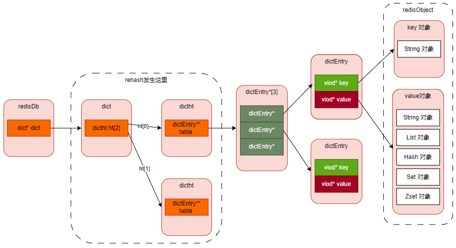
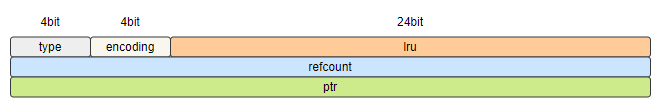
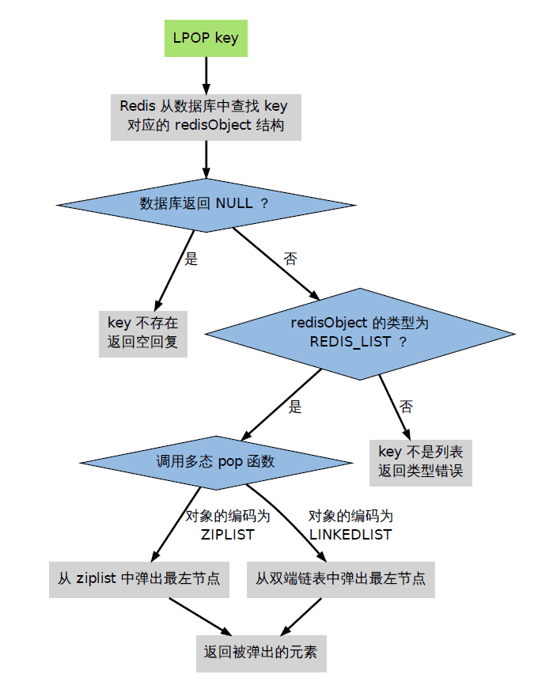

# 1. 对象系统

Redis使用对象来表示每一个键值对，在Redis中创建的每一个键值对，Redis都会为我们创建至少两个RedisObject对象：

- **键对象，即 key** ；键对象的数据结构为字符串；
- **值对象，即 value** ；而值对象因其保存的数据内容不一样，因而其使用的数据结构也不一样。

事实上，数据库中的每个键、值，以及 Redis 本身处理的参数, 都表示为这种数据类型。

> 这里，我们介绍一下Redis `值对象`所支持的数据类型。所谓 `值对象`所支持的数据类型，是从业务角度来讲的，如String，是指使用Redis的业务，需要保存到Redis中的数据的类型为String，而不是指别的其他。同理List，是指使用Redis的业务场景中，保存到Redis的数据的数据类型是List，也不是指其他。
>
> 说白了，`键对象`就是一个字符串，相当于对保存的值起了个名字。
>
> 读者要对这一点很清楚。

3.2版本是一个重要的稳定版本，有很多的更新，详见[这里](http://antirez.com/news/104)。

### 1.1. 为什么要有对象系统

1. 有些命令要求只能用于某种特定类型的键，而有些命令则可以作用到所有类型的键，这就需要构建一种可以识别键的类型的机制，让命令执行时通过判断键的类型来选择合适的处理方式；
2. Redis 是内存数据库，为了节省内存资源，Redis 设计了多种数据类型，而某些命令作用于其中某种类型的数据时，并不需要关注其底层到底使用的是那种数据结构，因此，还需要建立一种能够识别值的数据类型的机制，让命令执行时能够自行判断到底应该用到哪种数据结构上；

因此，redis 设计了自己的类型系统——redisObject对象。

主要有两点原因：

1. 为了更好的管理 redis 中的数据；
2. 为了适应命令的多态；

### 1.2. 源代码



```c
typedef struct redisObject {
  
    // 类型，标识该对象是什么类型的对象（String 对象、 List 对象、Hash 对象、Set 对象和 Zset 对象）；
    unsigned type:4;

    // 编码方式
    unsigned encoding:4;

    // LRU - 24位, 记录最末一次访问时间（相对于lru_clock）; 或者 LFU（最少使用的数据：8位频率，16位访问时间）
    unsigned lru:LRU_BITS; /* LRU time (relative to global lru_clock) or
                            * LFU data (least significant 8 bits frequency   LFU： Least Frequently Used， 最不频繁使用
                            * and most significant 16 bits access time). */

    // 引用计数
    int refcount;

    // 指向底层数据结构实例
    void *ptr;  
} robj;

```




#### 1.2.1. type 属性

可以使用 type 命令获取，记录了对象 `所保存的值的类型`。

> type [key]

其枚举值如下：

```c
/* A redis object, that is a type able to hold a string / list / set */

/* The actual Redis Object */
#define OBJ_STRING 0    /* String object. */
#define OBJ_LIST 1      /* List object. */
#define OBJ_SET 2       /* Set object. */
#define OBJ_ZSET 3      /* Sorted set object. */
#define OBJ_HASH 4      /* Hash object. */

/* The "module" object type is a special one that signals that the object
 * is one directly managed by a Redis module. In this case the value points
 * to a moduleValue struct, which contains the object value (which is only
 * handled by the module itself) and the RedisModuleType struct which lists
 * function pointers in order to serialize, deserialize, AOF-rewrite and
 * free the object.
 *
 * Inside the RDB file, module types are encoded as OBJ_MODULE followed
 * by a 64 bit module type ID, which has a 54 bits module-specific signature
 * in order to dispatch the loading to the right module, plus a 10 bits
 * encoding version. */
#define OBJ_MODULE 5    /* Module object. */
#define OBJ_STREAM 6    /* Stream object. */

```

#### 1.2.2. encoding 属性

可以使用 object encoding 命令获取，记录了对象 `所保存的值的编码`。

> object encoding [key]

其枚举值如下：

```c
/* Objects encoding. Some kind of objects like Strings and Hashes can be
 * internally represented in multiple ways. The 'encoding' field of the object
 * is set to one of this fields for this object. */
#define OBJ_ENCODING_RAW 0     /* Raw representation */
#define OBJ_ENCODING_INT 1     /* Encoded as integer */
#define OBJ_ENCODING_HT 2      /* Encoded as hash table */
#define OBJ_ENCODING_ZIPMAP 3  /* Encoded as zipmap */
#define OBJ_ENCODING_LINKEDLIST 4 /* No longer used: old list encoding. */
#define OBJ_ENCODING_ZIPLIST 5 /* Encoded as ziplist */
#define OBJ_ENCODING_INTSET 6  /* Encoded as intset */
#define OBJ_ENCODING_SKIPLIST 7  /* Encoded as skiplist */
#define OBJ_ENCODING_EMBSTR 8  /* Embedded sds string encoding */
#define OBJ_ENCODING_QUICKLIST 9 /* Encoded as linked list of ziplists */
#define OBJ_ENCODING_STREAM 10 /* Encoded as a radix tree of listpacks */

```

使用 object encoding 命令输出的结果有： raw、int、embstr、hashtable、quicklist、ziplist、intset、skiplist 等， OBJ_ENCODING_XXX 为代码中使用，它与输出结果的转化代码如下：

```c
char *strEncoding(int encoding) {
    switch(encoding) {
        case OBJ_ENCODING_RAW: return "raw";
        case OBJ_ENCODING_INT: return "int";
        case OBJ_ENCODING_HT: return "hashtable";
        case OBJ_ENCODING_QUICKLIST: return "quicklist";
        case OBJ_ENCODING_ZIPLIST: return "ziplist";
        case OBJ_ENCODING_INTSET: return "intset";
        case OBJ_ENCODING_SKIPLIST: return "skiplist";
        case OBJ_ENCODING_EMBSTR: return "embstr";
        default: return "unknown";
    }
}

```

Redis objects can be encoded in different ways:

- Strings can be encoded as:
  - **raw**, normal string encoding.
  - **int**, strings representing integers in a 64-bit signed interval, encoded in this way to save space.
  - **embstr**, an embedded string, which is an object where the internal simple dynamic string, **sds**, is an unmodifiable string allocated in the same chuck as the object itself. **embstr** can be strings with lengths up to the hardcoded limit of **OBJ_ENCODING_EMBSTR_SIZE_LIMIT** or 44 bytes.
- Lists can be encoded as:
  - **linkedlist**, simple list encoding. No longer used, an old list encoding.
  - **ziplist**, Redis <= 6.2, a space-efficient encoding used for small lists.
  - **listpack**, Redis >= 7.0, a space-efficient encoding used for small lists.
  - **quicklist**, encoded as linkedlist of ziplists or listpacks.
- Sets can be encoded as:
  - **hashtable**, normal set encoding.
  - **intset**, a special encoding used for small sets composed solely of integers.
  - **listpack**, Redis >= 7.2, a space-efficient encoding used for small sets.
- Hashes can be encoded as:
  - **zipmap**, no longer used, an old hash encoding.
  - **hashtable**, normal hash encoding.
  - **ziplist**, Redis <= 6.2, a space-efficient encoding used for small hashes.
  - **listpack**, Redis >= 7.0, a space-efficient encoding used for small hashes.
- Sorted Sets can be encoded as:
  - **skiplist**, normal sorted set encoding.
  - **ziplist**, Redis <= 6.2, a space-efficient encoding used for small sorted sets.
  - **listpack**, Redis >= 7.0, a space-efficient encoding used for small sorted sets.
- Streams can be encoded as:
  - **stream**, encoded as a radix tree of listpacks.

All the specially encoded types are automatically converted to the general type once you perform an operation that makes it impossible for Redis to retain the space saving encoding.

Returns the string representation of the type of the value stored at **key**. The different types that can be returned are: **string**, **list**, **set**, **zset**, **hash** and **stream**.

#### 1.2.3. lru 属性

**lru属性**: 记录了对象最后一次被命令程序访问的时间
**空转时长**：当前时间减去键的值对象的lru时间，就是该键的空转时长。Object idletime命令可以打印出给定键的空转时长
如果服务器打开了maxmemory选项，并且服务器用于回收内存的算法为volatile-lru或者allkeys-lru，那么当服务器占用的内存数超过了maxmemory选项所设置的上限值时，空转时长较高的那部分键会优先被服务器释放，从而回收内存

#### 1.2.4. refcount 属性

**refcount 属性**：关系着对象引用计数以及对象的消毁
redisObject中有refcount属性，是对象的引用计数，显然计数0那么就是可以回收。

- 每个redisObject结构都带有一个refcount属性，指示这个对象被引用了多少次；
- 当新创建一个对象时，它的refcount属性被设置为1；
- 当对一个对象进行共享时，redis将这个对象的refcount加一；
- 当使用完一个对象后，或者消除对一个对象的引用之后，程序将对象的refcount减一；
- 当对象的refcount降至0 时，这个RedisObject结构，以及它引用的数据结构的内存都会被释放。

#### 1.2.5. ptr 属性

- [ ] TODO

### 1.3. 一个对象在内存中的存储示意


```
127.0.0.1:6379> set str1 abcdefghijklmnopqrstuvwxyz1234
[@sjs_73_171 WEB-INF]$ redis-memory-for-key -s b.redis -p 1959 str1
Key                             str1
Bytes                           80
Type                            string

```

可以看出 str1 在内存中所占的大小为： 80 字节。

> 参考： [https://www.cnblogs.com/wangcp-2014/p/15702410.html](https://www.cnblogs.com/wangcp-2014/p/15702410.html)


### 1.4. 内建对象

redis一般会把一些常见的值放到一个共享对象中，这样可使程序避免了重复分配的麻烦，也节约了一些CPU时间。

redis预分配的值对象如下：

- 各种命令的返回值，比如成功时返回的OK，错误时返回的ERROR，命令入队事务时返回的QUEUE，等等
- 包括0 在内，小于REDIS_SHARED_INTEGERS的所有整数（REDIS_SHARED_INTEGERS的默认值是10000）

为什么redis不共享列表对象、哈希对象、集合对象、有序集合对象，只共享字符串对象？

- 列表对象、哈希对象、集合对象、有序集合对象，本身可以包含字符串对象，复杂度较高。
- 如果共享对象是保存字符串对象，那么验证操作的复杂度为O(1)
- 如果共享对象是保存字符串值的字符串对象，那么验证操作的复杂度为O(N)
- 如果共享对象是包含多个值的对象，其中值本身又是字符串对象，即其它对象中嵌套了字符串对象，比如列表对象、哈希对象，那么验证操作的复杂度将会是O(N的平方)

如果对复杂度较高的对象创建共享对象，需要消耗很大的CPU，用这种消耗去换取内存空间，是不合适的


### 命令的类型检查和多态

**当执行一个处理数据类型命令的时候，redis执行以下步骤**

- 根据给定的key，在数据库字典中查找和他相对应的redisObject，如果没找到，就返回NULL；
- 检查redisObject的type属性和执行命令所需的类型是否相符，如果不相符，返回类型错误；
- 根据redisObject的encoding属性所指定的编码，选择合适的操作函数来处理底层的数据结构；
- 返回数据结构的操作结果作为命令的返回值。



### 1.5. 总结

- redis使用自己实现的对象机制（redisObject)来实现类型判断、命令多态和基于引用次数的垃圾回收；
- redis会预分配一些常用的数据对象，并通过共享这些对象来减少内存占用，和避免频繁的为小对象分配内存


