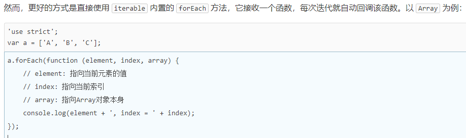
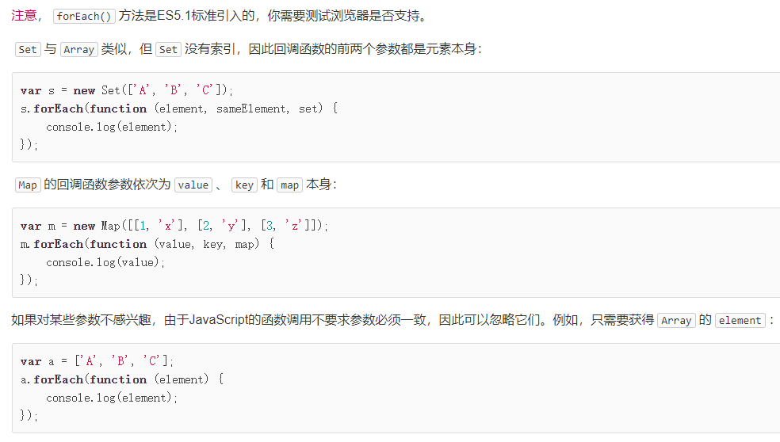

> 主要参考[廖雪峰-前端入门](https://www.liaoxuefeng.com/wiki/1022910821149312)。

## 1. 背景

因为网景开发了 JavaScript，一年后微软又模仿 JavaScript 开发了 JScript，为了让 JavaScript 成为全球标准，几个公司联合 ECMA（European Computer Manufacturers Association）组织定制了 JavaScript 语言的标准，被称为 ECMAScript 标准。

不过大多数时候，我们还是用 JavaScript 这个词。如果你遇到 ECMAScript 这个词，简单把它替换为 JavaScript 就行了。

由于 JavaScript 的标准——ECMAScript 在不断发展，最新版 ECMAScript 6 标准（简称 ES6）已经在 2015 年 6 月正式发布了，所以，讲到 JavaScript 的版本，实际上就是说它实现了 ECMAScript 标准的哪个版本。由于浏览器在发布时就确定了 JavaScript 的版本，加上很多用户还在使用 IE6 这种古老的浏览器，这就导致你在写 JavaScript 的时候，要照顾一下老用户，不能一上来就用最新的 ES6 标准写，否则，老用户的浏览器是无法运行新版本的 JavaScript 代码的。

## 2. 快速入门

不管哪种方式都需要以 HTML 文件为支撑，并且都需要**写入到 HTML 中 head 标签下的 script 标签**中。script 标签有两种形式：

```js
<script>
// 这里直接写 js
</script>

<script src="/static/js/abc.js"></script>
```

### 2.1. 基本语法

1. 分号可加可不加，但建议都加；
2. 严格区分大小写；

### 2.2. 数据类型

#### 2.2.1. Number

不区分整数和浮点数，统一用 Number 表示
整数最大范围不是 ±263，而是 ±253
可以直接做四则运算，规则和数学一致
用十六进制表示整数比较方便

```log
1.2345e3; // 科学计数法表示1.2345x1000，等同于1234.5
NaN; // NaN表示Not a Number，当无法计算结果时用NaN表示
Infinity; // Infinity表示无限大，当数值超过了JavaScript的Number所能表示的最大值时，就表示为Infinity

```

#### 2.2.2. 字符串

以单引号'或双引号"括起来的任意文本
转义字符\可以转义很多字符
用\u####表示一个 Unicode 字符，

```
'\u4e2d\u6587'; // 完全等同于 '中文'
```

多行字符串的表示方法，用反引号`...`表示

ES6 新增了一种模板字符串，表示方法和上面的多行字符串一样，但是它会自动替换字符串中的变量：

```
let name = '小明';
let age = 20;
let message = `你好, ${name}, 你今年${age}岁了!`;
alert(message);
```

toUpperCase()把一个字符串全部变为大写
toLowerCase()把一个字符串全部变为小写
indexOf()会搜索指定字符串出现的位置
substring()返回指定索引区间的子串

#### 2.2.3. 布尔值

布尔值和布尔代数的表示完全一致，一个布尔值只有 true、false 两种值，要么是 true，要么是 false，可以直接用 true、false 表示布尔值，也可以通过布尔运算计算出来

说明条件判断的顺序非常重要

把 null、undefined、0、NaN 和空字符串''视为 false，其他值一概视为 true

- &&运算是与运算
- ||运算是或运算
- !运算是非运算

#### 2.2.4. 比较运算符

第一种是==比较，它会自动转换数据类型再比较，很多时候，会得到非常诡异的结果；

第二种是===比较，它不会自动转换数据类型，如果数据类型不一致，返回 false，如果一致，再比较。

由于 JavaScript 这个设计缺陷，*不要*使用`==`比较，始终坚持使用`===`比较。

另一个例外是 NaN 这个特殊的 Number 与所有其他值都不相等，包括它自己：

```
NaN === NaN; // false
```

唯一能判断 NaN 的方法是通过 isNaN()函数：

最后要注意浮点数的相等比较；浮点数在运算过程中会产生误差，因为计算机无法精确表示无限循环小数。要比较两个浮点数是否相等，只能计算它们之差的绝对值，看是否小于某个阈值：

#### 2.2.5. Bigint

精确表示比 253 还大的整数，可以使用内置的 BigInt 类型，它的表示方法是在整数后加一个 n，例如 9223372036854775808n，也可以使用 BigInt()把 Number 和字符串转换成 BigInt：

使用 BigInt 可以正常进行加减乘除等运算，结果仍然是一个 BigInt，但不能把一个 BigInt 和一个 Number 放在一起运算：

#### 2.2.6. null 和 undefined

null 表示一个“空”的值；还有一个和 null 类似的 undefined，它表示“未定义”。

区分两者的意义不大。大多数情况下，我们都应该用 null。undefined 仅仅在判断函数参数是否传递的情况下有用。

#### 2.2.7. 数组

数组可以包括任意数据类型，创建数组的两种方法：

```
[1, 2, 3.14, 'Hello', null, true];
new Array(1, 2, 3); // 创建了数组[1, 2, 3]
```

出于代码的可读性考虑，强烈建议直接使用[]。索引的起始值为 0

要取得 Array 的长度，直接访问 length 属性

可以通过 indexOf()来搜索一个指定的元素的位置

slice()就是对应 String 的 substring()版本，它截取 Array 的部分元素，然后返回一个新的 Array

注意到 slice()的起止参数包括开始索引，不包括结束索引。如果不给 slice()传递任何参数，它就会从头到尾截取所有元素。利用这一点，我们可以很容易地复制一个 Array

push()向 Array 的末尾添加若干元素，pop()则把 Array 的最后一个元素删除掉

如果要往 Array 的头部添加若干元素，使用 unshift()方法，shift()方法则把 Array 的第一个元素删掉

sort()可以对当前 Array 进行排序，它会直接修改当前 Array 的元素位置，直接调用时，按照默认顺序排序

reverse()把整个 Array 的元素给调个个，也就是反转

splice()方法是修改 Array 的“万能方法”，它可以从指定的索引开始删除若干元素，然后再从该位置添加若干元素

concat()方法把当前的 Array 和另一个 Array 连接起来，并返回一个新的 Array；concat()方法可以接收任意个元素和 Array，并且自动把 Array 拆开，然后全部添加到新的 Array 里

join()方法是一个非常实用的方法，它把当前 Array 的每个元素都用指定的字符串连接起来，然后返回连接后的字符串；如果 Array 的元素不是字符串，将自动转换为字符串后再连接

如果数组的某个元素又是一个 Array，则可以形成多维数组

#### 2.2.8. 对象

对象是一组由键-值组成的无序集合；键都是字符串类型，值可以是任意数据类型，使用方式： 对象变量.属性名

访问不存在的属性不报错，而是返回 undefined

访问属性是通过.操作符完成的，但这要求属性名必须是一个有效的变量名。如果属性名包含特殊字符，就必须用''括起来：

```
var xiaohong = {
    name: '小红',
    'middle-school': 'No.1 Middle School'
};
```

xiaohong 的属性名 middle-school 不是一个有效的变量，就需要用''括起来。访问这个属性也无法使用.操作符，必须用['xxx']来访问：

```
xiaohong['middle-school']; // 'No.1 Middle School'
xiaohong['name']; // '小红'
xiaohong.name; // '小红'
```

也可以用 xiaohong['name']来访问 xiaohong 的 name 属性，不过 xiaohong.name 的写法更简洁。我们在编写 JavaScript 代码的时候，属性名尽量使用标准的变量名，这样就可以直接通过 object.prop 的形式访问一个属性了。

如果我们要检测 xiaoming 是否拥有某一属性，可以用 in 操作符：

```
var xiaoming = {
    name: '小明',
    birth: 1990,
    school: 'No.1 Middle School',
    height: 1.70,
    weight: 65,
    score: null
};
'name' in xiaoming; // true
'grade' in xiaoming; // false
```

不过要小心，如果 in 判断一个属性存在，这个属性不一定是 xiaoming 的，它可能是 xiaoming 继承得到的：

```
'toString' in xiaoming; // true
```

因为 toString 定义在 object 对象中，而所有对象最终都会在原型链上指向 object，所以 xiaoming 也拥有 toString 属性。

要判断一个属性是否是 xiaoming 自身拥有的，而不是继承得到的，可以用 hasOwnProperty()方法：

```
var xiaoming = {
    name: '小明'
};
xiaoming.hasOwnProperty('name'); // true
xiaoming.hasOwnProperty('toString'); // false
```

实际上 Number 或者其他数据类型作为键也是非常合理的；为了解决这个问题，最新的 ES6 规范引入了新的数据类型 Map

Map 是一组键值对的结构，具有极快的查找速度；

初始化 Map 需要一个二维数组，或者直接初始化一个空 Map

```
var m = new Map(); // 空Map
m.set('Adam', 67); // 添加新的key-value
m.set('Bob', 59);
m.has('Adam'); // 是否存在key 'Adam': true
m.get('Adam'); // 67
m.delete('Adam'); // 删除key 'Adam'
m.get('Adam'); // undefined
```

Set 和 Map 类似，也是一组 key 的集合，但不存储 value。由于 key 不能重复，所以，在 Set 中，没有重复的 key

遍历 Array 可以采用下标循环，遍历 Map 和 Set 就无法使用下标。为了统一集合类型，ES6 标准引入了新的 iterable 类型，Array、Map 和 Set 都属于 iterable 类型。

具有 iterable 类型的集合可以通过新的 for ... of 循环来遍历。

```
var a = ['A', 'B', 'C'];
var s = new Set(['A', 'B', 'C']);
var m = new Map([[1, 'x'], [2, 'y'], [3, 'z']]);
for (var x of a) { // 遍历Array
    console.log(x);
}
for (var x of s) { // 遍历Set
    console.log(x);
}
for (var x of m) { // 遍历Map
    console.log(x[0] + '=' + x[1]);
}
```

for ... in 循环由于历史遗留问题，它遍历的实际上是对象的属性名称。一个 Array 数组实际上也是一个对象，它的每个元素的索引被视为一个属性。

当我们手动给 Array 对象添加了额外的属性后，for ... in 循环将带来意想不到的意外效果：

```
var a = ['A', 'B', 'C'];
a.name = 'Hello';
for (var x in a) {
    console.log(x); // '0', '1', '2', 'name'
}
```

for ... in 循环将把 name 包括在内，但 Array 的 length 属性却不包括在内。

for ... of 循环则完全修复了这些问题，它只循环集合本身的元素：

```
var a = ['A', 'B', 'C'];
a.name = 'Hello';
for (var x of a) {
    console.log(x); // 'A', 'B', 'C'
}
```




#### 2.2.9. 变量

变量名是大小写英文、数字、$和\_的组合，且不能用数字开头，当然也不能是关键字；

可以把任意数据类型赋值给变量，同一个变量可以反复赋值，而且可以是不同类型的变量，但是要注意只能用 var 申明一次

#### 2.2.10. strict 模式

如果一个变量没有通过 var 申明就被使用，那么该变量就自动被申明为全局变量；

启用 strict 模式的方法是在 JavaScript 代码的第一行写上：

```
'use strict';
```

不用 var 申明的变量会被视为全局变量，为了避免这一缺陷，所有的 JavaScript 代码都应该使用 strict 模式。

## 3. 函数

定义

调用

参数

rest 函数

变量作用域与解构赋值

- 局部作用域
  - 块作用域
- 全局作用域
- 命名空间
- 常量
- 解构

方法

- 对象上绑定的函数就是方法
- this 和 that
- apply

## 4. node

### 4.1. 背景

1. 微软解散了 IE 浏览器团队，谷歌的团队迅速发展，V8 登场；
2. Ryan Dahl 本身是 C/Ｃ++的高性能 Web 工程师，但考察了很多高级语言，发现很多语言虽然同时提供了同步 IO 和异步 IO，但是开发人员一旦用了同步 IO，他们就再也懒得写异步 IO 了，所以，最终，Ryan 瞄向了 JavaScript；
3. 选定语言后，还要有运行时引擎，因为 V8 就是开源的 JavaScript 引擎，直接拿来主义；
4. 于是 09 年正式推出基于 JavaScript 语言和 V8 引擎的开源 Web 服务器项目，命名为 Node.js；
5. 虽然 JavaScript 语言本身是完善的函数式语言，在前端开发时，开发人员往往写得比较随意，让人感觉 JavaScript 就是个“玩具语言”。但是，在 Node 环境下，通过模块化的 JavaScript 代码，加上函数式编程，并且无需考虑浏览器兼容性问题，直接使用最新的 ECMAScript 6 标准，可以完全满足工程上的需求
6. 借助 JavaScript 天生的事件驱动机制加 V8 高性能引擎，使编写高性能 Web 服务轻而易举
7. io.js 将首先添加新的特性，如果大家测试用得爽，就把新特性加入 Node.js

版本号三部分组成：主版本号.次版本号.修订版本号

修改版本号时，需要遵守约定：

主版本号：修改的代码对功能产生影响，增加主版本号，并重置次版本号和修订版本号
次版本号：修改代码新增了功能，但没有删除和修改已有的功能，增加次版本号，重置修订版本号
修订版本号：修改代码修复 bug，没有新增和删除任何功能，应该增加修订版本号
————————————————

原文链接：[https://blog.csdn.net/HuoYiHengYuan/article/details/100945249](https://blog.csdn.net/HuoYiHengYuan/article/details/100945249)

- 波浪号（tilde）+指定版本：比如 ~1.2.2 ，表示安装 1.2.x 的最新版本（不低于 1.2.2），但是不安装 1.3.x，也就是说安装时不改变大版本号和次要版本号。
- 插入号（caret）+指定版本：比如 ˆ1.2.2，表示安装 1.x.x 的最新版本（不低于 1.2.2），但是不安装 2.x.x，也就是说安装时不改变大版本号。需要注意的是，如果大版本号为 0，则插入号的行为与波浪号相同，这是因为此时处于开发阶段，即使是次要版本号变动，也可能带来程序的不兼容。
- latest：安装最新版本。

package.json 文件配置说明
name：项目/模块名称，长度必须小于等于 214 个字符，不能以"."(点)或者"\_"(下划线)开头，不能包含大写字母。
version：项目版本。
author：项目开发者，它的值是你在https://npmjs.org网站的有效账户名，遵循“账户名<邮件>”的规则。
description：项目描述，是一个字符串。它可以帮助人们在使用 npm search 时找到这个包。
keywords：项目关键字，是一个字符串数组。它可以帮助人们在使用 npm search 时找到这个包。
private：是否私有，设置为 true 时，npm 拒绝发布。
license：软件授权条款，让用户知道他们的使用权利和限制。
bugs：bug 提交地址。
contributors：项目贡献者 。
repository：项目仓库地址。
homepage：项目包的官网 URL。
dependencies：生产环境下，项目运行所需依赖。
devDependencies：开发环境下，项目所需依赖。
scripts：执行 npm 脚本命令简写，比如 “start”: “react-scripts start”, 执行 npm start 就是运行 “react-scripts start”。
bin：内部命令对应的可执行文件的路径。
main：项目默认执行文件，比如 require(‘webpack’)；就会默认加载 lib 目录下的 webpack.js 文件，如果没有设置，则默认加载项目跟目录下的 index.js 文件。
module：是以 ES Module(也就是 ES6)模块化方式进行加载，因为早期没有 ES6 模块化方案时，都是遵循 CommonJS 规范，而 CommonJS 规范的包是以 main 的方式表示入口文件的，为了区分就新增了 module 方式，但是 ES6 模块化方案效率更高，所以会优先查看是否有 module 字段，没有才使用 main 字段。
eslintConfig：EsLint 检查文件配置，自动读取验证。
engines：项目运行的平台。
browserslist：供浏览器使用的版本列表。
style：供浏览器使用时，样式文件所在的位置；样式文件打包工具 parcelify，通过它知道样式文件的打包位置。
files：被项目包含的文件名数组。

package.json 与 package-lock.json 介绍

1. package.json 相当于 Java 中的 pom 文件，用来引入 node 项目中所依赖的 js 包；里面包含了 dependencies 和 devDependencies 等节点；

1. 当我们使用 node 进行项目开发时，我们会使用 npm init 命令生成我们项目的骨架。
1. 如果我们想要在项目中引入某个 js 包，那么我们可以使用 npm install pakcagename，npm 会自动把依赖信息放入项目根目录下的 package.json 中，同时会把 js 包下载到 node_module 中；
1. 由于 js 包的版本命名规范限制和我们使用 js 包时写的版本号，导致今天使用的版本可 abc，到了明天下载下来的版本可能就变了；因此，node 给我们引入 packag-lock.json 文件，用来锁定当前项目所依赖的 js 包的版本，这样就保证了版本的一致性；
1. package-lock.json 文件存在后，npm 执行 install 命令后会首先根据这个文件来下载所需要的依赖包，因此如果修改了 package.json 文件中的版本信息，再次运行项目时就会出现版本冲突的问题，解决思路有两个：

   1. 重新生成 package-lock.json 文件；
   2. 【已验证，推荐使用这种方式】直接修改 package-lock.json 文件中的版本号；

1. [package.json 和 package-lock.json 介绍](https://blog.csdn.net/drawlessonsfrom/article/details/121616793)
1. [深度解析 package-lock.json 作用](https://zhuanlan.zhihu.com/p/463697890)
1. [浅析 nodejs 中的 package.json 和 package-lock.json 作用 ](https://www.cnblogs.com/goloving/p/14602743.html)
1. [如何重新生成 package-lock.json 文件？](https://www.volcengine.com/theme/4227822-R-7-1)
