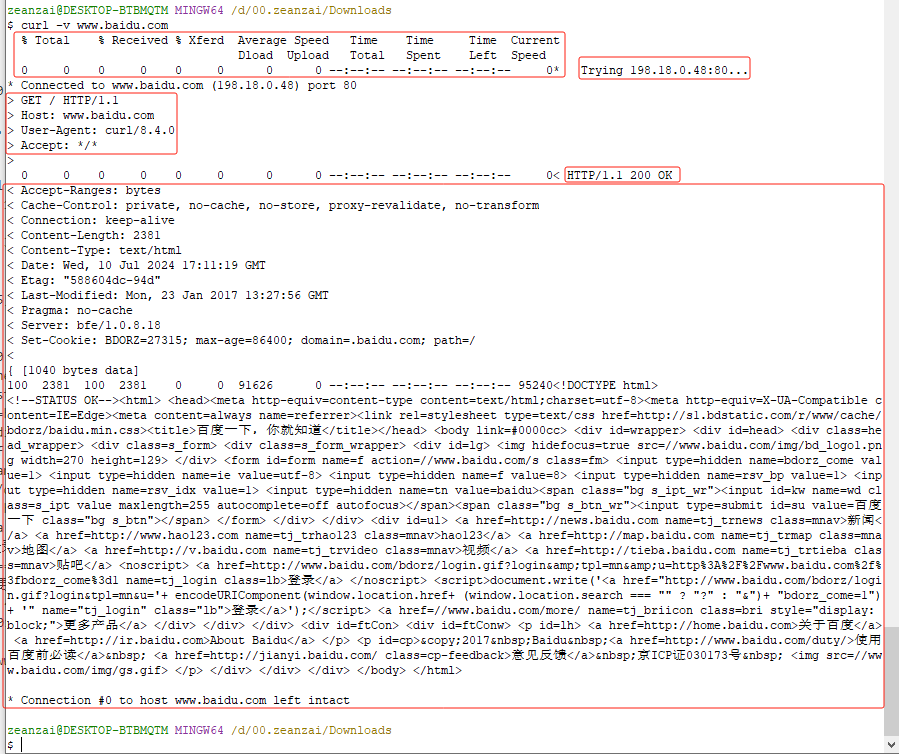
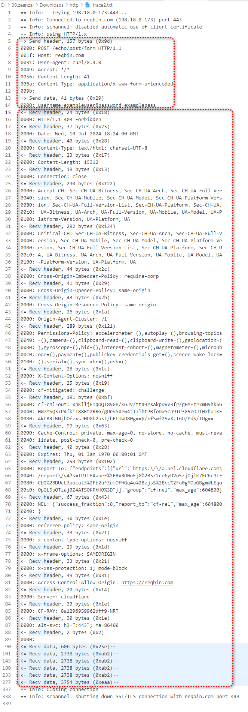

# 实验

## curl 简介

我们知道 HTTP 协议属于应用层协议，所以要想查看报文格式，就需要借助应用层的软件，Windows 平台上常见的能够发送 http 协议的应用层软件有两类：

- 可视化操作软件，如浏览器、抓包工具
- 命令行操作软件，如 curl、Telnet；

我们这里使用 curl 来查看一下 http 报文的相关内容，之所以不用 chrome 等浏览器，是因为这些浏览器做了一些技术手段的优化，不利于查看报文。

<details>
<summary>cmd查看curl版本</summary>

```txt
C:\Users\zeanzai>curl -V
curl 7.55.1 (Windows) libcurl/7.55.1 WinSSL
Release-Date: 2017-11-14, security patched: 2019-11-05
Protocols: dict file ftp ftps http https imap imaps pop3 pop3s smtp smtps telnet tftp
Features: AsynchDNS IPv6 Largefile SSPI Kerberos SPNEGO NTLM SSL
```

</details>

<details>
<summary>git 查看 curl 版本</summary>

```txt
zeanzai@DESKTOP-BTBMQTM MINGW64 /d/00.zeanzai/Downloads
$ curl -V
curl 8.4.0 (x86_64-w64-mingw32) libcurl/8.4.0 Schannel zlib/1.3 brotli/1.1.0 zstd/1.5.5 libidn2/2.3.4 libpsl/0.21.2 (+libidn2/2.3.3) libssh2/1.11.0
Release-Date: 2023-10-11
Protocols: dict file ftp ftps gopher gophers http https imap imaps ldap ldaps mqtt pop3 pop3s rtsp scp sftp smb smbs smtp smtps telnet tftp
Features: alt-svc AsynchDNS brotli HSTS HTTPS-proxy IDN IPv6 Kerberos Largefile libz NTLM PSL SPNEGO SSL SSPI threadsafe UnixSockets zstd
```

</details>

命令提示：

1. 参考[curl tutorial](https://curl.se/docs/tutorial.html)；
2. 直接在命令行中输入： `curl --help`；

## 实验一

<details>

<summary>trace0.txt</summary>

./include/trace0.txt

</details>

1. -v, --verbose Make the operation more talkative（ /ˈtɑː.kə.t̬ɪv/ ，爱说话的，健谈的;多嘴的，详细的）
2. 输出结果



## 实验二

实验一报文格式并不明显，请看实验二。

我们输入 `curl --trace-ascii trace1.txt www.baidu.com` ：

```
zeanzai@DESKTOP-BTBMQTM MINGW64 /d/00.zeanzai/Downloads
$ curl --trace-ascii trace1.txt www.baidu.com
  % Total    % Received % Xferd  Average Speed   Time    Time     Time  Current
                                 Dload  Upload   Total   Spent    Left  Speed
100  2381  100  2381    0     0  91937      0 --:--:-- --:--:-- --:--:-- 99208<!DOCTYPE html>
<!--STATUS OK--><html> <head><meta http-equiv=content-type content=text/html;charset=utf-8><meta http-equiv=X-UA-Compatible content=IE=Edge><meta content=always name=referrer><link rel=stylesheet type=text/css href=http://s1.bdstatic.com/r/www/cache/bdorz/baidu.min.css><title>百度一下，你就知道</title></head> <body link=#0000cc> <div id=wrapper> <div id=head> <div class=head_wrapper> <div class=s_form> <div class=s_form_wrapper> <div id=lg>  </div> <form id=form name=f action=//www.baidu.com/s class=fm> <input type=hidden name=bdorz_come value=1> <input type=hidden name=ie value=utf-8> <input type=hidden name=f value=8> <input type=hidden name=rsv_bp value=1> <input type=hidden name=rsv_idx value=1> <input type=hidden name=tn value=baidu><span class="bg s_ipt_wr"><input id=kw name=wd class=s_ipt value maxlength=255 autocomplete=off autofocus></span><span class="bg s_btn_wr"><input type=submit id=su value=百度一下 class="bg s_btn"></span> </form> </div> </div> <div id=u1> <a href=http://news.baidu.com name=tj_trnews class=mnav>新闻</a> <a href=http://www.hao123.com name=tj_trhao123 class=mnav>hao123</a> <a href=http://map.baidu.com name=tj_trmap class=mnav>地图</a> <a href=http://v.baidu.com name=tj_trvideo class=mnav>视频</a> <a href=http://tieba.baidu.com name=tj_trtieba class=mnav>贴吧</a> <noscript> <a href=http://www.baidu.com/bdorz/login.gif?login&tpl=mn&u=http%3A%2F%2Fwww.baidu.com%2f%3fbdorz_come%3d1 name=tj_login class=lb>登录</a> </noscript> <script>document.write('<a href="http://www.baidu.com/bdorz/login.gif?login&tpl=mn&u='+ encodeURIComponent(window.location.href+ (window.location.search === "" ? "?" : "&")+ "bdorz_come=1")+ '" name="tj_login" class="lb">登录</a>');</script> <a href=//www.baidu.com/more/ name=tj_briicon class=bri style="display: block;">更多产品</a> </div> </div> </div> <div id=ftCon> <div id=ftConw> <p id=lh> <a href=http://home.baidu.com>关于百度</a> <a href=http://ir.baidu.com>About Baidu</a> </p> <p id=cp>©2017 Baidu <a href=http://www.baidu.com/duty/>使用百度前必读</a>  <a href=http://jianyi.baidu.com/ class=cp-feedback>意见反馈</a> 京ICP证030173号   </p> </div> </div> </div> </body> </html>

```

控制台输出响应时间信息和响应结果外，还在 /d/00.zeanzai/Downloads 下生成一个文件 trace1.txt ，我们打开这个文件：

<details>

<summary>trace1.txt</summary>

./include/trace1.txt

</details>

在 trace1.txt 中我们可以清楚的看到请求和响应的报文：


## 实验三

我们输入 `curl --trace-ascii trace2.txt -X POST https://reqbin.com/echo/post/form -d "username=exampleuser" -d "password=examplepass"` ，同样会生成一个 trace2.txt 文件，

<details>

<summary>trace2.txt</summary>

./include/trace2.txt}}

</details>

同样的，我们也可以看到 请求报文 和 响应报文：



## 实验四

我们输入 `curl --trace-ascii trace3.txt -X POST https://postman-echo.com/post -d "name=JohnDoe" -d "email=johndoe@example.com" -i` ，同样会生成一个 trace3.txt 文件，

<details>

<summary>trace3.txt</summary>

./include/trace3.txt}}

</details>

同样的，我们也可以看到 请求报文 和 响应报文：


## 实验四

- 查看某一个应用所占用的端口
- 查看某一个端口对应的应用
- 查看链路

## 参考连接

- [curl 网站开发指南](https://www.ruanyifeng.com/blog/2011/09/curl.html)
- [curl tutorial](https://curl.se/docs/tutorial.html)
- [everything curl](https://everything.curl.dev/)

---

## TODO

其它协议的 curl 过程，比如 ftp、file 等

```
curl
curl --help
curl -v www.baidu.com
curl -i www.sina.com
curl -V
curl --trace trace.txt www.baidu.com
curl --trace-ascii trace1.txt www.baidu.com
curl -v www.baidu.com
curl -v https://www.cnblogs.com/Kimbing-Ng/p/12411017.html
curl -v https://res.wx.qq.com/a/wx_fed/assets/res/NTI4MWU5.ico
curl -v
https://mp.weixin.qq.com/mp/appmsgreport?action=page_time_5s&__biz=MzkxNTU5MjE0MQ==&uin=&key=&pass_ticket=&wxtoken=777&devicetype=&clientversion=&__biz=MzkxNTU5MjE0MQ%3D%3D&appmsg_token=&x5=0&f=json
curl -v https://mp.weixin.qq.com/mp/appmsgreport?action=page_time_5s&__biz=MzkxNTU5MjE0MQ==&uin=&key=&pass_ticket=&wxtoken=777&devicetype=&clientversion=&__biz=MzkxNTU5MjE0MQ%3D%3D&appmsg_token=&x5=0&f=json
curl -X POST https://reqbin.com/echo/post/form      -d "username=exampleuser"      -d "password=examplepass"      -i
curl -X POST https://reqbin.com/echo/post/form      -d "username=exampleuser"      -d "password=examplepass"      -v
curl --trace-ascii trace2.txt -X POST https://reqbin.com/echo/post/form      -d "username=exampleuser"      -d "password=examplepass"

```

```
zeanzai@DESKTOP-BTBMQTM MINGW64 /d/00.zeanzai/Downloads
$ curl -X POST https://postman-echo.com/post \
     -d "name=JohnDoe" \
     -d "email=johndoe@example.com" \
     -i -v
Note: Unnecessary use of -X or --request, POST is already inferred.
  % Total    % Received % Xferd  Average Speed   Time    Time     Time  Current
                                 Dload  Upload   Total   Spent    Left  Speed
  0     0    0     0    0     0      0      0 --:--:-- --:--:-- --:--:--     0*   Trying 198.18.0.177:443...
* Connected to postman-echo.com (198.18.0.177) port 443
* schannel: disabled automatic use of client certificate
  0     0    0     0    0     0      0      0 --:--:--  0:00:02 --:--:--     0* using HTTP/1.x
> POST /post HTTP/1.1
> Host: postman-echo.com
> User-Agent: curl/8.4.0
> Accept: */*
> Content-Length: 38
> Content-Type: application/x-www-form-urlencoded
>
} [38 bytes data]
< HTTP/1.1 200 OK
< Date: Wed, 10 Jul 2024 20:29:05 GMT
< Content-Type: application/json; charset=utf-8
< Content-Length: 601
< Connection: keep-alive
< Server: nginx/1.25.3
< ETag: W/"259-ifTTU5DnnKCfTuvZaz9HI2sLoUA"
< set-cookie: sails.sid=s%3A6DPYcAmmqOiH_vpl2snsXOhUl5nP0vuh.kx924N3RZo4IAEF2z3LmbYuwfwVj4oDSY7HOBQKxfRI; Path=/; HttpOnly
<
{ [601 bytes data]
100   639  100   601  100    38    198     12  0:00:03  0:00:03 --:--:--   210HTTP/1.1 200 OK
Date: Wed, 10 Jul 2024 20:29:05 GMT
Content-Type: application/json; charset=utf-8
Content-Length: 601
Connection: keep-alive
Server: nginx/1.25.3
ETag: W/"259-ifTTU5DnnKCfTuvZaz9HI2sLoUA"
set-cookie: sails.sid=s%3A6DPYcAmmqOiH_vpl2snsXOhUl5nP0vuh.kx924N3RZo4IAEF2z3LmbYuwfwVj4oDSY7HOBQKxfRI; Path=/; HttpOnly

{
  "args": {},
  "data": "",
  "files": {},
  "form": {
    "name": "JohnDoe",
    "email": "johndoe@example.com"
  },
  "headers": {
    "host": "postman-echo.com",
    "x-request-start": "t=1720643345.306",
    "content-length": "38",
    "x-forwarded-proto": "https",
    "x-forwarded-port": "443",
    "x-amzn-trace-id": "Root=1-668eef11-1cb5d670060250137bd54f43",
    "user-agent": "curl/8.4.0",
    "accept": "*/*",
    "content-type": "application/x-www-form-urlencoded"
  },
  "json": {
    "name": "JohnDoe",
    "email": "johndoe@example.com"
  },
  "url": "https://postman-echo.com/post"
}
* Connection #0 to host postman-echo.com left intact

zeanzai@DESKTOP-BTBMQTM MINGW64 /d/00.zeanzai/Downloads
$ curl --trace-ascii trace3.txt -X POST https://postman-echo.com/post -d "name=JohnDoe" -d "email=johndoe@example.com" -i -v
Warning: -v, --verbose overrides an earlier trace/verbose option
Note: Unnecessary use of -X or --request, POST is already inferred.
  % Total    % Received % Xferd  Average Speed   Time    Time     Time  Current
                                 Dload  Upload   Total   Spent    Left  Speed
  0     0    0     0    0     0      0      0 --:--:-- --:--:-- --:--:--     0*   Trying 198.18.0.177:443...
* Connected to postman-echo.com (198.18.0.177) port 443
* schannel: disabled automatic use of client certificate
* using HTTP/1.x
  0     0    0     0    0     0      0      0 --:--:-- --:--:-- --:--:--     0> POST /post HTTP/1.1
> Host: postman-echo.com
> User-Agent: curl/8.4.0
> Accept: */*
> Content-Length: 38
> Content-Type: application/x-www-form-urlencoded
>
} [38 bytes data]
< HTTP/1.1 200 OK
< Date: Wed, 10 Jul 2024 20:31:12 GMT
< Content-Type: application/json; charset=utf-8
< Content-Length: 601
< Connection: keep-alive
< Server: nginx/1.25.3
< ETag: W/"259-IayvP2xeNpPd32eWUmNCUWeyCCg"
< set-cookie: sails.sid=s%3Am5aFmAWC0nOARrKqEO52NnDIP3kc5NlV.3pVNVXcSukjZx2VdtOm73Hyro5EHztF3vLIIj48pz3s; Path=/; HttpOnly
<
{ [601 bytes data]
100   639  100   601  100    38    581     36  0:00:01  0:00:01 --:--:--   619HTTP/1.1 200 OK
Date: Wed, 10 Jul 2024 20:31:12 GMT
Content-Type: application/json; charset=utf-8
Content-Length: 601
Connection: keep-alive
Server: nginx/1.25.3
ETag: W/"259-IayvP2xeNpPd32eWUmNCUWeyCCg"
set-cookie: sails.sid=s%3Am5aFmAWC0nOARrKqEO52NnDIP3kc5NlV.3pVNVXcSukjZx2VdtOm73Hyro5EHztF3vLIIj48pz3s; Path=/; HttpOnly

{
  "args": {},
  "data": "",
  "files": {},
  "form": {
    "name": "JohnDoe",
    "email": "johndoe@example.com"
  },
  "headers": {
    "host": "postman-echo.com",
    "x-request-start": "t=1720643472.834",
    "content-length": "38",
    "x-forwarded-proto": "https",
    "x-forwarded-port": "443",
    "x-amzn-trace-id": "Root=1-668eef90-7680e0742990c84040ee5e73",
    "user-agent": "curl/8.4.0",
    "accept": "*/*",
    "content-type": "application/x-www-form-urlencoded"
  },
  "json": {
    "name": "JohnDoe",
    "email": "johndoe@example.com"
  },
  "url": "https://postman-echo.com/post"
}
* Connection #0 to host postman-echo.com left intact

zeanzai@DESKTOP-BTBMQTM MINGW64 /d/00.zeanzai/Downloads
$ curl --trace-ascii trace3.txt -X POST https://postman-echo.com/post -d "name=JohnDoe" -d "email=johndoe@example.com" -i
Note: Unnecessary use of -X or --request, POST is already inferred.
  % Total    % Received % Xferd  Average Speed   Time    Time     Time  Current
                                 Dload  Upload   Total   Spent    Left  Speed
100   639  100   601  100    38    499     31  0:00:01  0:00:01 --:--:--   532HTTP/1.1 200 OK
Date: Wed, 10 Jul 2024 20:31:45 GMT
Content-Type: application/json; charset=utf-8
Content-Length: 601
Connection: keep-alive
Server: nginx/1.25.3
ETag: W/"259-EBimwo87KXSp4mfcmb/q/eoIBZ4"
set-cookie: sails.sid=s%3ApvMx8cr7sdZd5sB7Rk3V3918Q-arRI_z.fxF9DWIG7%2FtUdwXVn9t7BI6kLH3PzfV1PgxQu41kY4Q; Path=/; HttpOnly

{
  "args": {},
  "data": "",
  "files": {},
  "form": {
    "name": "JohnDoe",
    "email": "johndoe@example.com"
  },
  "headers": {
    "host": "postman-echo.com",
    "x-request-start": "t=1720643505.940",
    "content-length": "38",
    "x-forwarded-proto": "https",
    "x-forwarded-port": "443",
    "x-amzn-trace-id": "Root=1-668eefb1-464cd4653fece34f5034368f",
    "user-agent": "curl/8.4.0",
    "accept": "*/*",
    "content-type": "application/x-www-form-urlencoded"
  },
  "json": {
    "name": "JohnDoe",
    "email": "johndoe@example.com"
  },
  "url": "https://postman-echo.com/post"
}

zeanzai@DESKTOP-BTBMQTM MINGW64 /d/00.zeanzai/Downloads
$

```
