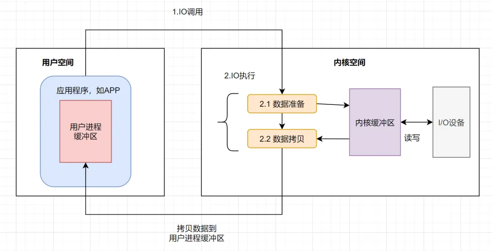

# 5. IO

## 通识

1. 广义上讲，IO 就是一次网络请求或者一次磁盘的读写；
2. 软件分为两大类，一类是用户的应用程序（aka，用户进程、应用程序、用户程序，下面统称用户程序），另一类是操作系统；用户程序都是运行在操作系统之上的；
3. 用户程序中的 IO，本质上都是调用操作系统暴露出来的 API 接口来完成的。简要过程是：
   1. 用户程序调用操作系统的 API；
   2. 操作系统调用具体外部设备的驱动（如网卡驱动、磁盘驱动等），具体的外部设备完成 IO 动作，获得数据；
   3. 之后再依次向上返回；
   4. 注意：这个过程中还涉及到数据的存取，即操作系统还要分配一些额外的内存空间用来保存 IO 的数据；
4. 从用户程序中 IO 的简要过程中可以看出来： 操作系统可以使用的计算机资源是有限的（如外部设备、IO 数据所占用的内存空间等），因此为应付更多的用户程序，需要对这些有限的资源进行约束，以防止用户程序的滥用；
   1. 为防止用户程序对内存的滥用，计算机在设计时，把能够使用的内存区域划分为两个部分，内核区域（aka，内核空间）和用户进程区域（aka，用户空间），内核区域专供操作系统使用，用户的应用程序要想使用内存，则需要向操作系统申请，操作系统会在用户区域为每一个用户的应用程序都划分一小块独立的区域；用户的应用程序的 IO 操作实际上操作的是用户进程缓存区中的数据；
5. 对上面的过程进行抽象，我们可以得出一个用户程序中的 IO 过程的简要编程模型：
   1. 
6.
7. 可以看出操作系统访问 IO ；同步 IO 和 非同步 IO 是操作系统级别的。主要描述的是操作系统在收到程序请求 IO 操作后，如果 IO 资源没有准备好，该如何相应程序的问题：前者不响应，直到 IO 资源准备好以后；后者返回一个标记（好让程序和自己知道以后的数据往哪里通知），当 IO 资源准备好以后，再用事件机制返回给程序。
8. 阻塞 IO 和 非阻塞 IO 是应用程序级别的。主要描述的是程序请求操作系统 IO 操作后，如果 IO 资源没有准备好，那么程序该如何处理的问题：前者等待；后者继续执行（并且使用线程一直轮询，直到有 IO 资源准备好了）
9.

https://pdai.tech/md/java/io/java-io-bio.html
https://mp.weixin.qq.com/s/77G2NxfjZlT-icfqrHCizQ
https://blog.csdn.net/yinwenjie/article/details/48472237?spm=1001.2101.3001.10796
