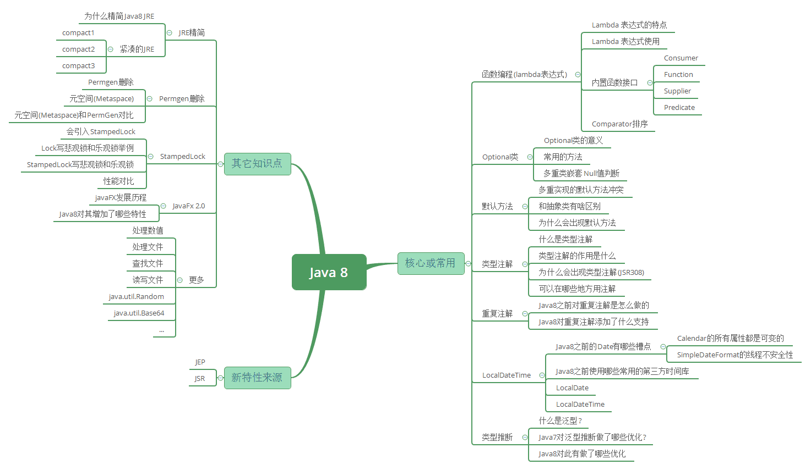
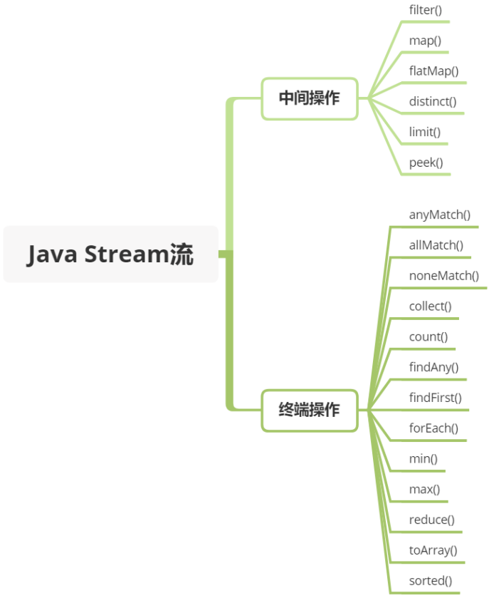

## 编程范式

> 编程范式：就是使用计算机编程时所采用的实现方式。主要有三种： 命令式编程、声明式编程、函数式编程。

1. **命令式编程**： 关注计算机执行的步骤，即**告诉计算机先执行什么再执行什么**。几乎所有的编程语言都支持这种编程方式。
2. **声明式编程**： **只告诉计算机该做什么，但不知道具体怎么做**。这种方式有两个特点：一是这种编程方式不包含变量；二是这种编程方式不包含逻辑控制结构（如，for、if、while...）。Java 中的面向接口编程可以看作是声明式编程。
3. **函数式编程**： 与声明式编程类似，也是只告诉计算机该做什么，但不关注具体怎么做。**但这种编程方式最重要的特点是“函数第一位”，即函数可以出现在任何地方，比如可以把函数作为参数传递给另一个函数，也可以将函数作为返回值**。如 Java 中的 java.util.function 包以及 Java 中的 Lambda 表达式。

> 参考： [编程范式：命令式编程(Imperative)、声明式编程(Declarative)和函数式编程(Functional)](https://www.cnblogs.com/sirkevin/p/8283110.html)

## 接口与抽象类

### 接口

1. 定义：使用 `interface` 进行标识，表示这是一个接口；
2. 内容：
   1. 既可以有方法，也可以有变量；
   2. 变量：隐式声明为 `public static final` ，只表示“这个变量是为了给方法使用”，并不代表“属性”的含义；
   3. 方法：
      1. 早期 JDK 版本中，接口的方法的访问域为： `public abstract` ，并且大多情况下都是省略的、隐式的，这种方法只有方法声明，没有方法实现，即没有方法体；
      2. JDK8 为了解决“一处改，处处改（即：一个接口修改，实现此接口的所有类都要跟着修改）”的弊端，对接口的方法的访问域进行了扩展：即，除了之前版本的 `public abstract` 域之外，又新增两个域： default 和 static ，用这两个关键字修饰的方法仍然隐式声明为 public，但这两种方法可以有方法体；
         1. default 方法为普通实例方法，可以使用 this 调用，也可以被子类继承、重写；
         2. static 方法为静态方法，使用上与一般类静态方法一样，只能通过接口名加“.”的方式进行调用，并且不可以被子类继承；
   4. 不能包含静态代码块；
3. 使用：使用关键字 `implements` 表示实现，支持多实现；
4. 设计上： **表示一系列行为的集合**。侧重点在“行为”，并且变量也是为了行为而存在，并不表示“属性”的含义；具有一种“辐射式设计”的感觉；

### 抽象类

1. 定义：使用 `abstract class` 进行标识，表示这是一个抽象类；
2. 内容：
   1. 里面也是既可以有方法，也可以有变量；
   2. 变量： 访问域没有限制，并且变量既可以给方法使用，也可以代表“这一类”对象都具有的“属性”的含义；
   3. 方法： 访问域没有限制，既可以只做声明，也可以有具体实现；
   4. 可以包含静态代码块；
3. 使用： 使用关键字 `extends` 表示继承，并且只能单继承；
4. 设计上：**表示一类事物，但这种事物具有通用的“行为（即方法）”，并且这一类事物具有一些特征“属性”**；具有一种“模板式设计”的感觉；

> 参考： [Java 抽象类和接口的区别，看这一篇就够了，全面解析](https://javabetter.cn/oo/abstract-vs-interface.html)

## 函数式编程接口

> 函数式编程接口：也称 SAM（**S**ingle **A**bstract **M**ethod interfaces，简单抽象方法接口） 接口，特点就是： 有且仅有一个抽象方法（除 Object 类中的方法），但可以有多个非抽象方法。
>
> 【为什么要有这个概念？】or 【为什么会单单从接口中定义出此类接口呢？ 】
> 原因是在 Java Lambda 的实现中， 开发组不想再为 Lambda 表达式（即箭头类型（arrow type））单独定义一种特殊的 Structural 函数类型，依然想采用 Java 既有的类型系统(class, interface, method 等)， 原因是增加一个结构化的函数类型会增加函数类型的复杂性，破坏既有的 Java 类型，并对成千上万的 Java 类库造成严重的影响。 权衡利弊， 因此最终还是利用 SAM 接口作为 Lambda 表达式的目标类型。

1. 函数式接口 (Functional Interface) 就是**一个有且仅有一个抽象方法，但是可以有多个非抽象方法**的接口。
2. 函数式接口可以被隐式转换为 lambda 表达式（箭头函数），有时也称闭包。
3. 函数式接口代表的一种契约， 一种对某个特定函数类型的契约。
4. Lambda 表达式不能脱离上下文而存在，它必须要有一个明确的目标类型 (interface)，而这个目标类型就是某个函数式接口。
5. java8 之前已经存在的函数式接口有很多，比如 java.lang.Runnable、java.util.concurrent.Callable、java.util.Comparator 等，而新增加的函数式接口都在 java.util.function 包下。
6. Java 不会强制要求你使用 @FunctionalInterface 注解来标记你的接口是函数式接口， 然而，作为 API 作者， 你可能倾向使用 @FunctionalInterface 指明特定的接口为函数式接口， 这只是一个设计上的考虑， 可以让用户很明显的知道一个接口是函数式接口。

Lambda 表达式： `() -> {}` ，表示一个匿名方法， () 里面是参数， {} 里面是方法主体。这种表达式，恰好可以表达函数式接口的具体实现。

使用函数式编程的好处：

1. 可以让 Java 的方法有了“可以传入方法作为参数”的特性；
2. 同时也让 Java 能够支持返回方法的特性（这一点很重要，这是链式编程模式的基础）；

举例说明，如：

```java
List<Integer> strings = Arrays.asList(1, 2, 3);

// @1： 早期版本实现排序的方法
Collections.sort(strings, new Comparator<Integer>() {
    @Override
    public int compare(Integer o1, Integer o2) {
        return o1 - o2;
    }
});

// @2： Lambda的使用方法
Collections.sort(strings, (Integer o1, Integer o2) -> o1 - o2);

// @3： Lambda分解开的使用方法
Comparator<Integer> comparator = (Integer o1, Integer o2) -> o1 - o2;
Collections.sort(strings, comparator);

```

说明：

1. 实现排序的需求，调用了 Collections 工具类中的 sort 方法，这个方法有两个参数，第一个参数是： 需要排序的集合对象，第二个参数是：比较的方法，即具体应该怎么比较；
2. 我们看 Comparator 接口，会发现这个接口中只有一个抽象方法（不算 Object 的抽象方法）int compare(T o1, T o2); ，此时，这个抽象方法就可以使用 Lambda 表达式；

内建的函数式编程接口： java.util.function 中定义了几组类型的函数式接口以及针对基本数据类型的子接口。

- Predicate -- 传入一个参数，返回一个 bool 结果， 方法为 boolean test (T t)
- Consumer -- 传入一个参数，无返回值，纯消费。 方法为 void accept (T t)
- Function -- 传入一个参数，返回一个结果，方法为 R apply (T t)
- Supplier -- 无参数传入，返回一个结果，方法为 T get ()
- UnaryOperator -- 一元操作符， 继承 Function, 传入参数的类型和返回类型相同。
- BinaryOperator -- 二元操作符， 传入的两个参数的类型和返回类型相同， 继承 BiFunction

> 说白了，就是 Java 设计人员给我们下了规定，规定只有满足上面这些方法要求的方法，才可以使用 Lambda 表达式调用。

> [java8 函数式接口(Functional Interface)，一篇抠脚都能懂的入门文章](https://my.oschina.net/u/3244997/blog/3014977)

## Stream

java 新增了 java.util.stream 包，它和之前的流大同小异。之前接触最多的是资源流，比如 java.io.FileInputStream，通过流把文件从一个地方输入到另一个地方，它只是内容搬运工，对文件内容不做任何 CRUD。

Stream 依然不存储数据，不同的是它可以**检索(Retrieve)**和**逻辑处理**集合数据，包括**筛选**、**排序**、**统计**、**计数**等。可以想象成是 Sql 语句。它的源数据可以是 Collection、Array 等。由于它的方法参数都是函数式接口类型，所以一般和 Lambda 配合使用。

这些操作可能是 **中间操作** 亦或是 **终端操作**。 终端操作会返回一个结果，而中间操作会返回一个 Stream 流。


使用方式的最大特点就是链式调用，可以很大程度上减少代码的冗余度。但是可读性欠佳，不过熟悉之后就好了。

```java
List<String> stringCollection = new ArrayList<>();
stringCollection.add("ddd2");
stringCollection.add("aaa2");
stringCollection.add("bbb1");
stringCollection.add("aaa1");
stringCollection.add("bbb3");
stringCollection.add("ccc");
stringCollection.add("bbb2");
stringCollection.add("ddd1");

// 1. filter-过滤方法 ========================================================================
stringCollection.stream()
.filter((s) -> s.startsWith("a"))
.forEach(System.out::println); // 结果： "aaa2", "aaa1"


// 2. sorted-排序方法 ========================================================================
stringCollection.stream()
.sorted()
.filter((s) -> s.startsWith("a"))
.forEach(System.out::println); // 结果： "aaa1", "aaa2"

// 3. map-映射方法  ========================================================================
stringCollection.stream()
.map(String::toUpperCase)
.sorted((a, b) -> b.compareTo(a))
.forEach(System.out::println); // 结果： "DDD2", "DDD1", "CCC", "BBB3", "BBB2", "AAA2", "AAA1"

// 4. Match-匹配   ========================================================================
// 验证 list 中 string 是否有以 a 开头的, 匹配到第一个，即返回 true
boolean anyStartsWithA = stringCollection.stream()
         .anyMatch((s) -> s.startsWith("a"));
System.out.println(anyStartsWithA); // 结果： true

// 验证 list 中 string 是否都是以 a 开头的
boolean allStartsWithA = stringCollection.stream()
         .allMatch((s) -> s.startsWith("a"));
System.out.println(allStartsWithA); // 结果： false

// 验证 list 中 string 是否都不是以 z 开头的,
boolean noneStartsWithZ = stringCollection.stream()
         .noneMatch((s) -> s.startsWith("z"));
System.out.println(noneStartsWithZ); // 结果： true


//  5. count-统计方法   ========================================================================
// 先对 list 中字符串开头为 b 进行过滤，让后统计数量
long startsWithB = stringCollection.stream()
         .filter((s) -> s.startsWith("b")).count();
System.out.println(startsWithB); // 结果： 3

// 6. reduce-扩缩容方法
Optional<String> reduced = stringCollection.stream()
         .sorted()
         .reduce((s1, s2) -> s1 + "#" + s2);
reduced.ifPresent(System.out::println); // 结果： "aaa1#aaa2#bbb1#bbb2#bbb3#ccc#ddd1#ddd2"


```

每个 Stream 都有两种模式: 顺序执行和并行执行。

```java
// 顺序执行
List <Person> people = list.getStream.collect(Collectors.toList());

// 并行执行
List <Person> people = list.getStream.parallel().collect(Collectors.toList());

```

大家对 hadoop 有稍微了解就知道，里面的 MapReduce 本身就是用于并行处理大数据集的软件框架，其 处理大数据的核心思想就是大而化小，分配到不同机器去运行 map，最终通过 reduce 将所有机器的结果结合起来得到一个最终结果，与 MapReduce 不同，Stream 则是利用多核技术可将大数据通过多核并行处理，而 MapReduce 则可以分布式的。
顾名思义，当使用顺序方式去遍历时，每个 item 读完后再读下一个 item。而使用并行去遍历时，数组会被分成多个段，其中每一个都在不同的线程中处理，然后将结果一起输出。

TODO：

1. 构建者设计模式与链式调用；
2. Stream 的各种方法及使用案例
3. Optional
4. 日期

## 总结

1. 早期 JDK 版本中，虽然也能达到方法中传入参数的需求，但是这种方式比较复杂；为了简化这种方式，JDK1.8 新增了两个关键特性： 函数式编程接口和 Lambda 表达式。
2. 函数式编程接口就是**一个有且仅有一个抽象方法，但是可以有多个非抽象方法**的接口，说白了就是提供了一种方法的约定， Lambda 表达式是函数式编程接口的使用方式；我们可以认为**： 只要某一个接口中有且仅有一个抽象方法，那么这个抽象方法就可以通过 Lambda 表达式的方式进行使用。**
3. JDK1.8 之后新增了很多函数式编程接口，这相当于给程序员提供了一系列的约定，这些约定中规定了方法的具体的参数，但没有规定方法的具体实现，这相当于把具体实现延后到使用时定义，这为程序员提供了很大的便利；
4. 新增的函数式编程接口放到了 java.util.function 包中，主要包含以下几大类：

- Predicate -- 传入一个参数，返回一个 bool 结果， 方法为 boolean test (T t)
- Consumer -- 传入一个参数，无返回值，纯消费。 方法为 void accept (T t)
- Function -- 传入一个参数，返回一个结果，方法为 R apply (T t)
- Supplier -- 无参数传入，返回一个结果，方法为 T get ()
- UnaryOperator -- 一元操作符， 继承 Function, 传入参数的类型和返回类型相同。
- BinaryOperator -- 二元操作符， 传入的两个参数的类型和返回类型相同， 继承 BiFunction

5. 除提供了一系列的函数式编程接口以外，Java 设计人员还提供了函数式编程思想的特殊应用场景： Stream、Optional

## 参考

1.

2.
