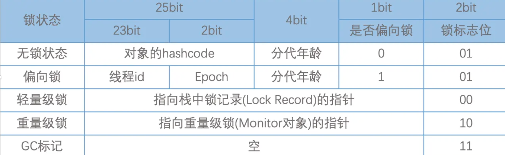
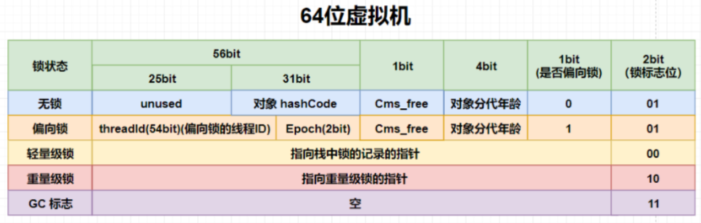

# synchronized 关键字

> 虚拟机栈
> 方法的运行原理：当执行到一个方法时，虚拟机 Java 中的方法，就是 Java 虚拟机栈中的栈帧，栈帧

## 使用场景

- 同步方法： 字节码生成的是 ACC_SYNCHRONIZED
  - 同步普通方法，锁的是当前对象。
  - 同步静态方法，锁的是当前 Class 对象。
- 同步块： 字节码生成的是 monitorenter 和 moniterexit
  - 锁的是{}中的对象，这段区域被成为临界区。

## 迭代过程及监视器对象机制

- 1.6 之前是重量级锁，重量级锁的性能很低，因此 1.6 之后对 synchronized 进行了锁优化，采用了锁粗化、锁消除、偏向锁、轻量级锁等锁的优化手段
- 重量级锁实现是基于监视器锁机制实现的。
  - 多线程执行的大概原理，从 JVM 的角度来讲，就是虚拟机栈中的操作指令访问堆中某些共享对象。Java 是通过给每一个 Java 共享对象都创建一个监视器对象（ ObjectMonitor ， 是由 C++实现的）来实现多线程访问的（共享对象与监视器对象一一对应）；
  - ObjectMonitor 的数据结构
    - cxq： 临时队列，存放临时的 ObjectWaiter （本质上就是线程）
    - waiteset： 等待队列，对象执行了 wait() 方法后，操作改对象的线程封装成 ObjectWaiter 进入此队列
    - entrylist： 阻塞队列，对象执行了 notify() 方法后，操作对象的线程被封装成 ObjectWaiter 进入此队列
    - count： 获得锁的次数
    - owner ： 获得锁的线程 ID
  - 加锁过程： 当一个线程获得锁之后，会把监视器对象的 owner 设置为这个线程的 ThreadID，然后 count 加 1；如果再有线程尝试获得锁，就进入 EntryList 等待；
  - 解锁过程： 当一个线程释放锁时，会把监视器对象的 owner 设置为 null，然后 count 减 1，然后再从 waitset 或 entrylist 中 get 一个线程，让这个线程尝试获取锁；

在 Hotspot 虚拟机中，Monitor 由 ObjectMonitor 实现：

```
ObjectMonitor() {
  _count        = 0; // 记录线程获取锁的次数
  _owner        = NULL;  // 指向持有ObjectMonitor对象的线程
  _WaitSet      = NULL;  // 处于wait状态的线程，会被加入到_WaitSet
  _cxq          = NULL ;
  _EntryList    = NULL ;  // 处于等待锁block状态的线程，会被加入到该列表
}
```

## 对象头信息




- 无锁状态
  - 对象头里面保存的数据为： hashcode +     分代年龄 + 偏向标识（为 0） + 锁标志位（为 01）
  - 表示： 此对象没有被多线程访问；
- 偏向锁状态
  - 对象头里面保存的数据为： ThreadID + epoch + 分代年龄 + 偏向标识（为 1） + 锁标志位（为 01）
  - 表示： 此对象正在被 ThreadID 访问；
- 轻量级锁状态
  - 对象头里面保存的数据为： 指向栈中锁记录（Lock Record）的指针 + 锁标志位（为 00）
  - 表示： 此对象存在轻微争抢；
- 重量级锁状态
  - 对象头里面保存的数据为： 指向 Java 监视器对象（Monitor 对象）的指针 + 锁标志位（为 10）；
  - 表示： 此对象存在严重争抢；

## 锁升级

1.6 之前使用的是重量级锁机制，它的内部实现是基于监视器对象来实现的。1.6 之后，引入了锁升级机制，提高了并发的性能，一定程度上解决了重量级锁性能低的问题。

- (1）当没有被当成锁时，这就是一个普通的对象，Mark Word 记录对象的 HashCode，锁标志位是 01，是否偏向锁那一位是 0;
- (2）当对象被当做同步锁并有一个线程 A 抢到了锁时，锁标志位还是 01，但是否偏向锁那一位改成 1，前 23bit 记录抢到锁的线程 id，表示进入偏向锁状态;
- (3) 当线程 A 再次试图来获得锁时，JVM 发现同步锁对象的标志位是 01，是否偏向锁是 1，也就是偏向状态，Mark Word 中记录的线程 id 就是线程 A 自己的 id，表示线程 A 已经获得了这个偏向锁，可以执行同步中的代码;【可重入的原理】
- (4) 当线程 B 试图获得这个锁时，JVM 发现同步锁处于偏向状态，但是 Mark Word 中的线程 id 记录的不是 B，那么线程 B 会先用 CAS 操作试图获得锁，这里的获得锁操作是有可能成功的，因为线程 A 一般不会自动释放偏向锁。如果抢锁成功，就把 Mark Word 里的线程 id 改为线程 B 的 id，代表线程 B 获得了这个偏向锁，可以执行同步代码。如果抢锁失败，则继续执行步骤 5;
- (5) 偏向锁状态抢锁失败，代表当前锁有一定的竞争，偏向锁将升级为轻量级锁。JVM 会在当前线程的线程栈中开辟一块单独的空间，里面保存指向对象锁 Mark Word 的指针，同时在对象锁 Mark Word 中保存指向这片空间的指针。上述两个保存操作都是 CAS 操作，如果保存成功，代表线程抢到了同步锁，就把 Mark Word 中的锁标志位改成 00，可以执行同步代码。如果保存失败，表示抢锁失败，竞争太激烈，继续执行步骤 6;
- (6) 轻量级锁抢锁失败，JVM 会使用自旋锁，自旋锁不是一个锁状态，只是代表不断的重试，尝试抢锁。从 JDK1.7 开始，自旋锁默认启用，自旋次数由 JVM 决定。如果抢锁成功则执行同步代码，如果失败则继续执行步骤 7;
- (7) 自旋锁重试之后如果抢锁依然失败，同步锁会升级至重量级锁，锁标志位改为 10。在这个状态下，未抢到锁的线程都会被阻塞。
- (8) 升级成重量级锁之后，就开始使用 `监视器对象机制` 来控制并发了。

总结：

1. Java1.6 之前是重量级锁，重量级锁是基于监视器对象机制来控制并发的；但是重量级锁的性能很低，所以 1.6 之后，Java 对 synchronized 关键字进行了优化，引入了锁升级机制；
2. 锁升级过程主要是把不同线程对锁的争夺来抽象成： 使用 cas 算法对 Java 堆中对象头的锁标志位的更新来完成的。升级过程是：先由无锁状态升级到偏向锁状态，之后再升级到轻量级锁，最后升级为重量级锁；
3. 转化成重量级锁之后，使用的则是 Java1.6 之前的监视器对象机制来完成同步的；

## synchronized 与 ReentrantLock 的区别

- 1.6 之前 synchronized 是重量级锁，性能要远远差于 ReentrantLock； 1.6 之后 jdk 对 synchronized 进行锁优化后，二者性能相差无几；
- synchronized 为隐式锁，即不需要手动在代码中写加锁、解锁逻辑； ReentrantLock 为显式锁，需要显式地在代码中添加 加锁、解锁逻辑；
- ReentrantLock 还能实现 等待可中断、公平锁、绑定多个条件等功能；

## synchronized 是如何保证可见性和有序性的？

通过两步操作来保证可见性：

1. 加锁时，线程必须从主内存读取最新数据。
2. 释放锁时，线程必须将修改的数据刷回主内存，这样其他线程获取锁后，就能看到最新的数据

通过 JVM 指令 monitorenter 和 monitorexit，来确保加锁代码块内的指令不会被重排。
