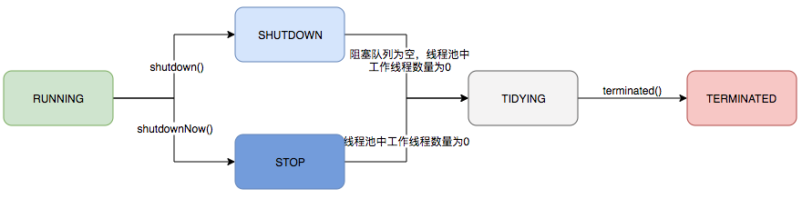
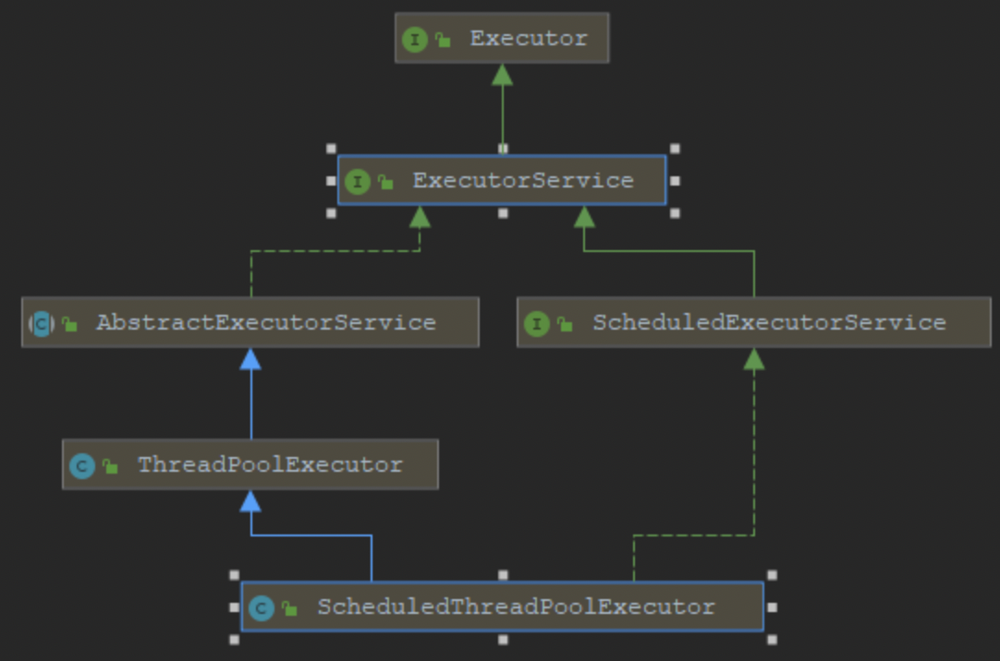
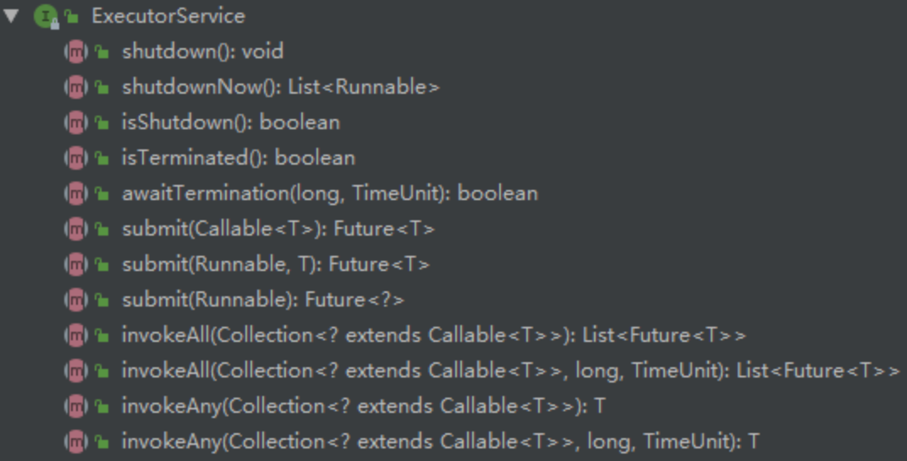

# 线程池

## 为什么要使用线程池？

直接 new 一个线程真的不香，原因主要在于创建大量相同的线程会大量的消耗系统内存，甚至会导致系统内存耗尽；同时，大量的线程会竞争 CPU 的调度，导致 CPU 过度切换。在阿里巴巴 java 开发手册中也有提到过为什么不提倡使用单个线程的原因，就是在于上面这两个原因。

那么使用线程池的优点是什么呢？使用线程池有以下几方面的优点：

1. **减少系统开销**。减少在创建和销毁线程上所花费的时间和系统资源的开销
2. **提高响应速度**。当任务到达之后，任务可以不需要等到线程创建就能被立即执行
3. **提高线程的可管理性**。线程是稀缺资源，如果无限制的的创建，不仅会消耗系统资源，还会降低系统性能，使用线程池可以进行统一分配，调优和监控。

## 标准构造器创建线程池

<details>

<summary>ThreadPoolExecutor核心构造器-源码</summary>

```java
// java.util.concurrent.ThreadPoolExecutor

Creates a new ThreadPoolExecutor with the given initial parameters.
Params:
    corePoolSize – the number of threads to keep in the pool, even if they are idle, unless allowCoreThreadTimeOut is set
    maximumPoolSize – the maximum number of threads to allow in the pool
    keepAliveTime – when the number of threads is greater than the core, this is the maximum time that excess idle threads will wait for new tasks before terminating.
    unit – the time unit for the keepAliveTime argument
    workQueue – the queue to use for holding tasks before they are executed. This queue will hold only the Runnable tasks submitted by the execute method.
    threadFactory – the factory to use when the executor creates a new thread
    handler – the handler to use when execution is blocked because the thread bounds and queue capacities are reached

Throws:
    IllegalArgumentException – if one of the following holds:
        corePoolSize < 0
        keepAliveTime < 0
        maximumPoolSize <= 0
        maximumPoolSize < corePoolSize
    NullPointerException – if workQueue or threadFactory or handler is null

public ThreadPoolExecutor(
    @Range(from = 0, to = Integer.MAX_VALUE)  int corePoolSize,
    @Range(from = 1, to = Integer.MAX_VALUE)  int maximumPoolSize,
    @Range(from = 0, to = Long.MAX_VALUE)  long keepAliveTime,
    @NotNull  TimeUnit unit,
    @NotNull  BlockingQueue<Runnable> workQueue,
    @NotNull  ThreadFactory threadFactory,
    @NotNull  RejectedExecutionHandler handler ){}
```

</details>

- `corePoolSize`： 核心线程数。除非设置了 allowCoreThreadTimeOut，否则一直线程一直存在。
- `maximumPoolSize`： 最大线程数。
- `keepAliveTime`： 空闲线程存活时间。
- `unit`： 空闲线程存活时间单位。
  - TimeUnit.DAYS; 天
  - TimeUnit.HOURS; 小时
  - TimeUnit.MINUTES; 分钟
  - TimeUnit.SECONDS; 秒
  - TimeUnit.MILLISECONDS; 毫秒
  - TimeUnit.MICROSECONDS; 微秒
  - TimeUnit.NANOSECONDS; 纳秒
- `workQueue`： 阻塞队列。用来存储等待执行的任务，如果当前对线程的需求超过了 corePoolSize 大小，就会放在这里等待空闲线程执行
  - `LinkedBlockingQueue` ：无界队列。是一个基于链表实现的阻塞队列，按 FIFO 排序任务，可以设置容量（有界队列），不设置容量则默认使用 Integer.Max_VALUE 作为容量（无界队列）。该队列的吞吐量高于 ArrayBlockingQueue。 有两个快捷创建线程池的工厂方法 Executors.newSingleThreadExecutor 和 Executors.newFixedThreadPool 使用了这个队列，并且都没有设置容量（无界队列）。
  - `ArrayBlockingQueue` ： 有界队列。 是一个数组实现的有界阻塞队列（有界队列），队列中的元素按 FIFO 排序。ArrayBlockingQueue 在创建时必须设置大小。
  - `SynchronousQueue` ： 同步队列。 是一个不存储元素的阻塞队列，每个插入操作必须等到另一个线程的调用移除操作，否则插入操作一直处于阻塞状态，其吞吐量通常高于 LinkedBlockingQueue 。快捷工厂方法 Executors.newCachedThreadPool 所创建的线程池使用此队列。与前面的队列相比，这个队列比较特殊，它不会保存提交的任务，而是直接新建一个线程来执行新来的任务。
  - `PriorityBlockingQueue` ：优先级队列。 是具有优先级的无界队列。
  - `DelayQueue` ：延迟队列。 这是一个无界阻塞延迟队列，底层基于 PriorityBlockingQueue 实现，队列中每个元素都有过期时间，当从队列 获取元素（元素出队）时，只有已经过期的元素才会出队，队列头部的 元素是过期最快的元素。快捷工厂方法 Executors.newScheduledThreadPool 所创建的线程池使用此队列。
  - `threadFactory`： 创建线程的线程工厂。当线程池需要新的线程时，会用 threadFactory 来生成新的线程；
- `handler`： 拒绝策略。
  - `AbortPolicy` ： 使用该策略时，如果线程池队列满了，新任务就会被拒绝，并且抛 出 RejectedExecutionException 异常。是线程池默认的拒绝策略。
  - `DiscardPolicy` ： 该策略是 AbortPolicy 的 Silent（安静）版本，如果线程池队列满 了，新任务就会直接被丢掉，并且不会有任何异常抛出。
  - `DiscardOldestPolicy` ： 抛弃最老任务策略，也就是说如果队列满了，就会将最早进入队列的任务抛弃，从队列中腾出空间，再尝试加入队列。因为队列是队尾进队头出，队头元素是最老的，所以每次都是移除队头元素后再尝试入队。
  - `CallerRunsPolicy` ： 调用者执行策略。在新任务被添加到线程池时，如果添加失败，那 么提交任务线程会自己去执行该任务，不会使用线程池中的线程去执行新任务。
  - `自定义策略` ： 如果以上拒绝策略都不符合需求，那么可自定义一个拒绝策略，实现 RejectedExecutionHandler 接口的 rejectedExecution 方法即可。
  - 在以上 4 种内置策略中，线程池默认的拒绝策略为 AbortPolicy，如果提交的任务被拒绝，线程池就会抛出 RejectedExecutionException 异常，该异常是非受检异常（运行时异常），很容易忘记捕获。如果关心任务被拒绝的事件，需要在提交任务时捕获 RejectedExecutionException 异常。

<details>

<summary>线程池的线程数选取</summary>

简单来讲，要看具体的任务类型，

- **IO 密集型任务**： 此类任务主要是执行 IO 操作。由于执行 IO 操作的时间较长，导致 CPU 的利用率不高，这类任务 CPU 常处于空闲状态。Netty 的 IO 读写操作为此类任务的典型例子。
  - **通常需要开 CPU 核心数两倍 的线程。**
- **CPU 密集型任务** ： 此类任务主要是执行计算任务。由于响应时间很快，CPU 一直在运行，这种任务 CPU 的利用率很高。
  - **线程数等于 CPU 数就行**
- **混合型任务** ： 此类任务既要执行逻辑计算，又要进行 IO 操作（如 RPC 调用、数据 库访问）。相对来说，由于执行 IO 操作的耗时较长（一次网络往返往往 在数百毫秒级别），这类任务的 CPU 利用率也不是太高。Web 服务器的 HTTP 请求处理操作为此类任务的典型例子。
  - **最佳线程数目 = (线程等待时间与线程占用 CPU 时间之比 + 1) \* CPU 核数**

> 核心数可以通过 Java 的 Runtime.getRuntime().availableProcessors()方法获取。

在实际的开发过程中，要根据业务需求和系统资源来调整其它参数。有时候可能还会动态调整。

</details>

<details>

<summary>如何判断线程数是多还是少？</summary>

主要的分析思路：

1. 查看 CPU 使用率。较低，可能线程数太少；较高，但吞吐量并没有明显提升，可能线程数太多。
2. 分析线程运行情况，查看线程的状态、等待时间、运行时间等。如有很多线程处于 BLOCKED 状态，说明线程数过多，竞争比较激烈；如平均等待时间大于运行时间，任务可能属于 IO 密集型。

主要的工具：

1. top 命令查看 CPU 使用率；
2. VisualVM 或 Arthas 分析线程运行情况；
3. jstack 命令查看线程堆栈信息： `jstack <Java 进程 ID> | grep -A 20 "BLOCKED" ` 查看阻塞线程；

</details>

### 运行原理

- 线程池初始化时并没有线程，当来临任务时，开始创建一个线程，如果任务还是不能被及时的完成，就接着创建，直到达到核心线程数。（一旦创建的达到核心线程数后，就会永驻内存，但是要注意并不是指创建线程初期的线程就是核心线程，超过核心线程数之后创建的线程也有可能成为核心线程，最开始创建的线程有可能被销毁）；
- 如果创建了核心线程数大小的线程后依然有任务涌来，那就把这些任务放到阻塞队列中；
- 如果阻塞队列满了，依然有任务涌来，那么就接着创建线程，直到达到最大线程数；
- 如果达到最大线程数后，还有任务涌来，那么就执行拒绝策略；
- 如果任务执行完成之后，线程池会根据空闲线程存活时间对创建的线程进行销毁，直到线程数量等于核心线程数为止；

### 线程池状态

<details>

<summary>源码</summary>

```java
// java.util.concurrent.ThreadPoolExecutor
public class ThreadPoolExecutor extends AbstractExecutorService {

    /*The main pool control state, ctl, is an atomic integer packing two conceptual fields workerCount, indicating the effective number of threads runState, indicating whether running, shutting down etc In order to pack them into one int, we limit workerCount to (2^29)-1 (about 500 million) threads rather than (2^31)-1 (2 billion) otherwise representable. If this is ever an issue in the future, the variable can be changed to be an AtomicLong, and the shift/mask constants below adjusted. But until the need arises, this code is a bit faster and simpler using an int. The workerCount is the number of workers that have been permitted to start and not permitted to stop. The value may be transiently different from the actual number of live threads, for example when a ThreadFactory fails to create a thread when asked, and when exiting threads are still performing bookkeeping before terminating. The user-visible pool size is reported as the current size of the workers set. The runState provides the main lifecycle control, taking on values: RUNNING: Accept new tasks and process queued tasks SHUTDOWN: Don't accept new tasks, but process queued tasks STOP: Don't accept new tasks, don't process queued tasks, and interrupt in-progress tasks TIDYING: All tasks have terminated, workerCount is zero, the thread transitioning to state TIDYING will run the terminated() hook method TERMINATED: terminated() has completed The numerical order among these values matters, to allow ordered comparisons. The runState monotonically increases over time, but need not hit each state. The transitions are: RUNNING -> SHUTDOWN On invocation of shutdown(), perhaps implicitly in finalize() (RUNNING or SHUTDOWN) -> STOP On invocation of shutdownNow() SHUTDOWN -> TIDYING When both queue and pool are empty STOP -> TIDYING When pool is empty TIDYING -> TERMINATED When the terminated() hook method has completed Threads waiting in awaitTermination() will return when the state reaches TERMINATED. Detecting the transition from SHUTDOWN to TIDYING is less straightforward than you'd like because the queue may become empty after non-empty and vice versa during SHUTDOWN state, but we can only terminate if, after seeing that it is empty, we see that workerCount is 0 (which sometimes entails a recheck -- see below).*/

    private final AtomicInteger ctl = new AtomicInteger(ctlOf(RUNNING, 0));
    private static final int COUNT_BITS = Integer.SIZE - 3;
    private static final int CAPACITY   = (1 << COUNT_BITS) - 1;

    // runState is stored in the high-order bits
    private static final int RUNNING    = -1 << COUNT_BITS;
    private static final int SHUTDOWN   =  0 << COUNT_BITS;
    private static final int STOP       =  1 << COUNT_BITS;
    private static final int TIDYING    =  2 << COUNT_BITS;
    private static final int TERMINATED =  3 << COUNT_BITS;
    ...
}

```

</details>

<details>

<summary>谷歌翻译</summary>

```txt

主池控制状态 ctl 是一个原子整数，包含两个概念字段 workerCount（指示有效线程数）和 runState（指示线程是否正在运行、关闭等）。
为了将它们打包成一个整数，我们将 workerCount 限制为 (2^29)-1（约 5 亿个线程），而不是 (2^31)-1（20 亿个线程）。
如果将来出现此问题，可以将变量更改为 AtomicLong，并调整下面的移位/掩码常量。
但在需要之前，使用整数会更快、更简洁地处理此代码。
workerCount 是允许启动但不允许停止的工作线程数。该值可能暂时与实际活动线程数不同，例如，当 ThreadFactory 在被要求创建线程时失败，以及退出线程在终止前仍在执行记录时。用户可见的池大小报告为工作线程集的当前大小。
runState 提供主要的生命周期控制，其值包括：

1. RUNNING：接受新任务并处理排队任务；
2. SHUTDOWN：不接受新任务，但处理排队任务；
3. STOP：不接受新任务，不处理排队任务，并尝试中断正在进行的任务；
4. TIDYING：所有任务已终止，workerCount 为零，转换到 TIDYING 状态的线程将运行 Terminated() 钩子方法；
5. TERMINATED：terminated() 已完成。表示线程池完全关闭，所有线程销毁。

这些值之间的数值顺序很重要，以便进行有序比较。runState 会随时间单调递增，但无需触发每个状态。 转换如下： RUNNING -> SHUTDOWN 调用 shutdown() 时，可能隐式地在 finalize() 中 （RUNNING 或 SHUTDOWN）-> STOP 调用 shutdownNow() 时 SHUTDOWN -> TIDYING 当队列和池都为空时 STOP -> TIDYING 当池为空时 TIDYING -> TERMINATED 当 Terminated() 钩子方法完成时 在 awaitTermination() 中等待的线程将在状态达到 TERMINATED 时返回。检测从 SHUTDOWN 到 TIDYING 的转换并不像您想象的那么简单，因为在 SHUTDOWN 状态下，队列可能在非空之后变为空，反之亦然，但我们只能在看到它为空后，如果看到 workerCount 为 0（有时需要重新检查 - 见下文）才能终止。
```

</details>

1. RUNNING：接受新任务并处理排队任务；
2. SHUTDOWN：不接受新任务，但处理排队任务；
3. STOP：不接受新任务，不处理排队任务，并尝试中断正在进行的任务；
4. TIDYING：所有任务已终止，workerCount 为零，转换到 TIDYING 状态的线程将运行 Terminated() 钩子方法；
5. TERMINATED：terminated() 已完成。表示线程池完全关闭，所有线程销毁。



### API

1. 提交任务

   - execute()方法
     - void execute(Runnable command);
   - submit()

   ```java
   <T> Future<T> submit(Callable<T> task);
   <T> Future<T> submit(Runnable task, T result);
   Future<?> submit(Runnable task);
   ```

   - 二者区别

     - 接受参数不同
     - submit()提交任务后会有返回值，而 execute()没有
     - submit()方便 Exception 处理

2. 钩子方法

```java
//任务执行之前的钩子方法（前钩子）
protected void beforeExecute(Thread t, Runnable r) { }
//任务执行之后的钩子方法（后钩子）
protected void afterExecute(Runnable r, Throwable t) { }
//线程池终止时的钩子方法（停止钩子）
protected void terminated() { }

```

3. 优雅关闭

- shutdown ： 是 JUC 提供的一个有序关闭线程池的方法，此方法会等待当前工作队列中的剩余任务全部执行完成之后，才会执行关闭， 但是此方法被调用之后线程池的状态转为 SHUTDOWN ，线程池不会再 接收新的任务。
- shutdownNow ： 是 JUC 提供的一个立即关闭线程池的方法，此方法会停止接收任务、打断正在执行的工作线程、并且还会清空当前工作队列中的剩余任务，返回的是尚未执行的任务。打断正在执行的工作线程，采用的是给任务线程发送 interrupt 信号，任务是否能真正终止取决于线程是否响应 InterruptedException 。
- awaitTermination ： 等待线程池完成关闭。在调用线程池的 shutdown()与 shutdownNow()方法时，当前线程会立即返回，不会一直等 待直到线程池完成关闭。如果需要等到线程池关闭完成，可以调用 awaitTermination()方法。

### 线程池中的异常

常见的处理方式有四种：

<details>

<summary>1. 在任务代码中直接使用 try-catch 捕获</summary>

```java
executor.execute(() -> {
    try {
        System.out.println("任务开始");
        int result = 1 / 0; // 除零异常
    } catch (Exception e) {
        System.err.println("捕获异常：" + e.getMessage());
    }
});

```

</details>

<details>

<summary>2. 使用 Future 获取异常</summary>

```java
Future<Object> future = executor.submit(() -> {
    System.out.println("任务开始");
    int result = 1 / 0; // 除零异常
    return result;
});

try {
    future.get();
} catch (InterruptedException | ExecutionException e) {
    System.err.println("捕获异常：" + e.getMessage());
}

```

适用于： 关心任务返回值。

</details>

<details>

<summary>3. afterExecute()钩子方法</summary>

```java
ThreadPoolExecutor executor = new ThreadPoolExecutor(2, 2, 0L, TimeUnit.MILLISECONDS,
    new LinkedBlockingQueue<Runnable>()) {
    @Override
    protected void afterExecute(Runnable r, Throwable t) {
        super.afterExecute(r, t); // 注意这里
        if (t != null) {
            System.err.println("捕获异常：" + t.getMessage());
        }
    }
};

executor.execute(() -> {
  System.out.println("任务开始");
  int result = 1 / 0; // 除零异常
});

```

如果想要全局捕获所有任务异常，可以这样：

```java
class MyThreadPoolExecutor extends ThreadPoolExecutor {
    @Override
    protected void afterExecute(Runnable r, Throwable t) {
        if (t == null && r instanceof Future<?>) {
            try {
              ((Future<?>) r).get();
            } catch (Exception e) {
              System.err.println("任务异常：" + e.getCause());
            }
        }
    }
}
```

</details>

<details>

<summary>4. 使用 UncaughtExceptionHandler 捕获异常</summary>

```java
ThreadPoolExecutor executor = new ThreadPoolExecutor(
      2,
      2,
      0L,
      TimeUnit.MILLISECONDS,
      new LinkedBlockingQueue<Runnable>()
    );
executor.setRejectedExecutionHandler(new ThreadPoolExecutor.AbortPolicy());
executor.setThreadFactory(new ThreadFactory() {
    @Override
    public Thread newThread(Runnable r) {
        Thread thread = new Thread(r);
        thread.setUncaughtExceptionHandler(new Thread.UncaughtExceptionHandler() {
            @Override
            public void uncaughtException(Thread t, Throwable e) {
                System.err.println("捕获异常：" + e.getMessage());
            }
        });
        return thread;
    }
});

executor.execute(() -> {
  System.out.println("任务开始");
  int result = 1 / 0; // 除零异常
});

```

如果项目使用 execute()，不关心任务返回值，建议这样：

```java

thread.setUncaughtExceptionHandler((t, e) ->
    System.err.println("线程 " + t.getName() + " 捕获到异常：" + e.getMessage()));

```

</details>

### 线程池最佳实践及其调优

第一个，选择合适的线程池大小。过小的线程池可能会导致任务一直在排队；过大的线程池可能会导致大家都在竞争 CPU 资源，增加上下文切换的开销。

第二个，选择合适的任务队列。使用有界队列可以避免资源耗尽的风险，但是可能会导致任务被拒绝；使用无界队列虽然可以避免任务被拒绝，但是可能会导致内存耗尽。

比如在使用 LinkedBlockingQueue 的时候，可以传入参数来限制队列中任务的数量，这样就不会出现 OOM。

第三个，尽量使用自定义的线程池，而不是使用 Executors 创建的线程池。

因为 newFixedThreadPool 线程池由于使用了 LinkedBlockingQueue，队列的容量默认无限大，任务过多时会导致内存溢出；newCachedThreadPool 线程池由于核心线程数无限大，当任务过多的时候会导致创建大量的线程，导致服务器负载过高宕机。

调优核心思想是：

1. 事前评估；
2. 监控和报警；
3. 动态调整；
4. 事后观察；

首先我会根据任务类型设置核心线程数参数，比如 IO 密集型任务会设置为 CPU 核心数\*2 的经验值。

其次我会结合线程池动态调整的能力，在流量波动时通过 setCorePoolSize 平滑扩容，或者直接使用 DynamicTp 实现线程池参数的自动化调整。

最后，我会通过内置的监控指标建立容量预警机制。比如通过 JMX 监控线程池的运行状态，设置阈值，当线程池的任务队列长度超过阈值时，触发告警。

[推荐阅读](https://tech.meituan.com/2020/04/02/java-pooling-pratice-in-meituan.html)

线程池执行中断电了应该怎么处理？

线程池本身只能在内存中进行任务调度，并不会持久化，一旦断电，线程池里的所有任务和状态都会丢失。

我会考虑以下几个方面：

第一，持久化任务。可以将任务持久化到数据库或者消息队列中，等电恢复后再重新执行。

第二，任务幂等性，需要保证任务是幂等的，也就是无论执行多少次，结果都一致。

第三，恢复策略。当系统重启时，应该有一个恢复流程：检测上次是否有未完成的任务，将这些任务重新加载到线程池中执行，确保断电前的工作能够恢复。

## 快捷工厂创建线程池方式

### 背景

正是由于线程池的标准创建模式参数较多，使用时需要对线程池原理了解较深才能熟练使用，因此 juc 包中又提供了一种快捷创建线程池的方式，这种方式就是快捷工厂创建线程池方式。

它们本质上都是 ThreadPoolExecutor 的不同配置。

### 单线程线程池

- Executors.newSingleThreadExecutor()， 适用于需要按顺序执行任务的场景；
- 始终只创建 1 个线程，新任务必须等待前一个任务完成后才能执行，其他任务都被放入队列排队，无法并行处理任务；
- 使用 LinkedBlockingQueue 作为阻塞队列，

### 固定大小的线程池

- Executors.newFixedThreadPool(nThreads)
- 适合用于任务数量确定，且对线程数有明确要求的场景；
- corePoolSize == maximumPoolSize，
- 默认使用 LinkedBlockingQueue 作为阻塞队列，可能导致任务堆积，甚至 OOM ；

### 缓存线程池

- Executors.newCachedThreadPool()
- 适用于短时间内任务量波动较大的场景；
- 线程池大小不固定，corePoolSize = 0，maximumPoolSize = Integer.MAX_VALUE，空闲线程超过 60 秒会被销毁，减少资源占用；
- 使用 SynchronousQueue 作为阻塞队列，线程数没有上限，在高并发情况下可能导致 OOM ；

### 定时任务线程池

- Executors.newScheduledThreadPool(int corePoolSize)， 适用于需要定时执行任务的场景；
- 线程池的大小可配置，支持定时 & 周期性任务执行，使用 DelayedWorkQueue 作为阻塞队列；
  - schedule() 方法可以将任务延迟一定时间后执行一次；
  - scheduleAtFixedRate() 方法可以将任务延迟一定时间后以固定频率执行；如果任务执行时间 > 设定时间间隔，可能会导致任务堆积；
  - scheduleWithFixedDelay() 方法可以将任务延迟一定时间后以固定延迟执行；

## 两种方式优劣

快捷工厂创建线程池的方式是不建议使用的，因为有些方式使用的是无界队列，这会导致内存溢出。推荐使用原生方式。

## java 中线程池框架






> ThreadPoolExecutor 和 ScheduledThreadPoolExecutor 算是我们最常用的线程池类了，从上面我们可以看到这俩个最终都实现了 Executor 和 ExecutorService 这两个接口，实际上主要的接口定义都是在 ExecutorService 中。

## 应用

<details>

<summary>一个简单的线程池使用的例子</summary>

```java
import java.util.concurrent.*;

public class MyThreadTest {

    private static ThreadPoolExecutor executor = new ThreadPoolExecutor(5,
            200,
            10,
            TimeUnit.SECONDS,
            new LinkedBlockingDeque<>(100000),
            Executors.defaultThreadFactory(),
            new ThreadPoolExecutor.AbortPolicy());

    public static void main(String[] args) throws ExecutionException, InterruptedException {

        // test();
        // corePoolSize – the number of threads to keep in the pool, even if they are idle,
        // unless allowCoreThreadTimeOut is set
        executor.allowCoreThreadTimeOut(true);

        // 1. 使用 execute 执行 Thread 类型的任务；
        executor.execute(new Thread01());

        // 2. 使用 execute 执行 Runable 类型的任务；
        executor.execute(new Runable01());
        // 不能使用 execute 执行 Callable 类型的任务；
        // executor.execute(new Callable01());     // 报编译错误

        // 3. 使用 submit 提交 Runable 类型的任务
        executor.submit(new Thread01());

        // 4. 使用 submit 提交 Runable 类型的任务；
        executor.submit(new Runable01());

        // 5. 使用 submit 提交有 返回值的 Callable 类型的任务
        Future<Integer> submit = executor.submit(new Callable01());
        Integer result = submit.get(); // 获取结果
        System.out.println(result);
    }

    public static void test() throws ExecutionException, InterruptedException {
        /**
         * 1. 使用： public Thread(Runnable target) 构造函数；
         *  由于 Runnable 是一个 @FunctionalInterface 标注的接口，而这个注解的作用：
         *      标记Runnable接口是一个“函数式接口”。在Java中，“函数式接口”是有且仅有一个抽象方法的接口。
         *      反过来说，如果一个接口中包含两个或两个以上的抽象方法，就不能使用 @FunctionalInterface 注解，否则编译会报错。
         */
        new Thread(() -> {
            System.out.println("当前线程："+Thread.currentThread().getId());
            int i = 10 / 2;
            System.out.println("运行结果："+i);
        }).start();

        // 使用的是 public Thread(Runnable target) 构造函数
        new Thread(new Thread01()).start();

        // 使用的是 public Thread(Runnable target) 构造函数
        new Thread(new Runable01()).start();

        // 使用的是 public Thread(Runnable target) 构造函数
        FutureTask<Integer> result = new FutureTask<>(new Callable01());
        new Thread(result).start();
        System.out.println(result.get());   // 阻塞获取，可以获取正常结果，也可以捕获异常；
    }

    public static class Thread01 extends Thread{
        @Override
        public void run() {
            System.out.println("当前线程："+Thread.currentThread().getId());
            int i = 10 / 2;
            System.out.println("运行结果："+i);
        }
    }

    public static class Runable01 implements Runnable{

        @Override
        public void run() {
            System.out.println("当前线程："+Thread.currentThread().getId());
            int i = 10 / 2;
            System.out.println("运行结果："+i);
        }
    }

    public static class Callable01 implements Callable<Integer> {

        @Override
        public Integer call() throws Exception {
            System.out.println("当前线程："+Thread.currentThread().getId());
            int i = 10 / 2;
            System.out.println("运行结果："+i);
            return i;
        }
    }

}

```

</details>

<details>

<summary>示例1. 一种简单的线程池使用方式</summary>

- 配置工具类

```java
public class ThreadPoolUtil {
    private static int corePoolSize = 5;
    private static int maxPollSize = 5;
    private static long keepAliveTime = 10;
    private stativ TimeUnit unit = TimeUnit.MINUTES;

    private static class Pool{
        private static ThreadPoolExecutor executor = new ThreadPoolExecutor(
            corePoolSize,
            maxPollSize,
            keepAliveTime,
            unit,
            new LinkedBlockingQueue<>(),
            r -> new Thread(r, "async-thread"),
            new ThreadPoolExecutor.CallerRunsPolicy()
        );
    }
}

```

- 使用方法

```java
ThreadPoolUtil.submitTask(
    ()->{
        // 你的任务方法；
    }
);

```

</details>

<details>

<summary>示例2. 在SpringBoot中使用线程池</summary>

1. 打开异步注解的开关

```java
@SpringBootApplication
@EnableAsync
public class ThreadpoolApplication {
    public static void main(String[] args) {
        SpringApplication.run(ThreadpoolApplication.class, args);
    }
}
```

2. 在需要异步执行的方法上加上@Async 注解

```java
@Service
public class AsyncTest {
    protected final Logger logger = LoggerFactory.getLogger(this.getClass());
    @Async
    public void hello(String name){
     //这里使用logger 方便查看执行的线程是什么
        logger.info("异步线程启动 started."+name);
    }
}
```

3. 验证

```java
@Autowired
AsyncTest asyncTest;

@Test
void contextLoads() throws InterruptedException {
    asyncTest.hello("afsasfasf");
    //一定要休眠 不然主线程关闭了，子线程还没有启动
    Thread.sleep(1000);
}
```

</details>

<details>

<summary>示例3. 自定义拒绝策略</summary>

```java
class CustomRejectedHandler {
    public static void main(String[] args) {
        // 自定义拒绝策略
        RejectedExecutionHandler rejectedHandler = (r, executor) -> {
            System.out.println(
              "Task " + r.toString() +
              " rejected. Queue size: " + executor.getQueue().size()
          );
        };

        // 自定义线程池
        ThreadPoolExecutor executor = new ThreadPoolExecutor(
            2,                      // 核心线程数
            4,                      // 最大线程数
            10,                     // 空闲线程存活时间
            TimeUnit.SECONDS,
            new ArrayBlockingQueue<>(2),  // 阻塞队列容量
            Executors.defaultThreadFactory(),
            rejectedHandler          // 自定义拒绝策略
        );

        for (int i = 0; i < 10; i++) {
            final int taskNumber = i;
            executor.execute(() -> {
                System.out.println("Executing task " + taskNumber);
                try {
                    Thread.sleep(1000); // 模拟任务耗时
                } catch (InterruptedException e) {
                    e.printStackTrace();
                }
            });
        }

        executor.shutdown();
    }
}
```

</details>

<details>

<summary>示例4. 手写线程池</summary>

- 核心线程池类：

```java
class CustomThreadPoolExecutor {

    private final int corePoolSize;
    private final int maximumPoolSize;
    private final long keepAliveTime;
    private final TimeUnit unit;
    private final BlockingQueue<Runnable> workQueue;
    private final RejectedExecutionHandler handler;

    private volatile boolean isShutdown = false;
    private int currentPoolSize = 0;

    // 构造方法
    public CustomThreadPoolExecutor(int corePoolSize, int maximumPoolSize, long keepAliveTime, TimeUnit unit,
                                    BlockingQueue<Runnable> workQueue, RejectedExecutionHandler handler) {
        this.corePoolSize = corePoolSize;
        this.maximumPoolSize = maximumPoolSize;
        this.keepAliveTime = keepAliveTime;
        this.unit = unit;
        this.workQueue = workQueue;
        this.handler = handler;
    }

    // 提交任务
    public void execute(Runnable task) {
        if (isShutdown) {
            throw new IllegalStateException("ThreadPool is shutdown");
        }

        synchronized (this) {
            // 如果当前线程数小于核心线程数，直接创建新线程
            if (currentPoolSize < corePoolSize) {
                new Worker(task).start();
                currentPoolSize++;
                return;
            }

            // 尝试将任务添加到队列中
            if (!workQueue.offer(task)) {
                if (currentPoolSize < maximumPoolSize) {
                    new Worker(task).start();
                    currentPoolSize++;
                } else {
                    // 调用拒绝策略
                    handler.rejectedExecution(task, null);
                }
            }
        }
    }

    // 关闭线程池
    public void shutdown() {
        isShutdown = true;
    }

    // 工作线程
    private class Worker extends Thread {
        private Runnable task;

        Worker(Runnable task) {
            this.task = task;
        }

        @Override
        public void run() {
            while (task != null || (task = getTask()) != null) {
                try {
                    task.run();
                } finally {
                    task = null;
                }
            }
        }

        // 从队列中获取任务
        private Runnable getTask() {
            try {
                return workQueue.poll(keepAliveTime, unit);
            } catch (InterruptedException e) {
                return null;
            }
        }
    }

}

```

- 拒绝策略：

```java
/**
 * 拒绝策略
 */
class CustomRejectedExecutionHandler {

    // AbortPolicy 抛出异常
    public static class AbortPolicy implements RejectedExecutionHandler {
        public void rejectedExecution(Runnable r, ThreadPoolExecutor e) {
            throw new RuntimeException("Task " + r.toString() + " rejected from " + e.toString());
        }
    }

    // DiscardPolicy 什么都不做
    public static class DiscardPolicy implements RejectedExecutionHandler {
        public void rejectedExecution(Runnable r, ThreadPoolExecutor e) {
            // Do nothing
        }
    }

    // DiscardOldestPolicy 丢弃队列中最旧的任务
    public static class CallerRunsPolicy implements RejectedExecutionHandler {
        public void rejectedExecution(Runnable r, ThreadPoolExecutor e) {
            if (!e.isShutdown()) {
                r.run();
            }
        }
    }
}

```

- 使用示例

```java
class ThreadPoolTest {
    public static void main(String[] args) {
        // 创建线程池
        CustomThreadPoolExecutor executor = new CustomThreadPoolExecutor(
                2, 4, 10, TimeUnit.SECONDS,
                new LinkedBlockingQueue<>(2),
                new CustomRejectedExecutionHandler.AbortPolicy());

        // 提交任务
        for (int i = 0; i < 10; i++) {
            final int index = i;
            executor.execute(() -> {
                System.out.println("Task " + index + " is running");
                try {
                    Thread.sleep(2000);
                } catch (InterruptedException e) {
                    e.printStackTrace();
                }
            });
        }

        // 关闭线程池
        executor.shutdown();
    }
}

```

</details>

<details>

<summary>示例5. 手写数据库连接池</summary>

实现思路：数据库连接池主要是为了避免每次操作数据库时都去创建连接，因为那样很浪费资源。所以我打算在初始化时预先创建好固定数量的连接，然后把它们放到一个线程安全的容器里，后续有请求的时候就从队列里拿，使用完后再归还到队列中。

```java
class SimpleConnectionPool {
    // 配置
    private String jdbcUrl;
    private String username;
    private String password;
    private int maxConnections;
    private BlockingQueue<Connection> connectionPool;

    // 构造方法
    public SimpleConnectionPool(String jdbcUrl, String username, String password, int maxConnections) throws SQLException {
        this.jdbcUrl = jdbcUrl;
        this.username = username;
        this.password = password;
        this.maxConnections = maxConnections;
        this.connectionPool = new LinkedBlockingQueue<>(maxConnections);

        // 初始化连接池
        for (int i = 0; i < maxConnections; i++) {
            connectionPool.add(createNewConnection());
        }
    }

    // 创建新连接
    private Connection createNewConnection() throws SQLException {
        return DriverManager.getConnection(jdbcUrl, username, password);
    }

    // 获取连接
    public Connection getConnection(long timeout, TimeUnit unit) throws InterruptedException, SQLException {
        Connection connection = connectionPool.poll(timeout, unit); // 等待指定时间获取连接
        if (connection == null) {
            throw new SQLException("Timeout: Unable to acquire a connection.");
        }
        return connection;
    }

    // 归还连接
    public void releaseConnection(Connection connection) throws SQLException {
        if (connection != null) {
            if (connection.isClosed()) {
                // 如果连接已关闭，创建一个新连接补充到池中
                connectionPool.add(createNewConnection());
            } else {
                // 将连接归还到池中
                connectionPool.offer(connection);
            }
        }
    }

    // 关闭所有连接
    public void closeAllConnections() throws SQLException {
        for (Connection connection : connectionPool) {
            if (!connection.isClosed()) {
                connection.close();
            }
        }
    }

    // 测试用例
    public static void main(String[] args) {
        try {
            SimpleConnectionPool pool = new SimpleConnectionPool(
                "jdbc:mysql://localhost:3306/pai_coding", "root", "", 5
            );

            // 获取连接
            Connection conn = pool.getConnection(5, TimeUnit.SECONDS);

            // 使用连接（示例查询）
            System.out.println("Connection acquired: " + conn);
            Thread.sleep(2000); // 模拟查询

            // 归还连接
            pool.releaseConnection(conn);
            System.out.println("Connection returned.");

            // 关闭所有连接
            pool.closeAllConnections();
        } catch (Exception e) {
            e.printStackTrace();
        }
    }
}

```

</details>
