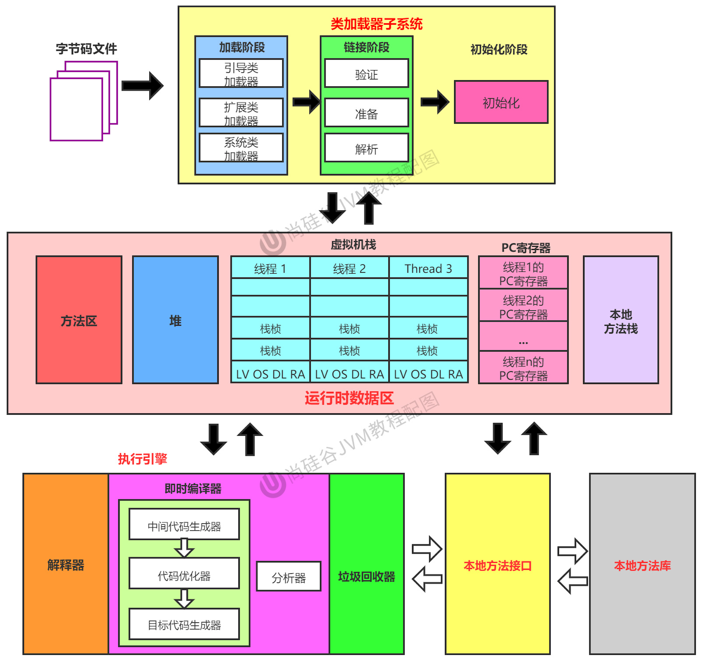
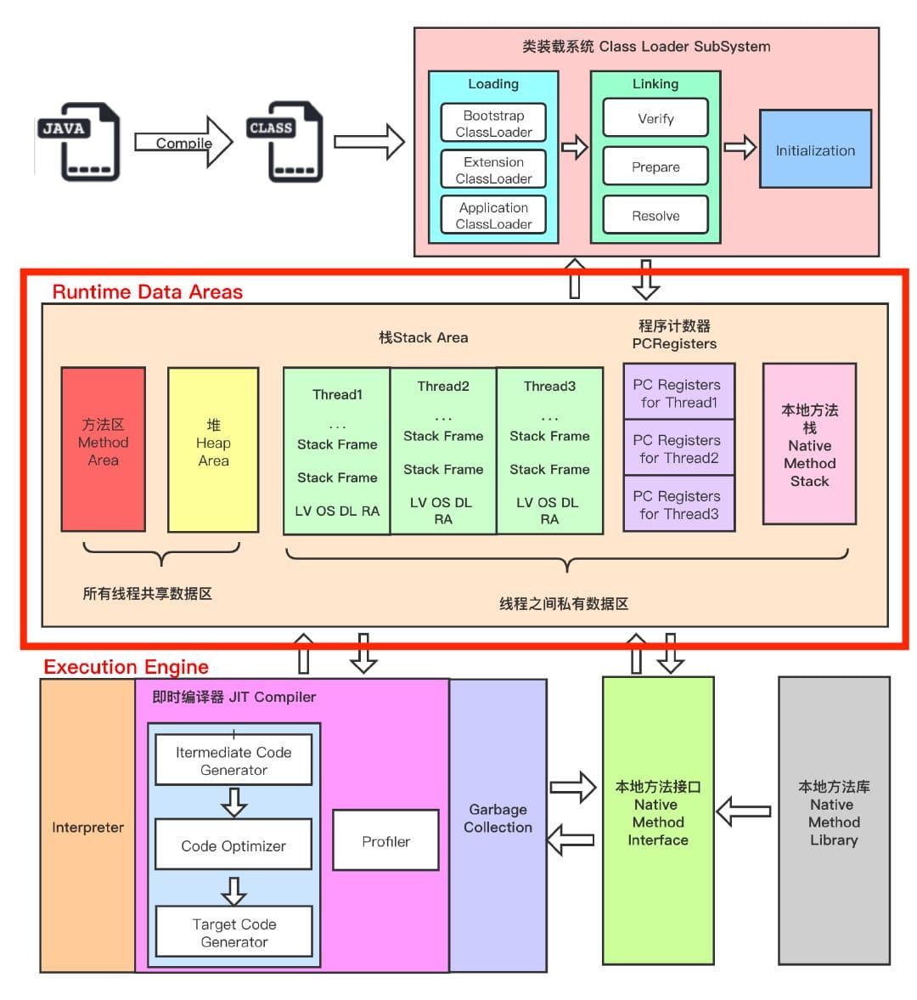
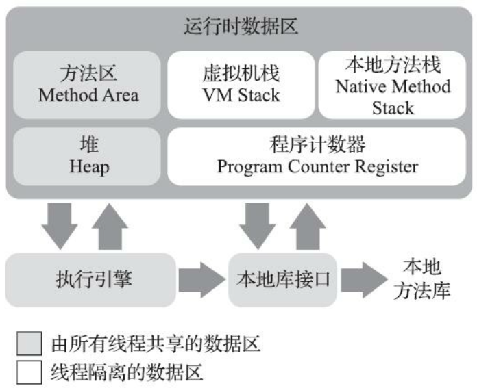
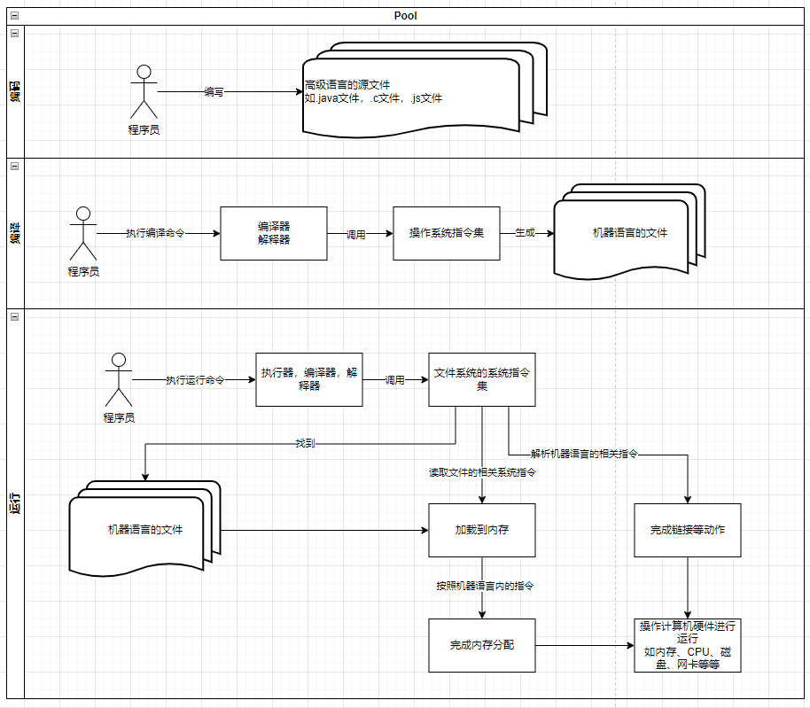

| **日期** | **迭代内容**                                             |
| -------- | -------------------------------------------------------- |
| 23-11-24 | 1. 导学指引。确定一种学习和记忆 JVM 相关知识点的逻辑树。 |
| 23-11-26 | 1. 调整整个文档结构，并加以完善。                        |

---

::: details 导学指引

人们想**要实现一种跨平台的编程语言**，于是人们开始设计：

1. 常见语言的运行方式主要有解释运行、编译运行两种方式，但是不管如何都要经过高级语言到低级语言的转变过程（如机器语言）。那如何解决跨平台的问题？
   1. 高级语言不直接转化为机器语言，高级语言转化成一种中间的语言，即字节码文件；
   2. 加一台虚拟机，区别于物理机。虚拟机运行在物理机之上，不同的物理机设计实现不同的虚拟机程序；
   3. 这样以来，完美解决跨平台的问题。Java 语言编写 Java 源代码，然后通过编译器生成字节码，字节码再在虚拟机上运行。不同的虚拟机解析字节码文件时，会根据自身实现以及操作系统指令集把同一条命令解析成不同的实现。完美解决跨平台问题。
2. 好吧，愿景已经有了，下面就是实现。
   1. 高级语言得有一种格式吧，得规定 Java 源代码的规范吧，于是有了**《Java 语言规范》**。
   2. 虚拟机反正是运行字节码，那可不可以解耦？啥意思呢？就是我一定使用 Java 语言生成字节码嘛？有没有一种可能，我使用另外一种高级语言也生成同样的字节码文件？于是有了**《Java 虚拟机规范》**。
3. 于是，我们的学习内容有了——Java 虚拟机规范。下面我们开始学习：
   1. 如何学呢？按照一个顺序，那就是高级语言的执行过程。这个执行过程一定是先要把高级语言转化成低级语言，然后低级语言通过调用底层的操作系统指令集，完成对计算机硬件的调用，最终完成程序的执行。那我们就按照这个过程来学习。
   2. 由于第二点说了，不一定是 Java 语言，只要能生成被虚拟机识别的字节码文件就行，因此要先学习**字节码的相关内容**。
   3. 好了字节码文件有了，下一步就应该是把字节码文件加载到内存中运行吧。
      1. 怎么加载呢，**类加载子系统**。
      2. 运行呢？运行过程要解决这么几个问题：
         1. 怎么运行呢？总要有一个载体吧，这个载体就是** Java 的线程模型**。
         2. 运行时总要用到数据的计算吧，那数据怎么分配呢？这个分配过程有个逻辑模型，这个模型就是**运行期内存结构**。
         3. 载体和数据都分配完了，那该指令了吧，指令是怎么执行的呢？这就是**执行引擎**。
   4. 好了，能够完成基本运行功能的虚拟机已经实现了。但是还有一个重要的问题没有解决，内存的回收怎么处理呢？于是，**垃圾回收理论**登场。到此为止，基本的 Java 虚拟机算是学完了。
4. 上面我们大概了解了《Java 虚拟机规范》，那该找一个具体的虚拟机练练手吧，找哪一个呢？找市场上最流行的。——**HotSpot** 荣耀登场。
   1. HotSpot 的**内存模型**；
   2. HotSpot 的**垃圾回收器**；
   3. HotSpot 有哪些**配置参数**呢？
   4. HotSpot 提供了哪些**工具包**？有哪些好用的第三方的工具包呢？
5. 好了，理论部分我们已经学完了，并且我们还找了一个最常用的虚拟机实现进行学习。下个阶段就应该是压榨服务器运算能力了。这个过程我们称为**调优**。
   1. 要想压榨运算能力，首先得**保证不能出错**吧。于是，你得知道如何虚拟机会出现哪些错误信息，你还要知道怎么解决这些错误信息吧。
   2. 其次才是压榨运算能力，要想压榨，就得保证可用。什么意思呢？如果虚拟机一天总有 30s 的停顿时间，那放到一年中，那得有多少不可用的时间呐，那两年三年呢？于是确定我们压榨的目标——**减少停顿**。
   3. 目标有了——减少停顿，这个动作代表一个过程，多少算减少？所以要知道正常的停顿应该是怎样的，也就是说要知道正常指标是怎样的。最后才是在此基础上进行调优。

:::

下面的知识体系也是按照上面的导学指引完成的。

## 大纲

```log
- 运行期内存结构
  1. 线程私有
     1. 虚拟机栈： 存放内容、常见配置参数、异常；
     2. 本地方法栈： 存放内容、常见配置参数、异常；
     3. 程序计数器： 存放内容、常见配置参数、异常；
     4. 直接内存
  2. 线程共享
     1. Java堆： 存放内容、常见配置参数、异常；
     2. 方法区： 存放内容、常见配置参数、异常；
- GC内存模型
  1. eden+s0+s1+old+永久代/元空间
  2. minorgc、majorgc、FullGC
- 垃圾回收
  1. 存活对象判断标准
     1. 可作为GCRoot的对象
     2. 引用类型
  2. 垃圾回收算法
  3. 垃圾回收器
     1. 配置参数
     2. 回收过程
     3. 优缺点分析
- 对象探秘
  1. 对象的内存分布
     1. 对象头（哈希值、分代次数、持有的锁、偏向线程id、偏向时间戳）
     2. 实例数据（自身的字段数据和从父类继承过来的字段数据）
     3. 对齐填充
  2. 对象创建过程
     1. 逃逸分析（栈上分配、锁消除、标量替换等）；
     2. 方法区常量池能否定位类型数据；
     3. 分配内存；
     4. 处理同步问题；
     5. 初始化；
     6. 执行init，完成其他信息的构造；
  3. 对象内存分配过程及访问定位、对象年龄晋升过程；
- 类的加载
  1. 双亲委派模型
  2. 类加载器
  3. 类加载过程
- 实操
  1. 性能指标
  2. 工具（自带的和第三方提供的）
  3. 两大类问题
     1. 异常信息
     2. 优化JVM
```

## [1. 概述](./ch01-overview.md)

> 1. Java 语言规范与 JVM 规范的区别
> 2. Java 语言的跨平台性
> 3. JDK、JRE、JVM 关系
> 4. 发展历程简述

## [2. 前端编译阶段及字节码文件](./ch02-compileandbytecode.md)

> 1. 前端编译介绍
> 2. 字节码文件解析
> 3. 相关命令
> 4. 特殊应用【如字节码增强技术、热部署等】

## [3. 类加载](./ch03-classload.md)

> 1. 类加载子系统
> 2. 类加载过程
> 3. 类加载器分类及各自作用
> 4. 类加载原则

## [4. 线程模型](./ch04-threadmode.md)

> 1. 线程模型的发展历程
> 2. Java 中的线程模型

## [5. 运行时内存结构](./ch05-runtime.md)

> 1. 运行期内存结构
> 2. 对象探秘

## [6. 执行引擎](./ch06-engine.md)

> 1. 执行方式
> 2. 方法的执行过程

## [7. 垃圾回收理论](./ch07-garbagecollection.md)

> 垃圾对象的特点、收集的区域
> 垃圾对象的判断标准
> 垃圾对象的定位
> 垃圾对象的收集算法以及衍生问题

## [8. Hotspot 虚拟机 & 配置 Hotspot](./ch08-hotspot.md)

> 【还是理论部分】
> 经典垃圾回收器
> 针对不同垃圾回收器实现的实际的内存划分；
> 查看有哪些配置参数
> 各种配置参数讲解
> 配置参数表现行为等：如配置 printGCDetails，就会打印日志，打印日志是怎样的，如何理解这些日志等

## [9. 工具包](./ch09-tools.md)

> Hotspot 工具包
> 第三方工具包
> 使用案例

## [10. 调优](./ch10-promote.md)

> 方法论

## 11. 出错

> 出错类型
> 排查过程
> 最佳实践经验
> 案例

## 12. 停顿

> 正常指标： 获取正常指标的过程、正常指标有哪些？
> 异常指标：如何监控异常指标？
> 最佳实践经验
> 案例

## 13. 参考

[Java SE 8 Edition](https://docs.oracle.com/javase/specs/jvms/se8/html/index.html)

### 13.1. 概览

- [ ] 概览及总述：
- [ ] 类加载子系统，JVM 是如何把 Java 语言加载到 JVM 中的？
- [ ] 运行期内存结构，加载到 JVM 中的源代码是如何使用内存的？
- [ ] 执行引擎，
- [ ] 本地方法接口及本地方法库
- [ ] 理论层次
- [ ] JVM 中的后台进程
- [ ] 字节码文件
- [x] 类加载子系统
- [ ] 【where】类来源途径（本地文件、网络、压缩包、数据库、动态编译生成等）
- [ ] 【who】类加载器（分类、作用、加载内容）
- [ ] 【how】双亲委派（原理、好处）、破坏双亲委派模型的样例
- [x] 运行期内存结构
- [ ] 线程私有区域
- [ ] 程序计数器 （存放内容、异常信息、存在的原因）
- [ ] 虚拟机栈（存放内容（局部变量表、操作数栈、动态链接、方法出口及一些附加信息）、异常信息、配置参数）
- [ ] 本地方法栈  （存放内容、异常信息）
- [ ] 线程共享区域
- [ ] Java 堆（存放内容（Java 对象及数组）、配置参数、异常类型及解决方案）
- [ ] 方法区（存放内容（Java 对象及数组）、配置参数、异常类型及解决方案）
- [ ] 执行引擎
- [ ] Java 中的运行方式（解释运行、编译运行），HotSpot 的运行方式
- [ ] 解释运行与编译运行的区别
- [ ] 编译器分类（前端编译器、后端编译器、静态提前编译器，各自区别）
- [ ] 本地方法接口与本地库
- [x] 对象探秘
- [ ] 对象实例化方式
- [ ] 对象内存结构
- [ ] JVM 为对象分配内存的过程【即在分代回收模型中的内存分配过程】
- [ ] 对象的创建过程（空间分配担保+对象年龄晋升确定所在区域、逃逸分析确定代码优化结果）
- [ ] 对象的访问定位；
- [ ] 内存结构、内存分配过程、访问定位、升代策略
- [ ] 垃圾回收理论
- [ ] 虚拟机中的高效并发
- [ ] 具体实现层面
- [ ] 不同回收方式具有不同的运行期内存结构
- [ ] 经典垃圾回收器（各自垃圾回收过程、所采用的算法、适用场景、配置参数）
- [ ] 组合使用
- [ ] JVM 调优
- [ ] 方法论
- [ ] 调优和异常

### 13.2. 架构图









### 13.3. 研究方法

1. 分别了解上图中的每一部分中涉及到的理论知识；
2. 了解 Hotspot 的具体实现细节
3. 针对 JVM 进行基准测试，了解其基本指标数据；
4. 之后进行调优和问题解决；
