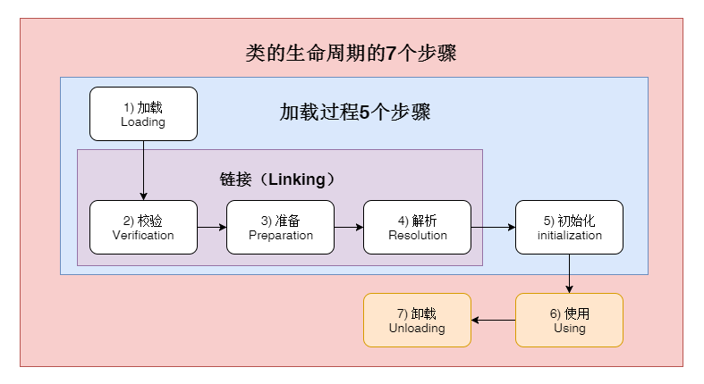

## 1. 目标

- 找到相关 class 文件，并把 class 文件中的类信息加载到 jvm 中，使 class 文件变成可以被运行的相关程序
- java 源文件->.class 文件，.class 文件->jvm，jvm 根据.class 文件描述类的相关信息->jvm 内存结构，

> 总结：
>
> 1. 类加载的目标是什么，它处于整个 JVM 架构的哪个阶段？
> 2. 类加载的时机是什么？什么情况下才会加载一个类？
> 3. 类加载机制的内容是什么？【包括类加载器、双亲委派模型、加载过程】
> 4. 类加载的应用

> 摘要：
>
> 1. 类加载过程，说白了一句话就是：通过全限定命名获取一个**类的 class 对象**的过程。
> 2. 类加载过程，是通过类加载机制完成的，类加载机制包括【类加载器】、【双亲委派】、【加载过程】三部分。

## 2. 加载过程原理简述

> 一句话来讲，类的加载过程就是：
> 通过类的全限定命名来获取描述这个类的 class 对象。
> 因此需要注意的是： 我们常说的类的加载过程，并不单单指整个加载过程中的第一个阶段的加载部分，而是指整个过程。

1. 通过全限定命名获取字节码文件
2. 将字节码文件中的类元数据信息加载到运行时数据区的方法区
3. **在运行时数据区的堆中创建一个 java.lang.Class 类的对象，**这样便可以通过该对象访问方法区中的这些数据。

> 个人理解：
> **在运行时数据区的堆中创建一个 java.lang.Class 类的对象**
> 这里的堆，是逻辑上的堆，与运行期内存结构中的 Java 堆的概念不同，这里的堆事实上是指方法区，因为方法区事实上也是堆的一部分，都属于线程共享区域的区域，只不过这里的 **java.lang.Class 类的对象**是一个特殊的对象，以后所有从这个类中 new 出来的对象都是以这个对象为原型的。这也侧面说明了一个事实，堆是整个垃圾回收的基础。

- 运行时数据区的分配
  - 方法区上封装类的元数据信息
  - 堆区上分配 class 对象

## 3. 类加载的时机

- **采用预加载方式，即并不是首次使用时才加载**
- 时机【或触发条件】
  - 使用 new 关键字实例化对象、读取或设置一个类的静态字段（被 final 修饰、已在编译期把结果放入常量池的静态字段除外）以及调用一个类的静态方法时
  - 使用 java.lang.reflect 包的方法对类进行反射调用时
  - 初始化一个类但发现其父类还没有进行初始化时
  - 启动 jvm 时先加载包含 main()方法的启动类
  - 当使用 JDK1.7 的动态语言支持时，如果一个 java.lang.invoke.MethodHandle 实例最后的解析结果 REF_getStatic、REF_putStatic、REF_invokeStatic 的方法句柄，并且这个方法句柄所对应的类没有进行过初始化，则需要先触发其初始化
- 报错： 如果未加载，则在使用时会报错（LinkageError 错误）；如果一直没有被使用，即便未加载也不会报错

了解了类的加载过程，我们再看看类的初始化何时会被触发呢？JVM 规范枚举了下述多种触发情况：

- 当虚拟机启动时，初始化用户指定的主类，就是启动执行的 main 方法所在的类；
- 当遇到用以新建目标类实例的 new 指令时，初始化 new 指令的目标类，就是 new 一个类的时候要初始化；
- 当遇到调用静态方法的指令时，初始化该静态方法所在的类；
- 当遇到访问静态字段的指令时，初始化该静态字段所在的类；
- 子类的初始化会触发父类的初始化；
- 如果一个接口定义了 default 方法，那么直接实现或者间接实现该接口的类的初始化，会触发该接口的初始化；
- 使用反射 API 对某个类进行反射调用时，初始化这个类，其实跟前面一样，反射调用要么是已经有实例了，要么是静态方法，都需要初始化；
- 当初次调用 MethodHandle 实例时，初始化该 MethodHandle 指向的方法所在的类。

同时以下几种情况不会执行类初始化：

- 通过子类引用父类的静态字段，只会触发父类的初始化，而不会触发子类的初始化。
- 定义对象数组，不会触发该类的初始化。
- 常量在编译期间会存入调用类的常量池中，本质上并没有直接引用定义常量的类，不会触发定义常量所在的类。
- 通过类名获取 Class 对象，不会触发类的初始化，Hello.class 不会让 Hello 类初始化。
- 通过 Class.forName 加载指定类时，如果指定参数 initialize 为 false 时，也不会触发类初始化，其实这个参数是告诉虚拟机，是否要对类进行初始化。Class.forName(“jvm.Hello”)默认会加载 Hello 类。
- 通过 ClassLoader 默认的 loadClass 方法，也不会触发初始化动作（加载了，但是不初始化）。

示例: 诸如 Class.forName(), classLoader.loadClass() 等 Java API, 反射 API, 以及 JNI_FindClass 都可以启动类加载。 JVM 本身也会进行类加载。 比如在 JVM 启动时加载核心类，java.lang.Object, java.lang.Thread 等等。

**两个没有关系的自定义类加载器之间加载的类是不共享的（只共享父类加载器，兄弟之间不共享），**这样就可以实现不同的类型沙箱的隔离性，我们可以用多个类加载器，各自加载同一个类的不同版本，大家可以相互之间不影响彼此，从而在这个基础上可以实现类的动态加载卸载，热插拔的插件机制等，具体信息大家可以参考 OSGi 等模块化技术。

## 4. 加载工具：类加载器

从 jvm 的角度来讲，类加载器分为两种：

- `启动类加载器` ： 它由 C++ 实现【特指，jdk1.5 之后的 Hotspot，很多虚拟机是由 Java 语言实现的】，它是 jvm 本身的一部分；
- `所有其他类的加载器` ： 都是由 Java 语言实现，并且独立于 jvm 之外，且全部继承自 java.lang.ClassLoader ，这些类加载器需要由启动类加载器加载到内存中之后才能加载其他类；

从开发者角度来讲，类加载器分为四种：

> 包括分类、各自负责加载的内容、使用方式等

- `BootstrapClassloader`
  - 由 c/c++语言实现（仅限 Hotspot），主要是用来启动 jvm
  - 负责加载用来启动 jvm 时所需要的 Java 的核心库（jre/lib 下的类库 和 被-Xbootclasspath 参数指定的路径中的且能被虚拟机识别的类库）
  - 无法被 java 程序直接使用
- `ExtensionClassloader`
  - 由 sun.misc.Launcher$ExtClassLoader 实现；
  - 负责加载 lib/ext 扩展目录下的类库和由 java.ext.dirs 系统变量指定的路径中的所有类库（如 javax.开头的类）
  - 开发者可以直接使用
- `ApplicationClassloader`
  - 由 sun.misc.Launcher$AppClassLoader 来实现；如果未自定义加载器，那它就是默认加载器
  - 负责加载环境变量或系统属性 java.class.path 路径下的类库
  - 开发者可以直接使用
- `CustomerClassloader`
  - 用户自定义的加载器

> 非继承关系，而是组合关系。

## 5. 加载方式：双亲委派

- 原理
  - 把类加载请求委托给父类加载器，父类加载器再委托给自己的父类加载器，直到找到 BootstrapClassloader，然后由 BootstrapClassloader 通过类的全限定名找到相关类进行加载，加载完成就进行返回；如果加载失败，就由 BootstrapClassloader 的子类加载器进行加载，依次类推，直到加载完成。
- 好处
  - 避免类的重复加载
  - 保证核心 API 不会被篡改

有些地方也把双亲委派直接称为类加载机制，其实类加载机制是一个比较全面的概念，双亲委派只是类加载机制中类加载器使用的规范。

类加载机制有三个特点：

1. **双亲委派**：当一个自定义类加载器需要加载一个类，比如 java.lang.String，它很懒，不会一上来就直接试图加载它，而是先委托自己的父加载器去加载，父加载器如果发现自己还有父加载器，会一直往前找，这样只要上级加载器，比如启动类加载器已经加载了某个类比如 java.lang.String，所有的子加载器都不需要自己加载了。如果几个类加载器都没有加载到指定名称的类，那么会抛出 ClassNotFountException 异常。
2. **负责依赖**：如果一个加载器在加载某个类的时候，发现这个类依赖于另外几个类或接口，也会去尝试加载这些依赖项。
3. **缓存加载**：为了提升加载效率，消除重复加载，一旦某个类被一个类加载器加载，那么它会缓存这个加载结果，不会重复加载。

## 6. 加载过程【每一个步骤的作用】

> 注意：
>
> 1. 这五个步骤，加载、校验、准备、初始化这四个阶段的发生顺序是确定的，而`解析`阶段却不一样，它在某些情况下可以在初始化之后开始，这是为了支持 Java 语言的运行时动态绑定；
> 2. 这几个阶段是按照顺序开始的，但不是按照顺序完成的，这些阶段通常是都是互相交叉混合进行的，比如在验证阶段会激活加载阶段。
> 3. 类加载器并不需要等到某个类被“首次主动使用”时再加载它，JVM 规范允许类加载器在预料某个类将要被使用时就预先加载它，如果在预先加载的过程中遇到了.class 文件缺失或存在错误，类加载器必须在程序首次主动使用该类时才报告错误(LinkageError 错误)。如果这个类一直没有被程序主动使用，那么类加载器就不会报告错误。

### 加载

- 目标： 找到对应的 class 文件
- 源文件来源渠道
  - 加载 Class 文件的渠道
    - 从本地系统中直接加载，这个文件可能是加密文件；
    - 通过网络下载.class 文件，典型场景是： Web Applet；
    - 从 zip，jar 等归档文件中加载.class 文件
    - 从专有数据库中提取.class 文件，比较少见
    - 运行时计算生成，将 Java 源文件动态编译为.class 文件，如动态代理技术；
- 自定义加载方式【可以通过哪些方式把类加载到 jvm 中？】
  - 命令行启动应用时候由 JVM 初始化加载
  - 通过 Class.forName()方法动态加载，将类的.class 文件加载到 jvm 中之外，还会对类进行解释，执行类中的 static 块；
  - Class.forName(name, initialize, loader)带参函数也可控制是否加载 static 块。并且只有调用了 newInstance()方法采用调用构造函数，创建类的对象
  - 通过 ClassLoader.loadClass()方法动态加载，只干一件事情，就是将.class 文件加载到 jvm 中，不会执行 static 中的内容,只有在 newInstance 才会去执行 static 块。

### 链接

- 目标： 确保字节码正确加载，并被虚拟机正确赋值，之后转换链接方式（由**符号引用转换成直接引用**）， 包括三个步骤。
- **校验（验证）**
  - 目的： 保证字节码文件不会危害虚拟机自身的安全
  - 注意： 在校验过程中也会验证类的层次结构，因此有可能会发生加载的过程，如**在验证到某个子类的 class 时，发现其父类 class 没有加载，就会在这个阶段去加载其父类 class**。
  - 主要验证四项内容
    - 文件格式验证
      - .class 文件，文件头会有 caffbabe 魔数，版本号等
    - 元数据验证
      - 对 class 文件一些描述信息的数据的验证
      - 元数据： 描述数据的数据
    - 字节码验证
    - 符号引用验证
  - 可能抛出的异常
    - 这些检查过程中可能会抛出 VerifyError， ClassFormatError 或 UnsupportedClassVersionError
    - 类层次结构有问题（例如，该类是自己的超类或接口,死循环了），则 JVM 将抛出 ClassCircularityError。 而如果实现的接口并不是一个 interface，或者声明的超类是一个 interface，也会抛出 IncompatibleClassChangeError
- **准备**
  - 为类变量分配内存并设置默认初始值
- **解析**
  - 把符号引用转化为直接引用
    - 直接引用包括直接指针、相对偏移量和间接定位到目标对象的句柄

### 初始化

- JVM 规范明确规定, 必须在类的首次“主动使用”时才能执行类初始化。
- 执行类构造器方法<clinit()>的过程，补全剩余未被构造出来的部分

::: tip

代码中下面的情况会触发初始化过程

- 创建类的实例，也就是 new 的方式
- 访问某个类或接口的静态变量，或者对该静态变量赋值
- 调用类的静态方法
- 反射（如 Class.forName(“com.shengsiyuan.Test”)）
- 初始化某个类的子类，则其父类也会被初始化
- Java 虚拟机启动时被标明为启动类的类（Java Test），直接使用 java.exe 命令来运行某个主类

:::

> **TIPS 1： 准备阶段中【为变量设置默认初始值】 VS 初始化阶段**
> 准备阶段中为变量设置默认初始值是指变量本身的默认值，如 boolean 的默认初始值为 false，int 的默认初始值为 0，引用类型的默认初始值为 null；
> 初始化阶段则是指代码中对变量的赋值，如 private int num = 30； 初始化阶段之前，num 的值为 0，初始化阶段完成之后，num 的值就变成了 30；
>
> **TIPS 2 ：init() ， clinit() 和 无参构造函数 的执行顺序；**

### 卸载

**Java 虚拟机将结束生命周期的几种情况**

- 执行了 System.exit()方法
- 程序正常执行结束
- 程序在执行过程中遇到了异常或错误而异常终止
- 由于操作系统出现错误而导致 Java 虚拟机进程终止

## 7. 其他

- 查看 SpringBoot 项目都加载了哪些 jar 包？
- 自定义类加载器实现过程？
- 运行期动态加载 class 类？
- 父类构造器方法、静态方法、静态代码块、静态变量和子类的这些方法的加载顺序
- 两个 class 对象是否为同一个类存在两个必要条件？
  - 类的全限定命名是否一致
  - 加载这个类的加载器是否一致

## 8. 自定义类加载器实现
