# JVM 运行期内存

> 研究思路：
>
> 1. 为什么要把运行期内存结构划分为线程私有区域和线程共享区域？根据 JMM 模型。

## 1. 查看运行期内存结构

一般情况下，需要对内存 dump 下来一个某一时刻的快照信息，然后在这个快照上进行分析。

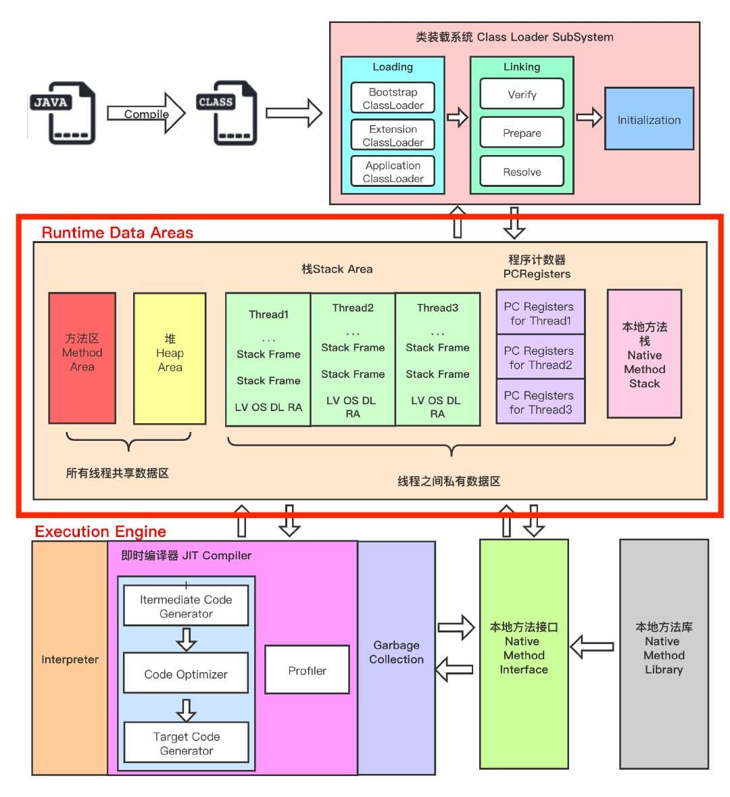

总的来讲： 栈管运行、堆管存储。

## 2. 线程私有区域【生命周期与线程生命周期一致】

### 虚拟机栈

- 每当 jvm 需要运行一个线程时，就会在此区域划分出一小块内存，给这个线程使用，这一小块内存就是虚拟机栈，工作线程与虚拟机栈一一对应【可以认为：Java 中的一个请求对应一个虚拟机栈。】
- 代码中的每一个方法就对应着虚拟机栈中的一个栈帧，代码中的方法与栈帧一一对应
- 方法的执行和结束对应着栈帧在线程所对应的虚拟机栈中的入栈和出栈操作，但不允许不同线程创建的栈帧之间的相互引用
- 线程运行结束后，此线程的栈帧就会消亡，因此虚拟机栈就不存在垃圾回收的问题

#### 栈帧 【重点】

栈帧包括： 局部变量表、操作数栈、动态链接、方法出口和一些附加信息。

- **局部变量表**（LV）
  - 基本单位是变量槽（slot），一个变量槽是 32 位，多个变量槽组成一个局部变量表
  - 存放的信息主要是用来描述方法参数和局部变量，包括这些方法参数和变量的类型信息、值和索引；1. 索引信息是为了访问；2. 类型信息则标识了方法参数和局部变量的所属类型；
    - 基本数据类型
      - long 和 double 占用 2 个 slot
      - 其余占用 1 个 slot
    - 引用类型
    - returnAddress 类型
  - Slot 是可以被复用的
- **操作数栈**（Operate Stack）
  - 缓存计算的中间结果
  - 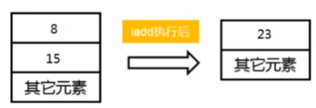
- **动态链接**（Dynamic Link）
  - 指向方法区中的运行时常量池的方法引用
  - 额外知识点
    - 链./ch05-runtime/image/1676958568566.png
      - 静态链接：编译期可知，并且运行期会保持不变，在类加载过程就会把方法的符号引用转换为直接引用的过程
      - 动态链接：被调用的方法在编译期无法被确定下来，只能在运行时把方法的符号引用转换为直接引用，高级语言中的多态性就是通过动态链接来完成的。
    - 被静态解析的条件
      - 方法在运行前就有一个确定的调用版本
    - 方法的分类
      - 非虚方法：在编译期就确定下来并且运行期不会发生改变的方法
        - 静态方法
        - 私有方法
        - final 方法
        - 实例构造器
        - 父类方法
      - 虚方法：不能在编译期确定下来或者运行期可能会发生改变的方法，抛开非虚方法以外的方法都是虚方法
- **方法出口**（Return Address）
  - 方法结束有两种方式
    - 正常结束
      - 会把方法的返回值给到上层调用者，即调用该方法的上层调用者线程的 PC 寄存器的值，由上层调用者线程继续执行
    - 遇到异常结束
      - 不会给上层调用者返回任何值，即返回异常表中的异常信息，剩余没有执行完的线程也不再执行
- **附加信息**
  - 例如，支持调试程序的相关信息，这部分取决于虚拟机的实现

#### 可能会出现的异常

- 当线程请求的深度大于虚拟机所允许的最大深度时，会出现 StackOverflowError 异常
- 当虚拟机尝试扩展但无法申请到足够的内存空间，或没有多余空间为新线程分配时，会出现 OOM 异常

#### 常用的参数

- -Xss，规定了函数调用的最大深度
- 一般情况下，不设置虚拟机栈的大小

### 本地方法栈

- 是使用 C 语言实现的，直接调用本地方法接口，即操作系统对外提供的接口
- 原理与虚拟机栈一样，只不过是执行的方法是本地方法，即操作系统方法
- 出现的异常也跟虚拟机栈一样

### PC 寄存器

- 存放程序运行的下一条指令的地址
- 多个线程的运行是通过操作系统随机分配 CPU 执行的时间片来完成的，那么在切换时间片时，就需要标记被切换的线程下一条指令的地址，这样就保证了这个线程再次获取执行权时，能够找到之前执行到的位置
- 唯一一个没有异常的区域
- 虚拟机栈、本地方法栈和程序计数器均由所需要运行的线程来管理。线程结束，对应的虚拟机栈、本地方法栈和程序计数器区域被回收，供后续进行重新使用

## 3. 线程共享区域【生命周期与 jvm 的生命周期一致】

### 方法区

- 目标
  - 字节码文件加载完成后存放的内存区域，主要是让线程“依葫芦画瓢”完成内存分配
- 线程共享的原因
  - 每一个需要运行的线程，都需要从这个区域内读取类的信息，因此是线程共享的区域
- 存储的内容
  - 域信息
    - 包括域修饰符、域类型、域名称
  - 类型信息
    - 包括类修饰符、全限定名称、直接父类的全限定名称、直接接口的有序列表
  - 方法信息
    - 包括方法的修饰符、方法返回的类型、方法名称、参数列表、方法体信息（方法的字节码、操作数栈、局部变量表、方法大小）、异常信息表（每一个异常的开始位置、结束为止、PC 计数器的偏移地址、异常类所在的常量池索引）
  - non-final 的类变量【即静态变量】
    - 随着类的加载而加载，可以被这个类的所有实例访问，即便是没有类实例也可以访问
  - 声明了 final 的类变量【即全局变量】
    - 编译期就已经被分配了
  - 运行期常量池
    - 由 class 文件中的“常量池”生成
      - class 文件中如果选择直接保存数据的方式，字节码文件就会很大。采用常量池方式存储数据，在实际运行过程中再按照常量池里面的信息为数据分配实际的存储空间，这样可以避免字节码文件臃肿庞大的问题
    - 存放编译期生成的各种字面量和符号引用
  - JIT 代码缓存
- 垃圾回收
  - 这个区域的回收效果比较难以令人满意
  - 主要回收两部分内容
    - 常量池中没有被任何地方引用的常量
      - 回收过程类似于 Java 堆
    - 不再被使用的类型

### Java 堆

- 存放内容
  - 对象
  - 数组
- 异常类型
- 事实上，**方法区和 Java 堆两部分内容才构成了整个 JVM 的堆空间**
  - 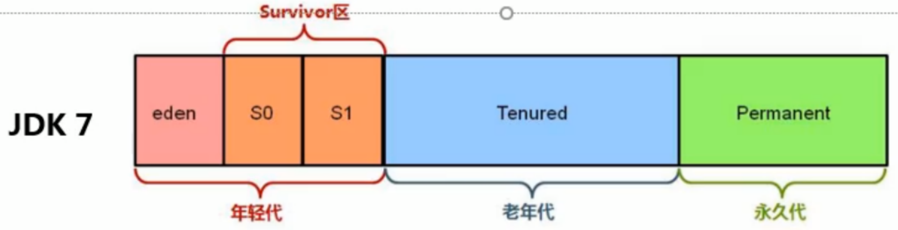
  - 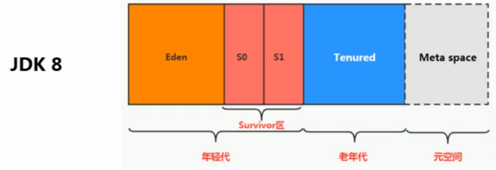

## 4. 直接内存区域

- NIO 的使用区./ch05-runtime/image/1677128764103.pngBuffer 对象进行引用；
- 不受 Java 堆大小的限制，但是受物理内存大小的限制；

## 总结

- 根据**是否由用户线程共享使用**把运行期内存数据区域划分为两部分
- 用户线程共享的区域（事先规定好总量的大小，来一个用户线程就划分一块区域给这个线程使用，与用户线程是一对多的关系，即一个区域对应多个用户线程）
  - `方法区`
    - 保存类型信息、常量、静态变量、即时编译产生的代码缓存等
    - 早期版本中有永久代的概念，是为了像管理堆一样管理方法区，但这种设计更容易遇到内存溢出的问题，于是后期版本中废弃了永久代的概念
    - 这部分的回收目标是针对常量池（主要存放各种字面量和符号引用以及符号引用的直接引用）的回收和类型卸载，回收效果差强人意
    - 当无法满足新的内存分配需求时会抛出 OOM 异常
  - `Java堆`
    - 主要存放各种对象和数组
    - 是由一个个 TLAB 组成，在内存中可以连续，也可以不连续，为了回收和访问效率，可能会要求大对象在内存上连续
    - “新生代”、“老年代”、“Eden 区”、“Surivivor 区”等都是具体的垃圾回收器在回收内存空间时对堆上存储内容的再次划分，不能说运行期内存就有这部分区域
    - 一般通过“-Xmx”和“-Xmx”设定，当没有多余的内存空间分配时且堆无法进行扩展时会抛出 OOM 异常
- 用户线程私有的区域（与用户线程是一对一的关系，重要特征是会随着用户线程的消亡而消亡）
  - `PC计数器`
    - 字节码的行号指示器，用来标记线程切换后的执行位置
    - 没有 OOM 异常
  - `虚拟机栈`
    - 只存放栈帧，Java 中方法的执行对应着栈帧的入栈和出栈
    - 栈帧中存放着局部变量表、操作数栈、动态链接和方法的出口等
    - 局部变量存放着基本数据类型、对象类型和方法返回等
    - 而基本数据类型是以 Slot 为基本单位进行分配的，long 和 double 占 2 个 Slot，其余全部是 1 个 Slot
    - 执行一个方法请求时，这个请求的线程会根据方法区的类型描述创建一个又一个栈帧，请求结束，线程会释放这里的空间
    - 使用相关工具观察 jvm 运行期内存区域时，会发现此区域会随着请求的变化而变化
    - 一般通过“-Xss”进行设定，当线程请求的栈的深度大于虚拟机所允许的最大深度或者栈扩展时无法申请到足够的内存时会抛出 OOM 异常
  - `本地方法栈`
    - 与虚拟机栈类似，但存放的内容是本地方法的相关内容
  - `直接内存`
    - 例如在 NIO 中会直接使用 Native 函数分配直接内存，然后使用 DirectByteBuffer 进行操作，使用完成后由线程直接释放
    - 受到物理内存大小的限制，也会产生 OOM

---

# 对象探秘

## 5. 研究方法

- 1. 明确所在运行期内存结构模型中的哪一部分
  - 所在区域：堆
- 2. 代码中实例化对象的方式
- 3. 明确一个对象一般情况下都包含哪些内容？
  - 对象的内存结构
- 4. 明确对象包含的各个部分如何放到运行期内存结构模型中
  - 对象的内存分布
- 5. 明确对象的创建过程
  - 对象的创建过程
- 6. 明确如何使用对象（或者如何访问对象）
  - 对象的访问定位

## 6. 代码中实例化对象的方式

- new Object()
- class 的 newInstance()方法
- 构造器的 newInstance(args)方法
- 使用 clone
- 反序列化
- 第三方工具包

## 7. 对象的内存结构

- **对象头（Header）**
  - 包括两部分内容
    - 运行时元数据（Mark word）
      - 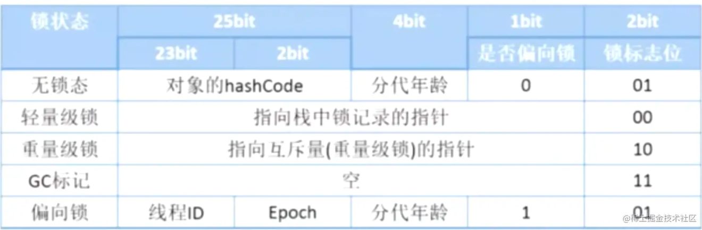
      - 哈希值
      - GC 分代年龄
      - 锁标志位
      - 线程持有
      - 偏向线程 id
      - 偏向时间戳
    - 类型指针
      - 指向方法区的类型元数据 InstanceKlass，确定该对象的类型信息
  - 如果是数组，还会有数组的长度信息
- **实例数据（Instance data）**
  - 它存储了对象的实际信息，包括代码中定义的各种类型字段（包括从父类继承来的和自身拥有的）
  - 规则
    - 父类的定义的变量出现在子类之前
    - 相同宽度的字段总是分配到一起
    - 如果 CompactFields 参数为 true，子类的窄变量可能会插入到父类变量的空隙空间
- **对齐填充（Padding）**
  - 不是必须的，没有特殊含义，仅仅是为了保证内存分配规整

## 8. 对象的内存分布

- 与具体的 JVM 产品有关，不同的 JVM 产品，其模型可能不同
  - 如 Hotspot 中
    - 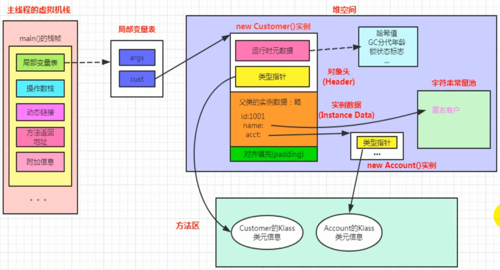
- 对象在 Hotspot 中分代回收模型中的内存分配过程
  - 0. 创建在栈上的对象随着方法执行的结束，由栈直接回收
  - 1. 创建的小对象直接分配到 eden 区，直到 eden 区满
  - 2. eden 区满了之后，会触发 MinorGC/YoungGC，躲过 MinorGC/YoungGC 后的对象进入 S0 区
  - 3. 下次要创建的小对象依然放入 eden 区，直到 eden 区满
  - 4. 之后再次触发 MinorGC/YoungGC，MinorGC/YoungGC 会把 S0 区的对象复制到 S1 区，在复制过程中，会判断对象的年龄，如果对象的年龄大于 jvm 设置的最大年龄（默认 15），就把 S0 区的对象复制到 Tenured 区，之后对换 S0 区和 S1 区位置
  - 5. 【Tenured 区满】或【创建的对象所需要的空间大于 S0 区的可用空间，也大于老年代的可用空间】会触发 FullGC，FullGC 会回收整个堆空间（包括 Java 堆和方法区）

## 9. 对象的创建过程

- 0. 事实上，在创建对象前，Hotspot-JVM 会做一些优化，以确定把对象创建到何处以及如何优化对象创建过程
  - 0.1 查看空间分配担保配置和对象年龄晋升（确定分配到哪个区域）
    - 对象升代策略
      - 空间分配担保
      - 大对象直接进入老年代
      - 长期存活对象直接进入老年代
      - 动态年龄判断
    - 空间分配担保（原理、优化手段）
      - 原理： 【空间分配担保策略】就是老年代空间能否担保新生代晋升为老年代对象时的空间
      - JDK6u24 之前
        - 问题：如果 MinorGC/YoungGC 之前，需要迁移到老年区的对象（此刻新生代所有对象的总大小）所需要的内存大于老年代剩余的最大可用的连续空间，那么到底是进行 MinorGC/YoungGC 还是要进行 FullGC 呢？
        - 解答：使用空间分配担保。
        - 过程详解
          - 发生 MinorGC/YoungGC 之前，会先比较【需要迁移到老年区的对象（此刻新生代所有对象的总大小）所需要的空间大小】与【老年代剩余的最大可用连续空间的大小】关系
            - 小于，说明 MinorGC/YoungGC 是安全的，可以进行 MinorGC/YoungGC
            - 大于，JVM 会检查-XX:HandlePromotionFailure 的值
              - 为 True，检查【老年代剩余的最大可用的连续空间是否】大于【历次晋升到老年代的对象的平均大小】
                - 是，进行 MinorGC/YoungGC，但是是不安全的
                - 否，进行一次 FullGC
              - 为 False
                - 直接进行 FullGC
      - JDK6u24 及以后
        - 保留了-XX:HandlePromotionFailure 参数，但是已经不影响空间担保策略了，改为：如果【老年代剩余的最大可用连续空间】> 【需要晋升的对象所需要的总空间 || 历代晋升到老年代所需要的平均空间大小】，就进行 MinorGC/YoungGC，否则就进行 FullGC
  - 0.2 首先会对对象进行逃逸分析，主要是分析对象的作用域（确定代码层面的优化，例如不该写同步的地方写了同步等）
    - 如果发现没有被外部访问，编译器就会做一些优化
      - 【栈上分配】把对象分配到栈上
        - 可以理解为只用一次的对象，用完之后当然需要立马清理掉才是最好的方式，而用完立马清理最好的方式当然就是放到栈帧里面，让它随着使用它的线程一并消失就行了
          - 分配到 TLAB 上
          - 参数
            - -XX:UseTLAB： 开启栈上分配
            - -XX:TLABWasteTargetPercent： 设置 TLAB 占用 eden 的百分比
      - 【同步消除】省略掉同步过程
        - 对象访问的时候可能会遇到同步，经过逃逸分析后，发现压根不需要同步过程，编译器就会优化代码，把代码的同步过程消除掉，这个过程也称为锁消除
      - 【替换标量】替换成标量
        - 经过逃逸分析后，发现一个对象不会被外界访问，就会把这个对象拆解成若干个小对象【相当于利用了“化整为零”的思想】
          - 替换前的代码
            - 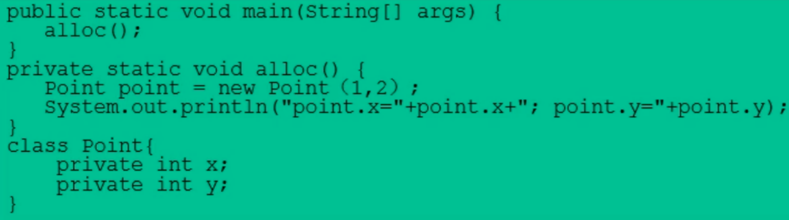
          - 等价于替换后的代码
            - 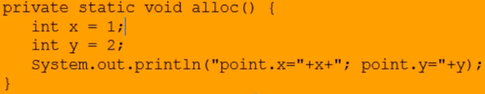
        - 参数： -XX:EliminateAllocations，默认是打开的，允许把对象打散分配到栈上
        - 标量：无法分解成更小./ch05-runtime/image/1677130373532.png
    - 参数：jdk6u23 已经默认开启逃逸分析了，但是也可以通过-XX:DoEscapeAnalysis 显式开启，可以通过-XX:PrintEscapeAnalysis 查看逃逸分析的相关日志
    - 挑战： 逃逸分析技术并不成熟，根本原因在于无法保证逃逸分析的产出比，因为逃逸分析本身也是需要进行一系列的复杂分析的，这些辅助的分析也是需要一些性能损耗的。
- 1. 先去方法区的运行期常量池中检查是否能够定位到一个类的符号引用，检查这个类是否被加载、解析和初始化，没有的话就先执行类加载过程；
- 2. 执行对象的内存分配过程
  - 内存是规整的
    - 指针碰撞
  - 内存是不规整的
    - 空闲列表
- 3. 处理并发安全问题
  - 意思是： ~~在代码的运行过程中可能会涉及到优化后的同步问题，这个时候要确定具体执行并发安全的方式~~，分配空间时，可能涉及到内存空间的争抢，解决这个问题的方式有两种：
    - 利用 CAS 算法+失败重试来保证更新的原子性
    - 为每一个线程分配独立的 TLAB 空间
- 4. 把划分好的内存区域初始化为零值
- 5. 进行必要的设置，包括
  - 实例对象的类对象信息
  - 元数据信息的定位
  - 对象的哈希码
  - 对象的 GC 分代年龄
- 6. 执行 init 方法，完成其它资源和状态信息的构造

## 10. 对象的访问定位过程

- 问题描述：对象是如何通过栈帧中的对象引用找到堆中实际的对象信息的？
- 问题讲解：所谓对象信息包括两部分内容——对象实例信息和对象类型信息，而对象实例信息位于 Java 堆中，对象类型信息位于方法区
  - 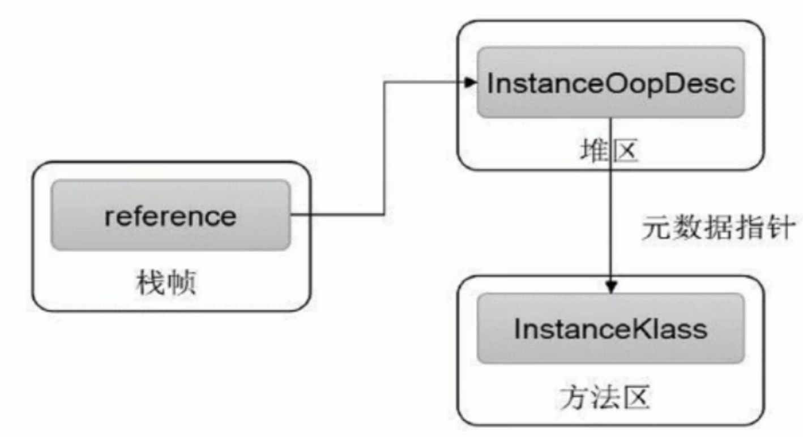
- 问题解答
  - 句柄池方式
    - 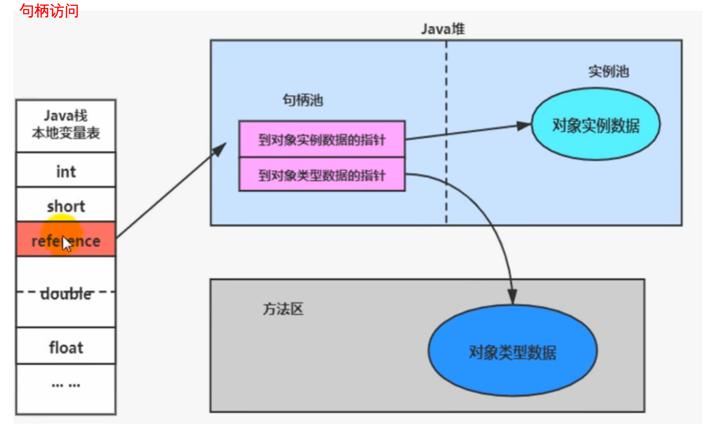
  - 直接指针
    - 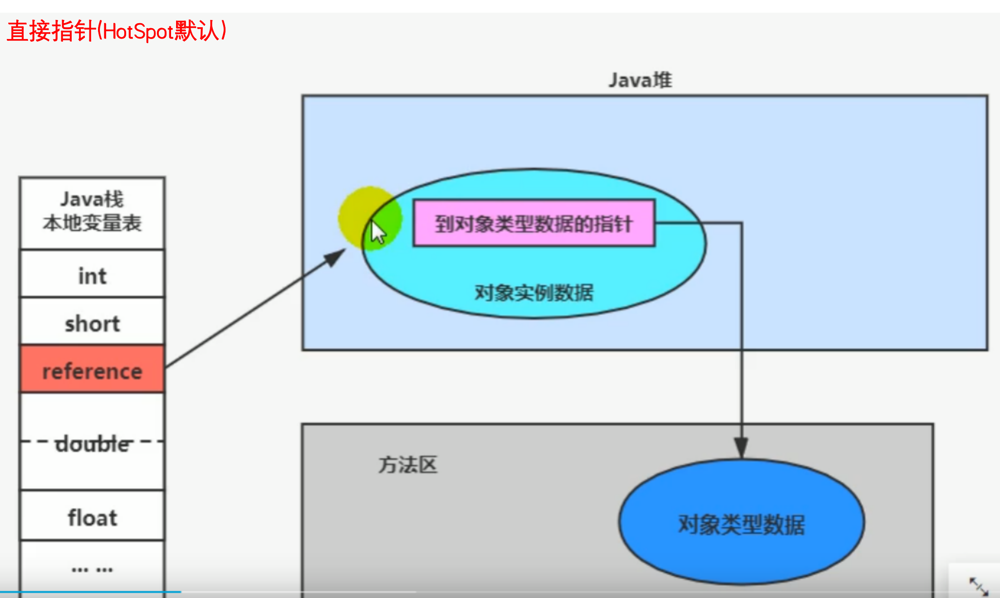

直接指针的方式比着句柄池
