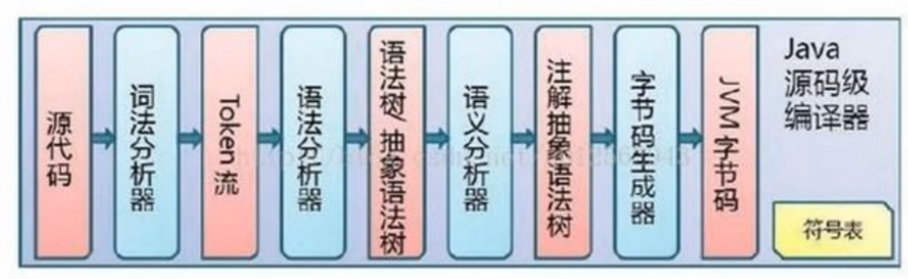
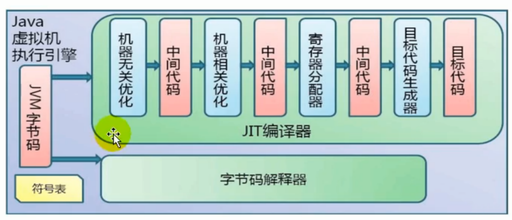
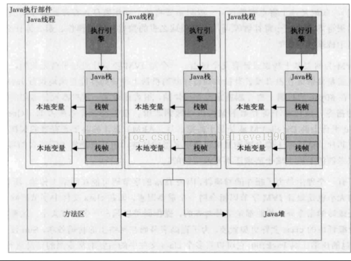

# 6. 执行引擎

> AOT

## 1. 执行方式

- 解释执行
  - 对字节码文件逐行解释执行，换言之，就是依次读取.class 文件的每一行，然后把读取到的字节码“翻译”成机器语言进行执行
    - 效率低下
- 编译执行（编译器分类及举例）

## 2. 包含内容

- 解释器
- 即时编译器
  - 分析器
- 垃圾回收器

## 3. 执行过程

- Java 运行分为两个阶段
  - 第一阶段：把.java 文件编译成.class 文件
    - 
  - 第二阶段：运行.class 文件
    - 

## 4. Java 中运行代码的方式分为两种，`解释运行` 和 `编译运行`。

`解释运行`是对字节码文件逐行解释执行，换言之，就是依次读取.class 文件的每一行，然后把读取到的字节码“翻译”成机器语言进行执行，这种方式效率低下。JS、JSP、ASP 等语言都是解释型编程语言。

`编译运行`则是将一种语言规范转化成另外一种语言规范，即将`便于人理解的语言规范`转化成`机器容易理解的语言规范`的过程就是编译。

### 4.1. 编译器

编译运行一般情况下会有专门的编译器来完成编译工作，Java 中根据编译器的作用把编译器分为三类：

- 前端编译器，主要作用是把.java 文件编译成.class 文件，如 javac、ECJ 等；
- 后端编译器（JIT 即时编译器），主要作用是把字节码文件转变成可执行的机器码，主要有两种 C1 和 C2 编译器，C1 的启动时间比 C2 启动时间短，系统稳定后，C2 执行效率比 C1 高；
- 静态提前编译器（AOT 编译器），直接把.java 文件转变成可执行的机器码，包括 GCJ 等，还处于实验阶段；

::: tip
HotSpotJVM 是两种方式并存的。运行过程原理大概是这样的：等待所有的代码编译完成再进行运行是不值得的，项目启动前期就要使用解释器解释执行一些代码，同时也会针对执行到的热点代码进行探测，对热点代码再进行编译执行，相当于对二者进行取长补短。

使用什么技术探测热点代码？

- 使用`方法调用计数器`统计方法的调用次数，配置参数： -XX:CompileThreshold
- 使用`回边计数器`统计循环体的执行次数

对热点代码的优化手段？

- 栈上分配
- 同步消除
- 标量替换

:::

### 4.2. 执行

JVM 是基于栈的体系结构来执行 class 字节码的。线程创建后，都会产生程序计数器（PC）和栈（Stack），程序计数器存放下一条要执行的指令在方法内的偏移量，栈中存放一个个栈帧，每个栈帧对应着每个方法的每次调用，而栈帧又是有局部变量区和操作数栈两部分组成，局部变量区用于存放方法中的局部变量和参数，操作数栈中用于存放方法执行过程中产生的中间结果

