# 8. Hotspot

## 1. 不同的回收方式具有不同的运行期内存结构模型

- 分区
  - 区域划分
- 分代
  - Java8 之前
    - 新生代
      - Eden
      - S0
      - S1
    - 老年代 Tenured
    - 永久区，也就是方法区
  - Java8 及以后
    - 新生代
      - Eden
      - S0
      - S1
    - 老年代 Tenured
    - 元空间，也就是方法区

## 2. 前置知识点

### 2.1. 并发 VS 并行


并发 ： 多个任务在单个处理器上运行，单个处理器通过划分时间片，让任务依次获取执行权限，看上去好像是多个任务同时发生一样，解决了不同任务执行过程中存在的阻塞问题，可以理解为任务阻塞时，就让出处理器的执行权限，目的是更大限度的压榨处理器的处理能力

并行： 同一时刻很多任务同时获得处理器的执行权限，利用了处理器的多核特性

串行： 要想执行其中的某一个，就必须要停止另一个。即同一时刻只能有一个执行。

### 2.2. 内存溢出 VS 内存泄露

- 内存溢出： 没有内存空间可用，并且经过垃圾回收器收集后依然没有内存空间可用
- 内存泄漏： 一些对象已经不再被应用程序使用，但是收集器又没有办法回收
  - 常见的内存泄露
    - 单例模式中单例对象持有对外部对象的引用
    - IO 资源未关闭，如数据库链接、Socket 链接、文件链接等

## 3. 七款经典垃圾回收器


这里的并行是指： 垃圾收集线程由原来的单个垃圾收集线程变成多个垃圾收集线程，也就是说同一时间有多个垃圾收集线程在运行。
这里的并发是指： 垃圾收集线程和用户线程同时存在。

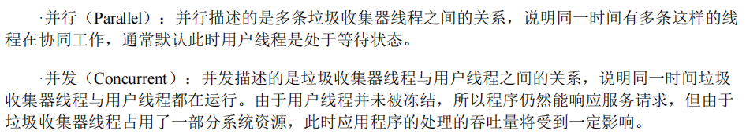

### 3.1. 串行收集器

- Serial 收集器
  - 针对新生代的收集器
  - 采用复制算法
  - 是 Client 模式下默认的新生代垃圾回收器
  - STW 机制：在垃圾回收时，会使用**一个 CPU 或一个收集线程**来完成垃圾收集工作
    - 意味着进行垃圾回收时，必须暂停其他工作线程
- SerialOld 收集器
  - 针对老年代的收集器
  - 采用标记-整理算法
  - 是 Server 模式下默认的老年代垃圾回收器
  - 进行垃圾回收时也需要 STW 机制
- 限定单核 CPU 才可以使用，一般 web 应用程序中是不会采用这种串行的垃圾收集器的
  - 

### 3.2. 并行收集器

> 并行收集器利用了计算机多核的特性，扩展了串行收集器的并行收集能力。
> 强调的是收集器利用多核的特性。

- ParNew 收集器
  - 除了采用并行回收的方式执行内存回收外，与 Serial 收集器几乎没有任何区别
  - 同样采用复制算法、STW 机制
  - 是多数 JVM 运行在 Server 模式下新生代的默认垃圾收集器
- ParallelScavenge 回收器
  - 吞吐量优先的垃圾收集器
  - 与 ParNew 收集器实现方式基本类似，只不过是保证了吞吐量优先
  - 可以使用 -XX:+UseAdaptiveSizePolicy ，开启动态自适应策略，让 JVM 根据当前系统运行情况，动态调整新生代大小、Eden 和 Survivor 区域的比例以及晋升老年代对象年龄，以期获得最合适的停顿时间或最大的吞吐量。
- ParallelOld 收集器
  - 除了采用并行回收的方式执行内存回收外，其他与 SerialOld 收集器几乎没有区别
- 适合执行批量处理、订单处理、工资支付、科学计算的应用程序
  - 

### 3.3. 并发收集器

#### 3.3.1. CMS 回收器

- 让垃圾收集线程与用户工作线程并发执行
- 主要关注点是：减少停顿时间，低延迟
- 老年代的垃圾回收器，无法与 ParallelScavenge 回收器一并使用，只能配合 ParNew 和 Serial 串行收集器，在预留空间无法保证工作线程的运行时，就会临时启动 Serial Old 收集器作为老年代的垃圾回收器
- 原理及过程
  - 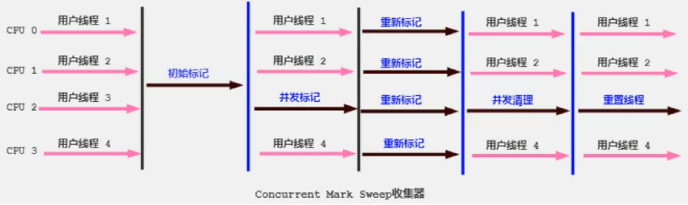
  - 1. 初始标记 ： 利用 STW 机制，标记出 GCRoot 的对象，速度非常快
  - 2. 并发标记 ： 并发标记出 GCRoots 的直接关联对象并遍历整个对象图，其过程是与工作线程一并工作，耗时较长但是不需要停顿用户线程，
  - 3. 重新标记 ： 再次利用 STW 机制，标记第二阶段产生的新的变动的对象，但是垃圾收集线程是并发进行的
  - 4. 并发清除
    - 与用户工作线程一同工作，清除掉已经死亡的对象，并释放空间
    - 使用标记-清除算法
      - 不可避免的会产生一些内存碎片，因此也不能使用指针碰撞的方式分配空间，只能使用空闲列表的方式分配空间
      - 不使用标记-整理算法的原因：在清理的时候，用户线程还在使用对应的内存空间，整理内存空间会导致用户线程正在使用的内存空间失效。
- 不会像其他老年代收集器一样，等到老年代几乎被填满之后才进行收集，而是当堆内存使用超过一个阈值后就开始进行回收，以确保程序在 CMS 运行期间有足够的空间支持应用程序的运行，如果预留的空间无法保证程序的运行，就会出现“Concurrent Mode Failuer”失败，此时 JVM 会临时启用 Serial Old 收集器作为老年代的垃圾收集器，停顿时间就会变的很长
- 特点、优缺点
  - `并发收集` ： 垃圾收集线程与用户工作线程是并发执行的
  - `低延迟` ： 除了初始阶段和重新标记阶段会出现短暂的停顿外，其他阶段不会出现停顿，是一款专注入低延迟的垃圾收集器
  - `会产生浮动垃圾` ： 在并发清除阶段，由于用户工作线程依然在工作，也有可能会产生一些垃圾对象，但是此时 CMS 已经无法对这些对象进行标记，只能等到下次 GC 时再进行清除
  - `对 CPU 资源敏感` ： 与等待老年代几乎填满后再进行垃圾回收的其他老年代收集器不同，CMS 回收器是当堆空间使用到一定阈值时就会开始进行回收垃圾
  - `会产生内存碎片` ： 并发清除阶段使用的是标记-清除算法，这种算法会产生内存碎片问题
- 迭代
  - JDK9 及以后的版本，使用 `-XX:+UseConcMarkSweepGC` 开启 CMS 垃圾收集器时，会收到一个警告信息——提示 CMS 未来将被废弃
  - JDK14 完全移除 CMS，用户使用 `-XX:+UseConcMarkSweepGC` 显式开启 CMS 收集器时，不会收到提示，会自动使用默认的垃圾收集器进行收集

#### 3.3.2. G1 回收器

- 随着业务的发展，机器越来越先进，CPU 核心数越来越多，JVM 管理的内存越来越大，之前的 GC 收集器已经不能满足业务的要求了，分区收集器闪亮登场。
- 基本原理
  - 
  - 每个 Region 的角色只能是 E、S、O、H 中的一个，但是随着 GC 的过程，身份是不确定的，有可能这次 GC 前是 E，下次 GC 就变成了 O
  - 设置 H（大对象区域）的原因： 之前垃圾回收器，会把大对象默认分配到老年代中，但是如果它是一个短期存在的对象，这就会对老年代区域产生影响，G1 就划分了一个 H 角色来保存大对象，并规定如果一个 H 区装不下，就寻找连续的 H 区来存储。
  - 把堆空间使用“化整为零”的思想，划分成相同大小的多个区域，之后每次只回收部分区域。
  - 把堆空间“化整为零”，分割成很多不相关的区域，并且 G1 会维护一个优先列表以便追踪每一个区域的垃圾堆积的价值大小，回收时优先回收价值最大的区域。
- 分区过程
  - 如果设置了 Region 数量，那么 Region 大小就不是固定的，但是大小肯定是 2 的幂次方，并且在 1~32M 之间；如果设置了 Region 大小，那么 Region 数量就不是固定的，但是肯定是 2048 附近；
  - 通过 -XX:G1HeapRegionSize 设定
  - 分区大小一定相同，且在 JVM 生命周期内不会被改变
- 回收过程
  - 先进行年轻代 GC【注意，要解决跨区域引用的问题】
    - 
      - 如果没有被回收的区域内的对象引用了要回收的区域的对象，该如何解决？是否需要全堆扫描？全堆扫描的效率低下。使用记忆集进行解决，JVM 会为每一个 Region 分配一个记忆集，记忆集中记录了本区域内哪些对象（包括引用类型对象）被其他区域所引用。在实际回收过程中，GCRoots 引用链引用到的本区域内的对象加上记忆集中的对象构成整个存活对象集。
      - 【重点】G1 的每个 Region 都维护有自己的记忆集，这些记忆集会记录下别的 Region 指向自己的指针，并标记这些指针分别在哪些卡页（卡表的单个元素）的范围之内。G1 的记忆集在存储结构的本质上是一种哈希表，Key 是别的 Region 的起始地址，Value 是一个集合，里面存储的元素是卡表的索引号。这种“双向”的卡表结构（卡表是“我指向谁”，这种结构还记录了“谁指向我”），由于记忆集的存在，会造成 JVM 堆容量 10%到 20%的空间浪费。
      - 卡表的作用是什么？记录当前区域内的引用类型对象在其他 Region 中的哪个区域（哪个卡页）。由于引用类型对象涉及到写-写操作时的同步问题，因此还需要“写屏障”技术避免线程安全问题，写屏障原理是使用中断的方式。
    - 当年轻代的 Eden 区用尽时开始年轻代回收过程，回收过程是并行的独占式的。G1 会暂停所有工作线程，启动多线程回收年轻代，把年轻代的存活对象转移到 S 区或者老年区
  - 老年代并发标记过程（Concurrent Marking）
    - 
      - 从 GC 日志中查看过程
        - 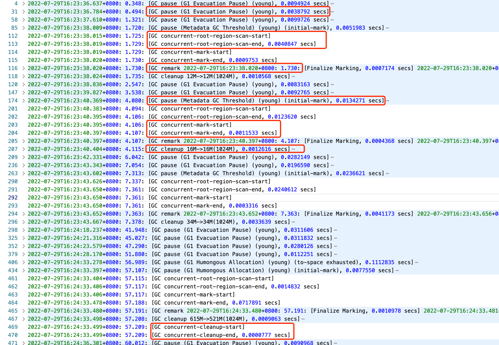
    - 
    - 当堆内存使用达到一定的值后，开始老年代并发标记过程
  - 混合回收（Mixed GC）
    - 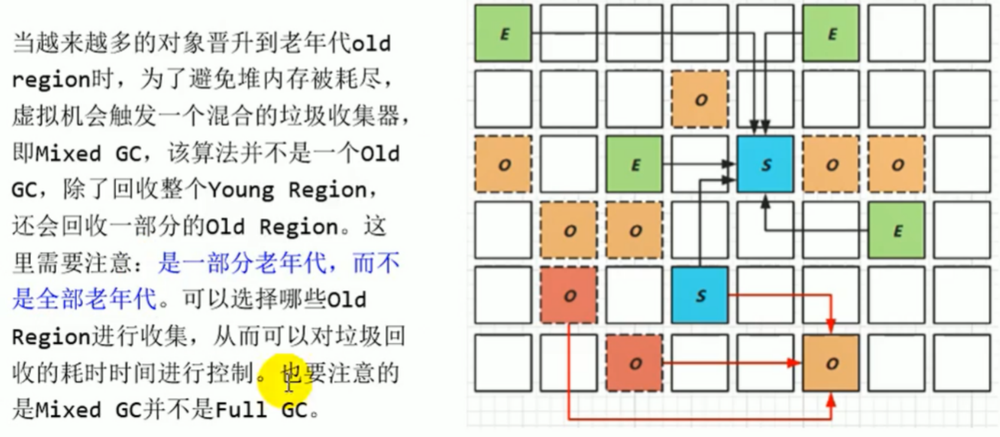
      - 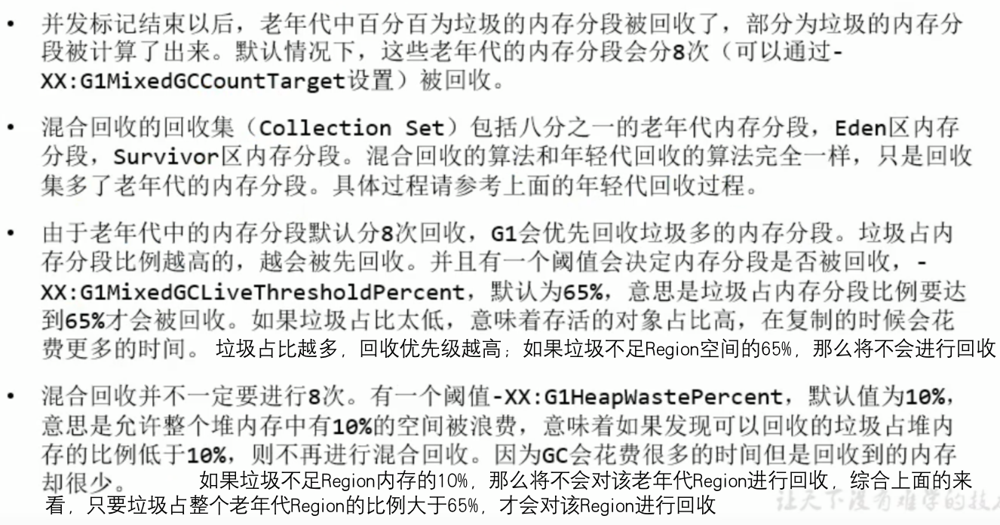
    - 老年代并发标记过程完成后，立刻进入混合回收阶段，G1 从老年代移动存活对象到空闲区间，使部分空闲区间成为老年代的一部分。老年代的回收并不是全部回收的，只回收其中的一部分。部分年轻代也一并回收
  - 如果需要，单线程、独占式、高强度的 FullGC 还是继续存在的，它是针对 GC 的评估失败提供了一种失败保护机制，即强力回收）
    - 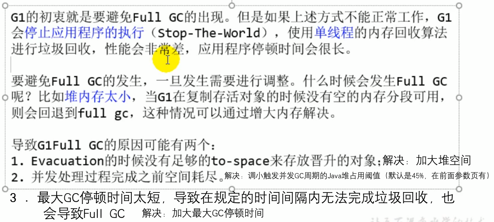
- 特点
  - 1. 属于分代型垃圾回收器，同时兼顾年轻代和老年代，不同 Region 之间使用复制算法，整体可以看作是标记-整理算法
  - 2. 并行性与并发性
  - 3. 空间整合 ： Region 之间是复制算法，整体看上去是标记-整理算法
  - 4. 可预测的停顿时间模型 ： 通过维护的优先列表，保证优先回收价值最大的 Region，保证在有效的时间内获取尽可能高的收集效率
  - 5. 小内存应用上 CMS 表现优于 G1，但大内存应用上 G1 表现优于 CMS，平衡点 6-8G
- 使用
  - jdk1.7 移除了“实验”标志
  - jdk8 中还不是默认的垃圾收集器，需要使用 -XX:+UseG1GC 进行启用
  - JDK9 的默认垃圾回收器
  - 避免使用-Xmn 或-XX:NewRatio 等显式设置年轻代大小，因为这些参数会覆盖设置的暂停时间参数，最好是让垃圾回收器自己调节
  - 避免使用苛刻的暂停时间目标
- 

### 3.4. 组合使用

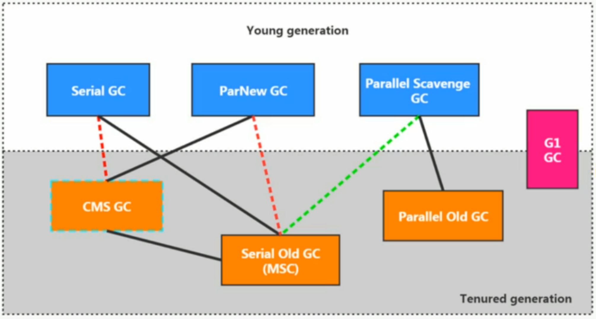

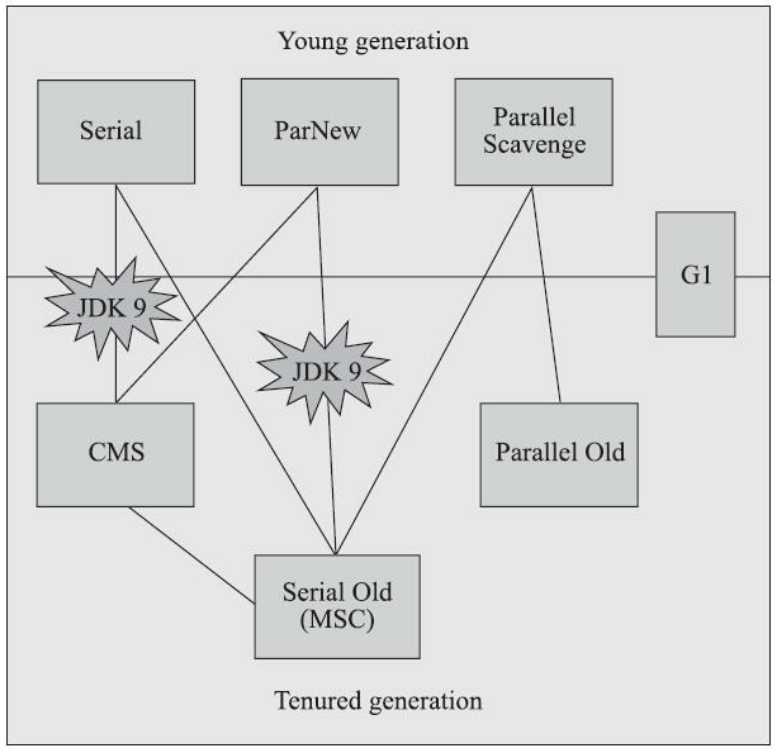
./ch08-hotspot/image/1677311728992.png

- 组合使用
  - 组合关系
  - 
  - 目前，基本上都使用 G1
  - 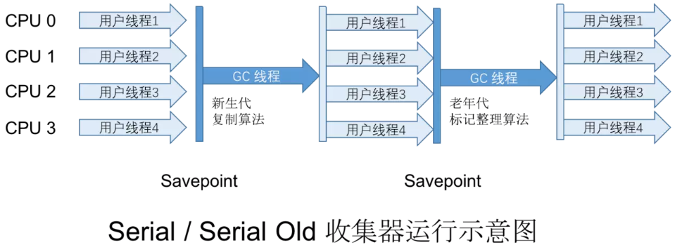
  - 
  - 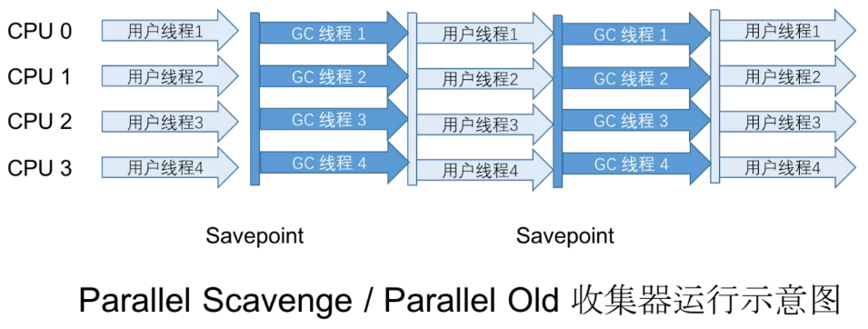
  - 
  - 

### 3.5 展望

- Serial GC 在 Serverless 应用场景下找到了新的舞台
- CMS GC 在 jdk9 中被标记为废弃，JDK14 中移除
- ZGC 和 Shenandoah 主打低延迟，可以做到在不影响吞吐量的前提下，实现任意堆内存大小下的停顿时间限制在 10 毫秒以内的低延迟

## 4. 代码运行方式

- 混合运行模式（解释运行+编译运行）
- 解释器
- 编译器
  - 分类
    - 前端编译器
      - 把.java 文件转变成.class 文件
        - 包括 javac、ECJ 等
    - 后端编译器，也叫 JIT 编译器
      - 把字节码文件转变成可执行的机器码
        - C1 编译器
          - 对字节码进行简单可靠的优化，以期达到更快的编译速度，是虚拟机 client 模式下的默认编译器
          - 优化手段
            - 方法内联
            - 去虚拟化
            - 冗余消除
        - C2 编译器
          - 对字节码进行长时间的优化，以期达到更高的代码执行效率，是虚拟机 server 模式下的默认编译器
          - 优化手段
            - 栈上分配
            - 同步消除
            - 标量替换
        - C1 的启动时间比 C2 启动时间短，系统稳定后，C2 执行效率比 C1 高
    - 静态提前编译器，也叫 AOT 编译器
      - 直接把.java 文件转变成可执行的机器码
        - 包括 GCJ 等，还处于实验阶段
    - HotSpotJVM 是两种方式并存的
      - 原理：等待所有的代码编译完成再进行运行是不值得的，项目启动前期就要使用解释器解释执行一些代码，同时也会针对执行到的热点代码进行探测，对热点代码再进行编译执行。相当于对二者进行取长补短
        - 使用热点探测技术探测热点代码
          - 如何探测热点代码
            - 使用方法调用计数器
              - 统计方法的调用次数
              - -XX:CompileThreshold
            - 回边计数器
              - 统计循环体的执行次数
          - 探测到热点代码后
            - 栈上分配
            - 同步消除
            - 标量替换

## 5. 常用参数总结

- 管理 Java 堆
  - -Xms ： Java 堆初始化大小，默认是物理内存总容量/64
  - -Xmx ： Java 堆最大容量，默认是物理内存总容量/4
  - 一般情况下会把上面这两个值设置成相同数值，目的是为了减少内存重新分配的次数，提高性能
  - -XX:NewRatio ： 【老年代容量：新生代容量】的比例，默认是 2，表示新生代占总容量的 1/3，老年代占总容量的 2/3
  - -Xmn ： 新生代的最大容量，S0+S1+Eden 所能使用的最大容量，一般默认即可
  - -XX:SurvivorRatio ： S0、S1 与 Eden 区的比例，默认是 8，表示 S0:S1:Eden=1:1:8
  - -XX:MaxTenuringThreshold ： 对象进入老年代区的最大年龄，默认是 15
  - -XX:HandlePromotionFailure ： 是否开启空间分配担保， 值为 True/False
  - -XX:UseTLAB ： 是否开启 TLAB，值为 True/False
  - -XX:TLABWasteTargetPencent ： 设置 TLAB 占用 Eden 空间的大小
- 虚拟机栈
  - -Xss ： 线程的最大栈空间，决定了函数的最大调用深度，常见的值有 25k、64k、128k 等
- 方法区
  - JDK8 以前
    - -XX:PermSize
    - -XX:MaxPermSize
  - JDK8 及以后
    - -XX:MetaspaceSize
    - -XX:MaxMetaspaceSize
  - -Xnoclassgc ： 不开启方法区的 gc
  - -XX:+TraceClass-Loading / -XX:+TraceClassUnloading ： 查看类加载和类卸载信息
- 执行器
  - -Xint ： 完全使用解释器的方式执行
  - -Xcomp ： 完全使用即时编译器的方式执行
    -client ： 使用 C1 编译器，对字节码进行简单可靠的优化，达到更快的编译速度
    -server ： 使用 C2 编译器，对字节码进行较长时间的优化，达到更高的代码执行效率
  - -Xmixed ： 使用混合的方式执行
- 指定垃圾回收器
  - -XX:+UseSerialGC ： 指定 jvm 在新生代和老年代收集内存时都是用串行收集器， 等价于新生代使用 Serial 收集器、老年代使用 SerialOld 收集器；
  - -XX:+UseParNewGC ： 表示新生代使用 ParNew 的收集器，不影响老年代 ；
  - JDK8 默认的收集器，开启其中一个，另外一个也会被开启，相互激活
    - -XX:+UseParallelGC ： 手动指定新生代使用 Parallel 并行收集器；
    - -XX:+UseParallelOldGC ： 手动指定老年代使用并行收集器；
  - -XX:+UseG1GC ： 手动指定使用 G1 垃圾回收器
  - -XX:ParallelGCThreads ： 使用并行收集器时，设置年轻代并行收集器的线程数，默认与 CPU 数量一致
    - 
  - -XX:MaxGCPauseMillis ： 设置垃圾收集器最大停顿时间，STW 时间，单位是毫秒
  - -XX:+UseAdapterSizePolicy : ParallelScavenge 开启自适应策略
    - JVM 会自动调整年轻代区域大小、Eden 与 S 区比例、老年代年龄等参数，以达到堆大小、吞吐量和停顿时间的平衡点
    - 手动调优比较困难的场景下，可以设置此参数，把调优工作交给 jvm
  - -XX:GCTimeRatio ： 垃圾收集时间占总时间的比例， 取值范围：0-100，默认是 99，表示垃圾回收时间不超过 1%
  - -XX:+UseConcMarkSweepGC
  - -XX:+CMSInitialingOccupanyFraction
  - -XX:+UseCMSCompactAtFullCollection
  - -XX:CMSFullGCsBeforeCompaction
  - -XX:ParallelCMSThreads
  - -XX:G1HeapRegionSize ： 设置每一个 Region 的大小
  - -XX:ConcGCThreads ： 设置并发表计的线程数
  - -XX:InitiatingHeapOccupancyParcent ： 设置并发 GC 的 Java 堆占用率的阈值，超过就出发 GC，默认是 45
- 监控参数
  - 打印 GC 简要信息
    - -XX:+PrintGC
    - -Xloggc:../logs/gc.log
    - -verbose:gc
  - -XX:+PrintGCDetails ： 打印 GC 详细信息
  - -XX:+PrintGCTimeStamps ： 输出 GC 的时间戳，以基准时间的形式
  - -XX:+PrintGCDateStamps ： 输出 GC 的时间戳，以日期的形式，如 2013-05-04T21:34:24.123+0800
  - -XX:+PrintHeapAtGC ： 在进行 GC 的前后打印堆信息
  - -XX:+PrintFlagsInitial ： 查看 jvm 所有参数初始默认值
  - -XX:+PrintFlagsFinal ： 查看 jvm 所有参数最终值
  -

## 6. 日志分析

- MinorGC
  - 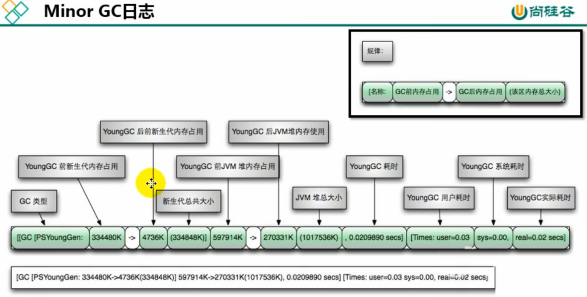
- FullGC
  - 
- 日志样例

  ```txt
  2023-04-04T12:08:11.670+0800: 104.882: [GC (Allocation Failure) [PSYoungGen: 262144K->43503K(305664K)] 282367K->138752K(1005056K), 0.0710736 secs] [Times: user=0.34 sys=0.06, real=0.07 secs]

  【2023-04-04T12:08:11.670+0800】 表示发生 GC 的时间戳
  【104.882】表示从 JVM 启动，到打印这行日志，经过了 104.882 秒的时间
  【GC (Allocation Failure) 】表示 GC 触发的类型是『Allocation Failure』，即分配失败
  【[PSYoungGen: 262144K->43503K(305664K)]】 表示新生代使用的是 ParraleScavenge 回收器，262144K->43503K，表示从 262144K 回收到 43503K，305664K 表示新生代总容量
  【282367K->138752K(1005056K) 】 表示整个堆从 282367K 降到 138752K，堆的总容量为 1005056K
  【0.0710736 secs 】 表示 GC 的时间是 0.0710736 秒
  【Times: user=0.34 sys=0.06, real=0.07 secs 】 表示整个 GC 过程中，用户态占用时间、系统态占用时长和真实用时
  ```

  ```txt
  2023-04-04T12:06:27.811+0800: 1.023: [Full GC (Metadata GC Threshold) [PSYoungGen: 16268K->0K(305664K)] [ParOldGen: 24K->15506K(699392K)] 16292K->15506K(1005056K), [Metaspace: 20436K->20434K(1067008K)], 0.0200635 secs] [Times: user=0.07 sys=0.00, real=0.02 secs]
  这是 FullGC 的过程日志。
  新生代总大小为 305664K，从 16268K 降到 0K；
  老年代总大小为 699392K，GC 前为 24K，GC 后为 15506K；
  整个堆大小为 1005056K，GC 前为 16292K，GC 后为 15506K；
  元空间总大小为：1067008K，GC 前为 20436K，GC 后为 20434K；
  Times: user=0.07 sys=0.00, real=0.02 secs ： 表示整个 GC 过程中，用户态占用时间、系统态占用时长和真实用时
  ```

  ```txt
  2023-04-04T12:09:49.638+0800: 202.850: [Full GC (Ergonomics) [PSYoungGen: 116735K->0K(160256K)] [ParOldGen: 699391K->14256K(699392K)] 816127K->14256K(859648K), [Metaspace: 40493K->40493K(1087488K)], 0.0174834 secs] [Times: user=0.07 sys=0.01, real=0.02 secs] Heap PSYoungGen total 160256K, used 41013K [0x00000007aab00000, 0x00000007c0000000, 0x00000007c0000000) eden space 116736K, 35% used [0x00000007aab00000,0x00000007ad30d7f8,0x00000007b1d00000) from space 43520K, 0% used [0x00000007bd580000,0x00000007bd580000,0x00000007c0000000) to space 116224K, 0% used [0x00000007b1d00000,0x00000007b1d00000,0x00000007b8e80000) ParOldGen total 699392K, used 14256K [0x0000000780000000, 0x00000007aab00000, 0x00000007aab00000) object space 699392K, 2% used [0x0000000780000000,0x0000000780dec388,0x00000007aab00000) Metaspace used 41838K, capacity 43950K, committed 44592K, reserved 1087488K class space used 5400K, capacity 5783K, committed 5936K, reserved 1048576Kused

  已使用的空间大小 capacity：当前已经分配且未释放的空间容量大小 committed：当前已经分配的空间大小 reserved：预留的空间大小 capacity + 已经被释放的空间容量 = committed
  ```
