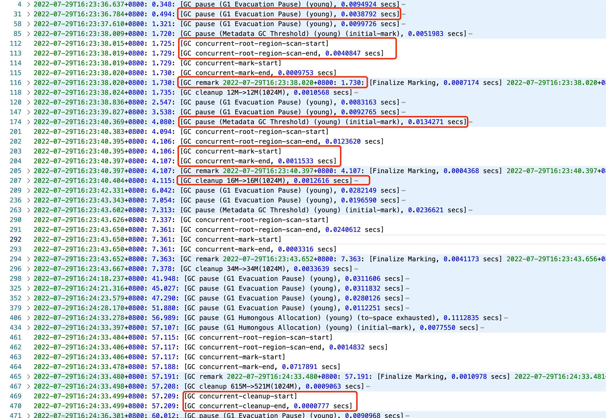

# 10. 调优

## 1. 事前使用合理的手段，生产时基本上是不需要调优的

### 1.1. 合理的架构设计

- 更好的针对性能问题和结构问题进行聚焦和优化

### 1.2. 代码 Review

- 禁止查询全表数据给客户端，会导致创建大量对象
- 文件、链接等资源使用完毕之后需要关闭
- 禁止使用 System.gc()方法
  - 避免 fullgc
- 合适的设计模式
  - 有利于提高代码复用，减少方法区大小

### 1.3. 代码中完备的日志记录

### 1.4. 项目启动时合理的配置参数

### 1.5. 服务器上完善的监控系统

- 链路追踪
- 服务器资源监控

## 2. 两类问题

### 出错

- OOM
  - OOM 类型
    - 服务器异常
      - Swap 分区
        - 异常类型
          - Out of swap space
        - 本质原因
          - Linux 系统会把不常用的内存里面的数据放到一个 swap 分区中，这样再次使用这些数据时，就直接从 swap 分区中读到内存中就行，即交换分区。虚拟内存（Virtual Memory）由物理内存（Physical Memory）和交换空间（Swap Space）两部分组成，遇到这个异常，表示虚拟内存耗尽。
        - 常见具体原因
          - 地址空间不足
          - 物理内存耗尽
          - 应用程序的本地内存泄露（native leak），例如不断申请内存空间，却不释放
        - 优化手段
          - 执行 jmap -histo:live <pid> 命令，强制执行 FullGC，如果几次执行后内存明显下降，则基本可以确认为 Direct buffer 问题
          - 升级地址空间为 64bit
          - 升级服务器配置规格或进行资源隔离
      - 线程资源
        - 异常类型
          - Unable to create new native thread
        - 本质原因
          - JVM 创建的用户线程都是由底层操作系统来完成的，而操作系统创建线程需要分配空间，当 JVM 创建系统线程，而操作系统又没有足够资源分配时，就会抛出异常信息。
        - 常见的具体原因
          - JVM 创建的线程数超过了操作系统的 ulimit 限制
          - 线程数超过了 kernel.pid_max
          - 本地线程内存空间不足
        - 优化手段
          - 调整 ulimit 限制，ulimit -u xxx
          - 减小 JVM 其他资源使用，腾出更多空间给线程使用
            - 限制线程栈大小，即调小-Xss 大小
            - 减小堆空间大小
            - 限制线程池大小
          - 修复其他应用程序内存泄露问题
      - OOM Killer 机制
        - 异常类型
          - Kill process or sacrifice child
        - 本质原因
          - 默认情况下，Linux 允许用户进程申请大于系统可用内存的空间，这样可以『错峰复用』，有利于提高资源利用率。但这也导致了『超卖』问题，因此当线程申请不到资源时，系统会自动激活 OOM Killer 机制，寻找评分较低的进程来释放资源。在监控工具上的表现是：空闲的内存空间突然大幅度上升
        - 常见的具体原因
          - 这个异常类型是由操作系统层面出发的，也就是操作系统自动触发的 OOM Killer 机制导致的异常
        - 优化手段
          - 可以采用资源隔离或对系统 OOM Killer 机制进行调优
    - Java 堆
      - 内存泄露或内存溢出
        - 异常类型
          - Java heap space
        - 本质原因
          - 堆空间没有足够的空间存放新创建的对象时，就会抛出异常信息
        - 常见的具体原因
          - 请求创建一个大对象，通常是一个大数组
          - 业务流量激增，这种情况需要配合监控工具中的尖峰值时期与 OOM 时期来判断是否是因为业务流量激增导致的
          - 过度使用终结器（Finalizer），该对象没有立即被 GC
          - 内存泄漏（Memory Leak），大量对象引用没有释放，JVM 无法对其自动回收，常见于使用了 File 等资源没有回收
        - 优化手段
          - 通常是调高 JVM 堆内存空间即可，还是不行就采用下面的手段
          - 超大对象，就要检查业务代码，判断其合理性
          - 如果是业务峰值，就扩大资源，或做限流熔断等
          - 如果是内存泄露，需要找到持有的对象，修改代码设计，比如关闭没有释放的资源等
      - 多次 GC 仍无法满足分配资源所需要的空间
        - 异常类型
          - GC overhead limit exceeded
        - 本质原因
          - JVM 花费了 98%的 GC 时间回收不到 2%的内存空间，换句话来说应用程序已经耗尽了所有可用内存，连 GC 也不会回收
        - 优化手段
          - 同 Java heap space
      - 【“内存泄露或内存溢出” 和 “多次 GC 仍无法满足分配资源所需要的空间”】发生的时机不同，GC overhead limit exceeded 发生时，可能并没有申请内存空间使用，只是多次 GC 后回收的内存空间过小；而 Java heap space 发生时，一定会有 JVM 为完成对象的创建而申请内存空间分配
      - 数组越界
        - 异常类型
          - Requested array size exceed VM limit
        - 本质原因
          - 程序请求创建的数组超过最大长度限制抛出异常
        - 优化手段
          - 检查代码，判断合理性，或改为分批次执行等
    - 方法区
      - 方法区已满
      - 本质原因
        - 方法区已满，通常是加载的 class 数目太多或体积太大
      - 异常类型
        - 永久代/老年代
          - 永久代空间已满
            - Permgen space
        - 元空间
          - 元空间已满
            - Metaspace
      - 优化手段
        - 根据出现的时机采用不同的办法
          - 程序启动时，调整 -XX:MaxPermSize 或 -XX:MaxMetaspaceSize 启动参数，调大方法区的大小
          - 应用重新部署时，应用没有重新启动，导致加载了多份 class 信息，再次重启即可
          - 运行时报错，可能是应用程序动态创建了大量的 class，而这些 class 生命周期却很短暂，但是 jvm 并没有卸载 class，可以配置 -XX:+CMSClassUnloadingEnabled 和 -XX:+UseConcMarkSweepGC 两个参数，允许 JVM 卸载 class
          - 如果上面还不能解决，就是用 jmap -dump:format=b,file=dump.hprof <process-id> 命令 dump 内存对象，然后通过 MAT 工具分析开销最大的 classloader 及重复的 class
    - 直接内存
      - JVM 允许应用程序通过 Direct byte buffer 直接访问堆外内存，一些应用程序通过 Direct byte buffer 结合内存映射文件（memory mapped file）实现高速 IO。Direct byte buffer 默认的大小是 64MB，一旦超出这个限制，就会抛出异常。通常情况下，涉及到 Nio 操作时才会抛错。
      - 异常类型
        - Direct buffer memory
      - 本质原因
        - 应用程序使用 Direct byte buffer 时，超出了限制
      - 优化手段
        - 通过 -XX:MaxDirectMemorySize 启动参数，调整直接内存的大小
        - 检查堆外内存使用代码，确认是否存在内存泄露；或通过反射调用 sun.misc.Cleaner 的 clean()方法，主动释放被 Direct ByteBuffer 持有的内存空间
        - Java 只能通过 ByteBuffer.allocateDirect 来操作 Direct ByteBuffer，因此可以通过 Arthas 拦截改方法进行排查
        - 检查一下 -XX:+DisableExplicitGC 参数是否启动，如果有就去掉，因为这个参数会让 System.gc() 失效
- StackOverFlow

### 停顿

- 本质： FullGC 频繁
  - 表现
    - 1. 机器 cpu 负载过高
    - 2. 频繁 full gc 告警
    - 3. 系统无法请求处理或者过慢， 接口无关的、全面性的无法响应请求或响应过慢
  - 原因
    - 解决思路： full gc 触发条件是 老年代空间不足， 所以追因的方向就是导致 老年代空间不足的原因：大量对象频繁进入老年代 + 老年代空间释放不掉
    - 1. 系统并发高、执行耗时过长，或者数据量过大，导致 young gc 频繁，且 gc 后存活对象太多，但是 survivor 区存放不下（太小 或 动态年龄判断） 导致对象快速进入老年代 老年代迅速堆满
    - 2. 发程序一次性加载过多对象到内存 （大对象），导致频繁有大对象进入老年代 造成 full gc
    - 3. 存在内存溢出的情况，老年代驻留了大量释放不掉的对象， 只要有一点点对象进入老年代 就达到 full gc 的水位了
    - 4. 元数据区加载了太多类 ，满了 也会发生 full gc
    - 5. 堆外内存 direct buffer memory 使用不当导致
    - 6. 也许， 你看到老年代内存不高 重启也没用 还在频繁发生 full gc， 那么可能有人作妖，在代码里搞执行了 System.gc();
- 解决思路
  - 如果有监控，那么通过图形能比较直观、快速的了解 gc 情况；
  - 如果没有监控，那么只能看 gc 日志或 jstat 来分析 这是基本技能 一定要熟练
    - 1. 观察年轻代 gc 的情况，多久执行一次、每次 gc 后存活对象有多少 survivor 区多大
      - 存活对象比较多 超过 survivor 区大小或触发动态年龄判断 => 调整内存分配比例
    - 2. 观察老年代的内存情况 水位情况，多久执行一次、执行耗时多少、回收掉多少内存
      - 如果在持续的上涨，而且 full gc 后回收效果不好，那么很有可能是内存溢出了 => dump 排查具体是什么玩意
    - 3. 如果年轻代和老年代的内存都比较低，而且频率低 那么又可能是元数据区加载太多东西了
      - 排查系统是否加载了无用的 lib 包，对系统所依赖的类库进行精简
    - 4. 其实如果是自己负责的系统，可能要看是不是发版改了什么配置、代码

## 3. 大对象导致 OOM

### 3.1. 获取堆栈信息

### 3.2. 使用 jvisualvm 找到大对象的堆栈信息

### 3.3. 在堆栈信息上找到对应的代码

## 4. 资源未关闭

### 4.1. 思路差不多同上

---

## 5. 综述

## 6. JVM 调优和生产问题的方法论

> 事实上，JVM 相关的问题并不可怕，重要的是我们需要建立关于 JVM 使用层面的完整的方法论。

1. 问题总是在发展中逐渐被发现，换言之，我们不可能预想到所有的问题，所以先干起来再说，也就是不管三七二十一，先投产再说，遇到问题了再解决。
2. JVM 层面的调优和生产环境问题定位可以看做是两部分内容。

### 6.1. 判断 JVM 运行异常的方法论

1. 要想知道 JVM 运行是否正常，首先要知道 JVM 正常运行时的状态是怎样的，也就是说要知道 JVM 正常运行时的性能指标是怎样的，我们要确立一个评价 JVM 正常运行与 JVM 异常运行的衡量标准。其次，我们还需要建立一个长效的监控机制，监控 JVM 长时间运行的状态，才能够捕捉异常的状态。最后，才是我们针对异常的运行状态进行调优的过程。
2. 评价 JVM 运行是否正常的衡量标准，不是『放之四海而皆准』的标准，而是『家家有本经』的标准。所以，这个标准与我们的生产实践有关。常见的实践过程是**通过试运营期来摸索**。在试运营期，我们可以不断的调整 JVM 各项配置参数，并监控记录在此期间的各项资源的使用情况，以此来获取最优的配置参数。还有一种实践方式是**直接压测方式**，就是直接使用各种压测工具，对生产环境进行压力测试，测试出系统资源占用最大情况下的业务指标和 JVM 指标，并以资源占用最大情况下的 JVM 各种指标作为 JVM 的基准指标。

### 6.2. GC 配置参数及正常指标的获取过程

1. 试运行期：
   1. 运维团队会划拨一些与投产环境资源配置一样的服务器资源，然后根据开发团队提供的一些 JVM 各项配置参数部署上我们的应用程序，并不断观察在试运行期间的各项指标：
      1. 服务器各项资源使用情况（包括 CPU 负载、内存占用情况、线程忙闲程度、网络开销、磁盘 IO 开销等）
      2. JVMGC 时的各项指标（包括 GC 频率、GC 耗时、STW 时间等）
   2. 然后在试运行期间，除了公测用户使用系统外，测试团队也会进行各项测试（如压测），运维团队会根据观察到的服务器各项指标，动态调整试运行期间的 JVM 各项配置参数，**以期获取在服务器各项资源使用率最高的情况下的 JVM 的配置参数以及 GC 的各项指标**；
   3. 之后运维团队会上一步获取到的 JVM 配置参数设置投产环境，并确定好正式投产环境具体的 JVM 指标（这也是后续优化的目标）；
      1. 一些常见的 JVM 配置参数
         1. -Xmx 等价于 -XX:MaxHeapSize
         2. -Xms 等价于 -XX:InitialHeapSize
         3. -Xmn
         4. -XX:PermSize 等价于 -XX:MaxDirectMemorySize
         5. -XX:SurvivorRatio
         6. -XX:+PrintGCDetails
         7. -XX:+PrintGCDateStamps
         8. -XX:+PrintGCTimeStamps
         9. -XX:HeapDumpOnOutOfMemoryError
         10. -XX:HeapDumPath
         11. -XX:MaxTenuringThreshold
         12. -XX:+PrintGCApplicationStoppedTime
      2. 一些常见的 JVM 指标
         1. FullGC 频率为每天一次；
         2. OldGC 频率为每天一次；
         3. YoungGC 频率为 3-6s 一次；
         4. 每次 YoungGC 耗时不得超过 500ms；
         5. 每次 FullGC 耗时不得超过 700ms；
         6. 每次 OldGC 耗时不超过 700ms;
         7. 相邻两次 YoungGC 后的堆空间容量增长不超过 10%『这说明 YoungGC 回收比较彻底，基本没有对象到老年代中，说明回收效果很好，这个指标只针对于设置了可动态增长的堆空间大小』；
         8. OldGC 后老年代容量增长比例不超过 10%；
2. 正常运行期，即功能迭代期
   1. 之后便是功能迭代，在不断的功能迭代过程中，运维团队也会不断的观察服务器各项指标，在功能迭代过程中，发现某项指标发生异常（与前面确定好的优化目标对比），此时就需要进行 JVM 调优了；
   2. 假如试运行期我们设置的 YoungGC 频率为 3-6s 一次，FullGC 频率为一天一次，那么在后续的生产过程中，如果 GC 的频率远远高于这个值，比如 1s 十次，那就说明那么就需要进行调优了；如果 GC 频率远远低于这个值，比如一分钟一次，那就说明 JVM 相当空闲，基本处于无事可做的状态，那么就需要缩小占用空间了，就需要调低 Xmn；
      1. YoungGC 频率过高，则可以检查：
         1. 新生代所占空间大小，可以适当调大 Xmn，使得新生代在整个堆空间中占比 25%-40%；
         2. SurvivorRatio 的比例，为 8 比较合适，这是经过 JVM 团队验证过的；
         3. 每次 YoungGC 后，幸存区的大小，如果幸存区容量过大，则表示不合理；
         4. 服务器 SWAP、IO 等情况，SWAP 发生时，会拉长 GC 耗时，需要进行优化；
      2. FullGC 频率过高，则可以检查：
         1. 新生代与老年代的比例，推荐是 4：6
         2. 每次 FullGC 后，老年代的增长情况，如果增长比例很高，说明可能存在大对象，需要排查大对象；
         3. 业务代码中是否存在一些 System.gc()；如果没有配置-XX:+DisableExplicitGC，即没有屏蔽 System.gc()触发 FullGC，那么可以通过排查 GC 日志中有 System 字样判断是否 System.gc()触发（日志样本：558082.666: [Full GC (System) [PSYoungGen: 368K->0K(42112K)]；）
         4. 如果使用了 CMS 收集器，可能还需要观察内存碎片问题；
         5. -XX:MetaspaceSize 的值是首次 FullGC 的触发条件。当首次 FullGC 后，释放的空间不足，那么在不超过-XX:MaxMetaspaceSize 的前提下，jvm 会适当提高实际的元空间大小；如果释放的空间过多，则会适当降低元空间的大小。
3. 但是实际运行过程中，我们处理更多的应该是 OOM 的情况。也就是说调优的阶段会在试运营期就完成，但是在实际生产运营期间，我们遇到的问题多是由我们的代码写的太菜而导致的。可以这样说：假如我们能够严格的控制软件工程的每一个阶段的质量，我们甚至连 OOM 可能都会很少遇到。

总结：

1. 预估字节码的占用空间决定初始值；
2. 小范围内测获得第一首性能指标
3. 压测获得极限性能指标；
4. 监控获得异常指标；
5. 发展中发现问题并解决问题，即不过早优化；
6. 具体业务有具体的指标；

### 6.3. 代码审核的一些要求

1. 禁止进行全表查询；
2. 禁止使用 select \*操作，用到那个字段就展示哪个字段等；
3. 使用文件、网络等做 IO 操作时，需要关闭资源；
4. 使用线程池而不是使用简单线程；
5. List 集合对象不宜过大，过大要考虑拆分；
6. 禁止使用 System.gc()方法

### 6.4. JVM 的配置参数

### 6.5. GC 日志分析

```txt
2023-04-04T12:08:11.670+0800: 104.882: [GC (Allocation Failure) [PSYoungGen: 262144K->43503K(305664K)] 282367K->138752K(1005056K), 0.0710736 secs] [Times: user=0.34 sys=0.06, real=0.07 secs]
2023-04-04T12:06:27.802+0800: 1.014: [GC (Metadata GC Threshold) [PSYoungGen: 173046K->16268K(305664K)] 173046K->16292K(1005056K), 0.0088983 secs] [Times: user=0.03 sys=0.01, real=0.01 secs]
2023-04-04T12:06:27.811+0800: 1.023: [Full GC (Metadata GC Threshold) [PSYoungGen: 16268K->0K(305664K)] [ParOldGen: 24K->15506K(699392K)] 16292K->15506K(1005056K), [Metaspace: 20436K->20434K(1067008K)], 0.0200635 secs] [Times: user=0.07 sys=0.00, real=0.02 secs]
2023-04-04T12:08:23.399+0800: 116.611: [Full GC (Ergonomics) [PSYoungGen: 43515K->0K(160256K)] [ParOldGen: 555360K->584932K(699392K)] 598876K->584932K(859648K), [Metaspace: 40740K->40740K(1087488K)], 0.9348212 secs] [Times: user=6.37 sys=0.07, real=0.94 secs]

```

```txt
2023-04-04T12:08:11.670+0800: 104.882: [GC (Allocation Failure) [PSYoungGen: 262144K->43503K(305664K)] 282367K->138752K(1005056K), 0.0710736 secs] [Times: user=0.34 sys=0.06, real=0.07 secs]

2023-04-04T12:08:11.670+0800: 表示发生GC的时间戳
104.882 ： 表示从JVM启动，到打印这行日志，经过了104.882秒的时间；
GC (Allocation Failure) ： 表示GC触发的类型是『Allocation Failure』，即分配失败；
[PSYoungGen: 262144K->43503K(305664K)] ： 表示新生代使用的是ParraleScavenge回收器，262144K->43503K，表示从262144K回收到43503K，305664K表示新生代总容量；
282367K->138752K(1005056K) ： 表示整个堆从282367K降到138752K，堆的总容量为1005056K；
0.0710736 secs ： 表示GC的时间是0.0710736秒；
Times: user=0.34 sys=0.06, real=0.07 secs ： 表示整个GC过程中，用户态占用时间、系统态占用时长和真实用时

```

```txt
2023-04-04T12:06:27.811+0800: 1.023: [Full GC (Metadata GC Threshold) [PSYoungGen: 16268K->0K(305664K)] [ParOldGen: 24K->15506K(699392K)] 16292K->15506K(1005056K), [Metaspace: 20436K->20434K(1067008K)], 0.0200635 secs] [Times: user=0.07 sys=0.00, real=0.02 secs]

这是FullGC的过程日志。
新生代总大小为305664K，从16268K降到0K；
老年代总大小为699392K，GC前为24K，GC后为15506K，整个堆大小为1005056K，GC前为16292K，GC后为15506K；
元空间总大小为：1067008K，GC前为20436K，GC后为20434K；
Times: user=0.07 sys=0.00, real=0.02 secs ： 表示整个GC过程中，用户态占用时间、系统态占用时长和真实用时

```

```txt
2023-04-04T12:09:49.638+0800: 202.850: [Full GC (Ergonomics) [PSYoungGen: 116735K->0K(160256K)] [ParOldGen: 699391K->14256K(699392K)] 816127K->14256K(859648K), [Metaspace: 40493K->40493K(1087488K)], 0.0174834 secs] [Times: user=0.07 sys=0.01, real=0.02 secs]
Heap
 PSYoungGen      total 160256K, used 41013K [0x00000007aab00000, 0x00000007c0000000, 0x00000007c0000000)
  eden space 116736K, 35% used [0x00000007aab00000,0x00000007ad30d7f8,0x00000007b1d00000)
  from space 43520K, 0% used [0x00000007bd580000,0x00000007bd580000,0x00000007c0000000)
  to   space 116224K, 0% used [0x00000007b1d00000,0x00000007b1d00000,0x00000007b8e80000)
 ParOldGen       total 699392K, used 14256K [0x0000000780000000, 0x00000007aab00000, 0x00000007aab00000)
  object space 699392K, 2% used [0x0000000780000000,0x0000000780dec388,0x00000007aab00000)
 Metaspace       used 41838K, capacity 43950K, committed 44592K, reserved 1087488K
  class space    used 5400K, capacity 5783K, committed 5936K, reserved 1048576K

used ：已使用的空间大小
capacity：当前已经分配且未释放的空间容量大小
committed：当前已经分配的空间大小
reserved：预留的空间大小

capacity + 已经被释放的空间容量 = committed


```

G1 日志样本



### 6.6. JVM 的监控指标

### 6.7. JVM 的调优工具

1. Linux 服务器自带的一些命令，如 Top、ps 等；
2. jdk 自带的一些命令，如 jinfo、jcmd、jstack、jheap、jstat、jmap、jps、jvisualvm 等
3. 第三方工具，如 Arthas、MAT、Jprofiler、JConsole 等；

### 6.8. JVM 调优案例

试运营期时，JVM 调优的一些案例

1. 堆空间、新生代、永久代空间、直接内存过小；
2. 大对象
3. 数组越界
4. 线程资源耗尽

正式投产期，JVM 调优的案例

1. YoungGC 频率异常
2. FullGC 频率异常
3. STW 时间过长

### 6.9. 线上 OOM 定位案例

1. 大对象
2. IO 资源未关闭

## 7. 参考

[诊断 gc 是否正常](https://www.cnblogs.com/gentlemanhai/p/12151904.html)
[线上 JVM 调优实践，FullGC40 次/天到 10 天一次的优化](https://blog.csdn.net/u011277123/article/details/109353489)
[面试官：如何进行 JVM 调优（附真实案例）](https://blog.csdn.net/v123411739/article/details/123778478)

---

// 待整理

1. 事前要有**良好的软件控制过程**和**良好的软件监控过程**
   1. 投产之前的代码 Review 过程；
   2. 代码中完备的日志打印；
   3. 项目的链路监控
   4. 服务器资源监控工具，如普罗米修斯、
2. 投产时要配置上相对应的 JVM 监控参数；
   1. dump 文件开关、dump 文件目录
   2. gc 文件开关、gc 文件目录
3. OOM 的定位

   1. 根据 OOM 类型分情况讨论
   2.

4. Fullgc 的调优

## 8. 定位思路

如果有监控，那么通过图形能比较直观、快速的了解 gc 情况；
如果没有监控，那么只能看 gc 日志或 jstat 来分析 这是基本技能 一定要熟练

1. 观察年轻代 gc 的情况，多久执行一次、每次 gc 后存活对象有多少 survivor 区多大
   存活对象比较多 超过 survivor 区大小或触发动态年龄判断 => 调整内存分配比例
2. 观察老年代的内存情况 水位情况，多久执行一次、执行耗时多少、回收掉多少内存
   如果在持续的上涨，而且 full gc 后回收效果不好，那么很有可能是内存溢出了 => dump 排查具体是什么玩意
3. 如果年轻代和老年代的内存都比较低，而且频率低 那么又可能是元数据区加载太多东西了
4. 其实如果是自己负责的系统，可能要看是不是发版改了什么配置、代码
