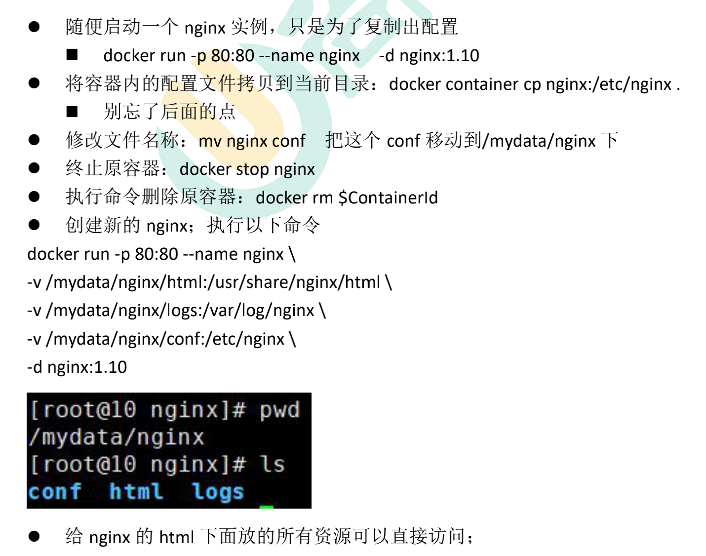

```sh

docker run -p 80:80 -p 443:443 --name nginx \
-v /mnt/e/backup/html:/usr/share/nginx/html \
-v /mydata/nginx/logs:/var/log/nginx \
-v /mydata/nginx/conf:/etc/nginx \
-d nginx


docker update nginx --restart=always

```



```

需求： 下载了极客时间的课程，每一套课程里面的每一课都有mp3、pdf、html三种文件，复制到服务器上的挂载的ntfs硬盘上了，
现在想要在mac电脑上访问这些html，最好是能够显示目录。

实现思路：使用ng作为文件服务器；

实现过程：
docker pull nginx
docker run -p 80:80 --name nginx -d nginx
docker container cp nginx:/etc/nginx /mydata/nginx/conf
mv /mydata/nginx/conf/nginx/* /mydata/nginx/conf
rm -rf /mydata/nginx/conf/nginx

docker stop nginx
docker rm nginx


下面一步很重要，把/mnt/e/backup/html映射出去
docker run -p 80:80 -p 443:443 --name nginx \
-v /mnt:/usr/share/nginx/html \
-v /mydata/nginx/logs:/var/log/nginx \
-v /mydata/nginx/conf:/etc/nginx \
-d nginx

docker update nginx --restart=always


再简单配置一下/mydata/nginx/conf/conf.d/default.conf

location / {
    root   /usr/share/nginx/html;
    autoindex on;  # 开启目录文件列表
}

测试，done！


```

```
docker pull fraoustin/fancyindex

docker run -p 80:80 --name fancyindex \
-v /mnt:/share \
-d fraoustin/fancyindex 

docker update fancyindex --restart=always

docker run -d -e "CONTAINER_TIMEZONE=Europe/Paris" \
-e WEBUSER=myuser" -e "WEBPASSWORD=mypassword" \
-v /mnt:/share --name fancyindex -p 8080:80 fraoustin/fancyindex 

-e WEBUSER=root -e WEBPASSWORD=root \
-e COLOR=blue \

```
