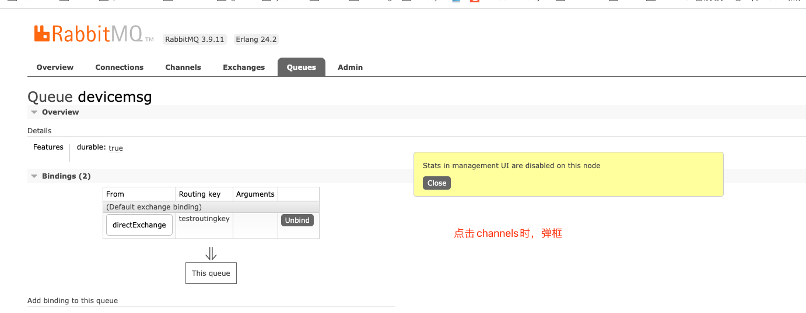

``` sh

docker search rabbitmq

docker pull rabbitmq

mkdir -p /mydata/rabbimq/

docker run -p 5672:5672 -p 15672:15672 --name rabbitmq \
-v /mydata/rabbitmq:/var/lib/rabbitmq \
-v /mydata/rabbitmq/logs:/var/log/rabbitmq \
-e RABBITMQ_DEFAULT_USER=admin \
-e RABBITMQ_DEFAULT_PASS=admin \
-e RABBITMQ_LOG_BASE=/var/log/rabbitmq \
-d rabbitmq

docker exec -it rabbitmq /bin/bash

rabbitmq-plugins enable rabbitmq_management

## 开机自启动
docker update rabbitmq --restart=always


```

