# AOP

1. 模拟传统开发过程，体会过程中遇到的困难；
2. 实现一个简易版的 Spring，只完成 Bean 的注册与获取；
3. 需求变更，要求为每一个接口都提供运行时间的统计功能：
   1. 通过自行编程的方式实现此需求，体会其中的弊端；
   2. 通过 JDK 代理技术实现此需求，并分析优缺点；
   3. 通过 CGLib 代理技术实现此需求，并分析优缺点；
4. 体会基于 Spring 实现上述需求的实现过程，并分析优缺点；

### 业务开发时碰到的程序扩展性问题

> 1. 兼顾开闭原则对 service 进行扩展；
> 2. 问题升级： 假设有多个实现类或实现类中有多个方法；
> 3. 问题再次升级： 假设提供给我们的是 jar 包，没办法直接操作源代码；

假设有这样一个场景，有一个 IService 接口，里面有三个方法，然后有三个具体的实现类： ServiceA 、 ServiceB 、 ServiceC ：

1. 如果想要在每一个方法中都添加上统计时间的业务代码，那么我们就需要修改三个具体实现类的每一个方法，这就不符合“开闭原则”；
2. 如果 IService 接口中有很多方法，并且也有很多的具体的实现类，想要实现统计代码耗时的功能，那代码的改动量会更大；
3. 如果上面的接口和具体的实现类均有第三方 jar 包的形式提供给我们，我们是无法修改源码的；
4. ……

基于上面的问题，我们可以采用继承的方式来解决，即让 ServiceLowA 继承 ServiceA ， ServiceLowB 继承 ServiceB ， ServiceLowC 继承 ServiceC ，然后重写每一个方法的时候添加上统计耗时的代码。这种方式依然不符合“开闭原则”。那我们应该采用那种方式呢？

答案是： 代理模式。

### 代理模式

> 1. 代理模式的含义、分类；
> 2. 静态代理模式分析： 原理、优缺点；
> 3. 动态代理模式分析： 原理、实现途径、优缺点、几种模式的对比
> 4. AOP 概念及原理、SpringAOP 与 AsceptJ 的区别；

#### 含义

代理模式（有些地方也称“委托模式”）是 GoF23 里面的一种，属于结构型模式。它的基本原理是： 提供一个代理类，让原本是对目标方法的直接调用，变成通过代理类的间接调用。从而达到代码的解耦，也有利于附加功能的统计集中管理。
它包括三个角色：

- 代理类（代理主题）
- 目标类（真实主题）
- 代理类和目标类的公共接口（抽象主题）

> 一般一个系统当中都会有一些系统服务，例如：日志、事务管理、安全等。这些系统服务被称为：交叉业务。

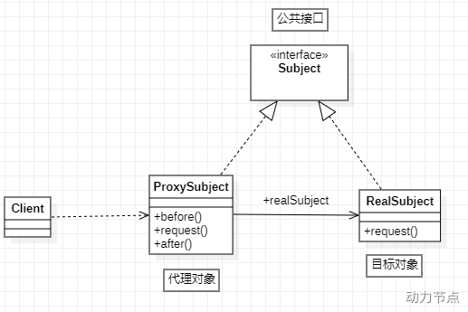

#### 分类

> 代理模式的目的在于构建一个代理类对象，但由于代理类对象构建的时机以及交由谁来负责构建代理类对象的不同，导致代理模式具体的实现方式也略微有所差异。——来自[这里](https://juejin.cn/post/6844903744954433544)

根据`代理对象的字节码的创建时机`来分类，可以分为静态代理和动态代理。

- `静态代理`就是在程序运行前就已经存在代理类的字节码文件，代理类和真实主题角色的关系在运行前就确定了；使用的实现技术是基于 jdk-api 的，所以需要程序员自行控制代理类的代码逻辑；
- `动态代理`的源码是在程序运行期间由 JVM 根据反射等机制动态的生成，所以在运行前并不存在代理类的字节码文件；使用一些框架技术，如反射包的 proxy、cglib 等，不需要程序员自行控制代理类的代码逻辑，只需要程序员关注目标对象及其功能即可。

  - JDK 动态代理
    - 实际上是利用了反射包下面的 proxy 和 InvocationHandler 接口，为我们的生成了一个叫$Proxy0（这个名字后面的 0 是编号，有多个代理类会一次递增）的代理类，这个类文件时放在内存中的，我们在创建代理对象时，就是通过反射获得这个类的构造方法，然后创建的代理实例，最后由这个代理实例来完成方法增强；
    - 过延迟代理关系或代理对象构造过程到运行期，解决了静态代理在扩展时需要同时修改目标类和代理类的扩展性问题，实现了进一步解耦的目的，但是 jdk 动态代理只能为接口创建代理，还是具有一定的局限性；
  - CGLib 动态代理
    - 是基于 CGLib 来完成的，CGLib 是一个强大、高性能的字节码生成库，它用于在运行时扩展 Java 类和实现接口；本质上它是通过动态的生成一个子类去覆盖所要代理的类（非 final 修饰的类和方法）。Enhancer 可能是 CGLIB 中最常用的一个类，和 jdk 中的 Proxy 不同的是，Enhancer 既能够代理普通的 class，也能够代理接口。Enhancer 创建一个被代理对象的子类并且拦截所有的方法调用（包括从 Object 中继承的 toString 和 hashCode 方法）
    - Enhancer 不能够拦截 final 方法，例如 Object.getClass()方法，这是由于 Java final 方法语义决定的。基于同样的道理，Enhancer 也不能对 final 类进行代理操作；由于 CGLib 是对字节码做了增强，因此其性能也比 JDK 动态代理高；

- AsceptJ 动态代理

::: tip Spring AOP 和 **AspectJ**

Spring AOP 属于运行时增强，主要具有如下特点：

1. 基于动态代理来实现，默认如果使用接口的，用 JDK 提供的动态代理实现，如果是方法则使用 CGLIB 实现
2. Spring AOP 需要依赖 IOC 容器来管理，并且只能作用于 Spring 容器，使用纯 Java 代码实现
3. 在性能上，由于 Spring AOP 是基于**动态代理**来实现的，在容器启动时需要生成代理实例，在方法调用上也会增加栈的深度，使得 Spring AOP 的性能不如 AspectJ 的那么好。
4. Spring AOP 致力于解决企业级开发中最普遍的 AOP(方法织入)。

AspectJ 是一个易用的功能强大的 AOP 框架，属于编译时增强， 可以单独使用，也可以整合到其它框架中，是 AOP 编程的完全解决方案。AspectJ 需要用到单独的编译器 ajc。
AspectJ 属于**静态织入**，通过修改代码来实现，在实际运行之前就完成了织入，所以说它生成的类是没有额外运行时开销的，一般有如下几个织入的时机：

1. 编译期织入（Compile-time weaving）：如类 A 使用 AspectJ 添加了一个属性，类 B 引用了它，这个场景就需要编译期的时候就进行织入，否则没法编译类 B。
2. 编译后织入（Post-compile weaving）：也就是已经生成了 .class 文件，或已经打成 jar 包了，这种情况我们需要增强处理的话，就要用到编译后织入。
3. 类加载后织入（Load-time weaving）：指的是在加载类的时候进行织入，要实现这个时期的织入，有几种常见的方法

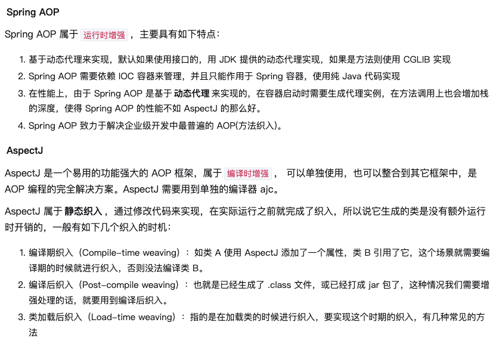

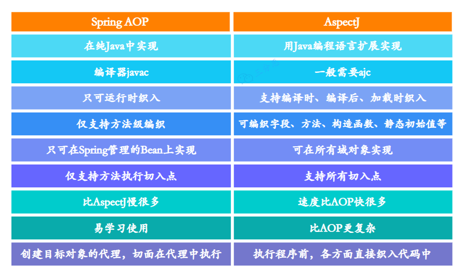

:::

### 静态代理

```java
// 实现过程：
//    1. 创建代理类，代理类实现共同接口，并在代理类中持有共同接口的一个代理对象；
//    2. 在代理类中的重写的方法中添加具体的交叉业务代码，完成代码的扩展；
//    3. 使用时，构造一个代理类对象，并传入一个实际的目标类的代理对象，然后再由共同的接口完成方法的调用；

// 创建IService的代理类
public class ServiceProxy implements IService {

    private IService target;  //目标对象，被代理的对象

    public ServiceProxy(IService target) {
        this.target = target;
    }
    @Override
    public void m1() {
        long starTime = System.nanoTime();
        this.target.m1();
        long endTime = System.nanoTime();
        System.out.println(this.target.getClass() + ".m1()方法耗时(纳秒):" + (endTime - starTime));
    }
    @Override
    public void m2() {
        long starTime = System.nanoTime();
        this.target.m1();
        long endTime = System.nanoTime();
        System.out.println(this.target.getClass() + ".m1()方法耗时(纳秒):" + (endTime - starTime));
    }
    @Override
    public void m3() {
        long starTime = System.nanoTime();
        this.target.m1();
        long endTime = System.nanoTime();
        System.out.println(this.target.getClass() + ".m1()方法耗时(纳秒):" + (endTime - starTime));
    }
}


@Test
public void serviceProxy() {
    IService serviceA = new ServiceProxy(new ServiceA()); // 创建目标对应的代理对象
    IService serviceB = new ServiceProxy(new ServiceB()); // 创建目标对应的代理对象

    // 由代理对象发起实际的调用
    serviceA.m1();
    serviceA.m2();
    serviceA.m3();
    serviceB.m1();
    serviceB.m2();
    serviceB.m3();
}

```

上面这种方式就是静态代理的实现方式。静态代理的方式实际上应用了“向上转型”的原理，即利用“向上转型”的原理。代理对象的类型和目标对象的类型是在编译期就已经确定了的，因为传入的是 ServiceA 和 ServiceB 的对象，并不是 IService 对象；

#### 不适合静态代理的

虽然静态代理实现简单，且不侵入原代码，但是，当场景稍微复杂一些的时候，静态代理的缺点也会暴露出来。

1. 当需要代理多个类的时候，由于代理对象要实现与目标对象一致的接口，有两种方式：
   - 只维护一个代理类，由这个代理类实现多个接口，但是这样就导致代理类过于庞大
   - 新建多个代理类，每个目标对象对应一个代理类，但是这样会产生过多的代理类
2. 当接口需要增加、删除、修改方法的时候，目标对象与代理类都要同时修改，不易维护。

#### 优缺点

- 优点： 实现简单，不侵入源代码，只需要依赖 JDK 即可完成；
- 缺点： 在进行扩展时，需要目标对象和代理对象同时进行修改，具有一定的耦合性；也就是说相比于动态代理，静态代理还是要程序员自行控制代理类代码的编写。

### 动态代理

Java 动态代理机制的出现，使得 Java 开发人员不用手工编写代理类，只要简单地指定一组接口及委托类对象，便能动态地获得代理类。代理类会负责将所有的方法调用分派到委托对象上反射执行，在分派执行的过程中，开发人员还可以按需调整委托类对象及其功能，这是一套非常灵活有弹性的代理框架。Java 动态代理实际上通过反射技术，把代理对象和被代理对象(真实对象)的代理关系建立延迟到程序运行之后，动态创建新的代理类去完成对真实对象的代理操作(可以改变原来真实对象的方法行为)，这一点成为了当前主流的 AOP 框架和延迟加载功能的基础。 ———— 引自[这里](https://www.throwx.cn/2018/12/08/java-reflection-dynamic-proxy/)

动态代理主要分为两类： JDK 动态代理 和 CGLib 动态代理。

#### JDK 动态代理

1. 代码示例

   ```java
   // 需求： 实现上面添加代码耗时的功能
   // 实现过程：
   //    1. 创建调用处理器，并实现 java.lang.reflect.InvocationHandler 接口，之后在 invoke() 方法中添加具体的交叉业务逻辑；
   //    2. 使用时，使用 java.lang.reflect.Proxy#newProxyInstance() 静态方法构造一个代理对象【需要传入三个参数：目标对象、目标方法以及以目标方法的参数】；
   //    3. 最后由代理对象发起方法的实际调用
   public class CostTimeInvocationHandler implements InvocationHandler {
       private Object target;
       public CostTimeInvocationHandler(Object target) {
           this.target = target;
       }

       /**
       * proxy： 代理对象
       * method： 代理对象需要实现的方法，即其中需要重写的方法
       * args： method所对应方法的参数
       */
       @Override
       public Object invoke(Object proxy, Method method, Object[] args) throws Throwable {
           long starTime = System.nanoTime();

           // 调用目标对象的方法
           Object result = method.invoke(this.target, args);

           long endTime = System.nanoTime();
           System.out.println(this.target.getClass() + ".m1()方法耗时(纳秒):" + (endTime - starTime));
           return result;
       }
   }


   @Test
   public void serviceProxy() {
       IService serviceA = new ServiceA();
       IService serviceAProxy = (IService) Proxy.newProxyInstance(
           serviceA.getClass().getClassLoader(),
           serviceA.getClass().getInterfaces(),
           new CostTimeInvocationHandler(serviceA));

       serviceA.m1();
       serviceA.m2();
       serviceA.m3();

       IService serviceB = new ServiceB();
       IService serviceBProxy = (IService) Proxy.newProxyInstance(
           serviceB.getClass().getClassLoader(),
           serviceB.getClass().getInterfaces(),
           new CostTimeInvocationHandler(serviceB));
       serviceB.m1();
       serviceB.m2();
       serviceB.m3();
   }

   ```

2. 原理解析

   - [ ] TODO： 源码阅读

   jdk 为我们的生成了一个叫$Proxy0（这个名字后面的 0 是编号，有多个代理类会一次递增）的代理类，这个类文件时放在内存中的，我们在创建代理对象时，就是通过反射获得这个类的构造方法，然后创建的代理实例。

   我们可以对 InvocationHandler 看做一个中介类，中介类持有一个被代理对象，在 invoke 方法中调用了被代理对象的相应方法。通过聚合方式持有被代理对象的引用，把外部对 invoke 的调用最终都转为对被代理对象的调用。

   代理类调用自己方法时，通过自身持有的中介类对象来调用中介类对象的 invoke 方法，从而达到代理执行被代理对象的方法。也就是说，动态代理通过中介类实现了具体的代理功能。

   【在运行时构建一个 class 字节码数组，并将其转换成一个运行时的 Class 对象，然后构造其实例】

3. 优缺点

   动态代理的优势在于可以很方便的对代理类的函数进行统一的处理，而不用修改每个代理类中的方法。

   缺点： 代理对象和被代理对象的关系不像静态代理那样一目了然，清晰明了。

   只能代理接口，不能代理类。

4. 静态代理与 jdk 动态代理

   静态代理关键是需要程序员自己构建代理类，这样就会导致代理类的膨胀，还是有一定的耦合性，动态代理就解决了这个问题，它是利用 jdk 反射包里面的 proxy 类和 invocation 接口等，相当于 jdk 提供了一个代理模式的实现框架，让我们不用关注代理类的构建过程，只需要关注需要实现的额外的功能。

#### CGLib 动态代理

1. 什么是 CGLib

   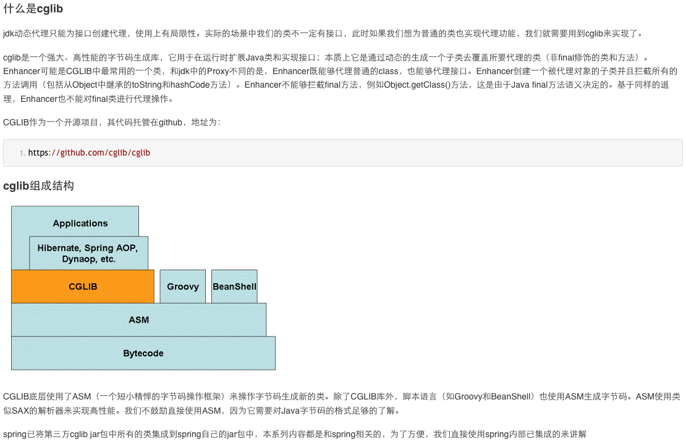

   cglib 弥补了 jdk 动态代理的不足，jdk 动态代理只能为接口创建代理，而 cglib 非常强大，不管是接口还是类，都可以使用 cglib 来创建代理

   cglib 创建代理的过程，相当于创建了一个新的类，可以通过 cglib 来配置这个新的类需要实现的接口，以及需要继承的父类

   cglib 可以为类创建代理，但是这个类不能是 final 类型的，cglib 为类创建代理的过程，实际上为通过继承来实现的，相当于给需要被代理的类创建了一个子类，然后会重写父类中的方法，来进行增强，继承的特性大家应该都知道，final 修饰的类是不能被继承的，final 修饰的方法不能被重写，static 修饰的方法也不能被重写，private 修饰的方法也不能被子类重写，而其他类型的方法都可以被子类重写，被重写的这些方法可以通过 cglib 进行拦截增强

   使用 CGLib 的方式有两种，一种是直接引入相关的 jar 或者坐标，另一种是结合 Spring 使用，org.springframework.cglib。

   使用方法：

   实现 MethodInterceptor 接口，在 intercept 方法中实现代理内容（如日志输出）

   使用 Enhancer 及委托类生成代理类

   使用代理类执行函数，就会动态调用 intercept 方法的实现

2. 代码示例

   ```java
   // 示例一
   <!-- https://mvnrepository.com/artifact/cglib/cglib -->
   <dependency>
       <groupId>cglib</groupId>
       <artifactId>cglib</artifactId>
       <version>3.2.12</version>
   </dependency>


   /**
    * 日志动态代理：cglib实现
    **/
   publicclass CglibLogProxyInterceptor implements MethodInterceptor {
       @Override
       public Object intercept(Object object, Method method, Object[] args, MethodProxy methodProxy) throws Throwable {
           System.out.println(" cglib dynamic proxy log begin ");
           Object result = methodProxy.invokeSuper(object, args);
           System.out.println(" cglib dynamic proxy log begin ");
           return result;
       }

       /**
        * 动态创建代理
        *
        * @param cls 委托类
        * @return
        */
       publicstatic <T> T createProxy(Class<T> cls) {
           Enhancer enhancer = new Enhancer();
           enhancer.setSuperclass(cls);
           enhancer.setCallback(new CglibLogProxyInterceptor());
           return (T) enhancer.create();
       }
   }

   @Test
   void testLogProxy() {
       CglibService proxy = CglibLogProxyInterceptor.createProxy(CglibService.class);
       proxy.doAction1();
       System.out.println("############");
       proxy.doAction2();
   }

   ```

   ```java
   // 示例二
   public class MyProxyByGclib implements MethodInterceptor {

       //维护目标对象
       private Object target;


       public MyProxyByGclib(Object target) {
           this.target = target;
       }

       public Object getProxyInstance() {
           //1. 实例化工具类
           Enhancer en = new Enhancer();
           //2. 设置父类对象
           en.setSuperclass(this.target.getClass());
           //3. 设置回调函数
           en.setCallback(this);
           //4. 创建子类，也就是代理对象
           return en.create();
       }

       @Override
       public Object intercept(Object arg0, Method method, Object[] objects, MethodProxy arg3) throws Throwable {
           System.out.println("Begin Transaction");
           //执行目标对象的方法
           Object returnValue = method.invoke(target, objects);
           System.out.println("End Transaction");
           return returnValue;
       }

       public static void main(String[] args) {
           //目标对象
           MyServiceImpl myService = new MyServiceImpl();
           //生成代理对象
           MyServiceImpl myProxy = (MyServiceImpl)new MyProxyByGclib(myService).getProxyInstance();
           //调用对象方法
           myProxy.eat();
           myProxy.sleep();
       }

   }

   ```

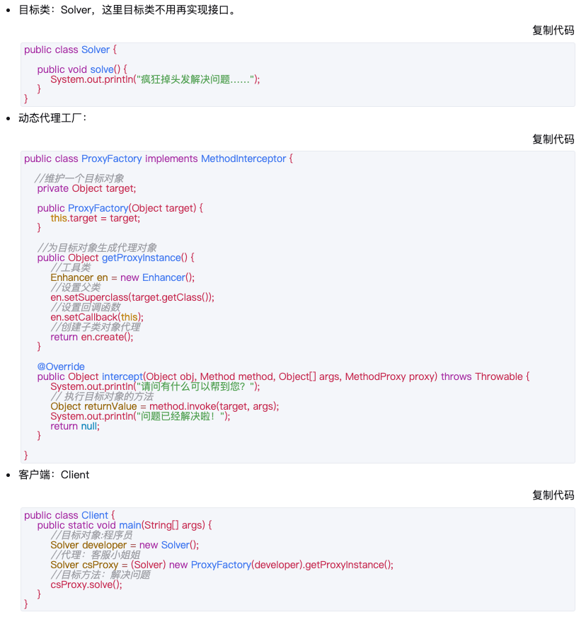

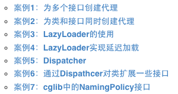

CGLib 动态代理使用注意事项：
cglib 弥补了 jdk 动态代理的不足，jdk 动态代理只能为接口创建代理，而 cglib 非常强大，不管是接口还是类，都可以使用 cglib 来创建代理
cglib 创建代理的过程，相当于创建了一个新的类，可以通过 cglib 来配置这个新的类需要实现的接口，以及需要继承的父类
cglib 可以为类创建代理，但是这个类不能是 final 类型的，cglib 为类创建代理的过程，实际上为通过继承来实现的，相当于给需要被代理的类创建了一个子类，然后会重写父类中的方法，来进行增强，继承的特性大家应该都知道，final 修饰的类是不能被继承的，final 修饰的方法不能被重写，static 修饰的方法也不能被重写，private 修饰的方法也不能被子类重写，而其他类型的方法都可以被子类重写，被重写的这些方法可以通过 cglib 进行拦截增强

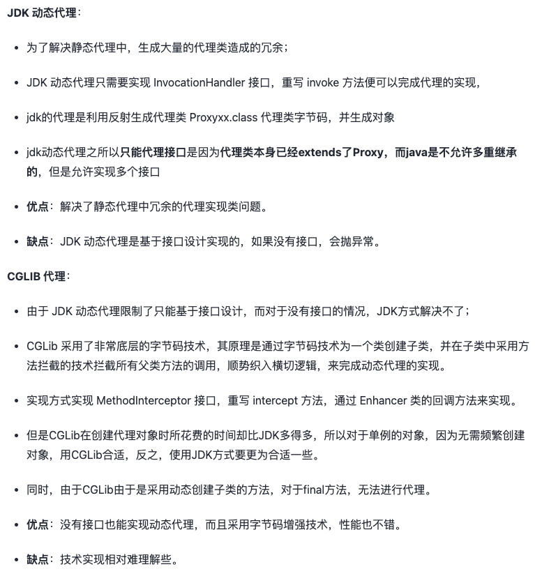

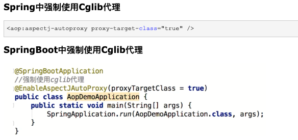

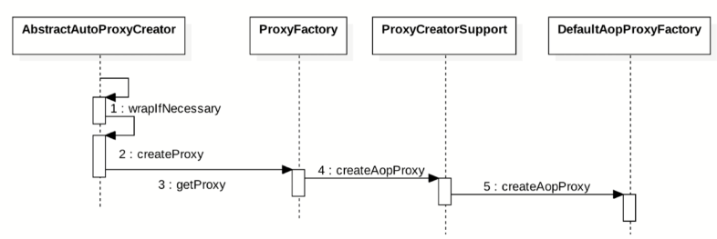

如果加入容器的目标对象有实现接口,用 JDK 代理
如果目标对象没有实现接口,用 Cglib 代理
如果目标对象实现了接口，且强制使用 cglib 代理，则会使用 cglib 代理

AOP 是指面向切面编程，是计算机科学中的一种程序设计思想，旨在将`交叉切入关注点`与作为业务主体的`核心关注点`进行分离，以提高程序代码的模块化程度。通过在现有代码基础上增加额外的通告（Advice）机制，能够对被声明为“点切入”（Pointcut）的代码块进行统一管理与装饰，比如说：“对所有方法名以 set\*开头的方法添加后台日志”。该思想使得开发人员能够将与代码核心业务逻辑关系不那么密切的功能（如日志功能）添加至程序中，同时又不降低业务代码的可读性。

它有以下几个概念：

- 连接点 Joinpoint： 在程序的整个执行流程中，可以织入切面的位置。方法的执行前后，异常抛出之后等位置。
- 切点 Pointcut： 在程序执行流程中，真正织入切面的方法。（一个切点对应多个连接点）
- 通知 Advice： 通知又叫增强，就是具体你要织入的代码。
  - 分类：
    - 前置通知：@Before 目标方法执行之前的通知
    - 后置通知：@AfterReturning 目标方法执行之后的通知
    - 环绕通知：@Around 目标方法之前添加通知，同时目标方法执行之后添加通知。
    - 异常通知：@AfterThrowing 发生异常之后执行的通知
    - 最终通知：@After 放在 finally 语句块中的通知
  - 执行顺序：
    - Spring 版本 5.3.x 以前： 前置通知 > 目标操作 > 后置通知 > 返回通知或异常通知
    - Spring 版本 5.3.x 以后： 前置通知 > 目标操作 > 返回通知或异常通知 > 后置通知
- 切面 Aspect ： 切点 + 通知就是切面。
- 织入 Weaving： 把通知应用到目标对象上的过程。
- 代理对象 Proxy： 一个目标对象被织入通知后产生的新对象。
- 目标对象 Target： 被织入通知的对象。

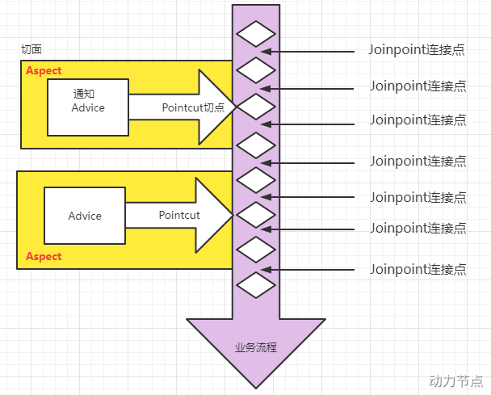

- 用\*号代替“权限修饰符”和“返回值”部分表示“权限修饰符”和“返回值”不限
- 在包名的部分，一个“\*”号只能代表包的层次结构中的一层，表示这一层是任意的。
  - 例如：\*.Hello 匹配 com.Hello，不匹配 com.atguigu.Hello
- 在包名的部分，使用“\*..”表示包名任意、包的层次深度任意
- 在类名的部分，类名部分整体用\*号代替，表示类名任意
- 在类名的部分，可以使用\*号代替类名的一部分
  - 例如：\*Service 匹配所有名称以 Service 结尾的类或接口
- 在方法名部分，可以使用\*号表示方法名任意
- 在方法名部分，可以使用\*号代替方法名的一部分
  - 例如：\*Operation 匹配所有方法名以 Operation 结尾的方法
- 在方法参数列表部分，使用(..)表示参数列表任意
- 在方法参数列表部分，使用(int,..)表示参数列表以一个 int 类型的参数开头
- 在方法参数列表部分，基本数据类型和对应的包装类型是不一样的
  - 切入点表达式中使用 int 和实际方法中 Integer 是不匹配的
- 在方法返回值部分，如果想要明确指定一个返回值类型，那么必须同时写明权限修饰符
  - 例如：execution(public int ..Service._(.., int)) 正确例如：execution(_ int ..Service.\*(.., int)) 错误

```log
连接点表示方法的调用过程，内部包含了方法调用过程中的所有信息，比如被调用的方法、目标、代理对象、执行拦截器链等信息。

上面定义都是一些接口，最终有2个实现。

ReflectiveMethodInvocation
当代理对象是采用jdk动态代理创建的，通过代理对象来访问目标对象的方法的时，最终过程是由ReflectiveMethodInvocation来处理的，内部会通过递归调用方法拦截器，最终会调用到目标方法。

CglibMethodInvocation
功能和上面的类似，当代理对象是采用cglib创建的，通过代理对象来访问目标对象的方法的时，最终过程是由CglibMethodInvocation来处理的，内部会通过递归调用方法拦截器，最终会调用到目标方法。

```

#### AsceptJ 动态代理

1. 使用示例

   ```java
   <dependency>
   <groupId>org.springframework.boot</groupId>
   <artifactId>spring-boot-starter-aop</artifactId>
   </dependency>


   @Retention(RetentionPolicy.RUNTIME)
   @Target({ElementType.METHOD})
   @Documented
   public @interface WebLog {
   }

   @Aspect
   @Component
   public class WebLogAspect {

       private final static Logger logger         = LoggerFactory.getLogger(WebLogAspect.class);

       /**
        * 以自定义 @WebLog 注解为切点， 这里事实上是做了简化的，原来的应该是在下面的 doBefore() 方法上添加
        *    @Before("@annotation(cn.fighter3.spring.aop_demo.WebLog)") 注解的，但是考虑到每个通知上都需要这样写，
        *    因此，干脆把这个 切点表达式 标记成一个方法webLog()，下面的每一个通知只需要写成 webLog() 方法即可。
        **/
       @Pointcut("@annotation(cn.fighter3.spring.aop_demo.WebLog)")
       public void webLog() {}

       /**
        * 在切点之前织入
        */
       @Before("webLog()")
       public void doBefore(JoinPoint joinPoint) throws Throwable {
           // 开始打印请求日志
           ServletRequestAttributes attributes = (ServletRequestAttributes) RequestContextHolder.getRequestAttributes();
           HttpServletRequest request = attributes.getRequest();
           // 打印请求相关参数
           logger.info("========================================== Start ==========================================");
           // 打印请求 url
           logger.info("URL            : {}", request.getRequestURL().toString());
           // 打印 Http method
           logger.info("HTTP Method    : {}", request.getMethod());
           // 打印调用 controller 的全路径以及执行方法
           logger.info("Class Method   : {}.{}", joinPoint.getSignature().getDeclaringTypeName(), joinPoint.getSignature().getName());
           // 打印请求的 IP
           logger.info("IP             : {}", request.getRemoteAddr());
           // 打印请求入参
           logger.info("Request Args   : {}",new ObjectMapper().writeValueAsString(joinPoint.getArgs()));
       }

       /**
        * 在切点之后织入
        * @throws Throwable
        */
       @After("webLog()")
       public void doAfter() throws Throwable {
           // 结束后打个分隔线，方便查看
           logger.info("=========================================== End ===========================================");
       }

       /**
        * 环绕
        */
       @Around("webLog()")
       public Object doAround(ProceedingJoinPoint proceedingJoinPoint) throws Throwable {
           //开始时间
           long startTime = System.currentTimeMillis();
           Object result = proceedingJoinPoint.proceed();
           // 打印出参
           logger.info("Response Args  : {}", new ObjectMapper().writeValueAsString(result));
           // 执行耗时
           logger.info("Time-Consuming : {} ms", System.currentTimeMillis() - startTime);
           return result;
       }

   }


   @GetMapping("/hello")
   @WebLog(desc = "这是一个欢迎接口")
   public String hello(String name){
   return "Hello "+name;
   }

   ```

- 相同目标方法上同时存在多个切面时，切面的优先级控制切面的内外嵌套顺序。
  - 优先级高的切面：外面
  - 优先级低的切面：里面
- 使用@Order 注解可以控制切面的优先级：
  - @Order(较小的数)：优先级高
  - @Order(较大的数)：优先级低

### 应用

> 1. 应用的思路： 一个是为了给某类行为添加共同逻辑，一个是利用代理机制主动执行某些行为；
> 2. Spring 中由 AOP 实现的功能有哪些
> 3. 实际业务开发过程中使用 AOP 的业务场景

```log
记录跟踪：对函数执行前后统一输出日志跟踪执行情况
计时：统一对函数执行用时进行计算（前后时间记录之差）
权限校验：统一在函数执行前进行权限校验
事务：统一对函数作为事务处理
异常处理：对某一类函数执行输出的异常进行统一捕获处理
动态切换数据源：多数据源切换或动态添加数据源

```

### 总结

1. 代码程序的扩展性问题
2. 代理模式是 GoF23 里面的一种，属于结构性设计模式；旨在通过构建一个代理对象来完成对目标对象的增强，目的就是为了解耦；主要有三个角色的类： 代理类、目标类和公共类
3. 我们知道 Java 程序的运行过程可大概分为编译期和运行期，因此根据代理类的构建时机来划分，把代理模式划分为两种： 静态代理和动态代理；
4. 静态代理： 在编译期即可生成代理类的字节码文件；基于 JDK API 来实现，对原有代码的侵入性小、实现过程简单，但扩展时需要同时修改目标类和代理类，具有一定的耦合性；
5. 动态代理： 运行期动态确定代理类；多是基于框架来实现，如 jdk 反射包下的 proxy 框架、第三方的 CGLib、JavaAssist 等，动态代理的优势在于把代理关系或代理对象延迟到运行期；
6. JDK 动态代理模式，这种方式实际上是利用了反射包下面的 proxy 和 InvocationHandler 接口，为我们的生成了一个叫$Proxy0（这个名字后面的 0 是编号，有多个代理类会一次递增）的代理类，这个类文件时放在内存中的，我们在创建代理对象时，就是通过反射获得这个类的构造方法，然后创建的代理实例，最后由这个代理实例来完成方法增强；JDK 动态代理通过延迟代理关系或代理对象构造过程到运行期，解决了静态代理在扩展时需要同时修改目标类和代理类的扩展性问题，实现了进一步解耦的目的，但是 jdk 动态代理只能为接口创建代理，还是具有一定的局限性；
7. CGLib 动态代理模式，是基于 CGLib 来完成的，CGLib 是一个强大、高性能的字节码生成库，它用于在运行时扩展 Java 类和实现接口；本质上它是通过动态的生成一个子类去覆盖所要代理的类（非 final 修饰的类和方法）。Enhancer 可能是 CGLIB 中最常用的一个类，和 jdk 中的 Proxy 不同的是，Enhancer 既能够代理普通的 class，也能够代理接口。Enhancer 创建一个被代理对象的子类并且拦截所有的方法调用（包括从 Object 中继承的 toString 和 hashCode 方法）。Enhancer 不能够拦截 final 方法，例如 Object.getClass()方法，这是由于 Java final 方法语义决定的。基于同样的道理，Enhancer 也不能对 final 类进行代理操作；由于 CGLib 是对字节码做了增强，因此其性能也比 JDK 动态代理高；
8. 代理模式逐渐演化出 AOP，即面向切面编程的设计思想；AOP 包括很多概念，如连接点、切入点、通知（或称增强）、切面等；
9. Spring 框架中除支持 JDK 动态代理模式、CGLib 动态代理模式外，还支持 AspectJ 代理模式；其中 JDK 动态代理模式、CGLib 动态代理模式是 Spring AOP 支持的，而 AspectJ 代理模式是 Spring 框架中 AspectJ 包所支持的；
10. Spring AOP 代理模式 与 AspectJ 代理模式 的区别如下： 【重要区别： 一个是为了给某类行为添加共同逻辑，一个是利用代理机制执行某些行为】
11. Spring 中的哪些功能是基于 AOP 来完成的：事务、异步、缓存等；
12. 应用 AOP 的实际业务场景有哪些： 日志、权限校验、执行时间统计、异常处理、动态数据源切换等；

- 动态代理分为 JDK 动态代理和 cglib 动态代理
- 当目标类有接口的情况使用 JDK 动态代理和 cglib 动态代理，没有接口时只能使用 cglib 动态代理
- JDK 动态代理动态生成的代理类会在 com.sun.proxy 包下，类名为$proxy1，和目标类实现相同的接口
- cglib 动态代理动态生成的代理类会和目标在在相同的包下，会继承目标类
- 动态代理（InvocationHandler）：JDK 原生的实现方式，需要被代理的目标类必须实现接口。因为这个技术要求**代理对象和目标对象实现同样的接口**（兄弟两个拜把子模式）。
- cglib：通过**继承被代理的目标类**（认干爹模式）实现代理，所以不需要目标类实现接口。
- AspectJ：是 AOP 思想的一种实现。本质上是静态代理，**将代理逻辑“织入”被代理的目标类编译得到的字节码文件**，所以最终效果是动态的。weaver 就是织入器。Spring 只是借用了 AspectJ 中的注解。

::: tip 向上转型、向下转型

- 向上转型

向上转型： 类似于 Pet myPet = new Dog(); mypet.speech(); 的方式，就是向上转型，特点是父类对象持有子类对象的引用，即属于父类对象的 myPet 持有子类 Dog 的一个引用。这种方式属于“动态链接”的方式，即被调用的方法类型，在编译期无法确定，只能在运行期才能被确定下来，如编译期并不能确定 mypet 调用的 speech() 方法到底是 Pet 类中的方法还是 Dog 类中的方法，只能等到运行期时才能确定下来是 Dog 类中方法；

```java
Pet[] pets = new Pet[2];
pets[0] = new Dog();//多态引用
pets[0].setNickname("小白");

pets[1] = new Cat();//多态引用
pets[1].setNickname("雪球");

for (int i = 0; i < pets.length; i++) {
    pets[i].eat();

    if(pets[i] instanceof Dog){
        Dog dog = (Dog) pets[i];
        dog.watchHouse();
    }else if(pets[i] instanceof Cat){
        Cat cat = (Cat) pets[i];
        cat.catchMouse();
    }
}

```

- 向下转型

  类似于 Dog dog = (Dog) pets[i]; dog.watchHouse(); 的方式，就是向下转型， pets 本身属于 Pet 类，但是子类的对象持有了一个父类对象的引用。这种方式也属于“动态链接”的方式。

- 总结
  - 向上转型： 父类 父类对象 = new 子类 ，编译期处理的类型是 父类 的类型，运行期是 子类 的类型，因此编译期不能调用 独属于 子类的方法和变量，这个过程是 JVM 自动完成的；
  - 向下转型： 子类 子类对象 = new 父类 ，编译期处理的类型是 子类 的类型，此时当然可以调用 独属于 子类的方法了，运行期仍然是 父类 的类型。但由于并不是所有的向下转型都是正确的，因此在向下转型的时候有可能会抛出 ClassCastException 异常，因此需要使用 instanceof 来判断“是否属于子类类型” 。
  - `静态链接（或早起绑定）`：当一个字节码文件被装载进 JVM 内部时，如果被调用的目标方法在编译期可知，且运行期保持不变时。这种情况下将调用方法的符号引用转换为直接引用的过程称之为静态链接。那么调用这样的方法，就称为非虚方法调用。比如调用静态方法、私有方法、final 方法、父类构造器、本类重载构造器等。
  - `动态链接（或晚期绑定）`：如果被调用的方法在编译期无法被确定下来，也就是说，只能够在程序运行期将调用方法的符号引用转换为直接引用，由于这种引用转换过程具备动态性，因此也就被称之为动态链接。调用这样的方法，就称为虚方法调用。比如调用重写的方法（针对父类）、实现的方法（针对接口）。

:::

### Spring 中 AOP 的相关概念

1. 面向切面编程，是一种软件设计思想，是面向对象编程的一种补充和完善；
2. 它通过预编译方式和运行期动态代理方式实现，在不修改源代码的情况下，给程序动态地统一添加额外功能；
3. 利用 AOP 可以对业务逻辑的各个部分进行隔离，从而使得业务逻辑各部分之间的耦合度降低，提高程序的可重用性，同时提高了开发的效率；

#### 切面（Aspect）

通知（Advice）和切入点（Pointcut）的组合。切面来定义在哪些地方（Pointcut）执行什么操作（Advice）。

相同目标方法上同时存在多个切面时，切面的优先级控制切面的**内外嵌套**顺序。

- 优先级高的切面：外面
- 优先级低的切面：里面

使用@Order 注解可以控制切面的优先级：

- @Order(较小的数)：优先级高
- @Order(较大的数)：优先级低

#### 目标对象(target)

目标对象指将要被增强的对象，即包含主业务逻辑的类对象。

#### 代理对象(Proxy)

AOP 中会通过代理的方式，对目标对象生成一个代理对象，代理对象中会加入需要增强功能，通过代理对象来间接的方式目标对象，起到增强目标对象的效果。

#### 连接点(JoinPoint)

连接点，程序运行的某一个点，比如执行某个方法，在 Spring AOP 中 Join Point 总是表示一个方法的执行
**通俗点理解：连接点表示方法的调用过程，内部包含了方法调用过程中的所有信息，比如被调用的方法、目标、代理对象、执行拦截器链等信息。**

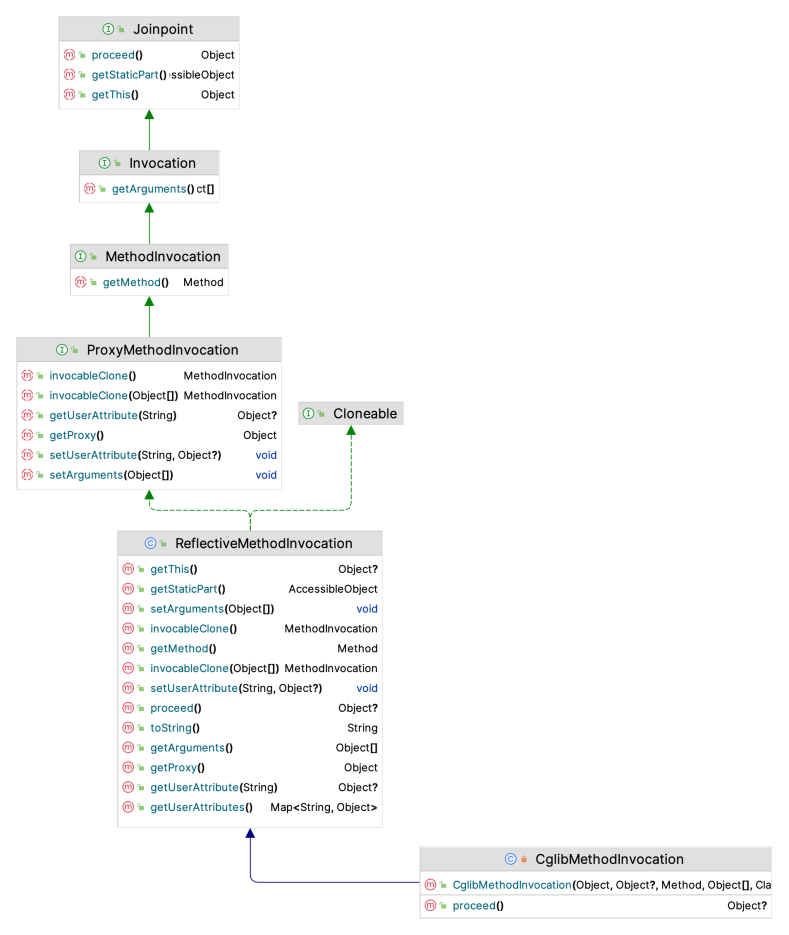

上面定义都是一些接口，最终有 2 个实现。

#### ReflectiveMethodInvocation

当代理对象是采用 jdk 动态代理创建的，通过代理对象来访问目标对象的方法的时，最终过程是由 ReflectiveMethodInvocation 来处理的，内部会通过递归调用方法拦截器，最终会调用到目标方法。

#### CglibMethodInvocation

功能和上面的类似，当代理对象是采用 cglib 创建的，通过代理对象来访问目标对象的方法的时，最终过程是由 CglibMethodInvocation 来处理的，内部会通过递归调用方法拦截器，最终会调用到目标方法。

### 通知(Advice)

需要在目标对象中增强的功能，如上面说的：业务方法前验证用户的功能、方法执行之后打印方法的执行日志。
通知中有 2 个重要的信息**： 方法的什么地方**，**执行什么操作**，这 2 个信息通过通知来指定。
方法的什么地方？之前、之后、包裹目标方法、方法抛出异常后等。
如：
在方法执行之前验证用户是否有效。
在方法执行之后，打印方法的执行耗时。
在方法抛出异常后，记录异常信息发送到 mq。

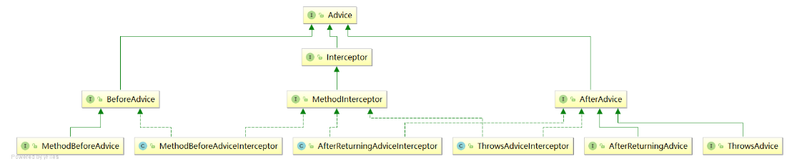

#### 通知包装器

**Aop 中所有的 Advice 最终都会转换为 MethodInterceptor 类型的，组成一个方法调用链，然后执行。**

**负责将各种非 MethodInterceptor 类型的通知(Advice)包装为 MethodInterceptor 类型。**

#### MethodBeforeAdviceInterceptor 类

这个类实现了 MethodInterceptor 接口，负责将 MethodBeforeAdvice 方法前置通知包装为 MethodInterceptor 类型，创建这个类型的对象的时候需要传递一个 MethodBeforeAdvice 类型的参数，重点是 invoke 方法

#### AfterReturningAdviceInterceptor 类

这个类实现了 MethodInterceptor 接口，负责将 AfterReturningAdvice 方法后置通知包装为 MethodInterceptor 类型，创建这个类型的对象的时候需要传递一个 AfterReturningAdvice 类型的参数，重点是 invoke 方法

#### ThrowsAdviceInterceptor 类

这个类实现了 MethodInterceptor 接口，负责将 ThrowsAdvice 异常通知包装为 MethodInterceptor 类型，创建这个类型的对象的时候需要传递一个 Object 类型的参数，通常这个参数是 ThrowsAdvice 类型的，重点是 invoke 方法

各种通知的执行顺序：

- Spring 版本 5.3.x 以前：
  - 前置通知
  - 目标操作
  - 后置通知
  - 返回通知或异常通知
- Spring 版本 5.3.x 以后：
  - 前置通知
  - 目标操作
  - 返回通知或异常通知
  - 后置通知

### 切入点(Pointcut )

用来指定需要将通知使用到哪些地方，比如需要用在哪些类的哪些方法上，切入点就是做这个配置的。

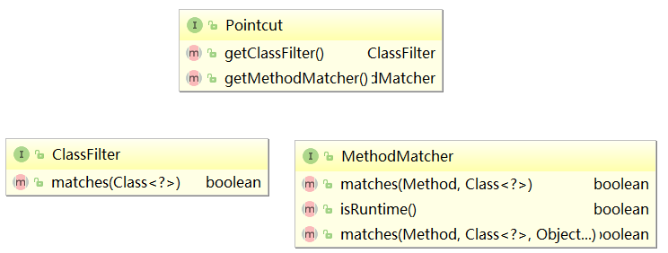

> 连接点 和 切入点的区别
>
> 1. 切入点告诉 Spring 框架，增强代码逻辑入口位置；就是面向切面编程时，增强代码插入核心业务代码的位置，这个位置只是把增强代码和核心业务代码联系起来，而我们很自然的想到，想要把我们的增强代码插入到核心代码中，就需要知道插入的位置，而插入的位置就是哪些类的哪些方法；
> 2. 连接点告诉 Spring 框架，增强代码具体执行的位置；面向切面编程时，我们可能想要在一个方法执行前后执行某些增强代码，但是有时候需要在方法内部执行某些操作，比如在传入参数是 XX 时执行增强业务、执行到方法名为 XX 时执行增强业务等，此时就需要知道方法的一些属性，如方法的参数、方法名、方法的代理对象等，因此在 JoinPoint 接口的两个重要实现类中均实现了获取方法的参数、方法名、方法的代理对象的相关方法；

### 顾问（Advisor)

Advisor 其实它就是 Pointcut 与 Advice 的组合，Advice 是要增强的逻辑，而增强的逻辑要在什么地方执行是通过 Pointcut 来指定的，所以 Advice 必需与 Pointcut 组合在一起，这就诞生了 Advisor 这个类，spring Aop 中提供了一个 Advisor 接口将 Pointcut 与 Advice 的组合起来。
Advisor 有好几个称呼：顾问、通知器。
其中这 4 个：连接点(JoinPoint)、通知(advise)、切入点(pointcut)、顾问（advisor)，在 spring 中都定义了接口和类来表示这些对象，下面我们一个个来看一下。

通知定义了需要做什么，切入点定义了在哪些类的哪些方法中执行通知，那么需要将他们 2 个组合起来才有效啊。
顾问（Advisor）就是做这个事情的。
在 spring aop 中，你可以将 advisor 理解为切面，切面中通常有 2 个关键信息：

1. 需要增强的目标方法列表，这个通过切入点(Pointcut)来指定
2. 需要在目标方法中增强的逻辑，这个通过(Advice)通知来指定

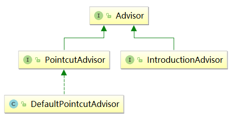

#### DefaultPointcutAdvisor 类

PointcutAdvisor 的默认实现，这是最常用的 Advisor 实现，它可以用于任何 Pointcut 和 Advice 类型，代码相当简单，里面定义了 2 个属性：pointcut 和 advisor，由使用者指定。

#### IntroductionAdvisor 接口

这个接口，估计大家比较陌生，干什么的呢？
**一个 Java 类，没有实现 A 接口，在不修改 Java 类的情况下，使其具备 A 接口的功能。可以通过 IntroductionAdvisor 给目标类引入更多接口的功能，这个功能是不是非常牛逼。**

**我们知道 Spring AOP 的原理是**： 主要就是使用 jdk 动态代理和 cglib 代理来创建代理对象，通过代理对象来访问目标对象，而代理对象中融入了增强的代码，最终起到对目标对象增强的效果。
所以，我们把 SpringAOP 的使用就可以分为两个步骤：

1. 由代理逻辑生成代理对象，也就是 Spring 框架帮我们生成代理对象；
2. 我们调用目标对象的逻辑转化为调用代理对象的逻辑，实现增强的效果；

第一步骤中，Spring 框架帮我们生成代理对象，就涉及到对 Spring 框架生成对象的这个过程进行一些配置，【把 Spring 帮我们生成代理对象 的过程看作一个组件，那么必然有其可配置的相关行为、属性等】。

#### 配置 Spring 框架中的代理生成逻辑

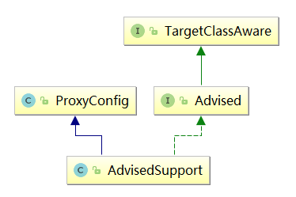

1. TargetClassAware 接口

   比较简单的一个接口，定义了一个方法，用来获取目标对象类型。
   所谓目标对象：就是被代理对象，

2. ProxyConfig 类

   这个类比较关键了，代理配置类，内部包含了创建代理时需要配置的各种参数。

3. Advised 接口

   这个接口中定义了操作 Aop 代理配置的各种方法（比如指定被代理的目标对象、添加通知、添加顾问等等）。
   所有由 spring aop 创建的代理对象默认都会实现这个接口。

4. AdvisedSupport 类

   这个类是个重点，AOP 代理配置管理器的基类，继承了 ProxyConfig 并且实现了 Advised 接口，创建 aop 代理之前，所有需要配置的信息都是通过这个类来操作的。
   比如：设置是否为目标类创建代理、设置目标对象、配置通知列表等等。

   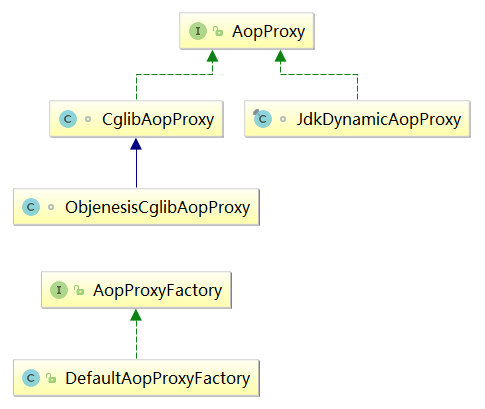

5. AopProxyFactory 接口

   通过名称就可以看出来，是一个工厂，负责创建 AopProxy，使用的是简单工厂模式。
   接口中定义了一个方法，会根据 Aop 的配置信息 AdvisedSupport 来获取 AopProxy 对象，主要是判断采用 cglib 的方式还是采用 jdk 动态代理的方式。

6. DefaultAopProxyFactory 类

   AopProxyFactory 接口的默认实现，

7. AopProxy 接口

   这个接口定义了一个方法，用来创建最终的代理对象，这个接口有 2 个实现类

   - CglibAopProxy：采用 cglib 的方式创建代理对象
   - JkdDynamicAopProxy：采用 jdk 动态代理的方式创建代理对象

   ```java
   // 创建AopProxy使用了简单工厂模式
   AopProxyFactory aopProxyFactory = new DefaultAopProxyFactory();
   //通过AopProxy工厂获取AopProxy对象
   AopProxy aopProxy = aopProxyFactory.createAopProxy(advisedSupport);

   ```
