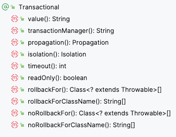
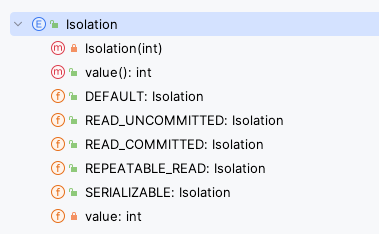
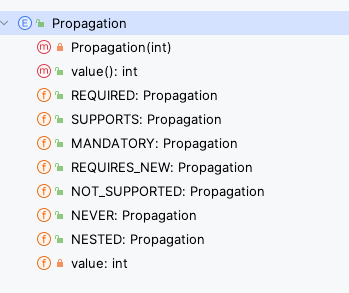
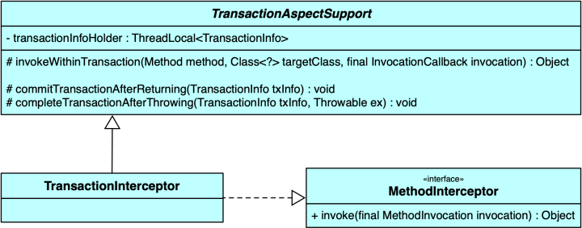

# 事务


数据库事务( transaction)是访问并可能操作各种数据项的一个数据库操作序列，这些操作要么全部执行,要么全部不执行，是一个不可分割的工作单位。事务由事务开始与事务结束之间执行的全部数据库操作组成。

满足 ACID 特性的一组数据看操作序列即可称为事务。下面是事务特性：

**A：原子性(Atomicity)**
一个事务(transaction)中的所有操作，要么全部完成，要么全部不完成，不会结束在中间某个环节。事务在执行过程中发生错误，会被回滚（Rollback）到事务开始前的状态，就像这个事务从来没有执行过一样。
**C：一致性(Consistency)**
事务的一致性指的是在一个事务执行之前和执行之后数据库都必须处于一致性状态。
如果事务成功地完成，那么系统中所有变化将正确地应用，系统处于有效状态。
如果在事务中出现错误，那么系统中的所有变化将自动地回滚，系统返回到原始状态。
**I：隔离性(Isolation)**
指的是在并发环境中，当不同的事务同时操纵相同的数据时，每个事务都有各自的完整数据空间。由并发事务所做的修改必须与任何其他并发事务所做的修改隔离。事务查看数据更新时，数据所处的状态要么是另一事务修改它之前的状态，要么是另一事务修改它之后的状态，事务不会查看到中间状态的数据。
**D：持久性(Durability)**
指的是只要事务成功结束，它对数据库所做的更新就必须保存下来。即使发生系统崩溃，重新启动数据库系统后，数据库还能恢复到事务成功结束时的状态。


### Spring事务的优点

- 它提供了跨不同事务api（如JTA、JDBC、Hibernate、JPA和JDO）的一致编程模型。
- 它为编程事务管理提供了比JTA等许多复杂事务API更简单的API。
- 它支持声明式事务管理。
- 它很好地集成了Spring的各种数据访问抽象。

### 使用示例

#### 编程式事务

事务功能的相关操作全部通过自己编写代码来实现：

```java
/**

1、定义事务属性信息： TransactionDefinition transactionDefinition = new DefaultTransactionDefinition();
2、定义事务管理器： PlatformTransactionManager platformTransactionManager = new DataSourceTransactionManager(dataSource);
3、获取事务： TransactionStatus transactionStatus = platformTransactionManager.getTransaction(transactionDefinition);
4、执行sql操作： 比如上面通过JdbcTemplate的各种方法执行各种sql操作
5、提交事务(platformTransactionManager.commit)或者回滚事务(platformTransactionManager.rollback)

**/


@Test
public void test1() throws Exception {
    //定义一个数据源
    org.apache.tomcat.jdbc.pool.DataSource dataSource = new org.apache.tomcat.jdbc.pool.DataSource();
    dataSource.setDriverClassName("com.mysql.jdbc.Driver");
    dataSource.setUrl("jdbc:mysql://localhost:3306/javacode2018?characterEncoding=UTF-8");
    dataSource.setUsername("root");
    dataSource.setPassword("root123");
    dataSource.setInitialSize(5);
    
    //定义一个JdbcTemplate，用来方便执行数据库增删改查
    JdbcTemplate jdbcTemplate = new JdbcTemplate(dataSource);
    
    //1.定义事务管理器，给其指定一个数据源（可以把事务管理器想象为一个人，这个人来负责事务的控制操作）
    PlatformTransactionManager platformTransactionManager = new DataSourceTransactionManager(dataSource);
    
    //2.定义事务属性：TransactionDefinition，TransactionDefinition可以用来配置事务的属性信息，比如事务隔离级别、事务超时时间、事务传播方式、是否是只读事务等等。
    TransactionDefinition transactionDefinition = new DefaultTransactionDefinition();
    
    //3.获取事务：调用platformTransactionManager.getTransaction开启事务操作，得到事务状态(TransactionStatus)对象
    TransactionStatus transactionStatus = platformTransactionManager.getTransaction(transactionDefinition);
    
    
    try {
        //4.执行业务操作，下面就执行2个插入操作
        System.out.println("before:" + jdbcTemplate.queryForList("SELECT * from t_user"));
        jdbcTemplate.update("insert into t_user (name) values (?)", "test1-1");
        jdbcTemplate.update("insert into t_user (name) values (?)", "test1-2");
        
        //5.提交事务：platformTransactionManager.commit
        platformTransactionManager.commit(transactionStatus);
    } catch (Exception e) {
        
        //6.回滚事务：platformTransactionManager.rollback
        platformTransactionManager.rollback(transactionStatus);
    }
    System.out.println("after:" + jdbcTemplate.queryForList("SELECT * from t_user"));
}

```


编程式事务管理使用 TransactionTemplate，需要显式执行事务。

编程式的实现方式存在缺陷：

- 细节没有被屏蔽：具体操作过程中，所有细节都需要程序员自己来完成，比较繁琐。
- 代码复用性不高：如果没有有效抽取出来，每次实现功能都需要自己编写代码，代码就没有得到复用


#### 声明式事务

**①添加配置类**

```java
package com.atguigu.spring6.config;

import com.alibaba.druid.pool.DruidDataSource;
import org.springframework.context.annotation.Bean;
import org.springframework.context.annotation.ComponentScan;
import org.springframework.context.annotation.Configuration;
import org.springframework.jdbc.core.JdbcTemplate;
import org.springframework.jdbc.datasource.DataSourceTransactionManager;
import org.springframework.transaction.annotation.EnableTransactionManagement;
import javax.sql.DataSource;

@Configuration
@ComponentScan("com.atguigu.spring6")
@EnableTransactionManagement
public class SpringConfig {

    @Bean
    public DataSource getDataSource(){
        DruidDataSource dataSource = new DruidDataSource();
        dataSource.setDriverClassName("com.mysql.cj.jdbc.Driver");
        dataSource.setUrl("jdbc:mysql://localhost:3306/spring?characterEncoding=utf8&useSSL=false");
        dataSource.setUsername("root");
        dataSource.setPassword("root");
        return dataSource;
    }

    @Bean(name = "jdbcTemplate")
    public JdbcTemplate getJdbcTemplate(DataSource dataSource){
        JdbcTemplate jdbcTemplate = new JdbcTemplate();
        jdbcTemplate.setDataSource(dataSource);
        return jdbcTemplate;
    }

    @Bean
    public DataSourceTransactionManager getDataSourceTransactionManager(DataSource dataSource){
        DataSourceTransactionManager dataSourceTransactionManager = new DataSourceTransactionManager();
        dataSourceTransactionManager.setDataSource(dataSource);
        return dataSourceTransactionManager;
    }
}


// service中的方法添加注解： @Transactional
@Transactional(timeout = 3)
public void buyBook(Integer bookId, Integer userId) {
    try {
        TimeUnit.SECONDS.sleep(5);
    } catch (InterruptedException e) {
        e.printStackTrace();
    }
    //查询图书的价格
    Integer price = bookDao.getPriceByBookId(bookId);
    //更新图书的库存
    bookDao.updateStock(bookId);
    //更新用户的余额
    bookDao.updateBalance(userId, price);
    //System.out.println(1/0);
}


```

**②测试**

```java

import com.atguigu.spring6.config.SpringConfig;
import com.atguigu.spring6.controller.BookController;
import org.junit.jupiter.api.Test;
import org.springframework.beans.factory.annotation.Autowired;
import org.springframework.context.ApplicationContext;
import org.springframework.context.annotation.AnnotationConfigApplicationContext;
import org.springframework.test.context.junit.jupiter.SpringJUnitConfig;

public class TxByAllAnnotationTest {

    @Test
    public void testTxAllAnnotation(){
        ApplicationContext applicationContext = new AnnotationConfigApplicationContext(SpringConfig.class);
        BookController accountService = applicationContext.getBean("bookController", BookController.class);
        accountService.buyBook(1, 1);
    }
}

```

1. 声明式事务管理建立在 AOP 之上的。其本质是通过 AOP 功能，对方法前后进行拦截，将事务处理的功能编织到拦截的方法中，也就是在目标方法开始之前启动一个事务，在执行完目标方法之后根据执行情况提交或者回滚事务
2. 优点是不需要在业务逻辑代码中掺杂事务管理的代码，只需在配置文件中做相关的事务规则声明或通过 @Transactional 注解的方式，便可以将事务规则应用到业务逻辑中，减少业务代码的污染。唯一不足地方是，最细粒度只能作用到方法级别，无法做到像编程式事务那样可以作用到代码块级别。

- 好处1：提高开发效率
- 好处2：消除了冗余的代码
- 好处3：框架会综合考虑相关领域中在实际开发环境下有可能遇到的各种问题，进行了健壮性、性能等各个方面的优化


### 事务属性



#### @Transactional注解标识的位置

@Transactional标识在方法上，则只会影响该方法
@Transactional标识的类上，则会影响类中所有的方法

#### 只读 —— readOnly()

对一个查询操作来说，如果我们把它设置成只读，就能够明确告诉数据库，这个操作不涉及写操作。这样数据库就能够针对查询操作来进行优化。
@Transactional(readOnly = true)

#### 超时 —— timeout()

事务在执行过程中，有可能因为遇到某些问题，导致程序卡住，从而长时间占用数据库资源。而长时间占用资源，大概率是因为程序运行出现了问题（可能是Java程序或MySQL数据库或网络连接等等）。此时这个很可能出问题的程序应该被回滚，撤销它已做的操作，事务结束，把资源让出来，让其他正常程序可以执行。
概括来说就是一句话：超时回滚，释放资源。
//超时时间单位秒
@Transactional(timeout = 3)

#### 回滚策略

声明式事务默认只针对运行时异常回滚，编译时异常不回滚。
可以通过@Transactional中相关属性设置回滚策略

- rollbackFor属性：需要设置一个Class类型的对象
- rollbackForClassName属性：需要设置一个字符串类型的全类名
- noRollbackFor属性：需要设置一个Class类型的对象
- rollbackFor属性：需要设置一个字符串类型的全类名

@Transactional(noRollbackFor = ArithmeticException.class)
//@Transactional(noRollbackForClassName = "java.lang.ArithmeticException")

事务失效就有关于回滚策略的最佳实践：

   1. 在使用事务时，设置捕获具体的异常类型： Spring默认抛出了未检查unchecked异常（继承自 RuntimeException的异常）或者 Error才回滚事务，其他异常不会触发回滚事务。
   2. 在使用事务时，业务代码中不可吞并异常，一定要抛出：业务代码中对异常进行吞并，导致事务代码部分未抛出异常；

#### 隔离级别 —— isolation()

**①介绍**
数据库系统必须具有隔离并发运行各个事务的能力，使它们不会相互影响，避免各种并发问题。一个事务与其他事务隔离的程度称为隔离级别。SQL标准中规定了多种事务隔离级别，不同隔离级别对应不同的干扰程度，隔离级别越高，数据一致性就越好，但并发性越弱。
隔离级别一共有四种：

- 读未提交：READ UNCOMMITTED允许Transaction01读取Transaction02未提交的修改。
- 读已提交：READ COMMITTED、要求Transaction01只能读取Transaction02已提交的修改。
- 可重复读：REPEATABLE READ确保Transaction01可以多次从一个字段中读取到相同的值，即Transaction01执行期间禁止其它事务对这个字段进行更新。
- 串行化：SERIALIZABLE确保Transaction01可以多次从一个表中读取到相同的行，在Transaction01执行期间，禁止其它事务对这个表进行添加、更新、删除操作。可以避免任何并发问题，但性能十分低下。

各个隔离级别解决并发问题的能力见下表：

| **隔离级别** | **脏读** | **不可重复读** | **幻读** |
| --- | --- | --- | --- |
| READ UNCOMMITTED | 有 | 有 | 有 |
| READ COMMITTED | 无 | 有 | 有 |
| REPEATABLE READ | 无 | 无 | 有 |
| SERIALIZABLE | 无 | 无 | 无 |

各种数据库产品对事务隔离级别的支持程度：

| **隔离级别** | **Oracle** | **MySQL** |
| --- | --- | --- |
| READ UNCOMMITTED | × | √ |
| READ COMMITTED | √(默认) | √ |
| REPEATABLE READ | × | √(默认) |
| SERIALIZABLE | √ | √ |

**②使用方式**
**org.springframework.transaction.annotation.Isolation**



```
@Transactional(isolation = Isolation.DEFAULT)//使用数据库默认的隔离级别
@Transactional(isolation = Isolation.READ_UNCOMMITTED)//读未提交
@Transactional(isolation = Isolation.READ_COMMITTED)//读已提交
@Transactional(isolation = Isolation.REPEATABLE_READ)//可重复读
@Transactional(isolation = Isolation.SERIALIZABLE)//串行化

```

#### 传播行为 —— propagation()

**①介绍**

什么是事务的传播行为？
在service类中有a()方法和b()方法，a()方法上有事务，b()方法上也有事务，当a()方法执行过程中调用了b()方法，事务是如何传递的？合并到一个事务里？还是开启一个新的事务？这就是事务传播行为。
一共有七种传播行为：

- REQUIRED：支持当前事务，如果不存在就新建一个(**默认**)**【没有就新建，有就加入】**
- SUPPORTS：支持当前事务，如果当前没有事务，就以非事务方式执行**【有就加入，没有就不管了】**
- MANDATORY：必须运行在一个事务中，如果当前没有事务正在发生，将抛出一个异常**【有就加入，没有就抛异常】**
- REQUIRES_NEW：开启一个新的事务，如果一个事务已经存在，则将这个存在的事务挂起**【不管有没有，直接开启一个新事务，开启的新事务和之前的事务不存在嵌套关系，之前事务被挂起】**
- NOT_SUPPORTED：以非事务方式运行，如果有事务存在，挂起当前事务**【不支持事务，存在就挂起】**
- NEVER：以非事务方式运行，如果有事务存在，抛出异常**【不支持事务，存在就抛异常】**
- NESTED：如果当前正有一个事务在进行中，则该方法应当运行在一个嵌套式事务中。被嵌套的事务可以独立于外层事务进行提交或回滚。如果外层事务不存在，行为就像REQUIRED一样。**【有事务的话，就在这个事务里再嵌套一个完全独立的事务，嵌套的事务可以独立的提交和回滚。没有事务就和REQUIRED一样。】**

org.springframework.transaction.annotation.Propagation



@Transactional(propagation = Propagation.REQUIRED)


### 事务原理

就是通过AOP/动态代理。

- **在Bean初始化阶段创建代理对象**：Spring容器在初始化每个单例bean的时候，会遍历容器中的所有BeanPostProcessor实现类，并执行其postProcessAfterInitialization方法，在执行AbstractAutoProxyCreator类的postProcessAfterInitialization方法时会遍历容器中所有的切面，查找与当前实例化bean匹配的切面，这里会获取事务属性切面，查找@Transactional注解及其属性值，然后根据得到的切面创建一个代理对象，默认是使用JDK动态代理创建代理，如果目标类是接口，则使用JDK动态代理，否则使用Cglib。
- **在执行目标方法时进行事务增强操作**：当通过代理对象调用Bean方法的时候，会触发对应的AOP增强拦截器，声明式事务是一种环绕增强，对应接口为MethodInterceptor，事务增强对该接口的实现为TransactionInterceptor，类图如下：



事务拦截器TransactionInterceptor在invoke方法中，通过调用父类TransactionAspectSupport的invokeWithinTransaction方法进行事务处理，包括开启事务、事务提交、异常回滚。

#### 事务失效及其原因

1. 配置不规范导致未生效；
2. 使用不规范导致未生效；
   1. 不通过代理对象调用；
   2. 在非 public 方法上使用事务；
   3. 不在同一个线程内使用事务；
3. 异常问题导致未生效：
   1. Spring默认抛出了未检查unchecked异常（继承自 RuntimeException的异常）或者 Error才回滚事务，其他异常不会触发回滚事务。
   2. 业务代码中对异常进行吞并，导致事务代码部分未抛出异常；

#### 事务使用不规范

1. 未启用spring事务管理功能： @EnableTransactionManagement
1. 数据源未配置事务管理器： dataSourceTransactionManager.setDataSource(dataSource);

#### 方法不是public类型的

如果Transactional注解应用在非 public 修饰的方法上，Transactional将会失效。
是因为在Spring AOP 代理时，TransactionInterceptor （事务拦截器）在目标方法执行前后进行拦截，DynamicAdvisedInterceptor（CglibAopProxy 的内部类）的intercept方法 或 JdkDynamicAopProxy的invoke方法会间接调用AbstractFallbackTransactionAttributeSource的 **computeTransactionAttribute**方法，获取Transactional 注解的事务配置信息。

#### 自身调用问题

> 通过外部对象直接调用加了事务注解的方法是失效的，因为事务必须通过代理对象才能生效

开发中避免不了会对同一个类里面的方法调用，比如有一个类Test，它的一个方法A，A再调用本类的方法B（不论方法B是用public还是private修饰），但方法A没有声明注解事务，而B方法有。则外部调用方法A之后，方法B的事务是不会起作用的。这也是经常犯错误的一个地方。
那为啥会出现这种情况？其实这还是由于使用Spring AOP代理造成的，因为只有当事务方法被当前类以外的代码调用时，才会由Spring生成的代理对象来管理。

#### 业务和spring事务代码必须在一个线程中

#### 异常类型错误

rollbackFor 可以指定能够触发事务回滚的异常类型。Spring默认抛出了未检查unchecked异常（继承自 RuntimeException的异常）或者 Error才回滚事务，其他异常不会触发回滚事务。

#### 异常被吞了

### 长事务

### 源码分析

[专辑：Spring教程_Spring事务源码解析-Java充电社【公众号：Java充电社】](http://www.itsoku.com/course/5/129)

#### 总结

1. 根据在框架中使用事务的发展规律来看，最开始要想使用事务，就是程序员自己去编写事务的每一个步骤的控制逻辑，这种方式就是编程式事务；
2. 所谓声明式事务就是把本来需要程序员自行编程控制的事务的每一个步骤声明出来，之后通过配置的方式给到Spring，让Spring容器自行管理，程序员只需要关注业务的具体执行；

[深入浅出Spring事务的实现原理](https://juejin.cn/post/7106158883055353870#heading-0)
