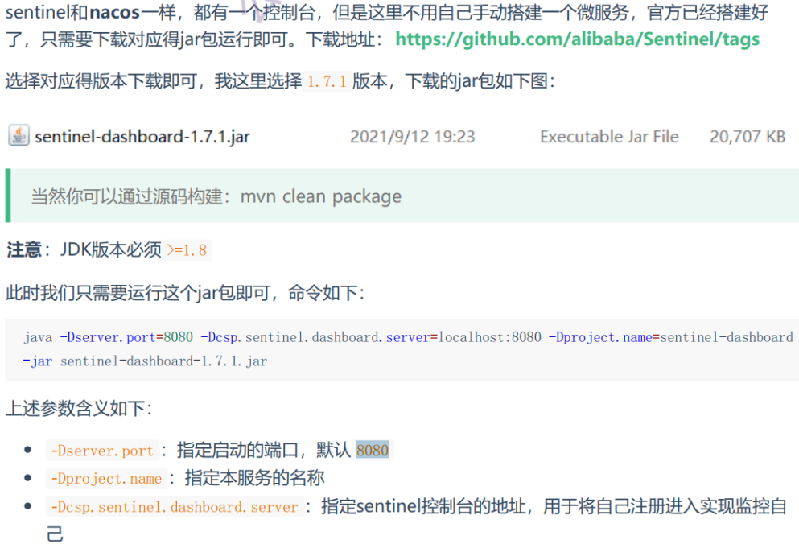

# 7. sentinel 分布式限流

### **Sentinel**



创建启动 cmd 脚本：
java -Dserver.port=8081 -Dcsp.sentinel.dashboard.server=localhost:8081 -Dproject.name=sentinel-dashboard -jar ./sentinel-dashboard-1.7.1.jar
双击 cmd 脚本，打开浏览器输入 localhost:8081， 用户名和密码： sentinel / sentinel

## docker 安装 sentinel

```sh

docker pull bladex/sentinel-dashboard:1.7.1

docker run --name sentinel -p 8858:8858 -d bladex/sentinel-dashboard:1.7.1

docker update sentinel --restart=always

```
