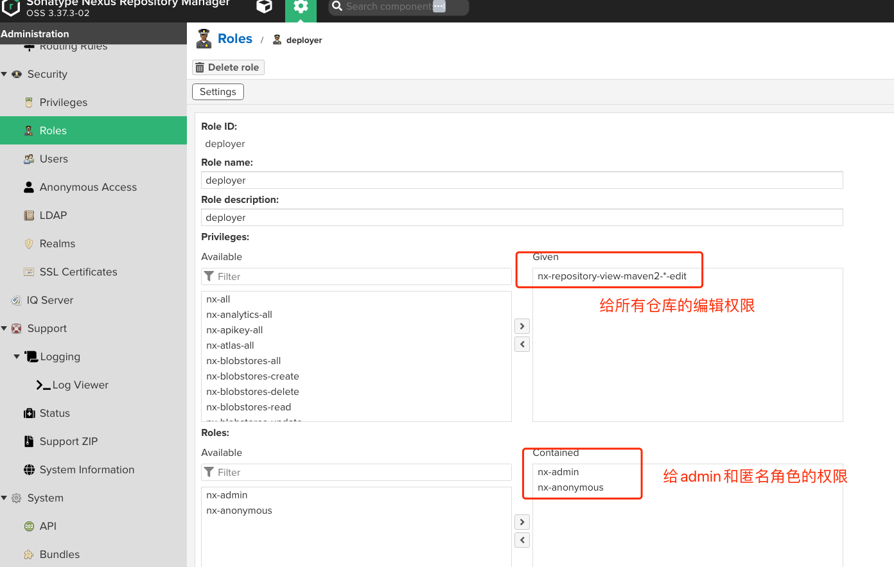
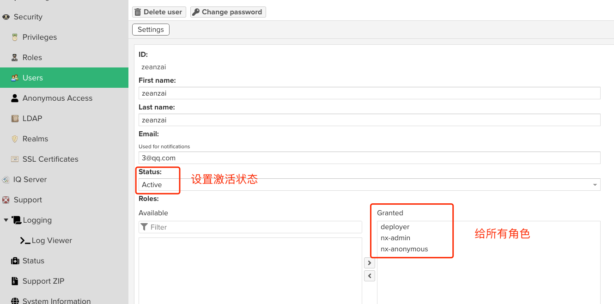
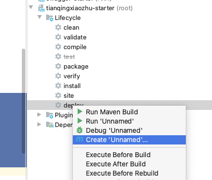
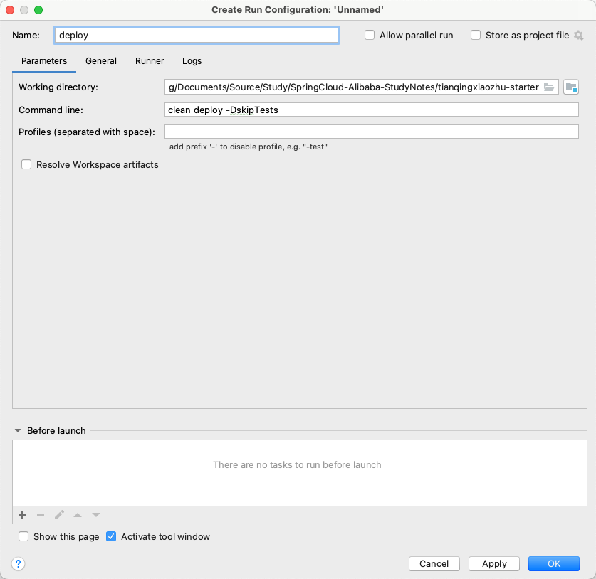
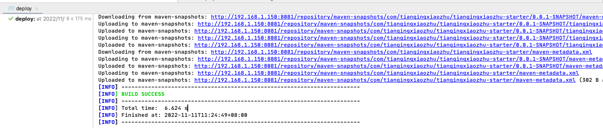
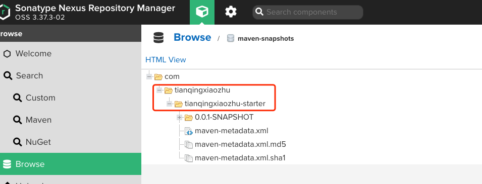

# 附录 02 统一管理依赖

为了更好的各个版本的依赖，我们搭建一个nexus私服，然后创建一个项目，配置好所有的依赖版本后，上传私服，然后让所有的模块都以这个模块父模块进行依赖，这样就达到所有的依赖的版本管理的目的。这也是spring官方starter的制作过程。

实际的本地开发过程中，可以不用搭建nexus私服。不过本篇文章可以带你体验一下官方Spring的Starter的制作过程。


### 1. 安装并配置 nexus3

#### 1.1. 安装


```
docker pull sonatype/nexus3

mkdir -p /mydata/nexus/data
chmod 777 -R /mydata/nexus

docker run -d --name nexus -p 8081:8081 \
--restart always \
-v /mydata/nexus/data:/nexus-data sonatype/nexus3

docker logs -f nexus

```


#### 1.2. 配置
安装完成之后，需要对 nexus 进行一些初始化配置。

##### 1.2.1. 修改 admin 的密码


```
cat /mydata/nexus/data/admin.password

```

登录页面后修改密码： root1003


##### 1.2.2. web页面上配置用于上传自定义包的用户

- 创建角色




- 创建用户





### 2. 配置maven的config


```

<server>
    <id>maven-public</id>
    <username>zeanzai</username>
    <password>root1003</password>
</server>
<server>
    <id>maven-releases</id>
    <username>zeanzai</username>
    <password>root1003</password>
</server>
<server>
    <id>maven-snapshots</id>
    <username>zeanzai</username>
    <password>root1003</password>
</server>

    <mirror>
    <id>maven-public</id>
    <name>maven-public</name>
    <url>http://192.168.1.150:8081/repository/maven-public/</url>
    <mirrorOf>*</mirrorOf>
</mirror>

<profile> 
    <id>jdk-1.8</id> 
    <activation> 
    <activeByDefault>true</activeByDefault> 
    <jdk>1.8</jdk> 
    </activation> 
    <properties> 
    <maven.compiler.source>1.8</maven.compiler.source> 
    <maven.compiler.target>1.8</maven.compiler.target> 
    <maven.compiler.compilerVersion>1.8</maven.compiler.compilerVersion> 
    </properties> 
</profile>

```


### 3. 项目pom文件中的配置


```
<distributionManagement>
    <repository>
        <id>maven-releases</id>
        <url>http://192.168.1.150:8081/repository/maven-releases/</url>
    </repository>
    <snapshotRepository>
        <id>maven-snapshots</id>
        <url>http://192.168.1.150:8081/repository/maven-snapshots/</url>
    </snapshotRepository>
</distributionManagement>

```

注意此处的id要与maven中的server中的id保持一致。


### 4. deploy——部署到私服

- 在maven的窗口中，找到“create..”：




- 在打开的窗口中输入 `clean deploy -DskipTests` ：




- 运行命令，发布到nexus私服上：


- 运行结果：








### 5. 其他模块中的引用

在其他模块中统一引用我们自定义的starter依赖，这样就能进行统一的依赖的版本管理了。


```
<parent>
    <groupId>com.tianqingxiaozhu</groupId>
    <artifactId>tianqingxiaozhu-starter</artifactId>
    <version>0.0.1-SNAPSHOT</version>
</parent>

```


### 6. 特别说明

在团队中一般是团队中的重要成员才有推送到私服的权限，因此在实际的开发过程中普通程序员是不需要创建私服的。各位读者在实践过程中，也可以直接创建一个模块，然后把这个模块安装到本地仓库后，在其他模块中引入对应坐标即可。


### 7. SpringCloud的版本

分为很多个组件，每一个组件都有自己的版本坐标，这个也很好理解，SpringCloud是一个大型的工程，在这个工程里面有很多组件，每一个组件都是由一个小团队负责交付，由于负责不同的组件的团队不同，所以组件的交付时间节点肯定不一样，所以SpringCloud有一个自己的版本，这个版本中每一个组件的版本是不同的。


#### 7.1. SpringCloud-Alibaba的版本

SpringCloud-Alibaba是基于SpringBoot开发的，也是有不同的组件组成的。

因此二者有一个对应关系。


#### 7.2. 对应关系


我们选取的版本如下：

- JDK1.8
- CentOS7.9
- SpringBoot-2.2.5.RELEASE
- SpringCloud-Hoxton.SR3
- SpringCloudAlibaba-2.2.1.RELEASE
- Nacos1.2.1
- Seata1.3.0
- Sentinel1.7.1
- ...


#### 7.3. 创建服务模块的方法

项目使用idea中的 Spring Initializer 进行生成。这样做的好处是`当团队规模较大，并且每一个团队都负责一个模块时，可以让不同的团队只需要下载自己负责的模块代码即可，便于代码权限的管理`。
