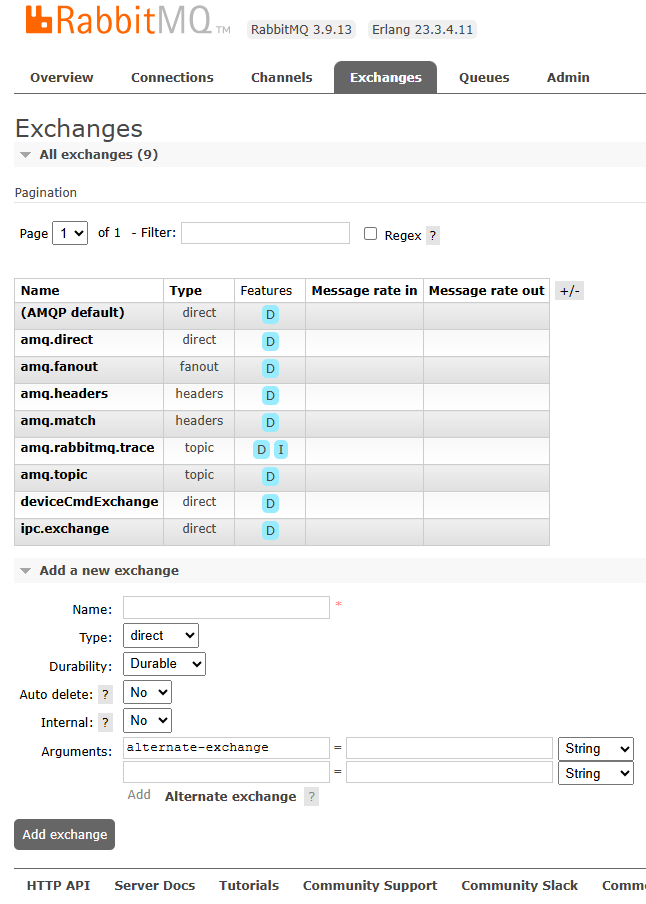

# 消息队列知识点汇总

- [详细讲解！RabbitMQ 防止数据丢失](https://mp.weixin.qq.com/s/KGCER3TWLT6Yk_UwsYJZyA)
- [超详细的 RabbitMQ 入门](https://mp.weixin.qq.com/s/RhXe3cF_B3p78I2mEXY9EQ)

## Centos 安装 RabbitMQ

下载地址：

1. erlang： http://www.erlang.org/downloads
2. rabbitmq： http://www.rabbitmq.com/install-rpm.html#downloads

安装步骤分为两步，第一步是安装 erlang 环境，第二步是安装 rabbitmq-server。erlang 的安装方式有很多种：

1. 使用源码方式安装，这种方式需要安装 gcc 的等编译软件；
2. 直接使用安装包方式进行安装（采用此方式安装）；
3. 使用 yum 源方式安装；

> 特别强调：rabbitmq 的安装特别依赖 erlang 的版本，具体依赖哪一个版本请参考[此处](http://www.rabbitmq.com/which-erlang.html)。

<details class="details custom-block">

<summary>方式一</summary>

1. 安装 erlang

**比较熟悉 erlang 的可以采用此方式进行安装，对于不熟悉 erlang 的，推荐使用第二种方式。**

```sh
// 安装依赖
$ yum install -y gcc glibc-devel make ncurses-devel openssl-devel xmlto

// 解压
$ tar zxf /opt/package/otp_src_21.2.tar.gz -C /opt/unziped/

// 创建文件夹
$ mkdir /usr/setup/otp_src_21.2

// 进入解压后的文件夹并 config
$ cd /opt/unziped/otp_src_21.2/
$ ./configure --prefix=/usr/setup/otp_src_21.2

// 编译并安装
$ make && make install

// 配置环境变量，并使之生效
$ vi /etc/profile
export ERL_HOME=/usr/setup/otp_src_21.2
PATH=$ERL_HOME/bin:$PATH

// 验证
$ erl
```

2. 安装并配置 rabbitmq

```sh
// 直接安装
$ rpm -ivh --nodeps rabbitmq-server-3.7.9-1.el7.noarch.rpm

// 开放端口
$ firewall-cmd --zone=public --permanent --add-port=15672/tcp
$ firewall-cmd --zone=public --permanent --add-port=5672/tcp
$ firewall-cmd --reload

// 启动管理客户端功能
$ rabbitmq-plugins enable rabbitmq_management

// 后台启动
$ rabbitmq-server -detached

// 创建用户，并赋予权限（此操作要放到启动之后）
$ rabbitmqctl add_user root root1003
$ rabbitmqctl set_user_tags root administrator
$ rabbitmqctl set_permissions -p / root '.*' '.*' '.*'
```

</details>

<details class="details custom-block">

<summary>方式二（推荐）</summary>

```sh
// 安装依赖
$ yum install -y socat

// 安装 erlang
$ rpm -ivh erlang-21.0.9-1.el7.centos.x86_64.rpm

// 安装 rabbitmq
$ rpm -ivh rabbitmq-server-3.7.9-1.el7.noarch.rpm

// 开放端口
$ firewall-cmd --zone=public --permanent --add-port=15672/tcp
$ firewall-cmd --zone=public --permanent --add-port=5672/tcp
$ firewall-cmd --reload

// 后台启动
$ rabbitmq-server -detached


// 启动管理客户端功能
$ rabbitmq-plugins enable rabbitmq_management

// 创建用户，并赋予权限
$ rabbitmqctl add_user northmeter admin123456 // 密码不能太复杂
$ rabbitmqctl set_user_tags northmeter administrator
$ rabbitmqctl set_permissions -p / northmeter '.*' '.*' '.*'

// 开机自启动
$ chkconfig rabbitmq-server on

```

</details>

## Docker 安装 RabbitMQ

```sh

docker search rabbitmq

docker pull rabbitmq

mkdir -p /mydata/rabbimq/

docker run -p 5672:5672 -p 15672:15672 --name rabbitmq \
-v /mydata/rabbitmq:/var/lib/rabbitmq \
-v /mydata/rabbitmq/logs:/var/log/rabbitmq \
-e RABBITMQ_DEFAULT_USER=admin \
-e RABBITMQ_DEFAULT_PASS=admin \
-e RABBITMQ_LOG_BASE=/var/log/rabbitmq \
-d rabbitmq

docker exec -it rabbitmq /bin/bash

rabbitmq-plugins enable rabbitmq_management

## 开机自启动
docker update rabbitmq --restart=always

```

```
docker run -it --rm --name rabbitmq -p 5672:5672 -p 15672:15672 rabbitmq:4-management

docker run -d --name rabbitmq --restart=always -p 5672:5672 -p 15672:15672 rabbitmq:4-management

docker run：启动一个新的容器。
-it：以交互模式运行容器，并分配一个伪终端（通常用于需要进入容器操作时）。
-d：后台运行。
--rm：容器停止后自动删除容器。
--name rabbitmq：为容器指定名称为 rabbitmq。
-restart=always：自动重启。
-p 5672:5672：将主机的 5672 端口映射到容器的 5672 端口（RabbitMQ 的 AMQP 服务端口）。
-p 15672:15672：将主机的 15672 端口映射到容器的 15672 端口（RabbitMQ 的管理界面端口）。
rabbitmq:4-management：使用带有管理插件的 RabbitMQ 4.x 镜像。


```

## RabbitMQ

### 安装

- [RabbitMQ3.9.13](https://github.com/rabbitmq/rabbitmq-server/releases/tag/v3.9.13)
- [Erlang23.3.4.11](https://github.com/rabbitmq/erlang-rpm/releases/tag/v23.3.4.11)
- [参考这里](https://www.cnblogs.com/antLaddie/p/15958830.html#_label7_3)

```bash
# 安装 erlang 环境
rpm -ivh erlang-23.3.4.11-1.el7.x86_64.rpm
# 安装 socat 环境
yum -y install socat
# 安装 RabbitMQ 服务
rpm -ivh rabbitmq-server-3.9.13-1.el7.noarch.rpm
# 检查是否安装
yum list | grep rabbitmq
yum list | grep erlang
```

### RabbitMQ 服务端

1. Broker ： 接收和分发消息的应用，RabbitMQ Server 就是 Message Broker；简单来说就是消息队列服务器实体
2. **Virtual host** ： 出于多租户和安全因素设计的，把 AMQP 的基本组件划分到一个虚拟的分组中，类似于网络中的 namespace 概念。当多个不同的用户使用同一个 RabbitMQ server 提供的服务时，可以划分出多个 vhost，每个用户在自己的 vhost 创建 exchange／queue 等
3. Connection ： publisher／consumer 和 broker 之间的 TCP 连接
4. Channel ： 消息通道，如果每一次访问 RabbitMQ 都建立一个 Connection，在消息量大的时候建立 TCPConnection 的开销将是巨大的，效率也较低。Channel 是在 connection 内部建立的逻辑连接，如果应用程序支持多线程，通常每个 thread 创建单独的 channel 进行通讯，AMQP method 包含了 channel id 帮助客户端和 message broker 识别 channel，所以 channel 之间是完全隔离的。Channel 作为轻量级的 Connection 极大减少了操作系统建立 TCP connection 的开销。
5. **Exchange** ： message 到达 broker 的第一站，根据分发规则，匹配查询表中的 routing key，分发消息到 queue 中去。常用的类型有：direct (point-to-point), topic (publish-subscribe) and fanout(multicast)
6. **Queue** ： 消息队列载体，每个消息都会被投入到一个或多个队列;消息最终被送到这里等待 consumer 取走
7. **Routing Key** ： 路由关键字，exchange 根据这个关键字进行消息投递。
8. Binding ： exchange 和 queue 之间的虚拟连接，binding 中可以包含 routing key，Binding 信息被保存到 exchange 中的查询表中，用于 message 的分发依据;它的作用就是把 exchange 和 queue 按照路由规则绑定起来。
9. producer ： 消息生产者，就是投递消息的程序。
10. consumer ： 消息消费者，就是接受消息的程序。

在控制台，我们能看到 交换机 列表，并且还可以在上面完成交换机的创建：



11. 通信模型、生产者、消费者、broker、exchange、queue、routekey、binding
12. 控制台、rabbitmqctl

## SpringBoot-rabbitmq-starter

### 配置

1. 生产者确认
2. 服务端持久化（exchange、queue、message）
3. 消费者确认

### 死信队列

### 延迟队列

### 高可用

主从模式
镜像模式
