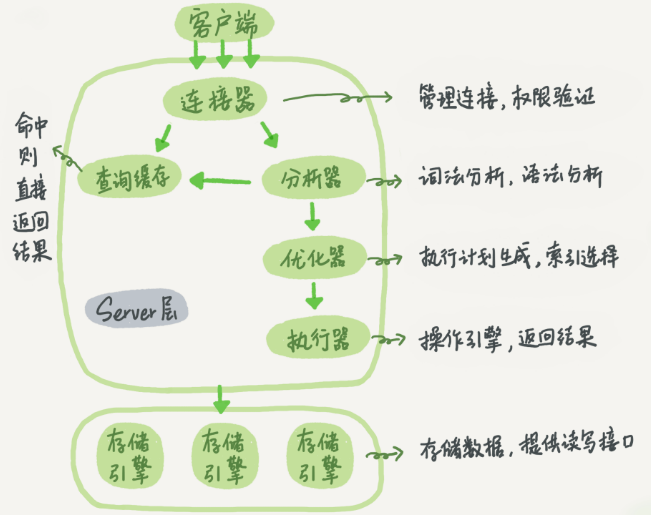
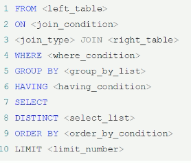
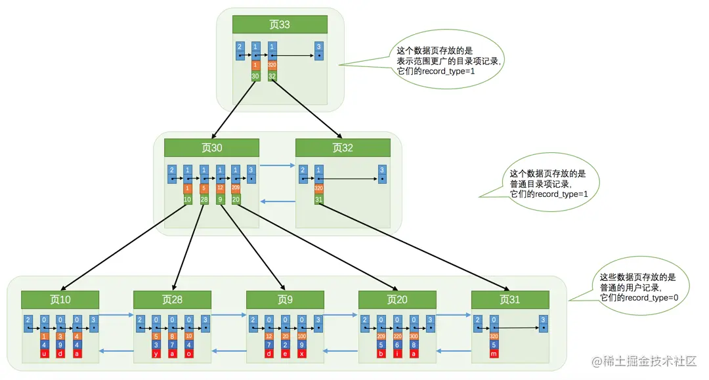

1. 常用术语
2. 字符集和排序规则
3. 数据类型
   1. varchar() 和 char
   2. blog 和 text
   3. datetime 和 timestamp
   4. decimal 和 numeric
   5. json
4. 设计原则
   1. 三大范式
   2. 约束
5. SQL 执行过程
6. 慢 SQL 日志
7. SQL 执行计划分析

## 数据库设计

### 常用术语

- 数据库是数据的集合，数据库管理系统（DBMS）是操作和管理数据库的应用程序。数据库应用主要有两类：OLAP（联机分析处理）和 OLTP（联机事务处理）。
- OLAP 的主要特点是:
  - 实时性要求不高
  - 数据量大
  - 并发量小
- OLTP 的主要特点是:
  - 实时性要求高
  - 数据量小
  - 高并发
  - 要求满足 ACID
- RDBMS ： 关系型数据库管理系统
- `数据库（database）` ： 保存有组织的数据的容器（通常是一个文件或一组文件）。
- `数据表（table）` ： 某种特定类型数据的结构化清单。
- `模式（schema）` ： 关于数据库和表的布局及特性的信息。模式定义了数据在表中如何存储，包含存储什么样的数据，数据如何分解，各部分信息如何命名等信息。数据库和表都有模式。
- `列（column）` ： 表中的一个字段。所有表都是由一个或多个列组成的。
- `行（row）` ： 表中的一个记录。
- `主键（primary key）` ： 一列（或一组列），其值能够唯一标识表中每一行。

### 三大范式

三大范式，是在设计数据库表时，所遵循的一些规则。但实际中，**为兼顾性能和业务需求，很多时候并不能很好的遵循这些规则。**

第一范式：**确保表的每一列都是不可分割的基本数据单元**。比如说用户地址，“省、市、区街道”等，都保存到一个列里面，这样就是不合理的，应该根据业务要求，拆分成省、市、区、详细地址等 4 个字段。

第二范式，**要求表中的每一列都和主键直接相关**。比如订单要关联商品，所以只需要在订单表中保留商品 id 即可，商品信息，如商品名称、单位、商品价格等字段应该拆分到商品表中。可以新建一个订单商品关联表，用订单编号和商品编号进行关联就好了。

第三范式，**非主键列应该只依赖于主键列**。比如说在设计订单信息表的时候，可以把客户名称、所属公司、联系方式等信息拆分到客户信息表中，然后在订单信息表中用客户编号进行关联。

### 字符集与排序规则

// TODO

> 4. utf8mb4 字符集
> 5. MySQL 中的 utf-8 并不是真正意义上的 utf-8 , 它只能存储 1~3 个字节长度的 utf-8 编码，而存储 4 个字节的必须用 utf8mb4(mysql>=5.5.3 支持)，否则会出现乱码。例如在微信管理系统中，消息文本使用了 emoji 表情:符号，必须使用 utf8mb4 进行储存。
>    注意最大字符长度：以 INNODB 为基础，utf8 最长 VARCHAR(255)，utf8mb4 最长为 VARCHAR(191)。 3. 要求在的 mysql>=5.5.3 版本，表、字段必须使用 utf8mb4 字符集和 utf8mb4 整理。

### 数据类型

```sql
mysql> ? data types
You asked for help about help category: "Data Types"
For more information, type 'help <item>', where <item> is one of the following
topics:
   AUTO_INCREMENT
   BIGINT
   BINARY
   BIT
   BLOB
   BLOB DATA TYPE
   BOOLEAN
   CHAR
   CHAR BYTE
   DATE
   DATETIME
   DEC
   DECIMAL
   DOUBLE
   DOUBLE PRECISION
   ENUM
   FLOAT
   INT
   INTEGER
   LONGBLOB
   LONGTEXT
   MEDIUMBLOB
   MEDIUMINT
   MEDIUMTEXT
   SET DATA TYPE
   SMALLINT
   TEXT
   TIME
   TIMESTAMP
   TINYBLOB
   TINYINT
   TINYTEXT
   VARBINARY
   VARCHAR
   YEAR DATA TYPE

```

1. varchar() 和 char

varchar 是可变长度的字符类型，原则上最多可以容纳 65535 个字符，但考虑字符集，以及 MySQL 需要 1 到 2 个字节来表示字符串长度，所以实际上最大可以设置到 65533。

> latin1 字符集，且列属性定义为 NOT NULL。

char 是固定长度的字符类型，当定义一个 `CHAR(10)` 字段时，不管实际存储的字符长度是多少，都只会占用 10 个字符的空间。如果插入的数据小于 10 个字符，剩余的部分会用空格填充。

2. blog 和 text

blob 用于存储二进制数据，比如图片、音频、视频、文件等；但实际开发中，我们都会把这些文件存储到 OSS 或者文件服务器上，然后在数据库中存储文件的 URL。

text 用于存储文本数据，比如文章、评论、日志等。

3. datetime 和 timestamp

|          | DATETIME            | TIMESTAMP                                       |
| -------- | ------------------- | ----------------------------------------------- |
| 存储内容 | 日期和时间的完整值  | Unix 时间戳，1970-01-01 00:00:01 UTC 以来的秒数 |
| 时区相关 | 无关                | 有关                                            |
| 默认值   | null，占用 8 个字节 | 为当前时间，，更常用，可自动更新                |
| 所占空间 | 8 个字节            | 占 4 个字节                                     |

4. decimal 和 numeric

货币在数据库中 MySQL 常用 Decimal 和 Numeric 类型表示，这两种类型被 MySQL 实现为同样的类型。他们被用于保存与货币有关的数据。

例如 salary DECIMAL(9,2)，9(precision)代表将被用于存储值的总的小数位数，而 2(scale)代表将被用于存储小数点后的位数。存储在 salary 列中的值的范围是从-9999999.99 到 9999999.99。

DECIMAL 和 NUMERIC 值作为字符串存储，而不是作为二进制浮点数，以便保存那些值的小数精度。

之所以不使用 float 或者 double 的原因：因为 float 和 double 是以二进制存储的，所以有一定的误差。

5. json

// TODO

### 列的约束

- 约束可以在创建表时规定（通过 CREATE TABLE 语句），或者在表创建之后规定（通过 ALTER TABLE 语句）。
- 约束类型
  - `NOT NULL` - 指示某列不能存储 NULL 值。
  - `UNIQUE` - 保证某列的每行必须有唯一的值。
  - `PRIMARY KEY` - NOT NULL 和 UNIQUE 的结合。确保某列（或两个列多个列的结合）有唯一标识，有助于更容易更快速地找到表中的一个特定的记录。
  - `FOREIGN KEY` - 外键 一个表中的某一列是另一个表的主键，用于防止破坏表之间链接的操作。
  - `CHECK` - 保证列中的值符合指定的条件。
  - `DEFAULT` - 规定没有给列赋值时的默认值。

## SQL 语句

```sql
mysql> help  contents
You asked for help about help category: "Contents"
For more information, type 'help <item>', where <item> is one of the following
categories:
   Account Management
   Administration
   Components
   Compound Statements
   Contents
   Data Definition
   Data Manipulation
   Data Types
   Functions
   Geographic Features
   Help Metadata
   Language Structure
   Loadable Functions
   Plugins
   Prepared Statements
   Replication Statements
   Storage Engines
   Table Maintenance
   Transactions
   Utility

mysql> help insert
Name: 'INSERT'
Description:
Syntax:
INSERT [LOW_PRIORITY | DELAYED | HIGH_PRIORITY] [IGNORE]
    [INTO] tbl_name
    [PARTITION (partition_name [, partition_name] ...)]
    [(col_name [, col_name] ...)]
    { {VALUES | VALUE} (value_list) [, (value_list)] ... }
    [AS row_alias[(col_alias [, col_alias] ...)]]
    [ON DUPLICATE KEY UPDATE assignment_list]

INSERT [LOW_PRIORITY | DELAYED | HIGH_PRIORITY] [IGNORE]
    [INTO] tbl_name
    [PARTITION (partition_name [, partition_name] ...)]
    SET assignment_list
    [AS row_alias[(col_alias [, col_alias] ...)]]
    [ON DUPLICATE KEY UPDATE assignment_list]

INSERT [LOW_PRIORITY | HIGH_PRIORITY] [IGNORE]
    [INTO] tbl_name
    [PARTITION (partition_name [, partition_name] ...)]
    [(col_name [, col_name] ...)]
    { SELECT ...
      | TABLE table_name
      | VALUES row_constructor_list
    }
    [ON DUPLICATE KEY UPDATE assignment_list]

value:
    {expr | DEFAULT}

value_list:
    value [, value] ...

row_constructor_list:
    ROW(value_list)[, ROW(value_list)][, ...]

assignment:
    col_name =
          value
        | [row_alias.]col_name
        | [tbl_name.]col_name
        | [row_alias.]col_alias

assignment_list:
    assignment [, assignment] ...
...
```

|          | DDL                                           | DML                                             | DCL                                       | TCL                                              |
| -------- | --------------------------------------------- | ----------------------------------------------- | ----------------------------------------- | ------------------------------------------------ |
| 含义     | 数据定义语言（Data Definition Language，DDL） | 数据操纵语言（Data Manipulation Language, DML） | 数据控制语言 (Data Control Language, DCL) | 事务控制语言 (Transaction Control Language, TCL) |
| 功能     | 定义数据库对象                                | 访问数据                                        | 控制用户的访问权限                        | 管理数据库中的事务                               |
| 核心指令 | CREATE、ALTER、DROP                           | INSERT、UPDATE、DELETE、SELECT                  | GRANT、REVOKE                             | COMMIT、ROLLBACK                                 |

1. SQL（Structured Query Language)，标准 SQL 由 ANSI 标准委员会管理，从而称为 ANSI SQL。各个 DBMS 都有自己的实现，如 PL/SQL、Transact-SQL 等。
2. **SQL 语句不区分大小写**，但是数据库表名、列名和值是否区分，依赖于具体的 DBMS 以及配置。

### DDL

> DDL 的主要功能是定义数据库对象（如：数据库、数据表、视图、索引等）。

```sql
-- =======================================
-- 数据库（DATABASE）
-- =======================================
CREATE DATABASE test;
DROP DATABASE test;
USE test;

-- =======================================
-- 数据表（TABLE）
-- =======================================
CREATE TABLE user (
  id int(10) unsigned NOT NULL COMMENT 'Id',
  username varchar(64) NOT NULL DEFAULT 'default' COMMENT '用户名',
  password varchar(64) NOT NULL DEFAULT 'default' COMMENT '密码',
  email varchar(64) NOT NULL DEFAULT 'default' COMMENT '邮箱'
) COMMENT='用户表';

CREATE TABLE vip_user AS SELECT * FROM user;
DROP TABLE user;
ALTER TABLE user ADD age int(3);
ALTER TABLE user DROP COLUMN age;
ALTER TABLE `user` MODIFY COLUMN age tinyint;
ALTER TABLE user ADD PRIMARY KEY (id);
ALTER TABLE user DROP PRIMARY KEY;

-- =======================================
-- 索引（INDEX）
-- - 作用
--   - 通过索引可以更加快速高效地查询数据。
--   - 用户无法看到索引，它们只能被用来加速查询。
-- - 注意
--   - 更新一个包含索引的表需要比更新一个没有索引的表花费更多的时间，这是由于索引本身也需要更新。因此，理想的做法是仅仅在常常被搜索的列（以及表）上面创建索引。
-- - 唯一索引
--   - 唯一索引表明此索引的每一个索引值只对应唯一的数据记录。
-- =======================================
CREATE INDEX user_index ON user (id);
CREATE UNIQUE INDEX user_index ON user (id);
ALTER TABLE user DROP INDEX user_index;

-- =======================================
-- 视图（VIEW）
-- 视图是基于 SQL 语句的结果集的可视化的表。是一张虚拟表，本身不包含数据，也就不能对其进行索引操作。对视图的操作和对普通表的操作一样。
--- 作用：
--- - 简化复杂的 SQL 操作，比如复杂的联结；
--- - 只使用实际表的一部分数据；
--- - 通过只给用户访问视图的权限，保证数据的安全性；
--- - 更改数据格式和表示。
-- =======================================

CREATE VIEW top_10_user_view AS
SELECT id, username FROM user WHERE id < 10;

DROP VIEW top_10_user_view;
```

> SQL 约束用于规定表中的数据规则。

- 如果存在违反约束的数据行为，行为会被约束终止。
- 约束可以在创建表时规定（通过 CREATE TABLE 语句），或者在表创建之后规定（通过 ALTER TABLE 语句）。
- 约束类型
  - `NOT NULL` - 指示某列不能存储 NULL 值。
  - `UNIQUE` - 保证某列的每行必须有唯一的值。
  - `PRIMARY KEY` - NOT NULL 和 UNIQUE 的结合。确保某列（或两个列多个列的结合）有唯一标识，有助于更容易更快速地找到表中的一个特定的记录。
  - `FOREIGN KEY` - 外键 一个表中的某一列是另一个表的主键，用于防止破坏表之间链接的操作。
  - `CHECK` - 保证列中的值符合指定的条件。
  - `DEFAULT` - 规定没有给列赋值时的默认值。

创建表时使用约束条件：

```sql
CREATE TABLE Users (
  Id INT(10) UNSIGNED NOT NULL AUTO_INCREMENT COMMENT '自增Id',
  Username VARCHAR(64) NOT NULL UNIQUE DEFAULT 'default' COMMENT '用户名',
  Password VARCHAR(64) NOT NULL DEFAULT 'default' COMMENT '密码',
  Email VARCHAR(64) NOT NULL DEFAULT 'default' COMMENT '邮箱地址',
  Enabled TINYINT(4) DEFAULT NULL COMMENT '是否有效',
  PRIMARY KEY (Id)
) ENGINE=InnoDB AUTO_INCREMENT=2 DEFAULT CHARSET=utf8mb4 COMMENT='用户表';


CREATE TABLE Orders (
    OrderID int NOT NULL,
    OrderNumber int NOT NULL,
    PersonID int,
    PRIMARY KEY (OrderID),
    FOREIGN KEY (PersonID) REFERENCES Persons(PersonID)
);
```

### DML

1. CRUD

```sql
-- =======================================
-- 插入数据
-- =======================================
INSERT INTO user VALUES (10, 'root', 'root', 'xxxx@163.com');
INSERT INTO user(username, password, email) VALUES ('admin', 'admin', 'xxxx@163.com');

-- =======================================
-- 更新记录
-- =======================================
UPDATE user
SET username='robot', password='robot'
WHERE username = 'root';

-- =======================================
-- 删除
--  `DELETE` 语句用于删除表中的记录。
--  `TRUNCATE TABLE` 可以清空表，也就是删除所有行。
-- =======================================
DELETE FROM user WHERE username = 'robot';
TRUNCATE TABLE user;

-- =======================================
-- 查询数据
-- `SELECT` 语句用于从数据库中查询数据。
--  `DISTINCT` 用于返回唯一不同的值。
--  `LIMIT` 限制返回的行数。可以有两个参数，第一个参数为起始行，从 0 开始；第二个参数为返回的总行数。
--  `ASC` ：升序（默认）
--  `DESC` ：降序
-- =======================================


-- =======================================

-- =======================================

```

2. 子查询

> 子查询是嵌套在较大查询中的 SQL 查询。子查询也称为**内部查询**或**内部选择**，而包含子查询的语句也称为**外部查询**或**外部选择**。

- 子查询可以嵌套在 `SELECT`，`INSERT`，`UPDATE` 或 `DELETE` 语句内或另一个子查询中。
- 子查询通常会在另一个 `SELECT` 语句的 `WHERE` 子句中添加。
- 您可以使用比较运算符，如 `>`，`<`，或 `=`。比较运算符也可以是多行运算符，如 `IN`，`ANY` 或 `ALL`。
- 子查询必须被圆括号 `()` 括起来。
- 内部查询首先在其父查询之前执行，以便可以将内部查询的结果传递给外部查询。

```sql
SELECT cust_name, cust_contact
FROM customers
WHERE cust_id IN (SELECT cust_id
                  FROM orders
                  WHERE order_num IN (SELECT order_num
                                      FROM orderitems
                                      WHERE prod_id = 'RGAN01'));

```

3. 连接与组合

> - 如果一个 `JOIN` 至少有一个公共字段并且它们之间存在关系，则该 `JOIN` 可以在两个或多个表上工作。
> - 连接用于连接多个表，使用 `JOIN` 关键字，并且条件语句使用 `ON` 而不是 `WHERE`。
> - `JOIN` 保持基表（结构和数据）不变。
> - `JOIN` 有两种连接类型：内连接和外连接。
> - 内连接又称等值连接，使用 INNER `JOIN` 关键字。在没有条件语句的情况下返回笛卡尔积。
>   - 自连接可以看成内连接的一种，只是连接的表是自身而已。
> - 自然连接是把同名列通过 = 测试连接起来的，同名列可以有多个。
> - 内连接 vs 自然连接
>   - 内连接提供连接的列，而自然连接自动连接所有同名列。
> - 外连接返回一个表中的所有行，并且仅返回来自次表中满足连接条件的那些行，即两个表中的列是相等的。外连接分为左外连接、右外连接、全外连接（Mysql 不支持）。
>   - 左外连接就是保留左表没有关联的行。
>   - 右外连接就是保留右表没有关联的行。
> - 连接 vs 子查询
>   - 连接可以替换子查询，并且比子查询的效率一般会更快。


- `UNION` 运算符将两个或更多查询的结果组合起来，并生成一个结果集，其中包含来自 `UNION` 中参与查询的提取行。
- `UNION` 基本规则
  - 所有查询的列数和列顺序必须相同。
  - 每个查询中涉及表的列的数据类型必须相同或兼容。
  - 通常返回的列名取自第一个查询。
- 默认会去除相同行，如果需要保留相同行，使用 `UNION ALL`。
- 只能包含一个 `ORDER BY` 子句，并且必须位于语句的最后。
- 应用场景
  - 在一个查询中从不同的表返回结构数据。
  - 对一个表执行多个查询，按一个查询返回数据。

```sql
SELECT cust_name, cust_contact, cust_email
FROM customers
WHERE cust_state IN ('IL', 'IN', 'MI')
UNION
SELECT cust_name, cust_contact, cust_email
FROM customers
WHERE cust_name = 'Fun4All';
```

- JOIN vs UNION
  - `JOIN` 中连接表的列可能不同，但在 `UNION` 中，所有查询的列数和列顺序必须相同。
  - `UNION` 将查询之后的行放在一起（垂直放置），但 `JOIN` 将查询之后的列放在一起（水平放置），即它构成一个笛卡尔积。

4. where

- `WHERE` 子句用于过滤记录，即缩小访问数据的范围。
- `WHERE` 后跟一个返回 `true` 或 `false` 的条件。
- `WHERE` 可以与 `SELECT`，`UPDATE` 和 `DELETE` 一起使用。
- 可以在 `WHERE` 子句中使用的操作符

| 运算符  | 描述                                                   |
| ------- | ------------------------------------------------------ |
| \=      | 等于                                                   |
| <>      | 不等于。注释：在 SQL 的一些版本中，该操作符可被写成 != |
| \>      | 大于                                                   |
| <       | 小于                                                   |
| \>=     | 大于等于                                               |
| <=      | 小于等于                                               |
| BETWEEN | 在某个范围内                                           |
| LIKE    | 搜索某种模式                                           |
| IN      | 指定针对某个列的多个可能值                             |

- `IN` 作用是在指定的几个特定值中任选一个值。
- `BETWEEN` 作用是选取介于某个范围内的值。
- `AND`、`OR`、`NOT` 是用于对过滤条件的逻辑处理指令。
  - `AND` 优先级高于 `OR`，为了明确处理顺序，可以使用 `()`。
  - `AND` 操作符表示左右条件都要满足。
  - `OR` 操作符表示左右条件满足任意一个即可。
  - `NOT` 操作符用于否定一个条件。
- `LIKE` 文本匹配时使用，仅支持两个通配符匹配选项：`%` 和 `_`。通配符位于开头处匹配会非常慢。
  - `%` 表示任何字符出现任意次数。
  - `_` 表示任何字符出现一次。
- `ORDER BY` 用于对结果集进行排序。可以按多个列进行排序，并且为每个列指定不同的排序方式
  - `ASC` ：升序（默认）
  - `DESC` ：降序
- `GROUP BY` 子句将记录分组到汇总行中。
  - 为每个组返回一个记录。
  - 通常还涉及聚合：COUNT，MAX，SUM，AVG 等。
  - 可以按一列或多列进行分组。
  - 按分组字段进行排序后，`ORDER BY` 可以以汇总字段来进行排序。
- `HAVING` 用于对汇总的 `GROUP BY` 结果进行过滤。
  - `HAVING` 要求存在一个 `GROUP BY` 子句。
  - `WHERE` 和 `HAVING` 可以在相同的查询中。
  - `HAVING` vs `WHERE`
    - `WHERE` 和 `HAVING` 都是用于过滤。
    - `HAVING` 适用于汇总的组记录；而 WHERE 适用于单个记录。

```sql
SELECT cust_name, COUNT(*) AS num
FROM Customers
WHERE cust_email IS NOT NULL
GROUP BY cust_name
HAVING COUNT(*) >= 1;

```

### TCL

> - 不能回退 SELECT 语句，回退 SELECT 语句也没意义；也不能回退 CREATE 和 DROP 语句。
> - **MySQL 默认是隐式提交**，每执行一条语句就把这条语句当成一个事务然后进行提交。当出现 `START TRANSACTION` 语句时，会关闭隐式提交；当 `COMMIT` 或 `ROLLBACK` 语句执行后，事务会自动关闭，重新恢复隐式提交。
> - 通过 `set autocommit=0` 可以取消自动提交，直到 `set autocommit=1` 才会提交；autocommit 标记是针对每个连接而不是针对服务器的。
> - 指令
>   - `START TRANSACTION` - 指令用于标记事务的起始点。
>   - `SAVEPOINT` - 指令用于创建保留点。
>   - `ROLLBACK TO` - 指令用于回滚到指定的保留点；如果没有设置保留点，则回退到 `START TRANSACTION` 语句处。
>   - `COMMIT` - 提交事务。

```sql
-- 开始事务
START TRANSACTION;

-- 插入操作 A
INSERT INTO `user`
VALUES (1, 'root1', 'root1', 'xxxx@163.com');

-- 创建保留点 updateA
SAVEPOINT updateA;

-- 插入操作 B
INSERT INTO `user`
VALUES (2, 'root2', 'root2', 'xxxx@163.com');

-- 回滚到保留点 updateA
ROLLBACK TO updateA;

-- 提交事务，只有操作 A 生效
COMMIT;

```

### DCL

> - GRANT 和 REVOKE 可在几个层次上控制访问权限：
>   - 整个服务器，使用 GRANT ALL 和 REVOKE ALL；
>   - 整个数据库，使用 ON database.\*；
>   - 特定的表，使用 ON database.table；
>   - 特定的列；
>   - 特定的存储过程。
> - 新创建的账户没有任何权限。
> - 账户用 username@host 的形式定义，username@% 使用的是默认主机名。
> - MySQL 的账户信息保存在 mysql 这个数据库中。

```sql
-- 创建账户
CREATE USER myuser IDENTIFIED BY 'mypassword';

-- 修改用户名
UPDATE user SET user='newuser' WHERE user='myuser';
FLUSH PRIVILEGES;

-- 删除用户
DROP USER myuser;

-- 查看权限
SHOW GRANTS FOR myuser;

-- 授予权限
GRANT SELECT, INSERT ON *.* TO myuser;

-- 删除权限
REVOKE SELECT, INSERT ON *.* FROM myuser;

-- 更改密码
SET PASSWORD FOR myuser = 'mypass';
```

### 其他

```sql
-- =======================================
-- 存储过程可以看成是对一系列 SQL 操作的批处理；
-- 使用存储过程的好处：
--    代码封装，保证了一定的安全性；
--    代码复用；
--    由于是预先编译，因此具有很高的性能。
-- 创建存储过程
--    命令行中创建存储过程需要自定义分隔符，因为命令行是以 `;` 为结束符，而存储过程中也包含了分号，因此会错误把这部分分号当成是结束符，造成语法错误。
--    包含 in 、out 和 inout 三种参数。
--    给变量赋值都需要用 select into 语句。
--    每次只能给一个变量赋值，不支持集合的操作。
-- =======================================
-- 创建存储过程
DROP PROCEDURE IF EXISTS `proc_adder`;
DELIMITER ;;
CREATE DEFINER=`root`@`localhost` PROCEDURE `proc_adder`(IN a int, IN b int, OUT sum int)
BEGIN
    DECLARE c int;
    if a is null then set a = 0;
    end if;

    if b is null then set b = 0;
    end if;

    set sum  = a + b;
END
;;
DELIMITER ;

-- 使用存储过程
set @b=5;
call proc_adder(2,@b,@s);
select @s as sum;

-- =======================================
-- - 游标（cursor）是一个存储在 DBMS 服务器上的数据库查询，
--      它不是一条 SELECT 语句，而是被该语句检索出来的结果集。
-- - 在存储过程中使用游标可以对一个结果集进行移动遍历。
-- - 游标主要用于交互式应用，其中用户需要对数据集中的任意行进行浏览和修改。
-- - 使用游标的四个步骤：
--   - 声明游标，这个过程没有实际检索出数据；
--   - 打开游标；
--   - 取出数据；
--   - 关闭游标；
-- =======================================
DELIMITER $
CREATE  PROCEDURE getTotal()
BEGIN
    DECLARE total INT;
    -- 创建接收游标数据的变量
    DECLARE sid INT;
    DECLARE sname VARCHAR(10);
    -- 创建总数变量
    DECLARE sage INT;
    -- 创建结束标志变量
    DECLARE done INT DEFAULT false;
    -- 创建游标
    DECLARE cur CURSOR FOR SELECT id,name,age from cursor_table where age>30;
    -- 指定游标循环结束时的返回值
    DECLARE CONTINUE HANDLER FOR NOT FOUND SET done = true;
    SET total = 0;
    OPEN cur;
    FETCH cur INTO sid, sname, sage;
    WHILE(NOT done)
    DO
        SET total = total + 1;
        FETCH cur INTO sid, sname, sage;
    END WHILE;

    CLOSE cur;
    SELECT total;
END $
DELIMITER ;

-- 调用存储过程
call getTotal();

-- =======================================
-- 触发器是一种与表操作有关的数据库对象，当触发器所在表上出现指定事件时，将调用该对象，即表的操作事件触发表上的触发器的执行。
-- 作用： 可以使用触发器来进行审计跟踪，把修改记录到另外一张表中。
-- MySQL 不允许在触发器中使用 CALL 语句 ，也就是不能调用存储过程。
--
-- **`BEGIN` 和 `END`**
-- 当触发器的触发条件满足时，将会执行 `BEGIN` 和 `END` 之间的触发器执行动作。
-- 🔔 注意：在 MySQL 中，分号 `;` 是语句结束的标识符，遇到分号表示该段语句已经结束，MySQL 可以开始执行了。因此，解释器遇到触发器执行动作中的分号后就开始执行，然后会报错，因为没有找到和 BEGIN 匹配的 END。
--
-- 这时就会用到 `DELIMITER` 命令（DELIMITER 是定界符，分隔符的意思）。它是一条命令，不需要语句结束标识，语法为：`DELIMITER new_delemiter`。`new_delemiter` 可以设为 1 个或多个长度的符号，默认的是分号 `;`，我们可以把它修改为其他符号，如 `$` - `DELIMITER $` 。在这之后的语句，以分号结束，解释器不会有什么反应，只有遇到了 `$`，才认为是语句结束。注意，使用完之后，我们还应该记得把它给修改回来。
--
-- **`NEW` 和 `OLD`**
--
-- - MySQL 中定义了 `NEW` 和 `OLD` 关键字，用来表示触发器的所在表中，触发了触发器的那一行数据。
-- - 在 `INSERT` 型触发器中，`NEW` 用来表示将要（`BEFORE`）或已经（`AFTER`）插入的新数据；
-- - 在 `UPDATE` 型触发器中，`OLD` 用来表示将要或已经被修改的原数据，`NEW` 用来表示将要或已经修改为的新数据；
-- - 在 `DELETE` 型触发器中，`OLD` 用来表示将要或已经被删除的原数据；
-- - 使用方法： `NEW.columnName` （columnName 为相应数据表某一列名）
-- =======================================
-- `CREATE TRIGGER` 指令用于创建触发器。
CREATE TRIGGER trigger_name
trigger_time
trigger_event
ON table_name
FOR EACH ROW
BEGIN
  trigger_statements
END;

说明：
- trigger_name：触发器名
- trigger_time: 触发器的触发时机。取值为 `BEFORE` 或 `AFTER`。
- trigger_event: 触发器的监听事件。取值为 `INSERT`、`UPDATE` 或 `DELETE`。
- table_name: 触发器的监听目标。指定在哪张表上建立触发器。
- FOR EACH ROW: 行级监视，Mysql 固定写法，其他 DBMS 不同。
- trigger_statements: 触发器执行动作。是一条或多条 SQL 语句的列表，列表内的每条语句都必须用分号 `;` 来结尾。

-- 创建触发器
DELIMITER $
CREATE TRIGGER `trigger_insert_user`
AFTER INSERT ON `user`
FOR EACH ROW
BEGIN
    INSERT INTO `user_history`(user_id, operate_type, operate_time)
    VALUES (NEW.id, 'add a user',  now());
END $
DELIMITER ;

-- 查看触发器
SHOW TRIGGERS;

-- 删除触发器
DROP TRIGGER IF EXISTS trigger_insert_user;
```

## 函数

> 不同数据库的函数往往各不相同，因此不可移植。本节以 Mysql 的为例。

### 文本处理

| 函数                 | 说明                   |
| -------------------- | ---------------------- |
| `LEFT()`、`RIGHT()`  | 左边或者右边的字符     |
| `LOWER()`、`UPPER()` | 转换为小写或者大写     |
| `LTRIM()`、`RTIM()`  | 去除左边或者右边的空格 |
| `LENGTH()`           | 长度                   |
| `SOUNDEX()`          | 转换为语音值           |

其中， **SOUNDEX()** 可以将一个字符串转换为描述其语音表示的字母数字模式。

```sql
SELECT *
FROM mytable
WHERE SOUNDEX(col1) = SOUNDEX('apple')

```

### 日期和时间处理

- 日期格式：`YYYY-MM-DD`
- 时间格式：`HH:MM:SS`

| 函 数           | 说 明                          |
| --------------- | ------------------------------ |
| `AddDate()`     | 增加一个日期（天、周等）       |
| `AddTime()`     | 增加一个时间（时、分等）       |
| `CurDate()`     | 返回当前日期                   |
| `CurTime()`     | 返回当前时间                   |
| `Date()`        | 返回日期时间的日期部分         |
| `DateDiff()`    | 计算两个日期之差               |
| `Date_Add()`    | 高度灵活的日期运算函数         |
| `Date_Format()` | 返回一个格式化的日期或时间串   |
| `Day()`         | 返回一个日期的天数部分         |
| `DayOfWeek()`   | 对于一个日期，返回对应的星期几 |
| `Hour()`        | 返回一个时间的小时部分         |
| `Minute()`      | 返回一个时间的分钟部分         |
| `Month()`       | 返回一个日期的月份部分         |
| `Now()`         | 返回当前日期和时间             |
| `Second()`      | 返回一个时间的秒部分           |
| `Time()`        | 返回一个日期时间的时间部分     |
| `Year()`        | 返回一个日期的年份部分         |

```sql
mysql> SELECT NOW();

2018-4-14 20:25:11
```

### 数值处理

| 函数   | 说明   |
| ------ | ------ |
| SIN()  | 正弦   |
| COS()  | 余弦   |
| TAN()  | 正切   |
| ABS()  | 绝对值 |
| SQRT() | 平方根 |
| MOD()  | 余数   |
| EXP()  | 指数   |
| PI()   | 圆周率 |
| RAND() | 随机数 |

### 汇总

| 函 数     | 说 明            |
| --------- | ---------------- |
| `AVG()`   | 返回某列的平均值 |
| `COUNT()` | 返回某列的行数   |
| `MAX()`   | 返回某列的最大值 |
| `MIN()`   | 返回某列的最小值 |
| `SUM()`   | 返回某列值之和   |

`AVG()` 会忽略 NULL 行。

使用 DISTINCT 可以让汇总函数值汇总不同的值。

```sql
SELECT AVG(DISTINCT col1) AS avg_col
FROM mytable

```

## SQL 执行过程

### 查询语句的执行过程



1. 第一步，客户端发送 SQL 查询语句到 MySQL 服务器。
2. 第二步，MySQL 服务器的连接器开始处理这个请求，跟客户端建立连接、获取权限、管理连接。
3. ~~第三步（MySQL 8.0 以后已经干掉了），连接建立后，MySQL 服务器的查询缓存组件会检查是否有缓存的查询结果。如果有，直接返回给客户端；如果没有，进入下一步~~。
4. 第三步，解析器对 SQL 语句进行解析，检查语句是否符合 SQL 语法规则，确保引用的数据库、表和列都是存在的，并处理 SQL 语句中的名称解析和权限验证。
5. 第四步，优化器负责确定 SQL 语句的执行计划，这包括选择使用哪些索引，以及决定表之间的连接顺序等。
6. 第五步，执行器会调用存储引擎的 API 来进行数据的读写。
7. 第六步，MySQL 的存储引擎是可插拔式的，不同的存储引擎在细节上面有很大不同。例如，InnoDB 是支持事务的，而 MyISAM 是不支持的。之后，会将执行结果返回给客户端。
8. 第七步，客户端接收到查询结果，完成这次查询请求。

### 更新语句的执行过程

更新语句的执行是 Server 层和引擎层配合完成，数据除了要写入表中，还要记录相应的日志。


1. 执行器先找引擎获取 ID=2 这一行。ID 是主键，存储引擎检索数据，找到这一行。如果 ID=2 这一行所在的数据页本来就在内存中，就直接返回给执行器；否则，需要先从磁盘读入内存，然后再返回。
2. 执行器拿到引擎给的行数据，把这个值加上 1，比如原来是 N，现在就是 N+1，得到新的一行数据，再调用引擎接口写入这行新数据。
3. 引擎将这行新数据更新到内存中，同时将这个更新操作记录到 redolog 里面，此时 redolog 处于 prepare 状态。然后告知执行器执行完成了，随时可以提交事务。
4. 执行器生成这个操作的 binlog，并把 binlog 写入磁盘。
5. 执行器调用引擎的提交事务接口，引擎把刚刚写入的 redolog 改成提交（commit）状态，更新完成。

从上图可以看出，MySQL 在执行更新语句的时候，在服务层进行语句的解析和执行，在引擎层进行数据的提取和存储；同时在服务层对 binlog 进行写入，在 InnoDB 内进行 redolog 的写入。

不仅如此，在对 redolog 写入时有**两个阶段的提交**，一是 binlog 写入之前`prepare`状态的写入，二是 binlog 写入之后`commit`状态的写入。

// TODO： 写后更新的原因（即： 为什么要先写 redolog，之后再写 binlog。aka，为什么需要两阶段提交）？

## 慢 SQL 日志

MySQL 给我们提供监控 SQL 执行时间的配置，让我们可以了解到某个慢 SQL 的执行时间，给我们提供优化依据。

### 方法论

对某个功能模块 SQL 执行慢问题的处理的方法论是：

1. 定位慢 SQL ：
   1. MySQL 开启慢查询日志或基建中引入对 SQL 的监控；生产环境下，可能不会配置慢查询日志，可能会使用一些专用的服务器运维软件，如 MySQL Enterprise Monitor、Prometheus+Grafana 等；
   2. 在应用层，常见的方案有`字节码插桩`、`连接池扩展`、`ORM 框架扩展`。如使用 springaop 进行字节码增强（在 sql 执行区域添加执行时间的记录）、使用阿里巴巴的 druid 数据库连接池中间件（提供了强大的监控和扩展功能）、mybatis 日志等；
2. 分析慢 SQL ： 使用执行计划来分析 SQL 的执行情况，改建立索引就建立索引，改调整 SQL 就调整 SQL 等；
3. 预防措施 ： 如采用代码评审的方式————坚持严格的代码评审，利用高级别程序员评审代码的方式进行预防；
4. 其他措施 ：
   1. SQL 安全扫描 ：有能力的单位，有完善的基础设施，比如，每次上线功能前，会要求程序员把 SQL 提交到漏洞扫描基础设施上，如：SDLC 之代码审计；
   2. 代码评审 ： 坚持严格的代码评审，利用高级别程序员评审代码的方式进行预防；
   3. 完备的安全测试；

// TODO ：

1. druid 连接池监控；
2. springapo 监控 sql；
3. mybatis 监控 sql；
4. 日志分析工具 mysqldumpslow 使用案例
5. show profiles; 的使用

### 配置慢 SQL 日志

包含两部分内容：

1. MySQL 服务器配置慢 sql 日志；
2. 应用层配置慢 sql 日志，常见的方案有`字节码插桩`、`连接池扩展`、`ORM 框架扩展`。如使用 springaop 进行字节码增强（在 sql 执行区域添加执行时间的记录）、使用阿里巴巴的 druid 数据库连接池中间件、mybatis 日志等。

这里只介绍第一部分内容。

```sql
mysql> select version();
+-----------+
| version() |
+-----------+
| 8.4.5     |
+-----------+
1 row in set (0.00 sec)

mysql> show variables like '%query%';
+------------------------------+-----------------------------+
| Variable_name                | Value                       |
+------------------------------+-----------------------------+
| binlog_rows_query_log_events | OFF                         |
| ft_query_expansion_limit     | 20                          |
| have_query_cache             | NO                          |
| long_query_time              | 10.000000                   |
| query_alloc_block_size       | 8192                        |
| query_prealloc_size          | 8192                        |
| slow_query_log               | OFF                         |
| slow_query_log_file          | /var/lib/mysql/dev-slow.log |
+------------------------------+-----------------------------+
8 rows in set (0.00 sec)
```

一般情况下，我们说： 执行时间超过 n 秒，即为慢 SQL。所以 MySQL 对于慢 SQL 的配置参数有：

```txt
[mysqld]
slow_query_log = ON
slow_query_log_file = /var/log/mysql/slow.log
long_query_time = 2  # 记录执行时间超过2秒的查询
```

也可以通过 set global 命令动态设置。注意： 此命令只会对新开的会话起作用。

```sql
SET GLOBAL slow_query_log = 'ON';
SET GLOBAL slow_query_log_file = '/var/log/mysql/slow.log';
SET GLOBAL long_query_time = 2;
```

`show processlist;`也有一部分作用，那就是可以让我们查看正在执行的 SQL，但也只能查看正在执行的 SQL，执行结束就查询不出来了，作用有限，几乎用不到。

```sql
-- 查看当前正在执行的 SQL 语句，找出执行时间较长的 SQL；
-- 但是，当SQL执行结束后，就查询不出来了，只能查询正在执行的SQL。
mysql> show processlist;
+----+-----------------+----------------------+------+---------+------+------------------------+--------------------------------------------------------------------+
| Id | User            | Host                 | db   | Command | Time | State                  | Info                                                               |
+----+-----------------+----------------------+------+---------+------+------------------------+--------------------------------------------------------------------+
|  5 | event_scheduler | localhost            | NULL | Daemon  | 1312 | Waiting on empty queue | NULL                                                               |
|  8 | root            | localhost            | NULL | Query   |    0 | init                   | show processlist                                                   |
|  9 | root            | 192.168.10.101:13694 | test | Query   |    7 | executing              | select * from order_infob where trans_time = '2016-09-19 00:00:00' |
| 10 | root            | 192.168.10.101:13695 | test | Sleep   |  149 |                        | NULL                                                               |
+----+-----------------+----------------------+------+---------+------+------------------------+--------------------------------------------------------------------+
```

MySQL5.5 及以上版本，还为我们提供了 Performance Schema 性能模式 的内建的监控功能，比如，我们可以通过 `SELECT * FROM performance_schema.events_statements_summary_by_digest;`查看一些命令的执行时间等：

```sql
-- 查询 test 数据库中 等待时间 最长的那个SQL；
-- 查询结果中 DIGEST_TEXT 字段就是我们要的结果。
mysql> SELECT *
    -> FROM performance_schema.events_statements_summary_by_digest
    -> WHERE schema_name='test'
    -> and digest_text!=''
    -> order by sum_timer_wait desc limit 1 \G
*************************** 1. row ***************************
                SCHEMA_NAME: test
                     DIGEST: 58557a4df063e857d96c579d07ac1b994327e47531d7bef03859aa30d2df8578
                DIGEST_TEXT: SELECT COUNT (?) FROM `order_item_detailb`
                 COUNT_STAR: 1
             SUM_TIMER_WAIT: 19886583799000
             MIN_TIMER_WAIT: 19886583799000
             AVG_TIMER_WAIT: 19886583799000
             MAX_TIMER_WAIT: 19886583799000
              SUM_LOCK_TIME: 21000000
                 SUM_ERRORS: 0
               SUM_WARNINGS: 0
          SUM_ROWS_AFFECTED: 0
              SUM_ROWS_SENT: 1
          SUM_ROWS_EXAMINED: 0
SUM_CREATED_TMP_DISK_TABLES: 0
     SUM_CREATED_TMP_TABLES: 0
       SUM_SELECT_FULL_JOIN: 0
 SUM_SELECT_FULL_RANGE_JOIN: 0
           SUM_SELECT_RANGE: 0
     SUM_SELECT_RANGE_CHECK: 0
            SUM_SELECT_SCAN: 1
      SUM_SORT_MERGE_PASSES: 0
             SUM_SORT_RANGE: 0
              SUM_SORT_ROWS: 0
              SUM_SORT_SCAN: 0
          SUM_NO_INDEX_USED: 0
     SUM_NO_GOOD_INDEX_USED: 0
               SUM_CPU_TIME: 0
      MAX_CONTROLLED_MEMORY: 1087904
           MAX_TOTAL_MEMORY: 2152741
            COUNT_SECONDARY: 0
                 FIRST_SEEN: 2025-06-28 15:38:33.263496
                  LAST_SEEN: 2025-06-28 15:38:33.263496
                QUANTILE_95: 19952623149689
                QUANTILE_99: 19952623149689
               QUANTILE_999: 19952623149689
          QUERY_SAMPLE_TEXT: select count(1) from order_item_detailb
          QUERY_SAMPLE_SEEN: 2025-06-28 15:38:33.263496
    QUERY_SAMPLE_TIMER_WAIT: 19886583799000
1 row in set (0.00 sec)

mysql>
```

<details class="details custom-block">

<summary>一个慢查询SQL实验</summary>

1. 开启慢查询日志（注意： **set 只会对新会话起作用**）

```sql
-- 修改前： 可以看到 slow_query_log 未开启慢SQL日志。
mysql> show variables like '%query%';
+------------------------------+-----------------------------+
| Variable_name                | Value                       |
+------------------------------+-----------------------------+
| binlog_rows_query_log_events | OFF                         |
| ft_query_expansion_limit     | 20                          |
| have_query_cache             | NO                          |
| long_query_time              | 10.000000                   |
| query_alloc_block_size       | 8192                        |
| query_prealloc_size          | 8192                        |
| slow_query_log               | OFF                         |
| slow_query_log_file          | /var/lib/mysql/dev-slow.log |
+------------------------------+-----------------------------+
8 rows in set (0.00 sec)

SET GLOBAL slow_query_log = 'ON';
SET GLOBAL long_query_time = 2;

-- 修改后，发现2秒就是慢SQL，并且日志文件为默认：/var/lib/mysql/dev-slow.log
mysql> show variables like '%query%';
+------------------------------+-----------------------------+
| Variable_name                | Value                       |
+------------------------------+-----------------------------+
| binlog_rows_query_log_events | OFF                         |
| ft_query_expansion_limit     | 20                          |
| have_query_cache             | NO                          |
| long_query_time              | 2.000000                    |
| query_alloc_block_size       | 8192                        |
| query_prealloc_size          | 8192                        |
| slow_query_log               | ON                          |
| slow_query_log_file          | /var/lib/mysql/dev-slow.log |
+------------------------------+-----------------------------+
```

2. 准备 SQL： `select count(1) from order_item_detailb;`

3. 查看慢查询日志，可以得知，慢查询 SQL 已经被记录下来了。

```sh
[root@dev log]# cat /var/lib/mysql/dev-slow.log
/usr/sbin/mysqld, Version: 8.4.5 (MySQL Community Server - GPL). started with:
Tcp port: 3306  Unix socket: /var/lib/mysql/mysql.sock
Time                 Id Command    Argument
# Time: 2025-06-28T07:38:33.263441Z
# User@Host: root[root] @  [192.168.10.101]  Id:     9
# Query_time: 19.886509  Lock_time: 0.000021 Rows_sent: 1  Rows_examined: 0
use test;
SET timestamp=1751096293;
select count(1) from order_item_detailb;
```

说明：

- Query_time： 执行时间，单位：秒
- Lock_time： 锁等待耗时（秒）
- Rows_sent： 返回行
- Rows_examined： 扫描行

</details>

<details class="details custom-block">

<summary>另外一个慢查询日志5.7版本</summary>

```sql
# Time: 2023-03-09T03:08:12.536387Z
# User@Host: root[root] @  [192.168.1.106]  Id:     4
# Query_time: 8.661248  Lock_time: 0.000072 Rows_sent: 100  Rows_examined: 11600101
SET timestamp=1678331292;
select *
from order_info
where trans_time > '2009-03-27 00:00:00' and trans_time < '2009-04-27 00:00:00'
order by trans_time desc
limit 1, 100;


参数说明：
Query_time： 执行时间，单位：秒
Lock_time： 锁等待耗时（秒）
Rows_sent： 返回行
Rows_examined： 扫描行


说明：
执行时间为： 8.661248s， 锁等待时间为： 0.000072 秒，也就是 0.071s， 返回行： 100 ，扫描行： 11600101，1160万行
```

</details>

## SQL 执行计划

// TODO

> 本章节主要参考这里： https://dev.mysql.com/doc/refman/5.7/en/explain-output.html#explain-join-types

`EXPLAIN 自定义sql`可以让我们查看 sql 的执行信息。可以配合 SELECT 、 DELETE 、 INSERT 、 REPLACE 和 UPDATE 语句一起工作。

可以模拟优化器执行 SQL 语句，主要用来查看优化器是如何执行 SQL 语句的，用法是 explain + [你的 SQL] ，结果是一个表。

MySQL.5.7 后，默认 explain 结果多了两列：  partitions 和 filtered 。

### id

SELECT 标识符。这是查询中 SELECT 的顺序编号。如果行引用了其他行的并集结果，则该值可以是 NULL 。在这种情况下， table 列显示一个类似于 <unionM,N> 的值，以指示该行引用了具有 id 个 M 和 N 值的行的并集。

表示查询中子查询的顺序或者操作的顺序。

根据 id 的值分成不同的组，一个 id 代表一个组：

- id 值越大的组优先级越高，越先执行；
- id 值越小的组的优先级越低，越后执行；
- id 相同的组内，按照从上往下的顺序执行；
- id=null 最后执行，一般为临时表，临时表在 SQL 是不存在的；

### select_type

SELECT 的类型，主要用于区别 普通查询、联合查询、子查询等的复杂查询。可以是下表中所示的那些类型之一：

- SIMPLE ： 简单查询，aka，没有使用 union 查询或子查询；
- PRIMARY ： 多个查询时，最外层的 SELECT
- UNION ： UNION 中的第二个或后续 SELECT 语句
- DEPENDENT UNION ： UNION 中的第二个或后续 SELECT 语句，依赖于外层查询
- UNION RESULT ： UNION 的结果。
- SUBQUERY ： 子查询中的第一个 SELECT
- DEPENDENT SUBQUERY ： 子查询中的第一个 SELECT ，依赖于外层查询
- DERIVED ： 派生表
- MATERIALIZED ： 物化子查询
- UNCACHEABLE SUBQUERY ： 一个结果不能被缓存且必须对每个外部查询的行重新评估的子查询
- UNCACHEABLE UNION ： 在属于一个不可缓存子查询的 UNION 中的第二个或后续的 select（参见 UNCACHEABLE SUBQUERY ）

### table

对应行查询的表。并不一定是真实存在的表，有别名显示别名，也可能为临时表。

- `<derivedN>` ： 当 from 子句中有子查询时，表示这一行的执行的是 id = N 行的查询。
- `<unionM,N>` ： 当有 union 时，M 和 N 表示参与 union 的 select 行 id。
- `<subqueryN>` ： 这一行指的是 id 值为 N 的物化子查询的结果。

### partitions

MySQL 提供一种机制，这种机制会把一张表中的数据放到不同的数据库文件中，这些文件可以放到同一块磁盘上，也可以放到不同的磁盘上。这一列表示查询的是哪个分区上的文件。

Null 表示没有分区。

### type

连接类型。

- system ： 该表只有一行（= 系统表）。这是 const 连接类型的一种特殊情况。
- const ： 数据表最多只有一个匹配行，因为只匹配一行数据，所以很快，常用于 PRIMARY KEY 或者 UNIQUE 索引的查询，可理解为 const 是最优化的。
- eq_ref ：对于前一个表中的每一行组合，从此表读取一行。除了 system 和 const 类型外，这是最佳可能的连接类型。当连接使用索引的所有部分，且索引是 PRIMARY KEY 或 UNIQUE NOT NULL 索引时，会使用这种连接。eq_ref 可用于使用 = 运算符进行比较的索引列。比较值可以是一个常量，或是一个使用此表之前读取的表中列的表达式。
- ref
- fulltext ： 连接使用 FULLTEXT 索引执行。
- ref_or_null ： 这种连接类型类似于 ref ，但增加了 MySQL 会额外搜索包含 NULL 值的行的功能。这种连接类型优化最常用于解决子查询。
- index_merge ： 这种连接类型表示使用了索引合并优化。
- unique_subquery ：
- index_subquery
- range ： 仅检索给定范围内的行，使用索引来选择行。输出行中的 key 列指示使用了哪个索引。 key_len 包含使用过的最长键部分。 ref 列对于这种类型是 NULL 。当键列使用 = 、 <> 、 > 、 >= 、 < 、 <= 、 IS NULL 、 <=> 、 BETWEEN 、 LIKE 或 IN() 中的任何一种运算符与常量进行比较时，可以使用 range 。
- index ：
- ALL

从最好到最差依次是：

system > const > eq_ref > ref > fulltext > ref_or_null > index_merge > unique_subquery > index_subquery > range > index > ALL

，一般来说，得保证查询至少达到 range 级别，最好能达到 ref。

### possiable_keys

possible_keys 列指示 MySQL 可以从中选择以查找此表中的行的索引。注意，此列完全独立于 EXPLAIN 输出中显示的表顺序。这意味着 possible_keys 中的某些键在实际生成的表顺序中可能不可用。如果这一列是 NULL （或 JSON 格式输出中未定义），则没有相关索引。在这种情况下，你可以通过检查 WHERE 子句是否引用某些适合索引的列来提高查询性能。如果是这样，创建适当的索引，并再次使用 EXPLAIN 检查查询。要查看表有哪些索引，使用 SHOW INDEX FROM tbl_name 。

### key

key 列表示 MySQL 实际决定使用的键（索引）。如果 MySQL 决定使用其中一个 possible_keys 索引来查找行，则该索引会列为主要键值。

### key_len

key_len 列表示 MySQL 决定使用的键的长度。 key_len 的值使您能够确定 MySQL 实际上使用了多部分键中的多少部分。如果 key 列显示 NULL ，则 key_len 列也显示 NULL 。由于键的存储格式，可 NULL 的列的键长度比 NOT NULL 列的键长度多一个。

### ref

ref 列显示了哪些列或常量与 key 列中命名的索引进行比较，以从表中选择行。

### rows

rows 列表示 MySQL 认为必须检查的行数以执行查询。对于 InnoDB 表，这个数字是一个估计值，不一定总是精确的。

### filtered

filtered 列指示通过表条件过滤的表行的估计百分比。最大值为 100，表示没有发生行过滤。从 100 开始递减的值表示过滤量增加。 rows 显示估计检查的行数， rows × filtered 显示与下一表连接的行数。例如，如果 rows 是 1000 且 filtered 是 50.00（50%），则与下一表连接的行数是 1000 × 50% = 500。

### Extra

该列包含有关 MySQL 如何解析查询的附加信息。Extra 列没有对应的单个 JSON 属性；然而，该列中可能出现的值会作为 JSON 属性暴露，或作为 message 属性的文本。

---

## 查询优化

1. 永远小表驱动大表
2. order by 关键字优化
   ORDER BY 子句，尽量使用 Index 方式排序，避免使用 FileSort 方式排序
   尽可能在索引列上完成排序操作，遵照索引建的最佳左前缀
   如果不在索引列上，filesort 有两种算法： mysql 就要启动双路排序和单路排序
   优化策略
   增大 sort_buffer_size 参数的设置
   增大 max_length_for_sort_data 参数的设置
3. GROUP BY 关键字优化
   groupby 实质是先排序后进行分组，遵照索引建的最佳左前缀
   当无法使用索引列，增大 max_length_for_sort_data 参数的设置+增大 sort_buffer_size 参数的设置
   where 高于 having,能写在 where 限定的条件就不要去 having 限定了。
4. 避免索引失效等；

```
select---
避免使用select *，不返回用不到的任何字段
避免使用函数
避免不按组合索引中的字段顺序，因为这会造成索引失效

from---
最好是小表驱动大表
避免使用子查询（嵌套查询），多使用join


where---
避免使用组合索引中的某一列，应按照索引列创建的顺序使用，建议使用覆盖索引
避免使用or、isnull、isnotnull等语句
避免字符串不用单引号
避免在索引上使用函数
避免like不正确使用，应like "*%"
避免in和not in，应多使用exists和not exists
避免使用不等于，多用范围查询

```

## 参考

1. [官方文档](https://dev.mysql.com/doc/refman/5.7/en/sql-statements.html)
2. [SQL 语法速成手册](https://juejin.cn/post/6844903790571700231)
3. [分享-Transact-SQL 编程规范](https://bbs.csdn.net/topics/320152900)
4. [高效查看 MySQL 帮助文档的方法](https://blog.csdn.net/caomiao2006/article/details/52016959)
5. [15 个最好的免费开源监控系统](https://cloud.tencent.com/developer/article/2334369)
6. [SpringBoot——开启 Druid 监控统计功能(SQL 监控、慢 SQL 记录、Spring 监控、去广告)](https://blog.csdn.net/qq_43842093/article/details/131340323)

---

// TODO 补充：



## 一条 SQL 语句的查询

如果 where 中的筛选条件是并没有创建索引的普通列，那么如何在众多的数据页中定位出我们想要的那一条数据记录呢？

根据页的解构信息，我们基本可以断定，就是通过根页信息，然后依次查询每一个页，并在每一个页内，通过页目录比对页内的每一条数据记录，假如比对了一百万个数据记录才找到，那就只能比对一百万次。这个就是全表扫描的大概原理。但是我们会发现，这样的查找过程效率太低，我们知道 CPU 加载数据记录是以页为基本单位的，也就是如果有 100 个页，那我们可能需要 100 次 IO 才能找到一条记录信息，假设服务器一次 IO 平均时长为 200ms，那么 100 次，就需要 20s 左右的时间，也就是查询一条记录大概需要 20s 时间，这是我们所不能忍受的。

为了解决这个问题，InnoDB 大神们设计出了索引的概念，目的就是帮助我们快速查找到数据。

解决这个问题的方向有了，那就是索引，可是，如何具体设计呢？这里涉及到两个问题：

1. 索引的数据结构是怎样的？
2. 如何设计索引的相关算法？

我们已经知道行数据可以通过页目录进行二分查找，那我们当然也可以对页创建目录，如何保存这个目录呢，我们同样使用页的结构，只不过数据记录部分我们保存页的信息（也就是页号）。

这样我们的查找过程就变成了，从根页开始，先去查找页的目录，定位到具体数据信息在哪一个页上，然后再通过页内查找，是不是就可以不用全表扫描了。这个过程是可行的，但是涉及到另外一个问题，从根页开始之后，如何查找页的记录？我们可以在创建页的目录的时候就把筛选的这个列值与数据页的信息保存到一起，一块作为页的目录里面的数据，这样我们在查找页的目录的时候，就可以通过比对筛选条件与记录下来的列值信息，来定位到数据页的编号。这样我们就可以定位到数据具体会在哪一个数据页上面。



举例说明，InnoDB 为一个表的某一列 name 创建索引的过程大概是这样的：

1. 先创建一个空页，页里面保存一种页目录的数据，即 record_type=1 的行数据，然后这个行的真实数据部分保存 name 的值和页号，为了保存的更多，把实际的数据记录进行分组，这个空页中我们只保存两条记录，一条记录为 name=1，pageno=35， 一条记录为 name=400，pageno=20；
2. 然后我们在 pageno=35 的页上创建数据记录，保存 name=1 到 name=399 的记录；在 pageno=20 的页上创建数据记录，并保存 name=400 及剩下的所有记录；

在加上行与行之间的单向链表关系、页与页之间的双向链表关系，就形成了 B+树。

查找过程就是先定位到页号，然后再比对，整体都是二分法查找。

## 问题

如何保证两阶段提交的？如何保证 XA 的？

## 参考链接
