## 架构大图


1. Connectors ： 指的是不同语言中与 SQL 的交互
2. Enterprise Management Serveices & Utilities ： 企业级系统管理和控制工具
3. Connection Pool : 连接池
   1. 管理缓冲用户连接，线程处理等需要缓存的需求。
   2. 负责监听对 MySQL Server 的各种请求，接收连接请求，转发所有连接请求到线程管理模块。每一个连接上 MySQL Server 的客户端请求都会被分配（或创建）一个连接线程为其单独服务。而连接线程的主要工作就是负责 MySQL Server 与客户端的通信，接受客户端的命令请求，传递 Server 端的结果信息等。线程管理模块则负责管理维护这些连接线程。包括线程的创建，线程的 cache 等。
4. SQL Interface : SQL 接口。接受用户的 SQL 命令，并且返回用户需要查询的结果。比如 select from 就是调用 SQL Interface
5. Parser : 解析器。
   1. SQL 命令传递到解析器的时候会被解析器验证和解析。解析器是由 Lex 和 YACC 实现的，是一个很长的脚本。
   2. 在 MySQL 中我们习惯将所有 Client 端发送给 Server 端的命令都称为 query ，在 MySQL Server 里面，连接线程接收到客户端的一个 Query 后，会直接将该 query 传递给专门负责将各种 Query 进行分类然后转发给各个对应的处理模块。
   3. 主要功能：
      1. 将 SQL 语句进行语义和语法的分析，分解成数据结构，然后按照不同的操作类型进行分类，然后做出针对性的转发到后续步骤，以后 SQL 语句的传递和处理就是基于这个结构的。
      2. 如果在分解构成中遇到错误，那么就说明这个 sql 语句是不合理的
6. Optimizer : 查询优化器。
   1. SQL 语句在查询之前会使用查询优化器对查询进行优化。就是优化客户端请求的 query（sql 语句） ，根据客户端请求的 query 语句，和数据库中的一些统计信息，在一系列算法的基础上进行分析，得出一个最优的策略，告诉后面的程序如何取得这个 query 语句的结果。
   2. 他使用的是“选取-投影-联接”策略进行查询。
      1. 用一个例子就可以理解： select uid,name from user where gender = 1;
      2. 这个 select 查询先根据 where 语句进行选取，而不是先将表全部查询出来以后再进行 gender 过滤
      3. 这个 select 查询先根据 uid 和 name 进行属性投影，而不是将属性全部取出以后再进行过滤
      4. 将这两个查询条件联接起来生成最终查询结果
7. Cache 和 Buffer ： 查询缓存。他的主要功能是将客户端提交 给 MySQL 的 Select 类 query 请求的返回结果集 cache 到内存中，与该 query 的一个 hash 值 做一个对应。该 Query 所取数据的基表发生任何数据的变化之后， MySQL 会自动使该 query 的 Cache 失效。在读写比例非常高的应用系统中， Query Cache 对性能的提高是非常显著的。当然它对内存的消耗也是非常大的。如果查询缓存有命中的查询结果，查询语句就可以直接去查询缓存中取数据。这个缓存机制是由一系列小缓存组成的。比如表缓存，记录缓存，key 缓存，权限缓存等
8. 存储引擎接口 。 存储引擎接口模块可以说是 MySQL 数据库中最有特色的一点了。目前各种数据库产品中，基本上只有 MySQL 可以实现其底层数据存储引擎的插件式管理。这个模块实际上只是 一个抽象类，但正是因为它成功地将各种数据处理高度抽象化，才成就了今天 MySQL 可插拔存储引擎的特色。MySQL 区别于其他数据库的最重要的特点就是其插件式的表存储引擎。MySQL 插件式的存储引擎架构提供了一系列标准的管理和服务支持，这些标准与存储引擎本身无关，可能是每个数据库系统本身都必需的，如 SQL 分析器和优化器等，而存储引擎是底层物理结构的实现，每个存储引擎开发者都可以按照自己的意愿来进行开发。注意：存储引擎是基于表的，而不是数据库。

### Server 层（5 层及各自作用）


- 连接池： 管理线程池和权限控制；频繁创建连接会产生线程上下文切换及线程开关资源消耗，为了避免这两大问题，使用线程池，统一对外提供服务，复用连接，减少线程开关性能损耗及上下文切换的性能损耗；
- 查询缓存： 保存 SQL 与查询结果集之间的映射关系，使得首次查询后能够快速响应 SQL 结果；
- 分析器： 词法分析、语法分析
- 优化器： 执行计划生成、选择索引
- 执行器： 调用存储引擎 API 并接收返回存储引擎响应结果

<details class="details custom-block">

<summary>补充8.0架构大图</summary>

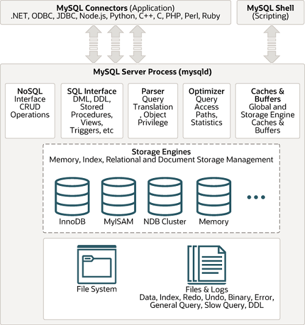

> 8.0 架构图来源[于此](https://dev.mysql.com/doc/refman/8.0/en/pluggable-storage-overview.html)。

</details>

#### binlog 日志

### 存储引擎层

MySQL 是支持可插拔式（类比排插和插头、U 盘和主机）的存储引擎的。MySQL 支持的存储引擎有很多，最常用的是 MyISM 和 InnoDB 。 MyISM 和 InnoDB 的区别如下：

|                    | MyISM                                                                                  | InnoDB                                                                       |
| ------------------ | -------------------------------------------------------------------------------------- | ---------------------------------------------------------------------------- |
| 事务支持和外键支持 | 不支持                                                                                 | 支持                                                                         |
| 锁机制             | 支持表锁，锁定整表                                                                     | 支持行锁，基于索引加锁实现行级锁                                             |
| 索引类型           | 使用非聚集索引                                                                         | 使用聚集索引，即索引和数据记录一起存储                                       |
| 并发支持           | 使用表锁，任何写操作都会锁住整张表，写写并发和读写并发都是串行，可并发读，锁的粒度为表 | 使用行锁、并使用 MVCC 优化读写并发，读读、读写可并发，写写串行，锁的粒度为行 |
| 存储文件类型       | .frm 表结构、.MYD 数据文件、.MYI 索引文件                                              | .frm 表结构、.ibd 数据文件                                                   |
| 适用场景           | 适合不需要事务支持或一致性要求不高，并发度低，读多写少的场景                           | 与 MyISM 相反                                                                |
| 数据组织形式       | B+ 树索引的叶子节点保存数据的物理地址；                                                | B+ 树索引的叶子节点保存数据本身；                                            |

<details class="details custom-block">

<summary>官网-存储引擎特性对比</summary>

Table 15.1 Storage Engines Feature Summary

| Feature                                | MyISAM       | Memory           | InnoDB       | Archive      | NDB          |
| -------------------------------------- | ------------ | ---------------- | ------------ | ------------ | ------------ |
| B-tree indexes                         | Yes          | Yes              | Yes          | No           | No           |
| Backup/point-in-time recovery (note 1) | Yes          | Yes              | Yes          | Yes          | Yes          |
| Cluster database support               | No           | No               | No           | No           | Yes          |
| Clustered indexes                      | No           | No               | Yes          | No           | No           |
| Compressed data                        | Yes (note 2) | No               | Yes          | Yes          | No           |
| Data caches                            | No           | N/A              | Yes          | No           | Yes          |
| Encrypted data                         | Yes (note 3) | Yes (note 3)     | Yes (note 4) | Yes (note 3) | Yes (note 5) |
| Foreign key support                    | No           | No               | Yes          | No           | Yes          |
| Full-text search indexes               | Yes          | No               | Yes (note 6) | No           | No           |
| Geospatial data type support           | Yes          | No               | Yes          | Yes          | Yes          |
| Geospatial indexing support            | Yes          | No               | Yes (note 7) | No           | No           |
| Hash indexes                           | No           | Yes              | No (note 8)  | No           | Yes          |
| Index caches                           | Yes          | N/A              | Yes          | No           | Yes          |
| Locking granularity                    | Table        | Table            | Row          | Row          | Row          |
| MVCC                                   | No           | No               | Yes          | No           | No           |
| Replication support (note 1)           | Yes          | Limited (note 9) | Yes          | Yes          | Yes          |
| Storage limits                         | 256TB        | RAM              | 64TB         | None         | 384EB        |
| T-tree indexes                         | No           | No               | No           | No           | Yes          |
| Transactions                           | No           | No               | Yes          | No           | Yes          |
| Update statistics for data dictionary  | Yes          | Yes              | Yes          | Yes          | Yes          |

> 来自: [MySQL :: MySQL 5.7 Reference Manual :: 15 Alternative Storage Engines](https://dev.mysql.com/doc/refman/5.7/en/storage-engines.html)

</details>

---

## InnoDB 存储引擎

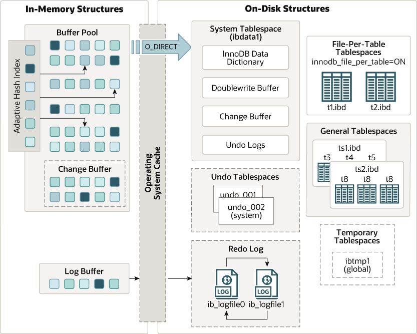

> 5.7 的架构图来源[于此](https://dev.mysql.com/doc/refman/5.7/en/innodb-architecture.html)。

<details class="details custom-block">

<summary>8.0的InnoDB存储引擎的架构图</summary>

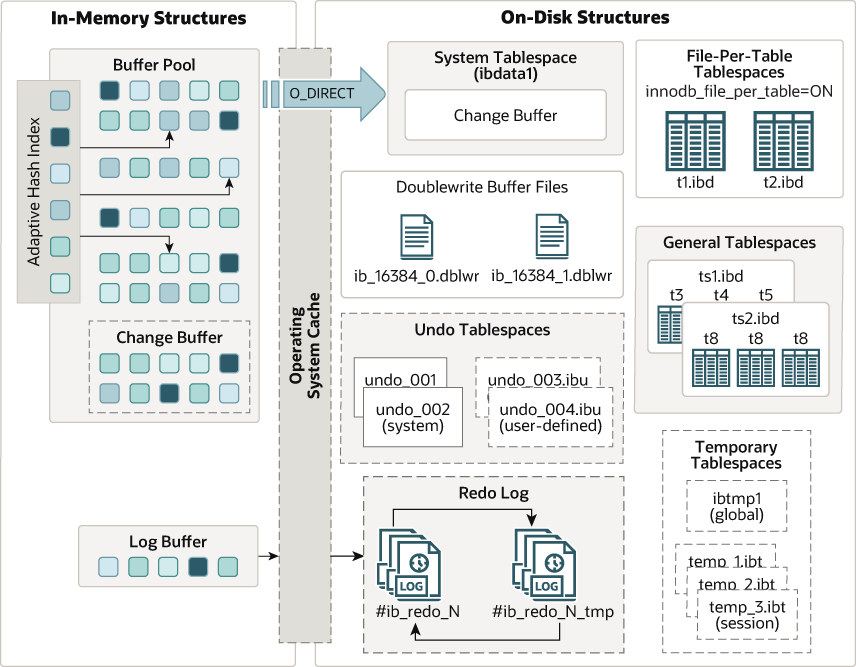

> 8.0 的架构图来源[于此](https://dev.mysql.com/doc/refman/8.0/en/innodb-architecture.html)。

</details>

InnoDB 存储引擎上的架构可以分为三部分：

- 内存部分
  - 由多个缓冲区构成，使用多个缓冲区的目的在于增加临界资源，减少多个线程对缓冲区的竞争，用来提高并发；
  - 每一个缓冲区都被称为一个缓冲区实例，根据存储内容，把缓冲器划分为两类：缓冲池（Buffer Pool，检测 BP） 和 日志缓冲（Log Buffer，缓存写入 log 文件的数据，即 redolog 数据和 undolog 数据）；
  - 每一个缓冲区实例是由多个离散的页（page）组成的，缓存页的大小和磁盘页一样为 16K；
- OS Cache 部分： 操作系统缓存
- 磁盘部分： 包括各种表空间，可以理解为磁盘文件；包括以下 5 中表空间
  - 系统表空间 （System Tablespace，又称共享表空间）
  - 独立表空间（File-Per-Table Tablespaces）
  - undo 表空间（undo Tablespaces）
  - 通用表空间（General Tablespaces）
  - 临时表空间（temporary tablespace）

### 内存部分（In-Memory Structures）


内存部分主要包括两部分： Buffer Pool （包含 Change Buffer）和 Log Buffer ：

- Buffer Pool
  - change pool 以外的区域
    - 创建、划分区域、对数据的管理、扩容、并发、参数配置 【`可以类比Java中对HashMap的理解`】
  - change pool 区域
    - 存放内容、使用过程、配置参数
- Log Buffer
  - 存放内容、配置参数
  - RedoLog
    - 存放内容、一条更新语句的操作过程、与 binlog 实现两阶段提交
  - UndoLog
    - 存放内容、MVCC 多版本并发控制实现原理、事务原子性实现原理、事务持久性实现原理

#### Buffer Pool

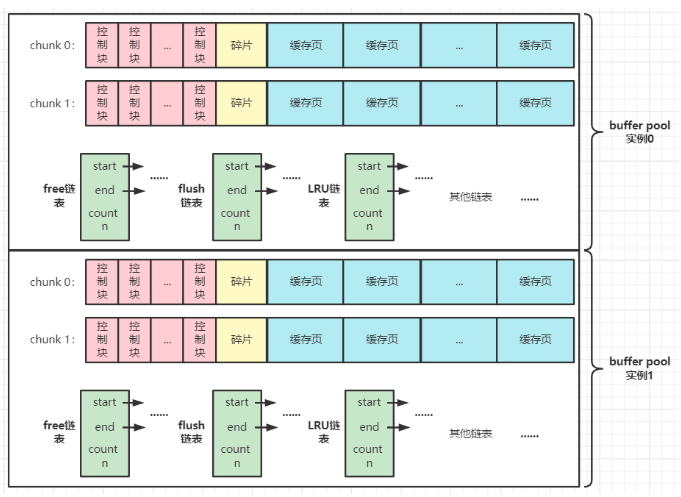

`整个mysql使用的内存区可以划分为多个Buffer Pool ，一个Buffer Pool 可以分为多个块（chunk），每个chunk包含有多个page。`

还有几个链表：

- free 链表
- flush 链表
- LRU 链表

其它的内容还有：

1. 缓冲池的创建

   MySQL 启动时，就会根据配置参数，操作系统申请的一块连续的内存空间，作为 Buffer Pool 缓冲池。存在的目的是为了提高数据访问速率，利用了高速缓存与磁盘的访问速度差异特性。

2. 缓冲池动态扩容

   5.7.5 之前就只是连续的内存空间，要想增加 Buffer Pool 的大小，就需要重新申请一个比原来 Buffer Pool 还要大的连续空间，然后把数据拷贝过去，这样系统开销过大；5.7.5 之后新加了 Buffer Pool 分块的 chunk 特性，让运行期间动态调整 Buffer Pool 的大小成为可能，动态调整 Buffer Pool 时，只需要额外增加几个 chunk，然后链入原有 Buffer Pool 形成新的 Buffer Pool 即可。

3. 缓冲池的管理

   缓冲池管理的基本单位是`缓存页`，缓存页在逻辑上与物理磁盘上的数据文件中的数据页对应，默认大小是 16K。一个 chunk 块中包含多个`缓存页`以及控制缓存页的`描述信息`（如页所属的表空间号、页号、页在缓存中的地址、下一页的指针等）。

   由于`描述信息`的存在，一个设置成 128M 的 chunk ，最后可能变成 130M，多出来的就是`描述信息`的大小。

   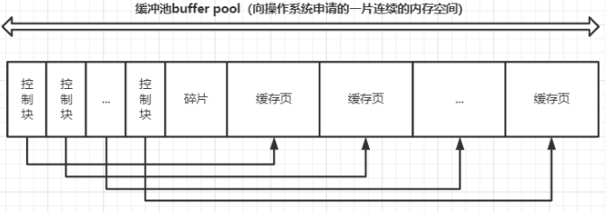

   此外，MySQL 还把缓存页进行分类：

   - `free page` ： 还没有使用到的缓存页；
   - `clean page` ： 已经存入数据但是还没有修改过的缓存页；
   - `dirty page` ： 已经存入数据并且数据也已经被修改过的缓存页  ；

   并且 MySQL 还把这些缓存页的`描述信息`链起来形成三个链表：

   - `free list` - 管理 free page ；
   - `flush list` - 管理 dirty page 并在某个时刻对该链表的脏页进行刷盘，按脏页的修改时间排序，更新操作早的脏页先被刷盘；
   - `lru list` - 正在使用的内存页链表，里面包含 clean page 和 dirty page，也就是说 lru list 中的页包含 flush list 中的所有脏页，使用**最近最少使用**算法；加载新缓存页和修改一个缓存页，都把它的描述信息调到 LRU 链表的头部，让不经常修改的往后排；

   缓冲池根据功能划分，还包括： 多个数据页（data Page）、多个索引页（index Page）、多个 undo 页、多个写缓冲区（change page，简称 CB）、多个自适应哈希索引和其他信息（如锁信息、字典信息）等。

   普通的 lru 算法遵循新数据从链头加入，链表满了需要释放时，就从链尾弹出。这里采用的 LRU 算法是优化后的算法。主要有以下优化点：

   - `添加了一个innodb_old_blocks_pct参数，把lru链分为两段。链头到midpoint的位置存放热数据，称为热端；midpoint到链尾的位置存放冷数据，称为冷端；淘汰数据时只淘汰冷端数据。`默认值为：37 ，表示冷数据占 37%；预读进缓冲池的数据统一都先放到冷端；这样可以有效解决缓冲池预读了不常用的页或扫描（全表扫描、索引扫描、大范围查询）操作查到大量数据，导致热数据被（全部或部分）刷走的问题；
   - `对冷端数据进入热端添加了一个innodb_old_blocks_time参数设置，让冷端数据经过innodb_old_blocks_time时间（这段时间内再次被访问不会进入热端）之后才能进入热端数据。`这样可以有效解决一些不常用的页数据在短时间内被多次访问，让系统误认为它是热数据从而将其放入热点数据的问题；
   - `减少热页在链表上的移动`。热端数据并不是访问一次就移动到链头，而是热端数据后 3/4 的页被访问时，才移动到链头；这样有效解决了热页的频繁移动问题；
   - 还有一些其他优化。

4. 数据页的访问

   InnoDb 访问某页时，不是直接从磁盘读取，而是先从缓冲池（的 lru 链表）读取页；如果没命中缓存，就从磁盘读取页到缓冲池缓存，下次读到相同的页则直接从缓冲池读取，从而减少磁盘 IO。

   问题是怎么知道我要查询的页是否在 buffer pool 呢，难道要对 lru 链表一个个页遍历？遍历是不可能遍历的，这辈子都不可能遍历的。

   其实学过 lru 算法的小伙伴们都知道，lru 算法的实现需要 链表 和 哈希表两个结构。

   innodb 是通过 `页所在表空间号 + 页号` 来定位一个页的，所以缓存一个页时，系统除了将该页的控制块链入 lru 链表之外，还会将 `该页的表空间号 + 页号` 作为`key`，`页的控制块地址`作为`value`写入到哈希表中。

   所以当要访问某个页时，根据该 `表空间号+页号` 即可得知页在不在 buffer pool，在 buffer pool 的哪个地方。

5. 缓冲区的预热

   Mysql 重启时，BP 中的热数据会清空，为此 mysql 提供了缓冲池预热功能，当关机时会把内存中的热数据写入到 ib_buffer_pool 文件中，保存的数据占 lru 的比例可由参数控制，mysql 启动时会自动加载热数据到缓冲池。预热功能默认开启。

6. 缓冲区的预读

   磁盘 IO 按页读取，查询某条记录不是只读取这条记录，而是读取这条记录所在的整个页并缓存。

7. 缓冲区的并发

   - Q1： buffer pool 并发访问的时候需要加锁吗 ？
   - 多线程访问一个 BufferPool，必然是要加锁的。比如，先加锁，然后加载数据页到缓存页，更新 free 链表，更新 lru 链表，再释放锁，接着下一个线程再执行一系列的操作。
   - Q2： buffer pool 并发访问加锁影响性能吗？
   - 大部分情况下，线程都是查询或者更新缓存里的数据，操作都是发生在内存的，微秒级，包括更新 free、flush、lru 链表都是内存操作，速度极快。但是有些情况下，需要读取从磁盘读取数据到缓存页，发生了一次磁盘 IO，耗时就长一些，后面排队的线程自然就多等一会。
   - Q3： 多个 buffer pool 优化并发能力
   - 多个 buffer pool 类似于分段加锁，降低了锁的冲突，多核多线程访问就成倍的提高了性能。每一个缓存页，只会放在其中一个 buffer pool 里面。

8. 三个链表动态的运行过程

   Buffer Pool 在运行中被使用的时候，实际上会频繁的从磁盘上加载数据页到他的缓存页里去，然后 free 链表、flush 链表、lru 链表都会在使用的时候同时被使用。

   比如数据加载到一个缓存页，free 链表里会移除这个缓存页，然后 lru 链表的冷数据区域的头部会放入这个缓存页。

   然后如果你要是修改了一个缓存页，那么 flush 链表中会记录这个脏页，lru 链表中还可能会把你从冷数据区域移动到热数据区域的头部去。

   如果你是查询了一个缓存页，那么此时就会把这个缓存页在 lru 链表中移动到热数据区域去，或者在热数据区域中也有可能会移动到头部去。

   你一边不停的加载数据到缓存页里去，不停的查询和修改缓存数据，然后 free 链表中的缓存页不停的在减少，flush 链表中的缓存页不停的在增加，lru 链表中的缓存页不停的在增加和移动。

   另外一边，你的后台线程不停的在把 lru 链表的冷数据区域的缓存页以及 flush 链表的缓存页，刷入磁盘中来清空缓存页，然后 flush 链表和 lru 链表中的缓存页在减少，free 链表中的缓存页在增加。

9. 写缓冲 Change Buffer

   Change Buffer 是缓冲池 Buffer Pool 的一部分，它默认占整个缓冲池的 25%，最大允许占用 50%，可以通过`innodb_change_buffer_max_size`参数进行设置，也可以根据写操作的量级来调整，`理论上写操作越频繁，Change Buffer带来的性能提升越明显`。

   `其存在目的是为了提高修改数据的性能`。我们在修改数据时，如果缓冲区不存在这条数据，就需要把这条数据所在的页读到缓冲区，之后再对缓冲池中的数据进行修改。这样无形中就增加了磁盘 IO，InnoDB 为了提升性能，设计出了 change buffer ，大概原理就是： 每次修改数据时，先把修改后的结果放到 change buffer 中，后续再进行刷盘。

   修改数据时分为两种情况：

   - `修改的数据所在的页在lru链上`，InnoDB 就会直接在缓冲池中修改这个页，并把这个页变成脏页链入 flush list 中，但是不会马上刷盘，这里不会用到 change buffer；
   - `修改的数据所在的页不在lru链上`，此时按理说应该先从磁盘读取要修改的页，然后放到缓冲池中，然后再修改，之后再刷盘的，但是 InnoDB 没有这样做，而是先把修改操作记录到 change buffer 中，当下次查询时，InnoDB 发现 lru 链上没有这条数据，InnoDB 就会从磁盘读取改数据页，之后再与 change buffer 中的更改进行合并后才链入 lru。如果一段时间后，都没有查询这个修改的页，InnoDB 的后台线程就会定时把 change Buffer 的更改合并到磁盘页中。
   - 有个例外，在修改唯一性约束字段时，由于 InnoDB 要做唯一性校验，因此必须要读取磁盘，把数据读到缓冲池之后，再在 lru 链上的页内修改数据，不会在 change buffer 中操作。

10. 参数配置

```ini
[server]
innodb_buffer_pool_instances = 8 # 代表了有几个buffer pool
innodb_buffer_pool_size = 8589934592 # 代表了buffer pool总共占用多少字节，默认是一个 chunk 的大小，即 134217728 b = 131072 kb = 128 m ;
innodb_buffer_pool_chunk_size = 8589934592 # 调整 chunk 的大小，默认一个 chunk 为128M
```

innodb_page_size： BP 缓冲区大小（单位是页），建议将其设为总内存的 60% ~ 80%
innodb_old_blocks_pct： midpoint 离链尾的百分比，默认 37.5%
innodb_old_blocks_time ： 新页需要隔多长时间才能进入 lru 链表的热端
innodb_buffer_pool_instances ： Buffer Pool 的个数，建议设为多个
innodb_buffer_pool_dump_at_shutdown ： 关闭服务时保存热数据
innodb_buffer_pool_dump_pct： 保存热数据的比例。
innodb_buffer_pool_load_at_startup： 开机时载入热数据

#### Log Buffer

Log Buffer 中主要是 RedoLog 和 UndoLog 的数据页。本质上还是属于 InnoDB 的一种缓存，为了提高性能。`其中 RedoLog 日志被称为重做日志，也被称为事务日志`。

1. IO 模型

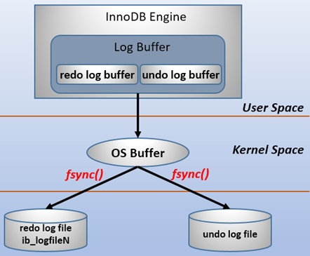

由上面 IO 模型可知：

- LogBuffer 属于用户态内存区域。在内存中划分一部分区域给用户使用，那这部分就被称为用户态（或用户空间）内存，LogBuffer 和 BufferPool 都属于用户态内存；内核态（或内核空间）是指给操作系统使用的这部分内存区域；
- 内存区域易失性决定着用户态内存的易失性。内存中保存的数据需要经由操作系统 IO 调用，写入到磁盘才能完成持久化，所以用户态内存也需要写入到磁盘文件以完成持久化；
- 用户态内存数据持久化到磁盘文件有两种方式：
  - 说明： 上图中的 fsync() 就是操作系统层面的 IO 操作，作用是把 OS Buffer 中数据写入磁盘文件；
  - 一种方式是直接使用用户线程，略过操作系统读写文件的 IO 线程，直接读写磁盘文件，如架构大图中的 O_Direct；
  - 另一种方式就是用户线程调用操作系统的 IO 线程需要调用操作系统的 IO 操作，如 LogBuffer 的持久化方式；

2. LogBuffer 刷盘参数配置

log buffer 用来缓存要写入 log 文件的数据（redo 和 undo）。 `innodb_flush_log_at_trx_commit` 参数控制日志刷新的行为和周期，默认为 1。log 日志刷盘有 3 种策略：

- **innodb_flush_log_at_trx_commit=0** ： 提交事务时，事务日志从 log buffer 写入 OS cache ，之后由主线程以 1s/次的频率执行刷盘（即每隔 1s 调用一次 fsync ），数据库故障或主机宕机则丢失 1 秒数据。
- **innodb_flush_log_at_trx_commit=1** ： 事务提交时，事务日志从 log buffer 写入 os cache， 并立刻刷盘（即立刻调用 fsync ），mysql 服务故障或者主机宕机不会丢失数据，但如果事务频繁，则会频繁发生磁盘 IO。
- **innodb_flush_log_at_trx_commit=2** ： 事务提交时，事务日志直接写入 os cache，每隔 1 秒刷盘（刷盘时机由操作系统配置），刷盘动作交由操作系统完成，mysql 服务故障不会丢失数据，因为数据已经进入操作系统缓存，与 mysql 进程无关了，主机宕机则丢失 1 秒数据。

#### Redolog

```markdown
有了 Buffer Pool 之后，为什么还要有 Log Buffer 中的 Redo Log 呢？
Buffer Pool 里面保存的是从磁盘刷进缓存的数据页以及客户端对数据操作后的写缓存页，而 RedoLog 中记录了关于事务的相关内容；

既然 binlog 中记录了对数据的修改，那是不是就可以使用 binlog 进行数据恢复，为什么还要有 UndoLog 呢？
```

- 作用：
  - 重做日志，也就事务日志，记录数据库中的事务，对数据页的物理操作，如偏移量是多少、做了什么操作等；
- 特点：
  - 满足幂等性： 多次操作得到同一结果的行为只记录一次；
  - 满足事务持久性： 把客户端对数据库的操作写入 Log Buffer 中的 RedoLog 中，并持久化到磁盘文件中，完成对事务的持久化；
  - 不是事务结束时写入的，而是在事务进行过程中，不断被写入重做日志文件中；
  - 落盘时机与事务完成的状态是无关的，只与配置的 LogBuffer 刷盘频率参数和刷盘触发条件有关；
  - RedoLog 磁盘文件大小是固定大小，默认是配置一个分组两个文件（ ib_logfile0 和 ib_logfile1 ），先写 ib_logfile0，写满后，接着写 ib_logfile1 ，再写满后，就覆盖 ib_logfile0 最早的日志，也就是滚动记录的，有一个类似于 hash 环的数据结构，记录着写的位置（write-pos）和擦除位置（ checkpoint ）； write-pos 先于 checkpoint ，二者之间就是事务日志，开始位置到 checkpoint 之间是已经擦除的空闲空间；
  - 只要事务写入磁盘空间，就可以被擦除了；
  - 可以用来进行故障恢复；
- 为什么不直接写磁盘？
  - 浪费：如果只修改了一小部分数据，就直接修改磁盘，会造成不必要的 IO 开销，造成浪费；
    - redo 日志记录的变更内容少，只记录事务涉及到的数据行（具体是数据行所在的表空间 ID、页号、页内偏移和更新后的值），而不是记录行所在的整个页。
  - 随机 IO： 一个事务可能会修改多个数据页，那么直接落盘，就会造成多次随机 IO；
    - redo 行记录是顺序写入磁盘的（顺序 IO），直接按照日志产生时的顺序追加到 redo 日志文件的末尾即可，顺序 IO 比随机 IO 快很多。
- 配置参数：
  - innodb_log_group_home_dir ： 配置 日志组 所在的文件目录
  - innodb_log_files_in_group ： 配置 每个日志组 中的文件数量，默认是 2，ib_logfile0 和 ib_logfile1 为默认的一个组
  - innodb_log_file_size ： 指定重做日志文件的大小
- 刷盘
  - 就是把 LogBuffer 中的 RedoLog 写入到磁盘文件中；
  - 刷盘时机： 不是在事务提交时写入，而是在事务执行过程中不断写入的；
  - 刷盘条件：
    - a. log buffer 空间不足时（log buffer 的空间剩余约 50%左右就会刷盘）；
    - b. 事务提交后的某个时刻刷盘，具体看刷盘策略，可能会在事务提交时马上刷盘、也可能是每秒一次的频率刷盘；
    - c. 关闭服务器时；
    - d. 做 checkpoint 时会把 redo 文件从 checkpoint lsn 开始的一部分 undo 日志刷盘（从 flush 链表刷盘脏页到数据页，然后修改 checkpoint lsn）；
- 故障恢复
  - 简单来说，就是把日志文件中的事务状态为活跃状态的日志，恢复到 MySQL 中；

```markdown
WAL： Write-Ahead Logging，它的关键点就是先写日志，再写磁盘。
crash-safe： 故障恢复，即可以保证即使数据库发生异常重启，之前提交的记录都不会丢失。
```

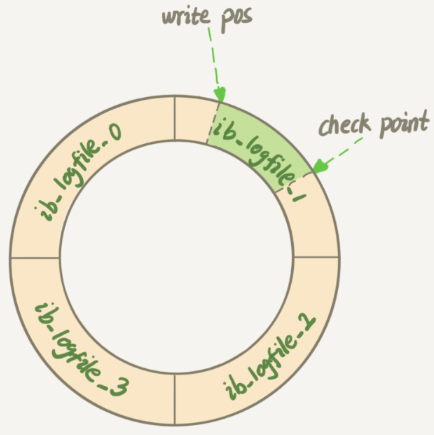


#### Undolog

1. 记录数据变更过程中的每一条记录，并通过指针的方式，把每一条记录都链接起来，形成一个版本链；
2. 通过版本链和读视图的技术手段实现了多版本并发控制，多版本并发控制是一种无锁的隔离级别的实现方案，另一种是多级封锁协议实现的隔离级别的方案；

### 磁盘部分（On-Disk Structures）


一个表空间具有一个唯一的表空间 ID，表空间根据数据存放的类型不一样，划分为：

- 系统表空间
- 独立表空间
- 通用表空间
- undo 表空间
- 临时表空间

> schema： schema 在数据库中表示的是数据库对象集合，它包含了各种对像，比如：表，视图，存储过程，索引等等。

https://dev.mysql.com/doc/refman/5.7/en/innodb-file-space.html

#### 表空间、段、区、页、行

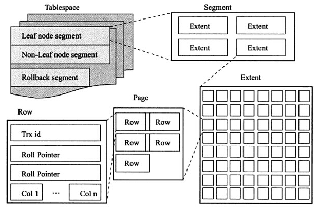

- 从上图可知：
  - 每个独立表空间都对应磁盘上的一个物理文件，命名形式为{table_name}.ibd；
  - 从用户数据记录保存的角度来看，InnoDB 又把保存到 B+ 树上叶子节点和非叶子节点上的数据所在的区（或零散页）进行分组，划分为**叶子节点段**、**非叶子节点段**、**回滚段**等；
  - InnoDB 中的一个索引至少包含两个段： 叶子节点段 和 非叶子节点段
    - 但为了解决部分表数据可能达不到一个区的存储空间，所以为了减少空间浪费，用户记录数据插入表的过程就变成了：
      - 一开始向表插入数据，B+ 树的段从某个碎片区以单个页面为单位申请存储空间；
      - 当某个段已经占用了 32 个碎片区页面之后，会以完整的区为单位申请存储空间，原先占用的碎片区页面不会被复制到新申请的完整的区中；
    - 因此从逻辑上讲，段在物理空间上并不连续，它只是用来保存用户数据的一种空间划分概念，在物理上是由表空间上的若干个零散页和一系列完整的区组成的；
  - 本质上来讲，表空间本质上就是一个存放各种页的页面池，一页大小为 16k，页号用 4 字节表示，因此一个表空间可以有 2^32 = 65535 个页，一个表空间最大可以达到 2^32 \* 16KB = 64TB；
  - 64 个连续的页组成一个区，即 extent ，一个区的大小为 1MB ；
  - InnoDB 存储引擎有表空间、段、区等结构，目的在于：让逻辑上相邻的页面在物理上也相近，从而减少磁盘 IO 所带来的时间消耗；并在此基础上尽可能减少大单位分配存储空间造成的空间浪费；

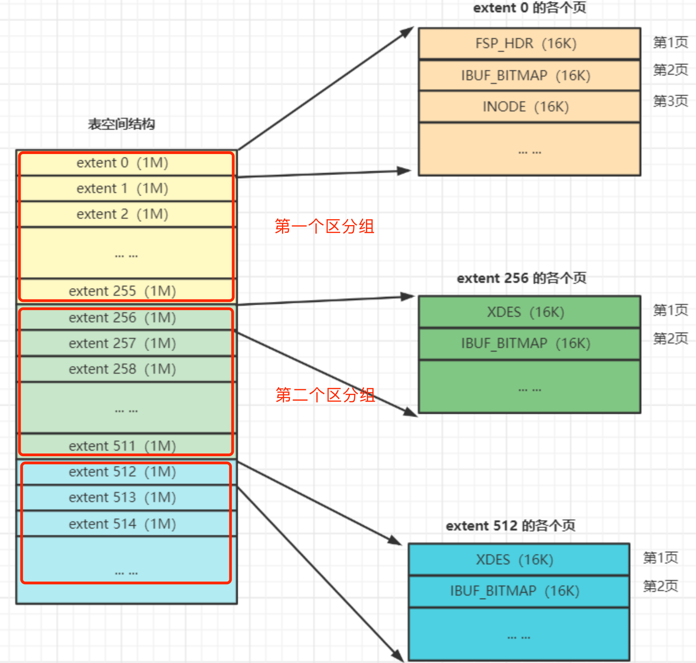

- 从上图可知
  - 256 个区组成一个区分组，一个区分组的大小为 256MB；
  - 一个表空间有多个区分组，每个区分组的第一个区比较特殊：
  - 第一个区分组的第一个区的前 3 页比较特殊。如上图中第一个分组中的 extent0 的前 3 页，第一页保存了表空间的控制信息和本区分组内所有区的控制信息，第二页保存了 change Buffer 的控制信息；第三页保存了零散页的控制信息，一个 Inode 节点中保存了 32 个 fseg extent，可以看做是一个段，并且一个表空间中有 85 个 Inode，这就说明了一个表中最多能有（85-1）/2=42 个索引；
  - 之后的每一个区分组的第一个区的前两页比较特殊。如上图中第二个区分组的 extent0 的前 2 页，第一页保存了本区分组内所有区的控制信息，第二页保存了 change buffer 的控制信息；


#### Row 的组织形式

InnoDB 提供了 4 种行格式，分别是

- Redundant （美: [rɪˈdʌndənt] 英: [rɪ'dʌndənt] ， 冗余的）
- Compact （美: [kəmˈpækt] 英: [kəm'pækt] ，紧凑型的）
- Dynamic （美: [daɪˈnæmɪk] 英: [daɪ'næmɪk] ，动态的）
- Compressed （美（英）: [kəm'prest]，压缩的）

Redundant 是很古老的行格式了， MySQL 5.0 版本之前用的行格式，现在基本没人用了。
由于 Redundant 不是一种紧凑的行格式，所以 MySQL 5.0 之后引入了 Compact 行记录存储方式，Compact 是一种紧凑的行格式，设计的初衷就是为了让一个数据页中可以存放更多的行记录，从 MySQL 5.1 版本之后，行格式默认设置成 Compact 。

Dynamic 和 Compressed 两个都是紧凑的行格式，它们的行格式都和 Compact 差不多，因为都是基于 Compact 改进一点东西。从 MySQL5.7 版本之后，默认使用 Dynamic 行格式。

Redundant 行格式我这里就不讲了，因为现在基本没人用了，这次重点介绍 Compact 行格式，因为 Dynamic 和 Compressed 这两个行格式跟 Compact 非常像。

所以，弄懂了 Compact 行格式，之后你们在去了解其他行格式，很快也能看懂。

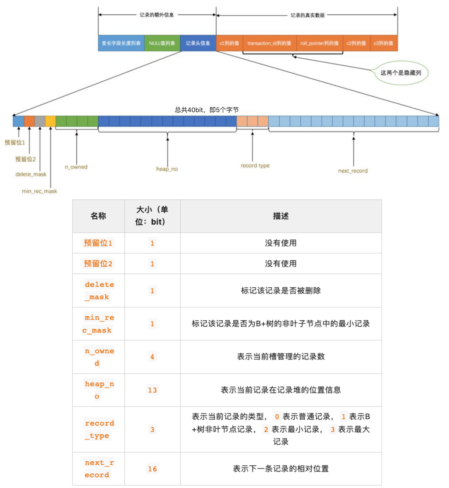

先从整体的视角来来分析一下：

- 数据库表中的每一行数据对应于数据页上的一个 User Record，即对应数据页上的一条『用户记录』；
- 数据页上的每一条『用户记录』就是一行，一行的结构主要分为两部分内容：
  - 行描述信息（即上图中「记录的额外信息」部分）： 用来描述此行数据的元数据【元数据：描述数据的数据】，主要包括三部分内容：「变长字段长度列表」、「Null 值列表」、「记录头信息」
  - 行数据信息（即上图中「记录的真实数据」部分）： 包括两部分内容，一个是数据的真实信息，就是数据库表中一行数据的每一列的数据值；另一部分是数据的隐藏信息，包括「C1 列的值」、「事务 id」、「回滚记录 id」；

下面来分析每一部分内容，先说结论：

- 行描述信息（即上图中「记录的额外信息」部分）
  - 变长字段长度列表`是以变长字段顺序的逆序方式方式存储的，存储的内容为变长字段的长度`，具体使用多少字节来表示一个变长字段的长度，规则如下。
  - Null 值列表`是以Null值逆向位图加高位补0的方式存储的`，具有有没有这部分内容是根据创建表时是否约束了列可不可以为空，如果表中约束了所有列都不为空，那就没有这部分内容。
  - 记录头信息是以 5 字节（40 位）特殊格式存储的，单独说。
- 行数据信息（即上图中「记录的真实数据」部分）
  - 隐藏部分包括「C1 列的值」、「事务 id」、「回滚记录 id」；
  - 真实行数据；

这里我们使用一个表中的数据进行说明，这样更加直观。我们先在数据库中创建一个名为： t_user 的表， ddl 如下：

```sql
CREATE TABLE `t_user` (
  `id` int(11) NOT NULL,
  `name` VARCHAR(20) DEFAULT NULL,
  `phone` VARCHAR(20) DEFAULT NULL,
  `age` int(11) DEFAULT NULL,
  PRIMARY KEY (`id`) USING BTREE
) ENGINE = InnoDB DEFAULT CHARACTER SET = ascii ROW_FORMAT = COMPACT;

```

注意，上面建表语句中选择了字符集为『ascii』，这个字符集的规则是每个字符只占一个字节，而 name 列数据类型为 VARCHAR(20) 表示最多存储 20 个字符，也就是长度最多为 20 个字节，而 20 用一个字节就可以保存了。所以 变长字段所允许的最长字符 M 与 字符集规定的字符占用长度 W 的乘积就是这一列所能存放的数据的最大长度，如果 1 字节能表示出这个最大长度，那么，表示变长字段列表中每一个变长字段的长度的内容就占 1 个字符。

并往里面插入三条数据，结果如下图：

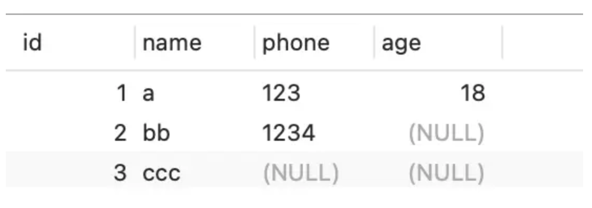
下面我们根据具体表信息，并参照上面结论来解释一下『行描述信息』部分是如何存储的。

上面创建的表中只有 name 、 phone 两列为变长字段列，因此在变长字段长度列表部分是按照 name 列、 phone 列两列的逆序排列的，存储的内容就是这两列的字段长度；此外，这两个字段都允许为空，因此在 Null 列表中，按照列的逆序排列后，为 Null 的那个位就置为 1，不为空的就置为 0，同时如果不足 8 位，那就在高位补 0。

那么第一行数据，根据字符集规则可知 name=a 占用长度为 1 个字节， phone=123 占用长度为 3 个字节，且这一行中并没有 Null 值，因此这一行的存储格式大概是这样的：

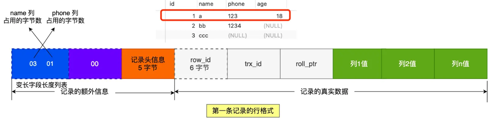

同理，第二行和第三行的数据依次为：

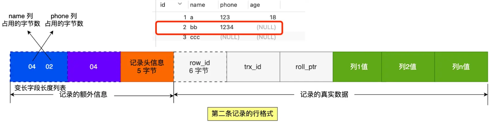

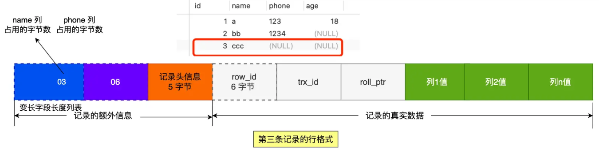

记录头具有特定的格式，具体格式如上图。这里特别说一下几个：

- delete_mask： 标识这行记录是否已经被删除了；
- min_rec_mash： 与页间查找有关，后面会说；
- n_owed：与页内行的分组有关，下面会说；
- head_no： 行记录是一条条紧密地排列着的。因此 User records 区【页结构中的区域】的数据结构是一个堆，也就是说，行记录事实上是保存在数据堆上的，这个字段标识了这行记录在堆上的编号，如下图
- 
- record_type： 标识这行记录的存储数据的类型，0-普通数据记录，1-B+树非叶子节点行记录，2-表示最小记录，3-最大记录；
- next_record： 下一行记录的 next_record 和 cid 列 的中间位置，这样读取数据时，往左是行的描述信息，往右是行的真实数据信息，这也是为什么『变长字段长度列表』部分和『Null 值列表』部分按照字段逆序方式排列的原因；同时，也可以看出多行数据是通过这个字段链起来了，所以相邻行记录之间是通过`单向链表`方式进行链接的。根据记录头中的 next_record 字段，我们可知，多行数据是通过这个字段链接到一起，形成一个单向链表。

数据行总结：

1. 一行数据主要分为两部分内容： 行描述信息 和 真实数据信息。
2. 行描述信息 部分包括变长字段长度列表、Null 值列表【叫 Null 值位图更合适些】、记录头；
3. 真实数据信息 部分包含隐藏数据信息和真实列值信息；
4. 行与行之间是通过记录头中 next_record 字段链接起来的，多行数据链接成一个单向列表；

#### Page 的组织形式


先整体说一下页的组织形式：

- 一页数据为 16k，是 InnoDB 管理数据的基本单位，事实上可以把页划分为四个结构
  - 38 字节的 `File Header` 区
  - 56 字节的 `Page Header` 区
  - 8 字节的 `File Trailer` 区
  - 剩余部分的 `数据堆` 区
- 页具有一定的格式，这个格式就是页的组织形式；

下面具体说一下每一部分的内容。

1. File Header

文件头，页的描述信息，主要包含以下内容。

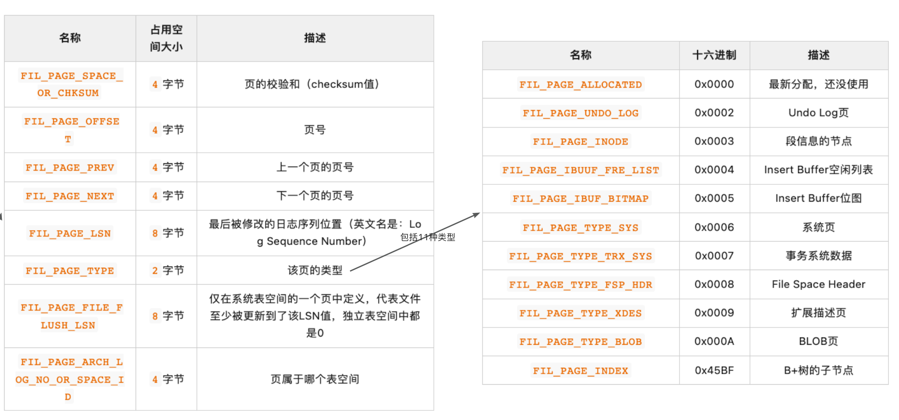

2. Page Header

页头，页的状态信息等，主要包含以下内容：


3. File Trailer

文件结尾，校验页是否完整。

4. 数据堆区

数据堆区是按照数据行的方式进行分配空间的，并规定第一行记录和第二行记录分别为最小值记录和最大值记录，这两行记录的格式与普通行记录的数据格式一致，只不过是真实数据部分保存的是两个单词，并且记录头信息中的 heap_no 值分别为 0 和 1，即：


之后就是一般的数据行信息了，并且这些数据行是紧凑排列的。为了更方便的检索数据，InnoDB 在数据堆区靠近堆末尾的区域，以逆序的方式增加了一块区域，并且里面保存的内容为主键，这块区域就是页目录 Page Directory，页目录在逻辑上就是一个有序数组，数组中的元素称为槽（Slot），每个槽占 2 字节。即：


所以，数据堆 区域的数据组织形式就变成了：

- 页内的所有未被删除的记录（包括 Infimum 和 Supremum）按照索引顺序被划分位几个组，组内的记录也是按索引值升序排的。每个组的最大的记录是“组长”，组内的其他记录是“组员”，组长头信息的 n_owned 属性表示组内有多少记录；
- 将每个组的组长的页内地址（即组长的真实数据开始位置与页中第 0 个字节的距离）提取出来，按顺序存储到靠近页尾部空间的页目录的槽中；

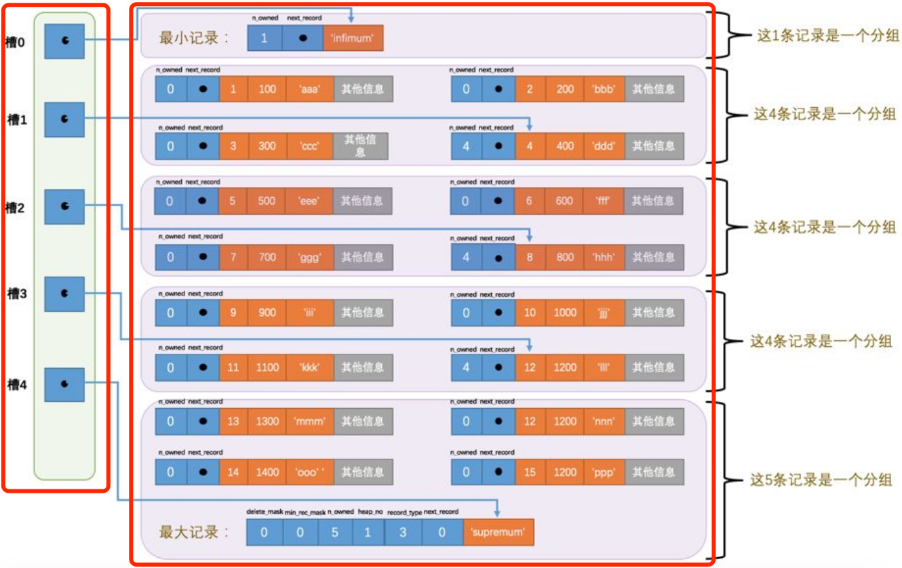

5. 其他

了解完了一行数据以及一页数据的组织形式之后，那就需要了解他们之间的组织形式。

多行数据的组织形式

通过记录头中的 next_record 字段指向下一行记录，把多行数据串起来，形成一个单向链表。

多行数据在单页上的组织形式

整体来说，多行数据存放到一个页的数据堆区域。


多个页之间的组织形式

多个页之间的组织形式，是通过双向链表的方式链接起来了，并且从整个数据库表空间的角度来看，页数据对应于 B+树上的节点，也就是说，B+树上的一个节点就是一个数据页。


页内数据记录的查询

从数据页的结构中，我们可以了解到数据记录之间是通过单向链表的方式把一个页内的数据串起来的。为了方便在页内进行查询，InnoDB 先是把页内所有记录都进行分组，之后又在页内靠近页尾的用户记录区域划分出一小块区域作为页目录，页目录实际上就是一个数组，数组中每一个元素（slot）都链接着一组记录。这样我们每次在页内查找数据时，我们就可以先去页目录上定位到数据记录的分组，然后再从分组信息中找到对应的数据记录。

查找一条数据的过程

查找一条数据的过程大概是这样的：

1. 先定位到数据页
2. 然后根据数据页中的页目录定位到槽
3. 在根据槽去找对应的数据记录分组
4. 最后一一比对

其实在这个章节中，上面这个说法大概反映了查找一条数据记录的真实过程，但是实际上复杂的多，具体细节后续章节再介绍吧。

总结


#### 参考

- [https://github.com/jeremycole/innodb_diagrams/tree/master](https://github.com/jeremycole/innodb_diagrams/tree/master)
- [PolarDB 数据库内核月报 － 2019 / 10](http://mysql.taobao.org/monthly/2019/10/01/)
- [https://github.com/asdbex1078/MySQL/blob/master/mysql-storage-engines/innodb/1.3.3.InnoDB 磁盘结构——表空间.md](https://github.com/asdbex1078/MySQL/blob/master/mysql-storage-engines/innodb/1.3.3.InnoDB%E7%A3%81%E7%9B%98%E7%BB%93%E6%9E%84%E2%80%94%E2%80%94%E8%A1%A8%E7%A9%BA%E9%97%B4.md)
- [https://juejin.cn/book/6844733769996304392/section/6844733770046636040?enter_from=course_center&utm_source=course_center](https://juejin.cn/book/6844733769996304392/section/6844733770046636040?enter_from=course_center&utm_source=course_center)
- [https://www.zbpblog.com/blog-386.html](https://www.zbpblog.com/blog-386.html)

---

### InnoDB 中的工作线程

```sql
mysql> show engine innodb status;

```

把输出结果中无用的信息剔除后：

```sql
=====================================
2023-06-06 03:42:16 0x7fc3dc11d700 INNODB MONITOR OUTPUT
=====================================
Per second averages calculated from the last 21 seconds
-----------------
BACKGROUND THREAD
-----------------
srv_master_thread loops: 1 srv_active, 0 srv_shutdown, 79992 srv_idle
srv_master_thread log flush and writes: 79993
----------
SEMAPHORES
----------
OS WAIT ARRAY INFO: reservation count 2
OS WAIT ARRAY INFO: signal count 2
RW-shared spins 0, rounds 4, OS waits 2
RW-excl spins 0, rounds 0, OS waits 0
RW-sx spins 0, rounds 0, OS waits 0
Spin rounds per wait: 4.00 RW-shared, 0.00 RW-excl, 0.00 RW-sx
------------
TRANSACTIONS
------------
Trx id counter 45571
Purge done for trx's n:o < 0 undo n:o < 0 state: running but idle
History list length 0
LIST OF TRANSACTIONS FOR EACH SESSION:
---TRANSACTION 421954169522016, not started
0 lock struct(s), heap size 1136, 0 row lock(s)
--------
FILE I/O
--------
I/O thread 0 state: waiting for completed aio requests (insert buffer thread)
I/O thread 1 state: waiting for completed aio requests (log thread)
I/O thread 2 state: waiting for completed aio requests (read thread)
I/O thread 3 state: waiting for completed aio requests (read thread)
I/O thread 4 state: waiting for completed aio requests (read thread)
I/O thread 5 state: waiting for completed aio requests (read thread)
I/O thread 6 state: waiting for completed aio requests (write thread)
I/O thread 7 state: waiting for completed aio requests (write thread)
I/O thread 8 state: waiting for completed aio requests (write thread)
I/O thread 9 state: waiting for completed aio requests (write thread)
Pending normal aio reads: [0, 0, 0, 0] , aio writes: [0, 0, 0, 0] ,
 ibuf aio reads:, log i/o's:, sync i/o's:
Pending flushes (fsync) log: 0; buffer pool: 0
467 OS file reads, 53 OS file writes, 7 OS fsyncs
0.00 reads/s, 0 avg bytes/read, 0.00 writes/s, 0.00 fsyncs/s
-------------------------------------
INSERT BUFFER AND ADAPTIVE HASH INDEX
-------------------------------------
Ibuf: size 1, free list len 3092, seg size 3094, 0 merges
merged operations:
 insert 0, delete mark 0, delete 0
discarded operations:
 insert 0, delete mark 0, delete 0
Hash table size 34679, node heap has 0 buffer(s)
Hash table size 34679, node heap has 0 buffer(s)
Hash table size 34679, node heap has 0 buffer(s)
Hash table size 34679, node heap has 0 buffer(s)
Hash table size 34679, node heap has 0 buffer(s)
Hash table size 34679, node heap has 0 buffer(s)
Hash table size 34679, node heap has 0 buffer(s)
Hash table size 34679, node heap has 0 buffer(s)
0.00 hash searches/s, 0.00 non-hash searches/s
---
LOG
---
Log sequence number 23040733278
Log flushed up to   23040733278
Pages flushed up to 23040733278
Last checkpoint at  23040733269
0 pending log flushes, 0 pending chkp writes
10 log i/o's done, 0.00 log i/o's/second
----------------------
BUFFER POOL AND MEMORY
----------------------
Total large memory allocated 137428992
Dictionary memory allocated 117329
Buffer pool size   8192
Free buffers       7719
Database pages     473
Old database pages 0
Modified db pages  0
Pending reads      0
Pending writes: LRU 0, flush list 0, single page 0
Pages made young 0, not young 0
0.00 youngs/s, 0.00 non-youngs/s
Pages read 439, created 34, written 36
0.00 reads/s, 0.00 creates/s, 0.00 writes/s
No buffer pool page gets since the last printout
Pages read ahead 0.00/s, evicted without access 0.00/s, Random read ahead 0.00/s
LRU len: 473, unzip_LRU len: 0
I/O sum[0]:cur[0], unzip sum[0]:cur[0]
--------------
ROW OPERATIONS
--------------
0 queries inside InnoDB, 0 queries in queue
0 read views open inside InnoDB
Process ID=1, Main thread ID=140478756386560, state: sleeping
Number of rows inserted 0, updated 0, deleted 0, read 8
0.00 inserts/s, 0.00 updates/s, 0.00 deletes/s, 0.00 reads/s
----------------------------
END OF INNODB MONITOR OUTPUT
============================

```

从上面输出结果的`FILE I/O`部分可知，总共有四类 IO 工作线程，如下：

- read thread：将数据从磁盘加载到缓存 page 页；
- write thread：将缓存脏页刷新到磁盘；
- log thread：将日志缓冲区刷盘到 log 文件；
- insert buffer thread：将写缓冲 change buffer 的更改内容刷新到磁盘；

#### Master Thread 主线程

负责调度其他线程，优先级最高。主要职能：脏页刷盘（调用 page cleaner thread）、undo 页回收（purge thread）、redo 日志刷新（log thread）、合并写缓冲（insert buffer thread）。如果这些子线程通过配置关闭了，那么关闭的子线程的任务就会由 master thread 来做。

主线程是由多个无限循环构成的，主要有 2 个主处理，分别是每隔 1 秒和 10 秒的处理：

- 每 1 秒的操作（有条件的做）：
  - 刷盘日志缓冲区
  - 合并 change buffer 数据到磁盘的 B+树中，根据 IO 读写压力决定是否操作
  - 刷盘脏页到磁盘（条件是脏页比例达到 75%才操作（innodb_max_dirty_pages_pct），而且不是一次性刷盘所有脏页，而是默认每次刷盘 200 页（innodb_io_capacity））。
- 每 10 秒操作（无条件的做）：
  - 刷盘脏页到磁盘
  - 合并 change buffer 数据
  - 刷盘日志缓冲区
  - 删除无用的 undo 页

#### Purge Thread 线程

事务提交之后，该事务相关的 undo 日志不再需要，Purge Thread 负责回收已分配的 undo 页。默认有 4 个 purge thread。

```sql
mysql> show variables like '%innodb_purge_threads%';
+----------------------+-------+
| Variable_name        | Value |
+----------------------+-------+
| innodb_purge_threads | 4     |
+----------------------+-------+
1 row in set (0.00 sec)

```

#### Page Cleaner thread 线程

将脏数据刷新到磁盘（会调用 write thread 线程），脏数据刷盘后对应的 redo log 也就没用了，可以释放掉这部分 redo log，达到 redo log 循环使用的目的。默认有 1 个 Page Cleaner thread。

```sql
mysql> show variables like '%innodb_page_cleaners%';
+----------------------+-------+
| Variable_name        | Value |
+----------------------+-------+
| innodb_page_cleaners | 1     |
+----------------------+-------+
1 row in set (0.00 sec)

```

#### 总结

InnoDB 中的线程包括两大类：

- 读写工作线程
  - `read thread`：将数据从磁盘加载到缓存 page 页；
  - `write thread`：将缓存脏页刷新到磁盘；
  - `log thread`：将日志缓冲区刷盘到 log 文件；
  - `insert buffer thread`：将写缓冲 change buffer 的更改内容刷新到磁盘；
- 后台辅助线程
  - `Master Thread 主线程`： 负责调度其他线程，优先级最高。主要职能：脏页刷盘（调用 page cleaner thread）、undo 页回收（purge thread）、redo 日志刷新（log thread）、合并写缓冲（insert buffer thread）。如果这些子线程通过配置关闭了，那么关闭的子线程的任务就会由 master thread 来做。
  - `Purge Thread 线程`：事务提交之后，该事务相关的 undo 日志不再需要，Purge Thread 负责回收已分配的 undo 页。默认有 4 个 purge thread。
  - `Page Cleaner thread 线程`：将脏数据刷新到磁盘（会调用 write thread 线程），脏数据刷盘后对应的 redo log 也就没用了，可以释放掉这部分 redo log，达到 redo log 循环使用的目的。默认有 1 个 Page Cleaner thread。

---

TODO: 补充 Binlog

## 提纲

- 作用
- 开启及配置参数、查看 binlog 中的内容
- 适用场景
  - 故障恢复
  - 主从同步

## 作用

Server 层的操作日志。记录**表结构变更**和**表数据变更**的日志。主要用来记录数据变更和主从复制。

## 配置

查看 binlog 日志是否开启，默认是不开启的，需要手动开启：

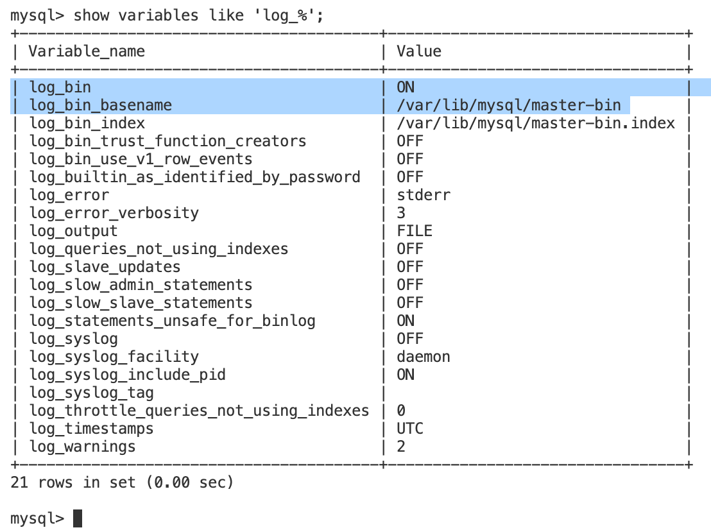

```sql
-- mysql8.4.5
mysql> show variables like 'log_%';
+----------------------------------------+----------------------------------------+
| Variable_name                          | Value                                  |
+----------------------------------------+----------------------------------------+
| log_bin                                | ON                                     |
| log_bin_basename                       | /var/lib/mysql/binlog                  |
| log_bin_index                          | /var/lib/mysql/binlog.index            |
| log_bin_trust_function_creators        | OFF                                    |
| log_error                              | /var/log/mysqld.log                    |
| log_error_services                     | log_filter_internal; log_sink_internal |
| log_error_suppression_list             |                                        |
| log_error_verbosity                    | 2                                      |
| log_output                             | FILE                                   |
| log_queries_not_using_indexes          | OFF                                    |
| log_raw                                | OFF                                    |
| log_replica_updates                    | ON                                     |
| log_slave_updates                      | ON                                     |
| log_slow_admin_statements              | OFF                                    |
| log_slow_extra                         | OFF                                    |
| log_slow_replica_statements            | OFF                                    |
| log_slow_slave_statements              | OFF                                    |
| log_statements_unsafe_for_binlog       | ON                                     |
| log_throttle_queries_not_using_indexes | 0                                      |
| log_timestamps                         | UTC                                    |
+----------------------------------------+----------------------------------------+
20 rows in set (0.02 sec)

```

也可以查看 my.cnf 中的配置，如果没有开启，就需要先开启，并设置好 Binlog 的格式：

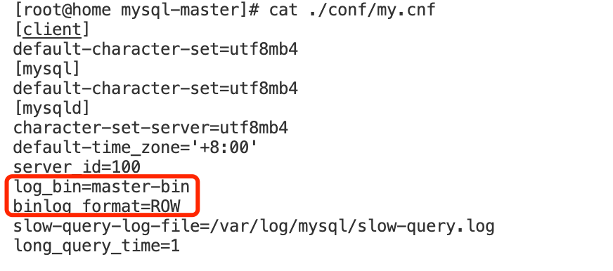

也可以单独查看 binlog 的格式：

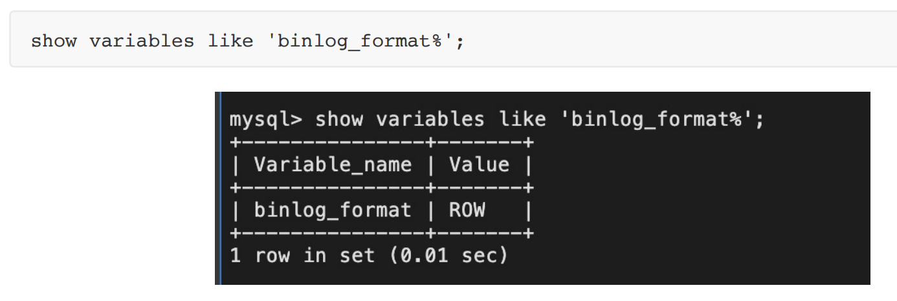

```sql
-- mysql8.4.5
mysql> show variables like 'binlog_format%';
+---------------+-------+
| Variable_name | Value |
+---------------+-------+
| binlog_format | ROW   |
+---------------+-------+
1 row in set (0.01 sec)
```

生成的文件：

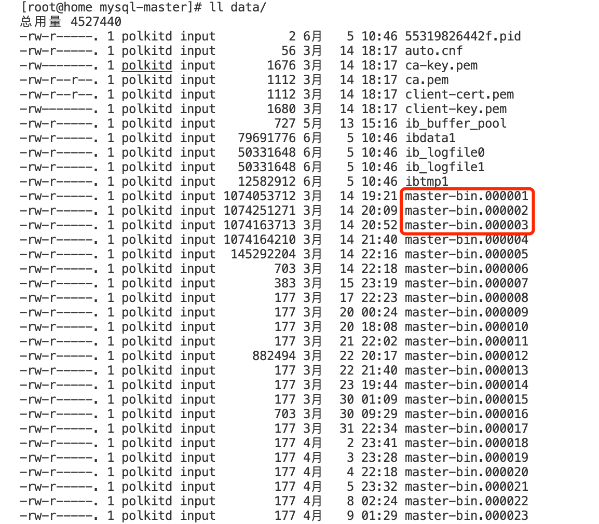

```sql
-- mysql8.4.5
[root@dev mysql]# ll /var/lib/mysql
total 1348868
-rw-r-----. 1 mysql mysql         56 May 26 21:26 auto.cnf
-rw-r-----. 1 mysql mysql        181 Jun  3 11:14 binlog.000004
-rw-r-----. 1 mysql mysql        181 Jun  4 01:15 binlog.000005
-rw-r-----. 1 mysql mysql        181 Jun  4 22:51 binlog.000006
-rw-r-----. 1 mysql mysql        181 Jun  5 20:08 binlog.000007
-rw-r-----. 1 mysql mysql        181 Jun  6 16:26 binlog.000008
-rw-r-----. 1 mysql mysql 1078023821 Jun 10 15:59 binlog.000009
-rw-r-----. 1 mysql mysql        181 Jun 10 22:26 binlog.000010
-rw-r-----. 1 mysql mysql       8269 Jun 12 15:24 binlog.000011
-rw-r-----. 1 mysql mysql      10582 Jun 12 16:02 binlog.000012
-rw-r-----. 1 mysql mysql     243166 Jun 12 17:42 binlog.000013
-rw-r-----. 1 mysql mysql        158 Jun 13 01:05 binlog.000014
-rw-r-----. 1 mysql mysql        181 Jun 13 01:05 binlog.000015
-rw-r-----. 1 mysql mysql        181 Jun 13 15:03 binlog.000016
-rw-r-----. 1 mysql mysql       2375 Jun 19 11:02 binlog.000017
-rw-r-----. 1 mysql mysql   24904063 Jun 19 19:36 binlog.000018
-rw-r-----. 1 mysql mysql        158 Jun 24 02:26 binlog.000019
-rw-r-----. 1 mysql mysql        181 Jun 24 02:27 binlog.000020
-rw-r-----. 1 mysql mysql        181 Jun 24 16:45 binlog.000021
-rw-r-----. 1 mysql mysql        181 Jun 26 00:57 binlog.000022
-rw-r-----. 1 mysql mysql        181 Jun 27 01:21 binlog.000023
-rw-r-----. 1 mysql mysql        158 Jun 27 09:04 binlog.000024
-rw-r-----. 1 mysql mysql        336 Jun 27 09:04 binlog.index
-rw-------. 1 mysql mysql       1680 May 26 21:26 ca-key.pem
-rw-r--r--. 1 mysql mysql       1108 May 26 21:26 ca.pem
-rw-r--r--. 1 mysql mysql       1108 May 26 21:26 client-cert.pem
-rw-------. 1 mysql mysql       1676 May 26 21:26 client-key.pem
drwxr-x---. 2 mysql mysql         22 Jun 19 10:51 db2020
-rw-r-----. 1 mysql mysql    6291456 Jun 27 09:06 #ib_16384_0.dblwr
-rw-r-----. 1 mysql mysql   14680064 Jun 10 16:08 #ib_16384_1.dblwr
-rw-r-----. 1 mysql mysql      19508 Jun 27 01:21 ib_buffer_pool
-rw-r-----. 1 mysql mysql   12582912 Jun 27 09:04 ibdata1
-rw-r-----. 1 mysql mysql   12582912 Jun 27 09:04 ibtmp1
drwxr-x---. 2 mysql mysql       4096 Jun 27 09:04 #innodb_redo
drwxr-x---. 2 mysql mysql        187 Jun 27 09:04 #innodb_temp
drwxr-x---. 2 mysql mysql        143 May 26 21:26 mysql
-rw-r-----. 1 mysql mysql   30408704 Jun 27 09:04 mysql.ibd
srwxrwxrwx. 1 mysql mysql          0 Jun 27 09:04 mysql.sock
-rw-------. 1 mysql mysql          5 Jun 27 09:04 mysql.sock.lock
-rw-r-----. 1 mysql mysql        124 May 26 21:26 mysql_upgrade_history
drwxr-x---. 2 mysql mysql       8192 May 26 21:26 performance_schema
-rw-------. 1 mysql mysql       1680 May 26 21:26 private_key.pem
-rw-r--r--. 1 mysql mysql        452 May 26 21:26 public_key.pem
drwxr-x---. 2 mysql mysql         45 Jun 12 15:35 seata_account
drwxr-x---. 2 mysql mysql         45 Jun 12 15:35 seata_order
drwxr-x---. 2 mysql mysql         76 Jun 12 13:44 seata_server
drwxr-x---. 2 mysql mysql         45 Jun 12 15:35 seata_storage
drwxr-x---. 2 mysql mysql         45 Jun 12 17:18 seata_tcc_account
drwxr-x---. 2 mysql mysql         96 Jun 12 17:18 seata_tcc_order
drwxr-x---. 2 mysql mysql         45 Jun 12 17:18 seata_tcc_storage
-rw-r--r--. 1 mysql mysql       1108 May 26 21:26 server-cert.pem
-rw-------. 1 mysql mysql       1676 May 26 21:26 server-key.pem
drwxr-x---. 2 mysql mysql       8192 Jun 19 17:49 swtest
drwxr-x---. 2 mysql mysql         28 May 26 21:26 sys
drwxr-x---. 2 mysql mysql         59 Jun 10 11:15 test
drwxr-x---. 2 mysql mysql         31 Jun 19 10:50 test_una_saas
-rw-r-----. 1 mysql mysql  100663296 Jun 27 09:06 undo_001
-rw-r-----. 1 mysql mysql  100663296 Jun 27 09:06 undo_002
drwxr-x---. 2 mysql mysql         91 Jun 19 15:57 zipkin
```

配置参数， my.cnf 文件中的 mysqld 节的配置：

- `log_bin` ： 设置 binlog 文件的存放路径及 binlog 文件的名称，如上图，只配置了 binlog 的文件名，则默认路径是 /data 目录，也可以加上路径
- `binlog_format` ： 设置 binlog 的保存格式， STATEMENT、ROW、MIXED， 也可以通过 `set global binlog_format='STATEMENT';` 进行修改，但是重启后修改丢失；
  - `Statement 格式`
    - 保存的内容： 记录操作的步骤，也就是 SQL 语句，比如对表结构中的 A 列进行修改，对 id=10 的那一行数据中的 B 列的值修改成 xxx；
    - 缺点： 但是 SQL 中的函数前后两次执行的结果可能不一致，比如随机函数；
  - `Row 格式`
    - 保存的内容： 记录操作的结果，比如表结构修改后的结果或数据行的修改后的结果
    - 缺点： 但是批量插入的过程可能会产生大量的 binlog 日志，但是在 Statement 格式中可能就一行 SQL 语句；
  - `Mixed 格式`： 混合格式，汲取两者优点。
- `expire_logs_days` ：清理策略，定期清理，如 expire_logs_days=5 表示 5 天清理一次；如果没有配置，就是不清理 binlog 文件；
- `max_binlog_size` ： 滚动 binlog 文件的大小，如 max_binlog_size=500m 表示 master-bin.00001 超过 500m 之后就会生成 master-bin.00002
- `binlog_cache_size` ： binlog cache 的大小， 如 binlog_cache_size=4m 表示 binlog cache 的大小为 4m ；
- `max_binlog_cache_size` ： binlog cache 最大值，如 max_binlog_cache_size=10m 表示 binlog cache 最大为 10m；

## 故障恢复

- `单行恢复`： 只恢复部分数据
  - `delete`：row 格式下，当我们执⾏ delete 命令时，如果 binlog_row_image 设置了 'FULL'，那么 Delete_rows ⾥⾯，包含了删掉的⾏的所有字段的值。如果误删了，因为 binlog 记录了所有字段的值，反向执⾏ insert 就可以了；当 binlog_row_image 设置为 MINIMAL ，只记录关键信息，⽐如 id=80；
  - `insert`：row 格式下，binlog 会 记录 insert 的所有字段值。如果误操作，只需要根据这些值找到对应的⾏，再执⾏ delete 操作即可；
  - `update`：row 格式下，binlog 会 记录 update 修改前、修改后的整⾏数据。如果误操作，只需要⽤修改前的数据覆盖即可；
- `整库恢复`： 使用 binlog 文件恢复数据： `mysqlbinlog mysql-bin.000001 --start-position=1 --stop-position=3000 | mysql - h192.168.0.1 -P3306 -u$user -p$pwd;`， 将 mysql-bin.000001 ⽂件位置从 1 到 3000 的 binlog 在 192.168.0.1 机器的数据库上回放，还原。

## Binlog 刷盘

MySQLServer 层有一块专门的区域，用来放置缓存的信息，这部分被称为 Cache。对 MySQL 进行操作时，MySQLServer 会根据会话创建多个线程，每一个线程都有自己的 Binlog-Cache，Binlog-Cache 达到设置的阈值后，会把 Binlog—Cache 中的数据保存到磁盘上。


其中，write 指的是 把 Binlog-Cache 中的内容写到文件系统中的  page cache 里，此时并没有落到磁盘上，这个阶段不涉及 IO； fsync 才是持久化到磁盘上，这个阶段才会产生 IO。

MySQL 提供了一个 sync_binlog 参数用来控制 binlog-cache 刷到磁盘上的频率：

- `sync_binlog = 0`， 表示每次提交事务都只 write ， 不 fsync ， 具体何时刷到磁盘上，由操作系统来决定；这种方式风险较大，一旦主机重启，没有刷到磁盘上的 binlog 就会丢失；
- `sync_binlog = 1` ， 表示每次提交事务都会 write，然后马上执行 fsync； 这种方式虽然最多只会丢失一个事务操作，但是会导致并发度下降；
- `sync_binlog = N (N>1)`  ， 表示每次提交事务都 write，但累积 N 个事务后才 fsync； 这种方式最恰当，最多只会丢失 N 个事务操作；

## [不重要]BinLog 查看

### 方式一

- 查看的语法

```sql
mysql> show binlog events [IN 'log_name'] [FROM pos] [LIMIT [offset,] row_count];

选项解析：
  IN 'log_name' 指定要查询的binlog文件名(不指定就是第一个binlog文件)
  FROM pos 指定从哪个pos起始点开始查起(不指定就是从整个文件首个pos点开始算)
  LIMIT [offset,] 偏移量(不指定就是0)
  row_count 查询总条数(不指定就是所有行)

```

- 结果分析： 结果是一张表
  - Log_name： binlog 文件名
  - Pos： 起始位置
  - Event_type： 记录的事件类型
  - Server_id： 服务器 id
  - End_log_pos： 结束位置
  - Info： 具体信息

### 方式二

也可以使用 MySQL 提供的 binlog 查看工具直接查看 binlog 文件内容，如：

> mysqlbinlog -vv mysql-bin.000001 --start-position=2986;

### 查询示例

- binlog 格式为 row 的查询示例

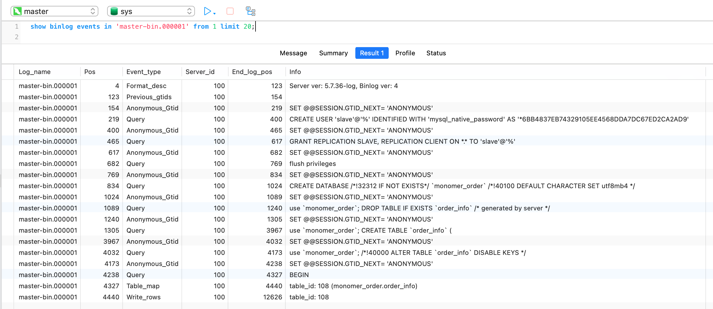

<details class="details custom-block">

<summary>示例</summary>

```sql
mysql> show binlog events in 'master-bin.000001' from 1 limit 20\G
*************************** 1. row ***************************
   Log_name: master-bin.000001
        Pos: 4
 Event_type: Format_desc
  Server_id: 100
End_log_pos: 123
       Info: Server ver: 5.7.36-log, Binlog ver: 4
*************************** 2. row ***************************
   Log_name: master-bin.000001
        Pos: 123
 Event_type: Previous_gtids
  Server_id: 100
End_log_pos: 154
       Info:
*************************** 3. row ***************************
   Log_name: master-bin.000001
        Pos: 154
 Event_type: Anonymous_Gtid
  Server_id: 100
End_log_pos: 219
       Info: SET @@SESSION.GTID_NEXT= 'ANONYMOUS'
*************************** 4. row ***************************
   Log_name: master-bin.000001
        Pos: 219
 Event_type: Query
  Server_id: 100
End_log_pos: 400
       Info: CREATE USER 'slave'@'%' IDENTIFIED WITH 'mysql_native_password' AS '*6BB4837EB74329105EE4568DDA7DC67ED2CA2AD9'
*************************** 5. row ***************************
   Log_name: master-bin.000001
        Pos: 400
 Event_type: Anonymous_Gtid
  Server_id: 100
End_log_pos: 465
       Info: SET @@SESSION.GTID_NEXT= 'ANONYMOUS'
*************************** 6. row ***************************
   Log_name: master-bin.000001
        Pos: 465
 Event_type: Query
  Server_id: 100
End_log_pos: 617
       Info: GRANT REPLICATION SLAVE, REPLICATION CLIENT ON *.* TO 'slave'@'%'
*************************** 7. row ***************************
   Log_name: master-bin.000001
        Pos: 617
 Event_type: Anonymous_Gtid
  Server_id: 100
End_log_pos: 682
       Info: SET @@SESSION.GTID_NEXT= 'ANONYMOUS'
*************************** 8. row ***************************
   Log_name: master-bin.000001
        Pos: 682
 Event_type: Query
  Server_id: 100
End_log_pos: 769
       Info: flush privileges
*************************** 9. row ***************************
   Log_name: master-bin.000001
        Pos: 769
 Event_type: Anonymous_Gtid
  Server_id: 100
End_log_pos: 834
       Info: SET @@SESSION.GTID_NEXT= 'ANONYMOUS'
*************************** 10. row ***************************
   Log_name: master-bin.000001
        Pos: 834
 Event_type: Query
  Server_id: 100
End_log_pos: 1024
       Info: CREATE DATABASE /*!32312 IF NOT EXISTS*/ `monomer_order` /*!40100 DEFAULT CHARACTER SET utf8mb4 */
*************************** 11. row ***************************
   Log_name: master-bin.000001
        Pos: 1024
 Event_type: Anonymous_Gtid
  Server_id: 100
End_log_pos: 1089
       Info: SET @@SESSION.GTID_NEXT= 'ANONYMOUS'
*************************** 12. row ***************************
   Log_name: master-bin.000001
        Pos: 1089
 Event_type: Query
  Server_id: 100
End_log_pos: 1240
       Info: use `monomer_order`; DROP TABLE IF EXISTS `order_info` /* generated by server */
*************************** 13. row ***************************
   Log_name: master-bin.000001
        Pos: 1240
 Event_type: Anonymous_Gtid
  Server_id: 100
End_log_pos: 1305
       Info: SET @@SESSION.GTID_NEXT= 'ANONYMOUS'
*************************** 14. row ***************************
   Log_name: master-bin.000001
        Pos: 1305
 Event_type: Query
  Server_id: 100
End_log_pos: 3967
       Info: use `monomer_order`; CREATE TABLE `order_info` (
  `id` bigint(32) NOT NULL AUTO_INCREMENT,
  `order_no` varchar(32) NOT NULL COMMENT '订单号',
  `order_amount` decimal(8,2) NOT NULL COMMENT '订单金额',
  `merchant_id` bigint(32) NOT NULL COMMENT '商户ID',
  `user_id` bigint(32) NOT NULL COMMENT '用户ID',
  `order_freight` decimal(8,2) NOT NULL DEFAULT '0.00' COMMENT '运费',
  `order_status` tinyint(3) NOT NULL DEFAULT '0' COMMENT '订单状态,10待付款，20待接单，30已接单，40配送中，50已完成，55部分退款，60全部退款，70取消订单',
  `trans_time` timestamp NOT NULL DEFAULT CURRENT_TIMESTAMP ON UPDATE CURRENT_TIMESTAMP COMMENT '交易时间',
  `pay_status` tinyint(3) NOT NULL DEFAULT '2' COMMENT '支付状态,1待支付,2支付成功,3支付失败',
  `recharge_time` timestamp NOT NULL DEFAULT CURRENT_TIMESTAMP COMMENT '支付完成时间',
  `pay_amount` decimal(8,2) NOT NULL DEFAULT '0.00' COMMENT '实际支付金额',
  `pay_discount_amount` decimal(8,2) NOT NULL DEFAULT '0.00' COMMENT '支付优惠金额',
  `address_id` bigint(32) NOT NULL COMMENT '收货地址ID',
  `delivery_type` tinyint(3) NOT NULL DEFAULT '2' COMMENT '配送方式，1自提。2配送',
  `delivery_status` tinyint(3) DEFAULT '0' COMMENT '配送状态，0 配送中，2已送达，3待收货，4已送达',
  `delivery_expect_time` timestamp NULL DEFAULT NULL COMMENT '配送预计送达时间',
  `delivery_complete_time` timestamp NULL DEFAULT NULL COMMENT '配送送达时间',
  `delivery_amount` decimal(8,2) NOT NULL DEFAULT '0.00' COMMENT '配送运费',
  `coupon_id` bigint(32) DEFAULT NULL COMMENT '优惠券id',
  `cancel_time` timestamp NULL DEFAULT NULL COMMENT '订单取消时间',
  `confirm_time` timestamp NULL DEFAULT NULL COMMENT '订单确认时间',
  `remark` varchar(512) DEFAULT NULL COMMENT '订单备注留言',
  `create_user` bigint(32) DEFAULT NULL COMMENT '创建用户',
  `update_user` bigint(32) DEFAULT NULL COMMENT '更新用户',
  `create_time` timestamp NOT NULL DEFAULT CURRENT_TIMESTAMP COMMENT '创建时间',
  `update_time` timestamp NULL DEFAULT NULL ON UPDATE CURRENT_TIMESTAMP COMMENT '更新时间',
  `delete_flag` tinyint(4) NOT NULL DEFAULT '0' COMMENT '逻辑删除标记',
  PRIMARY KEY (`id`,`order_no`),
  KEY `inx_merchant_id_update_time` (`merchant_id`,`update_time`),
  KEY `inx_create_time` (`create_time`,`order_no`),
  KEY `inx_trans_time` (`trans_time`),
  KEY `inx_order_no` (`order_no`)
) ENGINE=InnoDB AUTO_INCREMENT=96311264 DEFAULT CHARSET=utf8 ROW_FORMAT=DYNAMIC COMMENT='订单表'
*************************** 15. row ***************************
   Log_name: master-bin.000001
        Pos: 3967
 Event_type: Anonymous_Gtid
  Server_id: 100
End_log_pos: 4032
       Info: SET @@SESSION.GTID_NEXT= 'ANONYMOUS'
*************************** 16. row ***************************
   Log_name: master-bin.000001
        Pos: 4032
 Event_type: Query
  Server_id: 100
End_log_pos: 4173
       Info: use `monomer_order`; /*!40000 ALTER TABLE `order_info` DISABLE KEYS */
*************************** 17. row ***************************
   Log_name: master-bin.000001
        Pos: 4173
 Event_type: Anonymous_Gtid
  Server_id: 100
End_log_pos: 4238
       Info: SET @@SESSION.GTID_NEXT= 'ANONYMOUS'
*************************** 18. row ***************************
   Log_name: master-bin.000001
        Pos: 4238
 Event_type: Query
  Server_id: 100
End_log_pos: 4327
       Info: BEGIN
*************************** 19. row ***************************
   Log_name: master-bin.000001
        Pos: 4327
 Event_type: Table_map
  Server_id: 100
End_log_pos: 4440
       Info: table_id: 108 (monomer_order.order_info)
*************************** 20. row ***************************
   Log_name: master-bin.000001
        Pos: 4440
 Event_type: Write_rows
  Server_id: 100
End_log_pos: 12626
       Info: table_id: 108
20 rows in set (0.00 sec)

```

</details>

> mysqlbinlog -vv mysql-bin.000001 --start-position=2986;

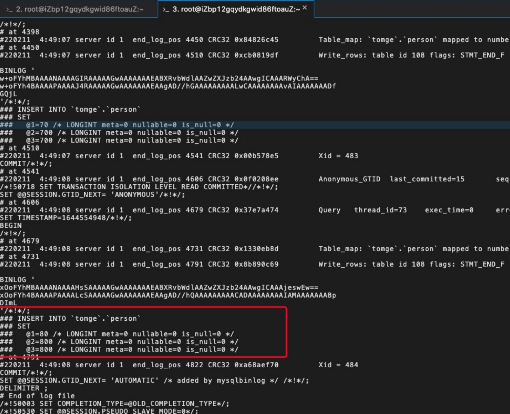

- binlog 格式为 Statement 的查询示例

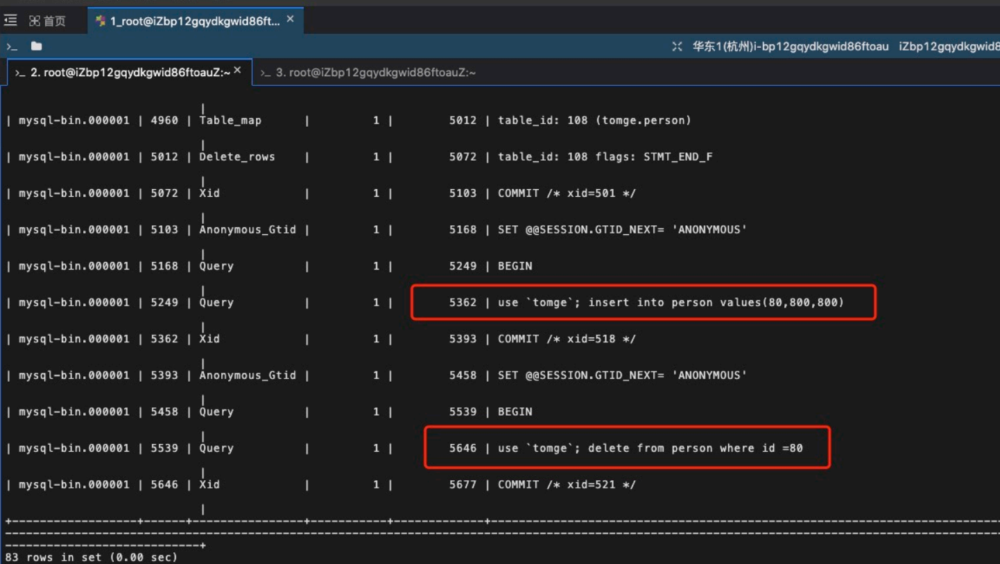

```sql
-- mysql8.4.5
[root@dev mysql]# mysqlbinlog -vv binlog.000008 --start-position=1000;
# The proper term is pseudo_replica_mode, but we use this compatibility alias
# to make the statement usable on server versions 8.0.24 and older.
/*!50530 SET @@SESSION.PSEUDO_SLAVE_MODE=1*/;
/*!50003 SET @OLD_COMPLETION_TYPE=@@COMPLETION_TYPE,COMPLETION_TYPE=0*/;
DELIMITER /*!*/;
# at 158
#250606 11:21:26 server id 1  end_log_pos 127 CRC32 0xed816773  Start: binlog v 4, server v 8.4.5 created 250606 11:21:26 at startup
ROLLBACK/*!*/;
BINLOG '
tl5CaA8BAAAAewAAAH8AAAAAAAQAOC40LjUAAAAAAAAAAAAAAAAAAAAAAAAAAAAAAAAAAAAAAAAA
AAAAAAAAAAAAAAAAAAC2XkJoEwANAAgAAAAABAAEAAAAYwAEGggAAAAAAAACAAAACgoKKioAEjQA
CigAAAFzZ4Ht
'/*!*/;
SET @@SESSION.GTID_NEXT= 'AUTOMATIC' /* added by mysqlbinlog */ /*!*/;
DELIMITER ;
# End of log file
/*!50003 SET COMPLETION_TYPE=@OLD_COMPLETION_TYPE*/;
/*!50530 SET @@SESSION.PSEUDO_SLAVE_MODE=0*/;


mysql> use sys
Reading table information for completion of table and column names
You can turn off this feature to get a quicker startup with -A

Database changed

mysql> show binlog events in 'binlog.000012' limit 10;
+---------------+-----+----------------+-----------+-------------+--------------------------------------------------------------------------------------------------------------------------------------------------------------------------------------------------------------------------------+
| Log_name      | Pos | Event_type     | Server_id | End_log_pos | Info
                                                                                           |
+---------------+-----+----------------+-----------+-------------+--------------------------------------------------------------------------------------------------------------------------------------------------------------------------------------------------------------------------------+
| binlog.000012 |   4 | Format_desc    |         1 |         127 | Server ver: 8.4.5, Binlog ver: 4
                                                                                           |
| binlog.000012 | 127 | Previous_gtids |         1 |         158 |
                                                                                           |
| binlog.000012 | 158 | Anonymous_Gtid |         1 |         235 | SET @@SESSION.GTID_NEXT= 'ANONYMOUS'
                                                                                           |
| binlog.000012 | 235 | Query          |         1 |         368 | DROP DATABASE `seata_account` /* xid=151 */
                                                                                           |
| binlog.000012 | 368 | Anonymous_Gtid |         1 |         445 | SET @@SESSION.GTID_NEXT= 'ANONYMOUS'
                                                                                           |
| binlog.000012 | 445 | Query          |         1 |         572 | DROP DATABASE `seata_order` /* xid=153 */
                                                                                           |
| binlog.000012 | 572 | Anonymous_Gtid |         1 |         649 | SET @@SESSION.GTID_NEXT= 'ANONYMOUS'
                                                                                           |
| binlog.000012 | 649 | Query          |         1 |         782 | DROP DATABASE `seata_storage` /* xid=155 */
                                                                                           |
| binlog.000012 | 782 | Anonymous_Gtid |         1 |         861 | SET @@SESSION.GTID_NEXT= 'ANONYMOUS'
                                                                                           |
| binlog.000012 | 861 | Query          |         1 |        1173 | --
-- Current Database: `seata_account`
--

| binlog.000012 | 861 | Query          |         1 |        1173 | --
-- Current Database: `seata_account`
| binlog.000012 | 861 | Query          |         1 |        1173 | --
-- Current Database: `seata_account`
--
| binlog.000012 | 861 | Query          |         1 |        1173 | --
-- Current Database: `seata_account`
| binlog.000012 | 861 | Query          |         1 |        1173 | --
| binlog.000012 | 861 | Query          |         1 |        1173 | --
| binlog.000012 | 861 | Query          |         1 |        1173 | --
-- Current Database: `seata_account`
| binlog.000012 | 861 | Query          |         1 |        1173 | --
| binlog.000012 | 861 | Query          |         1 |        1173 | --
-- Current Database: `seata_account`
--

CREATE DATABASE /*!32312 IF NOT EXISTS*/ `seata_account` /*!40100 DEFAULT CHARACTER SET utf8mb4 COLLATE utf8mb4_0900_ai_ci */ /*!80016 DEFAULT ENCRYPTION='N' */ /* xid=174 */ |
+---------------+-----+----------------+-----------+-------------+--------------------------------------------------------------------------------------------------------------------------------------------------------------------------------------------------------------------------------+
10 rows in set (0.00 sec)
```
