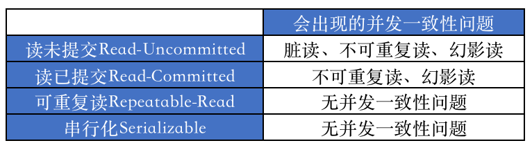
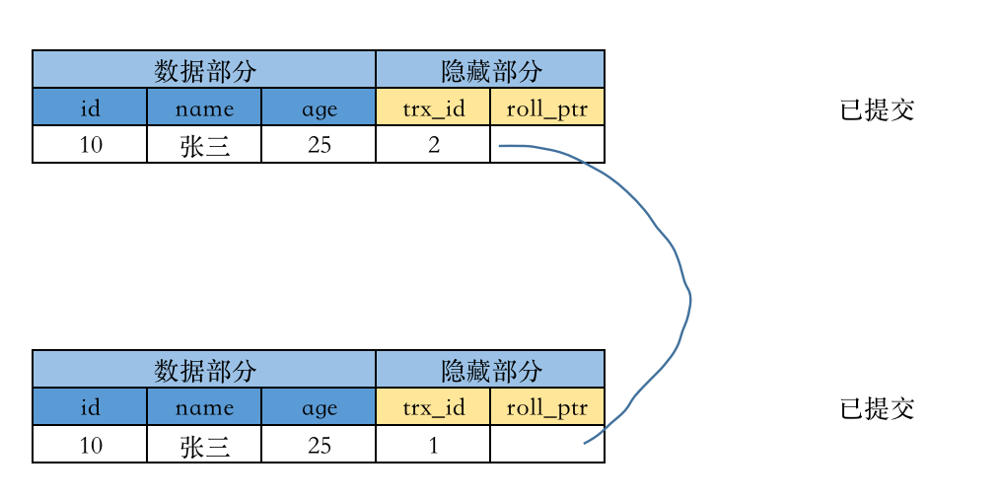
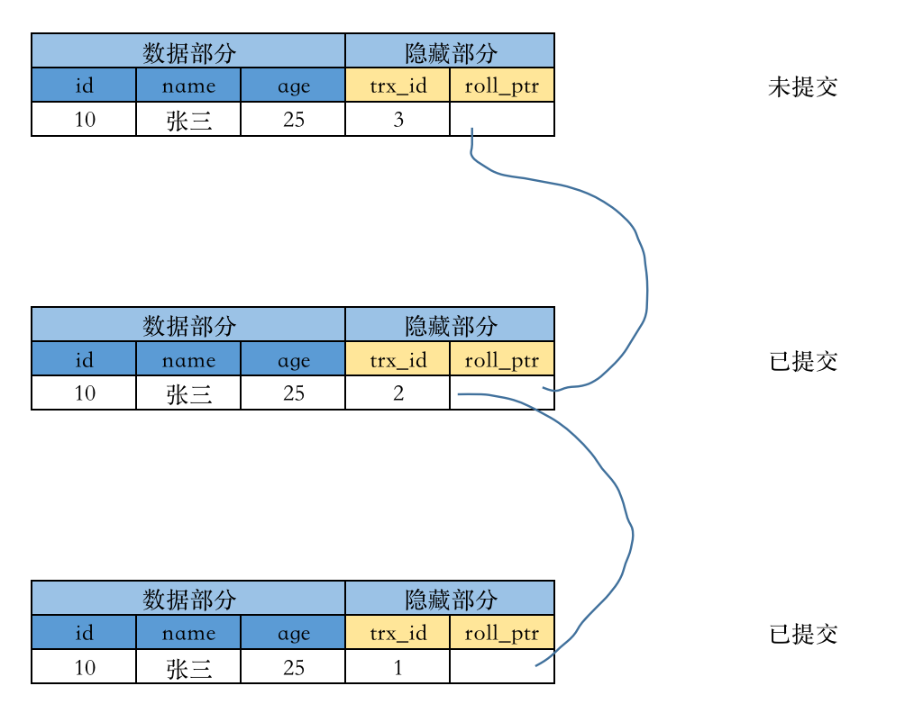
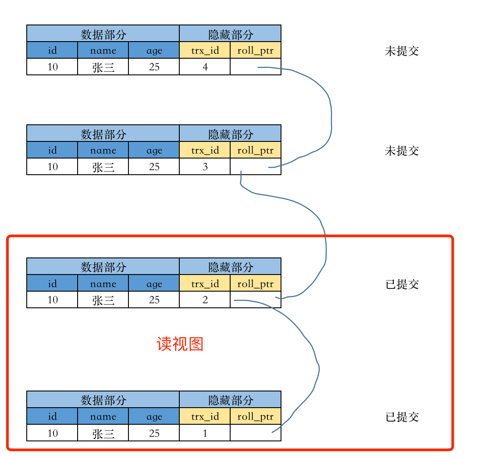
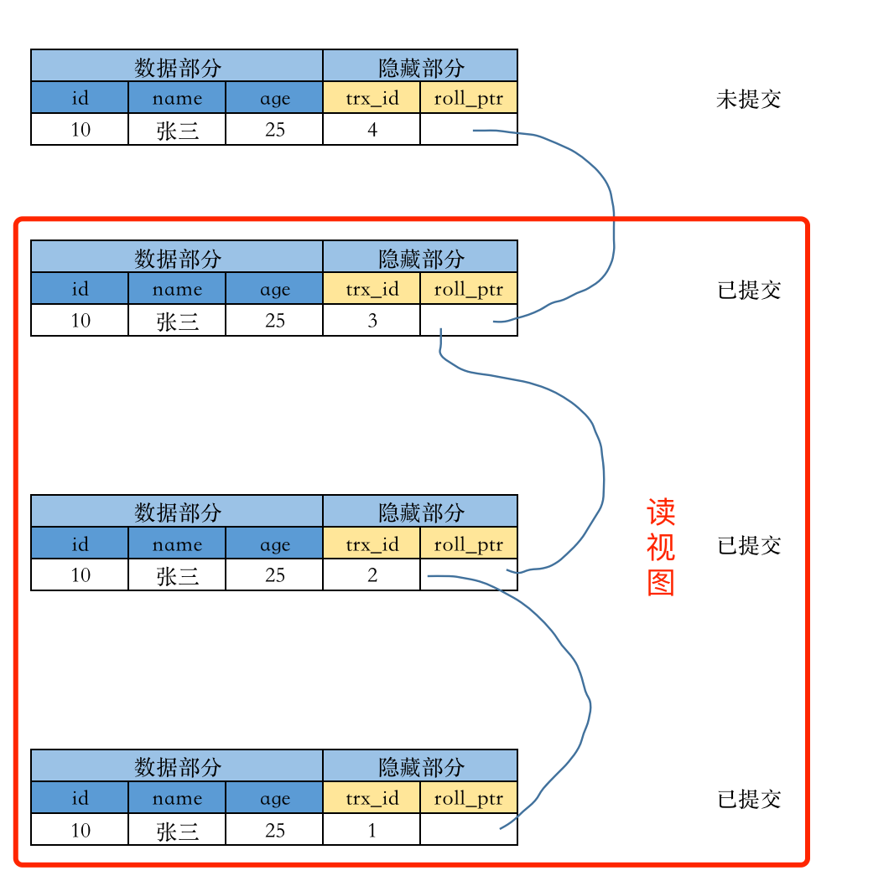
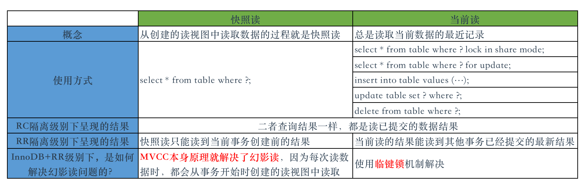

1. `发现问题`：数据库中的单个操作并发执行是没有问题的，但是多个操作组合起来之后，再进行并发执行时，就会出现各种错误，此时遇到了问题。
2. `研究问题`：遇到了问题就要研究。数据库设计者们首先把多个原子操作的组合操作，命名成`事务`，接着他们在研究事务的一些特征特点时，发现有`ACID`的一些特性，也就是`事务具有ACID的特性`。于是，上述的问题就变成了： 多个事务并发操作时，出现了一系列的问题。他们再次对`这些问题`进行概念化，于是他们就把这些问题叫做`并发一致性问题`。
3. `解决问题`： 出现了问题就要解决，数据库设计者们在研究并解决并发一致性问题时，提出了`锁及多级封锁协议`的解决方案，后来人们又发现一个规律： `封锁粒度的不同，能解决的并发一致性问题和数据库所呈现的并发性能也不同`，于是他们就根据锁粒度与并发度之间的关系，继而又提出了`隔离级别`的概念。
4. `发展问题`： 有了隔离级别，人们又想如何更大限度的压榨数据库的并发性能，所以根据`有锁方案`又设计出`无锁方案`，即`MVCC`方案。

我们在发展中发现问题，并在解决问题中不断完善。所以，理论的发展往往伴随着问题的发现与解决。因此，也非常有必要了解一下在数据库实践过程中遇到的问题以及产生的相关的理论。

## 理论层面

所谓理论层面，就是指针对市场上流行的所有的数据库产品来说，这些理论方面的内容都适用，换句话来说这些理论，并不是某一款数据库产品所独有的。

### 事务

数据库的原子操作就是增删改查，如果一个需求中需要一组原子操作，并且这些原子操作满足 ACID 这样的特性，那么就可以说这组原子操作为一个事务。

### 事务特性-ACID

- `A-原子性`，事务中的每一个操作都具备原子性，由多个这样的原子操作组成的事务也具备原子性，即这组原子操作要么全部成功，要么全部失败，不可能存在一部分操作成功，一部分操作失败的情况；
- `C-一致性`，事务完成的前后的数据是一致的，比如转账业务中的事务提交前后，总金额是一致的；
- `I-隔离性`，事务与事务之间是隔离的，也即事务 A 无法看到事务 B 的中间状态；
- `D-持久性`，事务完成后会持久化到磁盘中；

原子性、隔离性、持久性保证了一致性。

举个例子来说明一下 ACID 特性，在转账业务中，A 向 B 转账，业务逻辑是要这样的：

1. 先从 A 的账户上扣除 100 元钱；
2. 然后再往 B 账户上增加 100 元钱；
3. 生成一条转账记录；

在实际过程中，上面的这个业务逻辑是需要三条语句来完成的，即：先 update 账户 A 的金额，然后再 update 账户 b 的金额，最后在转账表里面 insert 一条转账记录。

1. 所谓`原子性`，就是指，在转账过程中，上面业务逻辑中的三条 SQL 语句是不会出现“一条成功、其余两条失败”或“两条成功、一条失败”的情况的，只能出现三条 SQL 全部成功或全部失败的结果，也就是说这三条语句执行的结果必须是与一条语句执行的结果一样；
2. 所谓`一致性`，就是指，A 和 B 的总金额在转账完成前后是一致的，不能出现转账之前两人的总金额为 1000 元，转完账之后俩人总金额变成 900 元或 1100 元的情况；
3. 所谓`隔离性`，就是指，如果再有 C 向 D 转账的业务操作，C 和 D 是看不到 A 向 B 转账的过程的；
4. 所谓`持久性`，就是指，转账业务操作完成后，三条 SQL 的操作结果是要记录到磁盘的，不会随着数据库的停机而消失不见；

### 并发一致性问题

1. `多个事务并发执行时才会出现并发一致性问题`。当我们谈起并发一致性问题时，我们究竟是在讨论什么？并发一致性问题，本质上是组成事务的多个原子操作具有无序性造成的，而无序性是说多个事务的多个原子操作组合起来是无序的，但是在单个事务内部是有序的。
2. `并发一致性问题是以事务为单位出现的`。比如单个脏读的问题是因为事务 A 读到了事务 B 的还没有提交或回滚的数据，这个过程中包括了事务 A 读取数据的读取操作和事务 B 的更新操作以及后面的提交或回滚操作。如果不是以事务为单位的话，那么这几个操作就不会出现问题。所以在讨论如何解决这些问题的时候，基本上都是以事务为基本单位来讨论的。网络上还有另外一种讨论并发一致性问题的说法——基于线程来讨论并发一致性问题，这种说法也不无道理，但是不够准确。

所谓并发一致性问题，就是在数据库层面，我们在对数据库并发操作时，数据库对我们的响应结果（主要是数据响应）产生的不一致的问题，也就是说`多个事务并发操作时发生了数据不一致性问题`。例如，下面的几种情况：

- `丢失更新`： 事务 A 修改了一个数据，在提交前被事务 B 提交的操作覆盖掉了；
- `脏读`： 事务 B 读到了事务 A 未提交的更新数据； 读事务未提交前有读事务介入；
- `不可重复读`： 事务 A 读取一个数据之后，这个数据被事务 B 修改，之后事务 A 再次读取这个数据，结果事务 A 两次读取同一个数据结果不一致；
- `幻影读`： 事务 A 读取一个范围内的数据，之后这个范围内的数据被 B 修改，之后事务 A 再次读取这个数据，结果不一致；

> 针对丢失更新，

### 隔离级别

什么是隔离级别？

想到解决并发一致性问题，我们自然而然想到的解决方式是加锁，但是只要加锁，就`涉及到锁住的数据的多少的问题`。锁住的数据多，那么锁的粒度就粗；锁住的数据少，那么锁的粒度就细。换句话来说，`锁的粒度越粗，那么并发度就越高；锁的粒度越细，那么并发度就越低`。

隔离级别概念的提出，就是因为`并发度和锁粒度之间需要有一个权衡`，根据并发度与锁粒度的不同的考量，把这种权衡划分等级，然后就有了隔离级别的说法。

1. `读未提交（Read Uncimmitted）`： 事务 b 能读取到事务 a 未提交的修改；可以理解为事务 b 能够看到事务 a 的内部操作，事务 b 的读操作发生在事务 a 已经开始，但是处于未提交的状态，也就是说事务 b 能读到事务 a 的中间状态；
2. `读已提交（Read Committed）`： 事务 b 只能读取事务 a 已经提交的修改；可以理解为事务 b 无法看到事务 a 的内部操作，必须要等事务 a 完成提交之后才能看到事务 a 对数据的修改，事务 b 的读操作发生在事务 a 已经提交的状态，也就是说事务 b 只能读到事务 a 的结束状态；
3. `可重复读（Repeatable Read）`： 事务 b 多次读取同一个数据的结果是一样的；事务 b 的读操作发生在事务 a 开始之前，事务 b 读取的数据也是从事务 a 开始之前创建的快照中读取的，也就是说事务 b 只能读到事务 a 的之前状态；
4. `串行化（Serialization）`： 事务 b 和事务 a 串行化发生，要么事务 a 先执行成功，之后执行事务 b；要么事务 b 先执行成功，之后再执行事务 a；事务 b 的读操作必然会发生在事务 a 已经提交的状态，但是在事务 b 发生读操作之前，有可能还有其他事务也在对此数据进行操作，那事务 b 发生读操作之前一定是要等早于事务 b 开始的所有事务操作完成后才开始；

因此也就得出隔离级别不同，解决的读写并发一致性问题也就不同。但是具体是怎么个不同法，要根据不同数据库产品的不同实现来定。如 MySQL 的不同隔离级别下的并发一致性问题如下：



> PS： 大多数数据库系统的默认隔离级别都是 READ COMMITTED （但 MySQL 不是)，由于 MySQL 默认的存储引擎是 InnoDB，而 InnoDB 存储引擎默认的隔离级别是 REPEATABLE READ，所以 MySQL 默认的隔离级别是 REPEATABLE READ。

```sql
mysql> select version();
+-----------+
| version() |
+-----------+
| 8.4.5     |
+-----------+
1 row in set (0.00 sec)

-- 全局事务隔离级别
mysql> SELECT @@global.transaction_isolation;
+--------------------------------+
| @@global.transaction_isolation |
+--------------------------------+
| REPEATABLE-READ                |
+--------------------------------+
1 row in set (0.00 sec)

-- 会话级别的隔离级别
mysql> SELECT @@transaction_isolation;
+-------------------------+
| @@transaction_isolation |
+-------------------------+
| REPEATABLE-READ         |
+-------------------------+
1 row in set (0.00 sec)
```

在 MySQL 5.7.20 之前，可以使用@@tx_isolation 来查看会话级别的隔离级别。

使用 `SET SESSION TRANSACTION ISOLATION LEVEL` 可以修改当前连接的隔离级别，只影响当前会话。

使用 `SET GLOBAL TRANSACTION ISOLATION LEVEL` 可以修改全局隔离级别，影响新的连接，但不会改变现有会话。

> SET SESSION TRANSACTION ISOLATION LEVEL REPEATABLE READ;

- 分为`全局级别`的隔离级别和`会话级`的隔离级别；全局的只能超级管理员的用户才可以修改；
  - SESSION：表示修改的事务隔离级别将应用于当前 session（当前 cmd 窗口）内的所有事务；
  - GLOBAL：表示修改的事务隔离级别将应用于所有 session（全局）中的所有事务，且当前已经存在的 session 不受影响；

## MySQL 中的隔离级别的实现

并发一致性问题已经讲明白了，那各种数据库产品是如何解决这个问题的呢？针对 MySQL，总的来说，就两种方案，一种是无锁方案，一种是有锁方案。这两种方案都是为了解决并发一致性问题，但是解决问题的出发点有所不同。`【市面上并没有这种说法，笔者只是根据自己的理解来提的一种便于自己理解的说法，目的在于试图理解MySQL设计者们的心路历程。】`

- 有锁方案： 锁的概念，本质上是操作被争抢的资源，给这些资源添加一个类似于标志位的东西，之后让资源使用者每次使用这个资源的情况判断一下这个标志位，根据满足条件不同，允许数据读写的能力也就不同，从而也就能实现不同的隔离级别。
- 无锁方案： InnoDB 还提供了一种无锁的解决方案——MVCC，即多版本并发控制，这种机制的本质上是操作使用资源的使用者，原理是提供一种额外的机制（主要是 undo 日志），保证有多个版本的数据，让使用者根据设置的隔离级别来读取不同的数据版本，从而实现不同的隔离级别。这种方案解决了加锁解锁带来的性能开销，可以说最大限度的提高了并发度。

### 有锁方案-多级封锁协议

#### MySQL 中的锁

> https://dev.mysql.com/doc/refman/5.7/en/innodb-locking.html

MySQL 中的锁大概可以分为三种：全局锁、表锁和行锁。

- `全局锁`：
  - 使用方式：`flush tables with read lock;`
  - 应用场景：全库备份时；
  - 原理： 只可以读，不可以写；
  - 最佳实践： 不要用！不要用！不要用！
- `表锁`：锁定整张表
  - `MDL 锁（元数据锁，表结构锁，meta data lock，MDL）`
    - 为防止在 crud 时，数据表结构发生变更，5.5 版本中引入了 MDL ；
    - MDL 锁 不需要显式使用：
      - 在 crud 时，MySQL 会自动加 MDL 读锁；
      - 在修改表结构时，MySQL 会自动加 MDL 写锁；
    - MDL 读锁之间不互斥，因此你可以有多个线程同时对一张表增删改查。
    - `MDL 读锁 与 MDL 写锁`之间、`MDL 写锁与 MDL 写锁`之间是互斥的，用来保证变更表结构操作的安全性。因此，如果有两个线程要同时给一个表加字段，其中一个要等另一个执行完才能开始执行。
    - 问题： 长事务会造成数据库的连接打满；
      - 原因：如果一个长事务中有一个 select，那么会获取到 MDL 读锁，此时，另外一个表结构变更的操作会申请 MDL 写锁，由于长事务还没有提交，所以申请 MDL 写锁的连接就会阻塞，后续所有的 select 的链接都会因为 MDL 写锁一直获取不到阻塞着，越是阻塞越是申请连接，结果就是连接数耗尽； 扩展[阅读](https://www.cnblogs.com/shujuyr/p/18679374)。
      - 解决方案： kill 掉长事务；业务低峰期做表结构变更；
  - `显式表锁（需要用户使用命令实现）`
    - 共享表锁（表级读锁）：
      - 加锁-`lock tables t_student read;`，只允许读表，不允许写表；不同会话可以对同一表加多个读锁；
      - 解锁-`unlock tables`，这个命令会释放本次会话里面所有的锁，因此解锁还有一个操作：释放会话；
    - 独占表锁（表级写锁）：
      - 加锁-`lock tables t_stuent write;`，允许一个事务对表进行读写操作，不允许其他事务再对该表进行任何操作（读或写）；
      - 解锁-`unlock tables`，这个命令会释放本次会话里面所有的锁，因此解锁还有一个操作：释放会话；
    - 特点： 不但会限制别的事务的读写操作，也会限制本事务里面的读写操作；如某个事务对表加了共享表锁，那么其他事务无法对该表执行读写操作，并且本事务内部也无法对表进行写操作，直到事务结束；
    - 最佳实践： 业务开发过程中很少使用到，最佳实践就是最好不用，如果真的需要使用了，就在应用层控制；
  - `隐式表锁（MySQL内部自动维护，不需要用户自己干预，所以没有加锁解锁的命令）`
    - 意向共享锁（Intention Share Lock，IS 锁）： 如果事务想要读取一个表中的某行数据，那么就必须先要获取这个表的 IS 锁；
    - 意向排它锁（Intention eXclusive，IX 锁）： 如果事务想要对某个表中的某行数据进行更新，那么就必须先要获取这个表的 IX 锁；
    - 存在的意义： 配合行锁使用，如果使用行锁时没有意向锁，那么就会在每次加行锁时，都要先定位到这行数据，这样就会产生无形的开销；有了意向锁之后，因为意向锁是加在表上的，所以每次加行锁前只需判断下意向锁加锁情况就行了，省去了每次定位到某行数据的性能开销；
- `行锁`：锁定某行数据
  - 只存在于 InnoDB 存储引擎中， MyISM 存储引擎不支持；
  - 原理： 从数据组织角度讲，如果一条 sql 语句操作了主键索引，MySQL 就会锁定这条主键索引；如果一条语句操作了非主键索引，MySQL 会先锁定该非主键索引，再锁定相关的主键索引。
  - 从分类读写方式分类
    - `共享锁（Share，S锁，读锁）`： 一个事务对数据加了 S 锁，可以对数据进行读取，但不能更新，加锁期间可以对数据加 S 锁，但不允许加 X 锁； 加锁-`select ... lock in share mode;`
    - `排它锁（eXclusive，X锁，写锁）`： 一个事务对数据加了 X 锁，就可以对数据进行读取和更新，但是加锁期间不允许加任何锁；加锁-`select ... for update;`
    - 兼容性： 只有共享锁可以兼容共享锁，其他均不兼容，也就是加了 S 锁的数据行还可以接着加 S 锁；
  - 从锁定范围分类
    - `Record Lock，记录锁`，也就是仅仅把一条记录锁上；
    - `Gap Lock，间隙锁`，锁定一个范围，但是不包含记录本身；
    - `Next-Key Lock，临键锁`，Record Lock + Gap Lock 的组合，锁定一个范围，并且锁定记录本身。

此外，还有一种锁叫做`悲观锁和乐观锁`，悲观锁和乐观锁是从应用程序（即数据库的使用者）的角度来讲的。悲观锁是讲，倾向于认定资源会发生争抢，此时就需要加锁，锁的类型为悲观锁，比如使用 S 锁或 X 锁查询数据，那么这里的 S 锁或 X 锁就是悲观锁。乐观锁则是倾向于认定不会发生资源的争抢，此时加的锁就是乐观锁，它的实现多是在数据库表中增加一个 version 字段，每次更新时先判断 version 是否与期望 version 一致，一致才修改。

#### 封锁协议

- 封锁协议：使用锁的过程中，处理上述基本的使用规则外，还需要遵循其他规则，如何时加锁、何时释放锁、持锁时间等，这些规则统称为封锁协议；
  - 四级封锁协议的关系：层级包含关系，二级包含一级，三级包含二级、一级，四级包含三级、二级、一级；
  - `一级封锁协议（对应读未提交的隔离级别，读解决了丢失更新问题）`
    - 修改数据前先加 X 锁，直到事务结束时释放。
      - 由于是到事务结束才释放，所以整个事务期间是不能再加其他任何锁的，因此可以解决丢失更新的问题，也就是更新不会被提交覆盖，也不会被回滚覆盖；
      - 但是并没有解决脏读的问题，因为只要求写的时候加 X 锁，并没有其他要求，所以读数据可以在任何时刻发生，读时刻发生在修改后提交前就会造成脏读；读时刻发生在修改数据前和修改数据后就产生不可重复读的问题；
  - `二级封锁协议（对应提交读的隔离级别，解决了丢失更新和脏读问题）`
    - 在一级封锁协议的基础上，增加了一条限制：读取数据前先加 S 锁，读取完后释放。
      - 由于 x 锁到事务结束才释放，所以整个事务期间是不能加锁的，所以 s 锁只能加在 x 锁的事务开始之前或者 x 锁的事务结束之后；如果 s 锁加在了 x 锁之前，又有 s 锁期间不能加 x 锁，所以 s 锁是安全的，不会发生同步问题；如果 s 锁加在了 x 锁之后，意味着只能等修改完数据之后才可以读取数据，换句话来说就是读取数据的操作不会发生在修改数据的事务执行期间，自然就解决了脏读的问题；
  - `三级封锁协议（对应可重复读的隔离级别，解决了丢失更新、脏读和不可重复读问题）`
    - 在二级封锁协议的基础上，又增加了一条限制： 读取数据前先加 S 锁，直到事务结束时释放。
      - 由于读取数据之前要加 s 锁，直到事务结束才释放，又因为加了 s 锁之后就不能再加 x 锁，这就意味着加 s 锁的期间，数据是不能被修改的；
  - `四级封锁协议（对应串行化的隔离级别，解决了丢失更新、脏读、不可重复读和幻影读问题）`
    - 直接锁表，直到事务结束

> 上面再次验证了： 封锁粒度与并发度的关系
>
> - 封锁粒度越小，系统开销越多，并发度就越高；
>   - 锁的各种操作（包括获取锁、释放锁、检查锁的状态等），会造成系统消耗
> - 封锁粒度越大，系统开销越少，并发度就越低；

### 无锁方案-多版本并发控制（MVCC）

加锁的思想，本质上就是让多个并行化的操作变成串行化的操作。但是这样会产生一个问题，那就是无法压榨出数据库的最大性能。所以为了解决这个问题，又产生了 MVCC 多版本并发控制协议。MVCC 的原理，大概就是，摒弃加锁的思想，使用`undo日志+读视图+版本链`来实现并发控制，这样从本质上解决了并发一致性问题，又压榨出了数据库的最大性能。

版本链，MySQL 中对同一条数据进行多次修改，MySQL 不会只对操作结果进行记录，MySQL 还会把修改前的数据也记录下来，这样每次修改就都会产生一条新的记录，多条记录通过『回滚指针』依次串联起来，就变成了版本链。

除此以外，MySQL 每行数据中还有另外一个隐藏字段——事务 id『trx_id』，事务 id 是由 InnoDB 维护的，并且是自增的。

MVCC 多版本并发控制协议本质上可以理解为 InnoDB 对于隔离级别的一种实现方式，它主要支持两种模式的隔离级别： 读已提交 RC 和 可重复读 RR 。针对 读未提交 RC 的隔离级别，MVCC 是不适用的。

针对 读已提交 RC 隔离级别的实现原理是： 在每次读数据的事务开始时，都创建一个读视图，然后从读视图中读取到最新已经提交的事务。

针对 可重复读 RR 隔离级别的实现原理是： 在读数据的事务开始前，就需要创建一个读视图，以后同一个事务中的读操作就都从这个视图中读取。

> RR 级别的读写性能稍逊 RC 级别的读写性能，原因在于 RC 级别的读视图不用重复创建，减少了创建视图的性能损耗。

举例说明：

假如现在 InnoDB 中，对 id=10 的数据已经存在两条 undo 日志，版本链大概是这样的：



此时，有一个事务 trxid=3 修改了这条数据的 name 值，那么版本链变成这样：



此时，又来了一个事务 trxid=4，这个事务也需要修改 name 的值，那么针对 读已提交 的隔离级别，在这个事务中读取这条事务时，就会在这个事务开启后立马就创建一个读视图，如下图：



由于 trxid=3 的事务还未提交，所以读视图中就只包含版本链中的前两条，于是读操作执行时，就只返回 trxid=2 的那条数据。以后在这个事务中每次读取数据，就都会创建一个读视图，假如 trxid=3 的事务提交了，trxid=4 的事务再次读取时，就会重新创建一个视图，如图：



读视图中会包含已经提交的最新的数据内容，所以 读已提交 隔离级别下，总能读取到最新的提交内容。

针对 可重复读 的隔离级别，在这个事务中读取这条事务时，就会在事务开启之后立马就创建一个读视图，


同样，由于 trxid=3 的事务还没有提交，所以读视图中页只包含版本链的前两条，所以就只返回 trxid=2 的那条数据，假如 trxid=3 的事务提交了，也不会读取到 trxid=3 的这条修改记录，因为读视图不会重新创建，所以返回的还是 trxid=2 的那条记录。

### MySQL 中两种读方式



### 多级封锁协议 VS 多版本并发控制

- 相同点： 二者本质上都是对隔离级别的实现；
- 不同点：
  - 实现角度不同：
    - 多级封锁协议是从资源的角度来实现的，它是作用于被争抢的资源身上的，也就是说给被争抢资源一个标志位，使用者每次来之前先看下标志位允不允许读写，或者允许读写的范围是怎样的等，
    - MVCC 则是从算法的角度来实现的，它是作用于资源使用者身上的，也就是说设计一种机制，让被争抢资源具有多个版本，让使用者自行决定使用那个版本；
  - 读写性能不同（理论上）：
    - 从理论上讲，多级封锁协议的效率是稍逊 MVCC 的；

### 查看与修改隔离级别

## 总结

- 理论及其发展
  - 一组具有 ACID 特性的 SQL 组成一个事务；
  - 多个事务并发执行产生并发一致性问题；
  - 在解决并发一致性问题的过程中发现锁粒度与并发度的线性关系，由此产生隔离级别；
- 实现 - MySQL 中针对隔离级别的实现
  - MySQL 中的两种读方式
  - 有锁方案
    - 锁的分类
    - 封锁协议
  - 无锁方案
  - 二者对比
  - 维护隔离级别
