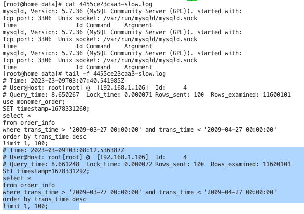
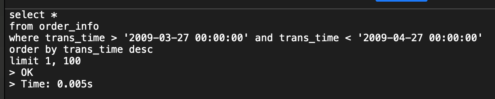
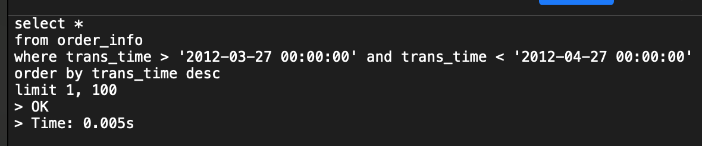
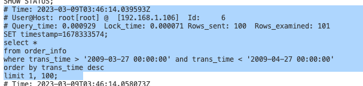

## CentOS7 上安装 MySQL 的监控

- MySQL8.4.5
- node_exporter-1.3.1
- mysqld_exporter-0.17.2
- prometheus-2.53.5
- grafana-enterprise-12.0.2

<details class="details custom-block">

<summary>安装过程</summary>

```sh
#####################################################################################
## 安装 node_exporter
#####################################################################################
下载地址： https://prometheus.io/download/

tar -zxf node_exporter-1.3.1.linux-amd64.tar.gz -C /usr/setup
cd node_exporter-1.3.1.linux-amd64

vi /usr/lib/systemd/system/node_exporter.service
[Unit]
Description=Node Exporter
Wants=network.target
After=network.target

[Service]
ExecStart=/usr/setup/node_exporter-1.9.1.linux-amd64/node_exporter
Restart=always

[Install]
WantedBy=multi-user.target

systemctl daemon-reload && systemctl start node_exporter && systemctl enable node_exporter

192.168.10.105:9100


vi prometheus.yml

## 添加下面内容：

  - job_name: "dev"
    static_configs:
     - targets: ['192.168.10.105:9100']

## 添加完成之后，使用工具检查一下格式是否正确：
./promtool check config prometheus.yml

#####################################################################################
## 安装 mysqld_exporter
#####################################################################################
下载地址： https://prometheus.io/download/
tar -zxvf mysqld_exporter-0.17.2.linux-amd64.tar.gz -C /usr/setup/

echo "export MYSQLD_EXPORTER_PASSWORD='root1003'" >> /etc/profile

vi ~/.my.cnf

[client]
   host=127.0.0.1
   port=3306
   user=root
   password=root1003

vi /usr/lib/systemd/system/mysqld_exporter.service

[Unit]
Description=mysqld_exporter for Prometheus monitoring
After=mysqld.target

[Service]
Type=simple
User=root
ExecStart=/usr/setup/mysqld_exporter-0.17.2.linux-amd64/mysqld_exporter \
  --config.my-cnf=/usr/setup/mysqld_exporter-0.17.2.linux-amd64/.my.cnf \
  --log.level=debug
ExecReload=/bin/kill -HUP \$MAINPID
Restart=on-failure
RestartSec=30s

[Install]
WantedBy=multi-user.target

// 开启自启动服务
systemctl enable mysqld_exporter.service

// 重新加载自启动服务
systemctl daemon-reload && systemctl start mysqld_exporter.service
systemctl status mysqld_exporter.service

// 查看服务启动日志：
journalctl -u mysqld_exporter -f

// 查看是否暴露了 mysql 的相关指标
curl http://localhost:9104/metrics | grep mysql_*

// 查看是否假如自启动服务
systemctl is-enabled mysqld_exporter.service

192.168.10.105:9104

#####################################################################################
## 安装 prometheus
#####################################################################################
下载地址： https://prometheus.io/download/
tar -zxvf /opt/prometheus-2.53.5.linux-amd64.tar.gz -C /usr/setup/

vi /usr/lib/systemd/system/prometheus.service

[Unit]
Description=Prometheus
Documentation=https://prometheus.io/
After=network.target

[Service]
Type=simple
User=root
ExecStart=/usr/setup/prometheus-2.53.5.linux-amd64/prometheus --config.file=/usr/setup/prometheus-2.53.5.linux-amd64/prometheus.yml --web.enable-lifecycle --storage.tsdb.path=/usr/setup/prometheus-2.53.5.linux-amd64/data --storage.tsdb.retention=60d
ExecReload=/bin/kill -HUP \$MAINPID
KillMode=process
Restart=on-failure
RestartSec=30s


[Install]
WantedBy=multi-user.target

--web.enable-lifecycle ： 修改配置文件之后，热部署；
--storage.tsdb.retention=60d ： data文件保持的日期


systemctl daemon-reload
systemctl enable prometheus.service
systemctl start prometheus.service
systemctl status prometheus.service

192.168.10.105:9090

vi prometheus.yml

添加下面内容：

  - job_name: 'mysql'
    static_configs:
     - targets: ['192.168.10.105:9104']
       labels:
          instance: mysql

添加完成之后，使用工具检查一下格式是否正确：
./promtool check config prometheus.yml


#####################################################################################
## 安装 grafana
#####################################################################################
官网： https://grafana.com/grafana/download

yum install -y https://dl.grafana.com/enterprise/release/grafana-enterprise-12.0.2-1.x86_64.rpm

systemctl enable grafana-server
systemctl start grafana-server

192.168.10.105:3000
admin/admin

## 配置
1. 配置datasource
2. 添加看板： https://grafana.com/grafana/dashboards/?search=mysql 打开网址，找到自己喜欢的看板，然后点击一下，在url中可以看到一个ID
3. 拿着上面那个ID，直接导入即可


node_exporter 的id为： 12486
mysqld_exporter 的 id为：14057


```

</details>

## CentOS7 上安装 MySQL

<details class="details custom-block">

- [下载地址](https://dev.mysql.com/downloads/mysql/)
- 根据参考文档安装即可。参考[文档](https://dev.mysql.com/doc/refman/8.4/en/linux-installation-rpm.html)。

<summary>安装 MySQL8.4.5</summary>

```sh
# 卸载原来的 mariadb
rpm -qa|grep mariadb
mariadb-libs-5.5.56-2.el7.x86_64
rpm -e mariadb-libs-* --nodeps
rpm -qa|grep mariadb

# 上传 安装包
cd /opt
mkdir mysql-8.4.5
tar xvf mysql-8.4.5-1.el7.x86_64.rpm-bundle.tar -C mysql-8.4.5/
rpm -ivh mysql-community-common-8.4.5-1.el7.x86_64.rpm
rpm -ivh mysql-community-client-plugins-8.4.5-1.el7.x86_64.rpm
rpm -ivh mysql-community-libs-8.4.5-1.el7.x86_64.rpm
rpm -ivh mysql-community-client-8.4.5-1.el7.x86_64.rpm
rpm -ivh mysql-community-libs-compat-8.4.5-1.el7.x86_64.rpm
rpm -ivh mysql-community-icu-data-files-8.4.5-1.el7.x86_64.rpm
yum install -y net-tools perl libtirpc libaio
rpm -ivh mysql-community-server-8.4.5-1.el7.x86_64.rpm
// 这个很关键，如果没有初始化时设置lower-case-table-names=1，
//  后面在my.cnf文件修改将无法启动mysql
mysqld --initialize --user=mysql --lower-case-table-names=1
cat /var/log/mysqld.log // 记住初始化的密码
systemctl status mysqld
systemctl start mysqld
systemctl status mysqld

# 验证
[root@10 mysql-8.4.5]# rpm -qa | grep mysql
mysql-community-common-8.4.5-1.el7.x86_64
mysql-community-libs-8.4.5-1.el7.x86_64
mysql-community-icu-data-files-8.4.5-1.el7.x86_64
mysql-community-client-8.4.5-1.el7.x86_64
mysql-community-server-debug-8.4.5-1.el7.x86_64
mysql-community-client-plugins-8.4.5-1.el7.x86_64
mysql-community-libs-compat-8.4.5-1.el7.x86_64
mysql-community-server-8.4.5-1.el7.x86_64

mysql -uroot -p
// 修改root密码
mysql> ALTER USER 'root'@'localhost' IDENTIFIED BY 'root1003';
mysql> CREATE USER 'root'@'%' IDENTIFIED BY 'root1003';
mysql> GRANT ALL PRIVILEGES ON *.* TO 'root'@'%' WITH GRANT OPTION;
mysql> FLUSH PRIVILEGES;

mysql>  select host,user from user;
+-----------+------------------+
+-----------+------------------+
| host      | user             |
+-----------+------------------+
| %         | root             |
| localhost | mysql.infoschema |
| localhost | mysql.session    |
| localhost | mysql.sys        |
| localhost | root             |
+-----------+------------------+
5 rows in set (0.01 sec)

// 配置文件路径及内容
[root@dev etc]# cat /etc/my.cnf
# For advice on how to change settings please see
# http://dev.mysql.com/doc/refman/8.4/en/server-configuration-defaults.html

[mysqld]
#
# Remove leading # and set to the amount of RAM for the most important data
# cache in MySQL. Start at 70% of total RAM for dedicated server, else 10%.
# innodb_buffer_pool_size = 128M
#
# Remove the leading "# " to disable binary logging
# Binary logging captures changes between backups and is enabled by
# default. It's default setting is log_bin=binlog
# disable_log_bin
#
# Remove leading # to set options mainly useful for reporting servers.
# The server defaults are faster for transactions and fast SELECTs.
# Adjust sizes as needed, experiment to find the optimal values.
# join_buffer_size = 128M
# sort_buffer_size = 2M
# read_rnd_buffer_size = 2M

datadir=/var/lib/mysql
socket=/var/lib/mysql/mysql.sock

log-error=/var/log/mysqld.log
pid-file=/var/run/mysqld/mysqld.pid
[root@dev etc]#

```

</details>

<details class="details custom-block">

- 下载地址： https://downloads.mysql.com/archives/community/

<summary>安装 MySQL5.7.24</summary>

```shell
# 检查安装环境
[root@home ~]# rpm -qa|grep mariadb
mariadb-libs-5.5.56-2.el7.x86_64
[root@home ~]# rpm -e mariadb-libs-* --nodeps
[root@home ~]# rpm -qa|grep mariadb

# 将下载好的 mysql 安装包上传到/opt/packages/目录下

# 解压

[root@home ~]# cd /opt/packages/
[root@home packages]# mkdir mysql5.7.24
[root@home packages]# tar xvf mysql-5.7.24-1.el7.x86_64.rpm-bundle.tar -C mysql5.7.24/
mysql-community-common-5.7.24-1.el7.x86_64.rpm
mysql-community-minimal-debuginfo-5.7.24-1.el7.x86_64.rpm
mysql-community-embedded-compat-5.7.24-1.el7.x86_64.rpm
mysql-community-embedded-devel-5.7.24-1.el7.x86_64.rpm
mysql-community-embedded-5.7.24-1.el7.x86_64.rpm
mysql-community-libs-5.7.24-1.el7.x86_64.rpm
mysql-community-devel-5.7.24-1.el7.x86_64.rpm
mysql-community-server-5.7.24-1.el7.x86_64.rpm
mysql-community-libs-compat-5.7.24-1.el7.x86_64.rpm
mysql-community-client-5.7.24-1.el7.x86_64.rpm
mysql-community-server-minimal-5.7.24-1.el7.x86_64.rpm
mysql-community-test-5.7.24-1.el7.x86_64.rpm
[root@home packages]# ll mysql5.7.24/
总用量 585024
-rw-r--r--. 1 7155 31415 25398288 10 月 5 2018 mysql-community-client-5.7.24-1.el7.x86_64.rpm
-rw-r--r--. 1 7155 31415 280896 10 月 5 2018 mysql-community-common-5.7.24-1.el7.x86_64.rpm
-rw-r--r--. 1 7155 31415 3840412 10 月 5 2018 mysql-community-devel-5.7.24-1.el7.x86_64.rpm
-rw-r--r--. 1 7155 31415 46773880 10 月 5 2018 mysql-community-embedded-5.7.24-1.el7.x86_64.rpm
-rw-r--r--. 1 7155 31415 24078240 10 月 5 2018 mysql-community-embedded-compat-5.7.24-1.el7.x86_64.rpm
-rw-r--r--. 1 7155 31415 130082964 10 月 5 2018 mysql-community-embedded-devel-5.7.24-1.el7.x86_64.rpm
-rw-r--r--. 1 7155 31415 2272368 10 月 5 2018 mysql-community-libs-5.7.24-1.el7.x86_64.rpm
-rw-r--r--. 1 7155 31415 2116016 10 月 5 2018 mysql-community-libs-compat-5.7.24-1.el7.x86_64.rpm
-rw-r--r--. 1 7155 31415 56029544 10 月 5 2018 mysql-community-minimal-debuginfo-5.7.24-1.el7.x86_64.rpm
-rw-r--r--. 1 7155 31415 173096508 10 月 5 2018 mysql-community-server-5.7.24-1.el7.x86_64.rpm
-rw-r--r--. 1 7155 31415 15167212 10 月 5 2018 mysql-community-server-minimal-5.7.24-1.el7.x86_64.rpm
-rw-r--r--. 1 7155 31415 119909528 10 月 5 2018 mysql-community-test-5.7.24-1.el7.x86_64.rpm

# 安装

[root@home packages]# cd mysql5.7.24/
[root@home mysql5.7.24]# rpm -ivh mysql-community-common-5.7.24-1.el7.x86_64.rpm
[root@home mysql5.7.24]# rpm -ivh mysql-community-libs-5.7.24-1.el7.x86_64.rpm
[root@home mysql5.7.24]# rpm -ivh mysql-community-client-5.7.24-1.el7.x86_64.rpm
[root@home mysql5.7.24]# yum install -y net-tools perl libaio
[root@home mysql5.7.24]# rpm -ivh mysql-community-server-5.7.24-1.el7.x86_64.rpm

rpm -ivh mysql-community-common-_.rpm
rpm -ivh mysql-community-client-plugins-_.rpm
rpm -ivh mysql-community-libs-_.rpm
rpm -ivh mysql-community-client-8_.rpm
rpm -ivh mysql-community-libs-compat-_.rpm
rpm -ivh mysql-community-icu-data-files-_.rpm
yum install -y net-tools perl libtirpc libaio
rpm -ivh mysql-community-server-\*.rpm

# 验证安装结果
[root@home mysql5.7.24] rpm -qa | grep mysql

# 初始化并启动服务
[root@home mysql5.7.24]# mysqld --initialize --user=mysql
[root@home mysql5.7.24]# cat /var/log/mysqld.log
[root@home mysql5.7.24]# systemctl status mysqld
[root@home mysql5.7.24]# systemctl start mysqld
[root@home mysql5.7.24]# systemctl status mysqld

# 创建用户并分配权限
// 使用 root 登录
[root@home mysql5.7.24]# mysql -uroot -p
// 修改 root 密码
mysql> ALTER USER 'root'@'localhost' IDENTIFIED BY 'root@2019&_(';
// 创建只具有增删改查的远程登录用户 test
mysql> create user 'test'@'%' identified by 'test!@#';
mysql> grant select, insert, update, delete on _._ to 'test'@'%';
mysql> flush privileges;
// 创建具有全部权限的 admin 用户
mysql> create user 'admin'@'%' identified by 'admin@2019!@#';
mysql> grant all on _._ to 'admin'@'%' identified by 'admin@2019!@#';
mysql> flush privileges;
// 设置 root 远程登录权限【未执行】
mysql> grant all on _._ to 'root'@'%' identified by 'root@2019&_(';
mysql> flush privileges;


# 250707更新，只执行了下面的内容
mysql> ALTER USER 'root'@'localhost' IDENTIFIED BY 'root1003';
mysql> CREATE USER 'root'@'%' IDENTIFIED BY 'root1003';
mysql> GRANT ALL PRIVILEGES ON *.* TO 'root'@'%' WITH GRANT OPTION;
mysql> FLUSH PRIVILEGES;

# 其它操作
[root@home mysql5.7.24]# systemctl start mysqld
[root@home mysql5.7.24]# firewall-cmd --zone=public --add-port=3306/tcp --permanent
success
[root@home mysql5.7.24]# firewall-cmd --reload
success

```

</details>

## CentOS7 上 MySQL5.7.24 主从配置

### 准备虚拟机

分别在不同的虚拟机上安装 centos7.5。安装之后的信息如下：

- CentOS7.5
- MySQL 版本：5.7.24
- mysql.master ：
  - IP ：192.168.100.220
  - 用户名/密码 ：root root1003
- mysql.slave01:
  - IP ： 192.168.100.221
  - 用户名/密码：root root1003

之后测试连通性，要保证：

- 在 master 上面 ping 两台 slave01 的 ip，保证能够 ping 通；
- 分别在 slave 上 ping master 的 ip，保证也能 ping 通。

### 设置主从配置

<details class="details custom-block">

<summary>设置主从配置</summary>

```bash
##################################### 1. 设置 master
# 1.1. 查看是否开启 bin 日志， 5.7.24 默认不开启， 8 默认开启
ll /var/lib/mysql
// 未发现bin文件，表明未开启

# 1.2. 修改配置文件
vi /etc/my.cnf

server-id=1
log_bin=/var/lib/mysql/mysql-bin

# 1.3. 创建用于主从复制的用户并授权
create user 'repl' identified by 'repl';
grant replication slave on *.* to 'repl'@'192.168.100.%' identified by 'repl';
flush privileges;

# 1.4. 重启服务
systemctl restart mysqld

# 1.5. 验证bin日志开启是否成功
ll /var/lib/mysql
// 发现存在bin文件，说明开启成功

##################################### 2. 设置 slave
# 2.1. 修改配置文件
vi /etc/my.cnf

server-id=2
relay-log-index=slave-relay-bin.index
relay-log=slave-relay-bin

# 2.2. 重启服务
systemctl restart mysqld

##################################### 3. 建立主从关系
# 3.1. 主库登录 mysql 查看 Position
mysql> show master status;
+------------------+----------+--------------+------------------+-------------------+
| File             | Position | Binlog_Do_DB | Binlog_Ignore_DB | Executed_Gtid_Set |
+------------------+----------+--------------+------------------+-------------------+
| mysql-bin.000001 |      154 |              |                  |                   |
+------------------+----------+--------------+------------------+-------------------+
1 row in set (0.00 sec)

# 3.2. 打开从库登录 mysql，查看状态，进行如下配置
mysql> show slave status\G
Empty set (0.00 sec)

# 3.3. 在从库上建立与主库的联系
mysql> change master to master_host='192.168.100.220';
Query OK, 0 rows affected (0.01 sec)
mysql> change master to master_port=3306;
Query OK, 0 rows affected (0.01 sec)
mysql> change master to master_user='repl';
Query OK, 0 rows affected, 2 warnings (0.01 sec)
mysql> change master to master_password='repl';
Query OK, 0 rows affected, 2 warnings (0.01 sec)
mysql> change master to master_log_file='mysql-bin.000001';
Query OK, 0 rows affected, 1 warning (0.00 sec)
mysql> change master to master_log_pos=154;
Query OK, 0 rows affected (0.01 sec)

# 3.4. 查看关联关系
mysql> show slave status\G
*************************** 1. row ***************************
               Slave_IO_State:
                  Master_Host: 192.168.100.220
                  Master_User: repl
                  Master_Port: 3306
                Connect_Retry: 60
              Master_Log_File: mysql-bin.000001
          Read_Master_Log_Pos: 154
               Relay_Log_File: slave-relay-bin.000001
                Relay_Log_Pos: 4
        Relay_Master_Log_File: mysql-bin.000001
             Slave_IO_Running: No
            Slave_SQL_Running: No
              Replicate_Do_DB:
          Replicate_Ignore_DB:
           Replicate_Do_Table:
       Replicate_Ignore_Table:
      Replicate_Wild_Do_Table:
  Replicate_Wild_Ignore_Table:
                   Last_Errno: 0
                   Last_Error:
                 Skip_Counter: 0
          Exec_Master_Log_Pos: 154
              Relay_Log_Space: 154
              Until_Condition: None
               Until_Log_File:
                Until_Log_Pos: 0
           Master_SSL_Allowed: No
           Master_SSL_CA_File:
           Master_SSL_CA_Path:
              Master_SSL_Cert:
            Master_SSL_Cipher:
               Master_SSL_Key:
        Seconds_Behind_Master: NULL
Master_SSL_Verify_Server_Cert: No
                Last_IO_Errno: 0
                Last_IO_Error:
               Last_SQL_Errno: 0
               Last_SQL_Error:
  Replicate_Ignore_Server_Ids:
             Master_Server_Id: 0
                  Master_UUID:
             Master_Info_File: /var/lib/mysql/master.info
                    SQL_Delay: 0
          SQL_Remaining_Delay: NULL
      Slave_SQL_Running_State:
           Master_Retry_Count: 86400
                  Master_Bind:
      Last_IO_Error_Timestamp:
     Last_SQL_Error_Timestamp:
               Master_SSL_Crl:
           Master_SSL_Crlpath:
           Retrieved_Gtid_Set:
            Executed_Gtid_Set:
                Auto_Position: 0
         Replicate_Rewrite_DB:
                 Channel_Name:
           Master_TLS_Version:
1 row in set (0.00 sec)

# 3.5. 开始主从复制
mysql> start slave;
Query OK, 0 rows affected (0.01 sec)

# 3.6. 查看结果 ： 这两个参数要同时处于 yes 状态才行。
#    Slave_IO_Running: Yes
#    Slave_SQL_Running: Yes
mysql> show slave status\G
*************************** 1. row ***************************
               Slave_IO_State: Waiting for master to send event
                  Master_Host: 192.168.100.220
                  Master_User: repl
                  Master_Port: 3306
                Connect_Retry: 60
              Master_Log_File: mysql-bin.000001
          Read_Master_Log_Pos: 154
               Relay_Log_File: slave-relay-bin.000002
                Relay_Log_Pos: 320
        Relay_Master_Log_File: mysql-bin.000001
             Slave_IO_Running: Yes
            Slave_SQL_Running: Yes
              Replicate_Do_DB:
          Replicate_Ignore_DB:
           Replicate_Do_Table:
       Replicate_Ignore_Table:
      Replicate_Wild_Do_Table:
  Replicate_Wild_Ignore_Table:
                   Last_Errno: 0
                   Last_Error:
                 Skip_Counter: 0
          Exec_Master_Log_Pos: 154
              Relay_Log_Space: 527
              Until_Condition: None
               Until_Log_File:
                Until_Log_Pos: 0
           Master_SSL_Allowed: No
           Master_SSL_CA_File:
           Master_SSL_CA_Path:
              Master_SSL_Cert:
            Master_SSL_Cipher:
               Master_SSL_Key:
        Seconds_Behind_Master: 0
Master_SSL_Verify_Server_Cert: No
                Last_IO_Errno: 0
                Last_IO_Error:
               Last_SQL_Errno: 0
               Last_SQL_Error:
  Replicate_Ignore_Server_Ids:
             Master_Server_Id: 1
                  Master_UUID: d0a811e6-e804-11e9-99fe-000c29e1ed82
             Master_Info_File: /var/lib/mysql/master.info
                    SQL_Delay: 0
          SQL_Remaining_Delay: NULL
      Slave_SQL_Running_State: Slave has read all relay log; waiting for more updates
           Master_Retry_Count: 86400
                  Master_Bind:
      Last_IO_Error_Timestamp:
     Last_SQL_Error_Timestamp:
               Master_SSL_Crl:
           Master_SSL_Crlpath:
           Retrieved_Gtid_Set:
            Executed_Gtid_Set:
                Auto_Position: 0
         Replicate_Rewrite_DB:
                 Channel_Name:
           Master_TLS_Version:
1 row in set (0.00 sec)

##################################### 4. 测试
# 4.1. 在主库上创建测试数据库，创建一张表，并插入一条测试数据
create database testrepl;

use testrepl;

create table staffs (
  id int primary key auto_increment,
  name varchar(24) not null default '' comment '姓名',
  age int not null default 0 comment '年龄',
  pos varchar(20) not null default '' comment '职位'
);

insert into staffs(name, age, pos) values('z3', 22, 'manager');

# 4.2. 在从库上查看是否有该数据库

mysql> show databases;
+--------------------+
| Database           |
+--------------------+
| information_schema |
| mysql              |
| performance_schema |
| sys                |
| testrepl           |
+--------------------+
5 rows in set (0.00 sec)

mysql> use testrepl
Reading table information for completion of table and column names
You can turn off this feature to get a quicker startup with -A

Database changed
mysql> show tables;
+--------------------+
| Tables_in_testrepl |
+--------------------+
| staffs             |
+--------------------+
1 row in set (0.00 sec)

mysql> select * from staffs;
+----+------+-----+---------+
| id | name | age | pos     |
+----+------+-----+---------+
|  1 | z3   |  22 | manager |
+----+------+-----+---------+
1 row in set (0.00 sec)

```

</details>

### 问题及解决

1. 发现添加列时每一列的编码都是拉丁编码

```sh

# 1. 配置文件中设置 client 部分 和 mysqld 部分的： default-character-set

[client]
default-character-set=utf8mb4
[mysql]
default-character-set=utf8mb4
[mysqld]
init_connect='SET collation_connection = utf8mb4_unicode_ci'
init_connect='SET NAMES utf8mb4'
character-set-server=utf8mb4
collation-server=utf8mb4_unicode_ci

# 2. 如果在添加一列时，发现还是不行，可以先进行创建表的操作，然后再在创建的表格上面添加列。
CREATE DATABASE ${tablename} DEFAULT CHARACTER SET utf8 DEFAULT COLLATE utf8_general_ci;
```

2. 连接数量太多

```sh
show variables like '%max_connections%'
发现连接数为：151

// 在配置文件中设置默认字符集
$ vi /etc/my.cnf

// 在[mysqld]下添加下面一行
max_connections=1000

// 重启
$ systemctl restart mysqld


show variables like '%max_connections%'
发现连接数为：1000

```

## Docker 上安装 MySQL5.7

```sh
# 拉取镜像
docker pull mysql:5.7

# 把镜像中的配置文件拷贝到本地
docker cp mysql:/etc/mysql/my.cnf /mydata/mysql/conf/my.cnf

# 启动
docker run -p 3306:3306 --name mysql \
--restart always \
-v /mydata/mysql/log:/var/log/mysql \
-v /mydata/mysql/data:/var/lib/mysql \
-v /mydata/mysql/conf/my.cnf:/etc/mysql/my.cnf \
-v /etc/localtime:/etc/localtime \
-e MYSQL_ROOT_PASSWORD=root \
-d mysql:5.7

# 创建配置文件
vi /mydata/mysql/conf/my.cnf

[client]
default-character-set=utf8mb4
[mysql]
default-character-set=utf8mb4
[mysqld]
init_connect='SET collation_connection = utf8mb4_unicode_ci'
init_connect='SET NAMES utf8mb4'
character-set-server=utf8mb4
collation-server=utf8mb4_unicode_ci
skip-character-set-client-handshake
skip-name-resolve

# 重启
docker restart mysql
```

解决时间差 8 小时的问题

1. 在客户端输入 select now(); 发现查了 8 小时
2. 进入 mysql 服务端： docker exec -it mysql bash
3. 查看 mysql 服务端当前时间： date ，发现差了 8 小时
4. 直接修改时区为上海： ln -sf /usr/share/zoneinfo/Asia/Shanghai /etc/localtime ，再次输入 date，发现时间已经正常
5. 重启 mysql 服务端

下面是一个具体安装示例：

```bash
// 拉取镜像
[root@home docker]# docker pull mysql:5.7

5.7: Pulling from library/mysql
72a69066d2fe: Pull complete
93619dbc5b36: Pull complete
99da31dd6142: Pull complete
626033c43d70: Pull complete
37d5d7efb64e: Pull complete
ac563158d721: Pull complete
d2ba16033dad: Pull complete
0ceb82207cd7: Pull complete
37f2405cae96: Pull complete
e2482e017e53: Pull complete
70deed891d42: Pull complete
Digest: sha256:f2ad209efe9c67104167fc609cca6973c8422939491c9345270175a300419f94
Status: Downloaded newer image for mysql:5.7
docker.io/library/mysql:5.7

// 安装
[root@home docker]# docker run -p 3306:3306 --name mysql \
> -v /mnt/doc/docker/mysql/log:/var/log/mysql \
> -v /mnt/doc/docker/mysql/data:/var/lib/mysql \
> -v /mnt/doc/docker/mysql/conf:/etc/mysql \
> -e MYSQL_ROOT_PASSWORD=root \
> -d mysql:5.7
0a4457b1eac5dbfdba0f483db94aeb4fd42652d9f893094cf34daa0f4877116d
[root@home docker]# docker ps -a
CONTAINER ID   IMAGE       COMMAND                   CREATED         STATUS         PORTS                                                  NAMES
0a4457b1eac5   mysql:5.7   "docker-entrypoint.s…"   6 seconds ago   Up 5 seconds   0.0.0.0:3306->3306/tcp, :::3306->3306/tcp, 33060/tcp   mysql
[root@home docker]# cd /mnt/doc/docker/mysql/conf/

// 创建配置文件
[root@home conf]# vi my.cnf

[client]
default-character-set=utf8mb4
[mysql]
default-character-set=utf8mb4
[mysqld]
init_connect='SET collation_connection = utf8mb4_unicode_ci'
init_connect='SET NAMES utf8mb4'
character-set-server=utf8mb4
collation-server=utf8mb4_unicode_ci
skip-character-set-client-handshake
skip-name-resolve

// 重启mysql
[root@home conf]# docker restart mysql
mysql
[root@home conf]# docker ps
CONTAINER ID   IMAGE       COMMAND                   CREATED         STATUS          PORTS                                                  NAMES
0a4457b1eac5   mysql:5.7   "docker-entrypoint.s…"   6 minutes ago   Up 10 seconds   0.0.0.0:3306->3306/tcp, :::3306->3306/tcp, 33060/tcp   mysql

// 设置开机自启
[root@home conf]# docker update mysql --restart=always
mysql

// 解决时间问题
[root@home conf]# docker exec -it mysql bash
root@0a4457b1eac5:/# date
Sat Oct  7 12:58:45 UTC 2023
root@0a4457b1eac5:/# ln -sf /usr/share/zoneinfo/Asia/Shanghai /etc/localtime
root@0a4457b1eac5:/# date
Sat Oct  7 20:58:57 CST 2023
root@0a4457b1eac5:/# exit
exit

// 最后重启
[root@home conf]# docker restart mysql
mysql

```

## Docker 安装一主二从

> 说明：
> 由于实验过程要求创建千万级别的数据，为了避免在主从同步的过程中出现问题。我们采用现在单例数据库上面上创建一个千万级数据，之后备份下来。再搭建三个数据库实例，之后把数据依次恢复到三个实例上，然后再建立主从关系，最后开启主从复制的过程。
> **当然如果不需要关注千万级数据，那么我们只需要依次创建三个实例，之后建立主从关系，最后开启主从复制过程即可。**

说明：

- 搭建模型是： 同一个 docker 实例上的 一主二从
- mysql-master : 3307
- mysql-slave01 : 3308
- mysql-slave02 : 3309

1. master 搭建过程

> 。注意： binlog_format 推荐使用 row，具体参考【[这里](https://help.aliyun.com/document_detail/67809.html)】。

```bash
// 创建容器， 让主机的 3307 端口映射出去
docker run -p 3307:3306 --name mysql-master \
--restart always \
-v /mydata/mysql-master/log:/var/log/mysql \
-v /mydata/mysql-master/data:/var/lib/mysql \
-v /mydata/mysql-master/conf:/etc/mysql \
-v /etc/localtime:/etc/localtime \
-e MYSQL_ROOT_PASSWORD=root \
-d mysql:5.7

// 创建配置文件
vi /mydata/mysql-master/conf/my.cnf

[client]
default-character-set=utf8mb4
[mysql]
default-character-set=utf8mb4
[mysqld]
character-set-server=utf8mb4
default-time_zone='+8:00'
server_id=100
log_bin=master-bin
binlog_format=ROW
slow-query-log-file=/var/log/mysql/slow-query.log
long_query_time=1

// 设置开机自启动，并重启
docker restart mysql-master

// 创建主从复制的用户信息
docker exec -it mysql-master /bin/bash
mysql -uroot -proot
CREATE USER 'slave'@'%' IDENTIFIED BY '123456';
GRANT REPLICATION SLAVE, REPLICATION CLIENT ON *.* TO 'slave'@'%';
flush privileges;
```

2. slave01 搭建过程

```bash
// 创建容器， 让主机的 3308 端口映射出去。
docker run -p 3308:3306 --name mysql-slave01 \
--restart always \
-v /mydata/mysql-slave01/log:/var/log/mysql \
-v /mydata/mysql-slave01/data:/var/lib/mysql \
-v /mydata/mysql-slave01/conf:/etc/mysql \
-v /etc/localtime:/etc/localtime \
-e MYSQL_ROOT_PASSWORD=root \
-d mysql:5.7

// 创建配置文件
vi /mydata/mysql-slave01/conf/my.cnf

[client]
default-character-set=utf8mb4
[mysql]
default-character-set=utf8mb4
[mysqld]
character-set-server=utf8mb4
default-time_zone='+8:00'
server_id=101
log_bin=slave01-bin
relay_log=mysql-relay-bin

// 重启
docker restart mysql-slave01

```

3. slave02 搭建过程

> 让主机的 3309 端口映射出去。

```bash
// 创建容器
docker run -p 3309:3306 --name mysql-slave02 \
--restart always \
-v /mydata/mysql-slave02/log:/var/log/mysql \
-v /mydata/mysql-slave02/data:/var/lib/mysql \
-v /mydata/mysql-slave02/conf:/etc/mysql \
-v /etc/localtime:/etc/localtime \
-e MYSQL_ROOT_PASSWORD=root \
-d mysql:5.7

// 创建配置文件
vi /mydata/mysql-slave02/conf/my.cnf

[client]
default-character-set=utf8mb4
[mysql]
default-character-set=utf8mb4
[mysqld]
character-set-server=utf8mb4
default-time_zone='+8:00'
server_id=102
log_bin=slave01-bin
relay_log=mysql-relay-bin

// 重启
docker restart mysql-slave02
```

4. [optional]恢复数据到三个实例中

```bash
// 把之前的单例mysql中已经生成的千万级数据备份成sql语句
docker exec mysql sh -c 'exec mysqldump --databases monomer_order -uroot -proot' > /mydata/backupsqls/mysql/monomer_order.sql

# 由于数据量很大，我们采用先恢复数据到库里面的方式，让三个数据库实例的数据保持一致，之后再进行主从复制。
docker exec -i mysql-master sh -c 'exec mysql -uroot -proot' < /mydata/backupsqls/mysql/monomer_order.sql
docker exec -i mysql-slave01 sh -c 'exec mysql -uroot -proot' < /mydata/backupsqls/mysql/monomer_order.sql
docker exec -i mysql-slave02 sh -c 'exec mysql -uroot -proot' < /mydata/backupsqls/mysql/monomer_order.sql

```

5. 开启从数据库实例的主从复制过程

> 主要分两个步骤：
>
> 1. 记录主库的位置信息；
> 2. 设置从库与主库的通信的相关信息，并在主库中开启主从复制过程；

```bash

##############################  1. 获取master的数据位置
docker exec -it mysql-master /bin/bash
mysql -uroot -proot
show master status;


##############################  2. 配置slave01
# 2.1. 进入slave01内部命令行
docker exec -it mysql-slave01 /bin/bash
mysql -uroot -proot

# 2.2. 设置主从复制的起始位置
CHANGE MASTER TO MASTER_HOST='192.168.1.150',MASTER_USER='slave',MASTER_PASSWORD='123456', \
MASTER_PORT=3307,MASTER_LOG_FILE='master-bin.000005',MASTER_LOG_POS=145291152;

# 2.3. 开始主从复制，并查看主从复制的状态
start slave;
show slave status\G

############################## 3. 配置slave02
# 3.1. 进入slave02内部命令行
docker exec -it mysql-slave02 /bin/bash
mysql -uroot -proot


# 3.2. 设置主从复制的起始位置
CHANGE MASTER TO MASTER_HOST='192.168.1.150',MASTER_USER='slave',MASTER_PASSWORD='123456', \
MASTER_PORT=3307,MASTER_LOG_FILE='master-bin.000005',MASTER_LOG_POS=145291152;

# 3.3. 开始主从复制，并查看主从复制的状态
start slave;
show slave status\G

############################## 4. 测试并验证
// 成功！！！done！！！

```

## 其它操作

### 备份所有用户表

```sh
mysqldump -uroot -proot1003 --databases db2020 seata_account seata_server seata_order seata_storage seata_tcc_account seata_tcc_order seata_tcc_storage test test_una_saas >/opt/mysql8.4.5.sql
```

### mysql5.7 配置文件详解

```ini
[root@dev ~]# cat /etc/my.cnf
# For advice on how to change settings please see
# http://dev.mysql.com/doc/refman/5.7/en/server-configuration-defaults.html
[mysqld]
#
# Remove leading # and set to the amount of RAM for the most important data
# cache in MySQL. Start at 70% of total RAM for dedicated server, else 10%.
# innodb_buffer_pool_size = 128M
#
# Remove leading # to turn on a very important data integrity option: logging
# changes to the binary log between backups.
# log_bin
#
# Remove leading # to set options mainly useful for reporting servers.
# The server defaults are faster for transactions and fast SELECTs.
# Adjust sizes as needed, experiment to find the optimal values.
# join_buffer_size = 128M
# sort_buffer_size = 2M
# read_rnd_buffer_size = 2M
datadir=/var/lib/mysql
socket=/var/lib/mysql/mysql.sock
# Disabling symbolic-links is recommended to prevent assorted security risks
symbolic-links=0
log-error=/var/log/mysqld.log
pid-file=/var/run/mysqld/mysqld.pid
# 设置表名不区分大小写
lower_case_table_names=1
# 修改默认值，以达到5.6与5.7兼容的目的
sql_mode=STRICT_TRANS_TABLES,NO_ZERO_IN_DATE,NO_ZERO_DATE,ERROR_FOR_DIVISION_BY_ZERO,NO_AUTO_CREATE_USER,NO_ENGINE_SUBSTITUTION
# 数据库默认字符集,主流字符集支持一些特殊表情符号（特殊表情符占用4个字节）
character-set-server=utf8mb4
# 数据库字符集对应一些排序等规则，注意要和character-set-server对应
collation-server=utf8mb4_general_ci
# 设置默认存储引擎
default-storage-engine=INNODB
# 设置最大连接数
max_connections=1000
# 设置client连接mysql时的字符集,防止乱码
init_connect='SET NAMES utf8mb4'
#TIMESTAMP如果没有显示声明NOT NULL，允许NULL值
explicit_defaults_for_timestamp = true
```

## 200 服务器配置

```ini
[client]
default-character-set=utf8

[mysqld]
datadir=/var/lib/mysql
socket=/var/lib/mysql/mysql.sock
symbolic-links=0
log-error=/var/log/mysqld.log
pid-file=/var/run/mysqld/mysqld.pid
lower_case_table_names=1
sql_mode=STRICT_TRANS_TABLES,NO_ZERO_IN_DATE,NO_ZERO_DATE,ERROR_FOR_DIVISION_BY_ZERO,NO_AUTO_CREATE_USER,NO_ENGINE_SUBSTITUTION
default-storage-engine=INNODB
character-set-server=utf8
collation-server=utf8_general_ci
max_connections=1000

[mysql]
no-auto-rehash
default-character-set=utf8
```

## 压测（基准测试）

数据库部署的时候常选用的机器配置最低在 8 核 16G 以上，正常在 16 核 32G，推荐 16 核以及以上的配置。8 核 16G，按一两千的请求来配置，再高可能有危险，因为数据库的 cpu、磁盘、io、内存负载都会很高，数据库压力过大就会宕机。16 核 32G，按两三千的请求来配置，甚至三四千也是有可能，再高的话，cpu、磁盘、io、内存、网络负载都会很高，数据库也有可能会扛不住宕机。如果是 ssd 磁盘，能抗的并发可能会更高一点，数据库最大的复杂就在于磁盘的 io，需要大量的读写磁盘文件。

8C16G 平均一两千并发； 16C32G 平均两三千，甚至三四千都是有可能；

### 安装压测工具 sysbench

```sh
curl -s https://packagecloud.io/install/repositories/akopytov/sysbench/script.rpm.sh | sudo bash
sudo yum -y install sysbench
sysbench --version

[root@dev ~]# sysbench --version
sysbench 1.0.20
```

### 构造测试数据

```sh
[root@dev ~]# sysbench --db-driver=mysql --time=300 --threads=10 --report-interval=1 --mysql-host=192.168.10.105 --mysql-port=3306 --mysql-user=root --mysql-password=root1003 --mysql-db=test_db --tables=20 --table_size=1000000 oltp_read_write --db-ps-mode=disable prepare
sysbench 1.0.20 (using bundled LuaJIT 2.1.0-beta2)

Initializing worker threads...

Creating table 'sbtest8'...Creating table 'sbtest3'...
Creating table 'sbtest2'...
Creating table 'sbtest4'...
Creating table 'sbtest1'...
Creating table 'sbtest6'...

Creating table 'sbtest7'...
Creating table 'sbtest5'...
Creating table 'sbtest10'...
Creating table 'sbtest9'...
Inserting 1000000 records into 'sbtest10'
Inserting 1000000 records into 'sbtest5'
Inserting 1000000 records into 'sbtest3'
Inserting 1000000 records into 'sbtest7'
Inserting 1000000 records into 'sbtest6'
Inserting 1000000 records into 'sbtest9'
Inserting 1000000 records into 'sbtest2'
Inserting 1000000 records into 'sbtest4'
Inserting 1000000 records into 'sbtest8'
Inserting 1000000 records into 'sbtest1'
Creating a secondary index on 'sbtest7'...
Creating a secondary index on 'sbtest4'...
Creating a secondary index on 'sbtest1'...
Creating a secondary index on 'sbtest3'...
Creating a secondary index on 'sbtest5'...
Creating a secondary index on 'sbtest6'...
Creating a secondary index on 'sbtest10'...
Creating a secondary index on 'sbtest9'...
Creating a secondary index on 'sbtest2'...
Creating a secondary index on 'sbtest8'...
Creating table 'sbtest17'...
Inserting 1000000 records into 'sbtest17'
Creating table 'sbtest14'...
Inserting 1000000 records into 'sbtest14'
Creating table 'sbtest11'...
Inserting 1000000 records into 'sbtest11'
Creating table 'sbtest12'...
Inserting 1000000 records into 'sbtest12'
Creating table 'sbtest16'...
Creating table 'sbtest13'...
Inserting 1000000 records into 'sbtest16'
Creating table 'sbtest19'...
Creating table 'sbtest15'...
Inserting 1000000 records into 'sbtest13'
Inserting 1000000 records into 'sbtest19'
Inserting 1000000 records into 'sbtest15'
Creating table 'sbtest20'...
Inserting 1000000 records into 'sbtest20'
Creating table 'sbtest18'...
Inserting 1000000 records into 'sbtest18'
Creating a secondary index on 'sbtest17'...
Creating a secondary index on 'sbtest14'...
Creating a secondary index on 'sbtest12'...
Creating a secondary index on 'sbtest16'...
Creating a secondary index on 'sbtest19'...
Creating a secondary index on 'sbtest11'...
Creating a secondary index on 'sbtest13'...
Creating a secondary index on 'sbtest15'...
Creating a secondary index on 'sbtest20'...
Creating a secondary index on 'sbtest18'...
```

- --db-driver=mysql ：基于 mysql 的驱动去连接 mysql 数据库，你要是 oracle，或者 sqlserver，那自然就是其他的数据库的驱动了
- --time=300 ： 这个就是说连续访问 300 秒
- --threads=10 ： 这个就是说用 10 个线程模拟并发访问
- --report-interval=1：这个就是说每隔 1 秒输出一下压测情况
- --mysql-host=127.0.0.1 --mysql-port=3306 --mysql-user=test_user --mysql-password=test_user：这一大串，就是说连接到哪台机器的哪个端口上的 MySQL 库，他的用户名和密码是什么
- --mysql-db=test_db --tables=20 --table_size=1000000：这一串的意思，就是说在 test_db 这个库里，构造 20 个测试表，每个测试表里构造 100 万条测试数据，测试表的名字会是类似于 sbtest1，sbtest2 这个样子的
- oltp_read_write：这个就是说，执行 oltp 数据库的读写测试，所使用的 lua 脚本；
- --db-ps-mode=disable：这个就是禁止 ps 模式
- 最后有一个 prepare，意思是参照这个命令的设置去构造出来我们需要的数据库里的数据，他会自动创建 20 个测试表，每个表里创建 100 万条测试数据

### 执行压测

```sh
[root@dev ~]# sysbench --db-driver=mysql --time=300 --threads=10 --report-interval=1 --mysql-host=192.168.10.105 --mysql-port=3306 --mysql-user=root --mysql-password=root1003 --mysql-db=test_db --tables=20 --table_size=1000000 oltp_read_write --db-ps-mode=disable run
sysbench 1.0.20 (using bundled LuaJIT 2.1.0-beta2)

Running the test with following options:
Number of threads: 10
Report intermediate results every 1 second(s)
Initializing random number generator from current time


Initializing worker threads...

Threads started!

[ 1s ] thds: 10 tps: 110.79 qps: 2332.49 (r/w/o: 1651.81/449.13/231.55) lat (ms,95%): 219.36 err/s: 0.00 reconn/s: 0.00
[ 2s ] thds: 10 tps: 133.04 qps: 2686.81 (r/w/o: 1885.57/535.16/266.08) lat (ms,95%): 235.74 err/s: 0.00 reconn/s: 0.00
[ 3s ] thds: 10 tps: 122.94 qps: 2454.72 (r/w/o: 1711.11/497.74/245.87) lat (ms,95%): 207.82 err/s: 0.00 reconn/s: 0.00
[ 4s ] thds: 10 tps: 132.94 qps: 2620.81 (r/w/o: 1831.17/523.76/265.88) lat (ms,95%): 183.21 err/s: 0.00 reconn/s: 0.00
.............
[ 295s ] thds: 10 tps: 165.90 qps: 3276.98 (r/w/o: 2292.59/652.60/331.80) lat (ms,95%): 164.45 err/s: 0.00 reconn/s: 0.00
[ 296s ] thds: 10 tps: 177.09 qps: 3600.90 (r/w/o: 2521.33/725.38/354.19) lat (ms,95%): 150.29 err/s: 0.00 reconn/s: 0.00
[ 297s ] thds: 10 tps: 165.99 qps: 3270.82 (r/w/o: 2294.87/643.96/331.98) lat (ms,95%): 176.73 err/s: 0.00 reconn/s: 0.00
[ 298s ] thds: 10 tps: 186.04 qps: 3719.81 (r/w/o: 2600.57/748.16/371.08) lat (ms,95%): 170.48 err/s: 0.00 reconn/s: 0.00
[ 299s ] thds: 10 tps: 140.92 qps: 2848.45 (r/w/o: 1991.92/573.69/282.85) lat (ms,95%): 200.47 err/s: 0.00 reconn/s: 0.00
[ 300s ] thds: 10 tps: 170.07 qps: 3346.39 (r/w/o: 2349.97/656.27/340.14) lat (ms,95%): 189.93 err/s: 0.00 reconn/s: 0.00
SQL statistics:
    queries performed:
        read:                            659386
        write:                           188396
        other:                           94198
        total:                           941980
    transactions:                        47099  (156.98 per sec.)
    queries:                             941980 (3139.60 per sec.)
    ignored errors:                      0      (0.00 per sec.)
    reconnects:                          0      (0.00 per sec.)

General statistics:
    total time:                          300.0300s
    total number of events:              47099

Latency (ms):
         min:                                   10.71
         avg:                                   63.70
         max:                                  389.65
         95th percentile:                      186.54
         sum:                              3000005.53

Threads fairness:
    events (avg/stddev):           4709.9000/25.06
    execution time (avg/stddev):   300.0006/0.00
```

按照我们上面的命令，我们是让他每隔 1 秒都会输出一次压测报告的，此时他每隔一秒会输出类似下面的一段东西：

> [ 22s ] thds: 10 tps: 380.99 qps: 7312.66 (r/w/o: 5132.99/1155.86/1321.35) lat (ms, 95%): 21.33 err/s: 0.00 reconn/s: 0.00

第 22s 输出的一段压测统计报告，然后是其他的一些统计字段：

- thds : 10，这个意思就是有 10 个线程在压测
- tps : 380.99，这个意思就是每秒执行了 380.99 个事务
- qps : 7610.20，这个意思就是每秒可以执行 7610.20 个请求
- (r/w/o: 5132.99/1155.86/1321.35) ，这个意思就是说，在每秒 7610.20 个请求中，有 5132.99 个请求是读请求，1155.86 个请求是写请求，1321.35 个请求是其他的请求，就是对 QPS 进行了拆解
- lat (ms, 95%) : 21.33，这个意思就是说，95%的请求的延迟都在 21.33 毫秒以下
- err/s: 0.00 reconn/s: 0.00，这两个的意思就是说，每秒有 0 个请求是失败的，发生了 0 次网络重连

```sh
SQL statistics:
    queries performed:
        read: 1480084 // 这就是说在300s的压测期间执行了148万多次的读请求
        write: 298457 // 这是说在压测期间执行了29万多次的写请求
        other: 325436 // 这是说在压测期间执行了30万多次的其他请求
        total: 2103977 // 这是说一共执行了210万多次的请求

    // 这是说一共执行了10万多个事务，每秒执行350多个事务
    transactions: 105180( 350.6 per sec. )

    // 这是说一共执行了210万多次的请求，每秒执行7000+请求
    queries: 2103977 ( 7013.26 per sec. )
    ignored errors: 0 (0.00 per sec.)
    reconnects: 0 (0.00 per sec.)

// 下面就是说，一共执行了300s的压测，执行了10万+的事务
General staticstics:
    total time: 300.0052s
    total number of events: 105180


Latency (ms):
    min: 4.32 // 请求中延迟最小的是4.32ms
    avg: 13.42 // 所有请求平均延迟是13.42ms
    max: 45.56 // 延迟最大的请求是45.56ms
    95th percentile: 21.33 // 95%的请求延迟都在21.33ms以内
```

---

## 千万级数据查询优化

## 问题描述

1. 使用默认的时间范围（最近一个月）调用后端接口时，运营人员反映接口响应速度过慢，长长等待七八秒才返回数据；
2. 单表数据量在千万级

## 定位并解决问题

1. 在应用程序日志文件中，通过线程名称找到报错信息，发现 mapper 方法执行时间与 service 方法时间差超过 8s，猜测可能是慢 sql 问题；并且让运维人员导出慢 sql 文件，发现确实有这条 sql，并且慢 sql 语句平均查询时间为 8s；
2. 拿着这条 sql 去数据库中执行，查询时间在 8s 左右，查看一下执行计划，发现用到了全表扫描；
3. 给这个字段创建索引，再次执行稳定在 10ms 之内，再查询一下执行计划，发现用到了索引；

## 总结

1. explain 执行计划的字段及其相关的解释等；
2. 创建索引之后的执行计划分析；
3. 索引的使用方法、索引的分类、数据结构、索引失效的一些原因；
4. 常见的 sql 优化的经验等；

```bash
select count(1)
from order_info;
-- 11600000 -> 1160w

```

## 索引相关

索引使用方法、索引底层数据结构、索引分类、索引失效场景

profile 相关作用
explain 关键字的解读
SQL 优化的一些经验总结

## 实验

```bash
set global slow_query_log = 'ON';
set global long_query_time=0.1;
set global slow_query_log_file='var/lib/mysql/slow.log';

```

```bash
show variables like '%_query%';

```


```bash
# Time: 2023-03-09T03:08:12.536387Z
# User@Host: root[root] @  [192.168.1.106]  Id:     4
# Query_time: 8.661248  Lock_time: 0.000072 Rows_sent: 100  Rows_examined: 11600101
SET timestamp=1678331292;
select *
from order_info
where trans_time > '2009-03-27 00:00:00' and trans_time < '2009-04-27 00:00:00'
order by trans_time desc
limit 1, 100;


参数说明：
Query_time： 执行时间，单位：秒
Lock_time： 锁等待耗时（秒）
Rows_sent： 返回行
Rows_examined： 扫描行


说明：
执行时间为： 8.661248s， 锁等待时间为： 0.000072 秒，也就是 0.071s， 返回行： 100 ，扫描行： 11600101，1160万行


```




```bash
create INDEX inx_trans_time on order_info(trans_time);

```








## 其他实验

```bash

select count(1)
from order_info;
-- 11600000 -> 1160w

select count(1)
from order_item_detail;
-- 46400000 -> 4640w

-- 用到索引
select id, order_no, order_status
from order_info
where order_no = '1023030638075659570'
> OK
> Time: 0.013s

-- 用到索引，但索引失效「隐式转换」
select id, order_no, order_status
from order_info
where order_no = 1023030638075659570
> OK
> Time: 5.331s


-- 没有用到索引
select id, order_no, order_status
from order_info
where trans_time = '2006-09-19 00:00:00'
> OK
> Time: 7.574s


```

```bash
-- 使用到索引的执行计划
explain select id, order_no, order_status
from order_info
where order_no = '1023030638075659570';

```


```bash
-- 使用索引，但是索引失效「索引失效」
explain select id, order_no, order_status
from order_info
where order_no = 1023030638075659570;

```


```bash
-- 没有使用索引
explain select id, order_no, order_status
from order_info
where trans_time = '2006-09-19 00:00:00'

```


## 其他

参考： [MySQL 之四种 SQL 性能分析工具](https://blog.csdn.net/weixin_52690231/article/details/123475161)
在实际开发过程中，我们上手一个新系统的几率很小，一般情况下都是接手一些老系统。在我们对 sql 进行优化时，可以从以下几点进行优化：

1. **判断库的读写类型。**所谓的读写类型，并不是说这个数据库有具体的设置项，而是说判断在这个库里面是读操作多一些，还是写操作多一些。这样做的目的是可以根据读写次数的比例来判断是否需要对库进行读写分离，并且也可以通过这个比例来判断优化预期效果，如果写多读少，那么优化后的效果就肯定没有读多写少的效果好。
2. **开启慢查询日志。**慢查询日志存在的目的是为了记录一些查询时间过长的 sql 语句。但是这个配置是一个双刃剑，根据《高性能 mysql》意见来说，开启慢查询日志对 MySQL 所带来的性能影响几乎忽略不计，但是在一些 CPU 密集型的应用场景中，特别是 insert 较多的场景下，MySQL 性能可能会有所下降，下降 2-3 倍。参考：[MySQL 打开了慢查询日志引起数据库性能严重下降的教训](https://blog.csdn.net/basicworld/article/details/86695910)
3. **使用 profile 进行性能分析。**简单来说，MySQL 提供了一个**分析每一个 sql 具体执行细节**的工具，程序员可以利用这个工具来分析每一个 sql 的执行性能，sql 的执行性能包括 CPU 消耗、IO 消耗、System lock 和 Table lock 花多少时间等。 参考： [Mysql 分析-profile 详解](https://blog.csdn.net/ty_hf/article/details/54895026)
4. **使用 explain。**这是 MySQL 提供的另外一个分析 SQL 具体执行细节的工具。

而实际操作过程中，**我们更多的是关注 sql 的执行耗时问题，并不太关系 sql 的执行的性能问题，所以 sql 优化可以理解为索引优化。**

```
show variables like '%_query%';

-- set global slow_query_log = 'ON';
--


select count(1)
from order_info;


select *
from order_info
where delivery_complete_time > '2006-09-19 00:00:00'
and delivery_complete_time < '2006-09-20 00:00:00'
and delete_flag = '0'
order by update_time ASC
limit 100, 100;
order by order_status DESC;

SELECT @@have_profiling ;
select @@profiling;

show profiles;

show profile for query 3;


show global status like 'Com_______';

explain select *
from order_info
where trans_time > '2009-03-27 00:00:00' and trans_time < '2009-04-27 00:00:00'
order by trans_time desc
limit 1, 100;


```

---

## 记一次慢 SQL 查询方案的解决过程

海外版管理后台查询特别慢，并且偶尔会报错；进到当前页面中默认会查询一个月的数据；


堆栈信息


问题分析：
网络上查询“broken pipe” 异常出现的原因是读超时问题，即**服务端能够响应结果，但是客户端关闭了响应链接，导致服务端无法写入数据**；
在代码中，客户端和服务器端进行交互的只可能是两种： 前端与后端交互、后端与 MySQL 数据库交互。继续看堆栈信息，并没有找到对应的 MySQL 相关的异常信息，可以肯定的是应该是前后端的交互问题。了解到前后端的部署视图后，发现前端项目是部署到 ng 上的，而 chrome 控制台中恰好就报 ng 的 504 错误。而 ng 的 504 错误，就是“程序执行时间过长导致响应超时”，因此可以大概定位到是**后端响应数据再回写给前端时，ng 把请求连接关闭了**，也就是读数据的 socket 关闭了，因此就报错了。

问题验证：
大概定位到是什么问题后，就要开始去验证。走读代码发现其中只做了数据的读数据操作，首先去看下主业务逻辑，只是从一张表中读数据，然后去读其他表，进行拼装组装。先看业务主表，发现数据量大概有 200w，再去查看索引，发现索引有好几个，下一步骤，查看慢 sql 处理异常。

通过 show variables like '%slow_query%'; 大概定位到具体的慢 sql 日志文件位置，让运维同事导出慢 sql 语句，发现其中查询这个业务主表的一条 sql 语句查询时长平均在 300s 左右，而其他慢 sql 查询平均时长在 5s 以内，显然是这个查询这个业务主表出现了问题了。问题得到验证。


问题解决：
拿到慢 sql 后，放到 navicat 中进行分析，发现这个 sql 只用到了其中的一个索引，而 sql 中还有另外一个字段也作为 where 中的筛选条件，使用这个字段作为筛选条件再去查询时，响应极其慢；再使用命中的筛选条件的索引字段去查询时，发现这个索引是个枚举值，也就是说索引用了跟没用效果一样。解决思路有两种，一种是对响应极慢的那个筛选条件创建索引，如果 createTime 分布均匀，则对这个字段创建索引应该不会起多大作用，因此可能需要另外一种方法，即创建联合索引。

在看需求侧，需求侧要求进入菜单就要查询数据库，而时间间隔是一个月，而筛选条件中恰好有 createTime 的字段。其他字段是业务要求无法更改，因此定下优化方案： 需求侧改成进来就查数据库，但是只查当天数据；后端对业务主表创建索引。

当然这种方式并不是最佳方式，因为即便是需求侧改成只查当天的数据，假设当天数据量很大，此处依然会出现同样的问题，要想彻底改变这种问题，可能需要从架构角度去进行优化，可以进行分库分表，或者把数据放入 es 或 redis 中【放入 redis，可以使用其中的分布较为均匀的字段作为索引，在一定程度上会解决慢 sql 的问题】，但终极方式还是分库分表+es 中聚合的方式进行解决。

感想：
问题出现，首先要定位问题，可以采取大胆猜测+验证的方式；定位到问题后要进行问题解决，可以通过后端代码调整、架构调整、需求调整的方式进行解决；解决后进行结果验证，就需要验证问题是否解决。
