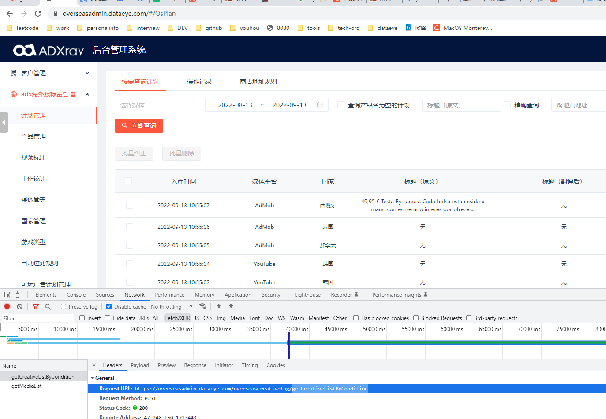
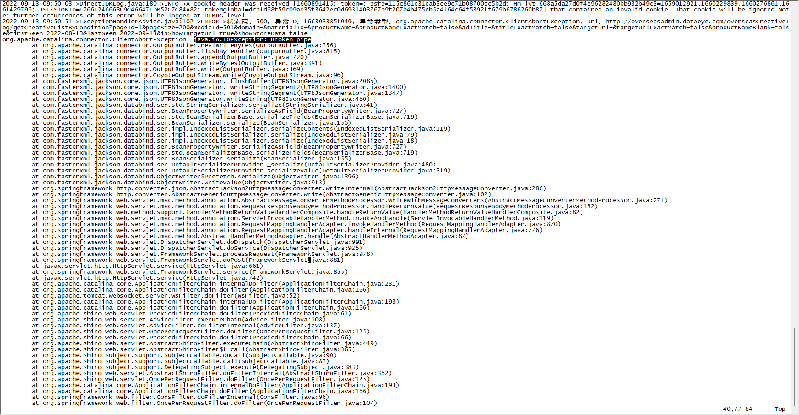
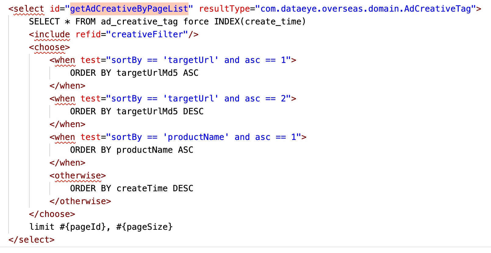

海外版管理后台查询特别慢，并且偶尔会报错；进到当前页面中默认会查询一个月的数据； 

堆栈信息

问题分析：
网络上查询“broken pipe” 异常出现的原因是读超时问题，即**服务端能够响应结果，但是客户端关闭了响应链接，导致服务端无法写入数据**；
在代码中，客户端和服务器端进行交互的只可能是两种： 前端与后端交互、后端与MySQL数据库交互。继续看堆栈信息，并没有找到对应的MySQL相关的异常信息，可以肯定的是应该是前后端的交互问题。了解到前后端的部署视图后，发现前端项目是部署到ng上的，而chrome控制台中恰好就报ng的504错误。而ng的504错误，就是“程序执行时间过长导致响应超时”，因此可以大概定位到是**后端响应数据再回写给前端时，ng把请求连接关闭了**，也就是读数据的socket关闭了，因此就报错了。

问题验证：
大概定位到是什么问题后，就要开始去验证。走读代码发现其中只做了数据的读数据操作，首先去看下主业务逻辑，只是从一张表中读数据，然后去读其他表，进行拼装组装。先看业务主表，发现数据量大概有200w，再去查看索引，发现索引有好几个，下一步骤，查看慢sql处理异常。

通过 show variables  like '%slow_query%'; 大概定位到具体的慢sql日志文件位置，让运维同事导出慢sql语句，发现其中查询这个业务主表的一条sql语句查询时长平均在300s左右，而其他慢sql查询平均时长在5s以内，显然是这个查询这个业务主表出现了问题了。问题得到验证。

问题解决：
拿到慢sql后，放到navicat中进行分析，发现这个sql只用到了其中的一个索引，而sql中还有另外一个字段也作为where中的筛选条件，使用这个字段作为筛选条件再去查询时，响应极其慢；再使用命中的筛选条件的索引字段去查询时，发现这个索引是个枚举值，也就是说索引用了跟没用效果一样。解决思路有两种，一种是对响应极慢的那个筛选条件创建索引，如果createTime分布均匀，则对这个字段创建索引应该不会起多大作用，因此可能需要另外一种方法，即创建联合索引。

在看需求侧，需求侧要求进入菜单就要查询数据库，而时间间隔是一个月，而筛选条件中恰好有createTime的字段。其他字段是业务要求无法更改，因此定下优化方案： 需求侧改成进来就查数据库，但是只查当天数据；后端对业务主表创建索引。

当然这种方式并不是最佳方式，因为即便是需求侧改成只查当天的数据，假设当天数据量很大，此处依然会出现同样的问题，要想彻底改变这种问题，可能需要从架构角度去进行优化，可以进行分库分表，或者把数据放入es或redis中【放入redis，可以使用其中的分布较为均匀的字段作为索引，在一定程度上会解决慢sql的问题】，但终极方式还是分库分表+es中聚合的方式进行解决。

感想：
问题出现，首先要定位问题，可以采取大胆猜测+验证的方式；定位到问题后要进行问题解决，可以通过后端代码调整、架构调整、需求调整的方式进行解决；解决后进行结果验证，就需要验证问题是否解决。

