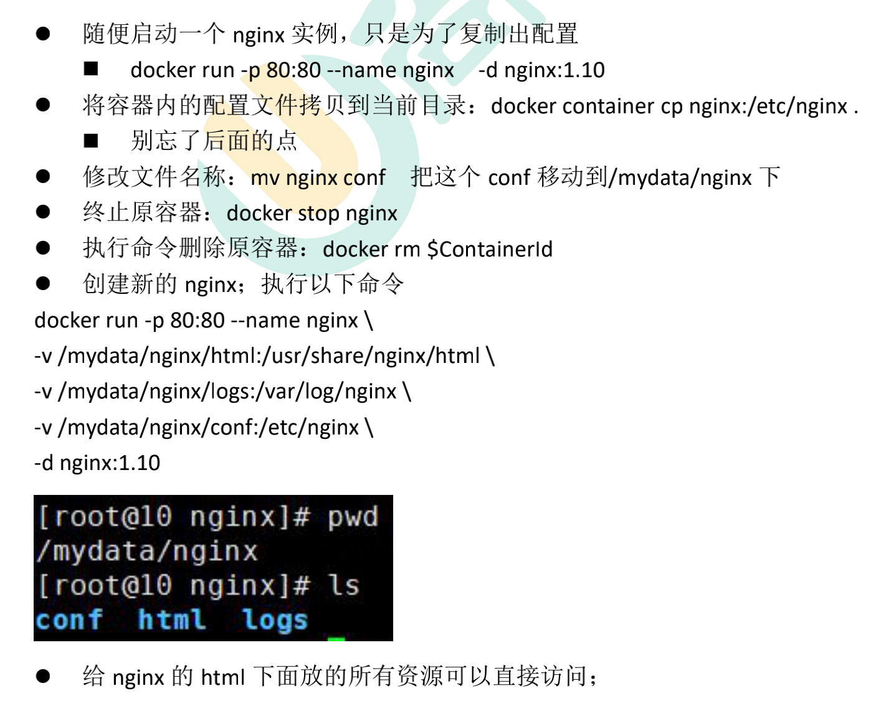

# nginx

<details class="details custom-block">

<summary>Centos安装nginx</summary>

- 安装依赖及工具

```shell
yum install -y gcc-c++ pcre pcre-devel zlib zlib-devel openssl openssl-devel
```

- 创建安装目录

```shell
mkdir /usr/setup/nginx-1.14.1
mkdir /usr/setup/nginx-1.14.1/temp
```

- 解压

```shell
tar zxf nginx-1.14.1.tar.gz
```

- 配置

```shell
cd nginx-1.14.1
./configure --prefix=/usr/setup/nginx-1.14.1 \
--with-http_stub_status_module \
--with-http_gzip_static_module \
--with-http_ssl_module \
--pid-path=/usr/setup/nginx-1.14.1/nginx.pid \
--lock-path=/usr/setup/nginx-1.14.1/lock/nginx.lock \
--error-log-path=/usr/setup/nginx-1.14.1/log/error.log \
--http-log-path=/usr/setup/nginx-1.14.1/log/access.log \
--http-client-body-temp-path=/usr/setup/nginx-1.14.1/temp/client \
--http-proxy-temp-path=/usr/setup/nginx-1.14.1/temp/proxy \
--http-fastcgi-temp-path=/usr/setup/nginx-1.14.1/temp/fastcgi \
--http-uwsgi-temp-path=/usr/setup/nginx-1.14.1/temp/uwsgi \
--http-scgi-temp-path=/usr/setup/nginx-1.14.1/temp/scgi

// 输出
Configuration summary
+ using system PCRE library
+ using system OpenSSL library
+ using system zlib library

nginx path prefix: "/usr/setup/nginx-1.14.1"
nginx binary file: "/usr/setup/nginx-1.14.1/sbin/nginx"
nginx modules path: "/usr/setup/nginx-1.14.1/modules"
nginx configuration prefix: "/usr/setup/nginx-1.14.1/conf"
nginx configuration file: "/usr/setup/nginx-1.14.1/conf/nginx.conf"
nginx pid file: "/usr/setup/nginx-1.14.1/nginx.pid"
nginx error log file: "/usr/setup/nginx-1.14.1/log/error.log"
nginx http access log file: "/usr/setup/nginx-1.14.1/log/access.log"
nginx http client request body temporary files: "/usr/setup/nginx-1.14.1/temp/client"
nginx http proxy temporary files: "/usr/setup/nginx-1.14.1/temp/proxy"
nginx http fastcgi temporary files: "/usr/setup/nginx-1.14.1/temp/fastcgi"
nginx http uwsgi temporary files: "/usr/setup/nginx-1.14.1/temp/uwsgi"
nginx http scgi temporary files: "/usr/setup/nginx-1.14.1/temp/scgi"
```

- 安装

```shell
make
make install
```

- 启动并测试

```shell
cd /usr/setup/nginx-1.14.1/sbin
./nginx
ps aux | grep nginx
firewall-cmd --zone=public --permanent --add-port=80/tcp
firewall-cmd --reload
```

- 配置自启动

```shell
vi /etc/systemd/system/nginx.service

[Unit]
Description=nginx
After=network.target

[Service]
Type=forking
ExecStart=/usr/setup/nginx-1.14.1/sbin/nginx
ExecReload=/usr/setup/nginx-1.14.1/sbin/nginx -s reload
ExecStop=/usr/setup/nginx-1.14.1/sbin/nginx -s quit
PrivateTmp=true

[Install]
WantedBy=multi-user.target

systemctl enable nginx.service
systemctl daemon-reload
```

</details>

```sh

docker run -p 80:80 -p 443:443 --name nginx \
-v /mnt/e/backup/html:/usr/share/nginx/html \
-v /mydata/nginx/logs:/var/log/nginx \
-v /mydata/nginx/conf:/etc/nginx \
-d nginx


docker update nginx --restart=always

```



## 1. 在 Nginx 上面配置 Https

### 1.1. 安装 Nginx

安装 Nginx，可以<a href="/post/dev/install/install-nginx" target="_blank">参考</a>。特别注意安装的时候要把 https 的支持模块安装上去。
也就是下面的内容：

```
> --with-http_stub_status_module \
> --with-http_gzip_static_module \
> --with-http_ssl_module
```

### 1.2. 配置

1. 在相关网络服务商平台上面申请 ssl 证书，并按照要求操作文件
2. 将 ssl 证书上传到 Nginx 的相关位置
3. 在 Nginx 的配置文件中添加下面内容

```shell
server {
    listen       80;
    server_name  abc.google.com;

    location / {
        rewrite ^(.*) https://abc.google.com/$1 permanent;  # 表示把指向http的请求转发到https上
    }
}
server {
    listen       443 ssl;
    server_name  abc.google.com;

    ssl_certificate      /xxx/xxx/nginx/conf/cert/abc/abc.google.com_ca.crt;  # 第二步ssl证书上传的位置
    ssl_certificate_key  /xxx/xxx/nginx/conf/cert/abc/abc.google.com.key;     # 第二步ssl证书上传的位置

    ssl_session_cache    shared:SSL:1m;
    ssl_session_timeout  5m;

    ssl_ciphers ALL:!DH:!EXPORT:!RC4:+HIGH:+MEDIUM:!LOW:!aNULL:!eNULL;
    ssl_protocols TLSv1 TLSv1.1 TLSv1.2;
    ssl_prefer_server_ciphers  on;

    location / {
        root   html/abc;  # 网站存放位置
        index  index.html index.htm;
    }
}
```

### 1.3. 问题

1. 需要开放 443、80 端口
2. ssl 证书需要按网络服务商要求修改

## 1. 配置 Tomcat 的 nginx 反向代理

### 1.1. 场景描述

将 Tomcat 的流量直接通过 nginx 代理，即使用 8101 端口监听 Tomcat 的 8080 端口

### 1.2. 配置步骤

- 创建 vhost 文件夹

在 nginx 的 conf 文件夹下创建`vhost`文件夹

- 创建 tomcat 的配置文件

在`vhost`文件夹下面创建`tomcat-8101.conf`文件，并写入以下内容：

```
server {
	listen       8101;
	server_name localhost;

	location / {
		proxy_pass http://127.0.0.1:8080;
	}
}
```

- 修改 nginx 的配置文件

在 http 模块任意处，添加`include vhost/*.conf`

- 重启 nginx

输入命令`systemctl restart nginx`

- 开放 8101 端口

输入命令`firewall-cmd --zone=public --add-port=8101/tcp --permanent`开放 8101 端口，并输入`firewall-cmd --reload`使防火墙生效【不要忘记关闭 8080 端口，关闭命令：`firewall-cmd --zone=public --remove-port=8080/tcp --permanent`】

- 测试

浏览器中输入`http://{ip}:8101`进行测试

## ng 配置反向代理

```shell
############################################################################
    # 1. 内容管理系统 start
    upstream manager.taotao.com {
	server 192.168.100.202:8081;
    }
    server {
        listen       80;
        server_name  manager.taotao.com;

        location / {
            proxy_pass   http://manager.taotao.com;
            index  index.html index.htm;
        }

        error_page   500 502 503 504  /50x.html;
        location = /50x.html {
            root   html;
        }
    }
    # 内容管理系统 end
    ############################################################################

    ############################################################################
    # 2. 门户服务器 start
    upstream www.taotao.com {
	server 192.168.100.202:8081;
    }
    server {
        listen       80;
        server_name  www.taotao.com;

        location / {
            proxy_pass   http://www.taotao.com;
            index  index.html index.htm;
        }

        error_page   500 502 503 504  /50x.html;
        location = /50x.html {
            root   html;
        }
    }
    # 门户服务器 end
    ############################################################################

    ############################################################################
    # 3. rest服务 start
    upstream rest.taotao.com {
	server 192.168.100.202:8081;
    }
    server {
        listen       80;
        server_name  rest.taotao.com;

        location / {
            proxy_pass   http://rest.taotao.com;
            index  index.html index.htm;
        }

        error_page   500 502 503 504  /50x.html;
        location = /50x.html {
            root   html;
        }
    }
    # rest服务 end
    ############################################################################

    ############################################################################
    # 4. sso单点登录 start
    upstream sso.taotao.com {
	server 192.168.100.202:8081;
    }
    server {
        listen       80;
        server_name  sso.taotao.com;

        location / {
            proxy_pass   http://sso.taotao.com;
            index  index.html index.htm;
        }

        error_page   500 502 503 504  /50x.html;
        location = /50x.html {
            root   html;
        }
    }
    # sso单点登录 end
    ############################################################################

    ############################################################################
    # 5. search服务 start
    upstream search.taotao.com {
	server 192.168.100.202:8081;
    }
    server {
        listen       80;
        server_name  search.taotao.com;

        location / {
            proxy_pass   http://search.taotao.com;
            index  index.html index.htm;
        }

        error_page   500 502 503 504  /50x.html;
        location = /50x.html {
            root   html;
        }
    }
    # search服务 end
    ############################################################################
```

> 来自: [2W 字你全面认识 Nginx](https://mp.weixin.qq.com/s/P-RZVpZ1zrIybzhEQy12ng)

> 来自: [Nginx 一网打尽：动静分离、压缩、缓存、黑白名单、跨域、高可用、性能优化](https://mp.weixin.qq.com/s/B7pjDIXHrvXqAXFSQDGVWQ)

> 来自: [深入 Nginx 之核心架构篇](https://mp.weixin.qq.com/s/3-9dMH90o4UpxG6veD_sgQ)
