# 数据类型

这里说的数据类型是指实际开发过程中，保存到 redis 的数据的类型，也就是 value 的类型，key 的类型是 string。

Redis 使用对象来表示每一个键值对，在 Redis 中创建的每一个键值对，Redis 都会为我们创建至少两个 RedisObject 对象，一个是键对象，即 key，一个是值对象，即 value。键对象的数据结构为字符串，而值对象因其保存的数据内容不一样，因而其使用的数据结构也不一样。事实上，数据库中的每个键、值, 以及 Redis 本身处理的参数, 都表示为这种数据类型.

## redis 中的数据结构

也可以说是 redis 的编码。

### SDS

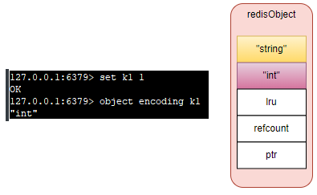

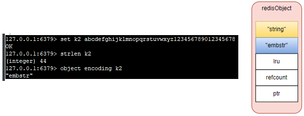


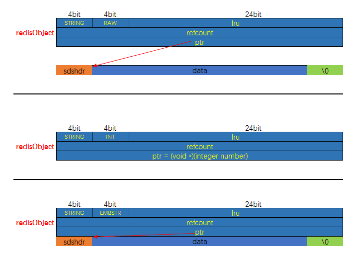

### ziplist


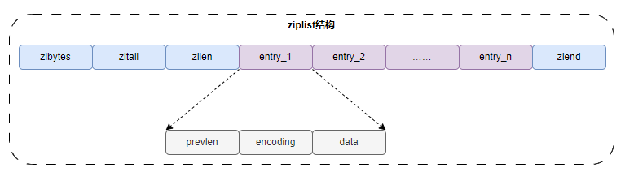

### quicklist


### hashtable


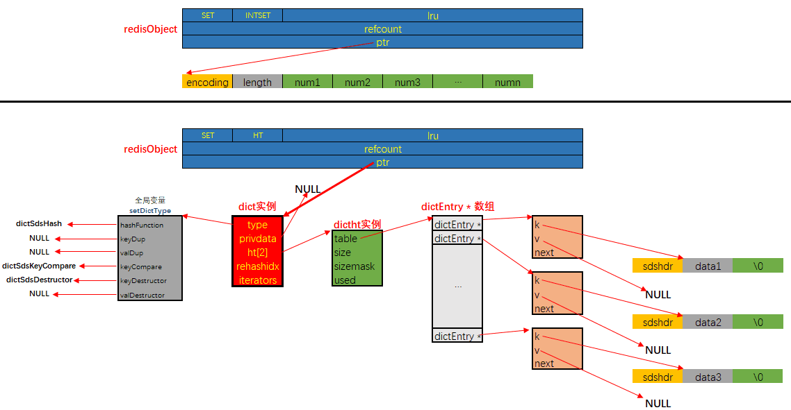

### skiplist

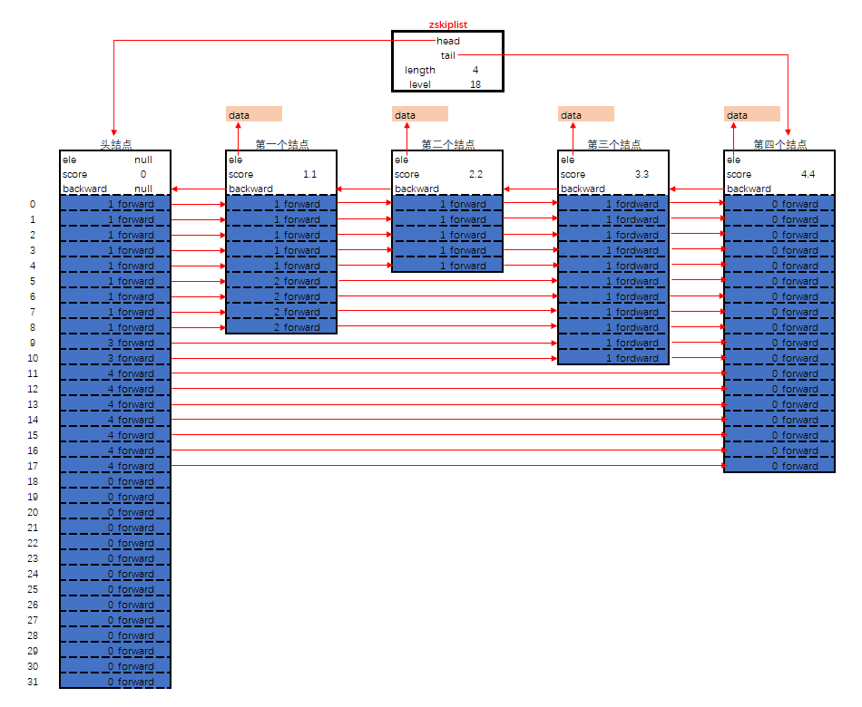

### 其他


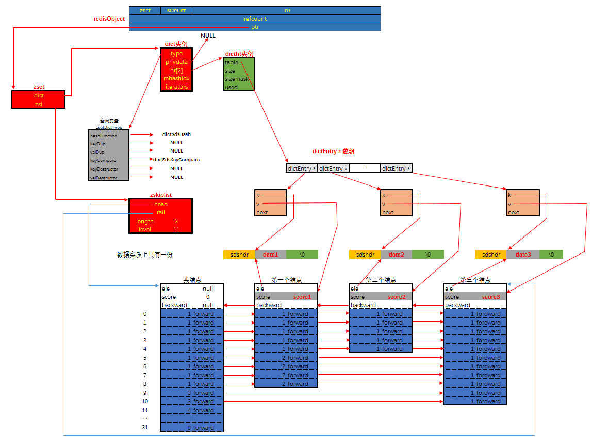

## 基本数据类型

> https://redis.io/docs/latest/develop/data-types/
>
> 对命令返回结果的说明：
>
> 1. https://redis.io/docs/latest/develop/reference/protocol-spec/
> 2. https://blog.csdn.net/qq_35946990/article/details/74502336

- String 字符串
- List 列表
- Set 集合
- Sorted set 有序集合
- Hash 哈希
- Stream 流
- Bitmap 位图
- Geospatial 地理空间
- Vector set 向量集合
- Bitfield 位域
- JSON
- Probabilistic data types 概率数据类型
  - HyperLogLog
  - Bloom filter 布隆过滤器
  - Cuckoo filter 斑马过滤器
  - t-digest t-摘要
  - Top-K
  - Count-min sketch 计数最小草图
- Time series 时间序列

### 客户端

官网上的客户端有[三个](https://redis.io/docs/latest/develop/tools/)：

1. redis-cli ：
2. Redis Insight ：
3. Redis for VS Code ：

### 查看命令的 man 说明

> 以 redis-cli 为例。

1. 使用 redis-cli 查看命令的帮助说明： https://redis.io/docs/latest/develop/tools/cli/#show-online-help-for-redis-commands
2. 可以使用 help @String 的方式直接获取某个数据类型的帮助命令的说明，当然也可以 help get 的方式获取某个命令的说明。
3. 注意： help 获取说明的命令，只能在 redis-cli 客户端上使用，不保证其其它客户端上同样有效。

<details>

<summary>Tips for collapsed sections</summary>

</details>

::: details 使用 redis-cli 查看 string 的所有命令，并输出到文件

```sh
[root@10 bin]# ./redis-cli help @string > string-command.log
[root@10 bin]# cat string-command.log

  APPEND key value
  summary: Append a value to a key
  since: 2.0.0

  DECR key
  summary: Decrement the integer value of a key by one
  since: 1.0.0

  DECRBY key decrement
  summary: Decrement the integer value of a key by the given number
  since: 1.0.0

  GET key
  summary: Get the value of a key
  since: 1.0.0

  GETDEL key
  summary: Get the value of a key and delete the key
  since: 6.2.0

  GETEX key [EX seconds|PX milliseconds|EXAT unix-time-seconds|PXAT unix-time-milliseconds|PERSIST]
  summary: Get the value of a key and optionally set its expiration
  since: 6.2.0

  GETRANGE key start end
  summary: Get a substring of the string stored at a key
  since: 2.4.0

  GETSET key value
  summary: Set the string value of a key and return its old value
  since: 1.0.0

  INCR key
  summary: Increment the integer value of a key by one
  since: 1.0.0

  INCRBY key increment
  summary: Increment the integer value of a key by the given amount
  since: 1.0.0

  INCRBYFLOAT key increment
  summary: Increment the float value of a key by the given amount
  since: 2.6.0

  LCS key1 key2 [LEN] [IDX] [MINMATCHLEN len] [WITHMATCHLEN]
  summary: Find longest common substring
  since: 7.0.0

  MGET key [key ...]
  summary: Get the values of all the given keys
  since: 1.0.0

  MSET key value [key value ...]
  summary: Set multiple keys to multiple values
  since: 1.0.1

  MSETNX key value [key value ...]
  summary: Set multiple keys to multiple values, only if none of the keys exist
  since: 1.0.1

  PSETEX key milliseconds value
  summary: Set the value and expiration in milliseconds of a key
  since: 2.6.0

  SET key value [NX|XX] [GET] [EX seconds|PX milliseconds|EXAT unix-time-seconds|PXAT unix-time-milliseconds|KEEPTTL]
  summary: Set the string value of a key
  since: 1.0.0

  SETEX key seconds value
  summary: Set the value and expiration of a key
  since: 2.0.0

  SETNX key value
  summary: Set the value of a key, only if the key does not exist
  since: 1.0.0

  SETRANGE key offset value
  summary: Overwrite part of a string at key starting at the specified offset
  since: 2.2.0

  STRLEN key
  summary: Get the length of the value stored in a key
  since: 2.2.0

  SUBSTR key start end
  summary: Get a substring of the string stored at a key
  since: 1.0.0

[root@10 bin]#
```

:::

### String 字符串

1. **应用场景**

   - 任何需要存储字符串的场景都可以
   - 特殊场景：会话信息的存储、token 的存储、

2. **命令**

   - 单键操作：get、getrange、getset、set、setrange、setnx、append、strlen
   - 多键操作：mset、msetnx、mget
   - 数字操作：incr、decr、incrby、decrby、incrbyfloat、decrbyfloat

   | 命令                                                 | 描述                                                                                             | 时间复杂度             |
   | ---------------------------------------------------- | ------------------------------------------------------------------------------------------------ | ---------------------- |
   | set key value [ex seconds] [px milliseconds] [nx xx] | 设置值                                                                                           | O(1)                   |
   | get key                                              | 获取值                                                                                           | O(1)                   |
   | del key [key ...]                                    | 删除 key                                                                                         | O(N)(N 是键的个数)     |
   | mset key [key value ...]                             | 批量设置值                                                                                       | O(N)(N 是键的个数)     |
   | mget key [key ...]                                   | 批量获取值                                                                                       | O(N)(N 是键的个数)     |
   | incr key                                             | 将 key 中储存的数字值增一                                                                        | O(1)                   |
   | decr key                                             | 将 key 中储存的数字值减一                                                                        | O(1)                   |
   | incrby key increment                                 | 将 key 所储存的值加上给定的增量值（increment）                                                   | O(1)                   |
   | decrby key increment key                             | 所储存的值减去给定的减量值（decrement）                                                          | O(1)                   |
   | incrbyfloat key increment                            | 将 key 所储存的值加上给定的浮点增量值（increment）                                               | O(1)                   |
   | append key value                                     | 如果 key 已经存在并且是一个字符串， APPEND 命令将指定的 value 追加到该 key 原来值（value）的末尾 | O(1)                   |
   | strlen key                                           | 返回 key 所储存的字符串值的长度。                                                                | O(1)                   |
   | setrange key offset value                            | 用 value 参数覆写给定 key 所储存的字符串值，从偏移量 offset 开始                                 | O(1)                   |
   | getrange key start end                               | 返回 key 中字符串值的子字符                                                                      | O(N)(N 是字符串的长度) |

3. **存储结构**

::: details 查看存储结构

```sh
127.0.0.1:6379> set k1 1
OK
127.0.0.1:6379> object encoding k1
"int"
127.0.0.1:6379> type k1
string

127.0.0.1:6379> set k2 abcdefghijklmnopqrstuvwxyz123456789012345678
OK
127.0.0.1:6379> strlen k2
(integer) 44
127.0.0.1:6379> object encoding k2
"embstr"
127.0.0.1:6379> type k2
string

127.0.0.1:6379> set k3 abcdefghijklmnopqrstuvwxyz1234567890123456789
OK
127.0.0.1:6379> strlen k3
(integer) 45
127.0.0.1:6379> object encoding k3
"raw"
127.0.0.1:6379> type k3
string
127.0.0.1:6379>

```

:::

底层数据结构为 SDS，但是根据保存的数据的类型以及数据长度，分为三种：

- **int 编码**：保存的是可以用 long 类型表示的整数值。
- **embstr 编码**：保存长度小于等于 44 字节的字符串（redis3.2 版本之前是 39 字节，之后是 44 字节）。
- **raw 编码**：保存长度大于 44 字节的字符串（redis3.2 版本之前是 39 字节，之后是 44 字节）。
- int： 存储的是整数且长度小于 20 字节，保存的是可以用 long 类型表示的整数值。
- embstr： 存储的是字符串且长度小于等于 44 字节【redis3.2 版本之前是 39 字节，之后是 44 字节】
- raw： 存储的是动态字符串，且长度大于 44 字节且小于 512Mb
  - redis 2.+ 是 32 字节
  - redis 3.0-4.0 是 39 字节
  - redis 5.0 是 44 字节

其实 embstr 编码是专门用来保存短字符串的一种优化编码，raw 和 embstr 的区别： embstr 与 raw 都使用 redisObject 和 sds 保存数据，区别在于，embstr 的使用只分配一次内存空间（因此 redisObject 和 sds 是连续的），而 raw 需要分配两次内存空间（分别为 redisObject 和 sds 分配空间）。因此与 raw 相比，embstr 的好处在于创建时少分配一次空间，删除时少释放一次空间，以及对象的所有数据连在一起，寻找方便。而 embstr 的坏处也很明显，如果字符串的长度增加需要重新分配内存时，整个 redisObject 和 sds 都需要重新分配空间，因此 redis 中的 embstr 实现为只读。

> ps： **Redis 中对于浮点数类型也是作为字符串保存的，在需要的时候再将其转换成浮点数类型**。

### List 列表

List 的数据结构，适合保存 `可以重复的、有序的数据集合`。

1. **应用场景**

   - lpush+lpop=Stack（栈）
   - lpush+rpop=Queue（队列）
   - lpush+ltrim=Capped Collection（有限集合）
   - lpush+brpop=Message Queue（消息队列）

2. **命令**

   - lpush
   - lrange
   - rpush
   - lpop
   - rpop
   - lindex
   - linsert
   - lset
   - ltrim
   - llen
   - lrem

   | 命令                                  | 描述                                                                  | 时间复杂度 |
   | ------------------------------------- | --------------------------------------------------------------------- | ---------- |
   | BLPOP key [key …] timeout             | 删除，并获得该列表中的第一元素，或阻塞，直到有一个可用                | O(1)       |
   | BRPOP key [key …] timeout             | 删除，并获得该列表中的最后一个元素，或阻塞，直到有一个可用            | O(1)       |
   | BRPOPLPUSH source destination timeout | 弹出一个列表的值，将它推到另一个列表，并返回它;或阻塞，直到有一个可用 | O(1)       |
   | LINDEX key index                      | 获取一个元素，通过其索引列表                                          | O(N)       |
   | LINSERT key BEFORE AFTER pivot value  | 在列表中的另一个元素之前或之后插入一个元素                            | O(N)       |
   | LLEN key                              | 获得队列(List)的长度                                                  | O(1)       |
   | LPOP key                              | 从队列的左边出队一个元素                                              | O(1)       |
   | LPUSH key value [value …]             | 从队列的左边入队一个或多个元素                                        | O(1)       |
   | LPUSHX key value                      | 当队列存在时，从队到左边入队一个元素                                  | O(1)       |
   | LRANGE key start stop                 | 从列表中获取指定返回的元素                                            | O(S+N)     |
   | LREM key count value                  | 从列表中删除元素                                                      | O(N)       |
   | LSET key index value                  | 设置队列里面一个元素的值                                              | O(N)       |
   | LTRIM key start stop                  | 修剪到指定范围内的清单                                                | O(N)       |
   | RPOP key                              | 从队列的右边出队一个元                                                | O(1)       |
   | RPOPLPUSH source destination          | 删除列表中的最后一个元素，将其追加到另一个列表                        | O(1)       |
   | RPUSH key value [value …]             | 从队列的右边入队一个元素                                              | O(1)       |
   | RPUSHX key value                      | 从队列的右边入队一个元素，仅队列存在时有效                            | O(1)       |

3. **存储结构**

::: details

```sh

 127.0.0.1:6379> lpush mylist 1 2 ll ls mem
 (integer) 5
 127.0.0.1:6379> lrange mylist 0 -1
 1) "mem"
 2) "ls"
 3) "ll"
 4) "2"
 5) "1"
 127.0.0.1:6379> lindex mylist -1
 "1"
 127.0.0.1:6379> lindex mylist 10        # index不在 mylist 的区间范围内
 (nil)
127.0.0.1:6379> lpush mylist 1 2 ll ls mem
(integer) 5
127.0.0.1:6379> object encoding mylist
"quicklist"

127.0.0.1:6379> lpush mylist \xe7\xbb\x83\xe6\xb0\x94\xe5\x8a\x9f\xe4\xb8\xba\xe4\xba\x86\xe5\xba\xb7\xe5\xa4\x8d\xe4\xbd\x93\xe8\xb4\xa8\xef\xbc\x8c\xe7\x99\xbe\xe7\x97\x85\xe4\xb8\x8d\xe7\x94\x9f\xef\xbc\x8c\xe5\x8f\xaf\xe6\x98\xaf\xe5\x90\x84\xe4\xba\xba\xe7\xbb\x83\xe5\x8a\x9f\xe5\x8a\x9f\xe6\x95\x88\xe6\x9c\x89\xe5\x88\xab\xef\xbc\x8c\xe4\xbd\x93\xe8\xb4\xa8\xe5\xbc\xba\xe8\x80\x85\xe5\x8a\x9f\xe6\x95\x88\xe5\xbf\xab\xef\xbc\x8c\xe4\xbd\x93\xe8\xb4\xa8\xe5\xbc\xb1\xe8\x80\x85\xe5\x8a\x9f\xe6\x95\x88\xe6\x85\xa2\xe3\x80\x82\xe5\x9b\xa0\xe6\xad\xa4\xef\xbc\x8c\xe4\xb8\x8d\xe9\xa1\xbb\xe6\x80\xa5\xe4\xba\x8e\xe6\xb1\x82\xe6\x95\x88\xef\xbc\x8c\xe5\x8f\xaa\xe6\x9c\x89\xe6\x8a\x8a\xe7\xad\x91\xe5\x9f\xba\xe5\x8a\x9f\xe5\xa4\xab\xe7\xbb\x83\xe6\x88\x90\xef\xbc\x8c\xe6\x89\x8d\xe6\x9c\x89\xe6\x97\xa5\xe6\x96\xb0\xe6\x9c\x88\xe5\xbc\x82\xe7\x9a\x84\xe6\x95\x88\xe6\x9e\x9c\xe3\x80\x82\xef\xbc\x88\xe3\x80\x8a\xe6\x82\x9f\xe7\x9c\x9f\xe7\xaf\x87\xe3\x80\x8b\xef\xbc\x9a\xe3\x80\x8c\xe8\xa6\x81\xe5\xbe\x97\xe8\xb0\xb7\xe6\x9f\x9b\xe9\x95\xbf\xe4\xb8\x8d\xe6\xad\xbb\xef\xbc\x8c\xe9\xa1\xbb\xe5\x87\xad\xe7\x8e\x84\xe7\x89\x9d\xe7\xab\x8b\xe6\xa0\xb9\xe5\x9f\xba\xe3\x80\x82\xe3\x80\x8d\xef\xbc\x89\xe6\xaf\x8f\xe4\xba\x8e\xe9\x9d\x99\xe5\x9d\x90\xe4\xb9\x8b\xe5\x89\x8d\xef\xbc\x8c\xe5\x8a\xa1\xe8\xa6\x81\xe6\x89\xab\xe9\x99\xa4\xe4\xb8\x80\xe5\x88\x87\xe6\x9d\x82\xe5\xbf\xb5\xef\xbc\x8c\xe5\xae\xbd\xe8\xa1\xa3\xe6\x9d\xbe\xe5\xb8\xa6\xef\xbc\x8c\xe8\xba\xab\xe4\xbd\x93\xe4\xb8\x8d\xe5\x8f\x97\xe6\x9d\x9f\xe7\xbc\x9a\xef\xbc\x8c\xe7\xab\xaf\xe5\x9d\x90\xe5\x9c\xa8\xe6\xa4\x85\xe5\xad\x90\xe4\xb8\x8a\xef\xbc\x8c\xe4\xb8\xa4\xe8\x85\xbf\xe5\x9e\x82\xe5\x9c\xb0\xef\xbc\x8c\xe4\xb8\xa4\xe6\x89\x8b\xe6\x94\xbe\xe5\x9c\xa8\xe8\x86\x9d\xe7\x9b\x96\xe4\xb8\x8a\xe3\x80\x82\xe6\x8a\x8a\xe4\xb8\xa4\xe7\x9b\xae\xe5\xbc\xa0\xe5\xbc\x80\xef\xbc\x8c\xe5\x90\x91\xe5\x89\x8d\xe5\xb9\xb3\xe8\xa7\x86\xef\xbc\x8c\xe6\x8a\x8a\xe7\x9b\xae\xe5\x85\x89\xe5\x87\x9d\xe8\xa7\x86\xe4\xba\x8e\xe4\xb8\xa4\xe7\x9c\xbc\xe4\xb9\x8b\xe5\x89\x8d\xe7\x9a\x84\xe6\xad\xa3\xe4\xb8\xad\xe5\xa4\x84\xef\xbc\x8c\xe7\x9c\xbc\xe7\x8f\xa0\xe5\xb0\xbd\xe9\x87\x8f\xe4\xbf\x9d\xe6\x8c\x81\xe4\xb8\x8d\xe5\x8a\xa8\xef\xbc\x8c\xe6\x85\xa2\xe6\x85\xa2\xe5\x9c\xb0\xe6\x94\xb6\xe5\x9b\x9e\xe7\x9b\xae\xe5\x85\x89\xef\xbc\x8c\xe4\xb8\x8d\xe5\x81\x8f\xe4\xb8\x8d\xe4\xbe\x9d\xe5\x9c\xb0\xe9\x9a\x8f\xe5\xbf\x83\xe6\x84\x8f\xe6\x94\xbe\xe5\x9c\xa8\xe4\xb8\xa4\xe7\x9c\xbc\xe4\xb8\xad\xe9\x97\xb4\xe8\xa2\x93\xe7\xaa\x8d\xe7\xa9\xb4\xe9\x87\x8c\xef\xbc\x8c\xe5\x8d\x8a\xe7\x9d\x81\xe5\x8d\x8a\xe9\x97\xad\xef\xbc\x8c\xe5\xa4\x96\xe9\x97\xad\xe5\x86\x85\xe7\x9d\x81\xe8\xa7\x82\xe7\x9c\x8b\xe9\xbc\xbb\xe7\xab\xaf\xe8\xa2\x93\xe7\xaa\x8d\xe7\xa9\xb4\xe5\x86\x85\xe7\x9a\x84\xe3\x80\x8c\xe7\xa9\xba\xe8\x99\x9a\xe4\xb9\x8b\xe5\x85\x89\xe3\x80\x8d\xef\xbc\x8c\xe7\x94\xa8\xe6\x84\x8f\xe4\xb8\x8d\xe7\x94\xa8\xe5\x8a\x9b\xe3\x80\x81\xe4\xbc\xbc\xe8\xa7\x82\xe9\x9d\x9e\xe8\xa7\x82\xef\xbc\x8c\xe8\xa7\x82\xe5\x88\xb0\xe8\xa2\x93\xe7\xaa\x8d\xe5\x86\x85\xe5\x8f\x91\xe8\x83\x80\xe3\x80\x81\xe5\x8f\x91\xe7\xb4\xa7\xe3\x80\x81\xe6\x84\x9f\xe5\x88\xb0\xe6\xb8\xa9\xe6\x9a\x96\xef\xbc\x8c\xe8\xbe\xbe\xe5\x88\xb0\xe8\xbf\x99\xe4\xb8\xaa\xe7\x9a\x84\xe6\xa0\x87\xe5\x87\x86\xe6\x97\xb6\xef\xbc\x8c\xe5\x86\x8d\xe7\x94\xa8\xe6\x84\x8f\xe5\xbf\xb5\xe8\xbd\xbb\xe8\xbd\xbb\xe5\x9c\xb0\xe5\xbc\x95\xe3\x80\x8c\xe7\xa9\xba\xe8\x99\x9a\xe4\xb9\x8b\xe5\x85\x89\xe3\x80\x8d\xe5\x90\x91\xe8\x84\x90\xe4\xb8\x8b\xe4\xb8\xb9\xe7\x94\xb0\xe7\x85\xa7\xe8\xa7\x86\xef\xbc\x8c\xe5\x86\x85\xe8\xa7\x86\xe8\x85\xb9\xe4\xb8\xad\xe4\xb8\x80\xe4\xb8\xaa\xe8\x99\x9a\xe7\xa9\xba\xe5\xa2\x83\xe5\x9c\xb0\xef\xbc\x8c\xe8\xa6\x81\xe6\x9c\x97\xe5\xbd\xbb\xe5\x85\xb6\xe5\x85\x89\xef\xbc\x8c\xe5\xa6\x82\xe5\x90\x8c\xe5\xa4\xa9\xe7\xa9\xba\xe6\x97\xa0\xe4\xba\x91\xe9\x81\xae\xe8\x94\xbd\xe6\x97\xb6\xe5\xa4\xaa\xe9\x98\xb3\xe7\x85\xa7\xe5\xb0\x84\xe5\xa4\xa7\xe5\x9c\xb0\xe4\xb8\x80\xe6\xa0\xb7\xe3\x80\x82\xe9\x9d\x99\xe8\x87\xb3\xe4\xba\x8e\xe6\x9e\x81\xef\xbc\x8c\xe5\x88\xb0\xe6\x97\xa0\xe6\x88\x91\xe6\x97\xa0\xe7\x9b\xb8\xe6\x97\xb6\xef\xbc\x8c\xe5\xb0\xb1\xe4\xba
(integer) 6
127.0.0.1:6379> object encoding mylist
"quicklist"
127.0.0.1:6379> type mylist
list

```

:::

- Redis3.2 版本以前： 内部编码方式有两种
  - **ziplist**（压缩列表）：当列表的元素个数小于 `list-max-ziplist-entries` 配置（`默认512个`），同时列表中每个元素的值都小于 `list-max-ziplist-value` 配置时（`默认64字节`），Redis 会选用 ziplist 来作为列表的内部实现来减少内存的使用。
  - **linkedlist**（链表）：当列表类型无法满足 ziplist 的条件时，Redis 会使用 linkedlist 作为列表的内部实现。
- Redis3.2 版本开始， 使用 quicklist 代替了 ziplist 和 linkedlist
- Redis 5.0 设计了新的数据结构 listpack，沿用了压缩列表紧凑型的内存布局，最终在最新的 Redis 版本，将 Hash 对象和 Zset 对象的底层数据结构实现之一的压缩列表，替换成由 listpack 实现
- 进一步的, 目前 Redis 定义的 10 个对象编码方式宏名中, 有两个被完全闲置了, 分别是: OBJ_ENCODING_ZIPMAP 与 OBJ_ENCODING_LINKEDLIST。 从 Redis 的演进历史上来看, 前者是后续可能会得到支持的编码值（代码还在）, 后者则应该是被彻底淘汰了)

```sh
> config get list*
1) "list-compress-depth"
2) "0"
3) "list-max-listpack-size"
4) "-2"
5) "list-max-ziplist-size"
6) "-2"
```

4. **其它**

### Set 集合

保存不可重复的、无序的元素集合。

1. **应用场景**

   - 任何用来去重的场景和保证数据唯一性的场景
   - 求交差并补集合
   - 我关注的、关注我的
   - **标签**（tag）,给用户添加标签，或者用户给消息添加标签，这样有同一标签或者类似标签的可以给推荐关注的事或者关注的人。
   - **点赞，或点踩，收藏等**，可以放到 set 中实现

2. **命令**

   - sadd
   - smembers
   - scard
   - sismember
   - smove
   - srem
   - spop
   - srandmember
   - sinter
   - sinterstore
   - sunion
   - sunionstore
   - sdiff
   - sdiffstore

| 命令                                           | 描述                                           | 时间复杂度 |
| ---------------------------------------------- | ---------------------------------------------- | ---------- |
| SADD key member [member …]                     | 添加一个或者多个元素到集合(set)里              | O(N)       |
| SCARD key                                      | 获取集合里面的元素数量                         | O(1)       |
| SDIFF key [key …]                              | 获得队列不存在的元素                           | O(N)       |
| SDIFFSTORE destination key [key …]             | 获得队列不存在的元素，并存储在一个关键的结果集 | O(N)       |
| SINTER key [key …]                             | 获得两个集合的交集                             | O(N\*M)    |
| SINTERSTORE destination key [key …]            | 获得两个集合的交集，并存储在一个关键的结果集   | O(N\*M)    |
| SISMEMBER key member                           | 确定一个给定的值是一个集合的成员               | O(1)       |
| SMEMBERS key                                   | 获取集合里面的所有元素                         | O(N)       |
| SMOVE source destination member                | 移动集合里面的一个元素到另一个集合             | O(1)       |
| SPOP key [count]                               | 删除并获取一个集合里面的元素                   | O(1)       |
| SRANDMEMBER key [count]                        | 从集合里面随机获取一个元素                     |            |
| SREM key member [member …]                     | 从集合里删除一个或多个元素                     | O(N)       |
| SUNION key [key …]                             | 添加多个 set 元素                              | O(N)       |
| SUNIONSTORE destination key [key …]            | 合并 set 元素，并将结果存入新的 set 里面       | O(N)       |
| SSCAN key cursor [MATCH pattern] [COUNT count] | 迭代 set 里面的元素                            | O(1)       |

3. **存储结构**

::: details

```sh
127.0.0.1:6379> sadd myset hao hao1 xiaohao hao
(integer) 3
127.0.0.1:6379> object encoding myset
"hashtable"
127.0.0.1:6379> sadd myset2 12 123 432 1235
(integer) 4
127.0.0.1:6379> object encoding myset2
"intset"
127.0.0.1:6379> type myset
set
127.0.0.1:6379> type myset2
set


```

:::

- `intset` ： 当【**集合中的元素都是整数】**且【**元素个数小于 **`**set-maxintset-entries**`** 配置（默认 512 个）】**时，Redis 会选用 intset 来作为集合的内部实现，从而减少内存的使用。
- `hashtable` ： 集合类型无法满足 intset 的条件时，Redis 会使用 hashtable 作为集合的内部实现。

4. **其它**

```sh
> config get set*
1) "set-max-intset-entries"
2) "512"
3) "set-proc-title"
4) "yes"
```

### Sorted set 有序集合

保存 `不可重复、具有顺序`的元素集合，保存的元素不能重复，但是分数可以重复。

1. **应用场景**

   - 微博中的热搜等场景
   - 排行榜：有序集合经典使用场景。例如小说视频等网站需要对用户上传的小说视频做排行榜，榜单可以按照用户关注数，更新时间，字数等打分，做排行。

2. **命令**

   - zadd
   - zrange
   - zrem
   - zscore
   - zrangebyscore
   - zrank
   - zcard
   - zcount
   - zincrby
   - zrevrank
   - zremrangebyrank
   - zremrangebyscore
   - zinterstore
   - zunionstore

   | 命令                                                           | 描述                                                                       | 时间复杂度       |
   | -------------------------------------------------------------- | -------------------------------------------------------------------------- | ---------------- |
   | BZPOPMAX key [key …] timeout                                   | 从一个或多个排序集中删除并返回得分最高的成员，或阻塞，直到其中一个可用为止 | O(log(N))        |
   | BZPOPMIN key [key …] timeout                                   | 从一个或多个排序集中删除并返回得分最低的成员，或阻塞，直到其中一个可用为止 | O(log(N))        |
   | ZADD key [NXXX] [CH] [INCR] score member [score member …]      | 添加到有序 set 的一个或多个成员，或更新的分数，如果它已经存在              | O(log(N))        |
   | ZCARD key                                                      | 获取一个排序的集合中的成员数量                                             | O(1)             |
   | ZCOUNT key min max                                             | 返回分数范围内的成员数量                                                   | O(log(N))        |
   | ZINCRBY key increment member                                   | 增量的一名成员在排序设置的评分                                             | O(log(N))        |
   | ZINTERSTORE                                                    | 相交多个排序集，导致排序的设置存储在一个新的关键                           | O(NK)+O(Mlog(M)) |
   | ZLEXCOUNT key min max                                          | 返回成员之间的成员数量                                                     | O(log(N))        |
   | ZPOPMAX key [count]                                            | 删除并返回排序集中得分最高的成员                                           | O(log(N)\*M)     |
   | ZPOPMIN key [count]                                            | 删除并返回排序集中得分最低的成员                                           | O(log(N)\*M)     |
   | ZRANGE key start stop [WITHSCORES]                             | 根据指定的 index 返回，返回 sorted set 的成员列表                          | O(log(N)+M)      |
   | ZRANGEBYLEX key min max [LIMIT offset count]                   | 返回指定成员区间内的成员，按字典正序排列, 分数必须相同。                   | O(log(N)+M)      |
   | ZREVRANGEBYLEX key max min [LIMIT offset count]                | 返回指定成员区间内的成员，按字典倒序排列, 分数必须相同                     | O(log(N)+M)      |
   | ZRANGEBYSCORE key min max [WITHSCORES] [LIMIT offset count]    | 返回有序集合中指定分数区间内的成员，分数由低到高排序。                     | O(log(N)+M)      |
   | ZRANK key member                                               | 确定在排序集合成员的索引                                                   | O(log(N))        |
   | ZREM key member [member …]                                     | 从排序的集合中删除一个或多个成员                                           | O(M\*log(N))     |
   | ZREMRANGEBYLEX key min max                                     | 删除名称按字典由低到高排序成员之间所有成员。                               | O(log(N)+M)      |
   | ZREMRANGEBYRANK key start stop                                 | 在排序设置的所有成员在给定的索引中删除                                     | O(log(N)+M)      |
   | ZREMRANGEBYSCORE key min max                                   | 删除一个排序的设置在给定的分数所有成员                                     | O(log(N)+M)      |
   | ZREVRANGE key start stop [WITHSCORES]                          | 在排序的设置返回的成员范围，通过索引，下令从分数高到低                     | O(log(N)+M)      |
   | ZREVRANGEBYSCORE key max min [WITHSCORES] [LIMIT offset count] | 返回有序集合中指定分数区间内的成员，分数由高到低排序。                     | O(log(N)+M)      |
   | ZREVRANK key member                                            | 确定指数在排序集的成员，下令从分数高到低                                   | O(log(N))        |
   | ZSCORE key member                                              | 获取成员在排序设置相关的比分                                               | O(1)             |
   | ZUNIONSTORE                                                    | 添加多个排序集和导致排序的设置存储在一个新的关键                           | O(N)+O(M log(M)) |
   | ZSCAN key cursor [MATCH pattern] [COUNT count]                 | 迭代 sorted sets 里面的元素                                                | O(1)             |

3. **存储结构**

::: details

```sh
127.0.0.1:6379> zadd myscoreset 100 hao 90 xiaohao
(integer) 2
127.0.0.1:6379> object encoding myscoreset
"listpack"
127.0.0.1:6379> zadd myscoreset 80 \xe7\xbb\x83\xe6\xb0\x94\xe5\x8a\x9f\xe4\xb8\xba\xe4\xba\x86\xe5\xba\xb7\xe5\xa4\x8d\xe4\xbd\x93\xe8\xb4\xa8\xef\xbc\x8c\xe7\x99\xbe\xe7\x97\x85\xe4\xb8\x8d\xe7\x94\x9f\xef\xbc\x8c\xe5\x8f\xaf\xe6\x98\xaf\xe5\x90\x84\xe4\xba\xba\xe7\xbb\x83\xe5\x8a\x9f\xe5\x8a\x9f\xe6\x95\x88\xe6\x9c\x89\xe5\x88\xab\xef\xbc\x8c\xe4\xbd\x93\xe8\xb4\xa8\xe5\xbc\xba\xe8\x80\x85\xe5\x8a\x9f\xe6\x95\x88\xe5\xbf\xab\xef\xbc\x8c\xe4\xbd\x93\xe8\xb4\xa8\xe5\xbc\xb1\xe8\x80\x85\xe5\x8a\x9f\xe6\x95\x88\xe6\x85\xa2\xe3\x80\x82\xe5\x9b\xa0\xe6\xad\xa4\xef\xbc\x8c\xe4\xb8\x8d\xe9\xa1\xbb\xe6\x80\xa5\xe4\xba\x8e\xe6\xb1\x82\xe6\x95\x88\xef\xbc\x8c\xe5\x8f\xaa\xe6\x9c\x89\xe6\x8a\x8a\xe7\xad\x91\xe5\x9f\xba\xe5\x8a\x9f\xe5\xa4\xab\xe7\xbb\x83\xe6\x88\x90\xef\xbc\x8c\xe6\x89\x8d\xe6\x9c\x89\xe6\x97\xa5\xe6\x96\xb0\xe6\x9c\x88\xe5\xbc\x82\xe7\x9a\x84\xe6\x95\x88\xe6\x9e\x9c\xe3\x80\x82\xef\xbc\x88\xe3\x80\x8a\xe6\x82\x9f\xe7\x9c\x9f\xe7\xaf\x87\xe3\x80\x8b\xef\xbc\x9a\xe3\x80\x8c\xe8\xa6\x81\xe5\xbe\x97\xe8\xb0\xb7\xe6\x9f\x9b\xe9\x95\xbf\xe4\xb8\x8d\xe6\xad\xbb\xef\xbc\x8c\xe9\xa1\xbb\xe5\x87\xad\xe7\x8e\x84\xe7\x89\x9d\xe7\xab\x8b\xe6\xa0\xb9\xe5\x9f\xba\xe3\x80\x82\xe3\x80\x8d\xef\xbc\x89\xe6\xaf\x8f\xe4\xba\x8e\xe9\x9d\x99\xe5\x9d\x90\xe4\xb9\x8b\xe5\x89\x8d\xef\xbc\x8c\xe5\x8a\xa1\xe8\xa6\x81\xe6\x89\xab\xe9\x99\xa4\xe4\xb8\x80\xe5\x88\x87\xe6\x9d\x82\xe5\xbf\xb5\xef\xbc\x8c\xe5\xae\xbd\xe8\xa1\xa3\xe6\x9d\xbe\xe5\xb8\xa6\xef\xbc\x8c\xe8\xba\xab\xe4\xbd\x93\xe4\xb8\x8d\xe5\x8f\x97\xe6\x9d\x9f\xe7\xbc\x9a\xef\xbc\x8c\xe7\xab\xaf\xe5\x9d\x90\xe5\x9c\xa8\xe6\xa4\x85\xe5\xad\x90\xe4\xb8\x8a\xef\xbc\x8c\xe4\xb8\xa4\xe8\x85\xbf\xe5\x9e\x82\xe5\x9c\xb0\xef\xbc\x8c\xe4\xb8\xa4\xe6\x89\x8b\xe6\x94\xbe\xe5\x9c\xa8\xe8\x86\x9d\xe7\x9b\x96\xe4\xb8\x8a\xe3\x80\x82\xe6\x8a\x8a\xe4\xb8\xa4\xe7\x9b\xae\xe5\xbc\xa0\xe5\xbc\x80\xef\xbc\x8c\xe5\x90\x91\xe5\x89\x8d\xe5\xb9\xb3\xe8\xa7\x86\xef\xbc\x8c\xe6\x8a\x8a\xe7\x9b\xae\xe5\x85\x89\xe5\x87\x9d\xe8\xa7\x86\xe4\xba\x8e\xe4\xb8\xa4\xe7\x9c\xbc\xe4\xb9\x8b\xe5\x89\x8d\xe7\x9a\x84\xe6\xad\xa3\xe4\xb8\xad\xe5\xa4\x84\xef\xbc\x8c\xe7\x9c\xbc\xe7\x8f\xa0\xe5\xb0\xbd\xe9\x87\x8f\xe4\xbf\x9d\xe6\x8c\x81\xe4\xb8\x8d\xe5\x8a\xa8\xef\xbc\x8c\xe6\x85\xa2\xe6\x85\xa2\xe5\x9c\xb0\xe6\x94\xb6\xe5\x9b\x9e\xe7\x9b\xae\xe5\x85\x89\xef\xbc\x8c\xe4\xb8\x8d\xe5\x81\x8f\xe4\xb8\x8d\xe4\xbe\x9d\xe5\x9c\xb0\xe9\x9a\x8f\xe5\xbf\x83\xe6\x84\x8f\xe6\x94\xbe\xe5\x9c\xa8\xe4\xb8\xa4\xe7\x9c\xbc\xe4\xb8\xad\xe9\x97\xb4\xe8\xa2\x93\xe7\xaa\x8d\xe7\xa9\xb4\xe9\x87\x8c\xef\xbc\x8c\xe5\x8d\x8a\xe7\x9d\x81\xe5\x8d\x8a\xe9\x97\xad\xef\xbc\x8c\xe5\xa4\x96\xe9\x97\xad\xe5\x86\x85\xe7\x9d\x81\xe8\xa7\x82\xe7\x9c\x8b\xe9\xbc\xbb\xe7\xab\xaf\xe8\xa2\x93\xe7\xaa\x8d\xe7\xa9\xb4\xe5\x86\x85\xe7\x9a\x84\xe3\x80\x8c\xe7\xa9\xba\xe8\x99\x9a\xe4\xb9\x8b\xe5\x85\x89\xe3\x80\x8d\xef\xbc\x8c\xe7\x94\xa8\xe6\x84\x8f\xe4\xb8\x8d\xe7\x94\xa8\xe5\x8a\x9b\xe3\x80\x81\xe4\xbc\xbc\xe8\xa7\x82\xe9\x9d\x9e\xe8\xa7\x82\xef\xbc\x8c\xe8\xa7\x82\xe5\x88\xb0\xe8\xa2\x93\xe7\xaa\x8d\xe5\x86\x85\xe5\x8f\x91\xe8\x83\x80\xe3\x80\x81\xe5\x8f\x91\xe7\xb4\xa7\xe3\x80\x81\xe6\x84\x9f\xe5\x88\xb0\xe6\xb8\xa9\xe6\x9a\x96\xef\xbc\x8c\xe8\xbe\xbe\xe5\x88\xb0\xe8\xbf\x99\xe4\xb8\xaa\xe7\x9a\x84\xe6\xa0\x87\xe5\x87\x86\xe6\x97\xb6\xef\xbc\x8c\xe5\x86\x8d\xe7\x94\xa8\xe6\x84\x8f\xe5\xbf\xb5\xe8\xbd\xbb\xe8\xbd\xbb\xe5\x9c\xb0\xe5\xbc\x95\xe3\x80\x8c\xe7\xa9\xba\xe8\x99\x9a\xe4\xb9\x8b\xe5\x85\x89\xe3\x80\x8d\xe5\x90\x91\xe8\x84\x90\xe4\xb8\x8b\xe4\xb8\xb9\xe7\x94\xb0\xe7\x85\xa7\xe8\xa7\x86\xef\xbc\x8c\xe5\x86\x85\xe8\xa7\x86\xe8\x85\xb9\xe4\xb8\xad\xe4\xb8\x80\xe4\xb8\xaa\xe8\x99\x9a\xe7\xa9\xba\xe5\xa2\x83\xe5\x9c\xb0\xef\xbc\x8c\xe8\xa6\x81\xe6\x9c\x97\xe5\xbd\xbb\xe5\x85\xb6\xe5\x85\x89\xef\xbc\x8c\xe5\xa6\x82\xe5\x90\x8c\xe5\xa4\xa9\xe7\xa9\xba\xe6\x97\xa0\xe4\xba\x91\xe9\x81\xae\xe8\x94\xbd\xe6\x97\xb6\xe5\xa4\xaa\xe9\x98\xb3\xe7\x85\xa7\xe5\xb0\x84\xe5\xa4\xa7\xe5\x9c\xb0\xe4\xb8\x80\xe6\xa0\xb7\xe3\x80\x82\xe9\x9d\x99\xe8\x87\xb3\xe4\xba\x8e\xe6\x9e\x81\xef\xbc\x8c\xe5\x88\xb0\xe6\x97\xa0\xe6\x88\x91\xe6\x97\xa0\xe7\x9b\xb8\xe6\x97\xb6\xef\xbc\x8c\xe5\xb0\xb1\xe4\xba
(integer) 1
127.0.0.1:6379> object encoding myscoreset
"skiplist"

127.0.0.1:6379> type myscoreset
"zset"


> config get zset*
1) "zset-max-ziplist-value"
2) "64"
3) "zset-max-listpack-entries"
4) "128"
5) "zset-max-listpack-value"
6) "64"
7) "zset-max-ziplist-entries"
8) "128"
```

:::

- **`ziplist`**： 当数据比较少时，有序集合使用的是 ziplist 存储的，有序集合使用 ziplist 格式存储必须满足以下两个条件：
  - 元素个数小于 `zset-max-ziplist-entries（默认 128个）`
  - 所有元素成员的长度要小于 `zset-max-ziplist-value（默认 64字节）`
- **`skiplist`**： 如果不能满足以上两个条件中的任意一个，有序集合将会使用 skiplist 结构进行存储。

4. **其它**

不同版本的实现略微不同：

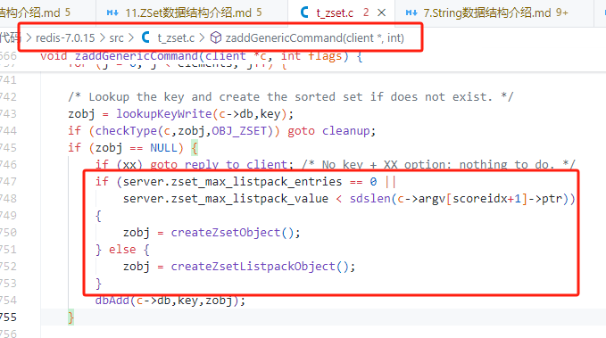

### Hash 哈希

1. **应用场景**

2. **命令**

   - hset
   - hsetnx
   - hmset
   - hget
   - hmget
   - hdel
   - hincrby
   - hkeys
   - hvals
   - hgetall
   - hincrbyfloat
   - hexists
   - hlen

   | 命令                                           | 描述                                             | 时间复杂度                  |
   | ---------------------------------------------- | ------------------------------------------------ | --------------------------- |
   | HDEL key field [field …]                       | 删除一个或多个 Hash 的 field                     | O(N) N 是被删除的字段数量。 |
   | HEXISTS key field                              | 判断 field 是否存在于 hash 中                    | O(1)                        |
   | HGET key field                                 | 获取 hash 中 field 的值                          | O(1)                        |
   | HGETALL key                                    | 从 hash 中读取全部的域和值                       | O(N) N 是 Hash 的长度       |
   | HINCRBY key field increment                    | 将 hash 中指定域的值增加给定的数字               | O(1)                        |
   | HINCRBYFLOAT key field increment               | 将 hash 中指定域的值增加给定的浮点数             | O(1)                        |
   | HKEYS key                                      | 获取 hash 的所有字段                             | O(N) N 是 Hash 的长度       |
   | HLEN key                                       | 获取 hash 里所有字段的数量                       | O(1)                        |
   | HMGET key field [field …]                      | 获取 hash 里面指定字段的值                       | O(N) N 是请求的字段数       |
   | HMSET key field value [field value …]          | 设置 hash 字段值                                 | O(N) N 是设置的字段数       |
   | HSET key field value                           | 设置 hash 里面一个字段的值                       | O(1)                        |
   | HSETNX key field value                         | 设置 hash 的一个字段，只有当这个字段不存在时有效 | O(1)                        |
   | HSTRLEN key field                              | 获取 hash 里面指定 field 的长度                  | O(1)                        |
   | HVALS key                                      | 获得 hash 的所有值                               | O(N) N 是 Hash 的长度       |
   | HSCAN key cursor [MATCH pattern] [COUNT count] | 迭代 hash 里面的元素                             |                             |

3. **存储结构**

::: details

```sh
 127.0.0.1:6379> hset user name zhangshan
 (integer) 1
 127.0.0.1:6379> hset user email hao@163.com
 (integer) 1
 127.0.0.1:6379> hgetall user
 1) "name1"
 2) "hao"
 3) "email1"
 4) "hao@163.com"
 127.0.0.1:6379> hget user user
 (nil)
 127.0.0.1:6379> hget user name1
 "hao"
 127.0.0.1:6379> hset user name2 xiaohao
 (integer) 1
 127.0.0.1:6379> hset user email2 xiaohao@163.com
 (integer) 1
 127.0.0.1:6379> hgetall user
 1) "name1"
 2) "hao"
 3) "email1"
 4) "hao@163.com"
 5) "name2"
 6) "xiaohao"
 7) "email2"
 8) "xiaohao@163.com"

127.0.0.1:6379> hset user name zhangshan
(integer) 1
127.0.0.1:6379> hset user email hao@163.com
(integer) 1
127.0.0.1:6379> object encoding user
"listpack"
127.0.0.1:6379> hset user say \xe7\xbb\x83\xe6\xb0\x94\xe5\x8a\x9f\xe4\xb8\xba\xe4\xba\x86\xe5\xba\xb7\xe5\xa4\x8d\xe4\xbd\x93\xe8\xb4\xa8\xef\xbc\x8c\xe7\x99\xbe\xe7\x97\x85\xe4\xb8\x8d\xe7\x94\x9f\xef\xbc\x8c\xe5\x8f\xaf\xe6\x98\xaf\xe5\x90\x84\xe4\xba\xba\xe7\xbb\x83\xe5\x8a\x9f\xe5\x8a\x9f\xe6\x95\x88\xe6\x9c\x89\xe5\x88\xab\xef\xbc\x8c\xe4\xbd\x93\xe8\xb4\xa8\xe5\xbc\xba\xe8\x80\x85\xe5\x8a\x9f\xe6\x95\x88\xe5\xbf\xab\xef\xbc\x8c\xe4\xbd\x93\xe8\xb4\xa8\xe5\xbc\xb1\xe8\x80\x85\xe5\x8a\x9f\xe6\x95\x88\xe6\x85\xa2\xe3\x80\x82\xe5\x9b\xa0\xe6\xad\xa4\xef\xbc\x8c\xe4\xb8\x8d\xe9\xa1\xbb\xe6\x80\xa5\xe4\xba\x8e\xe6\xb1\x82\xe6\x95\x88\xef\xbc\x8c\xe5\x8f\xaa\xe6\x9c\x89\xe6\x8a\x8a\xe7\xad\x91\xe5\x9f\xba\xe5\x8a\x9f\xe5\xa4\xab\xe7\xbb\x83\xe6\x88\x90\xef\xbc\x8c\xe6\x89\x8d\xe6\x9c\x89\xe6\x97\xa5\xe6\x96\xb0\xe6\x9c\x88\xe5\xbc\x82\xe7\x9a\x84\xe6\x95\x88\xe6\x9e\x9c\xe3\x80\x82\xef\xbc\x88\xe3\x80\x8a\xe6\x82\x9f\xe7\x9c\x9f\xe7\xaf\x87\xe3\x80\x8b\xef\xbc\x9a\xe3\x80\x8c\xe8\xa6\x81\xe5\xbe\x97\xe8\xb0\xb7\xe6\x9f\x9b\xe9\x95\xbf\xe4\xb8\x8d\xe6\xad\xbb\xef\xbc\x8c\xe9\xa1\xbb\xe5\x87\xad\xe7\x8e\x84\xe7\x89\x9d\xe7\xab\x8b\xe6\xa0\xb9\xe5\x9f\xba\xe3\x80\x82\xe3\x80\x8d\xef\xbc\x89\xe6\xaf\x8f\xe4\xba\x8e\xe9\x9d\x99\xe5\x9d\x90\xe4\xb9\x8b\xe5\x89\x8d\xef\xbc\x8c\xe5\x8a\xa1\xe8\xa6\x81\xe6\x89\xab\xe9\x99\xa4\xe4\xb8\x80\xe5\x88\x87\xe6\x9d\x82\xe5\xbf\xb5\xef\xbc\x8c\xe5\xae\xbd\xe8\xa1\xa3\xe6\x9d\xbe\xe5\xb8\xa6\xef\xbc\x8c\xe8\xba\xab\xe4\xbd\x93\xe4\xb8\x8d\xe5\x8f\x97\xe6\x9d\x9f\xe7\xbc\x9a\xef\xbc\x8c\xe7\xab\xaf\xe5\x9d\x90\xe5\x9c\xa8\xe6\xa4\x85\xe5\xad\x90\xe4\xb8\x8a\xef\xbc\x8c\xe4\xb8\xa4\xe8\x85\xbf\xe5\x9e\x82\xe5\x9c\xb0\xef\xbc\x8c\xe4\xb8\xa4\xe6\x89\x8b\xe6\x94\xbe\xe5\x9c\xa8\xe8\x86\x9d\xe7\x9b\x96\xe4\xb8\x8a\xe3\x80\x82\xe6\x8a\x8a\xe4\xb8\xa4\xe7\x9b\xae\xe5\xbc\xa0\xe5\xbc\x80\xef\xbc\x8c\xe5\x90\x91\xe5\x89\x8d\xe5\xb9\xb3\xe8\xa7\x86\xef\xbc\x8c\xe6\x8a\x8a\xe7\x9b\xae\xe5\x85\x89\xe5\x87\x9d\xe8\xa7\x86\xe4\xba\x8e\xe4\xb8\xa4\xe7\x9c\xbc\xe4\xb9\x8b\xe5\x89\x8d\xe7\x9a\x84\xe6\xad\xa3\xe4\xb8\xad\xe5\xa4\x84\xef\xbc\x8c\xe7\x9c\xbc\xe7\x8f\xa0\xe5\xb0\xbd\xe9\x87\x8f\xe4\xbf\x9d\xe6\x8c\x81\xe4\xb8\x8d\xe5\x8a\xa8\xef\xbc\x8c\xe6\x85\xa2\xe6\x85\xa2\xe5\x9c\xb0\xe6\x94\xb6\xe5\x9b\x9e\xe7\x9b\xae\xe5\x85\x89\xef\xbc\x8c\xe4\xb8\x8d\xe5\x81\x8f\xe4\xb8\x8d\xe4\xbe\x9d\xe5\x9c\xb0\xe9\x9a\x8f\xe5\xbf\x83\xe6\x84\x8f\xe6\x94\xbe\xe5\x9c\xa8\xe4\xb8\xa4\xe7\x9c\xbc\xe4\xb8\xad\xe9\x97\xb4\xe8\xa2\x93\xe7\xaa\x8d\xe7\xa9\xb4\xe9\x87\x8c\xef\xbc\x8c\xe5\x8d\x8a\xe7\x9d\x81\xe5\x8d\x8a\xe9\x97\xad\xef\xbc\x8c\xe5\xa4\x96\xe9\x97\xad\xe5\x86\x85\xe7\x9d\x81\xe8\xa7\x82\xe7\x9c\x8b\xe9\xbc\xbb\xe7\xab\xaf\xe8\xa2\x93\xe7\xaa\x8d\xe7\xa9\xb4\xe5\x86\x85\xe7\x9a\x84\xe3\x80\x8c\xe7\xa9\xba\xe8\x99\x9a\xe4\xb9\x8b\xe5\x85\x89\xe3\x80\x8d\xef\xbc\x8c\xe7\x94\xa8\xe6\x84\x8f\xe4\xb8\x8d\xe7\x94\xa8\xe5\x8a\x9b\xe3\x80\x81\xe4\xbc\xbc\xe8\xa7\x82\xe9\x9d\x9e\xe8\xa7\x82\xef\xbc\x8c\xe8\xa7\x82\xe5\x88\xb0\xe8\xa2\x93\xe7\xaa\x8d\xe5\x86\x85\xe5\x8f\x91\xe8\x83\x80\xe3\x80\x81\xe5\x8f\x91\xe7\xb4\xa7\xe3\x80\x81\xe6\x84\x9f\xe5\x88\xb0\xe6\xb8\xa9\xe6\x9a\x96\xef\xbc\x8c\xe8\xbe\xbe\xe5\x88\xb0\xe8\xbf\x99\xe4\xb8\xaa\xe7\x9a\x84\xe6\xa0\x87\xe5\x87\x86\xe6\x97\xb6\xef\xbc\x8c\xe5\x86\x8d\xe7\x94\xa8\xe6\x84\x8f\xe5\xbf\xb5\xe8\xbd\xbb\xe8\xbd\xbb\xe5\x9c\xb0\xe5\xbc\x95\xe3\x80\x8c\xe7\xa9\xba\xe8\x99\x9a\xe4\xb9\x8b\xe5\x85\x89\xe3\x80\x8d\xe5\x90\x91\xe8\x84\x90\xe4\xb8\x8b\xe4\xb8\xb9\xe7\x94\xb0\xe7\x85\xa7\xe8\xa7\x86\xef\xbc\x8c\xe5\x86\x85\xe8\xa7\x86\xe8\x85\xb9\xe4\xb8\xad\xe4\xb8\x80\xe4\xb8\xaa\xe8\x99\x9a\xe7\xa9\xba\xe5\xa2\x83\xe5\x9c\xb0\xef\xbc\x8c\xe8\xa6\x81\xe6\x9c\x97\xe5\xbd\xbb\xe5\x85\xb6\xe5\x85\x89\xef\xbc\x8c\xe5\xa6\x82\xe5\x90\x8c\xe5\xa4\xa9\xe7\xa9\xba\xe6\x97\xa0\xe4\xba\x91\xe9\x81\xae\xe8\x94\xbd\xe6\x97\xb6\xe5\xa4\xaa\xe9\x98\xb3\xe7\x85\xa7\xe5\xb0\x84\xe5\xa4\xa7\xe5\x9c\xb0\xe4\xb8\x80\xe6\xa0\xb7\xe3\x80\x82\xe9\x9d\x99\xe8\x87\xb3\xe4\xba\x8e\xe6\x9e\x81\xef\xbc\x8c\xe5\x88\xb0\xe6\x97\xa0\xe6\x88\x91\xe6\x97\xa0\xe7\x9b\xb8\xe6\x97\xb6\xef\xbc\x8c\xe5\xb0\xb1\xe4\xba\xa7\
(integer) 1
127.0.0.1:6379> object encoding user
"hashtable"

// 查看 user 的type
127.0.0.1:6379> type user
hash

> config get hash*
1) "hash-max-listpack-value"
2) "64"
3) "hash-max-ziplist-entries"
4) "512"
5) "hash-max-listpack-entries"
6) "512"
7) "hash-max-ziplist-value"
8) "64"
```

:::

- `键值对数量小于512【hash-max-ziplist-entries配置（默认512个）】` && `所有键值对的key和value的长度都小于64字节【所有值都小于hash-max-ziplist-value配置（默认64字节）】` 时使用**ziplist**；
- 否则就使用 **hashtable**【即 dict】

4. **其它**

::: tip 思考题

1. redis 中存储对象有几种方式？

- 第一种：
  - set user:1:name zhangsan
  - set user:1:age 12
- 第二种： value 为序列化后的对象信息
  - set user:1 serialize(userInfo)
- 第三种： 使用字典
  - hset user:1 name zhangsan age 12

2. 假如 hashtable 数组上的链表元素有很多，那么 rehash 过程中，这些链表元素是怎么 rehash 到 ht[1]上的？
3. hashtable 扩容时，为什么 BGSAVE 或 BGREWRITEAOF 命令执行时的负载因子要比没有执行这两个命令时的负载因子大？

:::

### Stream 流

Redis5.0 中还增加了一个数据结构 Stream，从字面上看是流类型，但其实从功能上看，应该是 Redis 对消息队列（MQ，Message Queue）的完善实现。`
`就是 Redis 实现的一种消息中间件的数据结构。先了解一下消息中间件的概念：

::: tip 消息中间件的准备知识

1. 为什么会有消息中间件？
   `解耦、削峰、异步、高性能；
2. 有哪些概念？`消息、生产者、消费者、主题、channel 等；`

:::

3. **应用场景**

4. **命令**

   - xadd
   - xread： 循环阻塞读取消息
   - xrange
   - xlen
   - xdel
   - del
   - xgroup
     - xgroup delconsumer
     - xgroup destroy
   - xreadgroup
   - xack
   - xpending
   - xinfo
     - xinfo stream
     - xinfo groups
     - xinfo consumers

   ```sh
   // 往消息队列中插入消息
   > XADD mymsgqueue * name zeanzai
   "1654254953808-0"


   ● XADD 中的 * 表示让 Redis 为插入的数据自动生成一个全局唯一的 ID
   ● XADD 中的 name 表示键， zeanzai 表示值
   ● XADD 的输出结果中，1654254953808为以毫秒为单位计算的当前服务器的时间；-0表示第1条消息信息；

   ```

   ```sh
   // 单个消费者消费
   // 消费消息队列中的消息， 消费 1654254953807-0 后续的所有消息
   > XREAD STREAMS mymsgqueue 1654254953807-0
   1) 1) "mymsgqueue"
     1) 1) 1) "1654254953808-0"
           1) 1) "name"
               1) "zeanzai"

   // 阻塞消费消息队列中的消息， $ 表示读取最新的消息
   > XREAD BLOCK 10000 STREAMS mymsgqueue $
   (nil)
   (10.00s)


   ● XREAD 中的 1654254953807-0 表示从这条信息的下条信息开始消费
   ● XREAD BLOCK 10000 中的 block 10000 表示在消费时，阻塞10s时间。


   // 多个消费者形成一个消费组进行消费
   // 为某一个消息流设置多个消费组，并标识消费消息的位置
   // 创建一个名为 group1 的消费组，0-0 表示从第一条消息开始读取。
   > XGROUP CREATE mymsgqueue group1 0-0
   OK

   // 创建一个名为 group2 的消费组，0-0 表示从第一条消息开始读取。
   > XGROUP CREATE mymsgqueue group2 0-0
   OK

   // 让消费组里面的某一个消费者消费消息
   // 注意： 一个消息只能由消费者组内的一个消费者消费；但是可以由多个消费组的多个消费者消费；
   // 消费组 group1 内的消费者 consumer1 从 mymq 消息队列中读取所有消息的命令如下：
   // 命令最后的参数“>”，表示从第一条尚未被消费的消息开始读取。
   > XREADGROUP GROUP group1 consumer1 STREAMS mymsgqueue >
   1) 1) "mymq"
     2) 1) 1) "1654254953808-0"
           2) 1) "name"
               2) "zeanzai"

   ```

   ```sh
   > XACK mymsgqueue group2 1654254953808-0
   (integer) 1

   // 查看某一个消费组已经消费，但是还没有确认的消息列表
   > XPENDING mymsgqueue group2
   1) (integer) 3
   2) "1654254953808-0"  # 表示 group2 中所有消费者读取的消息最小 ID
   3) "1654256271337-0"  # 表示 group2 中所有消费者读取的消息最大 ID
   4) 1) 1) "consumer1"
         2) "1"
     2) 1) "consumer2"
         2) "1"
     3) 1) "consumer3"
         2) "1"


   消息确认消费的原理： Redis会把每一个消费过的消息保存到PENDING list中，直到消费者使用XACK命令确认消息消费成功。

   ```

   ```c
    # *号表示服务器自动生成ID，后面顺序跟着一堆key/value
    127.0.0.1:6379> xadd codehole * name laoqian age 30  #  名字叫laoqian，年龄30岁
    1527849609889-0  # 生成的消息ID
    127.0.0.1:6379> xadd codehole * name xiaoyu age 29
    1527849629172-0
    127.0.0.1:6379> xadd codehole * name xiaoqian age 1
    1527849637634-0
    127.0.0.1:6379> xlen codehole
    (integer) 3
    127.0.0.1:6379> xrange codehole - +  # -表示最小值, +表示最大值
    127.0.0.1:6379> xrange codehole - +
    1) 1) 1527849609889-0
      1) 1) "name"
          1) "laoqian"
          2) "age"
          3) "30"
    2) 1) 1527849629172-0
      1) 1) "name"
          1) "xiaoyu"
          2) "age"
          3) "29"
    3) 1) 1527849637634-0
      1) 1) "name"
          1) "xiaoqian"
          2) "age"
          3) "1"
    127.0.0.1:6379> xrange codehole 1527849629172-0 +  # 指定最小消息ID的列表
    1) 1) 1527849629172-0
      2) 1) "name"
          2) "xiaoyu"
          3) "age"
          4) "29"
    2) 1) 1527849637634-0
      2) 1) "name"
          2) "xiaoqian"
          3) "age"
          4) "1"
    127.0.0.1:6379> xrange codehole - 1527849629172-0  # 指定最大消息ID的列表
    1) 1) 1527849609889-0
      2) 1) "name"
          2) "laoqian"
          3) "age"
          4) "30"
    2) 1) 1527849629172-0
      2) 1) "name"
          2) "xiaoyu"
          3) "age"
          4) "29"
    127.0.0.1:6379> xdel codehole 1527849609889-0
    (integer) 1
    127.0.0.1:6379> xlen codehole  # 长度不受影响
    (integer) 3
    127.0.0.1:6379> xrange codehole - +  # 被删除的消息没了
    1) 1) 1527849629172-0
      2) 1) "name"
          2) "xiaoyu"
          3) "age"
          4) "29"
    2) 1) 1527849637634-0
      2) 1) "name"
          2) "xiaoqian"
          3) "age"
          4) "1"
    127.0.0.1:6379> del codehole  # 删除整个Stream
    (integer) 1

   ```

5. **存储结构**

   ```sh
   127.0.0.1:6379> XADD mymsgqueue * name zeanzai
   "1716282237930-0"
   127.0.0.1:6379> type mymsgqueue
   stream
    > object encoding mymsgqueue
    "stream"

   ```

6. **其它**

Stream 与主流 MQ 对比

可从消息的可靠性、持久性、有序性、解决重复消费、高可用、消息积压等方面去理解。

- 有序性： 单个消费者时，消费顺序天然有序；多个消费组时，在消费组内有序，消费组间无序；
- 持久性： Redis 对 Stream 具有有序性；
- 解决重复消费问题： Stream 为每一个消息都设置了全局唯一 id，保证消息的唯一性，重复消费问题可以通过 ack 机制及消费端应用自行处理；
- 高可用问题（消息丢失问题）： 生产者由生产者端应用自行处理；消息队列则由 Redis 保证，可能会出现消息丢失问题，因为 AOF 每秒写盘、主从切换时也可能会丢失部分数据；消费者可以通过确认机制达到高可用性；
- 消息积压问题： Stream 可以设置固定长度，当消息队列超过最大长度后，redis 会删除旧消息数据，这样是有可能造成消息丢失的；

选择 Redis 作为消息中间件的应用场景：业务比较简单、对丢失数据不够敏感、且消息积压概率较小，可以使用 Redis 作为消息中间件。其他情况，还是建议使用专门的消息中间件产品。

使用 Redis 早期版本作为消息中间件

- 发布订阅机制
  - publish
    - 返回 0~n 的整数，表示有多少个消费者接收到了消息
  - subscribe
    - 可以订阅多个 channel
    - 命令会一直阻塞，等待接收消息
  - psubscribe
    - 可以订阅主题，只能订阅一个主题
    - 发布订阅模式，
  - 这种方式有两个问题
    - 无法持久化消息，Redis 重启后，消息会丢失；
    - 发后即忘的，如果消费者没有收到消息，就会再也接受不到消息了；
- List ： 就是使用 lpush+rpop 来完成
  - 比发布订阅机制的：
    - 优点
      - 可以持久化消息
      - 可以积压消息
    - 缺点
      - 不能重复消费
      - 消费时还需要遍历所有的消息列表
      - 没有主题订阅的功能
      - 不支持多播、分组消费等
- ZSet
  - 比发布订阅机制的：
    - 优点
      - 支持持久化
      - 比 list 查询更方便，可以使用 score 属性来完成遍历
    - 缺点
      - 不能存储相同消息，也就是消息不能重复
      - 不能完成消息队列的有序性
      - 没有弹出功能

[消息队列设计精要](https://tech.meituan.com/2016/07/01/mq-design.html)

### Geospatial 地理空间

1. **应用场景**

   可以 `保存地理位置信息`并 `对地理位置信息进行操作`，是**3.2 以后提供的新特性**。可以完成类似于“搜索附近”的功能，如在地图上定位到某一个景点，GEO 这种数据结构可以完成搜索附近美食的功能。

2. **命令**

   ```c
   127.0.0.1:6379> geoadd china:city 118.76 32.04 manjing 112.55 37.86 taiyuan 123.43 41.80 shenyang
   (integer) 3
   127.0.0.1:6379> geoadd china:city 144.05 22.52 shengzhen 120.16 30.24 hangzhou 108.96 34.26 xian
   (integer) 3

   两级无法直接添加，我们一般会下载城市数据(这个网址可以查询 GEO： http://www.jsons.cn/lngcode)！
     有效的经度从-180度到180度。
     有效的纬度从-85.05112878度到85.05112878度。


   # 当坐标位置超出上述指定范围时，该命令将会返回一个错误。
   127.0.0.1:6379> geoadd china:city 39.90 116.40 beijin
   (error) ERR invalid longitude,latitude pair 39.900000,116.400000


   ```

   ```c
   获取指定的成员的经度和纬度

   127.0.0.1:6379> geopos china:city taiyuan manjing
   1) 1) "112.54999905824661255"
     1) "37.86000073876942196"
   2) 1) "118.75999957323074341"
     1) "32.03999960287850968"

   ```

   ```c
   如果不存在, 返回空
   m
   km
   mi 英里
   ft 英尺

   127.0.0.1:6379> geodist china:city taiyuan shenyang m
   "1026439.1070"
   127.0.0.1:6379> geodist china:city taiyuan shenyang km
   "1026.4391"

   ```

   ```c
   以 110,30 这个坐标为中心, 寻找半径为1000km的城市
   参数 key 经度 纬度 半径 单位 [显示结果的经度和纬度] [显示结果的距离] [显示的结果的数量]

   127.0.0.1:6379> georadius china:city 110 30 1000 km
   1) "xian"
   2) "hangzhou"
   3) "manjing"
   4) "taiyuan"
   127.0.0.1:6379> georadius china:city 110 30 500 km
   1) "xian"
   127.0.0.1:6379> georadius china:city 110 30 500 km withdist
   1) 1) "xian"
     2) "483.8340"
   127.0.0.1:6379> georadius china:city 110 30 1000 km withcoord withdist count 2
   1) 1) "xian"
     2) "483.8340"
     3) 1) "108.96000176668167114"
         2) "34.25999964418929977"
   2) 1) "manjing"
     2) "864.9816"
     3) 1) "118.75999957323074341"
         2) "32.03999960287850968"


   ```

   ```c
   显示与指定成员一定半径范围内的其他成员

   127.0.0.1:6379> georadiusbymember china:city taiyuan 1000 km
   1) "manjing"
   2) "taiyuan"
   3) "xian"
   127.0.0.1:6379> georadiusbymember china:city taiyuan 1000 km withcoord withdist count 2
   1) 1) "taiyuan"
     2) "0.0000"
     3) 1) "112.54999905824661255"
         2) "37.86000073876942196"
   2) 1) "xian"
     2) "514.2264"
     3) 1) "108.96000176668167114"
         2) "34.25999964418929977"

   ```

   ```c
   127.0.0.1:6379> geohash china:city taiyuan shenyang
   1) "ww8p3hhqmp0"
   2) "wxrvb9qyxk0"

   ```

   ```c
   geo底层的实现原理实际上就是Zset, 我们可以通过Zset命令来操作geo
   127.0.0.1:6379> type china:city
   zset
   127.0.0.1:6379> zrange china:city 0 -1 withscores
   1) "xian"
   2) "4040115445396757"
   3) "hangzhou"
   4) "4054133997236782"
   5) "manjing"
   6) "4066006694128997"
   7) "taiyuan"
   8) "4068216047500484"
   9) "shenyang"
   1)  "4072519231994779"
   2)  "shengzhen"
   3)  "4154606886655324"
   127.0.0.1:6379> zrem china:city manjing
   (integer) 1
   127.0.0.1:6379> zrange china:city 0 -1
   1) "xian"
   2) "hangzhou"
   3) "taiyuan"
   4) "shenyang"
   5) "shengzhen"

   ```

   - geoadd
   - geopos： 获取指定的成员的经度和纬度
   - geodist： 如果不存在, 返回空
   - georadius： 附近的人 ==> 获得所有附近的人的地址, 定位, 通过半径来查询
   - geohash： 该命令返回 11 个字符的 hash 字符串，将二维的经纬度转换为一维的字符串, 如果两个字符串越接近, 则距离越近
   - georadisubymember： 显示与指定成员一定半径范围内的其他成员
   - zrem

3. **存储结构**

```
127.0.0.1:6379> object encoding china:city
"listpack"
127.0.0.1:6379> type china:city
zset
```

- 并没有设计新的底层数据结构，而是直接使用 SortedSet 作为底层实现；
- 具体实现：
  - 先对二维地图做区间划分，并对区间进行编码；之后判断实际的地理位置在哪一个区间上，然后使用这个区间的编码作为 SortedSet 的权重信息；
  - 举例说明： 如 某一个地理位置为（112.23E，32.89N），它在划分后的编码为 5 的区间上，那么就把 5 作为 SortedSet 的权重；

4. 其它

### hyperloglog

1. **应用场景**

   HyperLogLog 是 Redis 2.8.9 版本添加的数据结构，它用于高性能的基数（去重）统计功能，也就是说，这种数据结构**可以统计一个集合内所有不重复的元素个数**。它的缺点就是存在 0.81% 的误差。但是误差可以通过设置辅助计算因子进行降低。

   > 什么是基数？
   > 举个例子，A = {1, 2, 3, 4, 5}， B = {3, 5, 6, 7, 9}；那么基数（不重复的元素）= 1, 2, 4, 6, 7, 9； （允许容错，即可以接受一定误差）

2. **命令**

   ```
   // 添加元素
   127.0.0.1:6379> pfadd key "redis"
   (integer) 1
   127.0.0.1:6379> pfadd key "java" "sql"
   (integer) 1

   // 统计不重复的元素
   127.0.0.1:6379> pfadd key "redis"
   (integer) 1
   127.0.0.1:6379> pfadd key "sql"
   (integer) 1
   127.0.0.1:6379> pfadd key "redis"
   (integer) 0
   127.0.0.1:6379> pfcount key
   (integer) 2

   // 合并
   127.0.0.1:6379> pfadd k "java" "sql"
   (integer) 1
   127.0.0.1:6379> pfadd k2 "redis" "sql"
   (integer) 1
   127.0.0.1:6379> pfmerge k3 k k2
   OK
   127.0.0.1:6379> pfcount k3
   (integer) 3


    127.0.0.1:6379> object encoding k3
   "raw"
   127.0.0.1:6379> type k3
   string
   ```

3. **存储结构**

   HyperLogLog 存储数据时，相当于使用一个或多个 hash 算法，把计算出的 hash 值保存成类似位图的数据结构，然后在使用时，只需要利用同样的算法计算出所有的 key 即可。使用位图的方式让 Redis 使用更少的内存空间来存储大量的 key。这种方式比使用 set、list 等要非常节省空间。

4. **其它**

   可以用于统计诸如 PV、UV 的业务场景中。

   一个大型的网站，每天 IP 比如有 100 万，粗算一个 IP 消耗 15 字节，那么 100 万个 IP 就是 15M。而 HyperLogLog 在 Redis 中每个键占用的内容都是 12K，理论存储近似接近 2^64 个值，不管存储的内容是什么，它一个基于基数估算的算法，只能比较准确的估算出基数，可以使用少量固定的内存去存储并识别集合中的唯一元素。而且这个估算的基数并不一定准确，是一个带有 0.81% 标准错误的近似值（对于可以接受一定容错的业务场景，比如 IP 数统计，UV 等，是可以忽略不计的）。

> 具体详见[这里](https://antirez.com/news/75)。

### Bitmap 位图

Bitmap 即位图，是一串连续的二进制数组（只有 0 和 1），可以通过偏移量定位元素。适用于数据量大且使用二值统计的场景。是基于 String 类型实现的，只不过是 String 的值为二进制字节数组。

1. 统计考勤

   比如有这么几个业务场景：

   - 需要统计某一用户在某一月份的出勤情况；
   - 统计某一用户的全年出勤情况

   具体实现可能是这样的： 以具有月份意义的字符串作为 key，然后以这个月份具有的天数作为偏移量，出勤为 1，缺勤为 0。这样就相当于为每一个用户都创建 12 个 key，每一个 key 所使用的 Bit 位不超过 31 个（一个月份最多有 31 天），也就是说最多使用 365 个 bit 位就可以表示一个用户的全年出勤情况。如下图表示用户 id=28 的用户全年的出勤情况：

   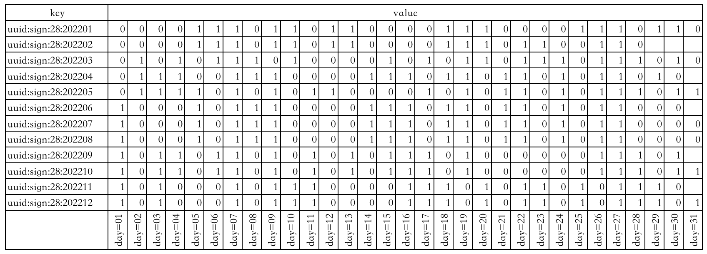

   下图表示用户 id=32 的用户的全年出勤情况：

   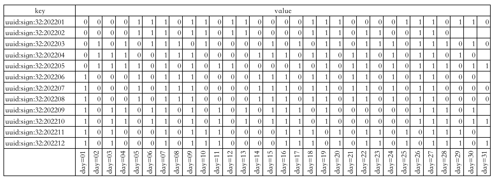

   如，id=13 的用户在 202206 月份的 25 日出勤了，那么就可以：

   ```sh
   SETBIT uuid:sign:13:202206 24 1

   ```

   同样地，id=26 的用户在 202207 月份的 18 日缺勤，则可以记录为：

   ```sh
   SETBIT uuid:sign:26:202207 17 0

   ```

   那么获取 id=20 的用户在 202209 月份 8 日的出勤情况，则可以使用命令：

   ```sh
   GETBIT uuid:sign:20:202209 7

   ```

   也可以统计 id=20 的用户在 202209 月份的出勤天数：

   ```sh
   BITCOUNT uuid:sign:20:202209

   ```

   甚至可以统计 id=100 的用户在 202206 月份的首次打卡情况【1 表示弹出第一个元素】：

   ```sh
   BITPOS uuid:sign:100:202206 1

   ```

   统计某一用户的全年出勤情况，则可以通过分别获取每一月的出勤情况，然后做一个汇总即可。

2. 统计登陆情况

   在很多 web 应用中，有时会遇到要统计用户登陆情况的业务场景，我们就可以把日期作为 key，把用户的 id 作为偏移量。

   

   例如，userid=4 的用户在 20220521 这一天登陆了，就使用下面的命令在 Redis 中记录一下：

   ```sh
   SETBIT 20220521 3 1

   ```

   说明：

   - 20220521 为 key；
   - 3 为偏移量，具有业务意义，表示 userid=4 的偏移量；
   - 1 为字节数组中的元素，表示登陆；

   同样的，可以使用下面命令获取 userid=6 的用户在 20220522 这一天的登陆情况：

   ```sh
   GETBIT 20220522 5

   ```

   比如统计 id=45 的用户，在七日内的登陆情况，就相当于统计七个 bitmap 中偏移量为 45 的位置上的值，我们只需要把这七个 bitmap 中偏移量为 45 的 bit 值统计出来，然后再创建一个 bitmap 专门存放这个结果即可实现业务需求。

### Vector set 向量集合

### Bitfield 位域

### JSON

### Probabilistic data types 概率数据类型

### Time series 时间序列

### 2.4. 总结

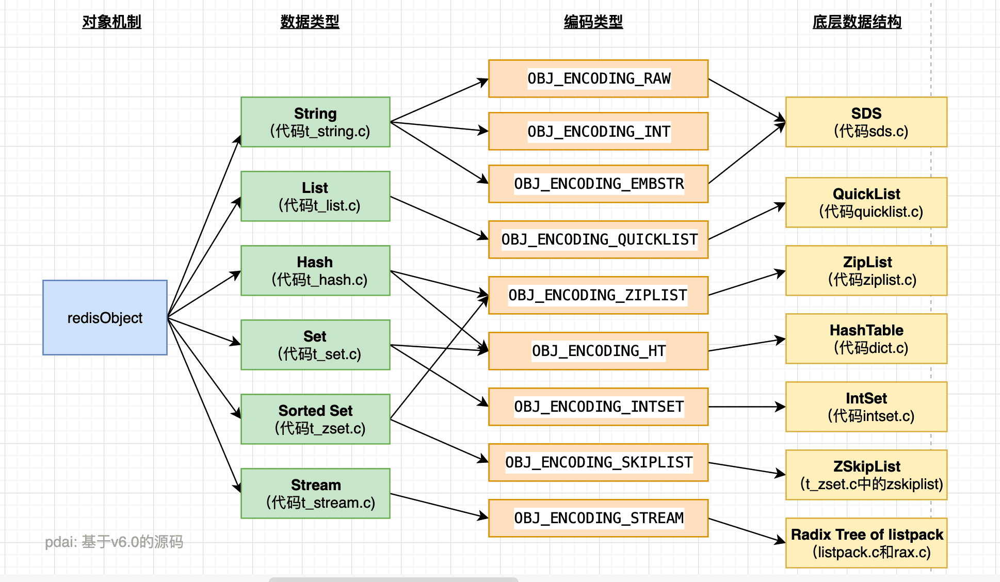

### 2.5. 命令汇总

- 针对 key 的
- 针对某一数据类型的
- 针对整个数据库
- 配置参数的查询
  - 直接查看配置文件
  - 使用 `config get #{key}` 命令查询
- 修改配置文件方式
  - 直接修改 config 文件，但是需要重启才可以生效，永远生效
  - 使用 `config set #{key}` 命令进行修改，不需要重启即可生效，但是下次启动后失效

## 了解底层数据结构的意义

:::success

1. 从事后优化内存使用的角度来讲，可以根据不同的数据结构可以针对性的进行优化，以便达到节省内存空间的目的。

   1. 比如说，有道变态的面试题说**： redis 服务器内存满了，但是公司现在没有钱添加服务器资源，请问你该怎么解决？**
   2. 回答的时候就可以从两个方面来讲：
      1. 排查业务，看是否有可以进行驱逐的业务场景——考察数据的驱逐策略。
      2. 排查业务，看是否能够针对所使用的数据类型进行优化，比如改变数据长度，redis 就会根据数据长度来重新调整值对象的内存占用，从而达到节省内存的目的——考察值对象的底层数据结构。

2. 从事前提前规划的角度来讲，也可以在选择值对象的数据结构时，选取符合业务需求并且占用内存空间更小的数据结构。
   :::
3. 双向循环链表

- 把双向链表中的尾节点的后继指针指向头节点，并把头节点的前驱指针指向尾节点；

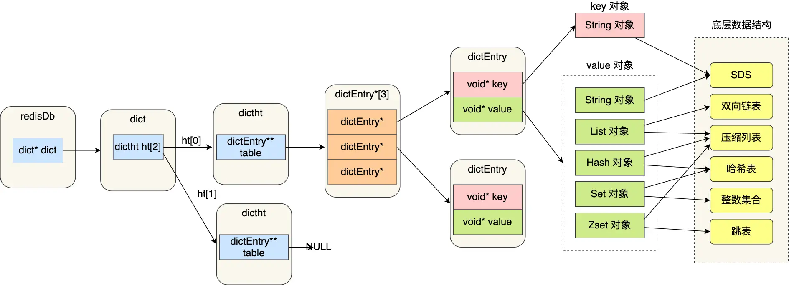

## SDS

传统 C 语言中的字符串的弊端：

- **非二进制安全**： 传统 C 语言中的字符串结束，是以“\0”作为结束标志的，也就是说 C 语言中的字符串只能保存文本，不能保存诸如图片、音频、视频等数据。如果使用 C 语言中的字符串作为 Redis 的字符串的数据结构时，Redis 在保存二进制时，就不能出现“\0”；
- **获取字符串长度的时间复杂度为 O（N）**： 传统的 C 语言字符串需要遍历完成之后才能获取字符串长度；
- **容易产生内存溢出**： 传统的 C 语言字符串的操作方法有内存溢出的风险；

针对上述 C 语言中字符串的问题，Redis 设计出了 SDS 数据结构，这种数据结构包含了：

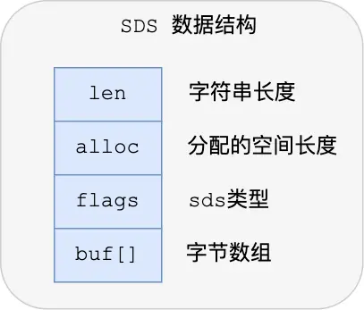

有效解决了 C 语言字符串的缺陷：

- **O（1）的时间复杂度获取字符串长度**；
- **二进制安全**，可以保存多种数据类型；
- **兼容部分 C 字符串函数**
- **杜绝缓冲区溢出**： 我们知道在 C 语言中使用 strcat 函数来进行两个字符串的拼接，一旦没有分配足够长度的内存空间，就会造成缓冲区溢出。而对于 SDS 数据类型，在进行字符修改的时候，**会首先根据记录的 len 属性检查内存空间是否满足需求**，如果不满足，会进行相应的空间扩展，然后在进行修改操作，所以不会出现缓冲区溢出。
- **减少修改字符串的内存重新分配次数**
  - C 语言由于不记录字符串的长度，所以如果要修改字符串，必须要重新分配内存（先释放再申请），因为如果没有重新分配，字符串长度增大时会造成内存缓冲区溢出，字符串长度减小时会造成内存泄露。**而对于 SDS，由于 len 属性和 alloc 属性的存在，对于修改字符串 SDS 实现了空间预分配和惰性空间释放两种策略**：
  - **1、空间预分配：对字符串进行空间扩展的时候，扩展的内存比实际需要的多，这样可以减少连续执行字符串增长操作所需的内存重分配次数。**
  - **2、惰性空间释放：对字符串进行缩短操作时，程序不立即使用内存重新分配来回收缩短后多余的字节，而是使用 alloc 属性将这些字节的数量记录下来，等待后续使用。（当然 SDS 也提供了相应的 API，当我们有需要时，也可以手动释放这些未使用的空间。）**
    - SDS 的操作方法更合理，在添加字符串时，会先判断一下可用空间，如果够用就直接添加；不够用就先扩容；
    - 扩容方法： 小于 1MB，就翻倍；大于 1MB，每次增加 1MB；在当前版本中，当新字符串的长度小于 1M 时，redis 会分配他们所需大小一倍的空间，当大于 1M 的时候，就为他们额外多分配 1M 的空间。

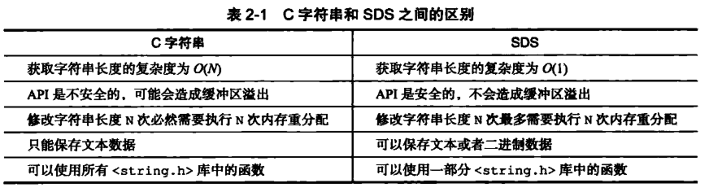

### SDS 源码的迭代

- 3.2 之前

```c
struct sdshdr{
    //int 记录buf数组中未使用字节的数量
    int free;

    //int 记录buf数组中已使用字节的数量，即sds的长度
    int len;

    //字节数组用于保存字符串
    char buf[];
}

```

看出 Redis 3.2 之前 SDS 内部是一个带有长度信息的字节数组。

- 3.2 及之后

::: details

```c
// sds.h
typedef char *sds;

/* Note: sdshdr5 is never used, we just access the flags byte directly.
 * However is here to document the layout of type 5 SDS strings. */
struct __attribute__ ((__packed__)) sdshdr5 {
    unsigned char flags; /* 3 lsb of type, and 5 msb of string length */
    char buf[];
};
struct __attribute__ ((__packed__)) sdshdr8 {
    uint8_t len; /* used */
    uint8_t alloc; /* excluding the header and null terminator */
    unsigned char flags; /* 3 lsb of type, 5 unused bits */
    char buf[];
};
struct __attribute__ ((__packed__)) sdshdr16 {
    uint16_t len; /* used */
    uint16_t alloc; /* excluding the header and null terminator */
    unsigned char flags; /* 3 lsb of type, 5 unused bits */
    char buf[];
};
struct __attribute__ ((__packed__)) sdshdr32 {
    uint32_t len; /* used */
    uint32_t alloc; /* excluding the header and null terminator */
    unsigned char flags; /* 3 lsb of type, 5 unused bits */
    char buf[];
};
struct __attribute__ ((__packed__)) sdshdr64 {
    uint64_t len; /* used */
    uint64_t alloc; /* excluding the header and null terminator */
    unsigned char flags; /* 3 lsb of type, 5 unused bits */
    char buf[];
};

```

:::

这样就可以针对不同长度的字符串申请相应的存储类型，从而有效的节约了内存使用。

### 数据类型

Redis 根据为了更好的利用内存，就根据保存的数据的不同，然后使用不同的数据类型保存。

- int ： 存储的是整数且长度小于 20 字节
- embstr ： 存储的是字符串且长度小于等于 44 字节
- raw ： 存储的是动态字符串，且长度大于 44 字节且小于 512Mb
  - redis 2.+ 是 32 字节
  - redis 3.0-4.0 是 39 字节
  - redis 5.0 是 44 字节

为什么是 44 字节？

1. 64 字节 = redisObject + SDS （内存分配器管理的大小就是 64 字节）
2. redisObject = 16 字节
3. SDS = 4 字节（包括一个字节的结束符 \0 ） + 44 字节的 buf[]

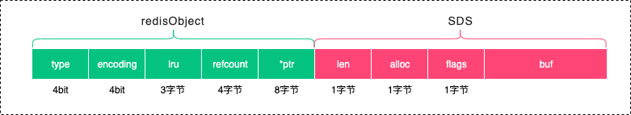

如： `set str1 abcdefghijklmnopqrstuvwxyz1234`的存储空间就是下面这样子的。【redis5.0.7】`
`
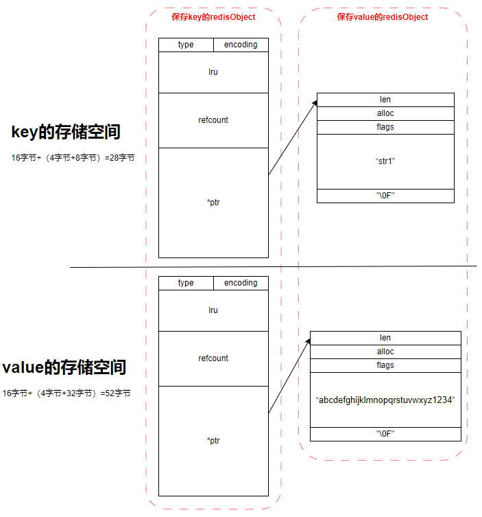

### 使用了 SDS 之后

- `空间预分配`减少了内存频繁分配次数
  - 如果修改后 len 长度将小于 1M，这时分配给 free 的大小和 len 一样,例如修改过后为 10 字节, 那么给 free 也是 10 字节，buf 实际长度变成了 10+10+1 = 21byte；
  - 如果修改后 len 长度将大于等于 1M,这时分配给 free 的长度为 1M,例如修改过后为 30M,那么给 free 是 1M.buf 实际长度变成了 30M+1M+1byte；
- `惰性空间释放`
  - 并不会立即回收空闲空间，而是使用 free 指针来记录空闲空间，以备后续使用；
- `二进制安全`，保存的数据的类型更为丰富；
- 操作方法 `不会产生内存溢出`；
- 依然使用“\0”的方式结尾，目的是为了复用 C 的一些方法，此外，`操作方法的时间复杂度更低`

### 其他应用场景

SDS 除了保存数据库中的字符串值以外，SDS 还可以作为缓冲区（buffer）：包括 AOF 模块中的 AOF 缓冲区以及客户端状态中的输入缓冲区

---

## intset

Redis 作为一个内存数据库，首先要能够保存整数吧，又为了达到一种不浪费内存的目的，设计出一种整数集合的数据结构。

::: details

```c
// intset.h
//每个intset结构表示一个整数集合
typedef struct intset {
    uint32_t encoding;	//编码方式
    uint32_t length;		//集合中包含的元素数量，即数组长度
    int8_t contents[];	//保存元素的数组
} intset;

```

:::

注意：

- `contents[]` 数组中保存了整数集合中实际的数据元素，整数集合的每个元素都是 contents 数组的一个数组项（item），各个项在数组中按值得大小**从小到大有序排序**，且数组中不包含任何重复项。虽然 intset 结构将 contents 属性声明为 int8_t 类型的数组，但实际上 contents 数组并不保存任何 int8_t 类型的，但实际上数据元素的编码方式是由 encoding 变量决定；也就是说，
  - 如果 encoding 属性值为 INTSET_ENC_INT16，那么 contents 就是一个 int16_t 类型的数组，数组中每一个元素的类型都是 int16_t，保存的数据范围是(-32768——32767)；
  - 如果 encoding 属性值为 INTSET_ENC_INT32，那么 contents 就是一个 int32_t 类型的数组，数组中每一个元素的类型都是 int32_t；
  - 如果 encoding 属性值为 INTSET_ENC_INT64，那么 contents 就是一个 int64_t 类型的数组，数组中每一个元素的类型都是 int64_t；

### 升级过程

当在一个 int16 类型的整数集合中插入一个 int32 类型的值，整个集合的所有元素都会转换成 32 类型。这就需要升级。

例如，一个保存了三个元素（1， 2， 3）的 int16_t 类型的数组集合中保存了一个 65535 ，则在保存 65535 需要进行升级，升级过程如下：

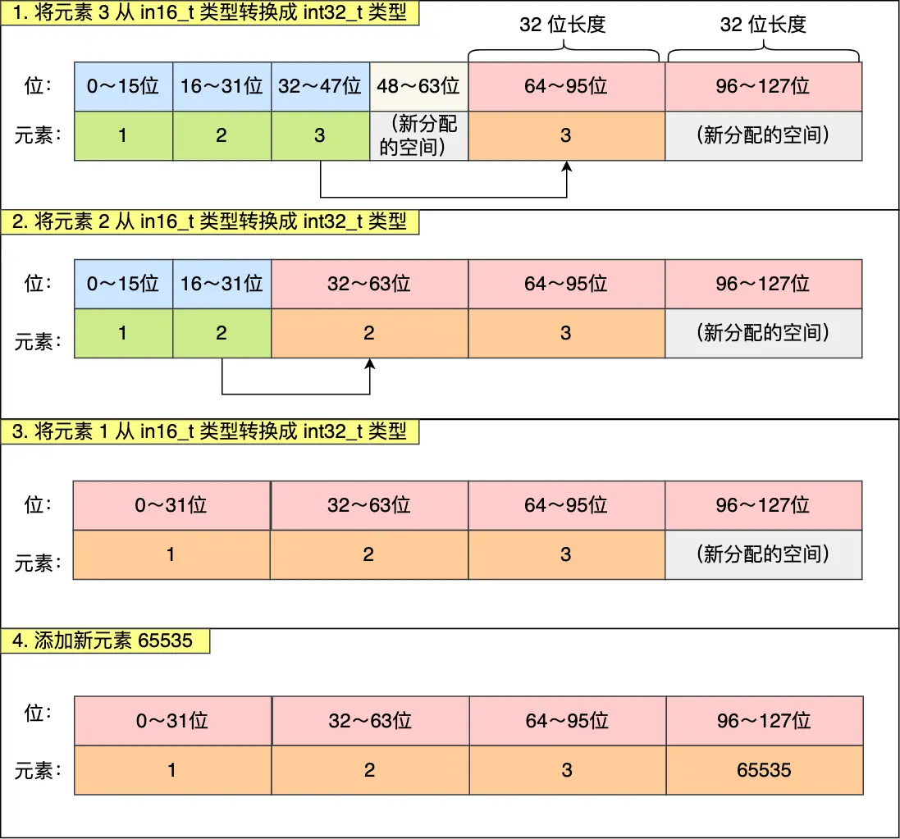

可大概分成三个步骤：

1. 扩容，原本空间的大小之上再扩容多 4x32-3x16=80 位，这样就能保存下 4 个类型为 int32_t 的元素。
2. 移动已有的元素，从后往前移动；
3. 在最后添加新元素；
4. 最后改变 encoding 的值，length+1

**那么如果我们删除掉刚加入的 int32 类型时，会不会做一个降级操作呢**？`
`**不会**。主要还是减少开销的权衡。

### 总结

- 整数集合是 Set 数据类型的值对象的数据结构
- 支持升级操作，不直接使用 int64_t 的数据结构保存元素的原因是为了**节省内存**使用；
- 不支持降级操作；

---

## linkedlist

> 发展过程
>
> 1. 数组
>
> - 使用连续内存以达到随机访问的目的，
> - 其插入和删除操作就非常低效，因为需要移动元素；
> - 连续内存的条件过于苛刻，在空闲区域中不一定会有满足要求的连续区域；
> - 多为事先声明的方式进行分配大小，有内存溢出的风险；如果元素个数较少，还会产生内存浪费的问题；
>
> 2. 单向链表
>
> - 使用指针的方式把链表元素连接成串；
> - 解决了数据的插入和删除操作低效的问题，插入和删除元素不需要移动元素；
> - 查询元素时间复杂度变成 O（n）【最坏情况】

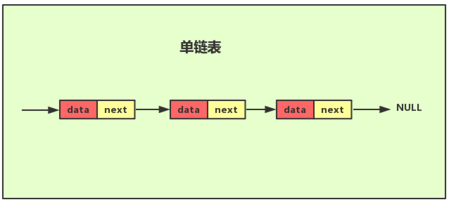

> 3. 单向循环链表
>
> - 把单向链表中的尾节点的 next 指针指向头节点

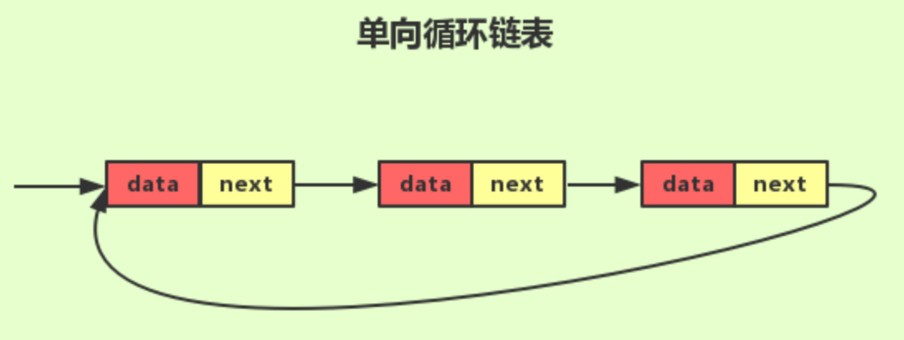

> 4. 双向链表
>
> - 使用前驱指针和后继指针把前面元素和后续元素连接成串；
> - 解决了数据的插入和删除操作低效的问题，插入和删除元素不需要移动元素；
> - 查找元素时间复杂度变成 O（1）

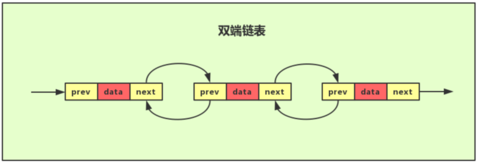

> 5. 双向循环链表
>
> - 把双向链表中的尾节点的后继指针指向头节点，并把头节点的前驱指针指向尾节点；

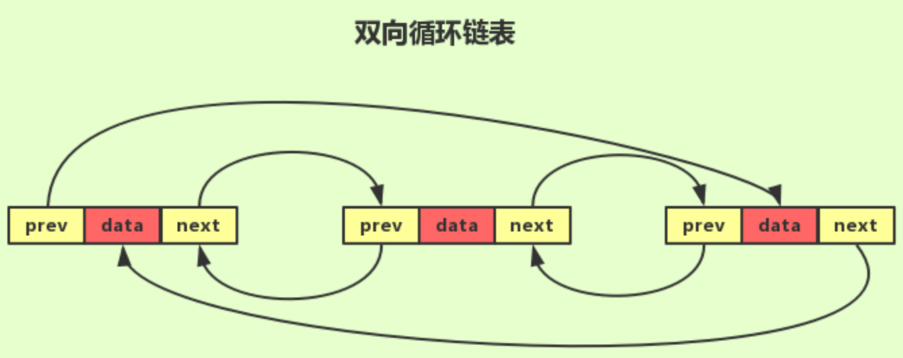

### Redis 的实现 - 双向无环链表

- 双向
- 无环

```
typedef struct listNode{
  // 前置节点
  struct listNode *prev;

  // 后置节点
  struct listNode *next;

  // 节点的值
  void *value;
} listNode;

```

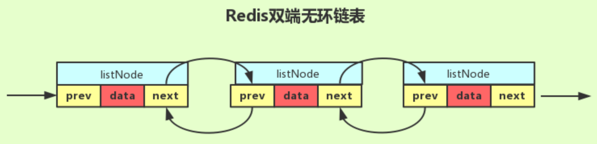

为了更好的管理节点，Redis 又设计出 list 数据结构，用来管理双向无环链表。

```c
typedef struct list{
  //表头节点
  listNode *head;

  //表尾节点
  listNode *tail;

  //链表所包含的节点数量
  unsigned long len;

  //节点值复制函数
  void *(*dup)(void *ptr);

  //节点值释放函数
  void *(*free)(void *ptr);

  //节点值对比函数
  int (*match)(void *ptr,void *key);
}list;

```

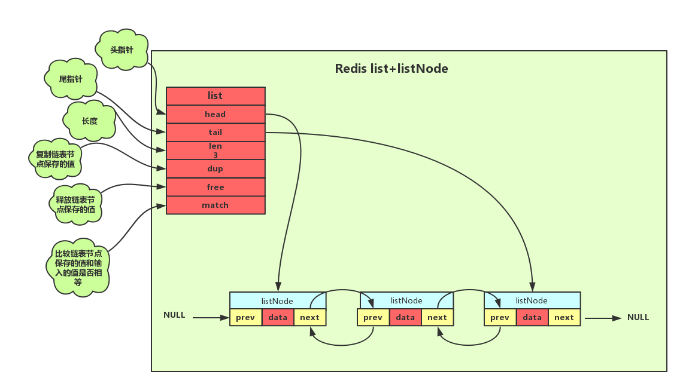

::: details

```c
// adlist.h
/* Node, List, and Iterator are the only data structures used currently. */

typedef struct listNode {
    struct listNode *prev;
    struct listNode *next;
    void *value;
} listNode;

typedef struct listIter {
    listNode *next;
    int direction;
} listIter;

typedef struct list {
    listNode *head;
    listNode *tail;
    void *(*dup)(void *ptr);
    void (*free)(void *ptr);
    int (*match)(void *ptr, void *key);
    unsigned long len;
} list;
```

:::

---

## ziplist

> 压缩列表 VS 数组
> 数组中要求保存的元素长度要一样，属于 `**内存紧凑型**`的数据结构。但是这种数据结构还有一个特点，就是如果要保存的元素的长度不一样，那么就会使用一些补齐的措施来“人为地”保证元素长度一致，这无形中 `**造成了内存浪费**`的问题。但是内存紧凑的特性又非常吸引人，于是人们设计出压缩列表的数据结构，为每一个元素增加描述字段来表示后续保存的数据的长度及类型等信息，然后把这样具有描述信息+实际数据内容的元素紧凑的保存在一起，就形成了压缩列表。
>
> 压缩列表的出现，有效的解决了**数据元素等长特性**带来的空间浪费问题，又发挥了数组结构的内存紧凑性的优势。

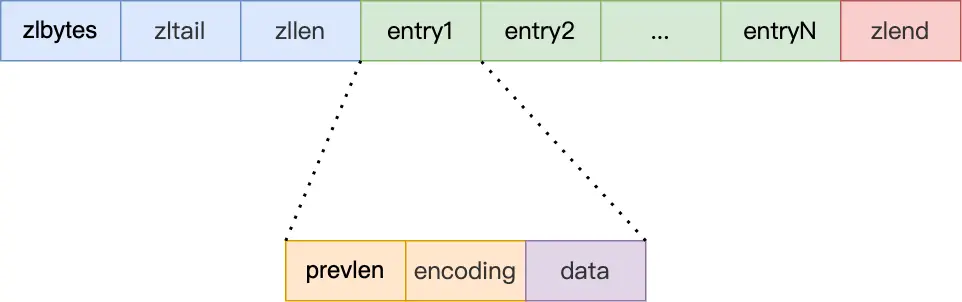

压缩列表的描述信息部分：

- zlbytes，记录整个压缩列表占用的内存字节数；
- zltail，记录压缩列表「尾部」节点距离起始地址有多少字节，也就是列表尾的偏移量；
- zllen，记录压缩列表包含的节点数量；
- zlend，标记压缩列表的结束点，固定值 0xFF（十进制 255）；

压缩列表的数据部分——entry，每一个元素都包含：

- prevlen，记录了「前一个节点」的长度，目的是为了实现从后向前遍历；如果前一个节点的长度小于 254 字节，那么 prevlen 属性需要用 1 字节的空间来保存这个长度值；如果前一个节点的长度大于等于 254 字节，那么 prevlen 属性需要用 5 字节的空间来保存这个长度值；
- encoding，记录了当前节点实际数据的「类型和长度」，类型主要有两种：字符串和整数。
- data，记录了当前节点的实际数据，类型和长度都由 encoding 决定；

### 连锁更新

压缩列表除了查找一个元素的过程时间复杂度较高外，还有一个问题就是连锁更新问题。

在修改压缩列表中的某一个元素时，由于元素长度的变化，会导致这个元素后续的所有元素的存储位置都发生变化。这就是连锁更新。这就造成了内存空间的多次分配过程，从而造成压缩列表的性能下降。

### 总结

1. 压缩列表吸收了数组的 `内存紧凑`的特性，提高了内存访问效率；但由于每一个元素都需要额外的描述信息以及对整个压缩列表的描述信息，因此也 `会产生额外的空间浪费`；
2. 此外 `压缩列表的查找操作的效率也略逊于数组的查找效率`；
3. 压缩列表的更新操作，`可能会产生连锁更新`的问题；

因此，也正是因为上述的压缩列表的特性，也使得 `压缩列表多适用于数据元素较少的业务场景`。

---

## quicklist

quicklist （ Redis 3.2 引入的数据类型 ，而 quicklist 底层使用压缩列表和双向无环列表组成，具体见《Redis 设计与实现》第 8.3 章。）本质上，quicklist 是由双向无环列表和 ziplist 构成的复合数据结构。

```
typedef struct quicklist { // src/quicklist.h
    quicklistNode *head;
    quicklistNode *tail;
    unsigned long count;        /* ziplist 的个数 */
    unsigned long len;          /* quicklist 的节点数 */
    unsigned int compress : 16; /* LZF 压缩算法深度 */
    //...
} quicklist;
typedef struct quicklistNode {
    struct quicklistNode *prev;
    struct quicklistNode *next;
    unsigned char *zl;           /* 对应的 ziplist */
    unsigned int sz;             /* ziplist 字节数 */
    unsigned int count : 16;     /* ziplist 个数 */
    unsigned int encoding : 2;   /* RAW==1 or LZF==2 */
    unsigned int container : 2;  /* NONE==1 or ZIPLIST==2 */
    unsigned int recompress : 1; /* 该节点先前是否被压缩 */
    unsigned int attempted_compress : 1; /* 节点太小无法压缩 */
    //...
} quicklistNode;
typedef struct quicklistLZF {
    unsigned int sz;
    char compressed[];
} quicklistLZF;

```

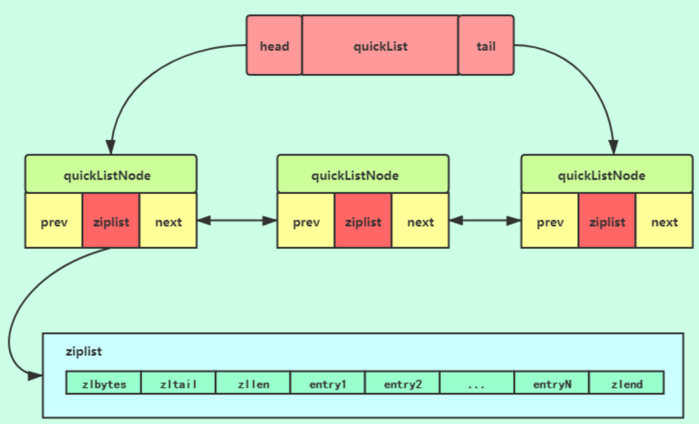

- 新增
  - 判断 head 节点是否可以插入，可以插入，就在 ziplist 上插入，否则，就新建一个 quickListnode 节点进行插入
- 删除
  - 单个元素： 遍历索引
  - 区间元素： 先找到 start 下标的元素所在的 quicklistnode，然后删除 ziplist 上的数据，如果 ziplist 上能删除的元素个数小于要删除的元素个数，就会移动到下一个 quicklistnode，然后进行删除

### 迭代

::: details

```c
// quicklist.h
/* Node, quicklist, and Iterator are the only data structures used currently. */

/* quicklistNode is a 32 byte struct describing a listpack for a quicklist.
 * We use bit fields keep the quicklistNode at 32 bytes.
 * count: 16 bits, max 65536 (max lp bytes is 65k, so max count actually < 32k).
 * encoding: 2 bits, RAW=1, LZF=2.
 * container: 2 bits, PLAIN=1 (a single item as char array), PACKED=2 (listpack with multiple items).
 * recompress: 1 bit, bool, true if node is temporary decompressed for usage.
 * attempted_compress: 1 bit, boolean, used for verifying during testing.
 * extra: 10 bits, free for future use; pads out the remainder of 32 bits */
typedef struct quicklistNode {
    struct quicklistNode *prev;
    struct quicklistNode *next;
    unsigned char *entry;
    size_t sz;             /* entry size in bytes */
    unsigned int count : 16;     /* count of items in listpack */
    unsigned int encoding : 2;   /* RAW==1 or LZF==2 */
    unsigned int container : 2;  /* PLAIN==1 or PACKED==2 */
    unsigned int recompress : 1; /* was this node previous compressed? */
    unsigned int attempted_compress : 1; /* node can't compress; too small */
    unsigned int dont_compress : 1; /* prevent compression of entry that will be used later */
    unsigned int extra : 9; /* more bits to steal for future usage */
} quicklistNode;
/* quicklistLZF is a 8+N byte struct holding 'sz' followed by 'compressed'.
 * 'sz' is byte length of 'compressed' field.
 * 'compressed' is LZF data with total (compressed) length 'sz'
 * NOTE: uncompressed length is stored in quicklistNode->sz.
 * When quicklistNode->entry is compressed, node->entry points to a quicklistLZF */
typedef struct quicklistLZF {
    size_t sz; /* LZF size in bytes*/
    char compressed[];
} quicklistLZF;

/* Bookmarks are padded with realloc at the end of of the quicklist struct.
 * They should only be used for very big lists if thousands of nodes were the
 * excess memory usage is negligible, and there's a real need to iterate on them
 * in portions.
 * When not used, they don't add any memory overhead, but when used and then
 * deleted, some overhead remains (to avoid resonance).
 * The number of bookmarks used should be kept to minimum since it also adds
 * overhead on node deletion (searching for a bookmark to update). */
typedef struct quicklistBookmark {
    quicklistNode *node;
    char *name;
} quicklistBookmark;

#if UINTPTR_MAX == 0xffffffff
/* 32-bit */
#   define QL_FILL_BITS 14
#   define QL_COMP_BITS 14
#   define QL_BM_BITS 4
#elif UINTPTR_MAX == 0xffffffffffffffff
/* 64-bit */
#   define QL_FILL_BITS 16
#   define QL_COMP_BITS 16
#   define QL_BM_BITS 4 /* we can encode more, but we rather limit the user
                           since they cause performance degradation. */
#else
#   error unknown arch bits count
#endif

/* quicklist is a 40 byte struct (on 64-bit systems) describing a quicklist.
 * 'count' is the number of total entries.
 * 'len' is the number of quicklist nodes.
 * 'compress' is: 0 if compression disabled, otherwise it's the number
 *                of quicklistNodes to leave uncompressed at ends of quicklist.
 * 'fill' is the user-requested (or default) fill factor.
 * 'bookmarks are an optional feature that is used by realloc this struct,
 *      so that they don't consume memory when not used. */
typedef struct quicklist {
    quicklistNode *head;
    quicklistNode *tail;
    unsigned long count;        /* total count of all entries in all listpacks */
    unsigned long len;          /* number of quicklistNodes */
    signed int fill : QL_FILL_BITS;       /* fill factor for individual nodes */
    unsigned int compress : QL_COMP_BITS; /* depth of end nodes not to compress;0=off */
    unsigned int bookmark_count: QL_BM_BITS;
    quicklistBookmark bookmarks[];
} quicklist;

typedef struct quicklistIter {
    quicklist *quicklist;
    quicklistNode *current;
    unsigned char *zi; /* points to the current element */
    long offset; /* offset in current listpack */
    int direction;
} quicklistIter;

typedef struct quicklistEntry {
    const quicklist *quicklist;
    quicklistNode *node;
    unsigned char *zi;
    unsigned char *value;
    long long longval;
    size_t sz;
    int offset;
} quicklistEntry;

```

:::

这里定义了 6 个结构体:

- quicklistNode, 宏观上, quicklist 是一个链表, 这个结构描述的就是链表中的结点. 它通过 zl 字段持有底层的 ziplist. 简单来讲, 它描述了一个 ziplist 实例
- quicklistLZF, ziplist 是一段连续的内存, 用 LZ4 算法压缩后, 就可以包装成一个 quicklistLZF 结构. 是否压缩 quicklist 中的每个 ziplist 实例是一个可配置项. 若这个配置项是开启的, 那么 quicklistNode.zl 字段指向的就不是一个 ziplist 实例, 而是一个压缩后的 quicklistLZF 实例
- quicklistBookmark, 在 quicklist 尾部增加的一个书签，它只有在大量节点的多余内存使用量可以忽略不计的情况且确实需要分批迭代它们，才会被使用。当不使用它们时，它们不会增加任何内存开销。
- quicklist. 这就是一个双链表的定义. head, tail 分别指向头尾指针. len 代表链表中的结点. count 指的是整个 quicklist 中的所有 ziplist 中的 entry 的数目. fill 字段影响着每个链表结点中 ziplist 的最大占用空间, compress 影响着是否要对每个 ziplist 以 LZ4 算法进行进一步压缩以更节省内存空间.
- quicklistIter 是一个迭代器
- quicklistEntry 是对 ziplist 中的 entry 概念的封装. quicklist 作为一个封装良好的数据结构, 不希望使用者感知到其内部的实现, 所以需要把 ziplist.entry 的概念重新包装一下.

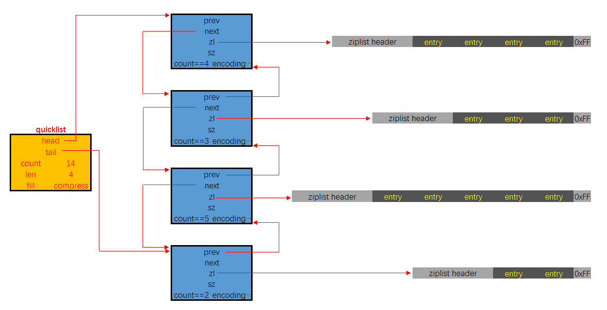`
`下面是有关 quicklist 的更多额外信息:

- quicklist.fill 的值影响着每个链表结点中, ziplist 的长度.
  1. 当数值为负数时, 代表以字节数限制单个 ziplist 的最大长度. 具体为:
  2. -1 不超过 4kb
  3. -2 不超过 8kb
  4. -3 不超过 16kb
  5. -4 不超过 32kb
  6. -5 不超过 64kb
  7. 当数值为正数时, 代表以 entry 数目限制单个 ziplist 的长度. 值即为数目. 由于该字段仅占 16 位, 所以以 entry 数目限制 ziplist 的容量时, 最大值为 2^15 个
- quicklist.compress 的值影响着 quicklistNode.zl 字段指向的是原生的 ziplist, 还是经过压缩包装后的 quicklistLZF
  1. 0 表示不压缩, zl 字段直接指向 ziplist
  2. 1 表示 quicklist 的链表头尾结点不压缩, 其余结点的 zl 字段指向的是经过压缩后的 quicklistLZF
  3. 2 表示 quicklist 的链表头两个, 与末两个结点不压缩, 其余结点的 zl 字段指向的是经过压缩后的 quicklistLZF
  4. 以此类推, 最大值为 2^16
- quicklistNode.encoding 字段, 以指示本链表结点所持有的 ziplist 是否经过了压缩. 1 代表未压缩, 持有的是原生的 ziplist, 2 代表压缩过
- quicklistNode.container 字段指示的是每个链表结点所持有的数据类型是什么. 默认的实现是 ziplist, 对应的该字段的值是 2, 目前 Redis 没有提供其它实现. 所以实际上, 该字段的值恒为 2
- quicklistNode.recompress 字段指示的是当前结点所持有的 ziplist 是否经过了解压. 如果该字段为 1 即代表之前被解压过, 且需要在下一次操作时重新压缩.

quicklist 的具体实现代码篇幅很长, 这里就不贴代码片断了, 从内存布局上也能看出来, 由于每个结点持有的 ziplist 是有上限长度的, 所以在与操作时要考虑的分支情况比较多。`
`quicklist 有自己的优点, 也有缺点, 对于使用者来说, 其使用体验类似于线性数据结构, list 作为最传统的双链表, 结点通过指针持有数据, 指针字段会耗费大量内存. ziplist 解决了耗费内存这个问题. 但引入了新的问题: 每次写操作整个 ziplist 的内存都需要重分配. quicklist 在两者之间做了一个平衡. 并且使用者可以通过自定义 quicklist.fill, 根据实际业务情况, 经验主义调参

## hashtable

> 哈希及哈希表
>
> 1. 什么是哈希？
>
> 数组这种数据结构中数据元素的内容和在数组中的位置并没有逻辑关系，因为它是通过移动指针来获取数据元素的（是操作系统提供的访问数据的一种机制）。但是哈希**提供了一种数据内容与数据存放位置的逻辑关系**，也就是说**哈希可以通过数据的内容来确定数据存放位置**。主要思想是提供一种算法，使数据元素内容与数据存放的位置关联起来。存储的数据结构叫做哈希表，所使用的算法就是哈希。也叫做散列表和散列算法。
>
> 2. 哈希具有的特性？
>
> 同时具有确定性和不确定性。确定性：key1=key2，那么 hash(key1)=hash(key2)；不确定性： key1≠key2，有可能会存在 hash(key1)=hash(key2)。确定性，使得根据数据元素的内容获取这个数据元素存放的位置变为可能。不确定性，又使得哈希表在存储数据时，必须要考虑哈希冲突的问题。
>
> 3. 哈希表的实现方式？
>
> 有两种常见的方式，一种是开放寻址方式，一种是拉链法。开放寻址方式，就是把数据元素放到一个数组中。如果遇到 hash（key1） 之后发现这个位置上已经存放有元素时，就直接往下判断，直到找到一个空闲的位置：
>
> 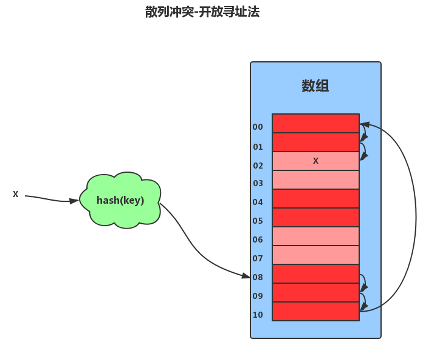
> 拉链法，就是利用一个数组和多个链表的方式存储数据。数组中保存 hash（key）的结果，实际的数据内容保存在与数组相关联的链表上，也就是同一个链表上的保存的所有数据都是 hash 冲突的数据元素。
>
> 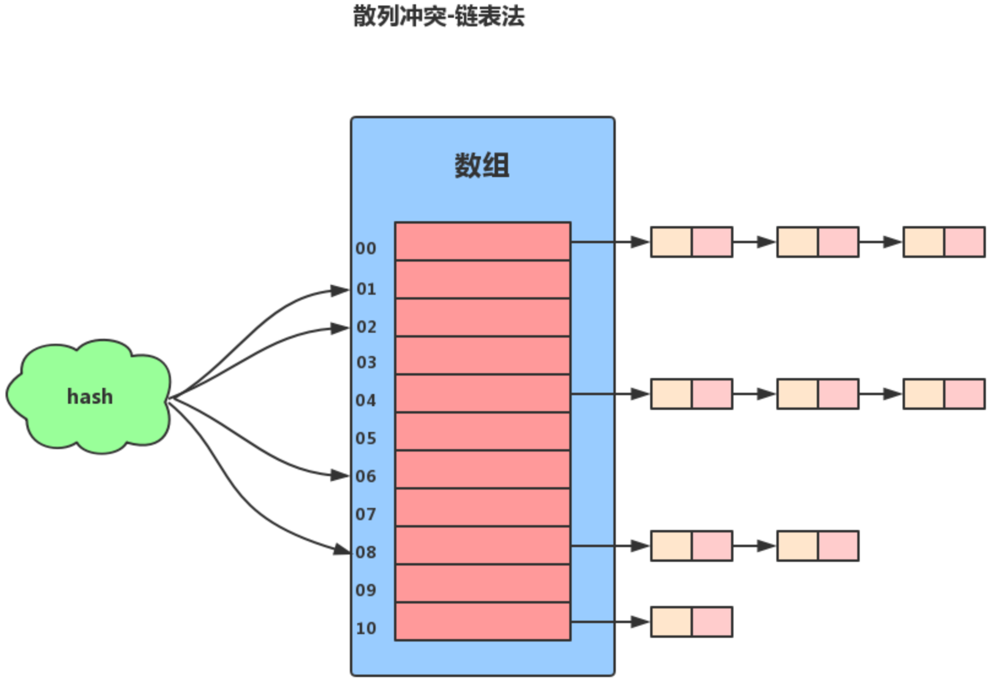 4. 装载因子
>
> 在哈希表的实现中，以拉链法为例，链表上的数据过多，就代表着哈希冲突比较严重，此时数据元素的查找效率必定会降低；扩大数组的长度，同样多的数据就可以减少哈希冲突，但是这会造成空间的浪费。因此哈希冲突和空间浪费要有一个平衡。**装载因子=已有元素个数 / 哈希表能保存的元素总数**，装载因子过高容易引起哈希冲突，过低造成存储空间浪费。为了让装载因子处于一个合适的范围，需要对 hashtable 进行扩容和缩容。

Redis 中的 Hash 数据结构如下：

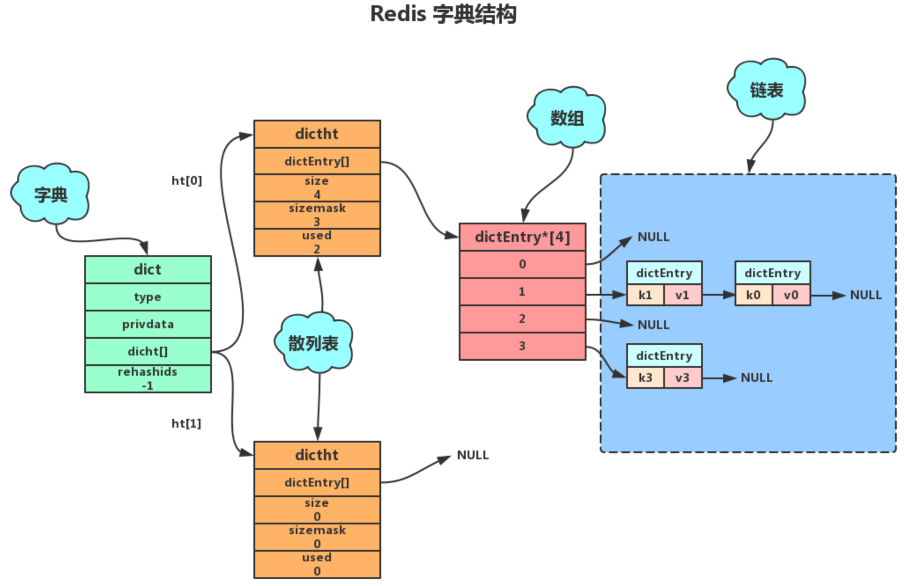

::: details

```c
// dict.h
typedef struct dictEntry {
    void *key;
    void *val;
    struct dictEntry *next;
} dictEntry;

typedef struct dictType {
    unsigned int (*hashFunction)(const void *key);
    void *(*keyDup)(void *privdata, const void *key);
    void *(*valDup)(void *privdata, const void *obj);
    int (*keyCompare)(void *privdata, const void *key1, const void *key2);
    void (*keyDestructor)(void *privdata, void *key);
    void (*valDestructor)(void *privdata, void *obj);
} dictType;

typedef struct dict {
    dictEntry **table;
    dictType *type;
    unsigned long size;
    unsigned long sizemask;
    unsigned long used;
    void *privdata;
} dict;

typedef struct dictIterator {
    dict *ht;
    int index;
    dictEntry *entry, *nextEntry;
} dictIterator;

```

:::

### 解决哈希冲突

解决哈希冲突的方式与 Java 中 HashMap 的解决哈希冲突的方式类似，都是在冲突时，把数据存放到链表中。

### Rehash

Redis 为了保证哈希表具有一个稳定的负载，所以随着数据元素的插入，要不断的调整数组和链表的大小。因此会出现 rehash 的过程。Rehash 有两种方式，一种是**集中式 Rehash**，一种是**渐进式 Rehash 方式**。Redis 采用渐进式 Rehash 方式。

- 集中式 rehash： 一次性的 hash，中间不会停止，会影响 redis 的读写性能，因为要花费资源去进行 hash，性能差。例如，要把 1GB 的数据进行扩容，如果一次性把 1GB 的数据全部 hash 完，那么会影响 Redis 的读写性能；
- 渐进式 rehash 过程：每一次对数据元素的操作，都顺带 rehash 一个 index，直到 rehash 完成，最后把 ht[1]变成 ht[0]，最后再申请一个 ht[1]，并把 rehashidx 置为-1，为下次 rehash 做准备；
  - 为 ht[1]分配空间，让字典同时拥有 ht[0]和 ht[1]；
  - 让 rehashidx=0，表示 rehash 过程开始
  - 在 rehash 期间，redis 除了对外提供字典的增删改查的数据操作外，还会顺带把 ht[0]在 rehashidx 索引上的所有键值对【即链表上的所有键值对】rehash 到 ht[1]上，然后再把 rehashidx+1；
    - 新增操作：直接将键值对插入到 ht[1]上，保证 ht[0]的结点不会增加；
    - 删除操作：同时在 ht[0]和 ht[1]两个哈希表上执行，避免漏删；
    - 修改操作：同时在 ht[0]和 ht[1]两个哈希表上执行，避免漏改；
    - 查找操作：先从 ht[0]查，查不到的话再去 ht[1]查；
  - 直到 rehash 完成后，最后把 ht[1]变成 ht[0]，最后再申请一个 ht[1]，并把 rehashidx 置为-1，为下次 rehash 做准备；

缩容扩容的条件及缩扩容后的大小：

- 扩容
  - 条件： `没有执行BGSAVE或没有执行BGREWRITEAOF命令时，负载因子大于等于1` || `执行BGSAVE或执行BGREWRITEAOF命令时，负载因子大于等于5`
  - 大小： 不小于 dict[0].used\*2 的第一个 2 的 n 次幂，如 dict[0].used = 3，则扩容大小为不小于 6 的第一个 2 的 n 次幂，不小于 6 的第一个 2 的 n 次幂是 8，因此扩容大小为 8；如 dict[0].used = 4，则扩容大小为不小于 8 的第一个 2 的 n 次幂，不小于 8 的第一个 2 的 n 次幂是 8，因此扩容大小依然是 8；
- 缩容
  - 条件：负载因子小于 0.1
  - 大小：不小于 dict[0].used 的第一个 2 的 n 次幂，如 dict[0].used = 3，则缩容大小为不小于 3 的第一个 2 的 n 次幂，即 4；如 dict[0].used = 4，则缩容大小为不小于 4 的第一个 2 的 n 次幂，即 4；

## skiplist

> 跳跃表的发展过程
>
> 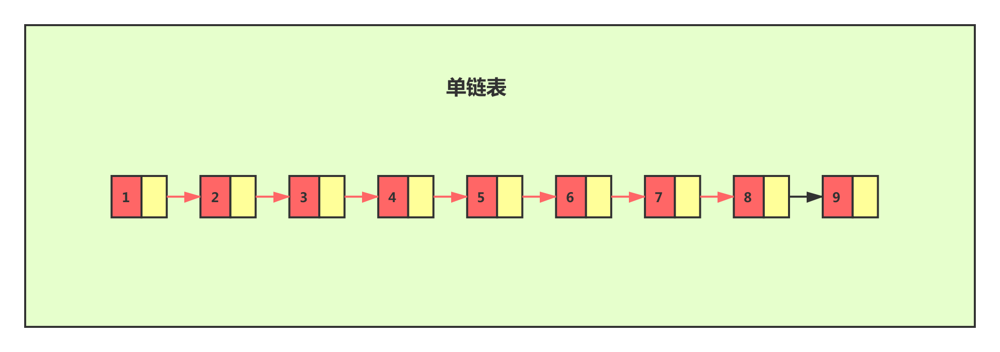
> 针对上图所示的单向链表来说，即便数据存储是有序的，我们在查找某一个数据时，仍然需要从头到尾进行遍历，这样的查找效率低下。于是，我们想，能不能给链表也创建一个索引呢？在单向链表上，每隔几个节点，就创建一个索引。
>
> 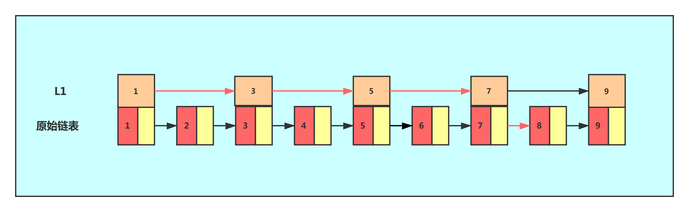
> 这样，我们在查找某一个数据时，就可以利用索引，来减少遍历的节点个数，从而提高查找效率。同理，我们再在已经创建好的索引上，利用同样的原理再创建一级索引：
>
> 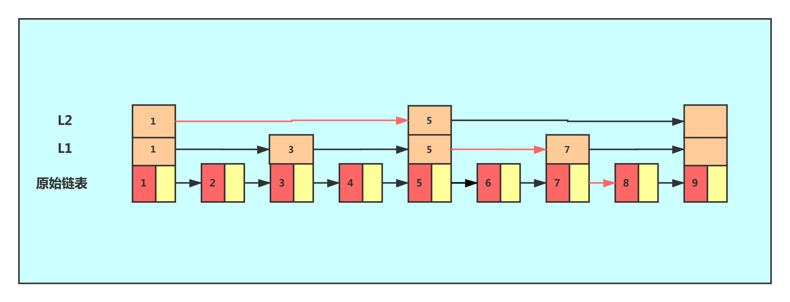
> 这样，我们查找某一个数据时，遍历到的节点个数更少了，查找效率也提高的更多了。这样我们就得到了跳跃表的数据结构：

::: details

```c
// server.h
/* ZSETs use a specialized version of Skiplists */
typedef struct zskiplist {
  // header:指向跳跃表的表头节点，通过这个指针程序定位表头节点的时间复杂度就为O(1)
  // tail:指向跳跃表的表尾节点，通过这个指针程序定位表尾节点的时间复杂度就为O(1)
  struct zskiplistNode *header, *tail;

  // length:记录跳跃表的长度，也即是，跳跃表目前包含节点的数量(表头节点不计算在内)，通过这个属性，程序可以再O(1)的时间复杂度内返回跳跃表的长度。
  unsigned long length;

  // level:记录目前跳跃表内,层数最大的那个节点的层数(表头节点的层数不计算在内)，通过这个属性可以再O(1)的时间复杂度内获取层高最好的节点的层数。
  int level;
} zskiplist;

typedef struct zskiplistNode {
    // Zset 对象的元素值
    // 在同一个跳跃表中，各个节点保存的成员对象必须是唯一的，但是多个节点保存的分值却可以是相同的。
    // 分值相同的节点将按照成员对象在字典序中的大小来进行排序，成员对象较小的节点会排在前面(靠近表头的方向)，而成员对象较大的节点则会排在后面(靠近表尾的方向)。
    sds ele;

    // 元素权重值
    double score;

    // 后向指针
    struct zskiplistNode *backward;

    // 节点的level数组，保存每层上的前向指针和跨度
    // 每次创建一个新跳跃表节点的时候，程序都根据幂次定律(powerlaw,越大的数出现的概率越小)随机生成一个介于1和32之间的值作为level数组的大小，这个大小就是层的“高度”。
    struct zskiplistLevel {
        struct zskiplistNode *forward;
        unsigned long span;
    } level[];
} zskiplistNode;

```

:::

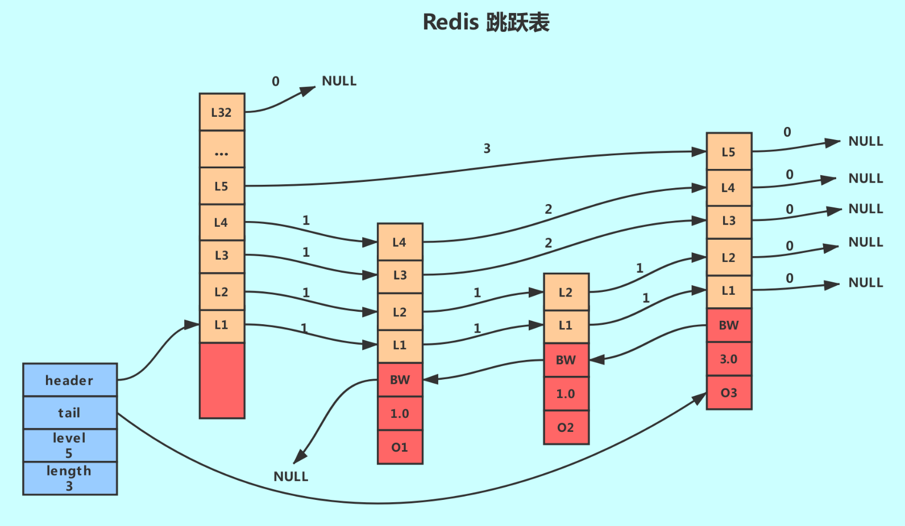

说明：

- 跳跃表事实上是基于单向链表+索引的方式实现的；
- 是以空间换时间的方式提升了查找速度；
- 代码中是有 zskiplist 节点 和 zskiplistnode 数组构成的，其中 zskiplist 中保存了跳跃表的描述信息，而 zskiplistnode 数组中主要保存的是实际的数据元素；
- 查找元素是从最高层开始查询的；
- 跨度就是元素在整个列表中的排位；
- 层高都是 1 至 32 之间的随机数

### 为什么不用平衡树或者哈希表

[作者的回答](https://news.ycombinator.com/item?id=1171423)

```c
There are a few reasons:

They are not very memory intensive. It's up to you basically. Changing parameters about the probability of a node to have a given number of levels will make then less memory intensive than btrees.
A sorted set is often target of many ZRANGE or ZREVRANGE operations, that is, traversing the skip list as a linked list. With this operation the cache locality of skip lists is at least as good as with other kind of balanced trees.

They are simpler to implement, debug, and so forth. For instance thanks to the skip list simplicity I received a patch (already in Redis master) with augmented skip lists implementing ZRANK in O(log(N)). It required little changes to the code.

About the Append Only durability & speed, I don't think it is a good idea to optimize Redis at cost of more code and more complexity for a use case that IMHO should be rare for the Redis target (fsync() at every command). Almost no one is using this feature even with ACID SQL databases, as the performance hint is big anyway.
About threads: our experience shows that Redis is mostly I/O bound. I'm using threads to serve things from Virtual Memory. The long term solution to exploit all the cores, assuming your link is so fast that you can saturate a single core, is running multiple instances of Redis (no locks, almost fully scalable linearly with number of cores), and using the "Redis Cluster" solution that I plan to develop in the future.
```

简而言之就是实现简单且达到了类似效果。

- **skiplist 与平衡树、哈希表的比较**

- **skiplist 与平衡树、哈希表的比较**

**来源于：https://www.jianshu.com/p/8ac45fd01548**`
`**skiplist 和各种平衡树（如 AVL、红黑树等）的元素是有序排列的，而哈希表不是有序的。因此，在哈希表上只能做单个 key 的查找，不适宜做范围查找。所谓范围查找，指的是查找那些大小在指定的两个值之间的所有节点。**`
`**在做范围查找的时候，平衡树比 skiplist 操作要复杂。在平衡树上，我们找到指定范围的小值之后，还需要以中序遍历的顺序继续寻找其它不超过大值的节点。如果不对平衡树进行一定的改造，这里的中序遍历并不容易实现。而在 skiplist 上进行范围查找就非常简单，只需要在找到小值之后，对第 1 层链表进行若干步的遍历就可以实现。**`
`**平衡树的插入和删除操作可能引发子树的调整，逻辑复杂，而 skiplist 的插入和删除只需要修改相邻节点的指针，操作简单又快速。**`
`**从内存占用上来说，skiplist 比平衡树更灵活一些。一般来说，平衡树每个节点包含 2 个指针（分别指向左右子树），而 skiplist 每个节点包含的指针数目平均为 1/(1-p)，具体取决于参数 p 的大小。如果像 Redis 里的实现一样，取 p=1/4，那么平均每个节点包含 1.33 个指针，比平衡树更有优势。**`
`**查找单个 key，skiplist 和平衡树的时间复杂度都为 O(log n)，大体相当；而哈希表在保持较低的哈希值冲突概率的前提下，查找时间复杂度接近 O(1)，性能更高一些。所以我们平常使用的各种 Map 或 dictionary 结构，大都是基于哈希表实现的。**`
`**从算法实现难度上来比较，skiplist 比平衡树要简单得多。**

## 总结

1. Redis 针对所要保存的键值对构造了一个基于 RedisObject 的对象系统，并且每创建一个键值对，Redis 都会为我们创建两个 RedisObject 对象，一个是键对象，一个是值对象；
2. 针对键对象，Redis 使用 SDS 的数据结构进行保存；而针对值对象，Redis 根据所保存的数据类型以及数据长度分别选择不同的数据结构进行保存，具体的数据结构有：
   1. SDS
   2. linkedlist
   3. ziplist
   4. quicklist
   5. intset
   6. hashtable
   7. skiplist
3. Redis 在选择某一种数据结构保存值对象时，并不是采用一旦确定就不再修改的策略，而是采用一种动态自适应的策略，这种策略使得 Redis 能够根据保存的值对象的长度和数据类型，动态的选择数据结构，比如保存 hash 数据时，数据量小时采用 ziplist 保存，而数据量大时才使用 hashtable 的数据结构进行保存；
4. 值对象选择不同的数据结构保存数据，也有其对应的触发条件；
5. Redis3.2 版本是一个重大更新版本，这个版本修改了 SDS 的源码，并基于 linkedlist 和 ziplist 实现了 quicklist；

> 思考题
>
> Redis 既然能够动态自适应的选择保存的值对象的数据结构，那么值对象的数据结构是否在确定之后就不再修改？还是会动态修改？如果是会动态修改，那么动态修改时的触发条件是什么？
>
> 比如，值对象起先被选择使用 ziplist 的形式保存，之后会不会根据数据长度和数据类型的变化，导致这个值对象的数据结构变成了 hashtable 呢？如果变化了，那么变化的条件又是什么呢？

## 参考

- [Redis](https://www.laoyu.site/categories/Redis/)
- [Redis 核心原理与实战](http://learn.lianglianglee.com/%E4%B8%93%E6%A0%8F/Redis%20%E6%A0%B8%E5%BF%83%E5%8E%9F%E7%90%86%E4%B8%8E%E5%AE%9E%E6%88%98)
- [Redis 数据结构](https://xiaolincoding.com/redis/data_struct/data_struct.html)
